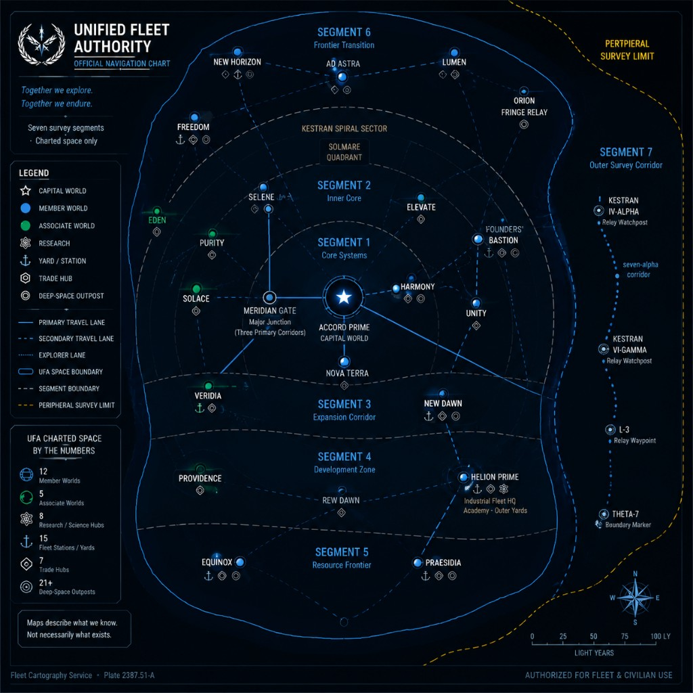

# APPENDIX

# The Kestrel Veil Incident — Reference Supplement

**Issuing authority:** Fleet Historical Office · Operations Liaison  
**Distribution:** Internal command · Academy strategic studies (abridged) · certified witness custody  
**Classification:** Restricted — operational summary  
**Status:** Compiled after first exchange; subject to revision as returns accumulate

This supplement records what Fleet institutions have **observed**, **certified**, and **routed** through the events of Book One. It does not resolve intent. It does not assign identity where observation did not support it.

---

\newpage

# APPENDIX A
# Fleet Vessel Reference

## Kestrel Veil

*Figure A-1 — Kestrel Veil external profile (reference plate, upper panel)*  
*Figure A-2 — Kestrel Veil internal systems layout (reference plate, cutaway panel)*  
*Figure A-3 — Kestrel Veil operational configuration (reference plate, profile and REING arrangement)*

**Property of the Fleet · Reconnaissance Mandate · Status: Operational (patched)**

---

### Vessel summary

| Field | Record |
|-------|--------|
| **Name** | *Kestrel Veil* |
| **Registry** | 471 |
| **Classification** | Scout-class reconnaissance vessel |
| **Service life** | Forty-plus years in continuous Fleet assignment |
| **Standard complement** | Twenty-four (scout roster) |
| **Armament** | None listed — reconnaissance mandate |

### Mission role

- Passive reconnaissance and corridor survey  
- Navigation baseline validation  
- Relay handshake and return certification  
- Listen watch and traffic acoustics collection  
- Witness custody under restricted classification

The *Veil* is not rated for independent combat action. Operational value derives from **disciplined observation**, not hull superiority.

### Operational profile

- Aging hull maintained through incremental repair rather than yard replacement  
- Crew familiarity and undocumented ship-specific procedures treated as operational assets  
- Long-service systems (Reing arrays, correction-thrust lanes, environmental plant) operated inside conservative tolerances  
- Condition note on file: *patched, not repaired* — functional margins accepted where full restoration was unavailable

### Segment Seven operational condition (certified witness record)

At completion of the segment seven reconnaissance leg and return to Fleet space:

- **Auxiliary propulsion:** degraded; correction-thrust fraction limited  
- **Main propulsion:** operational under conservative profile; not rated for rapid maneuver  
- **Passive systems:** partial rebuild; sufficient for listen watch, insufficient for active survey confidence at Fleet standard  
- **Tactical systems:** fractional capacity post-Incident; rebuilt incrementally during transit  
- **Endurance:** engineering-dependent; watch rotation and emitter discipline required to preserve margin  
- **Maneuver doctrine:** traffic humility; minimal emissions; course changes by necessity, not display

### Hull notation (observed)

- Starboard engagement scar at bearing 214 mark 6 (photon discharge window; Incident record)  
- Welded repair visible on external profile; documented in witness annex  
- REING spires (NW, NE, SE, SW): passive coverage, relay handshake, long-range discrimination — operational with age-class drift on tertiary channels

### Institutional assessment

The *Kestrel Veil* is an ordinary long-service scout that remained operational because her crew treated imperfection as a working condition. No special platform designation applies. Significance attaches to **certified returns** and **command conduct under uncertainty**, not to hull legend.

---

\newpage

# APPENDIX B
# Personnel Reference

Abbreviated assignment records. Not biographical files. Observed professional characteristics only.

---

## Captain Calder Venn

| Field | Record |
|-------|--------|
| **Assignment** | Commanding officer, UFA Scout Vessel *Kestrel Veil* |
| **Background** | Fleet Administrative Academy commission; scout command track |
| **Certified action** | Segment seven crossing command; Alpha Seven contact posture; witness synthesis under Form Seven |

**Operational significance:** First commanding officer to return certified structured-civilization observation from segment seven and to conduct acknowledged technical exchange at Alpha Seven under Edition 144 contact guidance.

**Professional characterization (witness board summary):** Maintains observation / inference separation; issues short directives without speculative escalation; preserves uncertainty in official record when evidence does not support conclusion.

Calder Venn is not catalogued as resolving the contact question. He is catalogued as **refusing to simplify it incorrectly**.

---

## Executive Officer Mira Thessaly

| Field | Record |
|-------|--------|
| **Assignment** | Executive officer, *Kestrel Veil* |
| **Prior service** | Multiple scout postings; XO under prior *Veil* command rotation |

**Operational significance:** Architect of segment seven reconnaissance summary; watch captain during extended passive legs; custody of informal command continuity record (cloth-bound notebook, ship-local — not Fleet archive).

**Professional characterization:** Converts crew observation into defensible record language; enforces discipline without theatrical command; holds the line between what occurred, what was logged, and what remains unresolved.

Thessaly's notebook is not certified Fleet custody. It is noted as a command-work product used to prevent narrative compression before witness certification.

---

## Tomás Brenner — Senior Maintenance

| Field | Record |
|-------|--------|
| **Assignment** | Senior maintenance authority, *Kestrel Veil*; ship-specific mechanical interpreter (reports under Chief Engineer) |
| **Tenure on hull** | Extended; primary interpreter of *Veil* mechanical behavior |

**Operational significance:** Maintained correction-thrust and Reing reliability through Incident recovery, VI-Gamma patch window, and segment seven endurance leg.

**Professional characterization:** Competent, dry, unsentimental; treats ship limits as facts to be worked with; known for ship-specific maintenance knowledge (documented procedures include non-manual environmental door correction). Not filed as comic relief.

---

## Dana Holt — Fleet Communications Validation

| Field | Record |
|-------|--------|
| **Assignment** | Validation Bay authority; Kestran VI-Gamma relay chain (Communications Command) |
| **Role in incident chain** | Passive witness to Ch. 5 engagement geometry; later relay validation and executive digest routing |

**Operational significance:** Bridge between shipboard returns and Fleet classification — timestamps, checksum validation, queue discipline, refusal to mobilize on incomplete packets.

**Professional characterization:** Procedural under stress; holds transmission until witness bands are intact; communicates lag and limitation without collapsing observation into Fleet narrative convenience.

*Note:* Holt is not *Kestrel Veil* shipboard crew. She is included because no certified Book One record reaches Fleet Command without her validation chain.

---

## Felix Ortega — Sensor / Listen Watch

| Field | Record |
|-------|--------|
| **Assignment** | Sensor watch; passive reconnaissance discipline |
| **Certified contribution** | Traffic acoustics logging; cluster spacing and density peaks; authentication curves |

**Operational significance:** Primary sensor voice for segment seven listen watch; Alpha Seven contact lock and post-exchange passive monitoring.

**Professional characterization:** Evidence-first; distinguishes traffic acoustics from individual operator identification; reports limits as observed (*not matched*, *cannot classify*).

---

## Jun Park — Communications / Archive

| Field | Record |
|-------|--------|
| **Assignment** | Communications and relay officer, *Kestrel Veil* |
| **Certified contribution** | Separate archive lanes; triple redundancy on segment seven returns; contact traffic custody |

**Operational significance:** Preserves shipboard record integrity when upstream relay latency and classification pressure would otherwise compress returns.

**Professional characterization:** Precision in timestamp and packet order; correlation discipline; routes information without editorializing witness content.

---

## Dr. Marcus Walsh — Medical / Crew Systems

| Field | Record |
|-------|--------|
| **Assignment** | Medical officer, *Kestrel Veil* |
| **Certified contribution** | Crew endurance monitoring; rotation compliance; post-Incident treatment continuity |

**Operational significance:** Maintains human-system readiness across extended passive operations; enforces rest-cycle accountability on command staff when warranted.

**Professional characterization:** Practical; crew-facing realism; treats fatigue and injury as operational variables, not morale anecdotes.

---

## Contact Command Authority — Vex (designation unresolved)

| Field | Record |
|-------|--------|
| **Affiliation** | Structured contact civilization (Fleet classification — internal) |
| **Observed association** | Silhouette-scale contact mass; Alpha Seven acknowledgment exchange |
| **Fleet identification** | Name, rank, and hull designation **not confirmed** in certified witness record |

**Observed during first exchange:**

- Contact chose visibility sequence; no pursuit after acknowledgment  
- Technical ID exchange completed; eleven-second relay latency noted both sides  
- No weapons discharge during exchange window (separate unresolved energy event logged on *Veil* egress — source not attributed to this contact mass)

**Professional characterization (behavioral summary only):** Restrained conduct; procedural communication; intent **unresolved** under Fleet contact guidance.

Fleet does not classify this officer as enemy, ally, or third party. Fleet classifies **conduct observed** and **identity unknown**.

---

\newpage

# APPENDIX C
# Civilizations and Political Entities

---

## Unified Fleet Authority

The administrative and operational body coordinating member-world passage, exploration, patrol, and reconnaissance across mapped relay corridors.

**Observed institutional characteristics:**

- Multi-world coordination through relay language, survey notation, and custody routing  
- Exploration and commerce prioritized alongside patrol presence  
- Doctrine and survey manuals revised when certified observation contradicts prior notation  
- Decisions distributed across Operations, Cartography, Communications, Historical Office, and Doctrine Bureau — no single desk holds complete frontier picture

Fleet Authority is not a monolith in practice. It is a **routing architecture** for competing professional readings of the same returns.

**Fleet POV limit:** The Authority knows what its certified chains contain. It does not know what it has not yet received, validated, or been permitted to compare.

---

## Member Worlds

Hundreds of worlds linked by relay corridors, trade, and shared passage law — the population and commerce Fleet serves and protects.

**Observed characteristics:**

- Wide cultural and economic diversity (industrial belts, ocean worlds, agricultural terraces, core assemblies)  
- Governance complexity: alliance, competition, and local autonomy within coordinated passage framework  
- Prosperity and routine visible in civilian traffic, Founders' Week observances, and freight rhythms  
- Not narratively perfect; not narratively evil — **operationally busy**

Member worlds produce the commerce and personnel Fleet patrols protect. Frontier maps describe Fleet survey confidence, not moral verdict on worlds beyond them.

---

## Structured Contact Civilization

*Fleet working classification — public terminology unresolved at time of this supplement.*

### Known information (certified)

- Civilization-scale infrastructure observed in segment seven volume  
- Traffic acoustics consistent with commuter windows, freight classification, and long-maintenance industrial throughput  
- Communication capability sufficient for structured technical exchange at Alpha Seven  
- Technology level: advanced relative to scout observation comfort; exact capability ceiling **unresolved**  
- Conduct during first exchange: restrained; no hostile discharge in acknowledged window

### Unresolved questions (official)

- Political structure and leadership hierarchy  
- Long-term intentions toward Fleet  
- Relationship to unresolved fringe relay return and Alpha Seven energy event (if any)  
- Internal motivations for visibility choice during first exchange  
- Whether contact civilization possesses knowledge Fleet does not regarding third-source returns

Fleet does not assign villain classification. Fleet assigns **observation bands** and waits for evidence.

### Information discipline

No entry in this supplement asserts contact civilization's self-knowledge beyond what Fleet observed. Internal debates, directorate names, and trial programs inside that civilization are **not** Fleet custody at Book One close.

---

\newpage

# APPENDIX D
# Operational Terms

Short definitions as used in certified Book One records. Not exhaustive.

---

## Segment Seven

A **geographic reconnaissance volume** along the outer Kestran Spiral — corridor designation family including seven-alpha, seven-beta, and related routing notation.

Segment seven is:

- a mapped patrol and survey assignment area  
- a volume where certified traffic acoustics contradicted Edition 143 absence notation

Segment seven is **not**:

- a vessel  
- a hostile entity  
- a command authority  
- a synonym for the contact civilization

---

## Corridor Seven-Alpha

A corridor designation within segment seven used in navigation baseline comparisons and epoch review packets. Referenced in Cartography reconciliation records and witness annex overlays.

---

## The Kestrel Veil Incident

The engagement at Kestran Spiral bearing 214 mark 6 in which:

- Scout-class contact geometry produced sustained passive lock  
- Cloak or concealment mechanism dropped (mechanism unresolved)  
- Directed energy discharge occurred  
- *Kestrel Veil* presumed destroyed in Fleet chain; hull later corrected as surviving  
- Witness fragments entered VI-Gamma relay custody

**Distinct from:** segment seven crossing (later passive reconnaissance leg) and Alpha Seven first exchange.

---

## First Doctrine (adopted Ch. 21; taught via Edition 144 primer)

Fleet operational framework established after segment seven certification and first-exchange aftermath — not a department, not a person.

**Edition 144** documents and teaches this framework in academy coursework; it does not create doctrine.

**Stated behavioral lines (authorized summary):**

- Approach as if contact is possible  
- Prepare as if capability matters  
- Do not assign intent without evidence

**Institutional function:** Replaces default absence notation where certified observation requires restraint under uncertainty.

---

## Listen Watch

Passive reconnaissance method emphasizing sustained low-emission monitoring.

**Observed layer:** traffic acoustics — cluster spacing, density peaks, baseline routing patterns, authentication density curves.

**Not observed layer:** individual operator identities, faces, or named vessels resolved from harmonics alone.

Listen watch produces **how busy the corridor sounds**, not **who** occupies it.

---

## Archive Custody

Fleet process for validating and routing recorded returns.

**Components referenced in Book One records:**

- Checksum validation  
- Custody chain headers  
- Archive bands (observation / inference separation)  
- Authentication curves on relay handoffs  
- Separate lanes until Operations or Doctrine authorizes upstream routing

Certified records live in custody chains and validated digital headers. Working hardcopy and slates support witness procedure; they are not sole authority.

---

## Validation Bay

Communications Command review node in the Kestran VI-Gamma relay chain. Validates packets before executive digest reaches Operations tier. Associated authority: Dana Holt (Book One chain).

---

## Alpha Seven

Chart notation for contact volume used in Edition 144 crossing orders. Site of acknowledged technical exchange. Not equivalent to segment seven entire volume.

---

\newpage

# APPENDIX E
# Historical Timeline

Abbreviated institutional chronology. Dates approximate where Fleet uses era notation rather than single calendar.

| Era / Event | Institutional record |
|-------------|---------------------|
| **Consolidation and relay charter period** | Member corridors joined under shared passage law; Founders' observances established across worlds |
| **Relay corridor expansion** | Survey notation extended along Kestran Spiral and outer marches; Edition 143 survey assumptions codified |
| **Routine exploration and patrol century** | Scout reconnaissance, freight traffic, and Cartography epoch adjustments treated as administrative continuity |
| **Founders' Week eve — Meridian Gate** | Analyst Maris Chen drafted segment seven baseline divergence report; transmission not authorized before medical event; packet later reclassified *antecedent unresolved* |
| **Kestrel Veil Incident** | Engagement at bearing 214 mark 6; hull loss corrected; VI-Gamma witness chain active |
| **Recovery and return leg** | VI-Gamma patch; independent transit; Fleet correction of destruction assessment |
| **Segment seven reconnaissance** | Passive crossing; structured civilization observation certified; no handshake during leg |
| **Homeward and witness certification** | Strategic Review Board; Form Seven testimony; Thessaly reconnaissance summary sealed |
| **Edition 144 development** | Cartography epoch revision; Historical Office comparison work; Doctrine Bureau adoption of contact guidance |
| **Alpha Seven crossing** | *Kestrel Veil* departure under contact doctrine; technical acknowledgment exchange |
| **First exchange** | Structured ID exchange completed; intent unresolved both sides |
| **Egress and unresolved return** | Fringe relay traffic — source unknown; possible energy event in occupied volume — attribution unresolved |
| **Edition 144 primer distribution** | Academy strategic studies updated; contact guidance enters training curriculum |

No entry beyond this table is authorized in the Book One reference supplement.

---

\newpage

# APPENDIX F
# Fleet Operational Chart

*Figure F-1 — Unified Fleet Authority operational chart. Certified survey boundaries reflect Fleet knowledge at Edition 144. Uncharted volume may contain unverified infrastructure, traffic, or civilizations.*

---

**Fleet Historical Office**  
**Operations Liaison — Book One Reference**  
**Edition 144 cycle · Restricted internal**

*Maps describe what Fleet has certified. Not necessarily what exists.*

---

**END APPENDIX**
