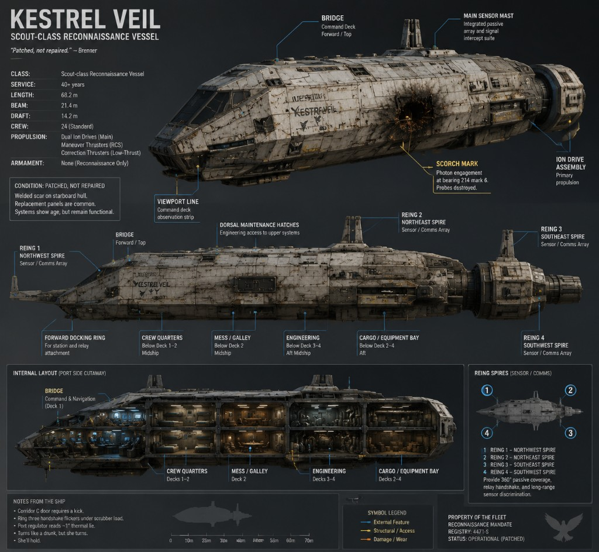

---
title: "The Kestrel Veil Incident"
subtitle: "Book One of The Solmare Cycle — Acts I and II"
author: "K.W. Abbott"
lang: en-US
rights: "Copyright (c) K.W. Abbott. All rights reserved."
description: "Acts I and II of Book One: Routine Patrol and The Kestrel Veil Incident."
---
# Prologue {.prologue}

History creates civilizations.

Civilizations create doctrine.

Doctrine creates decisions.

Decisions create conflict.

The people living through those decisions are the story.

—Fleet Academy Strategic Studies, First-Year Cadet Primer

(Edition 143)

Fleet Academy Strategic Studies

Edition 143

Required Reading

\newpage

# Archive {.archive-interlude}

**ARCHIVE**

**FSA-143-07**

Fleet Survey Authority

**Fleet Survey Manual**  
**Edition 143**

## Section 7.2 — Survey Boundary Notation

> Regions beyond established survey boundaries should be treated as unoccupied unless direct evidence indicates otherwise.

### Margin note (handwritten; instructor attribution unknown)

> Remember:  
> Maps describe what we know.  
> Not necessarily what exists.

\newpage

# Chapter 1 — The Empire {.chapter-opener}

The morning feed arrived at Meridian Gate before the station's artificial dawn cycle finished its slow climb from indigo to pearl.

Maris Chen stood at the archivist's rail on Level Nine and watched worlds appear in sequence—not as coordinates on a chart, but as living places arguing politely for her attention. A harvest festival on Verdant Line. A labor dispute settled by arbitration on Kestran's industrial belt. A poetry prize awarded on Selene's glass towers. A relay blessing at an ocean world's floating temple, where priests thanked the corridor nodes for another season of calm seas and reliable freight.

Meridian Gate was not a planet. It was a city folded into a station, hung at the intersection of three major jump corridors where the Unified Fleet Authority—what most people simply called the Empire—had decided centuries ago that commerce should never wait for permission. Maris had lived here eleven years and still loved the way the promenade smelled at shift change: spice from the Kestran quarter, salt from the ocean-world vendors, machine oil from the dock tiers, and something sweet she had never identified but associated with home.

She was not a poet. She was a Cartography Division analyst on rotation from Helion Prime, assigned to review incoming survey summaries before they entered the public archive. Her job was to notice when a world's description contradicted itself. Most days, nothing did.

Today the feed was generous.

She opened the first packet from the Central Assembly—formal, dense, and proud in the way capital documents always were. The Senate had confirmed a new trade accord with the Helion Industrial States, allies in name, competitors in every practical sense. The wording celebrated shared prosperity. The attached margin notes, written by someone who would never sign their name, mentioned tariff friction on rare isotopes and a reminder that Helion's foundries supplied half the mid-rim's hull plate.

Maris sipped her tea and flagged nothing. Allies did not have to trust one another to stay allies. The Empire had learned that long before she was born.

The founding story appeared every year in the feeds, trimmed to a sentence or a parade float. Maris had heard the full version once at academy and remembered only the diorama and the glass case around the first Relay Charter.

She scrolled.

A frontier settlement on the outer Kestran arm requested recognition as a full member world. The petition included three pages on soil chemistry and one paragraph on a school built from shipping containers that the settlers insisted was already the finest on the rim.

An exploration fleet dispatch noted successful contact with a neutral trading enclave beyond the mapped void edge—not a rival empire, not a subject world, simply a people who preferred to be paid in stories and hydroponics manuals. The dispatch recommended continued courtesy and no attempt at incorporation.

A military bulletin reported routine patrol strength along the disputed border with the Outer Rim Collectives: cold cooperation on paper, probing in practice, nothing that would interrupt breakfast.

A cultural attaché from Selene had uploaded a complaint about Core tariff bands on luxury exports; the complaint was eloquent enough to read like literature and petty enough to matter to the merchants who funded the attaché's apartment.

Maris tagged the frontier petition for senior review and leaned back as the promenade lights brightened another degree. Through the viewport, shuttles crossed in layered lanes like schools of fish following rules no single pilot had written but all of them obeyed. Beyond the glass, the jump corridors were invisible—only the traffic proved they existed.

At 0742, her colleague Tomas Rhee dropped a pastry on her console and opened the secondary feed from the cultural desk.

"You owe me for covering your Verdant harvest review," he said.

"I owe you for not filing that pastry as contraband."

He grinned. Tomas had grown up on an ocean world and still moved as if the floor might swell beneath him. "Selene segment. New concert hall shaped like a shell. Architect says sound should travel the way light does in a corridor node."

"Poetic."

"Expensive. Also structurally unsound if you ask anyone who has to maintain a shell on a station, which nobody did."

They watched a clip of Selene's rehearsal hall—musicians tuning under a dome of translucent panels while rain, real and scheduled, traced the exterior. Maris felt the familiar ache of wanting to visit every place she indexed. That was the hazard of the job: the Empire became a list of invitations.

At midmorning she left the rail for her required promenade walk—Cartography Division insisted archivists see the station they indexed—and rode the slow elevator to the trade tier. A Kestran metalworker haggled in good humor over alloy quotas. Two diplomats in formal sashes from competing Core houses pretended not to recognize each other while buying the same pastry. A cluster of ocean-world pilgrims adjusted moisture collars and laughed at how dry Meridian Gate always felt to their lungs.

Maris bought tea from a vendor who remembered her rotation schedule better than her supervisor did. "Verdant Line harvest feed came in sweet this year," the vendor said. "My cousin sends oranges."

"I saw the festival packet. The terrace cooperatives looked happy."

"Happiness is good for exports."

She smiled and continued. On the public wall, a rotating map showed member worlds and jump corridors lighting up in sequence as the morning freight reports cleared—Kestran alloy outbound, Selene textiles inbound, a Verdant Line harvest convoy tagged *on schedule*.

Briefly, as she always did on Founders' Week eve, she read the carved plaque near the chapel alcove—the one sentence every schoolchild memorized: *Many worlds, one law of passage, peace by strength and the patience to use it sparingly.*

She returned to Level Nine with tea warming her hands and the promenade noise rising through the viewport glass.

By late morning she had reviewed summaries from fourteen worlds and two station-states. Most were exactly what healthy civilizations produced—harvest yields, factory output, research requests, shipping disputes, and Founders' Week preparations beginning on the same six-day window in a hundred accents.

"Tomas," she said. "Do you ever feel like the map is bigger than the archive?"

He looked up from his own screen. "Every day. That's why they pay us to pretend it isn't."

Maris laughed and closed the frontier school packet. The promenade below her was full. Shuttles crossed in their lanes. Founders' Week banners were going up on the lower tiers.

She believed the work held. It was how the job functioned.

Helion Prime never slept. It only changed shifts.

In the Lower Meridian District, Lisette Venn unlocked her bakery before the transit lines filled, as she had done for twenty-three years since her niece and nephew depended on her for more than bread. The industrial sectors above the district glowed even at dawn—a faint aurora of foundry light that locals called the Second Sunrise. Lisette did not romanticize it. She sold coffee to dockworkers who called it the price of living in the Empire's workshop.

"Two rye, one sweet, and don't pretend you're not early for the blessing parade," she told a regular whose name she knew and whose children's names she also knew.

"I'm not early. You're late."

"You say that every Founders' Week." She slid the sweet loaf across the counter anyway. "And every Founders' Week you're early. I keep your rye on the warm rack because arguing with you is bad for business."

He laughed and took the bread. Outside, vendors were already stretching awnings in the district colors—copper and deep blue, Helion's contribution to a celebration that would repeat on a hundred worlds with different pigments and the same intention: remember how the corridors were joined, eat something good, let the children run.

Lisette's assistant, a teenager named Priya Sharma whose grandmother would later receive weekly messages from a granddaughter spending CO₂ margin in places Priya could not yet imagine, braided dough with quick hands and faster jokes.

"If the parade floats crash again, can we sell the wreckage as limited edition?"

"We can sell you as limited edition if you burn the batch."

"That's not a no."

"It's a threat with pricing implications."

Priya grinned. The bakery smelled of yeast and cardamom. Through the open door, the market street filled: fish from the refrigerated lanes, textiles from Selene's looms, fruit from Verdant Line in crates stamped with terrace cooperative seals, a musician tuning a stringed instrument whose name Lisette had forgotten and whose sound she never did.

A dockworker short on credits this week hesitated at the rye display. Lisette had seen the hesitation before she saw the man.

"Pay me Thursday," she said, wrapping two loaves. "And bring your daughter to the parade. She asked about the cardamom rolls last month."

"I didn't—"

"You did. Thursday."

He left with bread and the expression of someone who had not expected kindness to be so stubborn.

At the orbital freight terminal three levels above the district, Jun Park's mother Hye-Jin closed a ledger at the end of her night shift in the civilian cargo office. She had counted containers until the numbers blurred and still caught the error a junior clerk missed—a mislabeled medical shipment bound for an ocean world's clinic. She corrected it, signed the form, and sent a message to her son Jun on a posting she understood only as *mid-rim, safe, call when you can*.

Jun would answer when he could. He always had.

Hye-Jin bought rice cakes from a vendor who remembered her husband and did not mention him unless she wanted him mentioned. She ate standing up, as dockworkers did, and watched a crew in mixed uniforms—Fleet gray, corporate teal, independent freighter patches—laugh over a shared story about a jump exit that smelled like oranges because of a refrigeration leak.

No one in the terminal thought about border queues or Senate bulletins. They thought about overtime, schedules, the Founders' Week bonus, whether the parade would block the 0800 shuttle.

In a park near the academy district, students sprawled on grass that was real and expensive to maintain. Children chased a dog someone should have leashed. An explorer on leave told exaggerated stories about a neutral enclave that traded in hydroponics manuals; his friend, a teacher, corrected the details gently and ruined the story's rhythm on purpose.

Lisette delivered a tray of rolls to the park kiosk on credit she kept for the vendor because the woman had nursed Lisette through influenza one winter. In return, the vendor saved her a seat at the parade route.

"Your Calder still sending messages on schedule?" the vendor asked.

"Every two cycles. He apologizes for being dull. I tell him dull is a luxury some of us would like to try."

"He's graduating soon, isn't he?"

"Next week. He says it's a formality. I say formality is what keeps ships in one piece, and he sends me another schedule to prove he's eating."

"He gets that from you."

"He gets the stubborn from me. The schedules are his own fault."

They watched preparations for the blessing procession—flags, a choir from three cultural houses singing in staggered harmony, an old veteran in a dress uniform that no longer fit who saluted when the Fleet banner passed even though the banner was only a rehearsal prop.

Near the fountain, the crew of some random ship on short leave argued about which noodle stall was authentic and agreed to try all three. Priya took photographs for the district archive—Founders' Week documentation, she said, though really she liked watching people smile.

As evening approached, the market street changed character: lanterns strung between buildings, a transit line above the district slowing to let parade floats pass on the lower route, neighbors exchanging dishes from a dozen culinary traditions. Lisette tasted a spoonful of ocean-world stew from a vendor she trusted and declared it insufficiently salted—a verdict the vendor accepted as high praise.

Helion Prime was not beautiful the way Selene was beautiful or Verdant Line was gentle. It was loud, functional, and full of people who sang anyway when the parade drums started.

The Fleet Administrative Academy on Helion Prime occupied a terrace of stone and glass that overlooked the industrial aurora.

Cadet Captain Calder Venn stood in graduation rehearsal formation and counted under his breath—not cadence steps, but the number of times Commander Pell had called his name this month for treating ceremony like a verification problem. Twelve. Thirteen if you counted the sword-belt correction he still considered technically unfair.

Pell watched from the reviewing stand with the expression of a man who had seen a hundred classes graduate and still believed the next one might learn something his curriculum could not teach.

"Eyes front, Venn."

Calder fixed his gaze on the middle distance. Around him, cadets breathed in unison. Damon Reyes muttered something about the mid-rim paying better than the core; a destroyer-track classmate who had already received posting laughed too loudly on purpose.

Calder knew he would receive a scout command. The packet had been verified twice. Simulation scores supported it. Scout was not the assignment cadets whispered about in the lounge, but scout had green indicators on every readiness chart he trusted—and green indicators were how you kept people alive when systems failed without warning.

In the public gallery, families watched with the relaxed attention of people who had seen ceremonies before and still liked them. Calder did not see Lisette Venn—she never came to rehearsals, only to the formal ceremony—but he could already taste her cardamom rolls and hear her ask whether he had eaten anything that counted as food.

"Sir," Pell said after the final pass review, catching Calder as the formation broke. "The parade is not a sensor sweep."

"No, sir. But the spacing errors were measurable."

Pell's mouth twitched. "So was your simulation score on the Kestran transit failure replay. You corrected the failure mode three cycles before the board expected it. That is why you are receiving a hull number next week instead of a desk."

Calder waited for the compliment to land and felt, inconveniently, that a desk might have been safer. Safer for him. Not necessarily safer for whoever crewed the hull he would inherit. "I'll execute the ceremony correctly, sir."

"I know you will." Pell's voice softened a fraction. "Try to look like you believe in it while you do. Your aunt will be watching."

Calder nodded. "What does that require beyond correct spacing?"

He believed in procedures. Ceremonies were procedures with music. So were ships, if you respected them. So was keeping Lisette from worrying.

He did not think about the *Kestrel Veil* as his hull—only as dockyard folklore, if he thought about her at all. Scout-class postings were aging, the kind of assignment classmates mentioned with sympathetic jokes. He thought about the checklist for graduation day, the message owed to Lisette before Founders' Week peaked, and the pre-digital almanac on his shelf he had opened last night out of habit, not superstition. Old routes. Known solutions. He liked known solutions because unknown ones had already taken enough from him.

At the terrace rail, he watched the Second Sunrise pulse beyond the glass and felt, for half a breath, the childish awe he had trained himself to file under *industrial output*. Then he checked tomorrow's schedule again because checking twice was how you kept errors from becoming tragedies—and because Lisette deserved at least one person in her life who verified things before they went wrong.

In the Lower Meridian District, Lisette closed the bakery after the parade and counted the day's receipts with Priya's help. They donated unsold sweet rolls to the night shift at the freight terminal. Hye-Jin Park took two and saved one for Jun's message window.

Calder returned to his quarters, opened a draft to Lisette, deleted three sentences that sounded too formal, and wrote: *Graduation rehearsal complete. Pell says I must look like I believe in the parade. I believe in your rolls. I will come to the bakery after the ceremony if you will feed me. Tell Priya fleet ration is still an insult.*

He sent it. He reviewed tomorrow's schedule a third time. He slept.

Outside his window, Founders' Week lanterns moved through the district in rehearsal for the blessing procession. Somewhere above the foundries, the Second Sunrise pulsed steady and industrial and alive. Graduations waited. Commissions waited. The Empire looked toward tomorrow the way it always had—busy, confident, and certain that ordinary days would keep coming.

By afternoon on Meridian Gate, the public archive had given way to the cartography annex—the secondary queue Maris reserved for frontier survey metadata that rarely became urgent until someone tried to plot through it.

The annex opened at 1400—the same recycled air and row of terminals as every other shift.

Maris Chen had requested the Segment Seven reconciliation set three cycles ago—routine cross-checks between navigation baselines, relay epoch shading, and filed survey returns along the outer Kestran arm. She had spent eight years in Cartography before supervisors learned she would reopen an epoch adjustment others considered settled. She was still paid by Cartography, still slept in Meridian Gate quarters, still answered to supervisors who thought her real job was making the map agree with itself.

Most analysts validated packets. Maris reconciled them.

She filtered the afternoon load: epoch adjustment notices, navigation baseline comparisons, scout return summaries, relay refurbishment logs, historical anchor reviews, passive return supplements marked *routine*. Tomas Rhee brought coffee and did not ask why she had pulled Segment Seven again.

"Founders' Week," he said, by way of explanation for why the queue was fat.

"Founders' Week," she agreed.

Segment Seven occupied the public archive as frontier—open notation, sparse infrastructure, the comfortable label *outer marches* on maps that had not required controversy in years. Survey crews treated it as calibration work at the edge of boredom. Cartography treated it as metadata that should stay quiet.

Maris read the first packet and felt nothing but the usual fatigue of a queue that would outlive her shift.

Relay maintenance on seven-beta: refurbishment completed on schedule; routing tolerance within posted limits. Maris tagged it *expected drift* and moved on.

The second packet made her pause.

A scout return filed navigation baseline against epoch 143 shading; corridor segment seven-alpha showed a persistent offset—small, within validation band, repeating across three independent observation windows. The analyst note attributed it to cumulative navigation error.

Within tolerance,* Maris thought. *But why does it repeat?

She opened a side pane and pulled last cycle's seven-alpha summary. The offset had been present then, smaller, filed as relay timing lag.

The third packet arrived with her tea going cold.

Cartography epoch desk had reopened seven-alpha routing overlay—an adjustment that should have been settled two cycles ago. Reason code: conflicting survey returns. All returns had passed validation.

She opened four more, faster now, because her mind had started comparing before her display finished loading.

A chartered survey platform noted historical positional anchors from an eleven-year-old frontier pass no longer seated cleanly against current passive returns—both datasets green, neither wrong alone. Navigation had posted a baseline revision for the Kestran outer marches segment; the revision was minor, the frequency was not. Two scout-class surveys filed within the same week: different crews, different sensor platform generations, both within tolerance, mutually exclusive on one routing junction if you held the pattern still long enough to care.

Any one report still had a benign explanation if you wanted one.

Maris still wanted one. Aging relay infrastructure. Outdated propagation models. Cumulative navigation error. Mapping drift at the edge of survey confidence. Sensor calibration differences between sensor platform generations.

The models had required another correction. Cartography had reopened an epoch adjustment that should have been settled years ago. Three independent surveys had all passed validation. They still refused to agree.

She sat back and said, very quietly, "That's not relay aging."

Tomas looked up.

"That's not drift you patch at the relay," she said. "That's the baseline refusing to sit still."

She looked at the correlation pane again. "There's something out there. Something unaccounted for on every chart we've filed."

Reconciliation failure was not dramatic. It was what happened when competent professionals could not make the data fit—and Segment Seven had been fitting, quietly, for years.

Fleet Cartography had to see it. Not after Founders' Week. Not after each packet was read in isolation and filed as local noise. Now.

She began a priority draft on the secure template she had used twice before in her career, both times for inconsistencies senior desks had downgraded until secondary review proved them structural. Her hands were steady. Her caution was not. The title field accepted: *Segment Seven Frontier—Persistent Survey Baseline Divergence Requiring Epoch Review.*

Section one: individual reports, sourced, timestamped, stripped of adjectives. Section two: correlation map—positional drift against baseline revisions against reopened epoch flags against mutually exclusive validated returns. Section three: still blank. Assessment and recommended escalation. Immediate transmission to Fleet Cartography Command.

"Tomas," she said without looking up. "If you were seeing relay timing lag, would you reopen the epoch or reseat the anchor?"

He leaned over her shoulder, read two lines, and went very still. "I'd reopen the epoch."

"Me too." She pulled up the escalation pathway on the template. "This isn't local noise. This is the segment not agreeing with itself."

He did not ask if she was sure. He had seen her be right before.

At 1547 she saved the draft to the annex queue—priority flag pending her completion of section three, biometric handoff required before transmission. Standard procedure. The system auto-saved every four minutes.

She needed twenty minutes. Maybe thirty. One more pass through the scout returns to see whether the offsets formed a pattern or a scatter.

She stood, rolled her shoulders, and told Tomas she would take the quick loop to the chapel tier—twenty minutes to finish section three in her head.

"You want anything from the promenade?" he asked.

"Oranges if the Verdant vendor still has them."

"Copy."

Maris took the secondary transit corridor from Level Nine to Level Six—a route she had walked four times a week for eleven years, past maintenance hatches she no longer noticed and a viewport she always noticed anyway. Shuttles crossed the dark beyond the glass. Founders' Week banners had already gone up in the lower tiers, copper and blue and a dozen imported pigments.

She had promised herself she would make her grandmother's pie this Founders' Week instead of buying one from the promenade—if the Verdant vendor still had apples worth using. Cinnamon, at least. She added it to tomorrow's list in her head and went back to section three.

Halfway down the corridor her vision narrowed—not pain, exactly, a sudden wrongness, as if someone had dimmed the station lights only for her.

She thought: *Not now—*

Her hand found the bulkhead. Her mouth tried to form Tomas's name.

Maris Chen's knees failed. A maintenance technician three meters behind her shouted for a med team.

Tomas reached the chapel tier with oranges in a paper bag. He came back when she did not.

The draft saved at 1551. Sections one and two complete. Section three empty. Priority transmission never authorized.

At 1600, queue hygiene moved it behind Founders' Week traffic summaries.

Tomas told her supervisor. The escalation pathway opened—and stalled on blank section three and a dead assessor.

On Helion Prime, parade drums rehearsed in the Lower Meridian District. Calder Venn slept with tomorrow's schedule verified three times. Lisette had already donated the unsold rolls.

Maris Chen had almost warned Fleet Cartography in time.

She had not.

\newpage

# Chapter 2 — A Captain's Dream {.chapter-opener}

Founders' Week turned Helion Prime's academy terrace into something the manuals never described: a parade ground with music.

Fleet Administrative Academy graduation was always formal. Today it was also festive—lanterns strung along the stone colonnade, choir voices from three cultural houses braided into the anthem, families in the public gallery wearing colors from a dozen worlds. Beyond the glass, the Second Sunrise pulsed over the industrial districts—the foundry aurora locals treated as weather.

Cadet Captain Calder Venn stood in final formation, sword belt finally corrected to Commander Pell's satisfaction, and watched the reviewing stand the way he watched any system due for verification: details logged, deviations noted, corrections executed before they became failure.

Damon Reyes stood two positions to Calder's left, jaw tight with the effort of not grinning during the invocation. Sera Okonkwo held the center file with the stillness of someone who had already decided she belonged on a combat deck. Marcus Hale—destroyer track, loud in every context—had acquired a miniature Fleet banner and concealed it against his thigh, mouthing a first-officer timeline he had already memorized to the hour.

Calder did not have a banner. He had a checklist.

The terrace stone was worn smooth where generations of boots had found the same spacing marks—today hidden under copper-and-blue bunting the Senate delegation would store and bring out again next year because tradition was cheaper than reinvention.

Fleet chaplain Adeyemi led the invocation in three languages. Calder mouthed the responses and watched the gallery. Lisette had taught him to locate the people you loved before you tried to feel proud alone.

She was there. Third row. The hat she swore she did not own and wore anyway.

The invocation ended. Pell's voice carried without amplification—the habit of a man who had commanded attention before he had commanded ships.

"Cadets of the Fleet Administrative Academy, Helion Prime, Founders' Week cohort—"

The class answered in one voice.

Calder felt the words land the way ceremony always landed for him: as obligation first, meaning second, music third. He had spent four years learning that feelings were not less real for arriving after procedure. Lisette had taught him that before the academy ever did.

Commendations followed—simulation, navigation, logistics. Okonkwo accepted the combat citation with a nod. Reyes took cartography and looked, for one unguarded second, like a man given permission to keep asking questions.

Calder's name came mid-list: highest composite on the Kestran transit failure replay; early cascade correction; recommendation for independent command.

Applause rolled across the terrace. In the gallery, Lisette Venn rose before she remembered she hated standing in crowds, then sat, then stood again because Calder was looking.

He did not smile on the formation line. He nodded once—the acknowledgment he gave systems that reported green.

The oath came next—words older than the terrace, sworn to a Fleet that had kept peace long enough for children to grow up thinking peace was weather. Calder spoke his line without stumbling. One hundred and forty-seven voices made the same promise.

Pell presented Calder's sword with the same correction he had made at rehearsal—belt angle, grip, the small geometry of dignity. Commissioning pins came last. Metal against collar. Weight against skin.

Drums began somewhere below the terrace as the graduates broke formation and became officers the Fleet could assign, deploy, and depend upon. Confetti from the lower districts drifted past the glass—biodegradable, dyed, ridiculous, perfect.

Calder's pin felt heavier than its mass.

Pell found him at the terrace rail after the crowd swallowed the class into congratulations. The commander carried two cups of tea—the good kind from the academy mess, not the ration kind—and handed one to Calder without preamble.

"Your aunt is trying not to cry in public," Pell said. "She is failing with dignity."

Calder looked toward the gallery. Lisette was indeed failing with dignity, wiping her eyes with the heel of her hand while Priya offered a napkin and a look that said *let her*.

"I'll see her after the receiving line, sir."

"You will." Pell leaned on the rail beside him, not quite shoulder to shoulder. "I am not going to discuss tactics with you today."  

Calder had prepared for tactics. Simulation postmortems were safer than whatever Pell's expression suggested. "Sir?"

"Ships are easy." Pell watched the graduates below—Hale already boasting, Okonkwo already listening to a destroyer captain with professional attention. "Systems have manuals. Failures have signatures. You can train a competent officer to read both in a year."

He paused long enough for Calder to understand a second sentence was coming.

"People are difficult."

Calder waited.

"Your crew will not remember your best verification cycle," Pell said. "They will remember whether you made room for their expertise when you were frightened. They will remember whether you asked before you assumed. They will remember how you made them feel on the days nothing went wrong and on the days everything did."

"I intend to follow procedure, sir."

"So do I. Procedure is the floor." Pell's mouth twitched—not quite a smile. "Do not confuse authority with leadership. Authority is what the pin gives you. Leadership is what they give back when you have earned it."

Calder looked at the pin on his collar. "How do I earn it?"

"Badly, at first. Then honestly." Pell straightened. "You will command people who know the ship better than you do. Ask them. Record what they tell you. Do not treat their experience as noise in your dataset."

Calder opened his mouth. Closed it. Nodded.

"Come find me after assignment posting tomorrow if you want to argue about sensor sweeps. Today, go eat your aunt's bread and let someone be proud of you on purpose." He paused. "I know it is not your way. Give her a hug. She is proud of you."

Calder saluted. Pell returned it without ceremony.

"And Venn—"

"Sir?"

"Look like you believe in it while you do."

Calder almost said *ceremonies are procedures with music*. He thought Lisette would approve of the sentence and Pell would not. "Yes, sir."

The receiving line took an hour. Families, instructors, classmates, sponsors from industrial houses that recruited fleet talent the way orchards recruited seasonal labor. A Selene textiles representative pressed a scarf into Calder's hands—"For your first cold wardroom"—and laughed when he tried to return it with a receipt mindset.

Reyes clasped Calder's forearm and said, "Exploration cartography track—*Meridian Echo*. Not glamorous. Maps are good, though. I'll send you coordinates the archive hasn't earned yet."

"Send them."

"They won't match on purpose. Archive says one thing; the sweep says another. That's usually where the answer is."

Okonkwo's handshake was competitive even in congratulations. "Destroyer escort, *Vigilant Threshold*. Try not to need rescue from my sector."

"I'll schedule the embarrassment for your first leave."

"Schedule it after the parade. I'll be busy being impressive."

Hale laughed too loudly and announced he was reporting to a cruiser in three days, reciting the departure hour like a transit schedule. "You'll visit. First officer by thirty. Book it."

"I'll book the bakery instead. Lisette feeds cruisers too."

Instructor Mara Chen—no relation to anyone Calder knew of—shook his hand with simulation instructor formality. "You corrected the Kestran replay early. Do not waste that instinct on paperwork once you have a crew."

Calder could see the class's future in postings not yet read aloud—instructors embracing students they had corrected in public, banners snapping over a terrace full of people who expected the Fleet to keep doing what it had always done.

He expected it too. That was the point of graduation.

Lisette found him last.

She smelled like cardamom and yeast and the industrial district's perpetual faint ozone. She hugged him the way she had hugged him at sixteen when the transit investigators finished their reports and still had not brought his parents back.

"You ate," she said. It was not a question.

"I ate."

"You're lying. I can tell. Your shoulders go up."

Calder let his shoulders down. "I'll eat at the bakery."

"Good." She adjusted his collar pin with the proprietary precision of someone who had hemmed his dress uniform twice. "Tomorrow they tell you where you're going. Tonight we celebrate what you've already done."

"Assignment posting is tomorrow?"

"That's what the bulletin said. Don't start scheduling until you've been scheduled."

He walked her toward the transit lift. Festival lanterns reflected in the terrace glass. Somewhere below, the blessing procession rehearsed again—drums, voices, the Empire practicing joy because joy, too, was a tradition worth maintaining.

Lisette talked on the lift the way she talked when she was happy and trying not to show how afraid she had been for four years.

"Priya's taking photographs tomorrow at the parade route. I saved you a seat. Don't schedule yourself out of it."

"I won't."

"You'll try. Then you'll check your tablet twice and pretend you forgot until I send Priya to collect you."

Calder almost argued. He had learned not to argue with accurate predictions. "I'll be there."

"Your mother used to hate ceremony," Lisette said, quieter. "She loved what it meant. You're like her that way. All procedure until someone needs you to be human."

He did not know what to do with that sentence except carry it. "I'll be human at the bakery tonight."

"Good. That's an order from civilian command."

At the lift doors Calder stopped her with a hand on her sleeve—the gesture surprised them both. He hugged her before he could schedule the impulse away, quick and tight, his face against her wool coat. "Thanks for the food," he said, muffled and earnest.

She kissed his cheek—the quick version, public enough to be decent, private enough to count—and merged into the blessing crowd moving toward the lower districts. Calder watched until he lost her hat in the color and noise, then returned to academy housing alone.

His quarters were quiet. He hung the dress uniform with the care Lisette had taught him, set the pin in its case, opened it once more, closed it again—verification, not vanity.

Outside, parade drums continued.

The Lower Meridian District bakery had been in Lisette Venn's family for two generations—first as a freight-worker lunch counter, later as the cardamom roll institution Calder had grown up believing was the correct shape of bread.

Tonight it was also a party.

Lisette had pushed tables together before Calder arrived. Neighbors brought dishes without being asked: ocean-world stew, Selene flatbread, Verdant Line fruit preserved in syrup, a casserole from the deck above that claimed to be traditional and was, at minimum, enthusiastic. Priya had hung Founders' Week lanterns in the window and taken photographs for the district archive with the solemn joy of someone who believed documentation was a form of love.

On the back wall hung the photograph Lisette brought out every Founders' Week—freight workers in her grandmother's bakery line, the old Fleet banner smaller than the histories pretended. She never lectured about it. She let people look.

Calder always looked.

Calder ducked through the door in civilian clothes and was applauded before he had closed it.

"Captain," said Mr. Osei, who bought rye on credit Thursdays and always paid on Thursdays. "We expected a commodore by the sound of your scores."

"Cadet Captain until the paperwork catches up," Calder said.

"Same thing with better bread."

Lisette shoved a roll into his hands. "Eat before you talk."

He ate. Cardamom, butter, the slight crunch of sugar Lisette insisted was not excessive. His shoulders dropped without being commanded.

Priya poured tea. Hye-Jin Park, Jun's mother from the freight terminal, arrived still in uniform and set down a tray of rice cakes. "My son sent congratulations," she said. "He cannot call until relay window. He said to tell you mid-rim pays better than the core."

"Reyes said the same thing at graduation," Calder said.

"Then it must be true."

The bakery filled with the noise of people who liked each other—arguments about parade routes, a dockworker's story about a jump exit that smelled like oranges after a refrigeration leak, Captain Aldric on the fourth floor recounting a carrier-deck Founders' Week forty years ago with the serene inaccuracy of memory improved by retelling.

Aldric raised his cup. "First command?"

"Tomorrow I find out which one."

"Then here's the only fleet advice that ever mattered on a carrier: feed your people before you brief them. Your aunt's been doing it longer than most captains. Learn from her."

Lisette, passing with a tray, said, "He's a terrible student."

"I'm an excellent student," Calder said. "I eat on schedule."

"On *your* schedule. Which is not a schedule. Which is a rumor."

Laughter moved around the tables—the easy kind that did not need a punch line, only recognition. Calder listened more than he spoke. That was his habit in rooms where he belonged.

Mr. Osei told a story about a freighter captain who had docked at Helion Prime during a Founders' Week storm twenty years ago and paid his bakery debt in engine parts because credits were frozen and bread was not. Lisette had accepted the parts. The bakery's old mixer still ran on one of them.

"That's why we toast doors," Priya said quietly when Mr. Osei finished. "Half this room is alive because something broke and someone fed them anyway."

Calder knew what she meant. The Empire wasn't the flag passing overhead. It was the ordinary things that worked because millions of people did their jobs—bread on credit, relay windows from sons on distant postings, neighbors who looked after one another. If it failed, people like Lisette would feel it long before anyone in the Central Assembly did.

Lisette sat beside him long enough to be noticed, then moved—hosting, correcting salt, refusing payment from someone who needed saving face more than profit. She had raised him to be self-sufficient and still watched him eat as if he might forget again.

"What are you hoping for tomorrow?" Priya asked quietly.

Calder considered lying. The room assumed excellence the way rooms assumed sunrise. Hale had a cruiser. Okonkwo had a destroyer escort. Reyes had mapping work on a respectable hull. Calder's composite scores were on the commendation list Pell had read aloud.

"Something that uses what I trained for," he said. "Independent command if the board agrees."

"Independent command," Lisette repeated, pleased. "See? Stubborn and correct."

An industrial sponsor had shaken his hand at the receiving line with the confidence of a man recruiting future administrators. A classmate's mother had said, _You'll be on a flagship by thirty_. Calder had not corrected her.

He let the room's assumption settle around him like a blanket. Warm. Undeserved, maybe, but warm.

Mr. Osei raised his cup. "To Calder Venn. May your ship have good doors and your crew have good sense."

"To good doors," the room echoed.

Calder drank. Doors were a reasonable thing to toast. He thought about assignment posting in the morning and felt, for the first time in months, the specific lightness that came from finishing a long verification cycle.

The parade drums sounded in the distance. Children ran past the window chasing a dog someone should have leashed. Lisette donated the last tray of sweet rolls to the night freight shift the way she always did during the festival week, because prosperity was only real if you practiced sharing it.

Later, when the crowd thinned, Lisette brought out Founders' Week fortune rolls—plain dough around a slip of paper no one pretended was mystical. Calder drew: *You will find a door that sticks and make peace with it.*

He ate it. Lisette watched him chew and said, "Priya writes those. Don't give them too much credit."

"I won't."

"Liar. You'll remember that one."

Calder stayed until the lanterns dimmed and the neighbors went home. He washed dishes because Lisette hated washing dishes. She pretended not to notice and left a second roll on the counter for his transit back to academy housing.

"Tomorrow," she said at the door, "whatever they give you, you come here first."

"Before or after I argue with the posting officer?"

"After. Argue on your own time. Bring the paperwork. I'll feed you while you complain."

He kissed her cheek—the affection he allowed himself without translating it into words. "I believe in your rolls."

"Finally. A sensible officer."

On the transit ride back, Calder did not open the assignment preview he did not have permission to access. He slept.

Assignment posting took place in Academy Hall the morning after graduation, while Founders' Week crowds moved through the lower districts and the Empire continued its week-long argument about which noodle stall was authentic.

The hall was built for occasions that changed lives quietly. Wood panels absorbed sound. Banners hung high enough not to distract. One hundred and forty-seven graduates sat in assigned rows. One hundred and forty-seven posting officers stood ready with sealed packets. The air smelled of paper and anticipation.

Calder sat with his hands flat on his knees.

Admiral Sorensen, guest of honor, spoke briefly about service—not glory, service. Calder listened because listening was respect made practical. Then the postings began.

The cruiser assignments went first—names Calder knew, voices he had heard in simulation debriefs, futures that sounded like the Fleet recruitment broadcasts of his childhood. Tanaka's cousin, whom Calder had met once at a district festival, received a diplomatic escort and cried without embarrassment. Hale shouted the cruiser name like a transit announcement when his packet opened. No one shushed him. Enthusiasm was permitted on assignment day.

Destroyer escorts. Exploration vessels with survey mandates. Diplomatic escorts. Research commands in comfortable orbits. Supply convoy leadership.

Okonkwo received *Vigilant Threshold* and did not shout. She simply stood, packet in hand, already aboard in her mind.

Reyes opened his exploration cartography posting and exhaled the way navigators exhaled when a solution locked.

Calder waited.

His record suggested an excellent command—simulation scores, early failure correction, commendation on the terrace. The posting officer reached his row. Names continued. Calder's row thinned.

He told himself waiting was sequence, not punishment. The Fleet posted in order to prevent favoritism from becoming policy.

His name was not next. Then not next again.

The officer called, "Venn, Calder."

Calder stood. Walked forward. Accepted the packet. Broke the seal.

The first line was assignment class: Scout Vessel, UFA Reconnaissance Platform.

Not a cruiser. Not a destroyer. Scout.

He turned the page.

Registry: Kestrel Veil.

The name was familiar. That it was his was not.

The hall did not go silent all at once. Silence moved like a wave—first the graduates nearest him, then the rows behind, then the instructors' section where someone said, too clearly, "You're kidding."

Another voice: "She's still in service?"

A third, softer: "I thought they finally retired her."

Calder read his assigned berth number. Helion Prime outer yards. Fourteen-C. Standard reconnaissance mandate. Green indicators on readiness charts he had not yet opened.

Scout was not the assignment cadets whispered about in the lounge. It was also not the assignment this room had been congratulating him for last night.

He looked up.

Commander Pell stood along the side wall with the other instructors, hands clasped behind his back, watching Calder's face the way he had watched Calder's simulation replays—not for drama, for data.

Calder met his eyes. Nodded once.

Pell nodded back.

Calder closed the packet. "Acknowledged," he said to the posting officer.

He returned to his seat with steady steps. Reyes touched his sleeve as he sat—brief, private, *later*. Okonkwo did not offer sympathy, which Calder appreciated. Hale whispered something about salvage yards that Calder chose not to hear.

Calder opened the packet far enough to read crew complement and outgoing captain's name—Dennett, rotated eleven days ago. The ship had kept crew and repairs without him. He was the variable. The hull was the constant.

Not discouraging. Clarifying.

He closed the packet and sat through the remaining postings with his hands flat on his knees. The Fleet watched how officers received bad luck the same way it watched how they received good.

When the hall emptied, Pell was gone. A note waited in Calder's message queue instead:

The ship is older than the file makes her sound. The crew is competent. Come to my office if you need to argue. Do not argue in the bakery.

Calder read it twice. Deleted the reply he drafted. Wrote: *Understood. Thank you, sir.*

Lisette's message arrived before he reached the transit lift: *Whatever it is, come here first. I have rolls.*

He did not open the packet again on the ride to the bakery. He would open it at Lisette's table with bread in front of him, because some procedures were easier if you fed the human subsystem first.

Lisette took one look at his face and put the kettle on without asking.

Priya cleared the back table. Mr. Osei, who had come for morning bread, took his loaf and left with the discretion of a man who had survived three wars' worth of neighborhood news.

Calder set the packet on the table. Lisette set a roll beside it.

"Scout command," he said.

"Independent command," Lisette said. "You trained for this."

"Scout vessel *Kestrel Veil*."

Priya, still within earshot, winced sympathetically.

Lisette read the summary over his shoulder—berth, mandate, crew complement listed, acceptance timeline. Her mouth tightened at the maintenance annex thickness, not at the assignment itself.

"The annex says she's old," Calder said.

"The ship is a ship. You're the captain they assigned." She sat across from him. "Are you disappointed?"

He considered the honest answer. "Yes." He paused. "What does that change?"

"Good. Honest is allowed." She pushed the roll closer. "Are you refusing?"

"No."

"Then eat. Then go see her. You don't judge a loaf by the wrapper."

Calder ate. The disappointment did not vanish, but it made room for something else—the annex thickness, a hull name half the hall recognized, a question about why a ship with that reputation still had green indicators on the summary page.

He spent an hour at the bakery, sent Reyes a message—*Assignment received. Drinks when you are back from mapping heaven*—and took the transit to the outer yards.

Helion Prime's industrial berths smelled of solvent and hot metal even through the airlock filters. Founders' Week had reached the shipyards—fresh paint on parade-ready hulls, inspection crews working double shifts, destroyer escorts gleaming under floodlights as if they had been built yesterday.

Calder carried the assignment packet in the rigid case that had survived three academy postings. Subsection Nine was a canyon of hulls and scaffolding, voices echoing off plating, cranes moving with the unhurried confidence of machinery that had never been asked to impress anyone.

He passed Berth 11 first—a frigate with a fresh dorsal repaint so sharp the new gray hurt to look at under floodlights. Berth 12 held a courier clipper whose crew sang while polishing access hatches. Berth 13 was empty, reserved for a demonstration sail the yard master had been boasting about all week.

Berth 14-C did not care about demonstrations.

The tram dropped him at the cradle strip. The maintenance annex was already loading on his tablet—he had held off reading it until he saw the hull. Files described systems. They did not describe presence.

He looked up.

The scar ran along the starboard mid-hull—fore to aft, nearly thirty meters, visible before he registered anything else about the ship. Plating had been replaced decades ago; weld seams were competent; paint and patch had softened the edges without erasing them. The concavity beneath the repairs still read as catastrophe—a direct strike profile consistent with a cruiser-grade primary battery, or larger.

A scout hull should not have survived it.

He had trained on hulls the recruitment packets used—clean profiles, synchronized panel standards, the fiction that the Fleet only commissioned what looked ready. Disappointment registered first. Curiosity followed anyway: three alloy generations on one frame, notation standards retired before his first year, survivability that should have ended in a salvage write-off. Something had kept her in service. The annex would call it certification. His eyes were not convinced yet—but they were interested.

Calder stood on the observation strip long enough for the tram to leave without him.

The *Kestrel Veil* sat on her landing cradles in the shadow of prettier ships. Her frame was narrow—reconnaissance class, built to observe and report, not to absorb warship fire and remain a frame at all. Yet here she was: faded paint the color of old paperwork, replacement panels in three different alloys stamped with yard codes from different decades, antenna housings upgraded at least twice, maintenance markings layered in yellow, white, and the pale blue of a notation standard retired before Calder entered academy.

Nothing matched.

Everything looked functional.

Barely.

Status lights pulsed on the bridge blister. A cargo drone hummed at the aft lock. From the same direction came a low environmental thrum Calder felt in his teeth before he heard it—old frequency, still within spec. Somewhere inside, metal struck metal in the rhythm of repair.

Calder opened the maintenance annex and scrolled: environmental regulators within tolerance but outside comfort; sensor dropouts on the tertiary channel; galley sodium drift; three doors with intermittent authority recognition; cargo lift three requiring manual cycle; mixed-generation lighting in corridors B and C; port aft wiring *obsolete but stable if nobody opens the panel without me*—Koss.

Nothing mission-ending. Everything demanding attention.

A handwritten addendum—unsigned, engineer's capitals: *Door 7-C: kick lower-left seam. Cargo lift 3: hold manual switch four seconds. Do not open port aft junction without Koss. —B.*

Forty typed pages. One page of how the crew actually lived aboard.

Two yard techs on the adjacent catwalk noticed him at the scar.

"First time?" the older one asked.

"Berth walk-through."

"Walk-through's generous," the younger said.

The older tech tapped plating below the scar. "Juno. Meteor. Pick one."

"Lost both engines. Still made port." Knock on the hull. "Typical Veil. Everything attached breaks. She doesn't."

"Salvage keeps expecting to collect her," the older one said, turning back to his panel. "She keeps disappointing them."

Calder pulled the damage history appendix. Three lines. *Starboard breach event, classified engagement-adjacent, 2198. Emergency plating and frame reinforcement completed Helion Prime yards. Full structural certification issued. No further action required.*

No opponent class. No explanation.

He measured the scar anyway. The numbers matched what his eyes already knew.

Calder circled the hull once more and counted panel stamps—yard code, year, alloy batch. Three generations of repair on one continuous frame. Each weld someone else's watch, someone else's choice to fix instead of scrap.

Brenner's addendum in block capitals. The tech's *Typical Veil* delivered like a fleet toast. Nearly everyone walking Subsection Nine would see an obsolete hull. Calder was starting to see fourteen people and forty-seven years of not quitting.

At the gangway, a bosun checked his credentials and waved him through. The *Veil* did not perform for visitors. She tolerated them.

The gangway flexed under his boots, carrying the same low thrum up through the deck. Handrails replaced with slightly thicker units. Access panels secured with fasteners from two standards—each mismatch a previous crew's solution, still holding.

Calder crossed into the airlock and paused.

The hum followed him inside. Recycled air, machine oil, yesterday's coffee from the galley cycle—the working smell he had caught at the aft vent, now sealed in with him.

The corridor beyond was narrow, worn, unevenly lit—deck polish from feet, hand marks on the bulkhead where crew steadied themselves during yard power cycling, a dent in yellow tape nobody had bothered to fix because it wasn't structural and everyone knew where it was.

A maintenance tech passed with a toolkit older than Calder's academy textbooks. She nodded without stopping.

One lighting panel ran bright white. The next ran amber. A third flickered at tolerance's edge, labeled in tape: *DO NOT TOUCH — BRENNER LIED ABOUT FIXING THIS*.

Old. Not broken. Just old.

Footsteps approached from the direction of the command deck—measured pace, the walk of someone who had made this commute for years.

Executive Officer Mira Thessaly rounded the junction with a data slate under one arm and stopped when she saw him.

"Captain Venn."

"Executive Officer Thessaly."

"Welcome aboard." She glanced at the scar through the viewport. "Let's see what we've got."

No sarcasm. No apology. No pity.

Calder looked at the welded seam—a long pale ridge against darker hull.

"Show me the gaps first," he said quietly. "Then the green boards."

\newpage

# Chapter 3 — The Ship That Refuses to Die {.chapter-opener}

Thessaly nodded once—not agreement, not disagreement. Assessment pending.

She turned toward the command deck without offering her arm. New captains found their own way through the corridors. The crew had learned to read them by how they walked the first hour.

Calder followed.

Sound came in layers as they climbed. The environmental thrum he had felt in his teeth on the gangway deepened—forty-seven years on the same note. Deck plating flexed where yard specs said it should not, within tolerance where the manual said it must. Hand marks on the bulkhead at every power-cycle junction: palms placed without looking, weight transferred, bodies that had made this climb in bad weather and good.

Corridor B ran bright white into amber into a panel that flickered at the edge of regulation. A strip of yellow tape marked a dent in the port-side bulkhead—non-structural, documented, ignored. Calder's boot caught the edge of it anyway.

Thessaly did not comment. She had stepped around it without glancing down.

"Bridge is forward," she said. "Galley aft on this deck. Engineering access is down, not up—new captains always go up first."

Calder noted the correction. "Noted."

At the junction for Corridor C, an environmental door sat half a millimeter shy of flush with its frame. Calder tried the control panel. The door shuddered and stopped.

Footsteps behind them—heavy, unhurried.

Tomas Brenner did not apologize for passing Calder. He kicked the lower-left seam of the door—the same kick he had done a hundred times. The door opened.

"Captain," Brenner said, by way of acknowledgment. To Thessaly: "Port regulator's still struggling. Koss wants four hours on cradle before we ask it to hold vacuum."

"Logged."

Brenner continued aft with a toolkit that had outlived three captains. Calder watched the door begin to stick again before it finished closing.

"I take it the door kick is standard procedure?" he asked.

Thessaly's mouth moved—almost a smile, withheld. "On this ship, yes."

Calder looked at the door and nodded. "I'll remember that."

They passed a secondary status panel—coolant discoloration along the lower bezel, old and contained—and onto the command deck.

The command deck was smaller than simulation bays at academy: tighter sight lines, a viewport that showed cradle strip and floodlights instead of open space, consoles with replacement bezels that did not quite match. Four stations active. Three people who had been watching Calder since he cleared the airlock pretended they had not been.

Damon Reyes stood at the navigation station, hands loose at his sides, eyes on a display that showed nothing urgent. He turned when Thessaly entered and nodded to Calder with the economy of a man who saved words for coordinates.

"Navigator Reyes."

"Captain." Reyes returned his attention to the display. "Primary array nominal on cradle power. Jump checklist staged—Tanaka. Waiting on Fleet mandate for route confirm."

Yuki Tanaka looked up from a color-coded slate only she and Reyes used the same way. "Secondary confirm pending. Tertiary drops port relay handshake—Ortega logged. Age-class spec."

Felix Ortega raised a hand from the sensor station without turning fully around. "Within spec if you ignore tertiary drift. Same wrong offset. Every sweep."

Reyes did not react. Ortega lowered his hand and went back to work.

At the relay station, Jun Park looked up long enough to register Calder's rank insignia and the way he held his assignment packet—corners too square.

"Communications Officer Park," Calder said.

"Captain." Park's on-watch voice was clipped, different from mess hall. "Outbound buffer clear. Inbound queue: three low-priority, one route confirm pending Helion dispatch. Latency within Founders' Week tolerance."

Calder had read the posting summary at Lisette's table. Reconnaissance mandate. Kestran Spiral sector. Green indicators on the readiness charts—accurate, if incomplete.

Ari Halden leaned against the tactical console. "Tactical Systems Officer Halden, Captain. Emitters green. Egress viable if contact geometry stays favorable."

"Halden," Thessaly said.

"I'm stating survivability," Halden said. "Not optimism."

"You are being historical." Thessaly gestured Calder toward the command chair. "Captain's station. Try not to break the squeak. Tanaka will notice."

Tanaka did not deny it.

Calder stood at the chair and did not sit. From here he could see the scar's welded ridge through the viewport—a pale line along the starboard hull, visible even from inside.

"Where is Chief Engineer Koss?" he asked.

"Port regulator," Thessaly said. "She won't leave engineering until it's stable."

"Take me to her after the tour."

"Aye, Captain."

Thessaly led him to the viewport blister—the scar's welded seam filling half the external view, close enough to count heat-discoloration zones along the repair line.

"Dennett hung a curtain on that side," Thessaly said. "Took it down after three weeks. Said hiding it didn't help."

"Did it help?"

"Some. Crew still knew it was there." She did not look at him. "You'll learn which stories they tell newcomers and which they don't."

They descended toward the habitation layer through Corridor B—amber into white into flicker. The air changed: less oil, more detergent and human occupancy. Crew quarters doors marked with initials and one watercolor taped to Priya Sharma's hatch—grandmother's terrace, Helion Prime, bad perspective, good love.

The mess nook off the galley was empty now, but warmth lingered in the warmer plate. Calder paused at a bulletin board layered with watch swaps, Brenner's handwritten lift instructions, and a Founders' Week flyer pinned upside down.

"No ship plaque," Thessaly said. "We use the board."

Calder read Walsh's neat handwriting on a strip of tape: *If you are new, read lift three addendum before you load food. If you are not new, stop letting new people load food wrong.*

"Frozen protein incident," Thessaly said. "Manual cycle jam. Walsh wrote the addendum after."

"There was an incident?"

"There's always an incident. The addendum keeps it off the repeat log."

From aft, Koss's voice carried through an open panel—flat, precise, a wrench already in Brenner's hand before she asked. Calder could not see them. He did not need to.

Thessaly watched his face.

"Chief Engineer Koss," Calder said, though they had not yet reached engineering. "I'm ready when she is."

"She's always ready," Thessaly said. "Question is whether you are."

Calder did not answer. The *Veil* hummed around him. He had wanted green indicators on a prestige hull. He was standing in a corridor with a dent marked in yellow tape and a watercolor on a technician's door.

The indicators were green. That would have to be enough for now.

Thessaly did not say *welcome to your command*. The crew had heard captains before. They waited to see what kind this one was.

&#183; &#183; &#183;

Engineering was down two decks and in, where the systems actually lived.

The access ladder rung spacing was wrong for Calder's academy training—wider at the bottom, narrow at the top, adjusted once by someone who had measured with a knee rather than a spec sheet. Heat increased in sensible degrees. Sound changed from environmental thrum to something more specific: a bearing that was not yet failure, a pump that was not yet complaint.

Elara Koss stood in front of an open regulator housing with her sleeves rolled and her diagnostic tablet dark. She listened to the machine.

She opened her eyes when Calder's shadow crossed the deck plate.

"Captain Venn." Not a question. "Port-side environmental regulator won't hold steady pressure. Within limits—but it keeps drifting off setpoint and correcting itself. Four hours stable before I certify for departure."

"Understood. What's the failure mode if we launch early?"

Koss considered him—not long, but completely. "Comfort degrades first. Then humidity stacking in berths C and D. Then you get condensation in the tertiary sensor conduit, which Reyes will call a mapping problem until I prove it is a breathing problem."

Reyes, behind Calder in the hatchway, said nothing.

"Four hours," Calder said. "Log my acknowledgment."

Koss nodded once and returned to the housing. Brenner was already handing her a wrench she had not yet asked for. Koss did not thank him. Brenner did not expect it.

Calder watched that exchange longer than he meant to.

"Chief," he said. "The maintenance annex lists cargo lift three as manual-cycle only."

"Correct."

"Brenner's addendum says hold the switch four seconds."

"Brenner's addendum is the technical manual for lift three." Koss closed the housing and secured the panel. "Fleet manual says automatic cycle. Automatic cycle jams at the halfway lock unless you love grinding sounds."

"And the grinding sounds mean—"

"Drive grinding at the halfway lock." Brenner, under the adjacent panel. "Captain—authorize the addendum in ship log. Lift three runs on muscle memory, not the Fleet manual. Saves Walsh retyping every audit."

Calder looked at Devon Walsh, who had appeared with a cargo manifest slate and the expression of a man accustomed to being invisible until logistics failed.

"You're logistics," Calder said.

"General support, sir. Thessaly uses me wherever she needs." Walsh's voice was plain, helpful, slightly formal. "I also keep the departure checklist the way the crew actually runs it. Fleet template puts lift inspection after galley provisioning. On the *Veil*, you inspect lift three before you load anything you intend to eat."

Thessaly, arms folded in the hatchway: "Recommendation: adopt Walsh's order for this command."

Calder looked at the lift shaft door—older than the frame around it, manual switch polished by use.

"Adopted," he said. "Log the addendum as standard procedure for this hull. Walsh, I want your checklist copy on my slate before final departure review."

Walsh's eyebrows lifted a fraction. "Yes, sir."

Koss was already moving to the next panel. The conversation was over because the work was not.

Calder followed Thessaly back up through the ship's vertical spine, past Priya Sharma apologizing unnecessarily in a corridor she had every right to occupy, past Nadia Cole's nest of cables on the relay deck—one ear tuned to a handshake rhythm Calder could not yet hear.

"Quartermaster is not a formal billet on scout complement," Thessaly said quietly as they climbed. "Walsh is the closest we have. He knows where every spare seal and half-depleted ration crate lives. Dennett stopped pretending Fleet templates matched this ship in month two."

"How long were you XO under Dennett?"

"Fourteen months. He rotated eleven days before your posting." Thessaly did not soften the number. "He trusted what worked. You verify what should work. The crew will notice."

Calder did not ask whether that was a compliment.

At the operations junction, Walsh stepped aside with a cargo strap over one shoulder and a clipboard under the other. "Stores inventory for final load. Already on your slate."

The crew watched Calder the way experienced personnel watched new captains: not with hostility, with assessment. Could he listen. Would he pretend the ship was something she was not.

&#183; &#183; &#183;

The galley was too small for fourteen people and exactly the right size for six who needed to remember they had mouths.

Park had said that about another ship, in another context—Calder had not been there. He understood it anyway the moment he ducked through the hatch. Two tables, one nook, smell of recycled protein and something Park had adjusted until it almost tasted like seasoning. A pot on the warmer. Mugs in a rack, none matching.

Off-watch, half the senior crew pretended not to watch the new captain eat.

Calder accepted a bowl because Thessaly had told him captains who refused food in the galley sent a message he was not ready to send. The stew was fleet-standard with a second life imposed on it by someone who cared about morale in units of sodium.

Dr. Sera Okwelu sat at the secondary table with a paper notebook open beside her tray. She looked at Calder the way she looked at all senior officers: calmly, as if measuring sleep debt in real time.

"Medical Officer Okwelu," Calder said.

"Captain." Okwelu closed the notebook. "You are holding your shoulders incorrectly."

"I am standing."

"You are standing like a man who skipped two meals and a rest cycle." She said it without heat. "I'll file it. You'll acknowledge it. Thessaly will schedule you into compliance before you change anything."

Thessaly did not deny this.

Halden slid into the nook across from Park with a mug that Park had filled without being asked. "If you're going to stare at bulkheads, Captain, Ortega will think you're running a paint scan."

"I was noting panel replacement."

"Same thing on this ship." Halden sipped. "Reyes logged the Corridor C dent as a nav hazard once. Dennett framed the printout in the break room. Dent's still there."

Reyes, at the primary table, fork paused: "Wide load at shift change. Nav hazard."

"It's a feature after three weeks," Brenner said from the doorway, because engineering did not respect meal boundaries. "Captain, port regulator trending stable. Koss says three hours now, not four, if we don't run full galley burners at once."

Park looked at the warmer. "I'll stagger them."

"See?" Halden said. "Insult management."

Calder listened more than he spoke. These people had survived each other across refits, transfers, and a captain who had rotated out without scandal or triumph. They spoke in shorthand from repetition.

Park slid a bowl in front of him without ceremony. "Eat. Halden counts stalling as signal."

"I'm not refusing."

"You're delaying." Park's off-watch voice was warmer, still measured. "L-3 seasoning is my fault. Route complaints to me, not the galley log."

Calder ate.

Halden watched him over her mug. "Dennett ate standing up his first month. Said sitting felt like commitment."

"Did he commit?" Calder asked.

"He stayed fourteen months. Didn't break anything important." Halden's smile was thin. "Low bar. We still count it."

Okwelu, without looking up from her notebook: "Dennett slept four hours and called it regulation. I call it a medical problem waiting for a chart entry."

"Understood," Calder said.

Okwelu nodded as if he had signed a form.

Tanaka entered late, checked one line on her slate, and sat beside Reyes. Reyes had been mid-sentence about buffer overlap percentages. Tanaka finished the sentence—one word corrected, *port* not *starboard*—and Reyes nodded without glancing at her.

Calder watched that the way he had watched Brenner hand Koss the wrench. Habit between people. He was not yet part of any pair like that.

Ortega talked too fast until Reyes glanced at him. Then he talked at fleet speed.

"Primary cal— sorry. Within tolerance if you ignore tertiary drift. Offset's consistent," Ortega said to the table, then flushed when he realized the captain was listening. He had heard the warmer relay settle three seconds before the display caught up—the kind of ear he apologized for until Reyes stopped asking him to use it.

"Ortega flags wrong numbers first," Reyes said. "Before I finish the sweep."

"Useful," Ortega agreed, quieter.

Calder noticed Park remembering names Calder had read in the posting packet but not yet attached to faces. Park caught the glance and did not rescue him. Fair.

At the tactical systems nook—barely a nook, a console alcove off the galley corridor—Marcus Hale passed through with a calibration kit and a yawn that suggested he had slept in a chair again.

"Hale," Halden said. "Tell the captain about the emitter array."

"Which name?" Hale asked.

"The one you gave it."

Hale paused in the hatchway. "Port tactical systems responds faster than the manual says. I call it Rhea. Dennett had a longer name for it."

"Rhea is green?" Calder asked.

"Green until it isn't. Then green and loud." Hale left.

"Captain. Door seven-C—kick lower-left seam. Panel's lying again."

"I read the addendum."

"Reading is not kicking."

The galley laughed—not at Calder. At the door, which everyone in the room had kicked before.

&#183; &#183; &#183;

Afternoon on the *Veil* ran on overlapping schedules—Thessaly's watches, Koss's maintenance blocks, and the fact that scout crews did not get synchronized sleep.

Calder walked the ship with Walsh's checklist on his slate and did not pretend to command what he was still learning to see.

Corridor C dent: step left. Door seven-C: panel first, because procedure existed; kick second, because the *Veil* existed. Brenner passed aft and kicked the door without breaking stride. Calder went through.

Cargo lift three: four seconds on the manual switch. The lift shuddered upward—the grind Brenner's addendum was written for.

The navigation station squeak: Tanaka's chair, disputed territory between maintenance logs and personal pride. Ortega had taped a note to the flickering panel in Corridor B—*DO NOT TOUCH — BRENNER LIED ABOUT FIXING THIS*, with a margin of flicker frequencies only Reyes bothered to read. Brenner had crossed out *LIED* and written *POSTPONED*.

Workarounds everywhere. Not chaos—problems everyone had already mapped.

Walsh led him through stores because that was where Fleet paperwork and ship reality stopped matching. Half the seal catalog in Walsh's notebook pointed to bins Fleet thought were empty. A crate of thermal patches labeled *obsolete* sat beside a crate marked *borrowed from Berth 12, return before they notice*.

"Dennett signed the second crate as mission necessity," Walsh said.

"And the first?"

"Genuine obsolete. Brenner uses them for training juniors."

Calder touched the crate edge. Fleet paperwork listed twenty crew and minimal stores. Fourteen names in his daily orbit so far. Six more on the roster he had not yet matched to faces.

"Quartermaster on paper is Fleet logistics," Walsh continued. "On this hull it's whoever Thessaly trusts to find things. That's me until someone else learns the bins."

"I'll keep that in mind."

Walsh almost smiled. "Yes, sir."

They passed the engineering break room where Dennett's framed printout of Reyes's corridor-dent hazard map still hung, slightly crooked—a stick figure tripping on it added in pencil.

On the secondary relay deck, Nadia Cole worked beside Park in silence broken only by the sound Cole could hear before the display showed congestion. Calder watched Park glance at Cole instead of the board when a buffer spike smoothed.

"Relay Technician Cole," he said.

"Sir." Cole did not look away from her panel long. "Handshake jitter on the Helion Prime queue. Founders' Week traffic. Not our problem until it is."

In the medical bay—closet-sized, efficient, Okwelu's paper notebooks stacked where slates should have been—Calder signed the fitness certification backlog Dennett's rotation had left clean. Okwelu watched him sign.

"You read them," she said.

"I verify signatures against crew roster."

"You read them." She took the slate back. "Dennett read the summary line. I am establishing a baseline."

On the command deck, Reyes ran a passive array sweep that showed nothing worth reporting and therefore worth reporting. Halden stood behind tactical and said, quietly, "On an escort convoy, we'd be buried in paperwork by now."

"If this were an escort convoy, I'd be on a different chart," Reyes said.

Calder almost smiled. He did not, quite.

The ship ran whether or not he had sat in the command chair. That should have unsettled him. It did not, quite.

&#183; &#183; &#183;

The first decision came on something small enough to miss.

Evening watch. Founders' Week fireworks over Helion Prime's industrial districts visible even from the yards—a faint pulse against the cradle strip sky. Departure window opening in fourteen hours, pending route confirmation and Koss's regulator certification.

Thessaly spread the watch rotation on Calder's command slate: neat, defensible, Fleet-shaped.

Walsh stood at the hatch with his personal notebook—not offered, not hidden.

"Executive Officer," Calder said. "Your rotation puts Brenner on maintenance overlap during jump prep. Walsh's checklist puts Tanaka and Brenner in the same corridor during lift inspection."

Thessaly looked at Walsh. Walsh looked at his notebook. "Dennett ran Fleet rotation until jump minus six, then moved Brenner to post-jump recovery. Tanaka needs the lift for sequence staging. Brenner needs it for the lower port panel. They share the corridor or they collide."

"Recommendation?" Calder asked Thessaly.

"Move Brenner to post-jump recovery. Accept Walsh's collision note. Tanaka pre-stages on cradle power before we load final stores."

Calder studied the slate. The Fleet template assumed interchangeable crew and functional automatic lifts. This hull did not.

"Authorize Walsh's version for jump prep day," he said. "Log Fleet template as secondary reference. Thessaly, note the deviation reason as hull-specific procedure, not personnel exception."

Thessaly's pause was one breath. "Aye, Captain."

Walsh closed his notebook. "I'll update the master checklist."

Calder sent one line to Walsh's queue—supplementary galley stores, yard baked goods, standard perishable morale category—and did not say it aloud.

After he left, Thessaly straightened Calder's mission packet stack while discussing buffer windows with Park. Calder did not notice until she was gone. He looked at the squared edges—someone had been doing that all day without comment.

He opened Walsh's checklist on his slate and compared it to the Fleet template side by side. Same gates. Different order. Different reason.

"Captain," Reyes said from navigation, not turning. "Kestran Spiral entry baseline—primary array. When you have a moment. Dennett had captains sign before first jump. Gives contradictions a name on the file."

Calder crossed to the navigation station. Reyes walked him through eleven objects on passive scan—local cradle noise, nothing dramatic—while Tanaka watched the sequence lines in colors only she and Reyes shared.

"You annotate chart lineage," Calder said, noticing margin marks on the display.

"Context." Reyes paused. "Fleet databases store coordinates. Not who measured tired, or when."

"Sign where you need me."

Reyes indicated the baseline block. Calder signed. Tanaka exhaled—a small sound of sequence satisfaction.

"You don't need his color system yet," Halden said from tactical watch. "You need to know he has one."

Koss appeared on the command deck at 2140 with grease on one cuff and the flat expression that meant certification, not catastrophe.

"Port regulator holds," she said. "Departure hold authorized when route confirmation arrives. I won't certify propulsion clear until Tanaka completes jump sequence dry run. That is tomorrow, not tonight."

"Understood."

Koss left. Reyes exhaled once—not relief, approval for a gate done properly.

Halden, tactical watch: "First time you didn't ask Fleet template to argue back."

"I asked Walsh." Calder paused. "Was that wrong?"

"You asked the ship." Halden's tone was flat. "Fleet template is a suggestion on hulls this old. Dennett knew. Don't get smug about it."

Calder did not look proud. He looked tired, which was safer.

&#183; &#183; &#183;

Stories collected in the galley after night watch the way they always did—half memory, half routine, none of them complete.

Founders' Week drums distant through the hull. Calder returned for coffee he did not need because the command chair had started to feel like a test he was taking in public.

Halden and Brenner were playing cards badly. Park was adjusting the warmer. Okwelu pretended not to notice who had skipped rest cycles.

"Captain," Halden said without looking up. "You want the tour version or the crew version?"

"Of what?"

"The scar." Halden gestured with a card toward the viewport, where the welded ridge was invisible in dark but present in everyone's memory. "Yard techs said Juno. Or meteor. Pick one."

"Juno was a training exercise off Kestran IV," Tanaka said from the nook, not looking up from her slate. "Dennett said it was not Juno."

"Brenner says it was a refrigeration barge coupling failure in dock that threw a maintenance drone into the hull at speed," Park said.

Brenner snorted. "I said someone told that story at Dennett's farewell. I didn't say I believed it."

Reyes: "Starboard breach event, engagement-adjacent, 2198. Fleet appendix. Three lines."

"Fleet appendix is not a story," Halden said. "It's three lines and a stamp."

Calder set his mug down. "What do you believe?"

Nobody answered right away. That was its own kind of answer.

Koss, in the doorway because engineering never fully released her, said flatly: "Plating replaced by competent yards. Frame held. Cause is classified or forgotten."

"And the engines?" Calder asked. "Yard tech said both lost, still made port."

"True," Brenner said. "Also true: Chief before Koss said the port engine was already dead. Also true: Hale's predecessor rewired evasive thrusters to fake a second engine signature on exit. Pick one."

Marcus Hale, tactical systems technician, looked up from his cards. "I didn't know that."

"Because it was illegal and Dennett signed the waiver anyway."

Park: "Salvage fleet expected to collect us after the Kestran relay incident. We sent a routine delay notice. They arrived. We were gone. Thessaly has the salvage captain's complaint in the XO archive if you want it."

Thessaly, entering with a slate: "I have it. Man lost a bonus and wrote like he was filing grief."

Calder listened. The official stories did not match. The ship was still here anyway.

"One more," Ortega said, hesitant until Reyes nodded. "Three cycles ago—tertiary dropout on mapping run. Fleet said sensor age. Koss said connector fatigue. Offset was consistent. Same wrong signature every pass. We all reported. Ship kept flying."

"Typical Veil," Halden said. "Everything attached breaks. She doesn't."

Calder thought of Lisette's bakery—the room that fed people when credits froze. The ship was the same idea with worse lighting.

"Does it always come back?" he asked.

Thessaly answered: "Every time I've been aboard. Per record, recurring. Record is not guarantee."

"Rift take habits," Halden muttered, and Park slid a fresh mug toward her without comment.

&#183; &#183; &#183;

Departure morning started with dispatch, then engines.

Calder had slept badly in the captain's berth—too quiet after the bakery's Founders' Week noise, narrow in a way that felt honest rather than punitive. His slate showed three messages: Lisette (*Eat before you undock*), Pell (*Do not argue with your engineer in public on day one—you passed*), and Fleet dispatch finally waking up after celebration.

Helion Prime dispatch released route confirmation at 0612—Kestran Spiral sector, reconnaissance mandate, standard observation doctrine, relay check-ins at Fleet intervals that assumed relays behaved. Calder read the packet twice. Thessaly read it once and knew what mattered.

The crew moved through a routine they had run before—Park with coffee ready for Halden and something approximating breakfast for everyone else, a carton of yard baked goods on the secondary counter that Park had placed without comment, Okwelu checking rest logs and saying nothing aloud, Brenner eating standing up for four minutes before vanishing aft, Sharma passing Calder with an atmosphere test strip and an apology for blocking the corridor.

Calder poured coffee and did not look at the carton.

"Primary route locked," Reyes said from the command deck. "Tanaka, sequence staging." Tanaka acknowledged while Ortega took tertiary channel monitoring during jump prep—log dropouts, do not combine until Koss cleared hardware fault. Walsh moved through the ship with his checklist—new line at the bottom: *If provisioning appears unexpectedly, assume correct until proven otherwise.* Sharma verified berth atmospheres; Cole ran handshake tests with Park; Hale stood at tactical systems because Halden's voice had shifted register half a degree—nothing wrong, simply preparation.

Calder did not shout orders. He called gates.

"Stars first," he said. "No tactical until Reyes clears hood."

"Medical clearance?" Okwelu: "Crew fit. Captain sleep-debt noted. Again."

"Engineering certification?" Koss: "Propulsion clear pending dry run completion in—" she checked nothing; she knew "—twenty minutes. Regulator hold stable. Lift three manual cycle logged."

"Navigation?" Reyes: "Solution staged. Primary array nominal."

"Tactical?" Halden: "If we need to leave fast, we can. If we need to leave faster, we can slower."

"Communications?" Park: "Outbound buffer staged. Relay windows mapped. First check-in per mandate."

Thessaly: "Watch rotation per Walsh variant. Departure sequence on your word."

Calder stood at the command chair. Through the viewport, the yards moved through their morning routine—demonstration hulls at Berth 11, a singing courier at Berth 12, an empty Berth 13 reserved for a parade sail the yard master would not cancel.

Berth 14-C had the *Veil*, and a crew that knew which doors to kick.

"Any objections before I call ready?" Calder asked.

Silence. Not agreement—review complete.

"Record departure prep complete," he said. "Tanaka, when Koss clears propulsion, stage for undock on my mark."

Tanaka: "Aye, Captain."

Reyes did not repeat the order. Tanaka finished the sentence in her head and moved.

"Mark pending propulsion clear," he said.

Thessaly's voice, steady: "Aye, Captain."

Calder opened a brief to Lisette—*Undock today. I ate. Walsh says I ate enough to count*—and deleted two sentences that sounded like a boy reporting home. He sent the shorter version.

Pell he did not message. Some approvals were better left unrequested.

He thought of Pell's voice: *People are difficult.*

He thought of fourteen people who had stepped around the same dent, kicked the same door, held the same switch four seconds.

He thought of the scar outside and the stories that did not agree and the ship that kept disappointing salvage fleets.

Koss's voice from aft, via intercom, flat and final: "Propulsion clear. Dry run nominal. Brenner says the regulator's holding because you walked the deck."

"I am not watching the regulator."

"Brenner says you are."

Calder almost smiled. He suppressed it for professional reasons and failed slightly at the edges.

Tanaka: "Undock sequence staged. Waiting on mark."

Reyes: "Baseline signed. Primary array ready."

Park: "Handshake green. Outbound buffer armed for first relay window post-departure."

Halden, quieter: "If something happens in the next ten minutes, it'll be paperwork."

"Someone else's paperwork," Ortega said. "Let's hope the seals hold. Or we're all vacuum before lunch."

"Still counts," Ortega murmured, and Reyes's glance slowed him.

Calder sat in the command chair while the ship worked around him. The squeak complained when he shifted weight. Somewhere aft, Brenner kicked a door. Park laughed once at something Cole said about a mug.

The environmental thrum held its old note.

Calder Venn had wanted a cruiser. He had an old scout, a skeptical crew, and green boards that did not tell the whole truth.

Through the viewport, Helion Prime's industrial districts turned in their slow morning. Founders' Week banners came down in some quarters and stayed up in others.

Fourteen people in his daily orbit. Six more on the roster. One hull with a scar and a dozen stories that did not agree.

The *Kestrel Veil* waited—not new, not safe, not guaranteed.

Ortega's tertiary offset still sat one line wrong on the board—green enough to fly, wrong enough to remember.

Ready enough.

"Record," Calder said. "Departure state: ready pending undock mark."

Thessaly: "Logged."

Outside, a yard tug crossed the cradle strip. Inside, Brenner swore at a door that stuck on schedule.

The Veil held. For today, that was enough.

\newpage

# Chapter 4 — Routine Patrol {.chapter-opener}

The environmental thrum changed pitch when the cradle released them—not enough for Koss to log, enough for Calder to feel through the command chair.

He had noticed it on every ship he had toured at academy. On the *Veil*, the shift came with a half-second lag the maintenance annex listed and Koss did not bother logging.

"Mark," Calder said.

Thessaly logged it. Reyes executed undock sequence while Tanaka's fingers moved on the staging slate—colors only she and Reyes used the same way. "Primary vector locked. Cradle clearance green."

The yards fell away in the viewport: Berth 14-C shrinking, demonstration hulls at Berth 11 still dressed for Founders' Week, the courier at Berth 12 already singing at its hatch. Helion Prime's industrial districts turned beneath them, then thinned to haze, then to the flat black that did not care about parades.

Somewhere aft, Brenner kicked the stuck door. The sound carried through the hull the way all sounds on the *Veil* carried—familiar, documented, ignored until it changed.

Calder did not stand for the departure. Dennett's logs said captains who stood looked like they were performing undock for an audience. He stayed in the chair and watched his crew work.

On the forward console ledge, a carton sat in grease paper—yard baked goods, unassigned provisioning from yard overflow. No entry in the manifest yet. That would come later, or not at all.

Park had placed it there without announcement. Thessaly had not commented. Walsh had already added a line to his checklist that morning: *If provisioning appears unexpectedly, assume correct until proven otherwise.*

Brenner had taken the first piece on his way through the command deck hatch, as if it were part of procedure.

Halden, passing tactical, had called it "morale throughput" and not explained what she meant.

Calder did not ask where it came from. He did not log it. Warm enough to matter. Untracked enough to ignore.

The command deck was already awake when he arrived for the final undock gates. It stayed awake after.

Thessaly stood near the forward console with her hands folded behind her back, tracking three status streams without moving her eyes in any way Calder could follow. Park was mid-conversation with Helion Prime departure control—voice calm, clipped, already in logistics space before Calder had finished his first coffee. Reyes had one hand resting on the navigation cradle, the other loose at his side, eyes on a solution that showed nothing worth reporting.

Halden did not look up from tactical watch until she had something to say.

"Routine patrol corridor confirmed," Reyes said. "Same sweep Dennett ran last cycle. Drift vector four—point-zero-three port."

"Fleet will love that," Halden muttered. "Picket geometry on that advisory—watch the spacing."

"Perfect repetition's still repetition," Reyes said. "Fleet doesn't care if it bores you."

"Accounting loves repetition," Park said, still on the outbound line.

A dry sound came from Brenner over the engineering channel—not laughter. Agreement with physics, maybe, or with the injector schedule.

Calder stepped fully onto the command deck from the captain's alcove.

Thessaly turned halfway. Acknowledgment, not greeting.

"Captain. Green across systems. Ready for patrol."

Calder nodded once. The motion still felt borrowed. "Issues from overnight?"

Not hesitation—sorting.

Park answered first. "Comms relay drifted nine minutes at 0310. Self-corrected."

Reyes: "Navigation grid re-synced. No trajectory deviation."

Halden looked up. "Tactical didn't notice anything because nothing happened."

"Does that hold if contact geometry shifts?" Calder asked.

Halden's mouth twitched. "That's the goal. Allegedly."

Thessaly shifted toward the central display. "Standard patrol spacing. Outer Kestran Spiral loop, forty-six hours, then return to relay point Kestran IV-Alpha."

"Why forty-six?" Calder asked.

"Because forty-eight makes the fuel report look like someone was guessing," Park said, closing the Helion Prime line.

Injector skips every other cycle on this hull. Listen for the grind—don't trust the indicator, listen for the sound.  it'll tell you when it's happy."

"That is not how injectors work," Koss cut in from engineering.

"It is on this ship," Brenner said.

The argument ended the way most engineering arguments ended aboard the *Veil*—without resolution and without anyone expecting one.

Calder did not respond. He watched the crew instead of the boards.

"Departure complete," Thessaly said. "Patrol clock starts now."

"Copy," Calder said.

The word still did not feel like his.

The environmental thrum settled into its patrol note—a half-tone lower than cradle, steady enough that Calder stopped listening for the change and started listening for when it changed again.

&#183; &#183; &#183;

Reyes brought them to patrol velocity with the same micro-corrections as was done  with the undocking procedure. othing a new captain would notice unless he stood behind navigation and asked at the wrong time.

Calder stood behind navigation longer than he needed to.

A small set of worn dice hung near Tanaka's console bracket—faded plastic, edges softened from use, clipped to a diagnostic cable like it belonged there. They moved slightly whenever the ship corrected..

He didn't ask about them.

"Is that drift normal?" he asked.

Reyes didn't look up. "Which one?"

"That one."

A pause. "Yes."

Another pause. "Define normal," Reyes added.

"That's dangerous on a scout," Halden said from tactical watch.

Reyes, unbothered: "Asymmetrical mass distribution from starboard repair patching, three cycles ago. Compensated drift. Presents on passive display as bias, not free drift."

"Bias," Calder repeated.

"Structural," Reyes said. "Port-left pull under thrust until corrected. Tanaka has the table."

Tanaka, without looking up from her slate: "Point-zero-three on vector four."

The dice clicked against the bracket when Reyes applied the correction.

Halden leaned back. "Everything here is slightly wrong in a way that balances out."

"That the official doctrine?" Calder asked.

Thessaly, from the central console: "It's the lived one."

Ortega raised a hand from the sensor station. "Tertiary—same offset signature as cradle. Looks nominal if you ignore the signature."

Reyes did not react. Ortega lowered his hand.

Calder returned to the command chair. He did not sit immediately. The chair complained with a squeak when he tested the cushion.

"Captain," Tanaka said, quiet.b "Chair tolerance is within spec."

"I heard the spec," Calder said.

Tanaka went back to her colors.

He had enough data to name the pieces—bias, compensation, Tanaka's table—and not enough to make them cohere. He moved on.

&#183; &#183; &#183;

The watch found its pace before patrol velocity finished settling.

Park tracked comms as rhythm—acknowledgment, pause, buffer update, next packet—his fingers hesitating half a beat when a relay window narrowed. Fleet traffic from the Kestran corridor was light: mapping confirmations, a freight schedule revision, one low-priority border advisory in his queue—increased picket traffic adjacent to the Spiral, explanation attached, no action required. Park left it flagged. Calder noticed the flag and did not ask about it yet.

Cole took secondary before the hour mark, matching buffer calls to the handshake cadence half a beat ahead of the display. When a spike smoothed, Park glanced once and did not comment. He did not need to.

Down in engineering, Brenner and Koss argued about a pump that was, in Brenner's words, functioning incorrectly but consistently.

"It's stable," Brenner insisted.

"It is not stable," Koss replied. "It is predictable failure."

"Same failure mode. Better paperwork on top," Brenner said.

Mid-sentence, Brenner's hands moved on the panel—a torque adjustment a fraction too hard.

Koss, without looking up: "Less."

Brenner didn't correct immediately. The pump held for a second longer than it should have, then stabilized.

"Less. I said less," Koss added, after the delay.

Brenner adjusted. The pump kept running.

Calder stopped near the central holodisplay. "External sensor anomalies?"

Park: "Minor noise on long-range passive. Debris probability high. Logged separate."

"Probability or confirmation?" Calder asked.

Halden glanced at the passive overlay. "Space is full of debris."

Reyes added, "And occlusion. Also debris."

Halden's mouth twitched. "Statistically, mostly debris." The line landed a beat late. Ortega went back to his sweep.

Command felt like arriving late to a conversation that already knew its verbs. His rank was present in the room and mostly unused.

&#183; &#183; &#183;

Calder walked the habitation layer during the mid-cycle lull because Dennett's logs said captains who never left the command deck made the crew nervous. The deck plating had the same give under his boots as on the climb from engineering. Door seven-C stuck. He kicked lower-left. The door opened.

In the galley, Park had left coffee on the warmer and a note in Walsh's handwriting: *Do not run all burners at once. Brenner is watching.* Calder poured coffee. He did not sit.

The bulletin board still held Brenner's lift addendum and the Founders' Week flyer pinned upside down. Someone had added a stick figure tripping on Reyes's corridor-dent map in the break room down-deck; the joke had migrated to a margin note on Walsh's stores strip: *step left*.

He stopped once outside engineering access and didn't go in.

Not because he wasn't allowed.

Because nothing had broken loudly enough to require him yet.

Through the open panel he could see Brenner's boots braced on a grating rung, Koss's slate propped on a housing, both of them working the same regulator line from different angles. Calder kept walking.

On the stores deck, Walsh moved through the bins with a strip in his hand and his eyes on the shelves, not the manifest. He counted thermal patches by touch where Fleet's log said the bin was empty. He opened a crate marked *borrowed from Berth 12*, verified the seal count against his notebook, closed it. He scratched a correction on the strip and kept walking. Calder passed without speaking. Walsh nodded at the strip, not at him.

Hale passed the other way toward the galley corridor nook, calibration kit under one arm, emitter readout on his slate. He ran a green check, frowned at one line, adjusted a coupling with two turns, ran it again. Satisfied. He wiped his hands on a rag that lived on the console lip and went back to the readout. No speech. No audience.

Okwelu was in the medical bay doorway when Calder climbed toward habitation—slate in hand, eyes on the pass-through traffic, not on him. She noted his transit time against the rest log and went back to her notebook.

When Calder climbed back to the command deck, Park was mid-rhythm and Ortega had two tabs open—the correlation column and the segregated offset log he never reconciled with Fleet's pretty numbers.

Tanaka and Reyes traded the navigation station without ceremony. Tanaka sat. The chair squeaked. Reyes stood behind her and corrected one word in a buffer overlap note—*port*, not *starboard*—without looking at the slate. Tanaka paused half a beat, then nodded.

Calder was still looking at the dice when Tanaka noticed.

"Previous captain," she said.

Calder nodded. Dennett, habit, luck—filed together, unexplained.

Walsh appeared with a stores strip and no apology for existing in a corridor. "Mid-cycle reconciliation," he said to Thessaly. "Honest count matches manifest. Fleet pretty count still wrong by two thermal patch crates. Checklist addendum holds—unexpected provisioning pending variance review."

"Log the variance," Thessaly said.

"Already logged." Walsh left the way he arrived—quiet, necessary, gone.

Calder did not intercept him.

&#183; &#183; &#183;

It happened during what the watch log would later call mid-cycle quiet.

Park paused half a second longer than usual.

"Comms log discrepancy," he said.

Thessaly's eyes shifted. "Explain."

Park tapped once. "Outbound ping from Fleet relay Kestran IV-Alpha. We received it twice."

Halden frowned. "Duplicate message?"

"No." Park's voice stayed level. "Same message. Same timestamp. Same identifier."

"Checked echo," Park said. "Doesn't match relay delay pattern. Second copy arrived before first copy finished transmission. Segregated."

Silence on the deck. The environmental thrum held its note.

Thessaly studied the log for a moment longer than usual.

"Keep both," she said.

Park did not confirm. The entries stayed open in separate buffers without reconciliation. No one asked for clarification.

Calder stepped closer. "Report to Fleet?"

Thessaly: "Not yet."

Koss on comms: "Seen it before. Self-resolves."

"How many times?" Calder asked quietly.

Park: "Enough."

"Captain," Thessaly said, quiet. "Hold, unless you say otherwise."

"Hold," Calder said.

Calder sat in the command chair. The chair complained again, this time with more ofa  squak. He stayed seated anyway. The duplicate ping sat in segregated buffer somewhere behind Park's console—a wrongness that did not announce itself as wrongness.

Brenner's voice on engineering channel, already elsewhere: "Port panel secured. Moving to lift three manual check."

&#183; &#183; &#183;

The duplicate did not repeat. That was almost worse.

Over the next hours, small inconsistencies stacked without repeating the same shape. Ortega filed a sensor report four seconds early on tertiary—same wrong offset, same segregated column—and kept sweeping. A navigation update held wrong on Tanaka's sequence line for eleven seconds; she refreshed it without mentioning the gap to Reyes. Calder signed the mid-cycle reconnaissance summary Fleet wanted because refusing on day one would have been performance, not command.

Okwelu sent a sleep-debt notice on the medical channel—direct, no preamble: *Captain. Four hours is not sleep. Acknowledge.* He acknowledged without compliance.

Halden reported a ghost trace—possible contact, resolved as sensor echo off a debris field Reyes had already mapped. She marked *non-event*. Calder watched the bearing sit on the board a beat longer than the label usually earned before it cleared.

Brenner took the last piece from the forward carton on his way aft. Park refilled it from overflow without comment.

When Park transmitted the late-cycle status packet, one return line matched an entry from mid-cycle—the duplicate signature, not the same ping, the same shape. He hesitated half a beat, flagged it separately, released the rest without comment.

Calder did not ask. He was learning which questions changed posture and which ones only changed the room's temperature.

&#183; &#183; &#183;

The command deck entered its low-activity cycle for the final approach to relay point Kestran IV-Alpha.

Calder remained at the forward viewport. Empty patrol space. Debris if you knew where to look. The border advisory still sat low in Park's queue, unchanged since undock—adjacent picket traffic, no action required, filed the way Fleet filed things it did not want to explain on day one.

Thessaly approached without announcement.

"You're thinking," she said.

"Observing," Calder said.

"That'll serve you better than fixing every wrong number on day two," Thessaly said.

Calder glanced at her. "Which logs get filed quiet?"

"Ones that change posture without changing understanding," she said.

She turned to leave, then stopped without looking back. "Dennett filed first. Reported second. Sometimes never. You'll decide where you sit."

She walked away before he could respond.

Behind him, Park called a buffer status update. Reyes adjusted vector four by point-zero-three degrees. The dice near Tanaka's bracket clicked once against the cable.

Reyes ran the relay approach solution twice—once for Fleet's chart, once for the margin marks only he and Tanaka trusted. Tanaka paused half a beat before confirming the second solution matched the first within tolerance. Koss certified the regulator hold for relay rendezvous.

At Mission +45:00, Park opened the relay window.

"Kestran IV-Alpha, *Kestrel Veil* checking in. Patrol cycle nominal. Summary packet attached."

Cole watched the secondary handshake line beside him, tapping once when the buffer narrowed; Park did not break stride.

The acknowledgment came back four seconds early.

Park held the copy separate until the primary transmission finished. The secondary buffer did not clear automatically—it remained flagged longer than it should have before Park manually released it. Cole did not comment. Neither did anyone else.

"Hold secondary composite," Calder said. "Not until Park clears the flag."

Calder crossed to the command chair. The squeak complained when he tested the cushion. He sat, then shifted once—slow, deliberate—until the protest reached maximum tolerated volume.

Heads turned.

"Chair is within spec," Calder said.

Tanaka, still on her colors: "Affirmed."

Halden, tactical watch: "Logged under morale."

Thessaly did not look up from her slate. "If you break it, Walsh charges you."

Park returned to his relay window.

"Record," Calder said. "Pending relay rendezvous."

Thessaly noted it on her slate. Park returned to his rhythm while Reyes corrected vector four and the patrol clock advanced one minute without ceremony.

Somewhere aft, Brenner kicked a door.

The environmental thrum held its patrol note. Calder listened for when it changed again. Park's secondary flag still hadn't cleared—segregated, waiting for a relay window that hadn't opened.

\newpage

# Chapter 5 — Mission's End {.chapter-opener}

Relay rendezvous closed without ceremony.

Park released the secondary buffer manually—the early acknowledgment from Kestran IV-Alpha still flagged in a separate column, filed the way mid-cycle duplicates had been: observed, segregated, not combined until the relay window gave them a reason. Reyes logged the approach solution; Koss certified regulator hold for the mapping leg. Calder recorded patrol cycle continuation and the *Veil* slid back onto the outer Kestran Spiral loop as if nothing had interrupted it.

The environmental thrum held its patrol note. Tanaka's dice clicked once when vector four corrected. Somewhere aft, Brenner kicked a door.

Mission +46:00 of +46:00 on the first loop became Mission +01:00 of the mapping sweep—the part of the mandate that paid for the fuel report. Calder had read the sector chart at Helion Prime: sparse traffic, old survey lines, a border advisory in Park's queue that still had not risen above low priority. The posting summary called it routine reconnaissance. The crew called it Tuesday.

The command deck operated the way it had since undock—corrections practiced until they stopped registering as corrections. Park tracked comms as rhythm; Cole covered secondary when the handshake narrowed. Ortega ran tertiary with the same wrong offset as cradle, logged separate from composite stack. Walsh's overflow carton on the forward console had been refilled once and was half empty again. Calder did not log it.

"Mapping leg one," Reyes said. "Passive sweep arc seven through twelve. Tanaka has sequence staging."

"Aye," Tanaka said. The dice hung bracketed to the cable run again—same arrangement as undock, same click on correction. Calder had stopped asking about it.

Halden ran tactical overlays that showed empty space and ghost traces the board labeled *non-events*. Calder stood once, sat once, and did not give an order that changed motion.

Between Mission +02:00 and Mission +03:00 the mapping sweep settled into the rhythm Reyes had described at undock—corrections too small to announce, data too routine to interrupt meals. Tanaka staged arcs eight through eleven while Reyes overlaid Fleet chart and margin marks in parallel, running each batch twice and logging both when solutions matched within tolerance. Cole covered comms while Park ate from the forward carton without leaving his chair; Sharma stepped left around the Corridor C dent on a maintenance loop; Hale ran a tactical systems calibration in the galley corridor nook—green check, one adjustment, green again. Walsh came through at Mission +02:40 with a stores strip, checked the forward carton against his manifest line, nodded once, and left without breaking anyone's concentration.

Park transmitted a mapping progress stub at Mission +02:50—mandate data only, no contact, no variance—with Cole confirming relay buffer clearance before the packet left. Calder signed. The mandate required it, and refusing would have accomplished nothing. Okwelu sent a watch-rest summary to Thessaly; Thessaly sent Calder a single line on the medical channel: *Hydrate.* He found a cup somewhere aft and drank it without tasting it. Brenner reported a passive feed calibration on the port long-range array—green, one adjustment, green again—and Koss logged it against Dennett's pre-departure checklist. Nobody on the command deck reacted. That was the point of green checks.

Calder ate what Park left on the console ledge because skipping it would have been noticed. He ate standing up. Thessaly saw. She did not comment.  The pastry was rich and buttery, not like his aunts, but good non the less.

He thought he almost understood how Dennett had run this ship. Then the thought slipped and he realized that it was way to early to make that judgement.

The mapping sweep continued through the last quiet minutes before contact—arc seven completing, arc eight staging, the border advisory sitting low in Park's queue where it had sat since Helion Prime. Calder reviewed the sector chart once more on his slate: sparse traffic, old survey lines, nothing that required him to change posture before Mission +03:00. Reyes called a vector correction; Tanaka's dice clicked; Halden marked another ghost trace *non-event*. The command deck breathed the way it breathed when nothing was wrong yet—routine as infrastructure.

&#183; &#183; &#183;

The first return came on Ortega's long-range passive channel—Mission +03:00 of the mapping sweep, no alarm, no posture change.

Ortega raised a hand. "Contact fragment. Bearing two-one-four mark six. Outside arc twelve coverage. Partial cross-section only."

Reyes looked up. "Define partial."

"Single sweep line. Mass unstable. No hull class. Second pass—no repeat."

Halden pulled the bearing onto tactical. "I have a gap where your fragment is. Nothing solid. Passive ghost unless something's masking hard."

"That's not clean," Ortega said. "That's a hole in the return."

"Or we're blind there," Reyes said.

"Both true," Halden said. "Neither helps targeting."

Thessaly's eyes shifted to Calder. Not a question. Availability.

Calder stepped to the holodisplay. "Show me what we have."

Ortega pushed his fragment—a thin wedge of return on the passive overlay, no closure, no velocity solution. Halden layered tactical ranging: intermittent pulses, three of seven expected for a clean lock. Reyes added navigation shading: a corridor of shadow along the bearing where occlusion layers overlapped on the current chart.

Park, still on primary comms: "No transponder. No Fleet handshake. Comms reflection on that bearing degraded—short burst, low coherence. Could be hull. Could be ion wash."

"Could be nothing," Halden said.

"Could," Park said. "Isn't."

Calder watched the overlays stack. Incomplete pieces. Not one system calling the others wrong—each showing what it could see through its own limits.

The bearing was not empty. That was enough for now.

"No combine," he said. "Passive first."

"Run arc twelve extended on passive," he said. "Halden, tight-beam ranging on the bearing. Reyes, plot occlusion boundary. Ortega, every fragment separate. Don't combine yet."

Ortega, Reyes, and Halden acknowledged. Koss checked in from engineering. "Tactical emitters are green. Leaving the weapons offline. Their most significant tactical effect would probably be irritating someone."

"Noted," Calder said.

The sweep extended. The fragment did not repeat on the same line.

Ortega checked array calibration—drift within spec. "Array is fine," he said. "Return is not."

Halden adjusted ranging sensitivity down two steps, then back up one—finding the edge where noise stopped and signal might start. Reyes trimmed the occlusion overlay by a fraction of a degree where margin marks disagreed with Fleet's published boundary. Tanaka continued arc nine staging without pause; Walsh passed through the aft corridor on stores count; Cole kept secondary comms timed against relay buffer windows. The contact held everyone's attention, but the Veil continued doing everything else it was built to do

Four extended passes followed—fragment, closer lines, broken pattern, staggered returns. Brenner cross-checked engineering passive between second and third: feed stable when Ortega saw the line, stable when Ortega saw absence.

Calder watched each pass add a line to Ortega's columns without adding a track. Attempt, fragment, loss, adjust, attempt again. Iteration, not failure.

On the fifth extended pass—twelve minutes after the first fragment—Ortega got two lines that held long enough for Halden to call formation.

Reyes pulled the chart's stellar occlusion boundary forward and overlaid it on Halden's return pattern. The unstable line sat inside the overlap zone—where passive and tactical both lost confidence for different reasons.

"I'm getting three separate solutions for the sector from three different systems," Reyes said. "All of them look correct."

"The occlusion doesn't match anything in the library," Ortega said. Quiet. Not a question.

"Looks kind of like a masking signature," Halden said. "Intermittent. Not Fleet-standard stealth, though. It behaves differently."

"External is not hostile," Reyes said.

"External is not resolved," Halden said.

"Reflection on bearing—coherence unstable," Park said. "No packet-ready ID."

Calder did not answer. He was watching the broken return hold position relative to the occlusion boundary—not stable enough for a track, too consistent for random noise.

Park ran a comms sweep on the bearing—narrow band, low power, listening only. Cole timed the sweep window against relay traffic so Park would not have to split attention; she tapped his arm once when the buffer narrowed, once when it cleared.

"Reflection spike on third pulse," Park said. "Degraded coherence. No voice structure. No handshake. Pattern's not debris."

"Hull bounce?" Cole asked.

"Maybe," Park said. "Coherence pattern doesn't match debris. Too clean on the rise, too fast on the drop."

"Optical?" Calder asked.

Hale, from tactical systems nook via intercom: "External array on bearing. Glare from the spiral arm. Stand by."

The viewport blister did not help. Hale's feed showed mostly glare, then a frame of darker contrast—a shape that might have been hull edge, might have been shadow.

"Got a blink," Hale said. "Lost it. Second blink weaker. No running lights. No heat bloom."

"Record the frames," Thessaly said.

"Recording," Hale said.

Reyes adjusted the ship's orientation two degrees—enough to change the glare angle, not enough to break patrol spacing. The blink did not return.

"Navigation shadow persists on bearing," Reyes said. "There's still a mass deficit where empty space shouldn't have one. I can't get a solution lock, but I can keep tracking the anomaly."

Tanaka, quiet, without looking up from arc nine staging: "Occlusion zone unchanged on chart. Contact sits in the gap."

"Or the gap is sitting on the contact," Halden said.

Calder asked Koss for a passive tie-in from engineering—standard when long-range returns split across departments. Brenner pushed the tie-in after one validation loop: same broken return, slightly noisier edge, same bearing.

Brenner on comms, uninvited: "Feed's not lying. Resolution is."

Koss: "Brenner. Less commentary."

"Feed is stable," Brenner said. "Resolution isn't."

The argument ended the way most engineering arguments ended aboard the *Veil*—without resolution and without anyone expecting one.

Halden tried a second ranging sequence—tighter pulse spacing, shorter hold time. Three returns. Two dropped when the return thinned. One held long enough for a mass bracket that collapsed before she could lock it.

"Bracket opened and closed in four seconds," she said. "Mass estimate between small courier and light escort if the return was real. If."

"Finding out is the job today," Thessaly said.

"Hold collection," Calder said. "Hold until composite holds."

On the sixth extended pass—twenty-two minutes after the first fragment—Ortega got a line that held long enough for Halden to call formation.

"Partial lock forming," he said. "Passive closure on bearing. Two sweep lines overlapping."

Halden's tactical overlay tightened. For six seconds the broken return looked like a point. Reyes saw the navigation shadow shrink to something chartable. Park's comms reflection coherence ticked up half a step.

Calder leaned forward without meaning to.

The lock degraded.

Ortega's second line thinned. Halden lost two ranging pulses mid-sequence. Hale's optical feed showed nothing new. The unstable return pattern came back.

"Lock lost," Ortega said. "Masking resumed. Same bearing."

"We had it," Halden said. "Then we didn't."

"That doesn't behave like a ghost return," Ortega said.

"What are we actually tracking?" Hale asked. Nobody had a category for it.

Reyes filed the interval—formation time, hold duration, degradation pattern. Halden ran the ranging sequence again with the prior parameters saved for comparison. No second lock on that bearing setup.

Calder marked the pattern: close, then gone. Not failure. Cycle.

They did not stop. Partial returns were not permission to freeze the deck.

Over the next hour the bearing stayed hot while mapping continued on the port side. Halden cycled ranging modes; Park and Cole ran staggered comms sweeps; Ortega filed every fragment separate. Partial locks formed and degraded in seconds—six, eight, trending longer, never long enough for Fleet's contact packet.

The discoveries came in layers.

First: channel offset on the same bearing—passive leading, tactical lagging, comms staggered. Staggered visibility, not contradiction.

Thessaly: "Log the offset."

Hale logged weaker optical blinks on the same bearing. Koss verified tactical tie-in registered the unstable line only when Ortega did. Calder marked the distinction at command level: *barely held*, not *held*. Something occupied the bearing on every channel. No channel could finish the picture alone.

"Continue observation," he said. "Extended passive on arc twelve. Same logging discipline."

Through Mission +03:20 the contact persisted while instruments failed to hold it—the same edge of loss each pass.

Then reposition: Ortega caught a partial lock on new sweep parameters; on the next pass the bearing had shifted half a degree starboard while the return signature stayed the same.

"Contact repositioned," Reyes said. "Or we moved the keyhole again."

Calder had been watching the correlation stack. "That's not noise," he said. "It moved."

Re-acquisition brought staggered gifts—a comms reflection without passive, then passive without comms—until a seven-second lock failed from the passive edge inward.

"Masking responds to hold time," Halden said.

"Or longer look, better sample before drop," Ortega said.

Halden nodded once. The crew named what they had, not what it meant.

Reyes: "Coverage gap between arc twelve and the chart's occlusion zone. Keyhole geometry."

Ortega: "Tertiary offset still wrong. This bearing is not tertiary noise."

Park: "Comms coherence rises when passive gets a line. Physical surface. Not relay ghost."

Calder nodded once. "We are not pursuing."

Halden's mouth twitched. "Pursuing would require knowing where it is."

No one laughed. The line landed anyway.

Cole leaned toward Park without breaking her secondary watch. "Border advisory still low in your queue."

"Still low," Park said. "Separate buffers. Not merging."

Calder noted the exchange and did not intervene.

Stronger formation attempts followed—nine to eleven seconds of composite before all three channels dropped within two seconds. Ortega got thirteen seconds on the best pass; tactical held four seconds after passive dropped.

"Lag on tactical," Halden said. "Two seconds behind passive loss. New."

"Log it," Thessaly said.

Further passes through Mission +04:25 bought longer holds and comms-only coherence stretching to fifty-two seconds without passive support. Bearing shifts on loss plotted as slow drift, never velocity confidence. Closeness correlated with loss—every stabilization bought seconds; every time the boards tightened, something on the bearing loosened again.

Thessaly joined Calder at the display margin—close enough to see, not close enough to crowd.

"Dennett would have logged first and argued second," she said.

"That what you would have done?" Calder asked.

"I would have told Ortega to stop combining columns," she said. "You already did."

She left before he could answer.

Calder marked the pattern operationally: tracking effort correlated with reposition or loss—not fleeing, adjusting visibility relative to our patrol position. Not proof of intent. Pattern sufficient for caution.

Park transmitted the late-cycle mapping stub—mandate data only, contact supplemental kept apart. The patrol clock advanced. The bearing stayed hot.

He did not escalate. He did not call Fleet. Partial was partial.

&#183; &#183; &#183;

At Mission +05:00 of the mapping sweep, the bearing shifted again—two degrees port, slow lateral drift without velocity confidence.

Halden: "Masking holding. Drift is real or we're moving the keyhole."

Calder watched Ortega's columns align three times in the last hour. Not a track. A pattern worth tightening on.

Two more relock cycles through Mission +05:20 bought twelve to fourteen seconds before loss—same outcome each time.

Halden, without looking up: "If that's a ship, it's not in our logs."

Ortega: "Category's gone."

Reyes: "Bearing shift tracks our pass track—reaction, not drift."

No one answered. The bearing stayed hot.

"Thessaly," Calder said.

She was already at the margin of the holodisplay. "Scout doctrine allows tracking adjustment. Not pursuit."

"Tracking adjustment," Calder said. "Reyes, hold patrol spacing. Close on bearing two-one-four mark six—minimum deflection. Halden, composite sweep. Ortega, keep fragments separate until composite holds."

"Probe authorization?" Calder asked.

"Log only," Thessaly said. It was not quite approval. It was not quite caution.

Two minutes passed the way two minutes passed on this deck—filled with small corrections and no announcement. Tanaka pushed arc eleven staging. Walsh flagged thermal patch variance on Thessaly's slate without crossing the command deck.

"Deflection schedule ready," Reyes said.

"Execute minimum deflection," Calder said.

Reyes brought the ship through three degrees of the arc. Ortega got fragments, then a partial lock eleven seconds before loss.

"Same pattern," Halden said. "Better formation. Same drop."

Calder noted it. Tracking adjustment had improved inputs without changing the cycle. Worth knowing before authorizing probe.

"Hold deflection," he said. "Stage probe prep. Stand by on launch."

One ship-array cycle on the new bearing bought sixteen seconds before simultaneous loss. A second cycle pushed comms coherence to forty seconds without passive—the longest single-channel hold of the day.

**Leviathan Watch Command**

On the dark-running hull, the watch station held passive on the scout contact pressing reciprocal bearing.

No designation on the return. Fleet-profile-adjacent if you misread the gain curve.

“Scout contact on reciprocal bearing,” the sensor operator said. “Still unresolved. Still searching.”

“Tracking pressure increasing,” the second operator said. “Working the occlusion zone.”

The watch officer did not escalate.

“Continue passive monitor,” the watch officer said. “Log every pass. Do not engage. Do not reveal.”

The systems officer adjusted masking margin—fractional, precautionary. The envelope held.

On the far side of the occlusion zone, the scout kept searching.

No weapon cycled. No pulse sent.

The hull stayed silent.

**KESTREL VEIL — RESUMED**

"Thessaly," he said again.

"Probe authorization?"

"Log only," Thessaly said. It was not quite approval. It was not quite caution.

Calder: "Deploy passive probe. Convergence on bearing. Log only."

Koss: "Prepping launch. Stabilization check first."

The probe prep took longer than Calder expected—not delay, procedure. Brenner ran pre-launch telemetry on the disposable relay; Koss certified launch tube pressure; Ortega verified the composite column had a dedicated probe channel that would not combine with ship passive. Halden ran tactical lag baseline against the probe's expected trajectory while Reyes plotted convergence against patrol spacing limits—minimum deflection, maximum closure without breaking mandate corridor. Park and Cole synchronized comms buffer timing so probe telemetry would not collide with relay traffic on the secondary channel. Tanaka kept mapping arc eleven staging on the port side. Walsh passed through once with a stores strip, saw Koss prepping launch, and diverted aft without crossing the command deck.

"Tube green," Koss said.

"Launch on your mark," Brenner said.

"Mark," Calder said.

The probe cleared the hull without ceremony—a small disposable relay the *Veil* carried because Dennett had insisted every occlusion zone deserved a second pair of ears. Brenner tracked it from engineering while Ortega fed its returns into the composite column alongside ship passive.

For the first five minutes telemetry stayed clean—bearing locked, passive return sharper than ship arrays at this range, cross-section resolving on probe passive with confidence values Ortega had not seen from hull arrays all day. Halden verified tactical lag at two seconds, stable. Reyes held deflection schedule. Ship passive corroborated on interval, different resolution, same bearing.

"Probe return strong," Brenner said at minute four. "Cross-section resolving. Better than ship passive."

Ortega counted aloud as the passive line held—forty seconds, sixty, eighty, one hundred. The crew did not celebrate. Calder noticed the shift anyway—shoulders settling half an inch, breath timing changing, the deck operating as if the next minute might finally be the minute the contact held.

Minute seven: first thinning.

Ortega: "Probe passive degradation. Edge loss."

Brenner: "Telemetry still clean. Gain nominal. Bearing locked."

"Hold," Calder said.

The thinning was gradual—not cut, not decay curve, wrong shape, as Brenner would say later. Segments of cross-section dropping out and returning on irregular intervals while teh probe position telemetry stayed solid. Ortega logged fragment intervals—present four seconds, absent eleven, present six, absent nineteen. Halden ran tactical lag verification every thirty seconds—lag stable, bearing stable, return unstable.

"Position solution solid," Brenner said. "Cross-section isn't. Probe telemetry's where it should be—the return channel's what's failing."

Reyes reassessed navigation overlay against probe telemetry—the probe's positional solution stayed solid while the thing it was trying to look at did not. Park ran comms relay diagnostics on the probe buffer—handshake clean, packet structure nominal, no fault flags.

Koss: "Engineering confirms. Hardware green. This is external to probe."

Calder watched the gradual loss without ordering recovery or abort. The probe was disposable. The data from its clean window was already in Ortega's columns. The loss sequence was data too.

The passive return dropped again—longer gap. Ortega counted seconds between fragments—twenty-two, seventeen, thirty-one.

"Probe fragment loss," Ortega said.

Brenner: "Signal drop. Not decay—cut."

"Mark time," Thessaly said.

"Marked," Ortega said.

The comms relay from the probe continued for four seconds after passive went flat—position, power, bearing—then the relay stuttered and died.

Silence on the engineering channel. Then Koss: "Probe lost. No debris signature. No terminal burst. Last telemetry on bearing."

"No second probe," Calder said. "Hold composite on ship arrays. Continue deflection schedule."

For the next eight minutes the ship arrays ran convergence without the probe—partial locks reaching nineteen and twenty-four seconds, loss pattern unchanged.

Thessaly did not argue for a second probe either. She moved to the logging station and began staging the probe-loss packet—telemetry, passive fragments, cut timestamp, segregated attachments. Park opened a buffer shelf for it. Procedure continuing because procedure was how the crew kept moving when outcomes were incomplete.

&#183; &#183; &#183;

For twenty minutes after probe loss, the ship arrays repeated the same cycle—try, lose, adjust, try. Holds stretched to thirty-one seconds at Mission +06:30, strongest formation since probe launch; Brenner's cross-check unchanged. Park and Cole kept comms timing. Tanaka finished arc twelve on the port side.

At Mission +06:40, the bearing stabilized—not lock, stability. The smear stopped repositioning long enough for Ortega to run three consecutive passive sweeps on identical parameters. Halden held ranging pulses in pairs. Park's comms reflection stayed above threshold for a full minute.

"Composite forming," Halden said. "Third attempt this cycle. Hold—hold—"

The smear was not repositioning between pulses. The bearing was holding.

The boards aligned.

It happened over ninety seconds—not clean, not stable at first, but the strongest overlap yet. Ortega's passive line widened in stages: thin wedge, then band, then sustained band. Halden's tactical overlay stopped smearing and held a footprint that grew as each pulse returned. Hale's optical feed cleared a frame of silhouette-scale contrast against the spiral glare—not detail, not class, only mass occupying space.

"Composite lock," Halden said. Her voice did not rise. "Passive, tactical, optical. Same bearing. Same interval."

Reyes pulled navigation shading forward. The occlusion zone on the chart—broader than published—sat inside the return footprint.

"Chart occlusion is too small for this return," Reyes said. "Zone doesn't fit the volume we're seeing."

Ortega's mass estimate updated—climbed, held, recalculated, climbed again.

"Bracket revision," he said. "Prior estimate was courier to light escort. New bracket—" He paused. Read the number. Ran it again. "Bracket exceeds prior upper bound."

Halden ran her own scale check against the tactical footprint. "Return profile expanding. Not stable yet."

Koss on engineering: "Tactical systems registering larger cross-section. Still resolving."

Park: "Comms reflection structure widening. Coherence holding."

Seven recalculation cycles followed in quick succession—Ortega's bracket climbing past light escort upper bound, Halden's footprint expanding, Reyes logging navigation mass that disagreed with chart occlusion without comment.

"Chart says keyhole," Reyes said on the fourth cycle. "Return says something else."

By the seventh cycle Ortega paused mid-update, read the number, ran it a third time.

"Bracket exceeds courier-to-escort range by—" He stopped. Started again. "Prior bounds no longer apply."

Halden, quietly: "Return footprint exceeds prior profile by an order of magnitude."

Ortega, after another passive saturation check: "This is not small."

The words landed flat on the second pass—not the first estimate that tripped the bracket, but the seventh recalculation that made the phrase operational instead of speculative. No panic. The command deck tightened the way it tightened when a checklist gained a line that changed the whole page.

Koss: "Tactical systems see it. Still no fire control solution."

Park: "Comms reflection coherent. Full structure. Not bounce."

Calder stood at the holodisplay. Prior bounds wrong, magnitude exceeding every estimate from the first fragment through the probe sequence.

He watched the recalculation cycles without interrupting them.

"Confirm composite," he said.

"Confirmed," Halden said. "Large external contact. Unresolved class."

Thessaly: "Logged."

The composite held.

"Duration?" he asked.

Halden called the count through seventy seconds—forty, fifty, sixty—while Reyes reported navigation solution stable, Ortega tracked passive saturation climbing, and Hale logged optical interval steady with silhouette scale but no hull detail.

Thessaly moved to the logging station without being asked. Park opened a segregated buffer for full-resolution attachments. Cole timed relay traffic on secondary so Park could focus on the contact buffer.

"Hold lock," Calder said. "Keep everything separate. Keep recording."

"Longest hold," Ortega said at two minutes. Quiet. Factual.

"Still holding," Halden said. "Two minutes forty."

One subsystem did not settle cleanly into the hold.

Ortega’s passive channel showed the first sign—noise floor rising in increments that did not resolve after each trim. Halden’s tactical feed needed micro-corrections closer together. Reyes’ navigation held zero drift but correction cadence climbed. Park’s comms latency stretched a fraction each pass.

None of it broke composite. Composite was no longer evenly carried.

The contact stopped drifting.

Reyes saw it first on the navigation overlay—the lateral smear that had been sliding and repositioning for hours went still, then centered on the ship's forward axis.

"Drift ceased," Reyes said. "Contact holding relative to our heading."

Halden: "Tactical return stabilized. Not smear. Shape."

The partial returns that had flickered through blind spots for hours came up together—full-spectrum, sustained.

Optical: silhouette-scale presence, holding frame to frame. Passive: returns saturating the band Ortega had been nursing since Mission +03:00. Tactical: overlay filled—the missing mass appeared on the board as a solid footprint that had outgrown every prior bracket. Comms: reflection spike, coherent, aligned, structured.

"Full resolution," Hale said. "Window open. Recording."

"Hold steady," Hale said. "Ninety seconds. One-twenty. Still—"

At one twenty Ortega dropped passive gain a quarter step. At one forty Reyes trimmed orientation point-zero-two degrees starboard. Composite held, but holding had started to look like work.

Three minutes full resolution. Passive became the load-bearing point.

Ortega's saturation spiked peg-high and stayed—clip warning amber, gain already down a quarter step, numbers still climbing.

"Passive overload," Ortega said. Flat. Fast.

Halden shifted ranging bias two steps starboard without waiting for confirmation—tactical footprint expanding to give passive somewhere to dump edge load. Reyes trimmed point-zero-four port in the same three-second window, bearing centered before the bias shift could read as drift.

Ortega's passive noise ticked up on the bias correction—edge bleed from tactical into passive band—then dipped as saturation followed. Strain crossing systems for one second. Composite held.

Saturation dipped. Amber cleared. Composite held.

Ortega did not relax his hands. "Passive still riding high."

At three ten, passive dropped out for one sweep cycle—absent, then back, saturation spike on recovery. Ortega marked the gap on his strip. Halden's tactical held through it without correction. Park's comms held.

"Passive recovery," Ortega said. "Composite intact. Margin reduced."

Thessaly staged full-resolution attachments while Park opened a segregated shelf.

Four minutes full resolution. Then tactical became the load-bearing point.

Halden's footprint folded inward—edge collapse risk, overlay pulling toward a point that would kill ranging solution if it completed.

"Footprint collapse," Halden said.

Ortega pushed passive gain up half a step—counterweight on the return profile, giving tactical mass to hold against. Halden's footprint lost clarity for one ranging pulse—gain bleed from passive into tactical edge—then held. Park cleared buffer overflow in two manual sweeps, comms reflection flooding from the spike Halden's collapse had sent down the bearing. Coherence doubled, snapped back, held.

Halden ranging bias port. Footprint stopped folding. Expanded past bounds—overcorrected, one step too far. Ortega dropped gain a quarter step in the same beat. Footprint pulled back. Settled asymmetric—still held, not clean.

"Corrected," Halden said. Breath did not change. Composite held.

Six minutes full resolution. Navigation became the load-bearing point.

Bearing micro-shift—mark-six tick port. Reyes trimmed. Shift starboard. Reyes trimmed again. Third tick before the second trim registered—correction cascade, six seconds, three adjustments.

"Bearing cascade," Reyes said.

Park's comms buffer jittered on the second trim—navigation churn bleeding into relay timing—one corrupted frame, self-corrected. Composite held.

Brenner on engineering channel—feed desync spike, port tie-in lagging starboard by three seconds, the navigation churn pulling passive feeds out of sync. "Rerouting stabilization—now."

Halden locked ranging bias steady—tactical footprint frozen in place so Reyes could trim without Halden's overlay adding motion to motion. Footprint held. Passive held through the churn. Comms held. Brenner rerouted stabilization; feeds realigned within six seconds, lag down to one second. Reyes centered bearing—net drift zero.

Cascade ended. Composite held. Load moved. Lock did not break.

Halden was already into a ranging bias adjustment—port step queued on the overlay margin, footprint edge flutter still live on her board.

Ortega's passive line held—saturated, stable, locked.

"Passive lock held," Ortega said.

Halden: "Tactical lock held."

Reyes: "Navigation lock held."

The contact on bearing two-one-four mark six held on the board as something real—not fragment, not smear, not almost.

Calder did not speak. He watched.

**Leviathan Watch Command**

The monitor alarm did not sound.

"Passive lock obtained," the sensor operator said. "Scout contact. Full hold on reciprocal bearing."

"They have us," another operator said. "Lock."

"Photon cannon," the watch officer said. "Single discharge. Directed. Full yield on resolved bearing."

The weapon cycled.

The pulse crossed the gap toward the scout contact.

**KESTREL VEIL — RESUMED**

The board broke.

Masking dropped—full decloak on bearing two-one-four mark six. Silhouette-scale presence on Hale's optical feed, solid for one frame, then burning bright as the inbound track registered.

"Contact decloaked," Hale said.

Halden: "Photon cannon inbound. Vector locked. High velocity."

Reyes: "Impact solution—direct. No margin."

Koss: "Tactical systems—ineffective against yield class. We are not going to outrun this."

The alert tone tried to sound. The *Veil* swallowed it in white noise.

Ortega's passive graph spiked and flatlined. Tactical overlay filled with inbound vector. Optical washed white.

Park: "No time to—"

Cole grabbed the console edge. She did not finish the word she started.

Thessaly: "All hands, brace—"

Thessaly moved toward Calder. She did not reach him.

Calder stood at the holodisplay.

"Record," Calder said.

Halden's ranging bias was still moving—port correction unfinished, footprint not settled.

Brenner on engineering channel: "Regulator—"

Koss: "Hull—"

The command deck lights flickered. The environmental thrum stuttered.

Reyes' hands stayed on the deflection controls. They did not move.

Ortega: "Signal—"

The frame broke apart.

White.

Then nothing the instruments could hold.

Darkness.

**Leviathan Watch Command — COMMAND DEBRIEF (COMMANDER VEX)**

Commander Vex did not react to the display lag.

The photon discharge was logged. The scout contact was gone.

"Containment failed," a technician said.

"Scout destroyed. Operational loss. Reengage cloak," Vex said.

"Withdraw. Rebuild the field."

\newpage

# Chapter 6 — First Contact (Anomaly Site Alpha) {.chapter-opener}

Hour nineteen on a watch indistinguishable from Mission +03:00.

Dana Holt had done nineteen years of shifts like this one—long baselines, low traffic, Cartography packets that mattered to someone in an office and to no one in the hab ring. VI-Gamma was her third posting in this category and her second where the array did what it was told and the schedule changed on time.

Nothing happening was the job. Nothing happening was success.

On her personal slate, buried three folders deep, where Fleet audits rarely looked, a draft to **Jun Park** sat open the way it had for eleven days. *Saw the posting. Kestrel Veil. Scout life.* She had written and deleted the rest a dozen times. Jun had messaged first—short, warm, not asking for much. They had grown up on the same outer-district block on Helion Prime. They had not been in love. They had been each other's proof that home still existed when careers diverged. She would reply after this watch.

She sat with her slate propped against the console and read the maintenance summary for the third time. Kestran VI-Gamma: passive array on a nickel-iron chunk, hab ring, too much insulation, orbiting where Cartography wanted a long baseline and Operations staffed one analyst when the form asked for two.

Priya Nand had the primary chair. When Holt was on shift, Nand always had the primary chair. Not rank. Workflow.

Holt corrected procedure. Nand executed repetition. That was the shift.

Before Nand had taken the chair, Holt had cleared the turnover packet from the previous watch—four pages, every line *no variance* or *within tolerance*. She had signed receipt and filed it without reading past the summary block. Reading the whole thing was for audits. Audits were not this shift.

A maintenance drone pinged the console feed—*hab ring filter cycle complete, no action*—and scrolled off before either of them looked up.

Nand ran the scheduled sweep. "Flat," she said.

Holt typed the entry a beat later: *sector scan complete, no variance.*

They worked through the checklist in the rhythm of a long quiet shift—offset sweeps logged unchanged, raw passes within tolerance, scheduled integrity on array joints, sector eleven clear on ninety-minute loops. Holt filed relay handshake stubs, weather packets, and a merchant complaint about corridor drift forwarded four times and resolved nowhere; she added the standard margin note: *Fourth forward; no action on VI-Gamma relay path.* A delayed administrative summary arrived twenty minutes late—duplicate header, same body as yesterday's duplicate. Holt logged receipt and flagged *redundant resend* for the desk that would not read the flag.

The galley timer clicked over. Holt had stopped resetting it on week two.

"Timer's four minutes fast again," Nand said.

"Log it under galley drift. Don't reset it."

Relief was not due for six hours.

Holt pulled the previous watch's strip archive and compared timestamps to the current loop. Same intervals. Same flat returns. She signed the comparison block: *no drift in watch rhythm.*

Environmental requested air-cycle confirmation. Holt sent it while Nand ran the scheduled sweep.

"Flat," Nand said. Holt filed the strip mark. Nand ran offset. "Unchanged." Holt queued the timestamp.

A Cartography acknowledgment arrived for a packet Holt had sent six hours ago—*received, no action required.* She logged receipt. The acknowledgment duplicated identical language from the one before it.

Holt filed a hab-ring humidity report because Environmental wanted it on the hour even when the numbers never moved.

Nand ran eleven. Nothing.

"Eleven clear," Nand said. Holt signed without comment.

"Run eleven again," Holt said.

Nand ran eleven. Nothing.

"Again."

Nothing.

"Good."

Pattern fatigue was in Holt's eyes, not in the log. Nand had it too—the flat focus of a long shift where silence counted as performance. They did not comment on it. Commenting was not in the checklist.

Nand ran the scheduled sweep, then offset without waiting for Holt to prompt the second pass. Holt signed both when Nand pushed the strip summary across.

Nand ran the raw column. "Within tolerance," she said.

Holt signed the block and poured coffee that had been on the warmer too long. It tasted like the timer—acceptable, stale, part of the shift.

A relay weather stub from Kestran II-Beta arrived with a corrupted checksum. Holt re-requested. The re-request returned the same corrupted checksum. She logged: *weather stub unreadable, resend pending, no impact to array.*

Operations sent a sector scan template reminder—quarterly form, due in six weeks. Holt acknowledged. Nand did not look up. Acknowledging forms was not sensor work.

"Form 12-C wants the analyst count again," Holt said.

"Still one."

"Still one."

Nand adjusted display calibration on the bearing ring—two clicks port, one click back. "Better edge on low confidence scatter," she said. Procedure, not commentary.

At hour twenty-one Nand rotated the array two degrees port. Routine offset correction. Holt stamped the rotation block, ran post-rotation verify—unchanged—and closed with a second pass on eleven. Nothing.

At hour twenty-two Nand ran band six on schedule. She ran it again. She made a small sound—not alarm. The sound she made when a column required another pass.

"What," Holt said.

"Band six wobble. Same as hour nineteen."

"You logged hour nineteen."

"I logged *within tolerance pending repeat.*"

"Repeat."

Nand repeated. The wobble repeated.

Holt stood behind the chair. She did not take the chair. Nand hated being moved mid-pass.

"Transient artifact," Nand said. "Could be local drift."

"Run redundant column."

Nand ran it. "Same wobble pattern. Not identical amplitude."

"Note it. Run again in ten."

They ran it in ten. The wobble remained.

"Equipment fault?" Holt said.

"Ring echo would not look like this." Nand pulled comparison panes. "Not relay clutter. Not scheduled transit. Not platform echo."

Holt noted each exclusion. "Log band-six deviation. Hold label pending."

"Contact alpha for convenience?" Nand asked.

"For the log. Not a class. Not a ship."

Nand marked contact alpha. Holt signed the block.

They ran alpha on the next three sweeps. Deviation persisted. Holt logged: *alpha persists, band six, repeat passes confirmed.*

The schedule did not pause for convenience labels. Nand ran sector and offset between alpha passes; Holt logged *no variance outside alpha band* and *unchanged outside alpha band* in the same entry.

Holt made tea she did not drink. Nand skipped food because skipping food was her habit on long correlation blocks; Holt told her to eat anyway every shift and Nand ate anyway every shift, minimally, without breaking eye contact with the board.

"You want Operations on the line," Nand said once.

"Not on one repeat."

"Two repeats."

"Not on two."

"When do you call?"

"When the log survives a third channel."

Nand accepted that the way she accepted all of Holt's delays—workflow preference, not disagreement about process.

Hour twenty-three. Holt reviewed the previous shift's log: three pages of *no change*, *within tolerance*, *unchanged*. She signed the review block.

Nand ran sector and offset; Holt filed both outside alpha band, then integrity on the joints again because the schedule looped. The merchant complaint from Kestran IV-Alpha arrived again. Holt routed it to the duplicate queue without rereading the body.

A console feed alert scrolled—*platform thermal nominal, no action*—and cleared.

Nand ran eleven on schedule. "Clear outside alpha," she said.

Holt signed the pass.

"Fragment on eleven," Nand said. "Same contact bearing as alpha."

Holt looked. "Note it."

"Could be noise."

"Run it again."

Nand ran it. The fragment remained.

"Could still be noise," Nand said.

"Run offset stack."

Nand ran offset stack. Fragment remained on the third match.

"Log companion on eleven," Holt said. "Still not a class."

They filed it. They did not name it.

Nand ran sector and offset between passes; Holt noted both outside alpha and companion bands.

When contact alpha tightened further, Nand ran the same sweep four times with four offsets. On the fifth pass the fifth matched the third.

"Not equipment," Nand said.

"Logged," Holt said. "Run redundant."

Redundant column matched. Holt logged partial hold behavior—procedure language only, no lock claim.

"If they hold," Holt said.

"They're holding on eleven. Failing on six."

"Mark partial hold. Do not say lock."

Nand marked it.

Holt's hand moved toward her personal slate and stopped. Cartography's correlation annex wanted an outer-loop patrol cross-check when a contact survived three verification channels—board procedure could supply it. The patrol overlay on her personal slate was faster. It was also not supposed to be open on watch.

Nand read strip timestamps aloud. Holt let the numbers finish.

"Contact bearing needs outer-loop annotation for the log," she said. The words were true enough to sign.

She opened the overlay anyway.

One line returned. **Kestrel Veil.** Mission 4471-S. Jun Park. Communications.

She closed it before Nand could see her face. The name sat where a contact bearing should have stayed anonymous.

She logged: *alpha contact tightening, companion eleven present, repeat passes ongoing, partial hold noted.*

"Still alpha," she said.

Nand glanced once. "Copy."

Holt ate standing up. Nand took a ration bar without looking away from the board.

The passes continued—dropouts, reacquire, Holt logging each block while Nand logged strip timestamps. The column changed. They wrote what changed.

Nand's voice flattened on the next sweep. "Pattern collapse on eleven."

Holt watched Nand's hand freeze above the log key.

"Hold lines discontinued," Nand said. "Column discontinuity."

"Time mark."

Nand marked it.

Holt ran secondary pass. Coherence loss on passive long-range—readable becoming unreadable between sweeps.

"Second return scale change," Nand said. "Write what the column shows."

Nand read numbers. Holt logged numbers.

The array swept. For three seconds the contact pattern held shape on the board. Then band six spiked—vertical, bright, sudden.

Nand's breath caught.

"Energy discharge," she said. "Band six. Not ours. Not the array."

"Mark time."

"Marked."

Then scatter—debris signature, metal where metal had not been, energy folding into noise.

Nand: "Alpha's gone."

"Eleven?"

"Gone. Both. Residual only."

Holt closed her eyes once. Opened them. The board held thin lines and then less than that.

"Could the array miss a maneuver?"

"No."

"Could we lose one return and keep the other?"

"We lost both in the same window."

The room went quiet. Dana heard the galley timer click.

Nand was still speaking—residual scatter, band six decay, timestamps—but Dana heard her own heartbeat louder. The overlay line she had closed six minutes ago returned without permission: **Kestrel Veil.** Jun Park. Fourteen names on a complement she was not supposed to look up on watch. Calder she did not know. Brenner she had met once at a yard bar. Fourteen people who ate standing up and sent messages you meant to answer tomorrow.

"Chief?" Nand said.

Dana did not answer. She was looking at the board where alpha had been and seeing a comms officer she had known at eight, teaching her to splice a relay toy while his mother called them in for rice.

"Chief— Dana—"

"Something fired," Dana said. The words came out before procedure. "Something just— discharged. On the contact. On—"

She stopped. Her throat closed.

Nand turned fully in her chair.

"Was that a weapon," Nand asked.

"I don't know." Dana's hands were on the console rim. "I don't know. The column says energy. The column doesn't say—"

Did someone just fire on the Kestrel?

The thought was not in the manual. All those people dead, Jun dead, the unsent draft suddenly the last thing he would never read.

She made a sound she did not recognize.

Nand reached toward her and stopped short.

"I can't—" Dana said. "I don't know what to do."

She sat down.

Nand kept the sweep running.

Dana sat with her face in her hands for three breaths. Four. She counted the way her mother had taught her on Helion when the towers flared.

Procedure exists for when you cannot think.

She opened the watchpost emergency index. **VI-Gamma — Priority Contact Event — Cartography Command Relay — Fleet Notification Chain.**

She had read it on orientation. She had never used it.

The steps were there: time marks, sensor summary, no inference beyond observation, immediate review flag, copy to Fleet Operations liaison desk as awareness only until Cartography verified.

She read it twice.

Nand, quietly: "Tell me what you need."

"Timestamps," Dana said. "Your strip log. Band six peak. Everything before the scatter. Don't write what I almost said."

"I won't."

Dana opened the notification template and began filling fields the way orientation had drilled—time marks first, then band six peak, then pre-event contact summary. Her hand stopped on the discharge line. The cursor blinked. She knew what she wanted to write and knew she could not.

Nand, without looking up from the annex: "Chief. Timestamp on the discharge block."

Dana drew one breath. "Copy." She entered the mark Nand had already called. The rest followed in procedure language—pre-event contacts, energy discharge, post-event void. Nothing remains to classify. Jun's name stayed off the channel.

When the priority flag went out, her stomach did not settle.

Nand finished the technical annex.

"Sent," Dana said.

"Sent," Nand echoed.

Holt watched the residual fade on band six.

"Start the sweep again," she said.

Nand: "For what?"

"Because I need to know if I imagined the worst."

Nand started the sweep.

The watchpost hummed. The galley timer clicked.

Dana went to the viewport. Her reflection looked older than fifty-two. She thought of Jun at eight. Jun's last message: _Veil's strange. Good strange. Reply when you can._

She had not replied when she could.

Nand joined her without speaking.

"I opened the patrol overlay," Dana said. "After partial hold. I should have used the board cross-check. I used the overlay anyway. Scout posting. I know someone on that complement."

Nand was quiet.

"Park," she said.

Dana nodded once.

"I'm sorry," Nand said.

"I don't know they're dead." Dana's voice broke. "I know the board says gone. I know what discharge means. I don't **know**."

"Neither do I."

Dana wiped her face with the heel of her hand.

"I filed what we're allowed to file."

Nand was already back at the primary seat, fingers on the sweep keys, not waiting for the rest.

"Fleet Command has it," Dana said.

Nand started the next pass. "And we keep sweeping."

Dana sat down beside her. She did not answer. She did not need to.

The shift still had hours left. Relief would arrive.

Dana felt grief next to duty, neither canceling the other. Nand felt horror at the column and loyalty to the woman beside her and the clarity that the log was correct and correct was not bearable.

The sweep continued.

Nothing on the board answered whether Jun Park was still breathing somewhere the array could no longer see.

Dana filed the empty column where silence used to mean the watch had done its job. Quiet still looked the same on the form. It did not weigh the same.

&#183; &#183; &#183;

The hours before the lock had cost the *Kestrel Veil* something Calder could not name without sounding like a man borrowing language from a training manual he no longer trusted.

Partial returns. Loss intervals. Brenner on the Reing. Ortega saturated and stubborn. Halden building models that kept losing footing. Park listening to relay weather that was not weather. Thessaly holding the deck together with posture and short sentences that were not reassurance but structure.

Calder had watched all of it by noticing what people did when they did not know enough to pretend.

The board showed him everything too late.

Then—two seconds.

"Passive lock held," Ortega said.

Halden: "Tactical lock held."

Reyes: "Navigation lock held."

Composite aligned. Bearing two-one-four mark six held as something real for one breath.

The board broke.

Masking dropped. Hale's optical feed caught a silhouette for one frame before the inbound track burned across the display.  

"Contact decloaked," Hale said.

Halden: "Photon cannon inbound. Vector locked. High velocity."

Reyes: "Impact solution—direct. No margin."

Koss on channel: "Tactical systems won't—"

The alert tone tried to sound. The *Veil* swallowed it halfway.

Calder: "Brace."

Reyes' hands moved on deflection. The numbers sheared. "Lost solution—"

Thessaly: "All hands—"

"Record," Calder said.

The deck shuddered—launch indicators hot, tubes away on reflex, not command.

"Who—"

Halden: "Crossing—"

The probes met the track. White outside the hull—not inside, not the frame breaking apart from direct hit. A bloom on Ortega's feed that turned the passive graph to static and the optical to an afterimage that hurt to look at even after it was gone.

The deck kicked once. Heat rolled through the Reing. Brenner swore in one syllable on the channel.

Then stillness that was not peace.

Calder had not finished the question. No one had ordered launch. The ship had.

Calder had braced for impact and gotten something else. Clean locks on contacts that size were invitations—not relief.

The deck kept vibrating—wrong rhythm, three-beat skip in the frame. Park's headset had slipped; he pushed it back. Cole had a hardline ready. Thessaly's hand found the chair back.

"Rhythm," she said. Quiet. Not for the log.

"All hands report," Thessaly said. Her voice was level. It was not calm.

Hale, tactical watch: "Systems can't answer yield class." Not to Calder. To the board.

Ortega: "Passive feed's— Nothing's coming back."

Halden: "Overlay's empty."

Reyes: "I don't have stars."

Koss on wired comm, voice thin: "Main bus dropped. Secondary's flickering. Brenner's on manual tie for Reing 3."

No one called it triage. The ship taught you an order anyway: keep power, keep air, then hear the outside world.

Brenner's voice came from aft—not a report, a palm slapped against metal.

"Manual tie holding," Koss said. "Auxiliary's flickering but it's *on*. Brenner—"

"Don't tell me it's fine." Brenner's breath hit the comm like he was still moving. "Tell me it's *on*."

"It's on."

Walsh on wired comm, clipped: "Pressure holding. Air mix nominal. Thermal's wobbling but we're not cooking. Injury count holding."

Thessaly looked at Calder once—confirmation sought, not permission. "Life support first. Park, hardline only. Reyes, don't force the display."

Halden set her fingers flat on the console rim. "Copy."

Park keyed relay listen. Static. He sat like that for three breaths, then picked up the strip log. "Burst on auxiliary when Brenner gives me a watt. Not yet."

Tanaka, quiet: "Last good fix in buffer."

"I know what's in the buffer." Reyes did not lift his head from the cradle. "I don't have sky."

Koss: "Propulsion's complaining. We're not going anywhere on main. That's last on my list."

Brenner, through the hull: "Good. Touch Reing 3 and leave me alone."

Halden, at the empty tactical pane: "If we had fired that on purpose, it still wouldn't have worked."

Brenner came through the aft hatch and stopped in the frame, shoulder against the jamb.

"Probes did that," he said. "Ship fired before anyone ordered."

Calder: "We didn't call launch."

Brenner rubbed his face with the back of his wrist. "Something did. Don't ask me to be grateful yet."

Park keyed relay listen once more. Static. He lowered the headset.

"...No relief packet on the channel," he said. Almost to himself.

Park's hand trembled once before he picked up the pen. "I don't know what to log." He stared at the strip. "Did the ship just defend itself with probes? What the hell—probes? Should I log this?"

Thessaly: "Log that."

He wrote on a strip by hand.

Reyes, without looking up: "Contact bearing's gone. Chart's empty."

"If Fleet asks," Brenner said, "I was nowhere near the launch circuit."

Halden: "No one's answering."

"If anyone's looking—" Halden started.

"—they're not looking here," Park said, flat.

Calder listened. No one stepped in to soften that.

"Fleet's not responding," Calder said. "Department status in order. Restore what we can—hull first."

Brenner was already moving aft before Calder finished. Park tried burst on auxiliary—three seconds of carrier, then nothing. He stayed at the board anyway, pen capped, not ready yet.

Koss on wired comm: "Hull's complaining. That's the whole report until Brenner says otherwise."

Calder walked to the viewport. Stars for human eyes. The nav pane beside him showed nothing Reyes could use.

Command was still his chair. Certainty was not.

No one had been told to stop. No one stopped.

\newpage

# Chapter 7 — The Living Ship {.chapter-opener}

Fourteen hours after Calder told the deck crew to get the *Veil* up and running, the ship still sounded wrong—vent hum steadier, deck vibration persistent, Reing 3 flickering when the scrubbers overworked.

The vent hum was steadier. The wrong rhythm in the deck had settled into what Brenner called *honest complaining*—metal remembering stress instead of pretending it had never happened. Emergency lighting held through the night. Environmental restored the day-cycle relay without formal escalation; approval from Operations lagged behind reality as usual. The lights flickered briefly when Reing 3 began to choke, then stabilized.

Navigation held a slight port bias in the Veil's frame reference. Engineering had marked it non-correctable without a yard cycle. Calder felt it in his ankles on every long corridor.  A vibration ran through the command deck that hadn't been there before the bloom—wrong frequency, wrong deck, persistent in a way no one could isolate to a single system

On the command deck, Felix Ortega had a blanket over his shoulders. If asked, he would have called it unnecessary.  Mira Hale had changed her burn dressing twice and had not left her tactical watch. Ari Halden had eaten a ration bar without tasting it and felt guilty, like it was another system he had failed to monitor.

Calder had not slept in a long enough contiguous block  for Okwelu to certify as rest. He had walked instead.

Thessaly met him at the rail with two cups of coffee—one for him, one for herself that she would not finish.

"You look like you're about to apologize. Don't. Ask what they need."

"I'm about to ask people what they need."

"Good." She handed him the cup. "Dennett only assigned."

Calder drank. It was too hot and too weak—the galley's compromise because there were more important things than coffee.

"Thessaly—"

"I've got the deck for the next two hours. Go be a captain who listens." She did not smile. "Harder than it sounds. Log who you talk to."

Fourteen hours was not long enough for a ship to heal. It was long enough for a crew to decide healing was the next watch.

Before he left the deck, Ari Halden passed him in the corridor—coffee untouched, eyes red at the rims, something she would fervently deny.

"Tactical later," she said.

"Stars first," Calder said.

"You've been talking to Brenner."

"I've been listening to everyone."

Halden nodded once. "Then monitor through the tactical systems feed when you get there. Hale rewired an emitter yesterday with one hand while the cycle couldn't be interrupted. The system held it in a locked sequence. She won't say anything, I will.  Fantastic job."

He kept walking.

The ship around him was a map of yesterday—scorch smell in a duct, a door that stuck, a panel hanging open on a hinge that had never been replaced because the replacement part was three procurement cycles late. Crew moved through it like people in a house after a storm: checking windows, counting children, pretending the counting was inventory.

Someone had taped a hand-drawn sign on Corridor C: _KICK WORKS. DON'T FIX._

Calder did not fix it.

He started in engineering because Brenner would have started there whether anyone ordered it or not.

The Reing passage smelled like hot insulation and the particular grease Tomas Brenner wore into his skin. Elara Koss had a multimeter between her teeth and a certification slate propped against a junction box that had last been opened, according to the stamp, in a year Brenner refused to treat as historical.

"Captain," Koss said, without removing the meter.

"Brenner?"

"Aft, swearing at Reing 3. Productively swearing." She nodded toward the passage. "Auxiliary bus is holding. Manual tie's been retired. We're on backup stack two—ugly, but it's ours."

Calder stepped over a cable run that had no business being there and no business being moved yet. "What do you need?"

Koss blinked once, “Four hours uninterrupted on Reing 3 before I certify anything above life support. Brenner needs the same. And someone tell Walsh we’re not pushing aft berthing into thermal limits because a sensor is drifting.”

"I'll tell Walsh."

"She already knows." Koss returned to the junction. "Tell her anyway. She likes being told she's right."

Calder found Brenner in the Reing cavity with his shoulder against a strut and both hands inside a panel that should have required a yard team and a prayer.

"I've been meaning to fix that relay bypass for twelve years," Brenner said without looking up.

"Today's the day?"

"Today's the day the ship stopped trying to kill us for five minutes straight." He pulled a charred relay free with two fingers. "Backup power first. Arguments second. Lunch never."

Calder leaned on the frame, not close enough to be in the way. "Tell me what you're short on."

Brenner was quiet long enough that Calder heard Cole pass in the corridor above, running a hardline for Park.

"Honesty?" Brenner said. "Don't let Fleet tell us what we saw until we've got walls that talk to each other again. And don't—" He stopped, wiped his forehead with his wrist. "Don't thank me for the probes. I still don't know who launched them."

"I wasn't going to."

"Good." Brenner slotted a replacement relay. "Koss says you're asking that question now. *What do you need.* Thessaly's been asking it for years. Takes some captains longer."

"Dennett didn't ask?"

“Dennett assumed.” Brenner almost smiled. “You assume less before you move. Slower ship. Better mornings.”

Behind them, a technician Calder did not know by name—Hargrove, according to the name tape—finished Brenner's sentence without looking up: "—and worse afternoons, but the mornings are real."

Brenner: "See? The *Veil* finishes your thoughts once you've been here long enough."

Calder stayed twenty minutes. He did not understand half of what they said. He did understand the map they carried in their hands—the kick on Corridor C's door, the yellow tape dent, the panel that had saved them when main bus dropped because someone had bypassed a relay *twelve years ago* on a Tuesday Brenner still remembered.

Brenner told a story about Dennett refusing to certify a bypass until the bypass saved a watch in a radiation flare. Hargrove finished the ending Dennett never logged. Koss added the certification number that still wasn't in the manual.

"The hull remembers stress," Brenner said, tapping the strut. "We just log it wrong."

Calder asked what they needed to restore internal comms.

“Park’s problem,” Brenner said. “Clean power to him. The relay won’t carry signal through VI-Gamma without stable pressure.”

"What about tactical?" Calder asked.

Halden's voice on the newly live intercom: "Tactical hears you, Captain. Tactical waits for stars."

Reyes, same channel, delayed: “Navigation hears you. Hood’s still dark—no external reference feed. I need optics before tactical starts building targets. Stars first.”

Brenner: "See? The ship finishes your sentences."

When he left, auxiliary stack two held steady on his slate. It was enough to work with. It was not enough to trust.

Chief Petty Officer Mara Voss—no relation to Elara, though Brenner insisted the ship recycled names the way it recycled relays—was rewinding cable in the aft tool bay when Calder passed. She had been on the *Veil* since Calder was a lieutenant on a different hull.

"Captain." She did not salute. She never did in engineering. "Reing 2's thermal blanket is a quilt now. It works. Don't ask how."

"I wasn't going to ask."

"Good. Because the answer is *spite* and _Hargrove's grandmother's stitching pattern_, and Fleet would have opinions." She tied off the reel. "You asking people what they need yet?"

"Trying."

"Try harder in environmental. Kevin's been feeding the deck on guilt and protein paste. He needs someone to tell him the crew noticed."

"Noted." He kept walking.

Environmental was three decks up. The air smelled like recycled atmosphere that had finally stopped carrying the edge of fear, though the scrubbers still cut it sharp and dry when they cycled hard. Kevin—no surname anyone used on-watch—kept a roster of who had eaten and who had lied about it. Two crew in the corner wore jackets against a vent that pushed uneven flow through a compartment never fully integrated into the ship’s environmental grid.

Calder sat on a crate long enough to be seen. Kevin pushed tea across without ceremony.

"Galley's on reduced cycle until Walsh certifies galley air," Kevin said. "Nobody complained. That's how I know they're scared." He nodded toward a sealed hatch. "Forward mess stays closed. Humidity's wrong. Walsh won't certify it. Three crew skipped second meal. I logged names, not excuses."

"What'll get you through the week?"

Kevin considered. "Hot-meal priority list from Walsh. And Brenner to stop calling my replicators *sentimental appliances*—the crew hears that."

"I'll talk to Brenner."

"Don't. He fixes them faster when he's insulting them."

Calder drank the tea. It tasted like ship and recycled heat—nothing comfortable about it.

On the way to medical he passed Ari Halden in a corridor junction, tablet under one arm, coffee in the other hand she hadn't drunk. The door behind her required a shoulder to close; the frame had shifted a millimeter or so and this was not a priority.

"Tactical?" Calder asked.

"Later," Halden said. "Stars first. Reyes gets to be philosophical before I get to be paranoid. Fleet order of battle."

“You’re agreeing with Brenner’s sequence,” Halden said.

“I’m agreeing with survival,” she said, almost smiling. “Reyes warned he’ll navigate us into a moon if we bring tactical online before the hood opens. He said it politely.”

“Tanaka’s read?”

Halden almost smiled. “Stars first. Back to checklist. That was worse.”

Calder reached medical as Walsh was arguing with a thermal readout that disagreed with her clinical judgment.

“Board says thirty-seven point two,” Walsh said to the readout. “Duct’s wrong. Fix the duct, not the patient.”

Okwelu, beside her: "Fix the duct."

"I'm going," a runner said, already moving.

Walsh looked at Calder. "You again. Good. Tell engineering environmental three's marriage counseling is working. Tell Park I need a med channel that doesn't pop when Brenner sneezes near a relay."

"What do you need from me?"

Walsh paused. “Honesty on the injury board when Fleet asks. We held. Nothing broke that didn’t stay broken. If they expect a parade, send them to Founders’ Week.”

"I don't parade."

"Then we're aligned." She returned to the chart. "Go make Park happy. He's been carrying your personal life in his buffer since the bloom and pretending it's procedure."

Calder did not ask how she knew. Walsh knew everything that bled or overheated on the *Veil*.

In the pass-through he passed Jun Park running cable with Cole—both of them smudged, both of them moving like men who had decided motion was proof.

"Coffee later?" Park asked without stopping.

"If Brenner allows the concept of later."

"Brenner allows coffee if you bring it to engineering like an offering."

He kept walking.

Life support came next because Walsh would not let anyone forget it.

Medical bay was calm in the way a field hospital pretended to be an office. Dr. Lena Walsh had injury boards that said *holding* and a thermal chart that said aft berthing was two degrees warmer than she liked—and that the number had swung four degrees in six hours before the redundancy loop pretended stability.

"Redundancy loop on environmental three is back," she told Calder without preamble. "Operational. Not repaired. Koss and Brenner share credit. I share blame if it fails—and if anything hits us again, this board won't read *holding*. We all know that."

"Still missing anything?"

"Sleep for everyone who isn't me or Okwelu." Walsh marked a line on her slate. "And internal comms so I can stop sending runners to engineering like it's the nineteenth century." She glanced at the injury monitors still running on three beds that looked empty. "Monitoring continues. Nobody gets to pretend yesterday didn't happen."

"Park's working on it."

"Then tell Park I need a channel that doesn't crackle like old toast." She looked at him over the slate. "You alive, Captain?"

"Ask me again when we have stars."

"I'll ask you again when you sit down." She returned to her chart. "Go. Brenner's doing that thing where he keeps the ship breathing with spite. It's not the same as healthy."

Internal communications returned in pieces—a morning's work that felt like a week.

Park had Cole and two relay techs in the secondary bay running pairs tests while Park keyed each voice into the strip himself, one channel at a time, because the auto-handshake still couldn't be trusted. Brenner answered half a second late: if this was a test, he passed; if this was the captain, Reing 3 was still hotter than his temper. Walsh finally had a channel and wanted environmental three reminded about the two-degree lie. Reyes heard them and asked them to stop testing.

Park muted the set. Cole said, "External?"

"External: short range only." Park rubbed his eyes. "Fringe node if power holds. No Fleet handshake from hull. VI-Gamma relay path or void."

Calder found him with a headset down around his neck and a strip log open on his knee.

"Status," Calder said—not an order; a question Park could answer in his own language.

"Reings 1 through 4: local voice, acceptable static. Reing 5: engineering, cable-dependent." Park tapped the external pane—mostly empty. "Fringe: VI-Gamma adjacent. Fleet path: Holt relay only. Up, down, confirm, repeat."

"What do you need?"

Park's eyes flicked to the buffer display, then away. "Time. Clean power from Brenner. And—" He stopped.

Calder waited.

"Permission to keep a personal lane on the fringe relay. One line. Segregated from master log."

"Cartography watchpost." Calder said it before Park had to. "Dana."

"Dana." Park said the name like a coordinate he had been holding in his mouth since the bloom. "If she's still— if the post is still—"

"If she's there, she becomes our voice to Fleet. And Fleet's voice to us."

"No Fleet sync until buffer holds," Calder said. "Fringe lane first."

Park nodded once. "Thank you."

Calder moved on because staying would have made it a speech.

By Mission +19:00, Thessaly's voice on internal comm sounded like Thessaly again—flat, precise, no crackle. She used it to tell Calder that Brenner wanted him in engineering for a five-minute word that was not a request.

He went.

Brenner had Reing 3 open again—not a failure this time, maintenance on purpose.

"We're sequencing redundancy," Koss said from the upper catwalk. "Life support loops two and three share a spine. If we lose one, the other pretends it's fine until it isn't. We're coupling loops two and three on a shared spine—not certifying them for another hit."

"Romantic," Brenner said.

"Functional," Koss corrected. "There's a difference."

Calder listened to them argue about coupling tolerances the way other crews argued about sports. Hargrove chimed in with the Reing 4 port bypass—Dennett's *temporary* fix from '09 still carrying vent load while Koss called it a marriage and Brenner called it theology.

"Dennett called it unauthorized," Hargrove said. "Then he bought the tech who installed it a drink at Helion Prime and never put it in the log."

Koss, from the catwalk: "Certification number still isn't in the manual. I checked this morning. I check every morning."

"The *Veil* runs on drinks not in the log," Brenner said. "And spite. Mostly spite."

"Temporary is an uncertified workaround on this ship," Koss said.

"Temporary is how you get promoted without paperwork," Brenner said. "Fleet loves paperwork. The *Veil* loves work."

Cole's voice crackled down from the relay bay: "Park wants clean power on Reing 5 in twenty or he sends me down there to hold the cable again."

"Tell Park twenty means forty," Brenner said.

"Tell Park yourself," Cole said. "I'm holding the cable."

Koss descended the catwalk. "Reing 3 spine is married. One loop throws a tantrum, the other knows."

"Same thing on this ship," Hargrove said.

Brenner wiped his hands on a rag that had seen better decades. "Captain—short-range fringe is next after Park finishes internal. Fleet hears us through VI-Gamma or Fleet hears nothing. I still don't know who launched the probes. You know that."

"I know."

"Don't let them write the probes into a story that makes us heroes. We're alive. That's enough."

Calder nodded. "What do you need before fringe link?"

"One hour on Reing 5 without Cole's prayer grip. Walsh to stop sending runners who get lost at Corridor C—the kick on that door is not a personality."

"I'll tell her it's standard procedure."

"Don't. She'll send more runners out of spite."

**KESTRAN VI-GAMMA WATCHPOST**

Dana Holt had not slept through a full cycle since the discharge.

Priya Nand had slept four hours in the hab nook and did not apologize for it. Holt had told her to. That was new too—or newer.

The board in front of Holt was clean in the way a crime scene was clean after evidence was bagged—timestamps in order, band six peak logged, post-discharge scatter marked, post-event void signed by three review passes and Nand's strip log copied into the annex.

The Fleet packet had left fourteen hours ago. Confirmation had returned in six—*received, under review, Cartography liaison assigned*—which was faster than Holt liked and slower than she feared.

Mercer at Fleet Operations routed it to Rowan’s stack. Sato read the annex. Holt never saw their faces—only their language, when it returned, translated into Operations categories she had not approved, already normalized, already actionable.

She ran the sweep again because the sweep was what you did when thinking hurt.

"You're on the fourth repeat of hour twenty-two," Nand said from the primary chair.

"I know."

"Board hasn't changed."

"I know."

Nand did not tell her to stop. Six months ago she would have waited for Holt to authorize the repeat. Now she ran offset stack in parallel without being asked and pushed the comparison pane across.

"Same void," Nand said. "Same residual decay curve. Same nothing where alpha was."

Holt stared at the nothing anyway.

She had opened the patrol overlay once since the notification—once, at Mission +03:00, when she could not stand the silence in her personal slate folder. Kestrel Veil. Jun Park. Communications. The line had not updated to *lost* because Cartography had not issued loss language yet. It also had not updated to *active*.

Veil's strange. Good strange. Reply when you can.

She had not replied when she could.

"Chief," Nand said, quieter, "you can't un-send the packet."

"I know that too."

"I mean—" Nand hesitated, which was rare. "Fleet read what we wrote. Not what you almost wrote."

Holt filed the offset comparison. "If VI-Gamma hears from the scout before Fleet sends us a summary, I want it on strip log before it touches the board."

"Personal?"

"Personal until I say otherwise." Holt looked at Nand. "Partner?"

Nand nodded once. "Partner."

"Run eleven again."

Nand ran it.

The void remained.

Holt had spent twenty-six years learning that *unresolved* was a valid end state. It had never felt this much like a personal failure.

At Mission +19:00, Fleet liaison returned a summary strip—not Holt's packet echoed back, but Operations language dressed in Cartography courtesy.

Contact event logged. Scout registry presumed contact-lost pending verification. Preliminary destruction assessment: probable hull loss. Confidence high. Contradiction pending.

Nand read it over Holt's shoulder. Neither spoke for four seconds.

"Probable," Nand said finally.

"Not confirmed," Holt said.

"Not confirmed is how Fleet says _we hope we're wrong_." Nand's voice was level. Professional. "You didn't write loss."

"I wrote discharge and void." Holt did not look away from the board. "The overlay wrote the rest."

She opened the patrol overlay again. Contact bearing. Scout lane. The nothing where alpha had been.

If they're alive,* she thought, *they're alive without a beacon. If they're dead, I sent Fleet the truth too early.

She closed the overlay.

"Run eleven again," she said.

Nand ran it.

**FLEET OPERATIONS COMMAND — HELION PRIME**

The watch floor at Fleet Operations never looked busy the way fiction imagined busy—no shouting, no running. Just people at consoles who had learned to treat urgency as a temperature you lowered, not raised.

Commander Owen Mercer stood at the routing desk with his sleeves rolled one turn and a queue tree that had grown teeth overnight.

"Cartography priority from Kestran VI-Gamma," he said to the floor. "Holt, Dana. Verified chain. Contact event, energy discharge, post-event void. Scout contact bearing in overlay—not in packet body."

Commodore Mira Sato looked up from the intelligence side alcove. She had a tablet and no coffee, which Mercer had learned meant she was already three conclusions ahead of the room.

"Send it to Rowan's stack," she said. "And send me the raw annex. Not the summary."

Mercer routed. "Destruction assessment crosswalk is already queued—automatic on scout-class discharge plus void return."

"Of course it is," Sato said.

Fleet Admiral Elias Rowan entered without hurry. He read standing up—a habit Mercer had stopped finding odd.

Mercer had met Rowan on a bad watch six years ago—a courier lost, assumed dead, found alive on Mission +19:00. Rowan had signed the recovery orders without raising his voice and had never mentioned the courier again. Mercer remembered that when destruction assessments auto-generated.

Rowan read Holt's packet once. He read the annex headers. He did not sit.

Mercer pulled the destruction assessment on a secondary pane—not for drama, for cross-check. The algorithm had done what algorithms did when returns and energy class pointed at the same empty conclusion: it had written *probable hull loss* in language clean enough for liaison release.

"Assessment version three-point-one," Mercer said quietly. "Generated from VI-Gamma passive returns and discharge peak. Confidence band high. No contradicting return signal from scout registry since event window."

"Because the scout had no signal to return," Sato said. She had the annex on her tablet now—Holt's timestamps, Nand's strip log, the post-discharge scatter Holt had been careful not to over interpret. "Holt wrote facts. The board wrote implications. Fleet will combine them if we're not careful."

Rowan looked at Mercer. "Who else has seen the assessment?"

"Operations watch. Intelligence queue. Cartography liaison copy-only. Press office flag is suppressed pending verification cycle."

"Verification cycle assumed destruction," Sato said. "That's not verification. That's default."

Rowan accepted that with a nod. "Mercer. Status on scout registry—Kestrel Veil, mission four-four-seven-one-S."

"Presumed contact-lost pending verification, sir. Preliminary destruction assessment generated forty minutes ago from watchpost returns and discharge class. Not signed for release."

"Who authorized Holt?"

"Cartography liaison. Sensor facts only. No loss claim in body."

Rowan nodded—the smallest movement. "Sato."

Sato had already pulled the discharge profile. “Capital-scale energy event. Not platform. Not ours.  Holt didn’t use those words. The reports and analyctics did.”

Mercer looked at the registry pane, then back at the discharge peak. “Capital discharge—from what? We don’t have assets out there capable of that profile.”

He dismissed it almost before finishing the thought.

“Either a sensor artifact, or the scout’s systems cascaded on burnout. Overload event misread as projection. No indication of external contact.”

"Scout destroyed," Rowan said. It was not a question.

"Assessment says probable until contradicted." Sato met his eyes. "If contradicted arrives, it will arrive late."

Mercer watched the queue because watching the queue was his job. A secondary flag blinked—Cartography confirmation, scout posting overlap, outer Kestran loop.

Sato said, without looking up, "Holt's overlay included contact bearing consistent with scout patrol lane. She didn't put it in the packet body. She put it where Cartography would find it and Fleet couldn't ignore it."

"She's good," Rowan said.

"She's afraid," Sato corrected. "Good and afraid look similar from Operations."

"Sir," Mercer said. "Assessment is circulating internal-only. No public release. Founders' Week traffic is still—"

"Keep it internal," Rowan said. "Founders' Week doesn't need a second crisis before breakfast."

The floor worked. Rowan stood at the glass that showed nothing useful—Helion Prime dawn, traffic lanes, the ordinary sky of a capital that believed itself safe.

A junior analyst on the intelligence side whispered something to Sato. Sato shook her head once—not dismissal, *not yet*.

Rowan did not turn. "If you're about to say _Founders' Week_, save it. I know what's on the calendar."

Mercer almost smiled. Founders' Week meant parades and confidence speeches and a press office that treated *probable hull loss* as a scheduling problem.

"Line request incoming—"

The words changed the temperature.

"—fringe relay from VI-Gamma watchpost. Holt, Dana. Authenticated scout buffer attached. Registry Kestrel Veil. Signal strength marginal. Single-hop short range only."

Rowan turned. "Patch Holt. Then patch the scout buffer through her node."

Mercer's hands moved. "Patching watchpost audio. Secondary log to Intelligence. Expect delay."

Static first—then Holt's voice, level, professional: "Fleet Operations, VI-Gamma relay. I have Kestrel Veil, communications officer Park, Jun, on fringe short-range. Buffer attached. Confirm you receive."

Mercer keyed. "VI-Gamma, Fleet Operations. Confirmed. Patch the scout."

Four seconds. Holt again: "Relaying now."

Another pause—packet loss, Mercer guessed, or Park keying on wounded power.

Then a voice Mercer had heard in readiness briefings but never live on a destruction watch—thin, clipped, doubled by distance and relay:

"Fleet Operations, this is Kestrel Veil, communications officer Park, Jun, mission four-four-seven-one-S. Hull intact. Crew intact. Main bus recovered on auxiliary. Request acknowledgment and medical relay priority for injury board holding."

Silence on the floor.

Rowan: "Acknowledge. Route all replies through VI-Gamma."

Mercer keyed. "Kestrel Veil, Fleet Operations, via VI-Gamma relay. Acknowledged. You are logged alive. Stand by for watch officer."

Holt: "Copy acknowledgment. Relaying to scout."

Two seconds. Park's exhale came through the line before his words. "Standing by."

Sato was already writing. "Alive on comms. That contradicts destruction assessment as filed—either Holt's correlation was bad or the scout threw a secondary event into the post-discharge scatter. Annex doesn't read like primary hull breach. Doesn't explain the discharge peak either. Hold for cross-check before we name it."

Mercer pulled the revised queue. "Destruction assessment auto-flagged for hold. Revision template open."

Rowan looked at Mercer. "Pull the destruction assessment back for revision."

"Yes, sir."

"And someone tell Cartography Holt was right to question the data on overlay." Rowan allowed himself one breath. "Alive changes the mission."

Rowan looked at Mercer. "I want the captain on this channel. Not the comms officer."

Mercer pulled the posting block before he keyed. "Captain Calder Venn, sir. First captain posting—*Kestrel Veil*, assigned out of Founders' Week. Reconnaissance mandate."

"Patch him," Rowan said. "Incident summary—not speculation."

Mercer keyed. "Kestrel Veil, Fleet Operations via VI-Gamma. Request captain on incident channel."

Holt: "Patching captain."

Calder's voice came through Holt's node—closer than Park's exhaustion, further than a ready-room briefing: "Calder Venn, captain. Go ahead."

Rowan keyed his own mic. "Captain, this is Fleet Operations. We have Holt's discharge peak and an assessment that indicated you were destroyed. Park confirms hull and crew intact. We do not have a narrative—no contact class, no weapon profile, nothing that explains capital-scale energy in that volume except charting error or scout-side sensor error. Report what your ship saw. Contact through post-event."

Calder did not perform it. "Masked contact through the occlusion zone. Passive, tactical, and optical could not resolve a firm cross-section until composite lock. At lock, silhouette-scale mass—larger than scout, larger than platform. Full decloak on bearing immediately before inbound photon track. Capital-class discharge on resolved bearing. Contact absent post-event."

"this sounds incredible", Rowwan states bluntly, "How did you survive?"

Calder just says, "Probes sir.  Report coming."

Mercer looked at Sato. On the intelligence side, someone had stopped typing.  "Probes?"

Rowan: "Masked."

"Silhouette-scale is witness language," Sato said. "Not a class. Not yet."

Rowan accepted that with a nod. "Continue logging."

Sato stepped closer to the glass—not for the view, for the distance from the consoles. "Unknown cloaking behavior. Unknown capital-scale discharge profile. Unknown weapon yield class against scout tactical systems. We have one crew who touched all three and survived."

Mercer said, quietly, "Sir—the assessment still says probable destruction in the archive until amended. If anyone queries historical—"

"Then they read amendment timestamp after acknowledgment packet," Rowan said. "We don't bury alive. We don't announce alive until Calder confirms crew count and Holt validates sensor cross-check. Sequence matters."

"Strategic asset," Rowan added, to Sato.

"Strategic liability if we treat them as dead." Sato's voice did not rise. "If we treat them as destroyed, we learn nothing and the next scout dies the same way."

Mercer said, "Assessment revision queue is holding release. Founders' Week press office has not pinged."

"Keep it holding until I sign the amendment." Rowan turned from the glass. "Sato—mission recommendation."

Sato had already written it. "Return *Kestrel Veil* toward Neutral Zone corridor seven-alpha. Observe. Investigate. Recover intelligence. Do not engage unless necessary to preserve hull and crew. They are the only witnesses who can tell us what the instruments cannot."

Rowan read the screen over her shoulder. "Mercer, draft orders packet. Calder Venn, captain. Include medical priority and Cartography liaison for Holt cross-check."

"Yes, sir."

wan looked at the audio log timestamp—Park’s voice, thin but real, doubled through Holt’s relay. “Send acknowledgment first. Orders second. All traffic through VI–Gamma until the scout has more than short-range fringe. Make your way to the station. Updated orders forthcoming.”

Mercer keyed acknowledgment to the watchpost relay path. On the floor, no one spoke for three seconds—the Operations version of emotion.

Sato returned to her alcove. "I'm sending Intelligence a tasking brief. Cloak profile. Discharge class. Scout combat-system failure modes. I want Holt and Park on the same timeline inside six hours—through her board, not direct."

"Coordinate through Mercer," Rowan said. "No turf."

"There's always turf," Sato said. "I'll walk on it quietly."

Mercer keyed. The floor resumed its temperature—busy without noise, the way Fleet survived bad news.

Short-range communications came back the way Park had promised—in ugly, honest steps.

Brenner gave him the power he needed. Cole gave him a clean hardline to the fringe node. On the sixteenth attempt the handshake held to the fringe node.

"VI-Gamma, this is Kestrel Veil, Park—" The line held. "—short-range check. Confirm receive."

Four seconds. Holt's voice, relay-flat: "VI-Gamma confirms. I hear you, Jun."

Park closed his eyes once. "Relay test packet one. Fleet path when ready."

"Copy. Standing by on Fleet queue."

Thessaly on internal: "Captain to buffer."

Calder came. Park keyed the fringe link up through Holt to Operations. Rowan's voice arrived delayed—Fleet habit of sounding like the line was always good even when it wasn't, which today it wasn't.

Holt, between them: "Fleet Operations on relay. Captain Venn, VI-Gamma has Rowan. Confirm copy."

"Copy," Calder said.

Rowan: "Venn. Injury board summary."

Walsh's numbers, via Thessaly: three serious, holding; two moderate; no critical escalation in twelve hours. Calder added names only when Rowan asked. Holt repeated each block upstream. Once, the line dropped mid-sentence; Holt came back with *"Say again last name on moderate two"* and Calder said it again without irritation.

"Brenner says auxiliary stack two. Koss says don't quote her on timelines. Halden says tactical is rebuilding. Reyes says navigation is blind but not lost."

Rowan did not congratulate. He did not eulogize. He asked what they had power for, what they had people for, and what they remembered before the boards went dark.

Calder answered with Brenner in the background correcting his voltage numbers.

Holt relayed it all. Packet by packet.

"Honest report," Rowan said. "Good. Fleet had you destroyed forty minutes ago."

Calder felt the deck under his boots—the list, the wrong vibration. "We noticed the silence."

"You'll get amended registry within the hour." Rowan paused. "Park—buffer integrity on contact logs?"

Park keyed from the secondary station. Holt: "Relaying Park."

"Segregated, sir. Master buffer holds pre-contact through bloom. Post-contact is—messy but intact."

"Keep it that way." Rowan did not ask about the probes. Calder noticed. "Cartography watchpost VI-Gamma has Holt's packet. Holt will want your timeline. Give it to her before you give it to my summary writers."

"Yes, sir."

"Venn—what do you need from Fleet right now?"

The question landed wrong and right at once—not Dennett's voice, not procedure. Calder heard Brenner in his head: *What do you need.*

"Medical relay priority for follow-up consult. Cartography liaison on sensor cross-check. And time before you send us back toward whatever that was."

Holt relayed. Waited. Relayed Rowan's answer downstream.

"You won't get much time," Rowan said. "You'll get orders. Acknowledge when they arrive. All traffic through VI-Gamma until I say otherwise."

"Aye, sir."

The line dropped—fringe limit, not courtesy. Park exhaled. Thessaly closed the log entry without commentary. Calder looked at the empty tactical pane and the partial star field Reyes was still coaxing into coherence.

"Fleet thought we were dead," Halden said from tactical watch.

"Fleet corrected," Calder said.

"Through Holt," Park said. "All Fleet traffic via VI-Gamma relay."

Halden's jaw tightened. She said nothing else.

Nobody laughed. Ortega did something with his hands that might have been a shake suppressed.

When the fringe link stabilized again, Park keyed a personal lane—procedural gray, the kind Cartography allowed when a watchpost shared a node with a crippled scout. Holt did not combine it with the Fleet queue.

Dana Holt was at her console when the relay indicator changed.

Not Fleet summary. Not liaison language. A direct fringe buffer—Jun Park, voice thinned by distance and by something Holt had not heard in it before: exhaustion without performance.

"Holt," Park said.

"Dana." Her hand was on the console rim. "You're—"

"Alive. Yes."

"You idiot."

"I know."

Silence—not static. The kind that held both of them at eight years old on Helion Prime, building a relay toy while his mother called them in for rice.

Holt swallowed. "I sent the packet."

"I know."

"I didn't put your name in it."

"I know that too."

Nand, at the primary chair, did not turn around. She increased the gain a fraction so Holt would not have to ask. On the secondary pane, the Fleet queue blinked—waiting.

Park: "We're blind on passive. Tactical's rebuilding. Reyes says sky comes back in pieces. Fleet thinks we were dead an hour ago."

"They're not wrong to think it," Holt said. "The column went void."

"The column went void," Park agreed. "We're still—" He stopped. Started again. "We're working."

Holt closed her eyes once. "Whatever fired on you is still out there."

"Yes."

"Fleet will want that in clean language."

"Fleet already has my messy language." Park's almost-laugh was a breath. "Dana—reply when you can. For real this time."

"I will."

The line held three seconds longer than procedure required. Then Park closed it the way he closed every personal channel—logged, timestamped, no combine with master buffer.

Holt sat back. Her fingers were steady. That surprised her. It did not make her feel better.

Nand, without looking up: "Want me to run eleven again?"

"Yes."

"Together?"

Holt considered. "Yes."

Nand ran the sweep. Holt filed the strip. Partner, not pupil.

The void on the board was unchanged. Jun Park was alive. That fact did not resolve anything on the sweep—it only meant she had someone left to relay for.

She opened her personal slate and typed a reply—not the draft from eleven days ago, not poetry.

Alive. I know. Reply when YOU can.

She did not send it until the sweep block was signed. Then she sent it anyway—fringe path, short range, no Fleet combine.

When Fleet amended the destruction assessment an hour later—*scout registry alive; cross-check Cartography timeline*—the strip arrived on Holt's board, not Park's.

Nand read it upstream to confirm. Holt read it twice.

Nand watched her.

"He's alive," Holt said. Not to Nand. To the board.

"I relayed Park to Fleet," Nand said. "You relayed Park to Fleet. Fleet heard Park because we held the node."

"Fleet thought he was dead."

"Fleet corrected." Nand returned to the primary chair. "Through us."

Holt stamped the amendment. Her hand did not shake. Her shoulders did not loosen.

"Whatever fired on them is still out there," she said.

"Yes."

"Fleet will send them back."

Nand did not ask how she knew. The orders strip arrived six minutes later—observe, investigate, corridor seven-alpha—addressed to Calder, routed through VI-Gamma for relay.

Holt read it. Felt the weight of the queue tree on her console—the Fleet packets waiting, the scout replies pending, the confirm tokens she would send in both directions until someone fixed a hull she could not see.

Nand said, "Chief—"

"I know." Holt opened a new relay lane. "Partner."

"Partner," Nand said.

"Run eleven again."

"Together."

They ran it. The void remained.

Mission +22:00 on the *Veil*. Internal comms mostly live. Short-range fringe only off-ship. Tactical rebuilding. Navigation waiting on hood.

After auxiliary stack two had held for six hours and Walsh had confirmed redundancy loops—*operational*, her log said, not *certified*—the ship did something none of them had planned for: it went quiet in a way that was not failure.

No alarms. No status calls. No one on intercom asking for confirmation.

Calder noticed because he was in the pass-through between environmental and relay and heard only vent hum—too loud when the CO₂ scrubbers cycled—and someone's boots two decks down.

He stopped walking.

Park was at the buffer with his headset down. Ortega had her eyes closed for three seconds, then open. Brenner's voice was absent from the channel—not because the channel was dead, because he had nothing left to swear at for one minute.

Calder did not fill the silence.

Then Koss on intercom, flat: "Life support three holding. Back to work."

The moment broke. The crew returned to the ship the way people returned to a damaged house—touching walls, checking doors, pretending the checking was maintenance because stopping felt worse.

In environmental, Kevin found two technicians sitting on a crate in silence. He did not send them back to work immediately. He handed them tea. They drank it with jackets still on. Then they went back to the ducts where the airflow lied by compartment.

In medical, Walsh caught Mira Hale staring at her bandaged forearm as if it belonged to someone else. Walsh said nothing. She changed the dressing. Hale flexed her fingers once, winced, returned to tactical watch without a word between them.

In engineering, Hargrove started a story about a reactor scare on Helion Prime. Brenner cut him off. "Not now." Hargrove closed his mouth. Koss didn't look up. Nobody apologized. Nobody needed to.

On the command deck, Ortega ran passive rebuild tests that failed and then ran them again; Tanaka watched Reyes watch the reference chart on nav without speaking. Thessaly heard the silence anyway and added *Navigation fatigue: monitor* to the transit draft.

Calder walked the Reing passage once more—not inspection, presence. He stopped at the inner lock where the KESTREL VEIL nameplate hung crooked. He did not straighten it. That was Brenner's job. Some repairs were rank-specific.

He was beginning to understand that he was not commanding a crew that had recovered. He was commanding exhausted professionals who had decided to work anyway—and his job was to keep them moving without pretending that was the same as being okay.

Calder sat in the galley for six minutes—the first time he had sat without being summoned since the contact.

Kevin from environmental pushed a bowl across the table without comment. Calder ate without tasting.

Park slid into the seat opposite, off-watch voice.

"You talked to her," Calder said.

"Yes." Park did not elaborate. "Dana Holt. She sent the packet that made Fleet think we were dead."

"Sensor facts."

"Same thing from where she sits." Park looked at his hands—relay burns, cable grease. "She didn't put my name in it. That was correct. Fleet would have read me as bias."

Calder waited.

"She heard me anyway," Park said. "Fringe node doesn't care about packet bodies."

He stood. "I'm going back to the buffer. Holt's queue is six deep and Rowan won't stop sending confirm requests."

Calder finished the bowl because leaving food was worse than eating it.

Kevin, passing: "Cap. Sit longer next time. The bowl's empty—that counts."

"Next time," Calder said. He did not believe in next time yet. He believed in the next watch.

Calder spent the afternoon walking departments.

Lieutenant Commander Sade Okwelu in medical ran concussion follow-ups with the patience of a woman who counted sleep debt in other people's names.

"Walsh stole your recommendation," Calder said.

"Walsh steals everything that works." Okwelu marked a chart. "Two crew cleared for full duty. Hale stays on limited rotation. Ortega says his eyes are fine. Ortega's eyes lie when he's proud."

"What's clinic still short?"

"For you to sit once before you fall down." Okwelu looked at him. "Medical, not insubordination."

Calder did not sit. "Anything else?"

"Internal comms so Walsh stops sending runners who get lost at Corridor C."

"Brenner's kick is standard procedure."

"I know. Tell him I said that. He'll like it."

Halden's tactical bay smelled like burned emitter gel and coffee that had been reheated too many times. Halden had the overlay up on a secondary pane—empty still, but the frame lived.

Mira Hale sat at tactical watch with forearm bandaged, running rebuild diagnostics that failed with messages Halden had memorized.

"If we had fired that on purpose," Halden said, not looking at Calder, "it still wouldn't have worked."

"You said that before."

"It wasn't wrong then either." She tapped a rebuild sequence. "Tactical's at maybe ten percent—enough to know we're alone locally. Not enough to pretend we're safe."

Hale said, without looking up, that local was empty because they were drifting like debris, and debris didn't get targeted twice.

"Don't say that where Ortega can hear," Halden said.

Ortega, on sensor intercom: "Heard it. Debris framing. Logged."

"Then stop listening," Halden said.

Calder waited.

"What's blocking you?" he asked.

"Time and a technician who doesn't flinch when the systems spit." Halden glanced at Hale. "I've got one of those."

Hale finally looked at Calder. "Fleet wrote us dead while I was rewiring tactical systems that thought we were dead. Minor request."

"Fleet corrected," Calder said.

"Good." Hale returned to the board. "Six hours. Brenner not calling the tactical systems equipment an *optional luxury*."

Calder: "I'll tell Brenner tactical waits in line."

Halden: "Tell Brenner tactical waits until navigation stops sulking. Reyes gets stars before I get targets."

Later—after the hood opened—Halden ran a local sweep that returned nothing and still made her jaw tight.

Park on intercom, tired, wanted tactical status for a Fleet confirm packet inbound via Holt. Halden cut him off—local sweep first—and neither mentioned the gap when the packet finally went upstream an hour later.

"Empty is not safe," she told Hale.

"Empty is what we have," Hale said.

"Empty is what they wanted us to be," Halden said. "Debris field. No story."

Calder heard that from the rail. He did not comment. Thessaly added it to the transit draft anyway—XO habit.

Yuki Tanaka had charts spread in colors only she and Reyes shared.

Calder found Reyes where Reyes always was when the ship was hurt—palms on the nav cradle, forehead near the display like prayer.

"Partial fix," Reyes said before Calder spoke. "Reference chart from pre-contact. Not live sky—not yet. Hood's still blind. I'm working the drift stack in my head and the numbers keep disagreeing with each other."

"What gets you sky back?"

Reyes did not look up. "Quiet on the deck. Reing 5 stable one more hour—Brenner promised, which means forty—and Ortega to stop treating dead passive like a personal failure."

Ortega, from sensor station, raised a hand. "Pattern's flat. Rebuild loop fails the same way every pass. I'll stop narrating it."

"One hour," Calder said. "Then hood. No upstream until then."

Reyes wanted one more hour with Reing 5 stable—Brenner had promised—then they'd open the optical hood manual and look at actual photons like cavemen. Tanaka, without looking up from her checklist: "Manual hood. Photons. Then you stop sulking." Reyes muttered that he wasn't sulking; Tanaka said, "Progress."

Calder left them to it.

Mission +28:00 through Mission +31:00 belonged to navigation and the optical hood.

Brenner on intercom argued with gravity; Koss argued with Brenner; Reyes said nothing useful for twenty minutes, which Tanaka noted on the nav slate as *hold, no output*. Ortega ran passive rebuild on a loop that failed with polite errors while Halden watched local space at ten percent tactical.

"If something shoots at us," Halden told Hale, "we'll know after it hits. Comforting."

"Stop comforting me."

"Can't help it."

Calder did not leave the rail. Thessaly brought coffee he did not drink. Park reported Fleet relay standby every eleven minutes—Park's schedule when anxious, Holt's requirement for confirm tokens or the queue stalled.

The hood opened manual—physical, stupid, reliable. Photons through glass. Stars through eyes. The frame creaked when the lock engaged; the list shifted a millimeter and did not stop.

Reyes went still.

Tanaka whispered something Calder did not know. Ortega pretended not to watch but his hand stopped on the console.

For a long breath Reyes said nothing. Calder had seen navigators celebrate contact locks with a nod. He had never seen one go quiet when the sky came back.

"Fix holds." Reyes's voice stayed flat; his eyes did not. "Contact bearing consistent with reference chart. Drift corrected to—" He read numbers. His voice cracked on the third digit and he cleared it like a professional. "—good enough to call home."

Home was a word Reyes rarely used on-watch. Reyes kept his hand on the cradle after the fix logged anyway.

Reyes matched one star to the reference chart by hand—old habit, pre-digital almanac habit—and his mouth moved once without sound. Not prayer. Verification. The kind you did when the instrument had lied for a day and your body no longer trusted glass.

"Second star holds," he said. Quieter. "Third holds. Drift stack agrees."

Calder felt the deck breathe—the same wrong rhythm as yesterday, but now it had a direction. That was not comfort. That was math.

Reyes kept his hand on the cradle after the fix logged. Tanaka asked if he wanted to release the manual hold. Reyes said not yet.

"If we let go and the sky leaves," he said, "I want to know I tried. Probably vain. Still trying."

Tanaka: "Hold is competent. Release on my count."

Ortega ran passive again—the same failure signature. He slid the strip into his breast pocket beside a folded photo edge Calder had never asked about. The passive systems were still dead. The pocket was not.

Thessaly stood beside Calder at the rail. "Navigation: fix logged. Fleet: orders pending. Engineering: correction thrust available. Medical board: *holding*, three serious, no escalation twelve hours." She paused. "What do you need, Captain?"

Calder looked at her. The question had traveled the ship. It had not fixed anything.

"Sleep," he said. "Not now."

"Not now," Thessaly agreed. Her voice was exactly as steady as before. "I'll take the next watch block. You walk engineering once more. Brenner listens when you stand in the doorway."

"Dennett assumed."

"Thessaly asks." No smile this time. "Different ship. Same exhaustion."

Calder thought of Dennett's ghost in every unauthorized bypass—assumption as efficiency, assumption as risk. The *Veil* had survived yesterday because someone twelve years ago had assumed a relay could be hot-wired on a Tuesday. The ship ran on that kind of history. It did not run on trust yet.

He walked engineering once. Brenner was under a panel. Koss was on the catwalk. Neither stopped working when he entered. Both nodded without looking happy about it.

Brenner on intercom: "Navigation can have its stars. Engineering wants credit for not being dead."

Koss: "Engineering wants sleep."

Brenner: "Engineering wants sleep after credit."

Thessaly, beside Calder: "That's navigation."

"That's a fix," Calder said. "Not home yet."

Thessaly did not correct him.

Halden, delayed four seconds on tactical watch, reported local space empty—for now—without the sound of relief, only the sound of someone who had been relieved before and learned better. Later Park relayed buffer and star fixes to Holt—confirm receive, four-second delay, confirmed—and logged that too. Nobody told him to stop.

Engines waited because engines always waited on the *Veil*.

Koss logged propulsion at *degraded, non-maneuver, thermal stable*. Brenner called it *honest drift with ambition*.

They had spent six hours on Reing 5 while navigation opened the hood and tactical rebuilt in the background—propulsion last not because it was least important, but because a wrong burn killed you faster than a wrong radio.

Calder found them in the Reing passage arguing about whether the nameplate counted as engineering or morale.

"Morale is engineering on this ship," Brenner said. "Ask the door on C."

"The door on C is a structural insult," Koss said. "The nameplate is brass and ego."

"Brass holds heat. Ego holds crews." Brenner looked at Calder. "Engines last, Captain. You know that."

"I know."

Koss pulled up a thermal graph. "Port regulator still lies one degree. I believe the lie enough for correction thrust. I don't believe it for pride speed."

"We can give you correction thrust for a course change when Fleet sends it," Brenner said. "We cannot give you Dennett's habit of pretending the *Veil* is new."

Calder did not smile.

"What'll hold through six hours?"

"Six hours," Koss said.

"And someone to tell Reyes correction thrusters are not an insult to navigation," Brenner added. "It's a love letter."

Calder looked at the crooked nameplate, the open panels, the list in the deck he felt when he shifted weight.

"Is she repaired?" he asked.

Brenner didn't hesitate. "She's running. That's different."

Hargrove, from the upper crawl: "And someone to tell Fleet we're not a warship when they read the orders. We're a witness with bad wiring and a listening post for a voice."

"Fleet knows," Calder said.

"Fleet knows paperwork," Hargrove said. "We know the ship."

Calder carried Brenner's love letter to the command deck without comment.

Fleet orders came at Mission +38:00—strip on Holt's board first, then downstream after confirm tokens.

Holt: "VI-Gamma relay. Fleet Operations orders packet for Kestrel Veil. Captain Venn, confirm ready to receive."

Calder: "Ready."

Rowan's voice on the relay chain—no ceremony, delayed four seconds at the fringe:

"Captain Venn. Fleet Operations. Orders follow authenticated packet. Mission four-four-seven-one-S amended. Proceed toward Neutral Zone corridor seven-alpha. Emphasis observe, investigate, recover intelligence. Rules of engagement: do not engage unless absolutely necessary to preserve hull and crew. Acknowledge."

Holt: "Relaying orders. Stand by confirm."

Calder looked at Thessaly. Halden. Park at the buffer, shoulders tight. Brenner's voice on intercom, silent for once.

He thought of the contact at bearing two-one-four mark six. The decloak. The bloom. Probes no one had ordered.

"Acknowledge," Calder said. "We copy observe, investigate, no engagement unless necessary."

He had known the corridor pattern before Ortega named it. That was why he did not look at the bearing slate.

Holt upstream: "Scout acknowledges." Pause. "Fleet, copy confirm?"

Mercer's voice, distant: "Logged."

Rowan: "You are the only crew who saw this and came back. Fleet knows what that costs. Venn—get us data we can use without getting killed again. All traffic through VI-Gamma until further notice."

"Aye, sir."

The line closed. Holt sent the confirm token. Park watched the latency tick on the strip—four seconds, then five.

Calder looked at the deck. Nobody cheered. Nobody refused.

Thessaly exhaled once. "Neutral Zone seven-alpha. I'll draft transit watches."

Halden wanted sensor discipline from the jump; Park wanted buffer segregation on anything they recovered. Brenner on intercom, before Calder could summon him: "Nameplate first or course change first?"

"Both," Calder said.

"Both," Brenner agreed, and cut the channel.

Ortega said, very quietly, "Return bearing. Same corridor pattern."

Reyes answered without looking up: "Back with stars. Not enough for doctrine. Enough to steer. I'll take it."

"Burn when Reyes marks," Calder said. "Confirm after."

Park, to Calder, lower voice: "Dana will relay the burn notice upstream. Fleet liaison wants confirm before we move."

"Move. File confirm when bearing holds."

"I always do." Park did not smile. "That's why she called me an idiot."

Everyone had work.

Calder made rounds he did not announce. Okwelu cleared two crew for full duty. Walsh stole sleep from three people without asking. Cole ran a joke on internal comm about hardlines; Park pretended not to hear. Hargrove and Brenner finished each other's sentences about a coupling that had outlasted three captains.

Felix Ortega ran passive rebuild tests that failed; Mira Hale stayed at the tactical watch with bandaged forearm because the systems felt wrong empty; Halden rebuilt tactical ten percent at a time and made fewer jokes than usual. Reyes kept one hand on the cradle even after stars returned—as if letting go would cost something he couldn't name.

Thessaly held the deck—calm, organized, steady, professional. The cost of that was invisible. It was supposed to be.

After second watch turnover, when Calder was in engineering asking Brenner about coolant margins and Park was on fringe relay confirming packets with Holt and Reyes was teaching Tanaka a drift correction that only worked on this hull, Thessaly stepped off the command deck.

She had held the deck for thirty-eight hours with blood dried above one brow and no one had asked her to sit. That was correct. That was also a cost.

She did not announce fatigue.

She walked to her quarters. Closed the door. Sat on the bunk edge with her boots still on.

Then, quietly, without drama, Mira Thessaly cried.

Not sobbing. Not performance. Tears that had waited because the XO function did not permit them on the bridge—relief and fear and exhaustion released in a room small enough to contain them.

She thought of Calder asking *what do you need* like a new language. Of Brenner's palm on metal. Of Park's voice when Fleet acknowledged alive. Of the orders that would send them back toward something that had tried to kill them.

Calder was going to be a good captain.  

She sat until the tears stopped.

The crying solved nothing. It only emptied enough space for her to keep functioning.

She washed her face at the narrow sink. Looked in the mirror. Straightened her uniform. Checked her eyes the way she checked any system before returning it to service. She did not feel lighter. She felt controlled.

She returned to the deck with her face dry and her tone decided.

Nobody noticed.

Nobody commented.

Calder was still in engineering. Halden was still rebuilding tactical ten percent at a time. Park was still on the buffer, relay queue blinking, Dana Holt's timestamp in a segregated lane he would not combine.

Thessaly took the XO chair, stripped the transit draft of anything that wasn't executable, and set handoff blocks with no open verbs.

Course change came slow—the way the *Veil* did everything worth doing.

Reyes plotted Neutral Zone corridor seven-alpha with manual assists Tanaka marked in three colors while Koss brought Reing 5 up for correction thrust at minimal fraction—enough to steer, not enough to boast—and Halden watched local space at ten percent tactical with one hundred percent suspicion.

Nobody wanted to go back toward the frontier.

Nobody refused.

Calder stood on the command deck when the burn started. The deck vibration changed key—not healthy, not dying, working. The hull creaked once, long and tired, as if complaining about the decision to move at all.

Below, in the Reing passage, technicians who had not slept spoke in half sentences about couplings and childhoods and the price of brass nameplates on ships that should have been retired. Someone had taped *DO NOT SEAL* on a hatch that no longer met its frame.

Elara Koss watched the correction thrust hold on her slate and said, to no one in particular, "She turns like a drunk, but she turns."

Brenner answered from engineering that drunks didn't have his regulators; Hargrove called that debatable.

Above, stars held for Reyes—not promise, instrument. He finally released the manual hold when Tanaka counted to sixty without looking at him.

Park keyed the burn to buffer and relay lane; Walsh reported no new injuries; Ortega's passive rebuild still failed on the same polite error.

At the Kestran VI-Gamma watchpost, Holt and Nand watched the scout contact bearing shift one increment on the amended overlay—not proof of intent, proof of motion. Holt relayed the burn notice upstream before Calder finished asking; confirm token back; then another Fleet query waiting in queue, checksum mismatch on the second pass.

"Correction thrust," Nand said.

"Observe and investigate." Holt did not smile. "Fleet language for _go back and don't die stupidly_."

"Jun's language for the same thing is usually longer."

She opened the next relay slot.

In engineering, after the burn had held six minutes, Tomas Brenner reached up over the inner lock and straightened the brass KESTREL VEIL nameplate where the shock had knocked it crooked. Cosmetic. Necessary. Not repair.

He did not speak.

Hargrove passed him a rag without comment.

Brenner wiped the plate once. Stepped back. Went back to work.

The ship turned toward the Neutral Zone.

No one had been told to stop. No one stopped.

The hull kept vibrating wrong. The vent hum kept going—scrubbers cycling loud when the loop overworked. Lights flickered in Reing 3 and stayed on. The list remained.

Somewhere aft, a runner started to laugh at Cole's hardline joke and stopped mid-breath.

The *Kestrel Veil* could move. The crew could work. Neither was ready.

They went anyway.

Ortega's passive feed still showed the pre-contact failure signature on the board edge—filed, not fixed, waiting for a rebuild that had not arrived.

\newpage

# Chapter 8 — The Quiet Before the Silence {.chapter-opener}

The *Kestrel Veil* matched drift into Kestran VI-Gamma watchpost berthing with visible effort—correction thrusters only, main engines offline.

Damon Reyes made three correction burns that Yuki Tanaka filed as *outside tolerance* and Reyes called *honest drift math*. The scout listed two degrees to port. The hull creaked on each burn.

On the command deck, lighting ran at day-cycle—someone in environmental had won that fight—but Reing 3 still flickered when the scrubbers overworked, and the deck vibration under Calder's boots was wrong in a way his body had learned faster than any instrument.

"Fringe contact, four minutes." Jun Park said from the buffer. His voice was flat even on internal comm; thirty-eight hours of upstream timestamps will do that. "Kestran VI-Gamma watchpost. Lane two. Emergency berthing. Six-hour window."

Calder looked at Mira Thessaly. She had the transit slate open and the expression she wore when numbers were correct and circumstances were not.

"Acknowledge," Calder said.

Park keyed upstream. Four-second delay. Dana Holt's voice: "Lane two. Match your drift before you make everyone nervous."

"Copy. Matching."

He did not add that matching took effort the display smoothed away.

Tomas Brenner on intercom, to no one in particular: "Lane two means their array still trusts our thrusters not to kiss their spine. That's a worn coupling holding."

Elara Koss: "Lane two means they need us off their fringe before the next sweep block."

"Same load rating," Brenner said.

Calder listened and did not interrupt. The ship around him still smelled like scorch and hot duct—familiar now, wrong still. A runner had taped *DOES NOT SEAL* on a hatch that no longer met its frame. Someone else had written *YET* underneath in smaller letters.

Park keyed burn status and latch prep upstream; Holt returned confirm on the second wait.

Thessaly leaned toward Calder, voice low. "Cho's maintenance team is standing by on the ring. Collar window from latch. Walsh wants Hale in clinic the moment we're stable."

"And the crew?"

"Functional." Thessaly did not look at him when she said it. "Not rested. Walsh note on record: sitting down is not sleep."

"Noted." Calder watched the watchpost grow in the forward display—not a station in the Fleet sense, a listening post with a hab ring and an array spine and an emergency collar grafted on like an afterthought. "Brenner gets liaison when pin spacing holds. Not before."

The approach burn corrections had been ugly enough that Tanaka had filed each one with a comment column Reyes asked her to leave blank. She had left one word on the last entry: *survived*. Calder had seen it and not corrected her.

One receiving node remained.

The window, Park had said. Emergency berthing. Not a yard. Not recovery. A pause.

Calder did not tell the deck that. The deck already knew.

**KESTRAN VI-GAMMA WATCHPOST**

Dana Holt had watched the contact bearing shift for two days—the slow proof that the scout was still moving, still wrong, still alive.

She had also watched the column go void.

Both facts lived on her board now without reconciling. Nand said that was correct procedure. Holt said procedure was what you hid behind when your hands wanted to shake.

"Return on passive," Priya Nand said from the primary chair. "Scout-class silhouette. Damaged profile consistent with—" She stopped. Rechecked. "Consistent with *not dead*."

Holt did not look away from the viewport.

The *Kestrel Veil* came off correction thrusters in a bad way—attitude wobble, port list, thermal bloom on Reing 5 that Cartography would classify as *distressed* before anyone wrote *brave*. No parade. No escort. Just a tired hull crossing the last kilometers on fractional thrust and borrowed tolerance.

Holt had written *probable hull loss* into the Fleet chain without writing those words. She had carried Jun Park's voice upstream and heard Fleet un-write the loss on the same procedural tone they used for weather.

She had not allowed herself to imagine the scout on approach.

Seeing it was different.

Jun Park—not as a signal trace, but as someone she had grown up beside, whose voice upstream now arrived in fragments she had to interpret instead of simply hear.

For two days she had been the hinge between a dead scout on Fleet paper and a living crew on correction thrusters. Now the living crew had a silhouette.

"Lane two alignment," Nand said.

"Mark it," Holt said.

On the overlay, alpha returned—not the contact from the discharge, not the enemy, but the friendly return she had stopped believing would ever show a hull again.

Her throat tightened. She swallowed once and stamped the timestamp because the board expected a stamp.

"Chief," Nand said, quietly.

"I see it."

"Do you want—"

"No ceremony." Holt pulled the approach checklist. "Open emergency berthing. Tell maintenance we have six hours and a scout that lists to port. Tell them not to applaud."

Nand almost said something. Didn't. Keyed the orders.

Holt opened the maintenance channel herself—voice level, Cartography professional: "Cho, lane two in ten. Scout-class, damaged profile, six-hour emergency window. No ceremony. No press. Treat them like people who shouldn't be alive and are anyway. And get them real food as soon as the collar's green."

Cho's reply crackled once: "Copy, Chief. We'll treat them like one of our own returning from patrol."

Holt almost smiled. Didn't.

She had seen the discharge on the board. She had seen the void. She had not seen the hull until now—wrong thermal signature, wrong attitude, **return on passive**.

Nand said, quietly, "You held your breath."

Holt had not noticed. She exhaled. "Stamp approach. Partner."

"Partner," Nand said.

The sweep continued. It always continued.

Holt would have warm range for the stopover. Then she would watch the friendly return shrink on the overlay and keep carrying upstream traffic until relay range said stop.

That was the job now.

Not witness alone.

Bridge.

The *Veil* matched lane two with a final burn that Brenner on intercom called *a negotiation* and Koss called *an insult to propulsion*.

Calder felt the first latch contact as a shudder through the collar hardpoint—metal on metal, honest, ungraceful.

Not a yard. Not home. A place to stop before the dark.

Reyes called contact; Tanaka engaged the latch. Three seconds of vibration Calder felt in his teeth as the scout's list shifted a fraction and the collar took weight it had not been designed to love. Latch green, relative drift within tolerance—generous tolerance, Reyes said, but tolerance kept them alive.

Through the collar viewport Calder saw station techs already moving—cable coils, filter crates, a relay housing on a cart. Cho stood at the center of it with a slate and the expression of a woman who had mothered too many wounded hulls to be surprised by another one.

No one on the gantry waved. Two techs watched the scout settle into the collar—measuring whether latch hold would last.

Ari Halden, tactical watch: "Local space clean. Station read only."

Calder stood. "Thessaly—station liaison. Park—keep upstream live. Brenner and Koss—take what they'll give us for the window. No fights you can't finish." He almost smiled. "Back home we'd call this more than lipstick on a pig."

Through the viewport the array spine rose against the black—Cartography's long watch made physical. Holt was already stamping their arrival upstream. Brenner was already arguing about pin spacing.

Six hours on the clock. Not enough. Everything they had.

"Pick fights I can finish," Brenner said on intercom. "Got it."

"Don't pick fights," Calder corrected.

"Copy," Brenner said, in a tone that promised nothing.

Calder took the transit tube to the collar level because the lift could not compensate for the port list.

For thirty-eight hours Thessaly had been the membrane between Calder, the deck, and Fleet—injury summaries, upstream traffic, every gap filled before anyone asked.

Now the latch was green. Cho's window open. Liaison live, berth filed, Park on upstream, Halden on local.

Upstream, Fleet had corrected the hull-loss line on the transit slate. Thessaly marked it final. She did not read it twice.

She was no longer immediately needed on the command deck.

She took the officer passage to her cabin. Closed the door. Engaged the lock.

Officer berthing smelled like overheated duct and the same list the collar had taken. Quieter than the bridge. No upstream cadence in the walls.

The cost of holding everyone else together was invisible. It was supposed to be.

Kestran IV sat four hours out on fringe local traffic—not visiting distance, close enough to file as negligence.

She opened the cabin terminal and ran Petros Thessaly's managed-care ping. Cycle forty-one confirmation due. Green on vitals. Amber on mobility decline. Nothing new. Nothing that crossed emergency thresholds. Nothing that made staying aboard correct.

Thessaly did not keep charms or say blessings. She kept ledgers. She typed four sentences to the ward liaison—post-mission availability, delegate contact if status escalated, rank in the signature field because facilities answered rank before they answered worry. Reread the block twice. Deleted a fifth line that would have told him the ship was alive.

The bridge still needed an executive officer. She stripped open verbs from the liaison slate on her way back to the chair.

Nobody noticed.

Nobody commented.

In the access bay Calder passed Lieutenant Commander Sade Okwelu coordinating clinic transfers—Hale first, two others who had been pretending minor burns were minor.

"Captain," Okwelu said. "Borrowed time. I'll get you people back on the board without bandages where the board can see them. I won't get you people rested."

"What do you need?"

"Station sutures better than ours." Okwelu marked a chart. "Walsh can argue about the rest."

"I'll thank Cho."

"Thank her after." Okwelu looked toward the docked scout. "They look worse than the reports."

"They're alive."

"Same thing from where I sit," Okwelu said. "For now."

Calder continued to the collar.

The watchpost berthing ring at Kestran VI-Gamma was a metal collar and a maintenance crawlway grafted onto a listening post that had never been designed to mother wounded scouts.

Station Chief Maintenance Officer Renata Cho met Brenner at the collar with a toolkit and the face of a woman who had already read the damage summary and chosen pragmatism over optimism.

"Six hours," Cho said. "No yard. Spares, cable, filters, and two technicians who owe me favors. You get help—not miracles."

Brenner looked at the station-grade cable coils. "Helpful is not the same as compatible."

"No," Cho said. "But it's what you've got until you don't."

Behind Brenner, Elara Koss was already comparing junction pinouts with a station tech half her age. Hargrove carried a borrowed relay housing like it might bite. Cole ran patch line between the scout's fringe node and a temporary amplifier Cho's team bolted to the collar—Cartography standard, not Fleet, not *Veil*, good enough to shout through Holt's board for six hours.

Calder walked the Reing passage once with Walsh's injury board on his slate—three still on monitoring, two cleared for light duty, Hale's burn finally scheduled for proper treatment in the station hab clinic because Walsh had threatened to sedate anyone who argued.

Life support read *operational* on the summary and *questionable* in the margins Walsh had written herself.

Environmental three still ran warm. Aft berthing still smelled like overheated duct. The CO₂ scrubbers still cycled loud enough to hear through a closed hatch.

The ship was patched before they docked. Cho's people would patch the patches.

That was the job.

Cho walked Calder through what the emergency window could and could not buy.

"Cable, filters, couplers, insulation, borrowed relays, temporary amplifier on the collar," she said. "We can stabilize what you've stabilized. We can't replace what needs a yard. We can't fix your list. We can't certify life support. We can't make your crew sleep. We can make it less likely to embarrass you once you leave our collar."

"Honest," Calder said.

"Cartography standard." Cho handed him a strip log. "Sign for what you take. Brenner's already arguing with Eban about pin spacing. That's healthy."

Calder signed. The list was long and unglamorous—filters, couplers, cable meters, relay housing loan with return-or-replace clause, amplifier bolts, insulation rolls, clinic time, galley access tokens for off-cycle crew.

War paperwork without the war yet.

Through the collar hatch Calder saw Brenner on his back under a junction while Koss and a station tech disagreed in the polite voices of people who both believed the other was wrong.

"Your relay housing is Fleet vintage," the station tech said.

"Your relay housing is station ugly," Koss said.

"Ugly holds," Eban said.

"Duct tape holds within tolerance band," Koss said. "Specify interface spec before you marry it."

Brenner slid out. Saw Calder. "Captain. Helpful is not the same as compatible."

"I heard."

"Good. Tell Fleet when they ask." Brenner wiped his hands. "We're patched. We're not repaired. If you call this repaired I'll resign into the void."

"I won't call it repaired."

"Good." Brenner looked at Cho's cable coils. "When the window closes, we go back toward whatever tried to kill us with a station filter in environmental three and a prayer in Reing 3."

"That's the plan," Calder said.

Brenner grunted. Went back under the junction.

Cho, beside Calder: "He's fun."

Calder nodded once. "You have no idea."

Hour one through four belonged to duct tape theology—insulation from station stores, borrowed relays in Reing 3, couplers that fit almost, Cho's team sharing tools while Brenner shared coffee smuggled from the scout galley because station coffee tasted like administrative regret.

Calder came down twice—to be seen, not to supervise. Brenner worked faster when the captain was visible and complained more when he was, which Cho said was universal.

"You Fleet people," Cho said. "You think presence fixes pin spacing."

"Does it?"

"Paperwork fixes audits," Cho said. "Pin spacing fixes pins."

Brenner surfaced from environmental three. "Station filter. Wrong shape. Right airflow. Guest until we find a yard."

Cho checked in each hour—"What do you still need?"—and Brenner's list grew shorter and never went away. Calder signed strip log additions without calling them repairs. Thessaly filed them under *materials borrowed* and *not hull certification*.

Walsh fought clinic paperwork in hour two. In hour four, aft berthing cooled one degree; Kevin ran hot meals from station galley. Park tested the collar amplifier on schedule; Holt returned *readable*, four seconds later, never *good*.

Off-cycle came in fragments—not rest, but gaps.

Kevin had negotiated stew from the station hab galley—real heat, real salt, the kind of meal that reminded your stomach you had survived instead of merely continuing. He set the trays himself and watched who actually ate.

"Eat while it's hot," Kevin said, quiet, to no one in particular. "Cold stew lies about recovery."

Crew ate in the collar access bay because the forward mess on the *Veil* was still sealed and wrong.

A technician named Pell from Reing maintenance fell asleep mid-sentence across a crate, fork still in hand. Hargrove draped a jacket over him and said to no one, "He earned it." Nobody woke him for twenty minutes.

Mira Hale went to Walsh's clinic block for proper burn debridement and came back with clean bandaging and the same tired eyes. She ate one-handed. Halden sat beside her and pretended not to watch the door.

"Stop pretending," Hale said.

"I'm tactical," Halden said. "Pretending is professional."

"Eat," Hale said.

Halden ate.

Felix Ortega took a tray to a corner, ate three bites, and closed his eyes against the hab ring's brighter lighting. Afterimage fatigue—he said *fine* when Walsh asked. Walsh wrote *not fine* on his chart anyway.

"Lights hurt," Ortega admitted, when Calder sat across from him long enough to make silence a question.

"Afterimage from bloom exposure?"

"Yes, sir. Walsh has it on chart. I reported fine—offset error on my part."

"Keep deck lighting low when we're back underway," Calder said.

"Aye, sir." Ortega touched the strip in his breast pocket without looking.

Reyes sat in the station observation blister with a tea he didn't drink, charts on his slate he wasn't updating, eyes on the scout's silhouette against the array. Tanaka found him there and sat without speaking.

"Small profile," Tanaka said finally.

"Hull profile's wrong on external fix—two-degree list," Reyes said. "Drift solution agrees. Doesn't help the drift solution."

Halden tried to read a station news summary. Gave up after two paragraphs. She walked three laps of the berthing ring and ended up in the observation blister doorway watching local space—the station array clean and full, her own systems at ten percent rebuild.

Thessaly took the stopover to update transit logs, injury summaries, and upstream confirm tokens. She ate while standing.

Calder found her in the liaison alcove reviewing the independent transit amendment. "Margin insufficient for recovery," she said without looking up. "Sufficient for transit annex." He did not argue.

Calder found Brenner in the collar bay at hour four, eating stew from a station bowl and reading Cho's strip log like scripture.

"Ninety minutes," Calder said.

"I can count," Brenner said. He set the bowl down. "Cho's people did good work. Good work isn't repair." He picked the bowl up again. "Park's in the fringe room with Holt—not pretending it's procedure. Leave him until Fleet pings."

Calder left him there.

Park found Holt in the fringe room between hour three and four—not the primary watch floor, the secondary space where Cartography allowed personal lanes if you didn't lie about the log headers.

Holt was alone.

Nand had the primary chair. Cho's maintenance shift had the collar. The board still ran sweeps because the board always ran sweeps.

Park stood in the hatchway long enough to be seen.

"You look like you forgot how to stand on a deck that isn't vibrating," Holt said without turning.

"Station deck vibrates too," Park said. "Different frequency."

"Come in."

He came in. Closed the hatch. Sat in the second chair—the one Nand usually took.

Silence did the first work.

"I had a message drafted for eleven days," Holt said finally. "Before the discharge. After your posting message. I didn't send it."

"I know."

"You didn't reply to the posting message for four days."

"I was busy being assigned to a ship that eats relays."

Almost—not a smile. A breath.

Holt looked at him. "I watched you vanish."

"I didn't know I hadn't," Park said. "Not until the boards went dark and Brenner started swearing in a key I'd never heard."

"I sent Fleet sensor facts."

"I know."

"I didn't put your name in the packet."

"I would have done the same." Park looked at his hands—relay burns, cable grease, station patch residue. "Fleet reads names as bias. You read names as—"

"As Jun." Holt's voice flattened. "As someone who built a toy relay on Helion Prime and never learned when to stop talking."

"You learned," Park said. "You just don't stop anyway."

Another silence.

"No." Holt looked at the board. "I kept running sweep eleven after the discharge. The void didn't change. The board did."

"And now alpha's back on the board," Park said. "Damaged. Moving. Alive."

"Alive," Holt said. "That word doesn't fix the void. It just sits beside it."

Park looked at the personal lane header still segregated from Fleet summary writers—the same partition since the bloom. "I had a message drafted too. After your posting message. Before the discharge. I didn't send it either."

Holt was quiet for a moment. "What did it say?"

"That I was glad you were on the fringe and not on my hull." Park's voice was level. "That I was sorry I was on a hull and not on the fringe. That neither of us had picked well."

"That would have been honest," Holt said.

"Honest doesn't always help navigation."

"No." Holt looked at the board. "It helps the person reading."

Park did not answer that directly. Two days as the person other people read through had taught him the cost.

"Nand knows," Holt said. It wasn't a question.

"Nand always knows," Park said. "She just doesn't say until you need her to."

"She increased gain on the personal lane during the discharge window. I didn't ask."

"I know."

Holt looked at the queue—sweep blocks, Fleet packets waiting. "I've carried every word you've sent upstream for two days. I know your voice better than my own sleep schedule."

"Sorry."

"Don't be." Holt's voice was flat. "That's the job now. For the stopover it was the job in the same room. After you leave fringe range it's the job at distance. Then it's the job without you."

Park was quiet.

"I don't know what happens next," Holt said. "Neither do you. Fleet sent you back toward the thing that made my board go void. Rowan didn't use poetry. Neither will I."

"No poetry," Park agreed.

"I don't know what to file from here," Park said. "Half the buffer is segregated because Fleet would write a story I'm not ready to sign. Half is noise. Wrong file and someone dies downstream."

"You file what you saw," Holt said. "You file what you didn't see. You let Fleet write their own adjectives."

"Rowan doesn't use adjectives."

"Rowan uses orders." Holt paused. "We're not going with you past the fringe."

"I know."

"Once you leave upstream coverage, I'm the last warm voice before static. Then I'm a sweep and a prayer."

Park met her eyes. "You were the first voice after the bloom. That counts."

"It counts," Holt said. "It doesn't feel like enough."

"It isn't." Park's voice was quiet. "Nothing is. We're alive anyway. Absurd, right?"

"Yes."

Holt did not cry. Park did not reach for her hand. They had survived childhood on the same block and adulthood on different maps and still knew each other's breathing when the line went bad.

"I'll reply when I can," Holt said. "For real this time."

"Upstream when you can," Park said. "For real."

She nodded once. He stood. At the hatch he stopped.

"Dana—"

"Go fix your ship," she said. "It's still listing."

"List matches attitude bias on the buffer," Park said.

"That's not a compliment."

"I know."

He left. Holt sat alone for ninety seconds. She opened the queue and did not combine the personal lane headers with Fleet summary writers—that was the job and the job was how she stayed steady.

Nand knocked once on the hatch frame—not entering.

"Hour five in twelve," Nand said.

"I know."

"Rowan packet will queue when Fleet sends."

"I know."

"Park's still in the collar bay."

"I know." Holt did not turn. "Partner."

"Partner," Nand said, and went back to the primary chair.

Holt looked at the viewport—not the scout, the black beyond it. The corridor they would enter again. The void that had eaten alpha on her board.

Jun Park was alive.

That fact did not make the void safe.

It made the borrowed time matter.

Hour five brought Fleet.

Rowan's voice arrived through Holt's board—four seconds of delay they had all learned to hate.

"VI-Gamma relay. Fleet Operations. Packet for Kestrel Veil, Captain Venn. Ready."

Holt: "Ready. Passing to scout."

Park on the *Veil* buffer: "Ready."

Calder on the command deck with Thessaly at his shoulder and the crew scattered between ship and station but listening anyway.

In engineering, Koss paused with a station coupler in her hand and did not move until the packet finished.

On the watchpost floor, Nand watched Holt's shoulders and said nothing.

Rowan's voice, calm as ever:

"Captain Venn. Mission four-four-seven-one-S. Final amendment before independent transit. Proceed from VI-Gamma toward Neutral Zone corridor seven-alpha. Observe. Investigate. Recover intelligence. Rules of engagement unchanged: do not engage unless absolutely necessary to preserve hull and crew."

Pause. Four seconds. Then:

"Beyond fringe range you will have no station relay. Fleet contact resumes only when you return to relay range or when Cartography receives transmittable buffer. No rescue guarantee in corridor seven-alpha. Acknowledge."

Calder looked at the collar hatch, the patched relay, the list in the deck—and at bearing two-one-four mark six on the slate Reyes had already folded into the transit annex. Same corridor pattern.

"Acknowledge. Independent transit copied. Observe, investigate, no engagement unless necessary."

Holt upstream: "Scout copies."

Rowan: "Venn—six hours was not a gift. It was a margin. Use what Cho's people gave you. Do not confuse patched with ready."

"Aye, sir."

Sato's voice, once, dry: "Cartography will want your buffers if you survive. Try to survive."

The line closed. Thessaly marked the orders final.

In engineering, Brenner heard the orders on delay and said to Koss, "Fleet wants us alive and quiet."

"Fleet wants miracles," Koss said.

"Fleet wants a gauge reading," Brenner said. "Wrong gauge."

Calder did not comment. Thessaly did not either.

On the command deck, Halden watched local space. Reyes folded the orders into the nav plot. Brenner on intercom: "Patched and leaving. Don't call us ready."

Undock ran heavier than arrival had—the six-hour margin expiring without a bell, Cho saying _you're out of my collar_ and Brenner _we're out of your cable_ in the same minute.

Cho's team pulled borrowed cable. Koss signed for mismatched filters. Brenner walked the collar once and touched a relay housing he would not take. Walsh cleared Hale for full tactical watch rotation—*limited* on the chart, _don't push it_ in the tone. Kevin loaded the last hot meal containers from station galley and did not call it a victory.

Cho met Calder at the collar hatch.

"You got six hours," she said.

"We got six hours," Calder said.

"Same thing." Cho handed him a signed strip log. "Don't tell Fleet I made your life better. Tell them I made your death slightly less likely for the next day."

"I'll use those exact words," Calder said.

"Please don't," Cho said.

Calder thanked Cho in the administrative way that meant *we owe you* without currency to pay it. Cho nodded like she had heard that from every wounded scout Cartography ever mothered for one collar window.

On the watchpost floor, Nand tracked latch release. Holt watched the viewport.

The *Veil* undocked with collar-metal creak. No one cheered. Two maintenance techs watched from the gantry—one raised a hand. Acknowledgment, not salute.

Park remained at the buffer until fringe range made warm range a countdown—burn notice, course overlay for seven-alpha, emissions discipline in Fleet language that meant *be quiet or die*.

"Dana."

"Jun."

"Warm range, three minutes."

"Don't be an idiot."

"Try harder."

"Copy."

The signal dropped on the next confirm cycle—loss of voice when they outran relay range. Park switched to local monitoring.

On the watchpost, Holt marked upstream gone. Nand ran sweep eleven without being asked. Partner.

Thessaly posted running dark without naming it—lowered lighting, nonessential channels muted, status on schedule. Boots soft. Voices low. Brenner tested the no-chatter rule once with a joke about Reing 3; Koss answered with a thermal reading and he did not joke again.

The *Veil* moved on correction thrusters through approach corridor Tanaka had marked in three colors. Cho's borrowed filters sat in environmental three, unmarked guest install. Park's collar amplifier fell behind them with every kilometer.

Reyes called manual confirms; Tanaka answered. Halden called local sweeps; Hale answered. Ortega ran passive rebuild loops that failed with polite errors. Calder stood at the rail and kept his hands still.

Approach lane seven-alpha narrowed—the throat from charts, pressure from memory. Bearing two-one-four mark six on the slate margin Reyes had folded into the transit annex.

Segment three on manual nav. Ortega adjusted gain by a fraction Calder would not have seen from the rail.

"There." Ortega barely breathed the word.

Halden: "Ortega."

"False return. Band noise. Doesn't repeat—filed as noise."

Halden: "Contact bearing matches segment two chatter. Confidence unresolved."

Calder: "Hold interpretation. Act on trajectory."

Reyes: "Aye, sir."

Tanaka: "Aye."

Halden held the overlay one beat longer than she needed to. "Aye, Captain."

Park dropped fringe upstream. Local board went quiet.

Reyes called segment five boundary at the seven-alpha approach edge; Tanaka answered. Halden reported local empty; Ortega saw noise floor only.

Calder did not call for reconcile.

The *Kestrel Veil* crossed the approach edge quiet, damaged, and alone.

The dark ahead was no longer empty.

Passive had nothing new to file—yet.

Ortega's gain trim on segment three had not propagated to Halden's overlay—same contact bearing, different confidence band, still unresolved when the edge fell behind them.

Calder had not asked for another sweep.

\newpage

# Archive {.archive-interlude}

**ARCHIVE**

**FCC-7712**

Fleet Communications Command

**Internal Memorandum**

**Passive Detection Review**

**Reference:**  
Kestrel Veil Incident

**Recommendation:**

Continue correlation.

Do not collapse observations into conclusions prematurely.

Additional data required.

**Distribution:**  
Limited