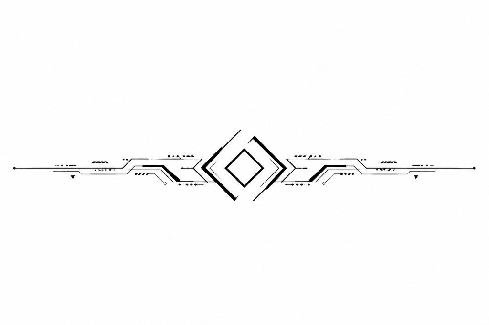

---
title: "The Kestrel Veil Incident"
subtitle: "Book One of The Solmare Cycle"
author: "K.W. Abbott"
lang: en-US
rights: "Copyright (c) K.W. Abbott. All rights reserved."
description: "Book One of The Solmare Cycle. A scout crew discovers that reality itself has become inconsistently observable."
---

\newpage

# THE KESTREL VEIL INCIDENT

## Book One of The Solmare Cycle

**K.W. Abbott**

*Cover placeholder - replace with final artwork for retail editions.*

\newpage

## Contents

*(Table of contents generated in export editions.)*

\newpage

# Prologue

History creates civilizations.

Civilizations create doctrine.

Doctrine creates decisions.

Decisions create conflict.

The people living through those decisions are the story.

—Fleet Academy Strategic Studies, First-Year Cadet Primer

(Edition 143)

Fleet Academy Strategic Studies

Edition 143

Required Reading

\newpage

**ARCHIVE**

**FSA-143-07**

Fleet Survey Authority

**Fleet Survey Manual**  
**Edition 143**

---

## Section 7.2 — Survey Boundary Notation

> Regions beyond established survey boundaries should be treated as unoccupied unless direct evidence indicates otherwise.

---

### Margin note (handwritten; instructor attribution unknown)

> Remember:  
> Maps describe what we know.  
> Not necessarily what exists.

\newpage

**Chapter 1**

**The Empire**

The morning feed arrived at Meridian Gate before the station's artificial dawn cycle finished its slow climb from indigo to pearl.

Maris Chen stood at the archivist's rail on Level Nine and watched worlds appear in sequence—not as coordinates on a chart, but as living places arguing politely for her attention. A harvest festival on Verdant Line. A labor dispute settled by arbitration on Kestran's industrial belt. A poetry prize awarded on Selene's glass towers. A relay blessing at an ocean world's floating temple, where priests thanked the corridor nodes for another season of calm seas and reliable freight.

Meridian Gate was not a planet. It was a city folded into a station, hung at the intersection of three major jump corridors where the Unified Fleet Authority—what most people simply called the Empire—had decided centuries ago that commerce should never wait for permission. Maris had lived here eleven years and still loved the way the promenade smelled at shift change: spice from the Kestran quarter, salt from the ocean-world vendors, machine oil from the dock tiers, and something sweet she had never identified but associated with home.

She was not a poet. She was a Cartography Division analyst on rotation from Helion Prime, assigned to review incoming survey summaries before they entered the public archive. Her job was to notice when a world's description contradicted itself. Most days, nothing did.

Today the feed was generous.

She opened the first packet from the Core Dominion—formal, dense, and proud in the way capital documents always were. The Senate had confirmed a new trade accord with the Helion Industrial States, allies in name, competitors in every practical sense. The wording celebrated shared prosperity. The attached margin notes, written by someone who would never sign their name, mentioned tariff friction on rare isotopes and a reminder that Helion's foundries supplied half the mid-rim's hull plate.

Maris sipped her tea and flagged nothing. Allies did not have to trust one another to stay allies. The Empire had learned that long before she was born.

The founding story appeared every year in the feeds, trimmed to a sentence or a parade float. Maris had heard the full version once at academy and remembered only the diorama and the glass case around the first Relay Charter.

She scrolled.

A frontier settlement on the outer Kestran arm requested recognition as a full member world. The petition included three pages on soil chemistry and one paragraph on a school built from shipping containers that the settlers insisted was already the finest on the rim.

An exploration fleet dispatch noted successful contact with a neutral trading enclave beyond the mapped void edge—not a rival empire, not a subject world, simply a people who preferred to be paid in stories and hydroponics manuals. The dispatch recommended continued courtesy and no attempt at incorporation.

A military bulletin reported routine patrol strength along the disputed border with the Outer Rim Collectives: cold cooperation on paper, probing in practice, nothing that would interrupt breakfast.

A cultural attaché from Selene had uploaded a complaint about Core tariff bands on luxury exports; the complaint was eloquent enough to read like literature and petty enough to matter to the merchants who funded the attaché's apartment.

Maris tagged the frontier petition for senior review and leaned back as the promenade lights brightened another degree. Through the viewport, shuttles crossed in layered lanes like schools of fish following rules no single pilot had written but all of them obeyed. Beyond the glass, the jump corridors were invisible—only the traffic proved they existed.

At 0742, her colleague **Tomas Rhee** dropped a pastry on her console and opened the secondary feed from the cultural desk.

"You owe me for covering your Verdant harvest review," he said.

"I owe you for not filing that pastry as contraband."

He grinned. Tomas had grown up on an ocean world and still moved as if the floor might swell beneath him. "Selene segment. New concert hall shaped like a shell. Architect says sound should travel the way light does in a corridor node."

"Poetic."

"Expensive. Also structurally unsound if you ask anyone who has to maintain a shell on a station, which nobody did."

They watched a clip of Selene's rehearsal hall—musicians tuning under a dome of translucent panels while rain, real and scheduled, traced the exterior. Maris felt the familiar ache of wanting to visit every place she indexed. That was the hazard of the job: the Empire became a list of invitations.

At midmorning she left the rail for her required promenade walk—Cartography Division insisted archivists see the station they indexed—and rode the slow elevator to the trade tier. A Kestran metalworker haggled in good humor over alloy quotas. Two diplomats in formal sashes from competing Core houses pretended not to recognize each other while buying the same pastry. A cluster of ocean-world pilgrims adjusted moisture collars and laughed at how dry Meridian Gate always felt to their lungs.

Maris bought tea from a vendor who remembered her rotation schedule better than her supervisor did. "Verdant Line harvest feed came in sweet this year," the vendor said. "My cousin sends oranges."

"I saw the festival packet. The terrace cooperatives looked happy."

"Happiness is good for exports."

She smiled and continued. On the public wall, a rotating map showed member worlds and jump corridors lighting up in sequence as the morning freight reports cleared—Kestran alloy outbound, Selene textiles inbound, a Verdant Line harvest convoy tagged *on schedule*.

Briefly, as she always did on Founders' Week eve, she read the carved plaque near the chapel alcove—the one sentence every schoolchild memorized: *Many worlds, one law of passage, peace by strength and the patience to use it sparingly.*

She returned to Level Nine with tea warming her hands and the promenade noise rising through the viewport glass.

By late morning she had reviewed summaries from fourteen worlds and two station-states. Agricultural yields. Orbital factory output. A research colony's request for additional telescope time. A mining consortium's complaint about pirate insurance rates in a zone officially declared safe. A cultural capital preparing for Founders' Week celebrations that would, according to tradition, begin on every member world within the same six-day window—local calendars adjusted, local foods substituted, the same story told in a hundred accents.

"Tomas," she said. "Do you ever feel like the map is bigger than the archive?"

He looked up from his own screen. "Every day. That's why they pay us to pretend it isn't."

Maris laughed and closed the frontier school packet. The promenade below her was full. Shuttles crossed in their lanes. Founders' Week banners were going up on the lower tiers.

She believed the work held. It was how the job functioned.

Helion Prime never slept. It only changed shifts.

In the Lower Meridian District, **Lisette Venn** unlocked her bakery before the transit lines filled, as she had done for twenty-three years since her niece and nephew depended on her for more than bread. The industrial sectors above the district glowed even at dawn—a faint aurora of foundry light that locals called the Second Sunrise. Lisette did not romanticize it. She sold coffee to dockworkers who called it the price of living in the Empire's workshop.

"Two rye, one sweet, and don't pretend you're not early for the blessing parade," she told a regular whose name she knew and whose children's names she also knew.

"I'm not early. You're late."

"You say that every Founders' Week." She slid the sweet loaf across the counter anyway. "And every Founders' Week you're early. I keep your rye on the warm rack because arguing with you is bad for business."

He laughed and took the bread. Outside, vendors were already stretching awnings in the district colors—copper and deep blue, Helion's contribution to a celebration that would repeat on a hundred worlds with different pigments and the same intention: remember how the corridors were joined, eat something good, let the children run.

Lisette's assistant, a teenager named **Priya Sharma** whose grandmother would later receive weekly messages from a granddaughter spending CO₂ margin in places Priya could not yet imagine, braided dough with quick hands and faster jokes.

"If the parade floats crash again, can we sell the wreckage as limited edition?"

"We can sell you as limited edition if you burn the batch."

"That's not a no."

"It's a threat with pricing implications."

Priya grinned. The bakery smelled of yeast and cardamom. Through the open door, the market street filled: fish from the refrigerated lanes, textiles from Selene's looms, fruit from Verdant Line in crates stamped with terrace cooperative seals, a musician tuning a stringed instrument whose name Lisette had forgotten and whose sound she never did.

A dockworker short on credits this week hesitated at the rye display. Lisette had seen the hesitation before she saw the man.

"Pay me Thursday," she said, wrapping two loaves. "And bring your daughter to the parade. She asked about the cardamom rolls last month."

"I didn't—"

"You did. Thursday."

He left with bread and the expression of someone who had not expected kindness to be so stubborn.

At the orbital freight terminal three levels above the district, **Jun Park's mother Hye-Jin** closed a ledger at the end of her night shift in the civilian cargo office. She had counted containers until the numbers blurred and still caught the error a junior clerk missed—a mislabeled medical shipment bound for an ocean world's clinic. She corrected it, signed the form, and sent a message to her son Jun on a posting she understood only as *mid-rim, safe, call when you can*.

Jun would answer when he could. He always had.

Hye-Jin bought rice cakes from a vendor who remembered her husband and did not mention him unless she wanted him mentioned. She ate standing up, as dockworkers did, and watched a crew in mixed uniforms—Fleet gray, corporate teal, independent freighter patches—laugh over a shared story about a jump exit that smelled like oranges because of a refrigeration leak.

No one in the terminal thought about border queues or Senate bulletins. They thought about overtime, schedules, the Founders' Week bonus, whether the parade would block the 0800 shuttle.

In a park near the academy district, students sprawled on grass that was real and expensive to maintain. **Children** chased a dog someone should have leashed. An **explorer** on leave told exaggerated stories about a neutral enclave that traded in hydroponics manuals; his friend, a **teacher**, corrected the details gently and ruined the story's rhythm on purpose.

Lisette delivered a tray of rolls to the park kiosk on credit she kept for the vendor because the woman had nursed Lisette through influenza one winter. In return, the vendor saved her a seat at the parade route.

"Your Calder still sending messages on schedule?" the vendor asked.

"Every two cycles. He apologizes for being dull. I tell him dull is a luxury some of us would like to try."

"He's graduating soon, isn't he?"

"Next week. He says it's a formality. I say formality is what keeps ships in one piece, and he sends me another schedule to prove he's eating."

"He gets that from you."

"He gets the stubborn from me. The schedules are his own fault."

They watched preparations for the blessing procession—flags, a choir from three cultural houses singing in staggered harmony, an old veteran in a dress uniform that no longer fit who saluted when the Fleet banner passed even though the banner was only a rehearsal prop.

Near the fountain, a **ship crew** on short leave argued about which noodle stall was authentic and agreed to try all three. Priya took photographs for the district archive—Founders' Week documentation, she said, though really she liked watching people smile.

As evening approached, the market street changed character: lanterns strung between buildings, a transit line above the district slowing to let parade floats pass on the lower route, neighbors exchanging dishes from a dozen culinary traditions. Lisette tasted a spoonful of ocean-world stew from a vendor she trusted and declared it insufficiently salted—a verdict the vendor accepted as high praise.

Helion Prime was not beautiful the way Selene was beautiful or Verdant Line was gentle. It was loud, functional, and full of people who sang anyway when the parade drums started.

The Fleet Administrative Academy on Helion Prime occupied a terrace of stone and glass that overlooked the industrial aurora.

**Cadet Captain Calder Venn** stood in graduation rehearsal formation and counted under his breath—not cadence steps, but the number of times Commander **Pell** had called his name this month for treating ceremony like a verification problem. Twelve. Thirteen if you counted the sword-belt correction he still considered technically unfair.

Pell watched from the reviewing stand with the expression of a man who had seen a hundred classes graduate and still believed the next one might learn something his curriculum could not teach.

"Eyes front, Venn."

Calder fixed his gaze on the middle distance. Around him, cadets breathed in unison. **Damon Reyes** muttered something about the mid-rim paying better than the core; a destroyer-track classmate who had already received posting laughed too loudly on purpose.

Calder knew he would receive a scout command. The packet had been verified twice. Simulation scores supported it. Scout was not the assignment cadets whispered about in the lounge, but scout had green indicators on every readiness chart he trusted—and green indicators were how you kept people alive when systems failed without warning.

In the public gallery, families watched with the relaxed attention of people who had seen ceremonies before and still liked them. Calder did not see **Lisette Venn**—she never came to rehearsals, only to the formal ceremony—but he could already taste her cardamom rolls and hear her ask whether he had eaten anything that counted as food.

"Sir," Pell said after the final pass review, catching Calder as the formation broke. "The parade is not a sensor sweep."

"No, sir. But the spacing errors were measurable."

Pell's mouth twitched. "So was your simulation score on the Kestran transit failure replay. You corrected the failure mode three cycles before the board expected it. That is why you are receiving a hull number next week instead of a desk."

Calder waited for the compliment to land and felt, inconveniently, that a desk might have been safer. Safer for him. Not necessarily safer for whoever crewed the hull he would inherit. "I'll execute the ceremony correctly, sir."

"I know you will." Pell's voice softened a fraction. "Try to look like you believe in it while you do. Your aunt will be watching."

Calder nodded. He believed in procedures. Ceremonies were procedures with music. So were ships, if you respected them. So was keeping Lisette from worrying.

He did not think about the *Kestrel Veil* as his hull—only as dockyard folklore, if he thought about her at all. Scout-class postings were aging, the kind of assignment classmates mentioned with sympathetic jokes. He thought about the checklist for graduation day, the message owed to Lisette before Founders' Week peaked, and the pre-digital almanac on his shelf he had opened last night out of habit, not superstition. Old routes. Known solutions. He liked known solutions because unknown ones had already taken enough from him.

At the terrace rail, he watched the Second Sunrise pulse beyond the glass and felt, for half a breath, the childish awe he had trained himself to file under *industrial output*. Then he checked tomorrow's schedule again because checking twice was how you kept errors from becoming tragedies—and because Lisette deserved at least one person in her life who verified things before they went wrong.

In the Lower Meridian District, Lisette closed the bakery after the parade and counted the day's receipts with Priya's help. They donated unsold sweet rolls to the night shift at the freight terminal. Hye-Jin Park took two and saved one for Jun's message window.

Calder returned to his quarters, opened a draft to Lisette, deleted three sentences that sounded too formal, and wrote: *Graduation rehearsal complete. Pell says I must look like I believe in the parade. I believe in your rolls. I will come to the bakery after the ceremony if you will feed me. Tell Priya fleet ration is still an insult.*

He sent it. He reviewed tomorrow's schedule a third time. He slept.

Outside his window, Founders' Week lanterns moved through the district in rehearsal for the blessing procession. Somewhere above the foundries, the Second Sunrise pulsed steady and industrial and alive. Graduations waited. Commissions waited. The Empire looked toward tomorrow the way it always had—busy, confident, and certain that ordinary days would keep coming.

The intelligence annex opened at 1400—the same recycled air and row of terminals as every other shift.

Maris Chen had requested the secondary queue three cycles ago—routine cross-border summaries, the kind of feed that arrived in hundreds of packets and died in hundreds of inboxes because each packet, alone, looked like weather. She had spent eight years in Cartography before Fleet Intelligence borrowed her for pattern work along the Outer Rim Collectives frontier. Borrowed was the polite word. She was still paid by Cartography and still slept in Meridian Gate quarters and still answered to supervisors who thought her real job was survey metadata.

Most analysts read reports. Maris read patterns.

She filtered the afternoon load: trade balances, diplomatic notes, shipping manifests, patrol summaries, Senate committee minutes, merchant guild complaints, listening-post logs marked *routine*. Tomas Rhee brought coffee and did not ask why she had pulled the Collectives border set again.

"Founders' Week," he said, by way of explanation for why the queue was fat.

"Founders' Week," she agreed.

The Outer Rim Collectives occupied the Empire's narrative as a rival you could do business with while doing intelligence against—a civilization large enough to matter, disciplined enough to frighten analysts who read history, and patient enough that most citizens treated border tension as background noise. Cold cooperation, the bulletins called it. Probing, the margin notes admitted. Not war. Not yet.

Maris read the first packet and felt nothing but the usual fatigue of a queue that would outlive her shift.

A merchant captain's complaint: a previously open freight corridor near **Kestran's outer marches** flagged as a temporary navigation restriction by Collectives authority. Temporary was doing a lot of work. The captain wanted compensation, not strategy. Maris tagged it *routine friction* and moved on.

The second packet made her pause.

Listening post **LP-9** logged increased Collectives fleet logistics traffic—fuel tenders moving in tighter intervals, civilian traffic rerouted one jump earlier than seasonal norms suggested. The post commander attributed it to "exercise posture."

*This is unusual,* Maris thought.

Exercises did not usually reduce commercial traffic in adjacent lanes. She opened a side pane and pulled last cycle's LP-9 summary. The intervals had been widening then. Now they were tightening.

The third packet arrived with her tea going cold.

Patrol intercept summary. Collectives border units had held formation discipline at zero-point-zero-three parsecs tighter than historical average for three consecutive cycles. A statistician would call it within variance.

*This doesn't fit,* she thought—not with exercise posture, not with seasonal drift, not with the lane restrictions in packet one.

She opened four more, faster now, because her mind had started connecting before her display did.

Supply manifests from a neutral transshipment hub: Collectives procurement volumes no longer matched five-cycle averages—heavy on sealed consumables, light on discretionary goods. Reconnaissance imagery from a chartered survey platform: new infrastructure shells in three remote systems along the disputed marches, tagged *agricultural expansion* in the caption, looking nothing like farms she had ever indexed. A freight cooperative bulletin: independent captains independently choosing longer routes to avoid "administrative delays" that none of them could define the same way twice.

Any one report still had a benign explanation if you wanted one.

Maris no longer wanted one.

*This isn't another exercise.*

Logistics tightening. Commerce pushed aside. Formations drilled closer. Procurement shifting toward what armies ate and away from what civilians bought. Remote construction labeled as farms. Captains avoiding lanes that had been open last season.

She sat back and said, very quietly, "That's not exercises."

Tomas looked up.

"They're not running drills," she said. "They're staging."

*This is mobilization.*

The word should not have been spoken above a whisper on Founders' Week eve. Staging was not border friction. Maris was looking at evidence of an approaching war.

Fleet Command had to be warned. Not after Founders' Week. Not after secondary corroboration from a desk that would read each packet in isolation and find it reasonable. Now.

She began a priority draft on the secure template she had used twice before in her career, both times for threats that senior desks had downgraded until events proved them right. Her hands were steady. Her caution was not. The title field accepted: *Collectives Frontier—Convergent Indicators of Large-Scale Military Preparation.*

Section one: individual reports, sourced, timestamped, stripped of adjectives. Section two: correlation map—logistics traffic against commercial decline against patrol discipline against procurement shift. Section three: still blank. Assessment and recommended escalation. Immediate transmission to Fleet Command.

"Tomas," she said without looking up. "If you were seeing exercise posture, would you tighten formation or loosen it?"

He leaned over her shoulder, read two lines, and went very still. "I'd tighten."

"Me too." She pulled up the escalation pathway on the template. "This isn't posture. This is preparation."

He did not ask if she was sure. He had seen her be right before.

At 1547 she saved the draft to the annex queue—priority flag pending her completion of section three, biometric handoff required before transmission. Standard procedure. The system auto-saved every four minutes.

She needed twenty minutes. Maybe thirty. One more pass through the merchant reports to see whether the navigation restrictions formed a geometry or a scatter.

She stood, rolled her shoulders, and told Tomas she would take the quick loop to the chapel tier—twenty minutes to finish section three in her head.

"You want anything from the promenade?" he asked.

"Oranges if the Verdant vendor still has them."

"Copy."

Maris took the secondary transit corridor from Level Nine to Level Six—a route she had walked four times a week for eleven years, past maintenance hatches she no longer noticed and a viewport she always noticed anyway. Shuttles crossed the dark beyond the glass. Founders' Week banners had already gone up in the lower tiers, copper and blue and a dozen imported pigments.

Halfway down the corridor her vision narrowed—not pain, exactly, a sudden wrongness, as if someone had dimmed the station lights only for her.

She thought: *Not now—*

Her hand found the bulkhead. Her mouth tried to form Tomas's name.

Maris Chen's knees failed. A maintenance technician three meters behind her shouted for a med team.

Tomas reached the chapel tier with oranges in a paper bag. He came back when she did not.

The draft saved at 1551. Sections one and two complete. Section three empty. Priority transmission never authorized.

At 1600, queue hygiene moved it behind Founders' Week traffic summaries.

Tomas told her supervisor. The escalation pathway opened—and stalled on blank section three and a dead assessor.

On Helion Prime, parade drums rehearsed in the Lower Meridian District. Calder Venn slept with tomorrow's schedule verified three times. Lisette had already donated the unsold rolls.

Maris Chen had almost warned Fleet Command in time.

She had not.

\newpage

**Chapter 2**

**A Captain's Dream**

Founders' Week turned Helion Prime's academy terrace into something the manuals never described: a parade ground with music.

Fleet Administrative Academy graduation was always formal. Today it was also festive—lanterns strung along the stone colonnade, choir voices from three cultural houses braided into the anthem, families in the public gallery wearing colors from a dozen worlds. Beyond the glass, the Second Sunrise pulsed over the industrial districts—the foundry aurora locals treated as weather.

**Cadet Captain Calder Venn** stood in final formation, sword belt finally corrected to Commander Pell's satisfaction, and watched the reviewing stand the way he watched any system due for verification: details logged, deviations noted, corrections executed before they became failure.

Around him, one hundred and forty-seven cadets breathed in practiced unison.

**Damon Reyes** stood two positions to Calder's left, jaw tight with the effort of not grinning during the invocation. **Sera Okonkwo** held the center file with the stillness of someone who had already decided she belonged on a combat deck. **Marcus Hale**—destroyer track, loud in every context—had somehow acquired a miniature Fleet banner and was concealing it against his thigh until the formation broke.

Calder did not have a banner. He had a checklist.

The terrace stone was worn smooth where generations of boots had found the same spacing marks—today hidden under Founders' Week bunting, copper and blue, silk banners the Senate delegation would store and bring out again next year because tradition was cheaper than reinvention.

Fleet chaplain **Adeyemi** led the invocation in three languages. Calder mouthed the responses and watched the gallery. Lisette had taught him to locate the people you loved before you tried to feel proud alone.

She was there. Third row. Hat she swore she did not own and wore anyway.

The invocation ended. Pell's voice carried without amplification—the habit of a man who had commanded attention before he had commanded ships.

"Cadets of the Fleet Administrative Academy, Helion Prime, Founders' Week cohort—"

The class answered in one voice.

Calder felt the words land the way ceremony always landed for him: as obligation first, meaning second, music third. He had spent four years learning that feelings were not less real for arriving after procedure. Lisette had taught him that before the academy ever did.

Commendations followed. Simulation honors. Navigation distinction. Logistics excellence. A maintenance-track cadet received the award for berth acceptance documentation so meticulous three yard supervisors had requested copies. Okonkwo received the combat-track citation with a nod that accepted what she already knew. Reyes took the cartography prize and looked, for one unguarded second, like a man who had been given permission to keep asking questions.

Calder's name came mid-list: highest composite score on the Kestran transit failure replay; early correction of cascade failure mode; recommendation for independent command.

Applause rolled across the terrace. In the gallery, **Lisette Venn** rose before she remembered she hated standing in crowds, then sat, then stood again because Calder was looking.

He did not smile on the formation line. He nodded once—the acknowledgment he gave systems that reported green.

The oath came next—words older than the terrace, sworn to a Fleet that had kept peace long enough for children to grow up thinking peace was weather. Calder spoke his line without stumbling. Around him, one hundred and forty-seven voices made the same promise.

Swords followed: not weapons for the field, but symbols handed from instructor to graduate, edge dulled, balance true, the academy insisting that command began with restraint. Pell presented Calder's sword with the same correction he had made at rehearsal—belt angle, grip, the small geometry of dignity.

Commissioning pins came last. Metal against collar. Weight against skin.

Founders' Week drums began somewhere below the terrace as the graduates broke formation and became officers the Fleet could assign, deploy, and depend upon. Confetti from the lower districts drifted past the glass—biodegradable, dyed, ridiculous, perfect.

Calder's pin felt heavier than its mass.

Pell found him at the terrace rail after the crowd swallowed the class into congratulations. The commander carried two cups of tea—the good kind from the academy mess, not the ration kind—and handed one to Calder without preamble.

"Your aunt is trying not to cry in public," Pell said. "She is failing with dignity."

Calder looked toward the gallery. Lisette was indeed failing with dignity, wiping her eyes with the heel of her hand while **Priya** offered a napkin and a look that said *let her*.

"I'll see her after the receiving line, sir."

"You will." Pell leaned on the rail beside him, not quite shoulder to shoulder. "I am not going to discuss tactics with you today."

Calder had prepared for tactics. Simulation postmortems were safer than whatever Pell's expression suggested. "Sir?"

"Ships are easy." Pell watched the graduates below—Hale already boasting, Okonkwo already listening to a destroyer captain with professional attention. "Systems have manuals. Failures have signatures. You can train a competent officer to read both in a year."

He paused long enough for Calder to understand a second sentence was coming.

"People are difficult."

Calder waited.

"Your crew will not remember your best verification cycle," Pell said. "They will remember whether you made room for their expertise when you were frightened. They will remember whether you asked before you assumed. They will remember how you made them feel on the days nothing went wrong and on the days everything did."

"I intend to follow procedure, sir."

"So do I. Procedure is the floor." Pell's mouth twitched—not quite a smile. "Do not confuse authority with leadership. Authority is what the pin gives you. Leadership is what they give back when you have earned it."

Calder looked at the pin on his collar. "How do I earn it?"

"Badly, at first. Then honestly." Pell straightened. "You will command people who know the ship better than you do. Ask them. Record what they tell you. Do not treat their experience as noise in your dataset."

Calder opened his mouth. Closed it. Nodded.

"Come find me after assignment posting tomorrow if you want to argue about sensor sweeps. Today, go eat your aunt's bread and let someone be proud of you on purpose."

Calder saluted. Pell returned it without ceremony.

"And Venn—"

"Sir?"

"Look like you believe in it while you do."

Calder almost said *ceremonies are procedures with music*. He thought Lisette would approve of the sentence and Pell would not. "Yes, sir."

The receiving line took an hour. Families, instructors, classmates, sponsors from industrial houses that recruited fleet talent the way orchards recruited seasonal labor. A Selene textiles representative pressed a scarf into Calder's hands—"For your first cold wardroom"—and laughed when he tried to return it with a receipt mindset.

Reyes clasped Calder's forearm and said, "Exploration cartography track—*Meridian Echo*. Not glamorous. Good maps. I'll send you coordinates that don't match the archive."

"Send them."

"They won't match on purpose. That's the point."

Okonkwo's handshake was competitive even in congratulations. "Destroyer escort, *Vigilant Threshold*. Try not to need rescue from my sector."

"I'll schedule the embarrassment for your first leave."

"Schedule it after Founders' Week. I'll be busy being impressive."

Hale laughed too loudly and announced he was reporting to a cruiser in three days. "You'll visit. First officer by thirty. Book it."

"I'll book the bakery instead. Lisette feeds cruisers too."

A cadet Calder barely knew—**Yuki Tanabe**, research command, quiet all four years—thanked him for tutoring on orbital mechanics and disappeared into a cluster of physicists before Calder could say he had only clarified what Tanabe already understood.

**Instructor Mara Chen**—no relation to anyone Calder knew of—shook his hand with simulation instructor formality. "You corrected the Kestran replay early. Do not waste that instinct on paperwork once you have a crew."

An academy archivist pressed a copied Founders' Week program into his hands. "For your first ship's mess wall. They always want one."

Calder could see the class's future in postings not yet read aloud—instructors embracing students they had corrected in public, banners snapping over a terrace full of people who expected the Fleet to keep doing what it had always done.

He expected it too. That was the point of graduation.

Lisette found him last.

She smelled like cardamom and yeast and the industrial district's perpetual faint ozone. She hugged him the way she had hugged him at sixteen when the transit investigators finished their reports and still had not brought his parents back.

"You ate," she said. It was not a question.

"I ate."

"You're lying. I can tell. Your shoulders go up."

Calder let his shoulders down. "I'll eat at the bakery."

"Good." She adjusted his collar pin with the proprietary precision of someone who had hemmed his dress uniform twice. "Tomorrow they tell you where you're going. Tonight we celebrate what you've already done."

"Assignment posting is tomorrow?"

"That's what the bulletin said. Don't start scheduling until you've been scheduled."

He walked her toward the transit lift. Founders' Week lanterns reflected in the terrace glass. Somewhere below, the blessing procession rehearsed again—drums, voices, the Empire practicing joy because joy, too, was a tradition worth maintaining.

Lisette talked on the lift the way she talked when she was happy and trying not to show how afraid she had been for four years.

"Priya's taking photographs tomorrow at the parade route. I saved you a seat. Don't schedule yourself out of it."

"I won't."

"You'll try. Then you'll check your tablet twice and pretend you forgot until I send Priya to collect you."

Calder almost argued. He had learned not to argue with accurate predictions. "I'll be there."

"Your mother used to hate ceremony," Lisette said, quieter. "She loved what it meant. You're like her that way. All procedure until someone needs you to be human."

He did not know what to do with that sentence except carry it. "I'll be human at the bakery tonight."

"Good. That's an order from civilian command."

At the lift doors she kissed his cheek—the quick version, public enough to be decent, private enough to count—and merged into the Founders' Week crowd moving toward the lower districts. Calder watched until he lost her hat in the color and noise, then returned to academy housing alone.

His quarters were quiet. He hung the dress uniform with the care Lisette had taught him, set the pin in its case, opened it once more, closed it again—verification, not vanity.

Outside, parade drums continued.

The Lower Meridian District bakery had been in Lisette Venn's family for two generations—first as a freight-worker lunch counter, later as the cardamom roll institution Calder had grown up believing was the correct shape of bread.

Tonight it was also a party.

Lisette had pushed tables together before Calder arrived. Neighbors brought dishes without being asked: ocean-world stew, Selene flatbread, Verdant Line fruit preserved in syrup, a casserole from the deck above that claimed to be traditional and was, at minimum, enthusiastic. Priya had hung Founders' Week lanterns in the window and taken photographs for the district archive with the solemn joy of someone who believed documentation was a form of love.

On the back wall hung the photograph Lisette brought out every Founders' Week—freight workers in her grandmother's bakery line, the old Fleet banner smaller than the histories pretended. She never lectured about it. She let people look.

Calder always looked.

Calder ducked through the door in civilian clothes and was applauded before he had closed it.

"Captain," said **Mr. Osei**, who bought rye on credit Thursdays and always paid on Thursdays. "We expected a commodore by the sound of your scores."

"Cadet Captain until the paperwork catches up," Calder said.

"Same thing with better bread."

Lisette shoved a roll into his hands. "Eat before you talk."

He ate. Cardamom, butter, the slight crunch of sugar Lisette insisted was not excessive. His shoulders dropped without being commanded.

Priya poured tea. **Hye-Jin Park**, Jun's mother from the freight terminal, arrived still in uniform and set down a tray of rice cakes. "My son sent congratulations," she said. "He cannot call until relay window. He said to tell you mid-rim pays better than the core."

"Reyes said the same thing at graduation," Calder said.

"Then it must be true."

The bakery filled with the noise of people who liked each other—arguments about parade routes, a dockworker's story about a jump exit that smelled like oranges after a refrigeration leak, Captain **Aldric** on the fourth floor recounting Founders' Week on a carrier deck forty years ago with the serene inaccuracy of memory improved by retelling.

Aldric raised his cup. "First command?"

"Tomorrow I find out which one."

"Then here's the only fleet advice that ever mattered on a carrier: feed your people before you brief them. Your aunt's been doing it longer than most captains. Learn from her."

Lisette, passing with a tray, said, "He's a terrible student."

"I'm an excellent student," Calder said. "I eat on schedule."

"On *your* schedule. Which is not a schedule. Which is a rumor."

Laughter moved around the tables—the easy kind that did not need a punch line, only recognition. Calder listened more than he spoke. That was his habit in rooms where he belonged.

Mr. Osei told a story about a freighter captain who had docked at Helion Prime during a Founders' Week storm twenty years ago and paid his bakery debt in engine parts because credits were frozen and bread was not. Lisette had accepted the parts. The bakery's old mixer still ran on one of them.

"That's why we toast doors," Priya said quietly when Mr. Osei finished. "Half this room is alive because something broke and someone fed them anyway."

Calder knew what she meant. The Empire was bread on credit and relay windows from sons on mid-rim postings—not a parade banner, but the room that fed you when credits froze. If it fell, it would fall on people like Lisette first.

Lisette sat beside him long enough to be noticed, then moved—hosting, correcting salt, refusing payment from someone who needed saving face more than profit. She had raised him to be self-sufficient and still watched him eat as if he might forget again.

"What are you hoping for tomorrow?" Priya asked quietly.

Calder considered lying. The room assumed excellence the way rooms assumed sunrise. Hale had a cruiser. Okonkwo had a destroyer escort. Reyes had mapping work on a respectable hull. Calder's composite scores were on the commendation list Pell had read aloud.

"Something that uses what I trained for," he said. "Independent command if the board agrees."

"Independent command," Lisette repeated, pleased. "See? Stubborn and correct."

An industrial sponsor had shaken his hand at the receiving line with the confidence of a man recruiting future administrators. A classmate's mother had said, *You'll be on a flagship by thirty*. Calder had not corrected her.

He let the room's assumption settle around him like a blanket. Warm. Undeserved, maybe, but warm.

Mr. Osei raised his cup. "To Calder Venn. May your ship have good doors and your crew have good sense."

"To good doors," the room echoed.

Calder drank. Doors were a reasonable thing to toast. He thought about assignment posting in the morning and felt, for the first time in months, the specific lightness that came from finishing a long verification cycle.

The parade drums sounded in the distance. Children ran past the window chasing a dog someone should have leashed. Lisette donated the last tray of sweet rolls to the night freight shift the way she always did during Founders' Week, because prosperity was only real if you practiced sharing it.

Later, when the crowd thinned, Lisette brought out Founders' Week fortune rolls—plain dough around a slip of paper no one pretended was mystical. Calder drew: *You will find a door that sticks and make peace with it.*

He ate it. Lisette watched him chew and said, "Priya writes those. Don't give them too much credit."

"I won't."

"Liar. You'll remember that one."

Calder stayed until the lanterns dimmed and the neighbors went home. He washed dishes because Lisette hated washing dishes. She pretended not to notice and left a second roll on the counter for his transit back to academy housing.

"Tomorrow," she said at the door, "whatever they give you, you come here first."

"Before or after I argue with the posting officer?"

"After. Argue on your own time. Bring the paperwork. I'll feed you while you complain."

He kissed her cheek—the affection he allowed himself without translating it into words. "I believe in your rolls."

"Finally. A sensible officer."

On the transit ride back, Calder did not open the assignment preview he did not have permission to access. He slept.

Assignment posting took place in Academy Hall the morning after graduation, while Founders' Week crowds moved through the lower districts and the Empire continued its week-long argument about which noodle stall was authentic.

The hall was built for occasions that changed lives quietly. Wood panels absorbed sound. Banners hung high enough not to distract. One hundred and forty-seven graduates sat in assigned rows. One hundred and forty-seven posting officers stood ready with sealed packets. The air smelled of paper and anticipation.

Calder sat with his hands flat on his knees.

Admiral **Sorensen**, guest of honor, spoke briefly about service—not glory, service. Calder listened because listening was respect made practical. Then the postings began.

The cruiser assignments went first—names Calder knew, voices he had heard in simulation debriefs, futures that sounded like the Fleet recruitment broadcasts of his childhood. **Tanaka's cousin**, whom Calder had met once at a district festival, received a diplomatic escort and cried without embarrassment. Hale shouted when his packet opened. No one shushed him. Enthusiasm was permitted on assignment day.

Destroyer escorts. Exploration vessels with survey mandates. Diplomatic escorts to neutral enclaves. Research commands in comfortable orbits. Supply convoy leadership for officers who wanted logistics careers with honest promotion paths.

A classmate Calder had shared orbital mechanics lab with opened a research command packet and went pale with relief. Another received convoy leadership and grinned like a man who had wanted honesty over glamour and gotten it.

Okonkwo received *Vigilant Threshold* and did not shout. She simply stood, packet in hand, already aboard in her mind.

Reyes opened his exploration cartography posting and exhaled the way navigators exhaled when a solution locked. Tanabe accepted research command with a bow to the physics department chair who had come to see her off.

Calder waited.

His record suggested an excellent command—simulation scores, early failure correction, commendation on the terrace. The posting officer reached his row. Names continued. Calder's row thinned.

He told himself waiting was sequence, not punishment. The Fleet posted in order to prevent favoritism from becoming policy.

His name was not next. Then not next again.

The officer called, "Venn, Calder."

Calder stood. Walked forward. Accepted the packet. Broke the seal.

The first line was assignment class: **Scout Vessel, UFA Reconnaissance Platform**.

Not a cruiser. Not a destroyer. Scout.

He turned the page.

Registry: **Kestrel Veil**.

The name was familiar. That it was his was not.

The hall did not go silent all at once. Silence moved like a wave—first the graduates nearest him, then the rows behind, then the instructors' section where someone said, too clearly, "You're kidding."

Another voice: "She's still in service?"

A third, softer: "I thought they finally retired her."

Calder read his assigned berth number. Helion Prime outer yards. Fourteen-C. Standard reconnaissance mandate. Green indicators on readiness charts he had not yet opened.

Scout was not the assignment cadets whispered about in the lounge. It was also not the assignment this room had been congratulating him for last night.

He looked up.

Commander Pell stood along the side wall with the other instructors, hands clasped behind his back, watching Calder's face the way he had watched Calder's simulation replays—not for drama, for data.

Calder met his eyes. Nodded once.

Pell nodded back.

Calder closed the packet. "Acknowledged," he said to the posting officer.

He returned to his seat with steady steps. Reyes touched his sleeve as he sat—brief, private, *later*. Okonkwo did not offer sympathy, which Calder appreciated. Hale whispered something about salvage yards that Calder chose not to hear.

Calder opened the packet far enough to read crew complement and outgoing captain's name—**Dennett**, rotated eleven days ago. The ship had kept crew and repairs without him. He was the variable. The hull was the constant.

Not discouraging. Clarifying.

He closed the packet and sat through the remaining postings with his hands flat on his knees. The Fleet watched how officers received bad luck the same way it watched how they received good.

When the hall emptied, Pell was gone. A note waited in Calder's message queue instead:

*The ship is older than the file makes her sound. The crew is competent. Come to my office if you need to argue. Do not argue in the bakery.*

Calder read it twice. Deleted the reply he drafted. Wrote: *Understood. Thank you, sir.*

Lisette's message arrived before he reached the transit lift: *Whatever it is, come here first. I have rolls.*

He did not open the packet again on the ride to the bakery. He would open it at Lisette's table with bread in front of him, because some procedures were easier if you fed the human subsystem first.

Lisette took one look at his face and put the kettle on without asking.

Priya cleared the back table. Mr. Osei, who had come for morning bread, took his loaf and left with the discretion of a man who had survived three wars' worth of neighborhood news.

Calder set the packet on the table. Lisette set a roll beside it.

"Scout command," he said.

"Independent command," Lisette said. "You trained for this."

"Scout vessel *Kestrel Veil*."

Priya, still within earshot, winced sympathetically.

Lisette read the summary over his shoulder—berth, mandate, crew complement listed, acceptance timeline. Her mouth tightened at the maintenance annex thickness, not at the assignment itself.

"The ship is old," Calder said.

"The ship is a ship. You're the captain they assigned." She sat across from him. "Are you disappointed?"

He considered the honest answer. "Yes."

"Good. Honest is allowed." She pushed the roll closer. "Are you refusing?"

"No."

"Then eat. Then go see her. You don't judge a loaf by the wrapper."

Calder ate. The disappointment did not vanish, but it made room for something else—the annex thickness, a hull name half the hall recognized, a question about why a ship with that reputation still had green indicators on the summary page.

He spent an hour at the bakery, sent Reyes a message—*Assignment received. Drinks when you are back from mapping heaven*—and took the transit to the outer yards.

Helion Prime's industrial berths smelled of solvent and hot metal even through the airlock filters. Founders' Week had reached the shipyards—fresh paint on parade-ready hulls, inspection crews working double shifts, destroyer escorts gleaming under floodlights as if they had been built yesterday.

Calder carried the assignment packet in the rigid case that had survived three academy postings. Subsection Nine was a canyon of hulls and scaffolding, voices echoing off plating, cranes moving with the unhurried confidence of machinery that had never been asked to impress anyone.

He passed Berth 11 first—a frigate with a fresh dorsal repaint so sharp the new gray hurt to look at under floodlights. Berth 12 held a courier clipper whose crew sang while polishing access hatches. Berth 13 was empty, reserved for a Founders' Week demonstration sail the yard master had been boasting about all week.

Berth 14-C did not care about demonstrations.

The tram dropped him at the cradle strip. Calder stepped off with the assignment packet under his arm and the maintenance annex already loading on his tablet. He had not wanted to read the annex before he saw the hull. Files described systems. They did not describe presence.

He looked up.

The scar ran along the starboard mid-hull—fore to aft, nearly thirty meters, visible before he registered anything else about the ship. Plating had been replaced decades ago; weld seams were competent; paint and patch had softened the edges without erasing them. The concavity beneath the repairs still read as catastrophe—a direct strike profile consistent with a cruiser-grade primary battery, or larger.

A scout hull should not have survived it.

Calder stood on the observation strip long enough for the tram to leave without him.

The *Kestrel Veil* sat on her landing cradles in the shadow of prettier ships. Her frame was narrow—reconnaissance class, built to observe and report, not to absorb warship fire and remain a frame at all. Yet here she was: faded paint the color of old paperwork, replacement panels in three different alloys stamped with yard codes from different decades, antenna housings upgraded at least twice, maintenance markings layered in yellow, white, and the pale blue of a notation standard retired before Calder entered academy.

Nothing matched.

Everything looked functional.

Barely.

Status lights pulsed on the bridge blister. A cargo drone hummed at the aft lock. From the same direction came a low environmental thrum Calder felt in his teeth before he heard it—old frequency, still within spec. Somewhere inside, metal struck metal in the rhythm of repair.

Calder opened the maintenance annex and scrolled: environmental regulators within tolerance but outside comfort; sensor dropouts on the tertiary channel; galley sodium drift; three doors with intermittent authority recognition; cargo lift three requiring manual cycle; mixed-generation lighting in corridors B and C; port aft wiring *obsolete but stable if nobody opens the panel without me*—Koss.

Nothing mission-ending. Everything demanding attention.

A handwritten addendum—unsigned, engineer's capitals: *Door 7-C: kick lower-left seam. Cargo lift 3: hold manual switch four seconds. Do not open port aft junction without Koss. —B.*

Forty typed pages. One page of how the crew actually lived aboard.

Two yard techs on the adjacent catwalk noticed him at the scar.

"First time?" the older one asked.

"Berth walk-through."

"Walk-through's generous," the younger said.

The older tech tapped plating below the scar. "Juno. Meteor. Pick one."

"Lost both engines. Still made port." Knock on the hull. "Typical Veil. Everything attached breaks. She doesn't."

"Salvage keeps expecting to collect her," the older one said, turning back to his panel. "She keeps disappointing them."

Calder pulled the damage history appendix. Three lines. *Starboard breach event, classified engagement-adjacent, 2198. Emergency plating and frame reinforcement completed Helion Prime yards. Full structural certification issued. No further action required.*

No opponent class. No explanation.

He measured the scar anyway. The numbers matched what his eyes already knew.

Calder circled the hull once more and counted panel stamps—yard code, year, alloy batch. Three generations of repair on one continuous frame. Each weld someone else's watch, someone else's choice to fix instead of scrap.

Disappointment still sat in his chest. So did the scar's geometry, Brenner's addendum in block capitals, the tech's *Typical Veil* delivered like a fleet toast.

Nearly everyone would see an obsolete ship.

He was starting to see fourteen people and forty-seven years of not quitting.

At the gangway, a bosun checked his credentials and waved him through. The *Veil* did not perform for visitors. She tolerated them.

The gangway flexed under his boots, carrying the same low thrum up through the deck. Handrails replaced with slightly thicker units. Access panels secured with fasteners from two standards—each mismatch a previous crew's solution, still holding.

Calder crossed into the airlock and paused.

The hum followed him inside. Recycled air, machine oil, yesterday's coffee from the galley cycle—the working smell he had caught at the aft vent, now sealed in with him.

The corridor beyond was narrow, worn, unevenly lit—deck polish from feet, hand marks on the bulkhead where crew steadied themselves during yard power cycling, a dent in yellow tape nobody had bothered to fix because it wasn't structural and everyone knew where it was.

A maintenance tech passed with a toolkit older than Calder's academy textbooks. She nodded without stopping.

One lighting panel ran bright white. The next ran amber. A third flickered at tolerance's edge, labeled in tape: *DO NOT TOUCH — BRENNER LIED ABOUT FIXING THIS*.

Old. Not broken. Just old.

Footsteps approached from the direction of the command deck—measured pace, the walk of someone who had made this commute for years.

Executive Officer **Mira Thessaly** rounded the junction with a data slate under one arm and stopped when she saw him.

"Captain Venn."

"Executive Officer Thessaly."

"Welcome aboard."

No sarcasm. No apology. No pity.

Calder glanced back through the docking bay viewport. The scar's welded seam caught the yard floodlights—a long pale ridge against darker hull.

"Let's see what we've got," he said quietly.

\newpage

**Chapter 3**

**The Ship That Refuses to Die**

"Let's see what we've got," Calder said.

Thessaly nodded once—not agreement, not disagreement. Assessment pending.

She turned toward the command deck without offering her arm. New captains found their own way through the corridors. The crew had learned to read them by how they walked the first hour.

Calder followed.

Sound came in layers as they climbed. The environmental thrum he had felt in his teeth on the gangway deepened—forty-seven years on the same note. Deck plating flexed where yard specs said it should not, within tolerance where the manual said it must. Hand marks on the bulkhead at every power-cycle junction: palms placed without looking, weight transferred, bodies that had made this climb in bad weather and good.

Corridor B ran bright white into amber into a panel that flickered at the edge of regulation. A strip of yellow tape marked a dent in the port-side bulkhead—non-structural, documented, ignored. Calder's boot caught the edge of it anyway.

Thessaly did not comment. She had stepped around it without glancing down.

"Bridge is forward," she said. "Galley aft on this deck. Engineering access is down, not up—new captains always go up first."

Calder filed the correction. "Noted."

At the junction for Corridor C, an environmental door sat half a millimeter shy of flush with its frame. Calder tried the control panel. The door shuddered and stopped.

Footsteps behind them—heavy, unhurried.

**Tomas Brenner** did not apologize for passing Calder. He kicked the lower-left seam of the door—the same kick he had done a hundred times. The door opened.

"Captain," Brenner said, by way of acknowledgment. To Thessaly: "Port regulator still hunting. Koss wants four hours on the cradle before we ask it to hold vacuum."

"Logged."

Brenner continued aft with a toolkit that had outlived three captains. Calder watched the door begin to stick again before it finished closing.

"The kick is standard procedure?" he asked.

Thessaly's mouth moved—almost a smile, withheld. "On this ship, yes."

They passed a secondary status panel with a faint discoloration along the lower bezel—coolant, old and contained. A chair at the navigation station squeaked when Thessaly brushed it with her hip. She did not sit.

The command deck was smaller than simulation bays at academy: tighter sight lines, a viewport that showed cradle strip and floodlights instead of open space, consoles with replacement bezels that did not quite match. Four stations active. Three people who had been watching Calder since he cleared the airlock pretended they had not been.

**Damon Reyes** stood at the navigation suite, hands loose at his sides, eyes on a display that showed nothing urgent. He turned when Thessaly entered and nodded to Calder with the economy of a man who saved words for coordinates.

"Navigator Reyes."

"Captain." Reyes returned his attention to the display. "Primary array is nominal on cradle power. Tanaka has the jump checklist staged for route confirmation when Fleet posts final mandate."

**Yuki Tanaka** looked up from a color-coded slate only she and Reyes used the same way. "Secondary confirmation pending, sir. Tertiary channel still drops on the port-side relay handshake—Ortega logged it. Within spec for age class."

**Felix Ortega** raised a hand from the sensor station without turning fully around. "Within spec if you ignore the tertiary drift. Same wrong offset every sweep, sir."

Reyes did not react. Ortega lowered his hand and went back to work.

At the relay station, **Jun Park** looked up long enough to register Calder's rank insignia and the way he held his assignment packet—corners too square.

"Communications Officer Park," Calder said.

"Captain." Park's on-watch voice was clipped, different from mess hall. "Outbound buffer clear. Inbound Fleet queue: three low-priority updates, one route confirmation waiting on Helion Prime dispatch. Latency nominal for Founders' Week traffic."

Calder had read the posting summary at Lisette's table. Reconnaissance mandate. Kestran Spiral sector. Green indicators on the readiness charts—accurate, if incomplete.

**Ari Halden** leaned against the tactical console. "Tactical Systems Officer Halden, Captain. Defensive emitters green. Evasive thrusters green. We can run if something shoots at us."

"Halden," Thessaly said.

"I'm being reassuring."

"You are being historical." Thessaly gestured Calder toward the command chair. "Captain's station. Try not to break the squeak. Tanaka will notice."

Tanaka did not deny it.

Calder stood at the chair and did not sit. From here he could see the scar's welded ridge through the viewport—a pale line along the starboard hull, visible even from inside.

"Where is Chief Engineer Koss?" he asked.

"Port regulator," Thessaly said. "She won't leave engineering until it's stable."

"Take me to her after the tour."

"Aye, Captain."

Thessaly led him forward through the command deck—past tactical where Halden had returned to an incident archive, past communications where Park worked buffer logs—and into the short passage to the viewport blister. The scar's welded seam filled half the external view from here, close enough that Calder could count heat-discoloration zones along the repair line.

"Dennett hung a curtain on that side," Thessaly said. "Took it down after three weeks. Said hiding it didn't help."

"Did it help?"

"Some. Crew still knew it was there." She did not look at him. "You'll learn which stories they tell newcomers and which they don't."

They doubled back through Corridor B—amber light, white light, flicker—and descended toward the habitation layer. The air changed again: less oil, more detergent and human occupancy. Crew quarters doors marked with initials and one watercolor taped to **Priya Sharma**'s hatch—grandmother's terrace, Helion Prime, bad perspective, good love.

The mess nook off the galley was empty now, but warmth lingered in the warmer plate. Calder paused at a bulletin board layered with watch swaps, Brenner's handwritten lift instructions, and a Founders' Week flyer pinned upside down.

"No ship plaque," Thessaly said. "We use the board."

Calder read Walsh's neat handwriting on a strip of tape: *If you are new, read lift three addendum before you load food. If you are not new, stop letting new people load food wrong.*

"Frozen protein incident," Thessaly said. "Manual cycle jam. Walsh wrote the addendum after."

"There was an incident?"

"There's always an incident. The addendum keeps it off the repeat log."

From aft, Koss's voice carried through an open panel—flat, precise, asking Brenner for a wrench that Brenner had already placed in her hand. Calder could not see them. He did not need to.

Thessaly watched his face. She did not explain what she was looking for.

"Chief Engineer Koss," Calder said, though they had not yet reached engineering. "I'm ready when she is."

"She's always ready," Thessaly said. "Question is whether you are."

Calder did not answer. The *Veil* hummed around him. He had wanted green indicators on a prestige hull. He was standing in a corridor with a dent marked in yellow tape and a watercolor on a technician's door.

The indicators were green. That would have to be enough for now.

Thessaly did not say *welcome to your command*. The crew had heard captains before. They waited to see what kind this one was.

❦

Engineering was down two decks and in, where the systems actually lived.

The access ladder rung spacing was wrong for Calder's academy training—wider at the bottom, narrow at the top, adjusted once by someone who had measured with a knee rather than a spec sheet. Heat increased in sensible degrees. Sound changed from environmental thrum to something more specific: a bearing that was not yet failure, a pump that was not yet complaint.

**Elara Koss** stood in front of an open regulator housing with her sleeves rolled and her diagnostic tablet dark. She listened to the machine.

She opened her eyes when Calder's shadow crossed the deck plate.

"Captain Venn." Not a question. "Port-side environmental regulator. Hunting cycle. I won't certify departure hold until it's stable four hours minimum."

"Understood. What's the failure mode if we launch early?"

Koss considered him—not long, but completely. "Comfort degrades first. Then humidity stacking in berths C and D. Then you get condensation in the tertiary sensor conduit, which Reyes will call a mapping problem until I prove it is a breathing problem."

Reyes, behind Calder in the hatchway, said nothing.

"Four hours," Calder said. "Log my acknowledgment."

Koss nodded once and returned to the housing. Brenner was already handing her a wrench she had not yet asked for. Koss did not thank him. Brenner did not expect it.

Calder watched that exchange longer than he meant to.

"Chief," he said. "The maintenance annex lists cargo lift three as manual-cycle only."

"Correct."

"Brenner's addendum says hold the switch four seconds."

"Brenner's addendum is the technical manual for lift three." Koss closed the housing and secured the panel. "Fleet manual says automatic cycle. Automatic cycle jams at the halfway lock unless you love grinding sounds."

"And the grinding sounds mean—"

"Drive grinding at the halfway lock." Brenner, under the adjacent panel. "Captain, authorize the addendum in the ship log. Saves Walsh retyping it every Fleet audit."

Calder looked at **Devon Walsh**, who had appeared with a cargo manifest slate and the expression of a man accustomed to being invisible until logistics failed.

"You're logistics," Calder said.

"General support, sir. Thessaly uses me where the schedule breaks." Walsh's voice was plain, helpful, slightly formal. "I also keep the departure checklist the way the crew actually runs it. Fleet template puts lift inspection after galley provisioning. On the *Veil*, you inspect lift three before you load anything you intend to eat."

Thessaly, arms folded in the hatchway: "Recommendation: adopt Walsh's order for this command."

Calder looked at the lift shaft door—older than the frame around it, manual switch polished by use.

"Adopted," he said. "Log the addendum as standard procedure for this hull. Walsh, I want your checklist copy on my slate before final departure review."

Walsh's eyebrows lifted a fraction. "Yes, sir."

Koss was already moving to the next panel. The conversation was over because the work was not.

Calder followed Thessaly back up through the ship's vertical spine, past a life-support technician—**Priya Sharma**—who apologized for being in the corridor and then continued past with a toolkit and the speed of someone who had been told apology was unnecessary but could not stop offering it.

"Quartermaster is not a formal billet on scout complement," Thessaly said quietly as they climbed. "Walsh is the closest we have. He knows where every spare seal and half-depleted ration crate lives. Dennett stopped pretending Fleet templates matched this ship in month two."

"How long were you XO under Dennett?"

"Fourteen months. He rotated eleven days before your posting." Thessaly did not soften the number. "He trusted what worked. You verify what should work. The crew will notice."

Calder did not ask whether that was a compliment.

They climbed past the relay technician's secondary station—**Nadia Cole** nodded from a nest of cables and mismatched mugs, one ear tuned to a handshake rhythm Calder could not yet hear—and into the narrow spine that connected habitation to operations. A crewman Calder did not know—watch assignment, general support, face familiar from the posting roster photograph Walsh had appended—stepped aside at a junction with a cargo strap over one shoulder and a clipboard under the other.

"Walsh?" Calder guessed.

"Yes, sir." No surprise at being recognized. "Stores inventory for final load. Thessaly said you'd want the honest count before Fleet gets the pretty one."

"Send it to my slate."

"Already there."

The crew watched Calder the way experienced personnel watched new captains: not with hostility, with assessment. Could he listen. Would he pretend the ship was something she was not. Would he get someone killed trying to prove a manual right.

Thessaly did not explain this. She did not need to.

❦

The galley was too small for fourteen people and exactly the right size for six who needed to remember they had mouths.

Park had said that about another ship, in another context—Calder had not been there. He understood it anyway the moment he ducked through the hatch. Two tables, one nook, smell of recycled protein and something Park had adjusted until it almost tasted like seasoning. A pot on the warmer. Mugs in a rack, none matching.

Off-watch, half the senior crew pretended not to watch the new captain eat.

Calder accepted a bowl because Thessaly had told him captains who refused food in the galley sent a message he was not ready to send. The stew was fleet-standard with a second life imposed on it by someone who cared about morale in units of sodium.

**Dr. Sera Okwelu** sat at the secondary table with a paper notebook open beside her tray. She looked at Calder the way she looked at all senior officers: calmly, as if measuring sleep debt in real time.

"Medical Officer Okwelu," Calder said.

"Captain." Okwelu closed the notebook. "You are holding your shoulders incorrectly."

"I am standing."

"You are standing like a man who skipped two meals and a rest cycle." She said it without heat. "I'll file it. You'll acknowledge it. Thessaly will schedule you into compliance before you change anything."

Thessaly did not deny this.

Halden slid into the nook across from Park with a mug that Park had filled without being asked. "If you're going to stare at bulkheads, Captain, Ortega will think you're running a paint scan."

"I was noting panel replacement."

"Same thing on this ship." Halden sipped. "Reyes logged the Corridor C dent as a nav hazard once. Dennett framed the printout in the break room. Dent's still there."

Reyes, at the primary table, fork paused: "It is a hazard with a wide load at shift change."

"It's a feature after three weeks," Brenner said from the doorway, because engineering did not respect meal boundaries. "Captain, port regulator trending stable. Koss says three hours now, not four, if we don't run full galley burners at once."

Park looked at the warmer. "I'll stagger them."

"See?" Halden said. "Insult management."

Calder listened more than he spoke. These people had survived each other across refits, transfers, and a captain who had rotated out without scandal or triumph. They spoke in shorthand from repetition.

Park slid a bowl in front of him without ceremony. "Eat. Halden counts stalling as a signal."

"I'm not refusing."

"You're delaying. Same thing on this ship." Park's off-watch voice was warmer, still measured. "L-3 seasoning is my fault. Complain to me, not the galley log."

Calder ate.

Halden watched him over her mug. "Dennett ate standing up his first month. Said sitting felt like commitment."

"Did he commit?" Calder asked.

"He stayed fourteen months. Didn't break anything important." Halden's smile was thin. "Low bar. We still count it."

Okwelu, without looking up from her notebook: "Dennett slept four hours and called it regulation. I call it a medical problem waiting for a chart entry."

"Noted," Calder said.

Okwelu nodded as if he had signed a form.

Tanaka entered late, checked one line on her slate, and sat beside Reyes. Reyes had been mid-sentence about buffer overlap percentages. Tanaka finished the sentence—one word corrected, *port* not *starboard*—and Reyes nodded without glancing at her.

Calder watched that the way he had watched Brenner hand Koss the wrench. Habit between people. He was not yet part of any pair like that.

Ortega talked too fast until Reyes glanced at him. Then he talked at fleet speed.

"Primary array calibrations are—sorry—within tolerance if you ignore the tertiary drift," Ortega said to the table, then flushed when he realized the captain was listening.

"Ortega flags wrong numbers first," Reyes said. "Useful."

"Useful," Ortega agreed, quieter.

Calder noticed Park remembering names Calder had read in the posting packet but not yet attached to faces. Park caught the glance and did not rescue him. Fair.

At the defensive systems nook—barely a nook, a console alcove off the galley corridor—**Marcus Hale** passed through with a calibration kit and a yawn that suggested he had slept in a chair again.

"Hale," Halden said. "Tell the captain about the emitter array."

"Which name?" Hale asked.

"The one you gave it."

Hale paused in the hatchway. "Port defensive suite responds faster than the manual says. I call it Rhea. Dennett had a longer name for it."

"Rhea is green?" Calder asked.

"Green until it isn't. Then green and loud." Hale left.

"Captain," Brenner said before leaving. "Door seven-C sticks unless you kick lower-left. Panel won't help."

"I read the addendum."

"Reading is not kicking."

The galley laughed—not at Calder. At the door, which everyone in the room had kicked before.

❦

Afternoon on the *Veil* ran on overlapping schedules—Thessaly's watches, Koss's maintenance blocks, and the fact that scout crews did not get synchronized sleep.

Calder walked the ship with Walsh's checklist on his slate and did not pretend to command what he was still learning to see.

Corridor C dent: step left. Door seven-C: he tried the panel first anyway, because procedure existed. The door stuck. Brenner, passing aft, kicked it without breaking stride. Calder went through.

Cargo lift three: he held the manual switch four seconds. The lift shuddered upward—the same grind Brenner's addendum was written for.

The navigation station squeak: Tanaka's chair, disputed territory between maintenance logs and personal pride. Ortega had taped a note to the flickering panel in Corridor B: *DO NOT TOUCH — BRENNER LIED ABOUT FIXING THIS*. Brenner had crossed out *LIED* and written *POSTPONED*.

Workarounds everywhere. Not chaos—problems everyone had already mapped.

Walsh led him through stores because that was where Fleet paperwork and ship reality stopped matching. Half the seal catalog in Walsh's notebook pointed to bins Fleet thought were empty. A crate of thermal patches labeled *obsolete* sat beside a crate marked *borrowed from Berth 12, return before they notice*.

"Dennett signed the second crate as mission necessity," Walsh said.

"And the first?"

"Genuine obsolete. Brenner uses them for training juniors."

Calder touched the crate edge. Fleet paperwork listed twenty crew and minimal stores. Fourteen names in his daily orbit so far. Six more on the roster he had not yet matched to faces.

"Quartermaster on paper is Fleet logistics," Walsh continued. "On this hull it's whoever Thessaly trusts to find things. That's me until someone else learns the bins."

"I'll keep that in mind."

Walsh almost smiled. "Yes, sir."

They passed the engineering break room where Dennett's framed printout of Reyes's corridor-dent hazard map still hung, slightly crooked. Someone had drawn a stick figure tripping on it.

On the secondary relay deck, **Nadia Cole** worked beside Park in silence broken only by the sound Cole could hear before the display showed congestion. Calder watched Park glance at Cole instead of the board when a buffer spike smoothed.

"Relay Technician Cole," he said.

"Sir." Cole did not look away from her panel long. "Handshake jitter on the Helion Prime queue. Founders' Week traffic. Not our problem until it is."

"Park?"

"Jitter is jitter until it becomes delay," Park said. "Logged. Fleet sends route confirmation when Helion Prime finishes celebrating. We're not the only ship waiting on paperwork."

Calder had studied communication tiers at academy. Waiting on a core world's holiday traffic was different on a cradle strip than it was in a lecture hall.

In the medical bay—closet-sized, efficient, Okwelu’s paper notebooks stacked where slates should have been—Calder signed the fitness certification backlog Dennett's rotation had left clean. Okwelu watched him sign.

"You read them," she said.

"I verify signatures against crew roster."

"You read them." She took the slate back. "Dennett read the summary line. I am not offended. I am establishing a baseline."

On the command deck, Reyes ran a passive array sweep that showed nothing worth reporting and therefore worth reporting. Halden stood behind tactical and said, quietly, "On an escort convoy, we'd be buried in paperwork by now."

"If this were an escort convoy, I'd be elsewhere," Reyes said.

Calder almost smiled. He did not, quite.

The ship ran whether or not he had sat in the command chair. That should have unsettled him. It did not, quite.

❦

The first decision came on something small enough to miss.

Evening watch. Founders' Week fireworks over Helion Prime's industrial districts visible even from the yards—a faint pulse against the cradle strip sky. Departure window opening in fourteen hours, pending route confirmation and Koss's regulator certification.

Thessaly spread the watch rotation on Calder's command slate: neat, defensible, Fleet-shaped.

Walsh stood at the hatch with his personal notebook—not offered, not hidden.

"Executive Officer," Calder said. "Your rotation puts Brenner on maintenance overlap during jump prep. Walsh's checklist puts Tanaka and Brenner in the same corridor during lift inspection."

Thessaly looked at Walsh. Walsh looked at his notebook. "Dennett ran Fleet rotation until jump minus six, then moved Brenner to post-jump recovery. Tanaka needs the lift for sequence staging. Brenner needs it for the lower port panel. They share the corridor or they collide."

"Recommendation?" Calder asked Thessaly.

"Move Brenner to post-jump recovery. Accept Walsh's collision note. Tanaka pre-stages on cradle power before we load final stores."

Calder studied the slate. The Fleet template assumed interchangeable crew and functional automatic lifts. This hull did not.

"Authorize Walsh's version for jump prep day," he said. "Log Fleet template as secondary reference. Thessaly, note the deviation reason as hull-specific procedure, not personnel exception."

Thessaly's pause was one breath. "Aye, Captain."

Walsh closed his notebook. "I'll update the master checklist."

Calder sent one line to Walsh's queue—supplementary galley stores, yard baked goods, standard perishable morale category—and did not say it aloud.

After he left, Thessaly straightened Calder's mission packet stack while discussing buffer windows with Park. Calder did not notice until she was gone. He looked at the squared edges and understood, belatedly, that someone had been doing that for him all day without comment.

He opened Walsh's checklist on his slate and compared it to the Fleet template side by side. Same gates. Different order. Different reason.

"Captain," Reyes said from navigation, not turning. "Primary array baseline for Kestran Spiral entry. When you have a moment. Dennett had captains sign before first jump so later contradictions had a name on the file."

Calder crossed to the navigation suite. Reyes walked him through eleven objects on passive scan—local cradle noise, nothing dramatic—while Tanaka watched the sequence lines in colors only she and Reyes shared.

"You annotate chart lineage," Calder said, noticing margin marks on the display.

"Context." Reyes paused. "Fleet databases store coordinates. Not who was tired when they measured them."

"Sign where you need me."

Reyes indicated the baseline block. Calder signed. Tanaka exhaled—a small sound of sequence satisfaction.

"You don't need his color system yet," Halden said from tactical. "You need to know he has one."

Koss appeared on the command deck at 2140 with grease on one cuff and the flat expression that meant certification, not catastrophe.

"Port regulator holds," she said. "Departure hold authorized when route confirmation arrives. I won't sign propulsion clear until Tanaka completes jump sequence dry run. That is tomorrow, not tonight."

"Understood."

Koss left. Reyes exhaled once—not relief, approval for a gate done properly.

Halden, from tactical: "First time you didn't ask Fleet template to argue back."

"I asked Walsh."

"You asked the ship." Halden's tone was flat. "Fleet template is a suggestion on hulls this old. Dennett knew. Don't get smug about it."

Calder did not look proud. He looked tired, which was safer.

❦

Stories collected in the galley after night watch the way they always did—half memory, half routine, none of them complete.

Founders' Week drums distant through the hull. Calder returned for coffee he did not need because the command chair had started to feel like a test he was taking in public.

Halden and Brenner were playing cards badly. Park was adjusting the warmer. Okwelu pretended not to notice who had skipped rest cycles.

"Captain," Halden said without looking up. "You want the tour version or the crew version?"

"Of what?"

"The scar." Halden gestured with a card toward the viewport, where the welded ridge was invisible in dark but present in everyone's memory. "Yard techs said Juno. Or meteor. Pick one."

"Juno was a training exercise off Kestran IV," Tanaka said from the nook, not looking up from her slate. "Dennett said it was not Juno."

"Brenner says it was a refrigeration barge coupling failure in dock that threw a maintenance drone into the hull at speed," Park said.

Brenner snorted. "I said someone told that story at Dennett's farewell. I didn't say I believed it."

Reyes: "Starboard breach event, engagement-adjacent, 2198. Fleet appendix. Three lines."

"Fleet appendix is not a story," Halden said. "It's three lines and a stamp."

Calder set his mug down. "What do you believe?"

Nobody answered right away. That was its own kind of answer.

Koss, in the doorway because engineering never fully released her, said flatly: "Plating replaced by competent yards. Frame held. Cause is classified or forgotten."

"And the engines?" Calder asked. "Yard tech said both lost, still made port."

"True," Brenner said. "Also true: Chief before Koss said the port engine was already dead. Also true: Hale's predecessor rewired evasive thrusters to fake a second engine signature on exit. Pick one."

**Marcus Hale**, defensive systems technician, looked up from his cards. "I didn't know that."

"Because it was illegal and Dennett signed the waiver anyway."

Park: "Salvage fleet expected to collect us after the Kestran relay incident. We sent a routine delay notice. They arrived. We were gone. Thessaly has the salvage captain's complaint in the XO archive if you want it."

Thessaly, entering with a slate: "I have it. Man lost a bonus and wrote like he was filing grief."

Calder listened. The official stories did not match. The ship was still here anyway.

"One more," Ortega said, hesitant until Reyes nodded. "Three cycles ago, tertiary channel dropout on a mapping run. Fleet review said sensor age. Koss said connector fatigue. I said the offset was consistent. We all reported. Ship kept flying."

"Typical Veil," Halden said. "Everything attached breaks. She doesn't."

Calder thought of Lisette's bakery—the room that fed people when credits froze. The ship was the same idea with worse lighting.

"Does it always come back?" he asked.

Thessaly answered: "Every time I've been aboard. Not a guarantee. A habit. Habits break."

"Rift take habits," Halden muttered, and Park slid a fresh mug toward her without comment.

❦

Departure morning started with dispatch, then engines.

Calder had slept badly in the captain's berth—too quiet after the bakery's Founders' Week noise, narrow in a way that felt honest rather than punitive. His slate showed three messages: Lisette (*Eat before you undock*), Pell (*Do not argue with your engineer in public on day one—you passed*), and Fleet dispatch finally waking up after celebration.

Helion Prime dispatch released route confirmation at 0612—Kestran Spiral sector, reconnaissance mandate, standard observation doctrine, relay check-ins at Fleet intervals that assumed relays behaved. Calder read the packet twice. Thessaly read it once and knew what mattered.

The crew moved through a routine they had run before.

In the galley, Park had coffee ready for Halden and something approximating breakfast for everyone else. A carton sat on the secondary counter—yard baked goods in grease paper, warm provisioning from yard supply overflow, supplementary stores per Walsh's manifest. Park had placed it there without comment. Halden took a piece on her way through. Okwelu checked rest logs and said nothing aloud, which was her version of blessing. Brenner ate standing up for four minutes, grabbed two without slowing, then vanished aft. Sharma passed Calder with an atmosphere test strip and an apology for blocking the corridor.

Calder poured coffee and did not look at the carton.

"Primary route locked," Reyes said from the command deck. "Tanaka, sequence staging."

"Aye."

"Ortega, tertiary channel monitoring during jump prep. Log dropouts, do not merge until Koss clears hardware fault."

Ortega: "Wrong numbers logged separately. Got it."

Walsh moved through the ship with his checklist—new line at the bottom: *If provisioning appears unexpectedly, assume correct until proven otherwise.* Sharma verified berth atmospheres. Cole ran handshake tests with Park. Hale stood at defensive systems because Halden's voice had shifted register half a degree—nothing wrong, simply preparation.

Calder did not shout orders. He confirmed gates.

"Medical clearance?"

Okwelu: "Crew fit. Captain sleep-debt noted. Again."

"Engineering certification?"

Koss: "Propulsion clear pending dry run completion in—" she checked nothing; she knew "—twenty minutes. Regulator hold stable. Lift three manual cycle logged."

"Navigation?"

Reyes: "Solution staged. Primary array nominal."

"Tactical?"

Halden: "If we need to leave fast, we can. If we need to leave faster, we can slower."

"Communications?"

Park: "Outbound buffer staged. Relay windows mapped. First check-in per mandate."

Thessaly: "Watch rotation per Walsh variant. Departure sequence on your word."

Calder stood at the command chair. Through the viewport, the yards moved through their morning routine—demonstration hulls at Berth 11, a singing courier at Berth 12, an empty Berth 13 reserved for a parade sail the yard master would not cancel.

Berth 14-C had the *Veil*, and a crew that knew which doors to kick.

Calder opened a brief to Lisette—*Undock today. I ate. Walsh says I ate enough to count*—and deleted two sentences that sounded like a boy reporting home. He sent the shorter version.

Pell he did not message. Some approvals were better left unrequested.

He thought of Pell's voice: *People are difficult.*

He thought of fourteen people who had stepped around the same dent, kicked the same door, held the same switch four seconds.

He thought of the scar outside and the stories that did not agree and the ship that kept disappointing salvage fleets.

"Record departure prep complete," he said. "Tanaka, when Koss clears propulsion, stage for undock on my mark."

Tanaka: "Aye, Captain."

Reyes did not repeat the order. Tanaka finished the sentence in her head and moved.

"Mark pending propulsion clear," he said.

Thessaly's voice, steady: "Aye, Captain."

Koss's voice from aft, via intercom, flat and final: "Propulsion clear. Dry run nominal. Brenner says the regulator's holding because you walked the deck."

"I am not watching the regulator."

"Brenner says you are."

Calder almost smiled. He suppressed it for professional reasons and failed slightly at the edges.

Tanaka: "Undock sequence staged. Waiting on mark."

Reyes: "Primary array baseline signed. Ready."

Park: "Handshake green. Outbound buffer armed for first relay window post-departure."

Halden, quieter: "If something happens in the next ten minutes, it'll be paperwork."

"Still counts," Ortega murmured, and Reyes's glance slowed him.

Calder sat in the command chair while the ship worked around him. The squeak complained when he shifted weight. Somewhere aft, Brenner kicked a door. Park laughed once at something Cole said about a mug.

The environmental thrum held its old note.

Calder Venn had wanted a cruiser. He had an old scout, a skeptical crew, and green boards that did not tell the whole truth.

That would have to be enough for now.

Through the viewport, Helion Prime's industrial districts turned in their slow morning. Founders' Week banners came down in some quarters and stayed up in others.

Fourteen people in his daily orbit. Six more on the roster. One hull with a scar and a dozen stories that did not agree.

The *Kestrel Veil* waited—not new, not safe, not guaranteed.

Ready enough.

"Record," Calder said. "Departure state: ready pending undock mark."

Thessaly: "Logged."

Outside, a yard tug crossed the cradle strip. Inside, Brenner swore at a door that stuck on schedule.

The *Veil* held vacuum. That was the only promise that mattered today.

\newpage

**Chapter 4**

**Routine Patrol**

The environmental thrum changed pitch when the cradle released them—not enough for Koss to log, enough for Calder to feel through the command chair.

He had noticed it on every ship he had toured at academy. On the *Veil*, the shift came with a half-second lag the maintenance annex listed and Koss did not bother logging.

"Mark," Calder said.

Thessaly: "Logged."

Reyes: "Undock sequence executing."

Tanaka's fingers moved on the staging slate—colors only she and Reyes used the same way. "Primary vector locked. Cradle clearance green."

The yards fell away in the viewport: Berth 14-C shrinking, demonstration hulls at Berth 11 still dressed for Founders' Week, the courier at Berth 12 already singing at its hatch. Helion Prime's industrial districts turned beneath them, then thinned to haze, then to the flat black that did not care about parades.

Somewhere aft, Brenner kicked the stuck door. The sound carried through the hull the way all sounds on the *Veil* carried—familiar, documented, ignored until it changed.

Calder did not stand for the departure. Dennett's logs said captains who stood looked like they were performing undock for an audience. He stayed in the chair and watched his crew work.

On the forward console ledge, a carton sat in grease paper—yard baked goods, unassigned provisioning from yard overflow. No entry in the manifest yet. That would come later, or not at all.

Park had placed it there without announcement. Thessaly had not commented. Walsh had already added a line to his checklist that morning: *If provisioning appears unexpectedly, assume correct until proven otherwise.*

Brenner had taken the first piece on his way through the command deck hatch, as if it were part of procedure.

Halden, passing tactical, had called it "morale throughput" and not explained what she meant.

Calder did not ask where it came from. He did not log it. Warm enough to matter. Untracked enough to ignore.

The command deck was already awake when he arrived for the final undock gates. It stayed awake after.

Thessaly stood near the forward console with her hands folded behind her back, tracking three status streams without moving her eyes in any way Calder could follow. Park was mid-conversation with Helion Prime departure control—voice calm, clipped, already in logistics space before Calder had finished his first coffee. Reyes had one hand resting on the navigation cradle, the other loose at his side, eyes on a solution that showed nothing worth reporting.

Halden did not look up from tactical until she had something to say.

"Routine patrol corridor confirmed," Reyes said. "Same sweep as last cycle under Dennett. Drift adjustment on vector four—point-zero-three degrees port."

"Fleet will love that," Halden muttered. "Rebels adjusting vectors."

"No one is impressed by perfect repetition," Reyes said.

"Accounting loves repetition," Park said, still on the outbound line.

A dry sound came from Brenner over the engineering channel—not laughter. Agreement with physics, maybe, or with the injector schedule.

Calder stepped fully onto the command deck from the captain's alcove.

Thessaly turned halfway. Acknowledgment, not greeting.

"Captain. Green across systems. Ready for patrol."

Calder nodded once. The motion still felt borrowed. "Issues from overnight?"

Not hesitation—sorting.

Park answered first. "Comms relay drifted nine minutes at 0310. Self-corrected."

Reyes: "Navigation grid re-synced. No trajectory deviation."

Halden looked up. "Tactical didn't notice anything because nothing happened."

"Reassuring," Calder said.

Halden's mouth twitched. "That's the goal. Allegedly."

Thessaly shifted toward the central display. "Standard patrol spacing. Outer Kestran Spiral loop, forty-six hours, then return to relay point Kestran IV-Alpha."

"Why forty-six?" Calder asked.

"Because forty-eight makes the fuel report look like someone was guessing," Park said, closing the Helion Prime line.

Brenner on comms: "He means the injector cycle doesn't like even numbers."

"That is not how injectors work," Koss cut in from engineering.

"It is on this ship," Brenner said.

The argument ended the way most engineering arguments ended aboard the *Veil*—without resolution and without anyone expecting one.

Calder did not respond. He watched the crew instead of the boards.

"Departure complete," Thessaly said. "Patrol clock starts now."

"Copy," Calder said.

The word still did not feel like his.

The environmental thrum settled into its patrol note—a half-tone lower than cradle, steady enough that Calder stopped listening for the change and started listening for when it changed again.

❦

Reyes brought them to patrol velocity with the same micro-corrections as undock. Nothing a passenger would feel. Nothing a new captain would notice unless he stood behind navigation and asked at the wrong time.

Calder stood behind navigation longer than he needed to.

Calder noticed something behind navigation he hadn't cataloged in the briefing.

A small set of worn dice hung near Tanaka's console bracket—faded plastic, edges softened from use, clipped to a diagnostic cable like it belonged there.

They moved slightly whenever the ship corrected vector four.

He didn't ask about them.

He made a note that he hadn't asked.

"Is that drift normal?" he asked.

Reyes didn't look up. "Which one?"

"That one."

A pause.

"Yes."

Another pause.

"Define normal," Reyes added.

"That's dangerous on a scout," Halden said from tactical.

Reyes, unbothered: "Asymmetrical mass distribution from starboard repair patching, three cycles ago. Compensated drift. Presents on passive display as bias, not free drift."

"Bias," Calder repeated.

"Structural," Reyes said. "Port-left pull under thrust until corrected. Tanaka has the table."

Tanaka, without looking up from her slate: "Point-zero-three on vector four."

The dice clicked against the bracket when Reyes applied the correction.

Halden leaned back. "Everything here is slightly wrong in a way that balances out."

"That the official doctrine?" Calder asked.

Thessaly, from the central console: "It's the lived one."

Ortega raised a hand from the sensor station. "Tertiary channel nominal on exit sweep. Same wrong offset as cradle. Within spec if you ignore it."

Reyes did not react. Ortega lowered his hand.

Calder returned to the command chair. He did not sit immediately. The squeak complained when he tested the cushion.

"Captain," Tanaka said, quiet. "Chair tolerance is within spec."

"I heard the spec," Calder said.

Tanaka went back to her colors.

Calder thought he almost udnerstood the drift exchange—bias, compensation, the table Tanaka kept—then lost the shape of it again. He stopped trying to force it into meaning before he had more data.

❦

By the time they reached patrol velocity, the watch had found its pace.

Park tracked comms traffic as rhythm, not task list. Acknowledgment. Pause. Buffer update. Next packet. When a relay window narrowed, his fingers hesitated on the keys—half a beat—then found the next slot. Once, he overcorrected a buffer call and had to walk it back; the rhythm stuttered, then continued. Fleet relay traffic from the Kestran corridor was light: mapping confirmations, a freight schedule revision, one low-priority border advisory in his queue—increased picket traffic adjacent to the Spiral, explanation attached, no action required. Park left it flagged and untouched.

Cole had the secondary relay station before the hour mark. She matched her buffer calls to the handshake cadence—half a beat ahead of the display. Park glanced once when a buffer spike smoothed. He dparkid not comment. He did not need to.

Halden ran tactical overlays that showed empty space and occasional ghost traces the board labeled *non-events*.

Reyes adjusted course every few minutes by fractions of a degree no one would notice unless they were looking for reasons to worry.

Thessaly coordinated without speaking unless necessary, which made her the loudest presence on the deck.

Down in engineering, Brenner and Koss argued about a pump that was, in Brenner's words, functioning incorrectly but consistently.

"It's stable," Brenner insisted.

"It is not stable," Koss replied. "It is predictable failure."

"Same thing with better paperwork," Brenner said.

Mid-sentence, Brenner's hands moved on the panel—a torque adjustment a fraction too hard.

Koss, without looking up: "Less."

Brenner didn’t correct immediately.

The pump held for a second longer than it should have.

Then stabilized.

"Less. I said less," Koss added, after the delay.

Brenner adjusted. The pump kept running.

Calder stopped near the central holodisplay. "External sensor anomalies?"

Park: "Minor noise on long-range passive. Debris probability high."

"Probably?" Calder asked.

Halden glanced at the passive overlay. "Space is full of debris."

Reyes added, "And hope. Also debris."

Halden's mouth twitched. "Statistically, mostly debris." The line landed a beat late. Ortega went back to his sweep.

Okwelu checked in on the medical channel at hour two—rest logs, hydration reminders, Calder's sleep debt noted in the baseline file. She asked Brenner if he had slept; Brenner said the pump had slept less. Okwelu closed the channel.

Walsh sent a stores reconciliation that matched Calder's honest count from Helion Prime better than Fleet's pretty one. The overflow carton on the forward console was not on either count. Cole took Park's station beside him when the handshake jitter spiked; the rhythm did not break.

Calder watched Reyes and Tanaka work the navigation suite the way he watched Park and Cole—paired habit, not briefing. Reyes said *buffer overlap* and Tanaka was already pulling the color line before he finished the word. Brenner and Koss argued on the engineering channel while their hands did the fix underneath.

He was not intervening because nothing required it. Command felt like arriving late to a conversation that already knew its verbs. He was noticing more of it than he could interpret—and less of it than he kept expecting to.

He had stood at the command chair twice in the last hour without giving an order that changed motion. His rank was present in the room and mostly unused.

Calder walked the habitation layer during the mid-cycle lull because Dennett's logs said captains who never left the command deck made the crew nervous. The deck plating had the same give under his boots as on the climb from engineering. Door seven-C stuck. He kicked lower-left. The door opened.

In the galley, Park had left coffee on the warmer and a note in Walsh's handwriting: *Do not run all burners at once. Brenner is watching.* Calder poured coffee. He did not sit.

The bulletin board still held Brenner's lift addendum and the Founders' Week flyer pinned upside down. Someone had added a stick figure tripping on Reyes's corridor-dent map in the break room down-deck; the joke had migrated to a margin note on Walsh's stores strip: *step left*.

He stopped once outside engineering access and didn't go in.

Not because he wasn't allowed.

Because nothing had broken loudly enough to require him yet.

Through the open panel he could see Brenner's boots braced on a grating rung, Koss's slate propped on a housing, both of them working the same regulator line from different angles. Calder kept walking.

On the stores deck, Walsh moved through the bins with a strip in his hand and his eyes on the shelves, not the manifest. He counted thermal patches by touch where Fleet's log said the bin was empty. He opened a crate marked *borrowed from Berth 12*, verified the seal count against his notebook, closed it. He scratched a correction on the strip and kept walking. Calder passed without speaking. Walsh nodded at the strip, not at him.

Hale passed the other way toward the galley corridor nook, calibration kit under one arm, emitter readout on his slate. He ran a green check, frowned at one line, adjusted a coupling with two turns, ran it again. Satisfied. He wiped his hands on a rag that lived on the console lip and went back to the readout. No speech. No audience.

Okwelu was in the medical bay doorway when Calder climbed toward habitation—slate in hand, eyes on the pass-through traffic, not on him. She noted his transit time against the rest log and went back to her notebook.

When Calder climbed back to the command deck, the patrol clock had advanced. Park was mid-rhythm. Cole on secondary. Ortega at sensors with two tabs open.

The command chair squeaked when someone brushed it. Nobody sat.

Ortega flagged a calibration drift on the primary array—same wrong offset as always, filed separate from the merge column. Reyes reviewed the passive overlay. Nothing required a course change. Halden ran a defensive emitter check because the schedule said to.

At hour six, Tanaka and Reyes traded the navigation suite without ceremony. Tanaka sat. The chair squeaked. Reyes stood behind her and corrected one word in a buffer overlap note—*port*, not *starboard*—without looking at the slate. Tanaka paused half a beat, then nodded.

Calder was still looking at the dice when Tanaka noticed.

"Previous captain," she said.

Calder nodded. It almost formed into meaning—Dennett, habit, luck—and refused to resolve, even in thought.

Park rotated off primary comms long enough to take something from the forward carton and refill Halden's mug. Cole stayed on relay. The handshake rhythm did not stutter.

Walsh appeared on the command deck at hour nine with a stores strip and no apology for existing in a corridor. "Mid-cycle reconciliation," he said to Thessaly. "Honest count matches manifest. Fleet pretty count still wrong by two thermal patch crates. Checklist addendum holds—unexpected provisioning pending variance review."

"Log the variance," Thessaly said.

"Already logged." Walsh left the way he arrived—quiet, necessary, gone.

Calder did not intercept him.

❦

It happened during what the watch log would later call mid-cycle quiet.

Park paused half a second longer than usual.

"Comms log discrepancy," he said.

Thessaly's eyes shifted. "Explain."

Park tapped once. "Outbound ping from Fleet relay Kestran IV-Alpha. We received it twice."

Halden frowned. "Duplicate message?"

"No." Park's voice stayed level. "Same message. Same timestamp. Same identifier."

"Checked echo," Park said. "Doesn't match relay delay pattern. Second copy arrived before first copy finished transmission."

Silence on the deck. The environmental thrum held its note.

Thessaly studied the log for a moment longer than usual.

"Keep both," she said.

Park did not confirm. The entries stayed open in separate buffers without reconciliation.
No one asked for clarification.

The watch continued.

Calder stepped closer. "Report to Fleet?"

Thessaly: "Not yet."

Koss on comms: "Seen it before. Self-resolves."

Reyes adjusted vector four. Halden leaned back. Brenner and Koss went back to the pump. Park returned to his packet rhythm without comment.

"How many times?" Calder asked quietly.

Park: "Enough."

"Captain," Thessaly said, quiet. "Hold, unless you say otherwise."

"Hold," Calder said.

Calder sat in the command chair. The squeak complained. He stayed seated anyway. The duplicate ping sat in segregated buffer somewhere behind Park's console; Calder did not ask to see it. It refused to resolve, even as logistics.

The watch turned.

Brenner's voice on engineering channel, already elsewhere: "Port panel secured. Moving to lift three manual check."

Park opened the next relay buffer. Ortega refreshed his tertiary sweep.

❦

Patrol continued.

A sensor report arrived four seconds early on Ortega's tertiary channel. Ortega filed it separate from the merge column and kept sweeping.

A navigation update held wrong for eleven seconds, then corrected when Tanaka refreshed the sequence line. She did not mention it to Reyes. He did not ask.

Calder signed the mid-cycle reconnaissance summary Fleet wanted. He signed it because refusing on day one would have been performance, not command.

Park transmitted the packet at hour eighteen. Relay acknowledgment came back clean. He logged the packet ID and moved on.

Okwelu reviewed watch rest logs at hour twenty-two and sent Calder a sleep-debt notice—direct this time, no preamble: *Captain. Four hours is not sleep. Acknowledge.* He acknowledged without compliance.

Hale ran a defensive suite calibration in the nook off the galley corridor, green check, one adjustment, green again. Sharma passed through Corridor C with a toolkit, stepped left around the dent without glancing down.

At hour thirty-eight, Halden reported a ghost trace on tactical—possible contact, resolved as sensor echo off a debris field Reyes had already mapped. Halden marked *non-event* and returned to her overlay.

Cole covered relay while Park ate from the forward carton without leaving his chair. Brenner surfaced for coffee at hour forty-one, ate standing up, took the last piece from the forward carton, and vanished aft. Park refilled the carton from overflow stores without comment.

Calder ate what Park left on the console ledge because skipping it would have been noticed. He ate standing up.

Thessaly saw. She did not comment.

Park transmitted the hour forty-two status packet.

One return line matched an entry from mid-cycle.

Park hesitated half a beat before flagging it.

He labeled it separately, then released the rest of the packet.

No comment followed.

❦

The command deck entered its low-activity cycle for the final approach to relay point Kestran IV-Alpha.

Calder remained at the forward viewport. Empty patrol space. Debris if you knew where to look.

Thessaly approached without announcement.

"You're thinking," she said.

"Observing," Calder said.

"That'll serve you better than fixing every wrong number on day two," Thessaly said.

Calder glanced at her. "What does that look like in practice?"

"Knowing which logs to escalate and which to file quiet," she said.

She turned to leave, then stopped without looking back. "Dennett filed first. Reported second. Sometimes never. You'll decide where you sit."

She walked away before he could respond.

Calder stayed at the viewport a moment longer. He thought he understood what Thessaly meant by *file quiet*—then the thought slipped and would not hold.

Behind him, Park called a buffer status update. Reyes adjusted vector four by point-zero-three degrees. The dice near Tanaka's bracket clicked once against the cable. Halden said something about tactical boredom that earned nothing from Ortega and a glance from Reyes.

Reyes ran the relay approach solution twice—once for Fleet's chart, once for the margin marks only he and Tanaka trusted. Tanaka paused half a beat before confirming the second solution matched the first within tolerance. Koss certified the regulator hold for relay rendezvous.

At hour forty-five, Park opened the relay window.

"Kestran IV-Alpha, *Kestrel Veil* checking in. Patrol cycle nominal. Summary packet attached."

Cole watched the secondary handshake line beside him. She tapped once when the buffer narrowed. Park did not break stride.

The acknowledgment came back four seconds early.

Park held the copy separate until the primary transmission finished.

The secondary buffer did not clear automatically.

It remained flagged longer than it should have before Park manually released it.

Cole did not comment. Neither did anyone else.

Calder crossed to the command chair. The squeak complained. He sat.

"Record," he said. "Pending relay rendezvous."

Thessaly: "Logged."

Park returned to his rhythm. Reyes corrected vector four. The patrol clock advanced one minute without ceremony.

Somewhere aft, Brenner kicked a door.

\newpage

**Chapter 5**

**Mission's End**

Relay rendezvous closed without ceremony.

Park released the secondary buffer manually—the early acknowledgment from Kestran IV-Alpha still flagged in a separate column, filed the way mid-cycle duplicates had been filed: observed, segregated, not merged until the relay window gave them a reason. Reyes logged the approach solution. Koss certified regulator hold for the mapping leg. Calder recoarded patrol cycle continuation and the *Veil* slid back onto the outer Kestran Spiral loop as if nothing had interrupted it.si

The environmental thrum held its patrol note. Tanaka's dice clicked once when vector four corrected. Somewhere aft, Brenner kicked a door.

Hour forty-six of forty-six on the first loop became hour one of the mapping sweep—the part of the mandate that paid for the fuel report. Calder had read the sector chart at Helion Prime: sparse traffic, old survey lines, a border advisory in Park's queue that still had not risen above low priority. The posting summary called it routine reconnaissance. The crew called it Tuesday.

Park tracked comms traffic as rhythm. Cole on secondary when the handshake narrowed. Ortega on tertiary with the same wrong offset as cradle, logged separate from merge. Walsh's overflow carton on the forward console had been refilled once and was half empty again. Calder did not log it.

The command deck operated the way it had operated since undock: corrections practiced until they stopped registering as corrections.

"Mapping leg one," Reyes said. "Passive sweep arc seven through twelve. Tanaka has sequence staging."

"Aye," Tanaka said. He had the dice bracketed to the cable run again—same arrangement as undock, same click on correction. Calder had stopped asking about it.

Halden ran tactical overlays that showed empty space and ghost traces the board labeled *non-events*. Calder stood once, sat once, and did not give an order that changed motion.

At hour two, Tanaka pushed the first mapping sequence batch to Reyes for chart overlay. Reyes ran it twice—Fleet chart first, margin marks second. The solutions matched within tolerance. Tanaka logged both without comment.

Cole covered comms while Park ate from the forward carton without leaving his chair. Sharma passed through Corridor C on a maintenance loop, stepped left around the dent without glancing down. Hale ran a defensive suite calibration in the nook off the galley corridor—green check, one adjustment, green again.

Walsh came through at hour two-forty with a stores strip and a clipboard he did not need on the command deck. He checked the forward carton against his manifest line, nodded once, and left without breaking anyone's concentration. Calder noticed the motion the way he noticed everything on this ship now—peripheral, filed, not yet sorted.

Between hour two and hour three the mapping sweep settled into the rhythm Reyes had described at undock—corrections too small to announce, data too routine to interrupt meals. Tanaka staged arc eight while Reyes overlaid Fleet chart and margin marks in parallel. Ortega ran tertiary sweeps with the wrong offset logged in its own column, as always. Halden marked two ghost traces *non-event* and returned to empty overlays without comment.

Park transmitted a mapping progress stub at hour two-fifty—mandate data only, no contact, no variance. Cole confirmed relay buffer clearance before the packet left. Calder signed the stub because the mandate required signatures and because refusing would have been performance.

Okwelu sent a watch-rest summary to Thessaly. Thessaly sent Calder a single line on the medical channel: *Hydrate.* He found a cup somewhere aft and drank it without tasting it.

At hour two-fifty-five, Brenner reported a passive feed calibration on the port long-range array—green, one adjustment, green again. Koss logged it against the pre-departure checklist Dennett had left on the engineering server. Nobody on the command deck reacted. That was the point of green checks.

Calder ate what Park left on the console ledge because skipping it would have been noticed. He ate standing up.

Thessaly saw. She did not comment.

He thought he almost understood how Dennett had run this ship. Then the thought slipped and would not hold.

The mapping sweep continued through the last quiet minutes before contact—arc seven completing, arc eight staging, the border advisory sitting low in Park's queue where it had sat since Helion Prime. Calder reviewed the sector chart once more on his slate: sparse traffic, old survey lines, nothing that required him to change posture before hour three.

Reyes called a vector correction. Tanaka's dice clicked. Halden marked another ghost trace *non-event*. The command deck breathed the way it breathed when nothing was wrong yet—routine as infrastructure.

❦

The first return came on Ortega's long-range passive channel—hour three of the mapping sweep, no alarm, no posture change.

Ortega raised a hand. "Contact fragment. Bearing two-one-four mark six. Outside arc twelve coverage. Partial cross-section only."

Reyes looked up. "Define partial."

"Single sweep line. Mass estimate unstable. No hull class match. Return did not repeat on second pass."

Halden pulled the bearing onto tactical. "I have a gap where your fragment is. Nothing solid. Passive ghost unless something's masking hard."

"That's not clean," Ortega said. "That's a hole in the return."

"Or we're blind there," Reyes said.

"Both can be true," Halden said.

Thessaly's eyes shifted to Calder. Not a question. Availability.

Calder stepped to the holodisplay. "Show me what we have."

Ortega pushed his fragment—a thin wedge of return on the passive overlay, no closure, no velocity solution. Halden layered tactical ranging: intermittent pulses, three of seven expected for a clean lock. Reyes added navigation shading: a corridor of shadow along the bearing where stellar occlusion and array blind sector overlapped on the current chart.

Park, still on primary comms: "No transponder. No Fleet handshake. Comms reflection on that bearing degraded—short burst, low coherence. Could be hull. Could be ion wash."

"Could be nothing," Halden said.

"Could," Park said. "Isn't."

Calder watched the overlays stack. Incomplete pieces. Not one system calling the others wrong—each showing what it could see through its own limits.

"Run arc twelve extended on passive," he said. "Halden, tight-beam ranging on the bearing. Reyes, plot blind-sector boundary. Ortega, log every fragment separate. Don't combine yet."

Ortega: "Copy."

Reyes: "Copy."

Halden: "Copy."

Koss on engineering channel: "Defensive emitters green. I am not bringing weapons online for a partial return."

"Noted," Calder said.

The sweep extended. The fragment did not repeat on the same line.

Ortega ran a calibration check on the passive array anyway—drift within spec, gain curve nominal. He logged the check separate from the contact column. "Array is fine," he said. "Return is not."

Halden adjusted ranging sensitivity down two steps, then back up one—finding the edge where noise stopped and signal might start. Reyes trimmed the occlusion overlay by a fraction of a degree where the chart margin marks disagreed with Fleet's published boundary. Small corrections. The kind that did not feel like corrections anymore.

Tanaka continued arc nine staging without pause. Walsh passed through the aft corridor—stores count, no command deck intrusion. Cole kept secondary comms timed against relay buffer windows. The contact bearing was hot, but the ship did not stop being a ship that ran parallel workloads.

First extended pass after initial fragment: no repeat. Second extended pass: two lines, closer spacing, still no closure. Halden caught four ranging pulses and lost two. Tactical overlay showed a broken return pattern where a point should have been.

Between second and third pass, Brenner ran engineering passive validation—port feed, starboard feed, cross-check. Unstable return line present on both when Ortega saw it. Absent on both when Ortega saw absence. Feed stable throughout.

Third extended pass: Halden tried tighter pulse spacing. Ortega extended the tracking window. Park ran comms sweep on Cole's timing. No lock. Fragment only.

Fourth extended pass: Reyes adjusted orientation one degree. Hale got a third optical blink—weaker than prior pair. Ortega got one passive line for three seconds. Halden got one ranging pulse. Staggered, not composite.

Calder watched each pass add a line to Ortega's columns without adding a track to the board. The engagement cycle had a rhythm already—attempt, fragment, loss, adjust, attempt again. Not failure. Iteration.

On the fifth extended pass—twelve minutes after the first fragment—Ortega got two lines that held long enough for Halden to call formation.

Reyes pulled the chart's stellar occlusion boundary forward and overlaid it on Halden's return pattern. The unstable line sat inside the overlap zone—where passive and tactical both lost confidence for different reasons.

"That is not a single blind spot," Reyes said. "That is three blind spots stacked."

"That doesn't match a normal blind sector," Ortega said. Quiet. Not a question.

"Masking signature," Halden said. "Intermittent. Not fleet-standard stealth—wrong edge profile. Something external."

"External is not hostile," Reyes said.

"External is not resolved," Halden said.

"We're getting something," Park said, "but it's not stable enough to name."

Calder did not answer. He was watching the broken return hold position relative to the blind-sector boundary—not stable enough for a track, too consistent for random noise.

Park ran a comms sweep on the bearing—narrow band, low power, listening only. Cole timed the sweep window against relay traffic so Park would not have to split attention; she tapped his arm once when the buffer narrowed, once when it cleared.

"Reflection spike on third pulse," Park said. "Degraded coherence. No voice structure. No handshake."

"Hull bounce?" Cole asked.

"Maybe," Park said. "Coherence pattern doesn't match debris. Too clean on the rise, too fast on the drop."

"Optical?" Calder asked.

Hale, from defensive systems nook via intercom: "External array on bearing. I can try. Window is bad—glare from the spiral arm. Stand by."

The viewport blister did not help. Hale's feed on the command display showed mostly glare, then a frame of darker contrast against darker contrast—a shape that might have been hull edge, might have been shadow.

"Got a blink," Hale said. "Lost it. Second blink weaker. No running lights. No heat bloom above background."

"Record the frames," Thessaly said.

"Recording," Hale said.

Reyes adjusted the ship's orientation two degrees—enough to change the glare angle, not enough to break patrol spacing. The blink did not return.

"Navigation shadow persists on bearing," Reyes said. "Mass distribution inconsistent with empty corridor. I cannot lock a solution. I can lock an absence where mass should not be absent."

Tanaka, quiet, without looking up from arc nine staging: "Blind sector unchanged on chart. Contact is sitting in the gap."

"Or the gap is sitting on the contact," Halden said.

Calder asked Koss for a passive tie-in from engineering—standard when long-range returns split across departments. Koss routed it without argument. Brenner ran the validation loop twice—feed stable, gain nominal, edge noise within tolerance—before pushing the tie-in to the auxiliary panel. Same broken return pattern, slightly noisier edge, same bearing.

Brenner on comms, uninvited: "Engineering passive tie-in sees the same unstable line on the port long-range feed. We are not hallucinating. We are under-resolved."

Koss: "Brenner. Less commentary. More feed stability."

"Feed is stable," Brenner said. "Resolution isn't."

The argument ended the way most engineering arguments ended aboard the *Veil*—without resolution and without anyone expecting one.

Halden tried a second ranging sequence—tighter pulse spacing, shorter hold time. Three returns. Two dropped when the return thinned. One held long enough for a mass bracket that collapsed before she could lock it.

"Bracket opened and closed in four seconds," she said. "Mass estimate between small courier and light escort if the return was real. If."

"If is the job today," Thessaly said.

Calder did not disagree.

On the sixth extended pass—twenty-two minutes after the first fragment—Ortega got a line that held long enough for Halden to call formation.

"Partial lock forming," he said. "Passive closure on bearing. Two sweep lines overlapping."

Halden's tactical overlay tightened. For six seconds the broken return looked like a point. Reyes saw the navigation shadow shrink to something chartable. Park's comms reflection coherence ticked up half a step.

Calder leaned forward without meaning to.

The lock degraded.

Ortega's second line thinned. Halden lost two ranging pulses mid-sequence. Hale's optical feed showed nothing new. The unstable return pattern came back.

"Lock lost," Ortega said. "Masking resumed. Same bearing."

"We had it," Halden said. "Then we didn't."

"That doesn't behave like a ghost return," Ortega said.

"What are we actually tracking?" Hale asked. Nobody had a category for it.

Reyes logged the interval—formation time, hold duration, degradation pattern. Halden ran the ranging sequence again with the prior parameters saved for comparison. No second lock on that geometry.

Calder filed the pattern: close, then gone. Not failure. Cycle.

They did not stop. That was the other thing Dennett's crew had learned—partial returns were not permission to freeze the deck.

Halden cycled ranging modes while Ortega extended passive hold time on a fourth pass. Reyes held patrol spacing and trimmed the occlusion overlay again where margin marks disagreed with Fleet's chart. Park and Cole ran comms sweeps on staggered timing so one always had clean buffer while the other listened on bearing.

Fourth pass: no lock. Fifth pass: Ortega got a single passive line that held four seconds. Halden got one ranging pulse. Park logged a comms reflection that arrived two seconds before the passive line—staggered visibility, not contradiction.

"Offset between channels," Ortega said. "Same bearing. Different timing."

"Log the offset," Thessaly said.

Ortega logged it.

Sixth pass: partial lock again—eight seconds this time, weaker formation, same degradation pattern at the end. Masking resumed. Return pattern broke apart again.

Calder watched the cycle repeat and counted intervals in his head without writing them down yet. Formation duration trending up by seconds, not minutes. Hold still insufficient for Fleet's contact packet. Loss still immediate when it came.

He thought: *barely held*. Not *held*. The distinction mattered at command level—the contact was always one masking cycle away from vanishing from any single channel, even when all channels agreed something was there.

Koss on engineering: "Defensive suite passive tie-in still sees the unstable line when Ortega sees it. Still nothing when Ortega sees nothing."

"Copy," Calder said.

Tanaka pushed arc nine staging forward without breaking rhythm. Walsh refilled the forward carton from overflow stores and left the empty wrapper in the recycling slot aft—logistics continuing because logistics did not pause for partial returns.

Hale tried optical again on the new glare angle Reyes had opened. Two blinks, weaker than the first pair, same bearing, no detail. He filed the frames in the optical log Ortega had opened—kept apart from passive for now.

"Same as before," Hale said. "Presence without resolution."

"Filed," Thessaly said.

Calder stepped back from the holodisplay. The bearing was hot on the board now—not alert hot, attention hot. The kind of hot that stayed in peripheral vision even when he looked at mapping data on the port side.

He did not escalate. He did not call Fleet. Partial was partial.

"Continue observation," he said. "Extended passive on arc twelve. Same logging discipline."

Ortega: "Copy."

Halden: "Copy."

Reyes: "Copy."

The patrol clock advanced. Hour three became hour three-twenty. The contact did not resolve. It persisted—barely, intermittently, always on the edge of loss.

Calder filed that too: persistence without resolution. The engagement cycle had started whether or not Fleet forms had a box for it yet.

He returned to the holodisplay for the passes that followed—each one logged, each one adjusting geometry by fractions of a degree, each one producing fragments or partial locks measured in seconds. The bearing stayed on two-one-four mark six the way a fixed point stayed fixed while the instruments trying to describe it kept failing to hold it.

That was the work. Not discovery once. Observation repeated until the data forced a decision or the contact left resolution range.

Neither had happened yet.

They held observation for forty minutes that became an hour.

The contact—if that was the word—did not resolve into a track. It offered fragments: a passive line here, a ranging pulse there, a degraded comms reflection, an optical blink Hale could not reproduce on command. Each system agreed something occupied the bearing. None could hold it long enough for Fleet's standard contact packet.

The first twenty minutes were logging discipline—Ortega's separate logs filling, Park's contact buffer gaining entries, Halden's ranging parameters saved and replayed, Reyes' occlusion overlay trimmed and re-trimmed as margin marks disagreed with Fleet's chart. Calder stood at the holodisplay for part of it, sat for part of it, ate nothing because eating would have required looking away from the bearing longer than he was willing to.

Halden ran ranging mode comparisons during the first twenty minutes—wide pulse, tight pulse, short hold time, extended tracking window—each mode logged against hold duration and loss pattern. Ortega ran passive gain steps in quarter increments, keeping results apart on the board. Reyes ran occlusion overlay versions side by side on the navigation panel—Fleet chart, margin marks, blended—logging which version produced the longest fragment visibility.

Park and Cole ran comms sweeps on alternating buffer windows—Cole calling narrow points, Park listening on bearing, then reversing so neither had to split attention during relay traffic. Koss ran defensive suite passive register checks every fifteen minutes; no fire control solution at any check. Brenner ran engineering validation loops on the same schedule; feed stable throughout.

The second twenty minutes were iteration—re-acquisition passes on staggered geometry, hold durations measured in seconds, loss patterns catalogued without combining channels. The third twenty minutes—hour four approaching—were the same cycle with longer logs and shorter pauses between attempts.

Ortega kept a separate log for each fragment. Park flagged the comms reflection in its own buffer—the same discipline he used for relay anomalies from mid-cycle, different shelf. Walsh appeared twice with stores strips—once to refill the forward carton, once to collect an empty overflow crate from aft—read the room both times, left without speaking.

Tanaka kept mapping sequence staging on the port side of the deck—arc nine through eleven completing while the bearing stayed hot on starboard displays. The two workloads did not compete for attention so much as share it. Calder had seen older ships where one partial return would have stopped everything. The *Veil* had learned to carry two tasks because Dennett had run her that way and Thessaly had kept the habit.

At hour three-fifty, Ortega caught another partial lock—shorter hold, same bearing, different sweep geometry. Halden got three ranging pulses before the return pattern widened again. Reyes adjusted deflection by one degree port; on the next pass the bearing had shifted half a degree starboard relative to the blind sector.

"Contact repositioned," Reyes said. "Or we moved the keyhole again."

"That's not noise," Halden said. "It moved."

"That return changed position," Ortega said. "Same bearing family. Different geometry."

"Log both," Calder said.

They ran a re-acquisition cycle—Reyes holding patrol spacing, Halden cycling ranging modes, Ortega extending passive hold time on arc twelve. The contact offered a comms reflection without a passive line, then a passive line without comms. Minimal disagreement between systems—not contradiction, staggered visibility.

First re-acquisition pass: no lock. Second pass: Ortega got two passive lines for five seconds; Halden got two ranging pulses; Park logged comms coherence rising after both channels had already dropped. Third pass: partial lock—seven seconds, degradation from passive edge inward, tactical lag two seconds behind passive loss.

Reyes logged each pass with deflection angle, hold duration, and bearing shift relative to blind sector. The shift was never large—fractions of a degree—but it was consistent enough to plot. Slow lateral drift without velocity confidence.

Halden saved ranging parameters from the seven-second lock and replayed them on the fourth pass. No lock. Different geometry, same bearing, same loss pattern.

"Masking responds to hold time," Halden said. "Longer look, faster drop."

"Or longer look, better sample before drop," Ortega said.

"Both can be true," Halden said.

Calder listened to the crew discuss what they had, not what it meant.

"Coverage gap between arc twelve and the chart's stellar occlusion zone," Reyes said. "We are looking through a keyhole."

"Tactical ranging loses lock when the return drops," Halden said. "That is masking behavior, not calibration drift."

Ortega: "Tertiary channel still wrong on offset. Unrelated. This bearing is not tertiary noise."

Park: "Comms reflection coherence rises when passive gets a line. That suggests physical surface. Not relay ghost."

Koss: "Defensive suite sees no fire control solution. I see no reason to escalate hardware."

Thessaly: "Scout doctrine: observe, preserve data, do not pursue without authorization or immediate necessity."

Calder nodded once. "We are not pursuing."

Halden's mouth twitched. "Pursuing would require knowing where it is."

No one laughed. The line landed anyway.

Cole leaned toward Park without breaking her secondary watch. "Border advisory still low in your queue."

"Still low," Park said.

"Same sector family as the bearing," Cole said.

"Advisory is traffic density and licensing," Park said. "Not contact classification. I am not merging them."

Cole sat back. Calder noted the exchange and did not intervene.

Hour four brought a second relock attempt. Halden and Reyes coordinated a combined angle adjustment—two degrees on ship orientation, one on occlusion overlay trim. Ortega got four overlapping passive lines for nine seconds. Halden called it a partial composite before the smear returned.

"Formation was stronger that time," she said. "Hold was shorter."

Fifth relock cycle—hour four-fifteen: Cole timed a comms sweep against Park's primary buffer while Ortega extended passive hold time. Composite almost formed—passive and tactical on the same interval for eleven seconds, comms reflection matching on the tenth second. Then bearing ticked starboard half a degree and all three channels dropped within two seconds of each other.

"Simultaneous loss," Ortega said. "Same pattern as hour three-fifty."

"That shouldn't shift like that," Reyes said. Quiet.

Calder noted the repeat. Simultaneous loss was becoming a signature—not instrument failure, not operator error. Something on the bearing controlled visibility across channels at once.

Sixth relock cycle—hour four-twenty-five: Brenner ran engineering validation loop during the attempt so port and starboard feeds would not drift mid-lock. Ortega got thirteen seconds—longest hold since the first partial lock at hour three. Halden layered tactical at second nine; tactical held four seconds after passive dropped. First time one channel outlasted another.

"Lag on tactical," Halden said. "Two seconds behind passive loss. New."

"Log it," Thessaly said.

Reyes adjusted deflection one degree port for the seventh attempt. No lock. Eighth attempt: partial lock, six seconds, weaker. Ninth attempt: comms reflection only, no passive, no tactical—staggered visibility again.

Calder watched the log columns fill. Every stabilization bought seconds, not minutes. Every time the boards tightened, something on the bearing loosened again—not always immediately, not always on the same channel, but always.

He thought he almost understood it. Incomplete detection. Not contradiction. Every board showing a piece the others could not finish. And closeness itself seemed to correlate with loss—the better the lock, the faster the masking came back.

He did not say that aloud. Command-level perception only: they were close, but closeness was unstable.

He noticed the pattern in the log intervals without naming it beyond operational terms: stabilization attempt, hold, loss or shift, re-acquisition. The cycle repeated with variation in duration but not in structure. Every near-lock was followed by degradation. Every degradation was followed by another attempt because that was what scout doctrine required and what Dennett's crew had trained for.

He did not interpret the contact's intent. He noted that tracking effort and tracking loss occurred in proximity—not always causally provable, always temporally consistent.

Thessaly joined him at the display margin—close enough to see, not close enough to crowd.

"Dennett would have logged first and argued second," she said.

"That what you would have done?" Calder asked.

"I would have told Ortega to stop combining columns," she said. "You already did."

She left before he could answer.

At hour four-thirty, Brenner ran another engineering validation loop—passive tie-in, port feed, starboard feed, cross-check against Ortega's primary. All aligned on the unstable return when it was present. All aligned on absence when it was not.

"Return is intermittent," Brenner reported. "Feed is not."

Koss: "Copy. Keep the loop running."

Between hour four-thirty and hour five, the deck ran three more re-acquisition cycles without new orders—Ortega extending hold time, Halden cycling ranging modes, Reyes holding spacing, Park and Cole running staggered comms sweeps. Tenth attempt: partial lock nine seconds. Eleventh attempt: comms only, fifty-two seconds coherence. Twelfth attempt: partial lock fourteen seconds, bearing shift port half a degree on loss.

Calder watched the twelfth attempt end and noted the shift timing—loss followed by reposition, same as hour three-fifty, same as hour four-fifteen, same as hour four-forty. The contact was not fleeing. It was adjusting visibility relative to their geometry.

He filed it operationally: tracking effort correlates with reposition or loss. Not proof of intent. Pattern sufficient for caution.

Tanaka pushed arc ten staging to completion without breaking rhythm. Walsh passed through with a thermal patch crate count for Thessaly—logged variance, no words. Okwelu sent Calder a rest notice on the medical channel. Calder acknowledged without compliance.

Park transmitted hour four-fifty mapping stub—mandate data only, contact supplemental kept apart from prior partial fragments. The patrol clock advanced. The bearing stayed hot.

He stopped trying to force the pieces into a single picture before he had more sweeps.

Park transmitted hour four mapping progress stub—mandate data first, contact fragments supplemental, logged separate per Calder's discipline. Cole confirmed buffer clearance. The packet left without breaking the re-acquisition cycle running on starboard displays.

Calder signed the stub. The contact bearing stayed hot on starboard displays. Tanaka's arc ten staging completed on the port side. The engagement cycle continued whether or not Fleet's forms had a name for it yet.

❦

At hour five of the mapping sweep, the bearing shifted again.

Not fast. Two degrees port on Ortega's next fragment—enough that Reyes marked slow lateral drift, not enough for velocity confidence.

Halden: "Masking holding. Drift is real or we're moving the keyhole."

Calder watched the correlation stack in Ortega's columns—passive line, ranging pulse, comms reflection, timing aligned within seconds on three occasions in the last hour. Not a track. A pattern worth tightening on.

Third relock cycle: Ortega extended hold time. Halden held ranging pulses in sequence. For fourteen seconds the composite almost held—passive and tactical on the same interval, Park's comms reflection matching both. Then the bearing ticked port and the composite frayed from the edge in.

"Relock lost," Ortega said. "Shift on bearing. Masking unchanged."

Reyes plotted the shift against prior intervals. "Third reposition in two hours. Slow. Consistent with observation, not flight."

Calder noted it. Every time they stabilized, the contact shifted or the lock degraded. Pursuit geometry had not started yet—only observation—and still the pattern held.

Fourth relock cycle—hour five-ten: Halden and Reyes coordinated a one-degree deflection with extended passive hold time. Composite held twelve seconds before staggered loss—passive first, tactical two seconds later, comms three seconds after that.

"Staggered degradation," Ortega said. "Not simultaneous this time."

"Log the sequence," Thessaly said.

Fifth relock cycle—hour five-twenty: Cole timed comms sweep against Park's buffer while Ortega ran passive. Partial composite fourteen seconds. Bearing stable through hold. Loss on simultaneous drop.

Calder watched the fifth cycle end and compared it to the fourth. Staggered loss, then simultaneous loss. No single degradation signature except the outcome—hold, then gone.

He thought: *close, but closeness is unstable*. The phrase had become his operational summary of the last two hours. Not abstract. Not interpretive. A command-level description of sensor behavior under sustained observation.

Halden, without looking up from the overlay: "If that's a ship, it's not behaving like anything we've logged."

Ortega: "I don't know what category that fits anymore."

Reyes: "Whatever that is—it's reacting to us."

No one answered. The bearing stayed hot.

"Thessaly," Calder said.

She was already at the margin of the holodisplay. "Scout doctrine allows tracking adjustment. Not pursuit."

"Tracking adjustment," Calder said. "Reyes, hold patrol spacing. Close geometry on bearing two-one-four mark six—minimum deflection. Halden, composite sweep. Ortega, keep fragments separate until composite holds."

Reyes: "Copy. Deflection schedule in two minutes."

Halden: "Composite staging."

Ortega: "Copy."

Koss on engineering: "Defensive emitters remain green. Say the word if you want ranging probe."

Calder looked at the correlation stack in Ortega's logs—passive line, ranging pulse, comms reflection, timing aligned within seconds on three occasions in the last hour. Not a track. A pattern worth tightening on.

He watched Halden stage the composite sweep—tactical ranging parameters saved from the best prior lock, passive hold time extended to match, comms sweep timing coordinated with Cole's buffer windows. Reyes plotted deflection against patrol spacing limits. Ortega opened a fresh log for the tracking adjustment cycle so prior observation data would stay apart from new geometry.

Two minutes passed the way two minutes passed on this deck—filled with small corrections and no announcement. Tanaka pushed arc eleven staging. Walsh logged thermal patch variance on Thessaly's slate without crossing the command deck. Brenner ran a passive feed validation loop because Koss told him to and because the feed was the only thing they could prove stable.

"Deflection schedule ready," Reyes said.

"Execute minimum deflection," Calder said.

Reyes brought the ship through the first degree of the arc. Ortega got a passive fragment—not lock, fragment. Halden got two ranging pulses. Park logged comms coherence below threshold.

Second degree: fragment stronger. Third degree: partial lock eleven seconds before loss.

"Same pattern," Halden said. "Better formation. Same drop."

Calder noted it. Tracking adjustment had improved inputs without changing the cycle structure. That was worth knowing before authorizing probe.

"Hold deflection," he said. "Stage probe prep. Stand by on launch."

"Stand by on probe," he said. "Run one more ship-array cycle on the new bearing."

They ran it.

Reyes brought the ship through a one-degree deflection—minimum, per Calder's order. Ortega got a passive line that held eleven seconds. Halden got five ranging pulses. Park logged comms coherence rising in step with passive. Then loss again—clean, no stagger, all channels dropping together.

"Simultaneous degradation," Halden said. "That is not array drift."

"Masking cycle," Ortega said.

Calder filed another data point: when loss was simultaneous, the contact was choosing visibility, not failing under observation. Operational note only. No interpretation beyond that.

"Second ship-array cycle," he said. "Same bearing. Two-degree deflection this time."

Reyes: "Copy."

Second cycle: partial lock sixteen seconds—new record. Composite almost formed before bearing shifted port one degree and frayed the edge. Third cycle: no lock, but comms reflection held coherence above threshold for forty seconds without passive support—longest single-channel hold of the day.

Calder watched the correlation stack and the loss intervals side by side in his head. Stabilization attempts were producing longer fragments. Loss still followed stabilization. Closeness still correlated with shift or drop—not every time on the same schedule, but often enough to register.

He thought: *we are close, but closeness is unstable*. Not abstract. Operational. The ship's geometry and the contact's masking were coupled in a way the logs could describe without the logs yet explaining.

---

**ENEMY POV — UNKNOWN VESSEL (WATCH STATE)**

*On the dark-running hull, the watch station held passive on the scout contact that had been pressing their bearing for hours.*

*No designation on the return. Fleet-profile-adjacent if you misread the gain curve. Reconnaissance-class geometry if you did not.*

*“Scout contact on reciprocal bearing,” the sensor operator said. “Still unresolved. Still searching.”*

*Another operator watched the pattern stack—partial lines, repeated passes, geometry tightening on each cycle.*

*“Tracking pressure increasing,” the second operator said. “They are working the blind sector.”*

*The watch officer did not escalate. Monitoring only.*

*“It has a sense we are here,” the sensor operator said. Not certainty. Assessment. “Not a lock. Not yet. Something in the pattern—like they know the return is not empty.”*

*A pause. Evaluation, not alarm.*

*“Continue passive monitor,” the watch officer said. “Log every pass. Do not engage. Do not reveal.”*

*The systems officer adjusted masking margin—fractional, precautionary. Not withdrawal. Not exposure. The envelope held.*

*On the far side of the blind sector, the scout kept searching—unaware, from this watch, of how closely it was being observed in return.*

*No weapon cycled. No pulse sent.*

*The hull stayed silent.*

---

**KESTREL VEIL — RESUMED**

"Thessaly," he said again.

"Probe," she said. It was not quite approval. It was not quite caution. "Log only."

Calder: "Deploy passive probe. Convergence on bearing. Log only."

Koss: "Prepping launch. Stabilization check first."

The probe prep took longer than Calder expected—not delay, procedure. Brenner ran pre-launch telemetry on the disposable relay: battery curve, passive array gain, comms handshake with ship buffer. Koss certified launch tube pressure. Ortega verified the composite column had a dedicated probe channel that would not merge with ship passive.

Halden ran tactical lag baseline against the probe's expected trajectory. Reyes plotted convergence geometry against patrol spacing limits—minimum deflection, maximum closure without breaking mandate corridor. Park and Cole synchronized comms buffer timing so probe telemetry would not collide with relay traffic on the secondary channel.

Tanaka kept mapping arc eleven staging on the port side. Walsh passed through once with a stores strip, saw Koss on the engineering channel prepping launch, and diverted aft without crossing the command deck. Logistics yielding to tracking without being told.

"Tube green," Koss said.

"Launch on your mark," Brenner said.

"Mark," Calder said.

The probe cleared the hull without ceremony—a small disposable relay the *Veil* carried because Dennett had insisted every blind sector deserved a second pair of ears. Brenner tracked it from engineering. Ortega fed its returns into the composite column alongside ship passive.

Minute one: telemetry clean. Bearing locked. Passive return sharper than ship arrays at this range.

Brenner logged probe telemetry against ship passive side by side—resolution factor improving with each minute of convergence. Ortega logged confidence values in the dedicated probe column. Halden logged tactical lag baseline. Reyes logged probe trajectory against deflection schedule.

Minute two: cross-section resolving on probe passive. Ortega logged confidence values he had not seen from hull arrays all day. Halden verified tactical lag—two seconds, stable.

Minute three: probe geometry closing. Ship deflection holding. Composite column showing probe passive and ship passive on same bearing, different resolution, same interval.

"Probe return strong," Brenner said. "Cross-section resolving. Better than ship passive."

Halden: "Tactical lag on probe feed—two seconds. Within tolerance."

Reyes: "Probe geometry closing. Deflection schedule holding."

Minute four: passive line on probe holding. Ortega counted aloud—forty seconds, sixty, eighty, one hundred.

The crew did not celebrate. Calder noticed the shift anyway—shoulders settling half an inch, breath timing changing, the deck operating as if the next minute might finally be the minute the contact held.

Minute five: probe passive return steady. Ship passive corroborating on interval. Park logged comms reflection from probe relay matching probe passive timing.

"Composite building," Halden said.

"Probe return strengthening," Brenner said. "Same bearing. Better resolution than ship arrays by factor of—" He read the number. "Significant."

Minute six: probe cross-section stable on passive. Tactical lag unchanged. Navigation overlay showing probe trajectory converging on bearing two-one-four mark six without drift.

Calder allowed himself one operational assessment: convergence was working. Probe was seeing what the hull could not hold. Confidence increased—not triumph, controlled procedure recognizing improved inputs.

Minute seven: probe passive still holding. Ortega logged the longest continuous return since hour three—four minutes twelve seconds on probe channel alone.

Minute eight: first thinning.

Ortega: "Probe passive degradation. Edge loss."

Brenner: "Telemetry still clean. Gain nominal. Bearing locked."

"Hold," Calder said.

They held. The thinning was gradual—not cut, not decay curve, wrong shape, as Brenner would say later. Segments of cross-section dropping out and returning on irregular intervals while probe position telemetry stayed solid.

Minute eight-thirty: passive return intermittent. Telemetry clean.

Minute nine: longer gap. Ortega counted seconds between fragments—fourteen, eleven, nineteen.

The probe feed stuttered.

Ortega: "Probe fragment degradation."

Brenner: "Signal thinning. Not decay curve. Wrong shape."

"Hold," Calder said.

They held. Brenner ran the validation loop on the probe channel—feed still live, gain nominal, bearing unchanged on telemetry even as passive return thinned. For ninety seconds the probe reported position and power while its passive cross-section faded in and out like a line being erased one segment at a time.

Ortega logged each fragment interval—present four seconds, absent eleven, present six, absent nineteen. Halden ran tactical lag verification against probe telemetry every thirty seconds—lag stable, bearing stable, return unstable.

"Passive return intermittent," Ortega said.

Brenner watched the telemetry window and the passive window side by side on his engineering panel. "Position solution solid," he said. "Cross-section not. Probe is where it should be. Target channel is what is failing."

Halden: "Tactical lag verified. Probe still on bearing. Return is what dropped."

Reyes reassessed navigation overlay against probe telemetry—the probe's positional solution stayed solid while the thing it was trying to look at did not. He ran the occlusion trim again against probe trajectory. Same bearing. Same blind-sector overlap. Different return quality than ship arrays at equivalent geometry.

"Probe sees where it is," Reyes said. "Not what it is. Return loss is on target channel."

Park ran comms relay diagnostics on the probe buffer—handshake clean, packet structure nominal, no fault flags. "Comms relay from probe clean. No probe fault."

Koss: "Engineering confirms. Hardware green. This is external to probe."

Calder watched the gradual loss without ordering recovery or abort. The probe was disposable. The data from its clean window was already in Ortega's columns. The loss sequence was data too—timing, interval pattern, simultaneous vs staggered degradation on probe channel vs ship channel.

The passive return dropped again—longer gap this time. Brenner watched the telemetry window without speaking. Ortega counted seconds between fragments—twenty-two, seventeen, thirty-one. Halden ran tactical lag check a second time, then a third.

Park: "Probe comms relay still clean. Passive still intermittent."

Brenner: "Telemetry holding. Cross-section at thirty percent prior peak."

Ortega: "Fifteen percent."

Brenner: "Ten."

Calder did not speak. The deck held the way it held during every prior loss—quiet, sorting, logging.

"Probe fragment loss," Ortega said.

Brenner: "Signal drop. Not decay—cut."

"Mark time," Thessaly said.

"Marked," Ortega said.

The comms relay from the probe continued for four seconds after passive went flat—position, power, bearing—then the relay stuttered and died.

Silence on the engineering channel. Then Koss: "Probe lost. No debris signature. No terminal burst. Last telemetry on bearing."

Calder did not ask for a second probe. "Hold composite on ship arrays. Continue deflection schedule."

Reyes: "Copy."

For the next eight minutes the ship arrays ran convergence without the probe—deflection schedule continuing, passive dwell extended, tactical ranging in sequence, comms sweeps staggered on Cole's timing. Ortega got a partial lock nineteen seconds. Halden got a partial composite twenty-four seconds. Loss pattern unchanged.

Calder watched the post-probe ship-array convergence and thought: the probe had bought minutes of clarity at closer geometry. The hull arrays were buying seconds again—but seconds trending longer than hour three, longer than hour four, longer than pre-probe hour five. The engagement cycle was producing improvement without producing resolution.

That was enough to continue. Not enough to stop.

Calder filed the probe sequence the way he filed the near-locks: convergence had bought clarity, then clarity had been taken—not by instrument failure, not by operator error. The contact had been visible until it was not.

He did not ask for a second probe. Scout doctrine allowed it; the log from the first probe allowed it; the improving hold durations on hull arrays suggested ship-side convergence might achieve what the probe had almost achieved. He watched Ortega's columns and Halden's overlay and thought: *close, but closeness is unstable*. The probe had proved the same thing at shorter range.

Thessaly did not argue for a second probe either. She moved to the logging station and began staging the probe-loss packet—telemetry, passive fragments, cut timestamp, segregated attachments. Park opened a buffer shelf for it. Procedure continuing because procedure was how the crew kept moving when outcomes were incomplete.

❦

For twenty minutes after probe loss, the ship arrays did what the probe had done—tried, lost, tried again.

Ortega got a partial lock on hull passive that held twenty-two seconds—longest yet. Halden layered tactical and lost it at nineteen. Reyes closed geometry another degree; the lock did not strengthen.

Second attempt post-probe: partial lock eighteen seconds, simultaneous loss across channels. Third attempt: thirteen seconds, tactical lag three seconds behind passive—new lag record. Fourth attempt: no lock, comms reflection only, forty-five seconds coherence.

Calder watched the cycle repeat with the grim patience of a man reading a checklist that kept adding lines. He noted each interval without commenting. The probe had bought better resolution for minutes, then lost it. The hull arrays were still buying seconds.

Brenner ran validation loops between attempts—port feed, starboard feed, engineering tie-in, cross-check against Ortega's primary. Feed stable when return absent. Return absent when feed stable. The pattern from hour three held.

Park and Cole maintained comms timing against relay traffic—background rhythm, no interruption to tracking cycles. Tanaka pushed arc twelve staging to completion on the port side. Walsh collected empty overflow crates and logged thermal patch variance for Thessaly without speaking to the command deck.

At hour six-twenty, Ortega got a partial composite—passive and tactical aligned for twenty-six seconds before bearing shifted. Calder filed it: post-probe, the contact still repositioned after stabilization. Convergence had not changed the underlying cycle. Only the best hold duration.

At hour six-thirty, another relock—thirty-one seconds passive, tactical lost at twenty-four. Halden called it the strongest formation since probe launch. Loss pattern unchanged.

At hour six-forty, the bearing stabilized.

Not lock—stability. The smear stopped repositioning long enough for Ortega to run three consecutive passive sweeps on the same geometry. Halden held ranging pulses in pairs. Park's comms reflection stayed above threshold for a full minute.

"Composite forming," Halden said. "Third attempt this cycle. Hold—hold—"

Calder watched the third attempt build the way he had watched every attempt since hour three—passive line widening, tactical pulses pairing, comms coherence rising on stagger or sync depending on the pass. The difference this time was duration. The smear was not repositioning between pulses. The bearing was holding.

Fourth attempt in the same cycle: partial lock twenty-eight seconds. Fifth attempt: thirty-four seconds. Sixth attempt: bearing stable, smear not widening, Ortega running three consecutive passive sweeps on identical geometry.

"Formation holding," Ortega said. "Same geometry. Third sweep—"

The boards aligned.

It happened over ninety seconds—not clean, not stable at first, but the strongest overlap yet. Ortega's passive line widened in stages: thin wedge, then band, then sustained band. Halden's tactical overlay stopped smearing and held a footprint that grew as each pulse returned. Hale's optical feed cleared a frame of silhouette-scale contrast against the spiral glare—not detail, not class, only mass occupying space.

"Composite lock," Halden said. Her voice did not rise. "Passive, tactical, optical. Same bearing. Same interval."

Reyes pulled navigation shading forward. The occlusion zone on the chart—the corridor where stellar shadow and blind sector overlapped—sat inside the return footprint.

"Chart occlusion is too small for this return," Reyes said. "Zone doesn't fit the volume we're seeing."

Ortega's mass estimate updated—climbed, held, recalculated, climbed again.

"Bracket revision," he said. "Prior estimate was courier to light escort. New bracket—" He paused. Read the number. Ran it again. "Bracket exceeds prior upper bound."

Halden ran her own scale check against the tactical footprint. "Return profile expanding. Not stable yet."

Koss on engineering: "Defensive suite registering larger cross-section. Still resolving."

Park: "Comms reflection structure widening. Coherence holding."

First recalculation cycle: Ortega's bracket climbed past light escort upper bound. Halden's footprint expanded on overlay. Reyes' navigation mass distribution disagreed with chart occlusion by a factor Reyes logged without comment.

"Occlusion mismatch," Reyes said. "Chart volume insufficient."

Second recalculation cycle: Ortega ran passive saturation against mass estimate—numbers still climbing. Halden ran tactical cross-section against prior probe data; probe's best resolution still smaller than current return. Koss reported defensive suite mass register exceeding prior bracket by factor of four.

"Defensive register revision," Koss said. "Still no fire control solution."

Third recalculation cycle: Park logged comms reflection structure wider than tactical footprint—channels disagreeing on shape but agreeing on scale. Ortega: "Bracket still climbing. Not stable."

Fourth recalculation cycle: Reyes overlaid occlusion zone on tactical footprint again. Zone occupied less than thirty percent of return volume.

"Chart says keyhole," Reyes said. "Return says something else."

Halden: "Return profile expanding. Still not stable."

The estimate climbed again—Ortega's panel, then Halden's overlay, then Reyes' navigation mass distribution, each pass larger than the last, each pass checked against the others without merge.

Fifth recalculation cycle: Ortega paused mid-update. Read the number. Ran it a third time.

"Bracket exceeds courier-to-escort range by—" He stopped. Started again. "Prior bounds no longer apply."

Sixth recalculation cycle: Halden, quietly: "Return footprint exceeds prior profile by an order of magnitude."

Seventh recalculation cycle: Ortega, after another passive saturation check: "This is not small."

The words landed flat on the second pass—not the first estimate that tripped the bracket, but the seventh recalculation that made the phrase operational instead of speculative. No panic. The command deck tightened the way it tightened when a checklist gained a line that changed the whole page—procedure adjusting to new input.

Koss: "Defensive suite sees it now. Still no fire control solution. Scale is wrong for the occlusion chart."

Park: "Comms reflection coherent. Full structure. Not bounce."

Calder stood at the holodisplay. Composite feed on the center panel—partial pieces overlapping long enough to agree that the prior bounds were wrong. Magnitude exceeded every estimate from the first fragment through the probe sequence. Proximity inside extended ranging band—closer than the blind-sector geometry had suggested when the contact was only a smear.

He watched the recalculation cycles without interrupting them. Ortega ran passive against tactical against navigation mass distribution, each pass separate, each pass larger. Halden ran footprint expansion checks against prior smear intervals—hours of fragments re-evaluated against a return that had finally stopped smearing. Reyes ran occlusion mismatch calculations that made the chart look like a mistake and the return look like the only reliable input.

Calder's operational notes accumulated without being spoken: prior bounds invalid; probe data consistent with under-resolution not under-estimation; hold duration trending up through the post-probe cycle; simultaneous loss pattern unchanged; scale revelation occurring during longest bearing stability since hour three.

He did not ask what it was. He did not name it. He noted that the contact had been present in insufficient resolution for hours and present at excessive scale for minutes—and that the transition between those states had taken the entire engagement cycle to traverse.

No one said *large*. No one said *ship*. The numbers said enough.

He did not name it. He did not ask what it was.

"Confirm composite," he said.

"Confirmed," Halden said. "Large external contact. Unresolved class."

Thessaly: "Logged."

The composite held.

Ten seconds. Twenty. Thirty.

Calder had learned not to trust hold duration on this bearing, but the boards kept agreeing—passive band wide, tactical footprint solid, optical frame repeating on interval, comms reflection steady. For the first time since hour three, the contact felt held rather than glimpsed.

"Duration?" he asked.

"Forty seconds composite," Halden said. "Fifty. Still holding."

Reyes: "Navigation solution stable. Drift negligible."

Ortega: "Passive saturation climbing. Not clipping yet."

Hale: "Optical interval steady. Silhouette scale confirmed. No hull detail."

Calder allowed himself one operational thought: if tracking had finally stabilized, the next step was hold longer, log deeper, prepare the packet Fleet would require. Observation authority. Nothing more.

Halden: "Sixty seconds. Seventy."

Thessaly moved to the logging station without being asked. Park opened a segregated buffer for full-resolution attachments. Cole timed relay traffic on secondary so Park could focus on the contact buffer.

"Hold lock," Calder said. Not an order to the contact—to the crew. "Keep everything separate. Keep recording."

"Recording," Hale said.

"Recording," Ortega said.

Eighty seconds. Ninety. One hundred.

Brenner ran a passive validation loop from engineering—feed stable, return stable, no drift. Koss logged defensive suite register against the composite footprint; numbers held steady for the first time in hours.

One ten. One twenty. One thirty.

Calder watched the timer and the log columns and the composite feed and thought: *stable*. He did not trust the thought. He had seen too many stabilizations end in loss. But this one kept holding.

One forty. One fifty. One sixty.

Tanaka kept mapping staging on the port side without pause. Walsh did not appear on the deck; he was not needed for this beat and knew it. Okwelu sent a medical channel ping—Calder dismissed it without reading.

One seventy. One eighty. Two minutes composite.

"Longest hold," Ortega said. Quiet. Factual.

"Still holding," Halden said.

Reyes: "Navigation solution unchanged. Drift zero."

Park: "Comms reflection steady. No stagger."

Calder's operational assessment revised: tracking might finally be stable enough to log a full-resolution packet. Not certainty. Assessment subject to revision. But the boards had never agreed this long.

Two ten. Two twenty. Two thirty.

Hale: "Optical interval unchanged. Silhouette scale holding."

Ortega: "Passive saturation high. Not clipping."

Halden: "Tactical footprint solid. Two minutes forty."

One subsystem did not settle cleanly into the hold.

Ortega’s passive channel showed the first sign—noise floor rising in small increments that did not resolve fully after each trim cycle. Not instability. Accumulation.

Halden’s tactical feed required slightly more frequent micro-corrections to maintain footprint stability—each adjustment smaller, but closer together in sequence.

Reyes noticed navigation alignment held, but correction cadence increased by one cycle over baseline, even though drift remained zero.

Park’s comms buffer remtained stable, but latency between reflection spike and confirmation stretched by a fraction of a second on each pass.

None of it broke composite.

But composite was no longer evenly carried.

The contact stopped drifting.

Reyes saw it first on the navigation overlay—the lateral smear that had been sliding and repositioning for hours went still, then centered on the ship's forward axis as if the bearing had been waiting for their orientation to settle.

"Drift ceased," Reyes said. "Contact holding relative to our heading."

Halden: "Tactical return stabilized. Not smear. Shape."

The composite feed changed state.

Not loss. Not instrument failure. The partial returns that had been flickering through blind spots for hours came up together—full-spectrum, sustained, the way a target looked when masking dropped because there was nothing left to hide behind.

Optical: silhouette-scale presence, confirmed, holding frame to frame. Passive: returns saturating the band Ortega had been nursing since hour three. Tactical: overlay filled—the missing mass appeared on the board as a solid footprint that had outgrown every prior bracket. Comms: reflection spike, coherent, aligned, structured.

"Full resolution," Hale said. "Window open. Recording."

"Duration?" Calder asked.

"Hold steady," Hale said. "Ninety seconds. One-twenty. Still—"

Full detection. Instruments doing what they were built to do when the mask came off.

Calder's first read was simple: they were holding contact. Composite aligned. Full spectrum. The boards had never agreed this long.

Then the boards started needing help—but not all at once.

At one twenty, Ortega's passive saturation ticked high. He dropped gain a quarter step. Saturation settled without pulling anyone else off station. Composite held.

At one forty, Reyes trimmed orientation point-zero-two degrees starboard—a bearing micro-shift corrected before it registered as drift. Halden did not look up. Park did not look up. One subsystem, one correction.

Two minutes full resolution. Composite held, but holding had started to look like work.

Calder revised his read: not *holding contact*—*maintaining contact*. The difference would show in where the load landed when it landed.

Ortega ran passive saturation checks every thirty seconds—numbers climbing, dipping on spike, climbing again after trim. Halden ran footprint measurements against prior smear data and against probe archive from hour five—probe return had been cleaner at peak, shorter by minutes; ship hold was longer, noisier at the edge. She did not say that aloud. Calder noted the comparison on the logging panel anyway: cleaner/shorter versus longer/noisier. Operational reference only.

Two forty. Hale logged a single-frame optical loss. Recovery on the next frame. No cascade.

Two fifty. Park logged a comms coherence interval. Self-corrected. No overflow.

Two fifty-five. Ortega's passive saturation ticked upward on three consecutive checks—trend, not spike. He logged the slope. Did not trim. Not yet.

Three minutes full resolution.

Then passive became the load-bearing point.

Ortega's saturation spiked peg-high and stayed—clip warning amber, gain already down a quarter step, numbers still climbing. Passive channel carrying more than the column could absorb. Near-failure inside the hold, not failure of the hold.

"Passive overload," Ortega said. Flat. Fast.

Halden shifted ranging bias two steps starboard without waiting for confirmation—tactical footprint expanding to give passive somewhere to dump edge load. Reyes trimmed point-zero-four port in the same three-second window, bearing centered before the bias shift could read as drift.

Ortega's passive noise ticked up on the bias correction—edge bleed from tactical into passive band—then dipped as saturation followed. Strain crossing systems for one second. Composite held.

Saturation dipped. Not clean. Not resolved. Amber cleared. Composite held.

Ortega did not relax his hands. "Passive still riding high."

Calder watched the cluster—Ortega straining, Halden and Reyes compensating in seconds, lock intact, asymmetry visible. Stabilization was not uniform. It had load-bearing points.

At three ten, passive dropped out for one sweep cycle—aftershock of the overload, not separate event. Absent, then back, saturation spike on recovery. Ortega logged the gap. Halden's tactical held through it without correction. Park's comms held.

"Passive recovery," Ortega said. "Composite intact. Margin reduced."

Calder filed it: contact reacting, not attacking. Pressure inside the hold window, not breach of it. But the breach had almost been passive, not composite.

Three twenty. Three thirty.

Hale: "Optical interval steady."

Ortega: "Passive saturation elevated. Gain holding."

Halden: "Tactical footprint solid."

Park: "Comms structured."

Reyes: "Navigation solution locked. Drift zero net."

Calder's operational assessment revised again: maintaining contact through active stabilization effort. Load concentrated, then redistributed—not shared equally, shifted where strain demanded.

Three forty. Three fifty.

Thessaly: "Logging buffer ready. Full-resolution attachments staging."

Park: "Segregated shelf open."

Probe archive on Ortega's secondary panel still showed the clean eight-minute window from convergence—telemetry crisp, passive return sharp, then gradual thinning. Current hold had outlasted probe clarity by twice the duration and half the cleanliness at the margins. Calder glanced at both columns once. 

Four minutes full resolution.

Quiet minute. Ortega gain trim at four oh-five—routine, isolated. Reyes centering check at four twelve—routine, isolated.

Four twenty-eight. Halden's tactical edge fluttered—faint, once, logged on her overlay margin. No correction. Not yet.

Then tactical became the load-bearing point.

Four thirty-two. Halden's footprint folded inward—edge collapse risk, not compression this time. Overlay pulling toward a point that would kill ranging solution if it completed. Three seconds from smear.

"Footprint collapse," Halden said.

Ortega pushed passive gain up half a step—counterweight on the return profile, giving tactical mass to hold against. Halden's footprint lost clarity for one ranging pulse—gain bleed from passive into tactical edge—then held. Park cleared buffer overflow in two manual sweeps, comms reflection flooding from the spike Halden's collapse had sent down the bearing. Coherence doubled, snapped back, held.

Halden ranging bias port. Footprint stopped folding. Expanded past bounds—overcorrected, one step too far. Ortega dropped gain a quarter step in the same beat. Footprint pulled back. Settled asymmetric—still held, not clean.

"Corrected," Halden said. Breath did not change. Composite held.

Calder did not intervene. He counted three corrections in five seconds—Halden failing hardest, Ortega and Park carrying load. Tactical had been the weak point. Passive and comms had taken weight. Lock intact. Margin reduced again.

Four forty. Four fifty. Five minutes full resolution.

Ortega compared passive profile to probe peak on his panel—probe cleaner, ship noisier, ship longer. He logged both references in separate columns. Calder saw the log line appear and did not comment.

Five oh-eight. Hale logged single-frame optical loss. Isolated. Recovery.

Five twenty. Ortega passive trim—isolated. Halden footprint check—stable.

Five thirty.

"Five minutes forty," Halden said. "Composite holding. Strain elevated on passive and tactical margins."

"Copy," Calder said.

Five forty. Five fifty.

Calder's hands stayed on the holodisplay rim. The composite feed showed what hours of iteration had built—a contact maintained in observation long enough to measure, record, almost report. The packet was staging. The contact was still present. The boards were still aligned. But alignment was being held under load—not granted, not evenly distributed.

Six minutes full resolution.

Six oh-eight. Reyes' navigation overlay showed minor bearing tension—mark-six wanting to tick port, not yet moving. He logged it. Did not trim. Not yet.

Navigation became the load-bearing point.

Six twelve. Bearing micro-shift—mark-six tick port. Reyes trimmed. Shift starboard. Reyes trimmed again. Third tick before the second trim registered—correction cascade, six seconds, three adjustments, overlay chasing contact pressure that would not hold still.

"Bearing cascade," Reyes said.

Park's comms buffer jittered on the second trim—navigation churn bleeding into relay timing—one corrupted frame, self-corrected. Composite held.

Brenner on engineering channel—feed desync spike, port tie-in lagging starboard by three seconds, the navigation churn pulling passive feeds out of sync. "Rerouting stabilization—now."

Halden locked ranging bias steady—tactical footprint frozen in place so Reyes could trim without Halden's overlay adding motion to motion. Footprint held. Passive held through the churn. Comms held.

Six eighteen. Brenner: "Feeds realigned. Lag one second."

Six nineteen. Reyes: "Bearing centered. Net drift zero."

Cascade ended. Composite held. Not resolved—margin thinner on navigation and engineering, same as passive after three ten, same as tactical after four thirty-two.

Six twenty. Six thirty.

Reyes trimmed point-zero-one degrees. Isolated. Contact pressure, not cascade.

Six forty. Corrections slowing—not because strain had stopped, because the crew had found rhythm for redistribution. Load moved. Lock did not break.

Six fifty.

Calder thought the hold might last long enough to complete the packet. He did not trust the thought. Maintaining was not the same as secured. The contact had been pressing against the lock for four minutes inside full resolution—and the crew had spent those minutes shifting weight between subsystems before any of them failed. Passive. Tactical. Navigation. Load-bearing points, not shared load.

Halden was already into a ranging bias adjustment—port step, second step queued on the overlay margin, footprint edge flutter from the last compression still live on her board. She had not finished. She did not stop.

Ortega's passive line held—saturated, stable, locked. For the first time since hour three the return did not flicker on the edge of loss.

"Passive lock confirmed," Ortega said.

Halden: "Tactical lock confirmed."

Reyes: "Navigation lock confirmed."

The composite feed aligned. Full resolution. All channels. The contact on bearing two-one-four mark six held on the board as something real—not fragment, not smear, not almost.

Calder did not speak. He watched the lock hold and knew, at command level, that locks this clean did not stay clean without cost.

---

**ENEMY POV — UNKNOWN VESSEL (WATCH STATE)**

*The monitor alarm did not sound. The watch officer had been waiting for the pattern to break this way for two hours.*

*"Passive lock obtained," the sensor operator said. "Scout contact. Full hold on reciprocal bearing."*

*A second system confirmed it independently.*

*"They have us," another operator said. Flat. Operational. "Not geometry. Not fragment. Lock."*

*The command post did not hesitate this time.*

*"Photon cannon," the watch officer said. "Single discharge. Directed. Full yield on resolved bearing."*

*No one spoke for a full cycle.*

*The weapon cycled.*

*The emission was not acknowledgment. It was answer.*

*The pulse crossed the gap toward the scout contact.*

---

**KESTREL VEIL — RESUMED**

The board broke.

Masking dropped—full decloak on bearing two-one-four mark six. Silhouette-scale presence on Hale's optical feed, solid for one frame, then burning bright as the inbound track registered.

"Contact decloaked," Hale said.

Halden: "Photon cannon inbound. Vector locked. High velocity."

Reyes: "Impact solution—direct. No margin."

Koss: "Defensive suite—ineffective against yield class. We are not going to outrun this."

The alert tone tried to sound. The *Veil* swallowed it in white noise.

Ortega's passive graph spiked and flatlined. Tactical overlay filled with inbound vector. Optical washed white.

Park: "No time to—"

Cole grabbed the console edge. She did not finish the word she started.

Thessaly: "All hands, brace—"

Thessaly moved toward Calder. She did not reach him.

Calder stood at the holodisplay. The composite feed showed the contact fully present and the photon track crossing the same bearing at the same instant—decloak and fire, answer and end.

"Record," Calder said.  Not that it mattered anymore.

He did not give an evasion command.  There was no palce to go.

Halden's ranging bias was still moving when the inbound vector crossed the impact window—port correction unfinished, footprint not settled, adjustment live on a board that had finally shown them everything too late.

Brenner on engineering channel: "Regulator—"

Koss: "Hull—"

The command deck lights flickered. The environmental thrum stuttered.

Calder thought he should say something for the log. For the crew. He could not find the words that would change what was already arriving.

Reyes' hands stayed on the deflection controls. They did not move.

Ortega: "Signal—"

The frame broke apart.

White.

Then nothing the instruments could hold.

Calder knew -- this was the end for all of them.

Darkness..

=== END OF KESTREL VEIL TRACKING ===

---

**ENEMY POV — COMMAND DEBRIEF (COMMANDER VEX)**

*Commander Vex did not react to the display lag.*

*The new cloaking system had failed to hide his ship.*

*That was the problem.*

*It was a failure someone would pay for—the designers, the architects, possibly even him.*

*Failure to remain cloaked in enemy space against nothing but a scout.*

*A sigh.*

*A long pause.*

*Systems confirmed the collapse window was at the moment passive lock was obtained by the scout.*

*Not active targeting.*

*Passive detection.*

*That distinction mattered.*

*"The Leviathan cannot maintain full envelope under scout-class observation," a technician said.*

*Vex corrected them immediately.*

*"It must maintain."*

*Silence held.*

*Then:*

*"Containment failed."*

*He stepped back from the display.*

*"The scout has been destroyed. Mark this as an operational loss. Reengage the cloak."*

*A pause.*

*"We withdraw. Rebuild the field."*

*No one disputed it.*

*No one needed to.*

*The display went dark.*

---

END CHAPTER 5

\newpage

**Chapter 6**

**First Contact (Anomaly Site Alpha)**

**PART 1 — DANA HOLT POV (KESTRAN VI-GAMMA WATCHPOST)**

---

Hour nineteen on a watch indistinguishable from hour three.

Dana Holt had done nineteen years of shifts like this one—long baselines, low traffic, Cartography packets that mattered to someone in an office and to no one in the hab ring. VI-Gamma was her third posting in this category and her second where the array did what it was told and the schedule changed on time.

Nothing happening was the job. Nothing happening was success.

On her personal slate, buried three folders where Fleet audits rarely looked, a draft to **Jun Park** sat open the way it had for eleven days. *Saw the posting. Kestrel Veil. Scout life.* She had written and deleted the rest a dozen times. Jun had messaged first—short, warm, not asking for much. They had grown up on the same outer-district block on Helion Prime. They had not been in love. They had been each other's proof that home still existed when careers diverged. She would reply after this watch.

She sat with her slate propped against the console and read the maintenance summary for the third time. Kestran VI-Gamma: passive array on a nickel-iron chunk, hab ring, too much insulation, orbiting where Cartography wanted a long baseline and Operations staffed one analyst when the form asked for two.

Priya Nand had the primary chair. When Holt was on shift, Nand always had the primary chair. Not rank. Workflow.

Holt corrected procedure. Nand executed repetition. That was the shift.

Before Nand had taken the chair, Holt had cleared the turnover packet from the previous watch—four pages, every line *no variance* or *within tolerance*. She had signed receipt and filed it without reading past the summary block. Reading the whole thing was for audits. Audits were not this shift.

A maintenance drone pinged the console feed—*hab ring filter cycle complete, no action*—and scrolled off before either of them looked up.

Nand ran the scheduled sweep. "Flat," she said.

Holt typed the entry a beat later: *sector scan complete, no variance.*

Nand ran the offset sweep. Holt logged offset and scheduled pass in one block: *offset complete, unchanged; sector baseline nominal.*

"Nothing," Nand said.

"Log it and move on."

Nand logged it.

They ran the raw column because the checklist required a raw pass every four hours. Nand finished; Holt was answering a routine Fleet Operations ping—*confirm VI-Gamma staffing on form 12-C, affirmative*—before she logged: *raw pass, within tolerance.*

Nand ran it again because Holt had not signed the block yet. Standard. Holt signed.

Another cycle. The return on Nand's screen stayed flat—low confidence scatter, unassigned patrol sector, the default state of this posting.

Nand ran scheduled and offset back to back. Holt logged both: *scheduled sweep complete, no variance; offset complete, unchanged.*

Nand swapped the stylus module on her track pad—the old one had started skipping on fine bearing marks. Holt noted the replacement in the maintenance margin without looking away from the relay queue.

Nand ran eleven because the checklist looped back to eleven every ninety minutes. "Clear," she said.

Holt logged: *eleven clear.*

"Nothing," Nand said.

"Log it."

Nand logged it.

Nand ran scheduled integrity on the array joints—same procedure as hour fifteen, same procedure as hour eleven. Holt logged: *joint check complete, no action.*

The board did not change. That was the point. A quiet sector was a successful sector; Holt had filed that sentence on a hundred watches and meant it every time.

Holt filed the relay handshake stub from Kestran IV-Alpha. She filed the weather packet. She filed the merchant complaint about corridor drift that had been forwarded four times and resolved nowhere; she added the standard margin note: *Fourth forward; no action at VI-Gamma.* Cartography required the note. Cartography did not require her to care.

A delayed administrative summary arrived twenty minutes late—duplicate header, same body as yesterday's duplicate. Holt logged receipt and flagged *redundant resend* for the desk that would not read the flag.

Nand ran the scheduled integrity check on the array joints. Holt logged: *joint check complete, no action.*

The galley timer clicked over. Holt had stopped resetting it on week two. Nobody reset it. The timer was part of the watch the way the coffee was part of the watch—thin, hot, repeated.

"Timer's four minutes fast again," Nand said.

"Log it under galley drift. Don't reset it."

"Logged."

Relief was not due for six hours.

Holt pulled the previous watch's strip archive and compared timestamps to the current loop. Same intervals. Same flat returns. She signed the comparison block: *no drift in watch rhythm.*

Environmental requested air-cycle confirmation. Holt sent it—*cycle nominal, humidity within band*—while Nand ran the scheduled sweep.

"Flat," Nand said.

Holt logged: *sector scan complete, no variance.*

Nand ran offset. "Unchanged."

Holt logged it.

A Cartography acknowledgment arrived for a packet Holt had sent six hours ago—*received, no action required.* She logged receipt. The acknowledgment duplicated identical language from the one before it.

Holt filed a hab-ring humidity report because Environmental wanted it on the hour even when the numbers never moved. She logged: *humidity within band, unchanged.*

Nand ran eleven. Nothing.

"Eleven clear," Nand said.

Holt signed without comment.

"Run eleven again," Holt said.

Nand ran eleven. Nothing.

"Again."

Nothing.

"Good."

Pattern fatigue was in Holt's eyes, not in the log. Nand had it too—the flat focus of a long shift where silence counted as performance. They did not comment on it. Commenting was not in the checklist.

Nand ran the scheduled sweep, then offset without waiting for Holt to prompt the second pass. Holt logged both when Nand pushed the strip summary across.

Nand ran the raw column. "Within tolerance," she said.

Holt signed the block and poured coffee that had been on the warmer too long. It tasted like the timer—acceptable, stale, part of the shift.

A relay weather stub from Kestran II-Beta arrived with a corrupted checksum. Holt re-requested. The re-request returned the same corrupted checksum. She logged: *weather stub unreadable, resend pending, no impact to array.*

Nand ran eleven. Nothing.

Holt logged: *eleven clear.*

Operations sent a sector scan template reminder—quarterly form, due in six weeks. Holt acknowledged. Nand did not look up. Acknowledging forms was not sensor work.

"Form 12-C wants the analyst count again," Holt said.

"Still one."

"Still one."

Nand adjusted display calibration on the bearing ring—two clicks port, one click back. "Better edge on low confidence scatter," she said. Procedure, not commentary.

At hour twenty-one Nand rotated the array two degrees port. Routine offset correction. Holt logged it.

Nand ran the post-rotation verification sweep. "Unchanged," she said.

Holt logged post-rotation verify and signed the rotation block.

Nand ran eleven again because Holt wanted the rotation block closed clean. Nothing.

"Eleven clear, post-rotation," Nand said. Holt logged it.

At hour twenty-two Nand ran band six on schedule. She ran it again. She made a small sound—not alarm. The sound she made when a column required another pass.

"What," Holt said.

"Band six wobble. Same as hour nineteen."

"You logged hour nineteen."

"I logged *within tolerance pending repeat.*"

"Repeat."

Nand repeated. The wobble repeated.

Holt stood behind the chair. She did not take the chair. Nand hated being moved mid-pass.

"Transient artifact," Nand said. "Could be local drift."

"Run redundant column."

Nand ran it. "Same wobble family. Not identical amplitude."

"Note it. Run again in ten."

They ran it in ten. The wobble remained.

"Equipment fault?" Holt said.

"Ring echo would not look like this." Nand pulled comparison panes. "Not relay clutter. Not scheduled transit. Not platform echo."

Holt noted each exclusion. "Log band-six deviation. Hold label pending."

"Contact alpha for convenience?" Nand asked.

"For the log. Not a class. Not a ship."

Nand marked contact alpha. Holt signed the block.

They ran alpha on the next three sweeps. Deviation persisted. Holt logged: *alpha persists, band six, repeat passes confirmed.*

The schedule did not pause for convenience labels. Nand ran sector and offset between alpha passes; Holt logged *no variance outside alpha band* and *unchanged outside alpha band* in the same entry.

Holt made tea she did not drink. Nand skipped food because skipping food was her habit on long correlation blocks; Holt told her to eat anyway every shift and Nand ate anyway every shift, minimally, without breaking eye contact with the board.

"You want Operations on the line," Nand said once.

"Not on one repeat."

"Two repeats."

"Not on two."

"When."

"When the log survives a third channel."

Nand accepted that the way she accepted all of Holt's delays—as workflow preference, not disagreement about reality.

Hour twenty-three. Holt reviewed the previous shift's log: three pages of *no change*, *within tolerance*, *unchanged*. She signed the review block.

Nand ran sector and offset. Holt logged both outside alpha band.

Nand ran integrity on the joints again because the schedule looped. Holt logged it.

The merchant complaint from Kestran IV-Alpha arrived again. Holt logged it again.

A console feed alert scrolled—*platform thermal nominal, no action*—and cleared.

Nand ran eleven on schedule. "Clear outside alpha," she said.

Holt logged it.

"Fragment on eleven," Nand said. "Same bearing family as alpha."

Holt looked. "Note it."

"Could be noise."

"Run it again."

Nand ran it. The fragment remained.

"Could still be noise," Nand said.

"Run offset stack."

Nand ran offset stack. Fragment remained on the third match.

"Log companion on eleven," Holt said. "Still not a class."

They logged it. They did not name it. They did not explain it.

The checklist still applied. Nand ran sector and offset; Holt logged both outside alpha and companion bands.

When contact alpha tightened further, Nand ran the same sweep four times with four offsets. On the fifth pass the fifth matched the third.

"Not equipment," Nand said.

"Logged," Holt said. "Run redundant."

Redundant column matched. Holt logged partial hold behavior—procedure language only, no lock claim.

"If they hold," Holt said.

"They're holding on eleven. Failing on six."

"Mark partial hold. Do not say lock."

Nand marked it.

Holt's hand moved toward her personal slate and stopped. Cartography's correlation annex wanted an outer-loop patrol cross-check when a contact survived three verification channels—board procedure could supply it. The patrol overlay on her personal slate was faster. It was also not supposed to be open on watch.

Nand read strip timestamps aloud. Holt let the numbers finish.

"Bearing family needs outer-loop annotation for the log," she said. The words were true enough to sign.

She opened the overlay anyway.

One line returned. **Kestrel Veil.** Mission 4471-S. Jun Park. Communications.

She closed it before Nand could see her face. The name sat where a bearing family should have stayed anonymous.

She logged: *alpha geometry tightening, companion eleven present, repeat passes ongoing, partial hold noted.*

"Still alpha," she said.

Nand glanced once. "Copy."

Holt ate standing up. Nand took a ration bar without looking away from the board.

The passes continued. Dropouts. Reacquire. Holt logged each block. Nand logged strip timestamps. The column changed. They wrote what changed.

Nand's voice flattened on the next sweep. "Pattern collapse on eleven."

Holt watched Nand's hand freeze above the log key.

"Hold lines discontinued," Nand said. "Column discontinuity."

"Time mark."

Nand marked it.

Holt ran secondary pass. Coherence loss on passive long-range—readable becoming unreadable between sweeps.

"Second return scale change," Nand said. "Write what the column shows."

Nand read numbers. Holt logged numbers.

The array swept. For three seconds the contact family held shape on the board. Then band six spiked—vertical, bright, sudden.

Nand's breath caught.

"Energy discharge," she said. "Band six. Not ours. Not the array."

"Mark time."

"Marked."

Then scatter—debris signature, metal where metal had not been, energy folding into noise.

Nand: "Alpha's gone."

"Eleven?"

"Gone. Both. Residual only."

Holt closed her eyes once. Opened them. The board held thin lines and then less than that.

"Could the array miss a maneuver?"

"No."

"Could we lose one return and keep the other?"

"We lost both in the same window."

The room went quiet. Dana heard the galley timer click.

Nand was still speaking—residual scatter, band six decay, timestamps—but Dana heard her own heartbeat louder. The overlay line she had closed six minutes ago returned without permission: **Kestrel Veil.** Jun Park. Fourteen names on a complement she was not supposed to look up on watch. Calder she did not know. Brenner she had met once at a yard bar. Fourteen people who ate standing up and sent messages you meant to answer tomorrow.

"Chief?" Nand said.

Dana did not answer. She was looking at the board where alpha had been and seeing a comms officer she had known at eight, teaching her to splice a relay toy while his mother called them in for rice.

"Chief— Dana—"

"Something fired," Dana said. The words came out before procedure. "Something just— discharged. On the contact. On—"

She stopped. Her throat closed.

Nand turned fully in her chair.

"Was that a weapon," Nand asked.

"I don't know." Dana's hands were on the console rim. "I don't know. The column says energy. The column doesn't say—"

*Did someone just fire on the Kestrel?*

The thought was not in the manual. All those people dead, Jun dead, the unsent draft suddenly the last thing he would never read.

She made a sound she did not recognize.

Nand reached toward her and stopped short.

"I can't—" Dana said. "I don't know what to do."

She sat down.

Nand kept the sweep running.

Dana sat with her face in her hands for three breaths. Four. She counted the way her mother had taught her on Helion when the towers flared.

*Procedure exists for when you cannot think.*

She opened the watchpost emergency index. **VI-Gamma — Priority Contact Event — Cartography Command Relay — Fleet Notification Chain.**

She had read it on orientation. She had never used it.

The steps were there: time marks, sensor summary, no inference beyond observation, immediate review flag, copy to Fleet Operations liaison desk as awareness only until Cartography verified.

She read it twice.

Nand, quietly: "Tell me what you need."

"Timestamps," Dana said. "Your strip log. Band six peak. Everything before the scatter. Don't write what I almost said."

"I won't."

Dana opened the notification template and began filling fields the way orientation had drilled—time marks first, then band six peak, then pre-event contact summary. Her hand stopped on the discharge line. The cursor blinked. She knew what she wanted to write and knew she could not.

Nand, without looking up from the annex: "Chief. Timestamp on the discharge block."

Dana drew one breath. "Copy." She entered the mark Nand had already called. The rest followed in procedure language—pre-event contacts, energy discharge, post-event void. Nothing remains to classify. Jun's name stayed off the channel.

When the priority flag went out, her stomach did not settle.

Nand finished the technical annex.

"Sent," Dana said.

"Sent," Nand echoed.

Holt watched the residual fade on band six.

"Start the sweep again," she said.

Nand: "For what?"

"Because I need to know if I imagined the worst."

Nand started the sweep.

The watchpost hummed. The galley timer clicked.

Dana went to the viewport. Her reflection looked older than fifty-two. She thought of Jun at eight. Jun's last message: *Veil's strange. Good strange. Reply when you can.*

She had not replied when she could.

Nand joined her without speaking.

"I opened the patrol overlay," Dana said. "After partial hold. I should have used the board cross-check. I used the overlay anyway. Scout posting. I know someone on that complement."

Nand was quiet.

"Park," she said.

Dana nodded once.

"I'm sorry," Nand said.

"I don't know they're dead." Dana's voice broke. "I know the board says gone. I know what discharge means. I don't **know**."

"Neither do I."

Dana wiped her face with the heel of her hand.

"I filed what we're allowed to file."

Nand was already back at the primary seat, fingers on the sweep keys, not waiting for the rest.

"Fleet Command has it," Dana said.

Nand started the next pass. "And we keep sweeping."

Dana sat down beside her. She did not answer. She did not need to.

The shift still had hours left. Relief would arrive.

Dana felt grief next to duty, neither canceling the other. Nand felt horror at the column and loyalty to the woman beside her and the clarity that the log was correct and correct was not bearable.

The sweep continued.

Nothing on the board answered whether Jun Park was still breathing somewhere the array could no longer see.

Dana filed the empty column where silence used to mean the watch had done its job. Quiet still looked the same on the form. It did not weigh the same.

---

**PART 2 — KESTREL VEIL POV**

---

The hours before the lock had cost the *Kestrel Veil* something Calder could not name without sounding like a man borrowing language from a training manual he no longer trusted.

Partial returns. Loss intervals. Brenner on the ring. Ortega saturated and stubborn. Halden building models that kept losing footing. Park listening to relay weather that was not weather. Thessaly holding the deck together with posture and short sentences that were not reassurance but structure.

Calder had watched all of it by noticing what people did when they did not know enough to pretend.

The board had finally shown him everything too late.

"Passive lock confirmed," Ortega said—not more than a minute ago in the compressed time of the deck, though the hours before it had been spent earning those three words one fragment at a time.

Halden: "Tactical lock confirmed."

Calder's hand had tightened on the rail without him noticing.

Reyes: "Navigation lock confirmed."

The composite feed aligned. Bearing two-one-four mark six held as something real. Calder watched the lock and felt the cost in the crew's stillness before anyone named it.

Then the board broke.

Masking dropped on the contact—silhouette scale for one frame on Hale's optical feed, burning bright as the inbound track registered.

"Contact decloaked," Hale said.

Halden: "Photon cannon inbound. Vector locked. High velocity."

Reyes went still at nav. "Impact solution—direct. No margin."

Koss on channel: "Defensive suite won't— we're not outrunning this."

The alert tone tried to sound. The *Veil* swallowed it halfway.

Calder: "Brace."

He did not have a second order ready. Clean locks on contacts that size were never relief—they were invitations.

Reyes' hands moved on deflection. The numbers sheared. "Lost solution," he said. Flat. Not panic. Fact.

Thessaly: "All hands—"

Hale at defensive did not leave her station. Her hands knew the suite the way Brenner knew doors—by touch, by failure history. "Suite can't answer yield class," she said. Not to Calder. To the board. To the record that might not exist in an hour.

Koss on engineering channel was already talking to Brenner in the shorthand of people who had kept this hull alive through worse than doctrine allowed.

The deck shuddered before Thessaly finished—not impact. Aft. Mechanical. Wrong.

Brenner on engineering channel, first, a body moving before language: "Move—"

Koss: "Launch—"

Ortega, over him: "Probes—"

Calder had not ordered probes. Both launch indicators went hot on the subpanel anyway—tubes away, streaking, trajectories that had nothing to do with mapping and everything to do with a damaged ship reflexing where a person would have flinched.

"Who—" Calder started.

No one had.

Halden stayed at tactical with her jaw set. Even dying boards got Halden's discipline. "Inbound unchanged— probes crossing— angle bad— crossing anyway—"

She was not explaining. She was tracking the only geometry left that mattered.

Park at relay: "Channel— I can't—"

His headset slipped. He pushed it back with one hand and kept the other on a board that was trying to drown him in its own noise. Cole at secondary reached for a hardline without being asked.

Thessaly moved to the rail beside Park. She did not take his station. She put one hand on the chair back—the same gesture she used when paperwork needed a witness.

"Rhythm," she said. Quiet. Not for the log.

Park nodded. He was not succeeding. He was still trying, which from Park looked like duty.

Reyes stared at a navigation display that refreshed too slowly and lied too quickly. "I had bearing— I don't— resolution's—"

Calder watched the probe icons cross the inbound photon vector on a screen that was not giving him command authority so much as showing him what the ship had decided without him.

He said: "Let it—"

He did not know what he permitted.

The probes met the track.

White outside the hull this time—not inside, not the frame breaking apart from direct hit. A bloom on Ortega's feed that turned the passive graph to static and the optical to an afterimage that hurt to look at even after it was gone.

The deck kicked once. Heat rolled through the ring. Brenner swore in one syllable on the channel.

Then stillness that was not peace.

The deck kept vibrating—wrong rhythm, like a heart missing every third beat. Overhead panels held their emergency wash; steady light, wrong context. Air still moved through the vents. Somewhere aft, a compartment door sealed with a sound that arrived too soft, as if the hull had forgotten how to carry noise.

Thessaly's hand stayed on Park's chair back. Her knuckles had gone white. For a second she looked at Calder as if she meant to say something longer than structure allowed—then she closed her mouth and the composure came back on like a hatch seal.

"All hands report," she said. Her voice was level. It was not calm.

Calder opened his mouth. No order came. He had braced for impact and gotten something else—a ship that had moved without his word and a deck that was still under his boots.

"Is everyone—" he started.

"Here—" Ortega and Hale overlapped; Ortega too fast, Hale flat. "I'm here."

Park made a sound that might have been a laugh or might have been breath catching wrong. "I can't— the channel's—"

He stopped talking. Just stopped. His hands stayed on the board.

Ortega blinked hard against the afterimage. She rubbed one eye with the heel of her hand. "Passive feed's—" She swallowed. "Nothing's coming back."

Halden stared at the tactical pane. The geometry she'd been tracking had simply stopped being there. "Overlay's empty."

Park tried to speak again. Static crawled out of his headset instead of words. He pulled it off one ear and let it hang.

Reyes: "I don't have stars."

The sentence landed late—after Halden had already gone quiet. Reyes kept staring at the display as if it might apologize. Then he stopped refreshing. His hands stayed on the cradle, but he was no longer waiting for the next update.

Koss on wired comm, voice thin through insulation: "Main bus dropped. Secondary's flickering. Brenner's on manual tie for ring three."

Calder noticed nobody was looking to him to explain that. Nobody was correcting his silence either.

The command deck smelled like overheated insulation. Someone had left coffee on the rail and forgotten it. Calder noticed that before he noticed the red boards—people had still been living here minutes ago.

No one called it triage. The ship taught you an order anyway: keep power, keep air, then try to hear the outside world, then remember where you were, then worry about going anywhere.

Brenner's voice came from aft first—not a report, a palm slapped against metal. Once. Twice farther forward. Calder heard it through the frame the way you heard a friend knock on a door you didn't know you'd been afraid to open.

"Manual tie holding," Koss said. "Auxiliary's flickering but it's *on*. Brenner—"

"Don't tell me it's fine." Brenner's breath hit the comm like he was still moving. "Tell me it's *on*."

"It's on."

For four seconds no one spoke. No one asked for a second confirmation. Koss did not repeat the readout. Brenner did not slap the hull again. The vent hum carried the deck while nobody trusted it enough to name what had just happened.

Walsh on wired comm from medical, clipped: "Pressure holding. Air mix nominal. Thermal's wobbling but we're not cooking. Injury count holding."

No one answered Walsh. The vent hum filled the gap where confirmation used to live.

Thessaly had started to assign stations—life support first, hardline only—and stopped mid-sentence. She looked at the deck the way Calder had looked at the coffee: people still in it, still breathing, no voice from outside to confirm any of it.

She looked at Calder once—confirmation sought, not permission. "Life support first. Park, hardline only. Reyes, don't force the display. Halden—"

Halden's fingers had kept moving across tactical keys after the pane went empty. She stopped. Looked at her hands. Set them flat on the console rim and did not reach for the next assumption.

"Copy," she said.

Park keyed relay listen. Static. He keyed it again. Static again, same flat line, worse than before. Cole had already run a hardline to his station; Park's other hand found the cable and held it without transmitting anything.

He sat like that for three breaths.

Calder watched him not call out. Watched Cole watch Park. No one rushed him.

Park's eyes stayed on the channel longer than duty required. When he moved again, it was slow.

Then he exhaled through his nose and picked up the strip log. "I'll try burst on auxiliary when Brenner gives me a watt," he said. Voice rough. Functional again. "Not yet."

Reyes had both palms on the nav cradle now, forehead near the dead display. Tanaka leaned in from secondary nav—close, not touching—and waited.

"Last good fix is still in the buffer," Tanaka said quietly.

"I know what's in the buffer." Reyes did not lift his head. "I don't have sky."

He kept his hands on the cradle anyway.

Okwelu passed Calder once, checked his eyes, moved on. No speech. That was enough.

Hale wrapped a burn on her forearm with a strip Walsh had left on the defensive console—routine care in a non-routine silence because routine was how hands stayed useful.

Koss again: "Propulsion's complaining. We're not going anywhere on main. That's last on my list and it's staying there."

Brenner, through the hull: "Good. Don't touch propulsion. Touch ring three and leave me alone."

Calder stood at the rail because sitting felt like agreeing the ship was finished. Thessaly had a cut above her eyebrow he had not seen her earn. Hale's defensive board was red more than green. Tanaka worked from memory on a slate that had lost its colors.

Halden spoke without looking up from the empty tactical pane. "If we had fired that on purpose, it still wouldn't have worked."

No one answered. The sentence sat with them like a tool they might need later and could not pick up yet.

Brenner came through the aft hatch, grease on his forearm. He stopped in the hatch frame and put his shoulder against the jamb—weight on metal, checking it the way you checked a friend who'd taken a hit.

"Probes did that," he said.

Not pride. Not plan.

Calder: "We didn't call launch."

Brenner stood in the hatch frame a moment longer than he needed to. "Something did." He rubbed his face with the back of his wrist. Shook his head. "Don't ask me to be grateful yet."

Halden looked at Calder without turning fully around. "If they hadn't—"

She did not finish. She did not need to. The *if* hung in the air with the smell of overheated insulation and coffee that had gone cold hours ago.

Park keyed relay listen one more time out of habit. Static. He held the key down a second longer than procedure allowed, then let go.

Nothing answered. Not Fleet. Not Cartography. Not the routine ping that meant someone else was keeping watch.

Park lowered the headset to his neck and stared at the cable in his hand.

He started to say something to Cole—stopped. Started again. Nothing came out that sounded like procedure.

"...Nobody's relieving us from orbit," he said. Almost to himself.

Thessaly glanced at him. Did not comment. The line hung for a beat and dissolved into the vent hum.

Park's hand trembled once before he picked up the pen. Park wrote logs in clean sentences. What came next wasn't one.

"I don't know what to log." He stared at the strip. "Did the ship just defend itself with probes? What the hell—probes? I don't know what to log. Should I log this? I mean—the ship—damn."

Thessaly: "Log that."

He wrote on a strip by hand.

Ortega kept rubbing her eye. She did not add anything to the exchange.

Reyes, without looking up—still hadn't lifted his head from the cradle: "Unfortunately."

Brenner made a sound that might have been agreement or might have been the start of a curse he swallowed.

"If anyone asks," Brenner said, "I was nowhere near that."

No one laughed. Brenner didn't either. Hale was still wrapping the burn strip, half a turn behind the rest of them. Ortega kept blinking against the afterimage on her feed. The deck kept its wrong rhythm under their feet.

Thessaly crossed to Calder without ceremony. "Injury list is short. Cohesion is not."

He looked at her. She did not explain cohesion. She did not need to.

Halden finally turned from the empty tactical pane. "No one's answering."

Park's jaw tightened. He did not reach for the headset.

"If anyone's looking—" Halden started.

"—they're not looking here," Park said, flat, before she finished.

Calder listened. No one stepped in to soften that. No one offered a correction from command net, from relay weather, from any voice that used to mean the outside world was still organized.

Calder sighed deeply. "Fleet's not talking." A beat. "Let's get the Veil up and running. You all know what to do."

Brenner was already moving in the aft pass-through before Calder finished. Halden had not looked up from the empty pane. Park tried burst on auxiliary—three seconds of carrier, then nothing. He did not try a fourth time. He stayed at the board anyway, pen capped, not ready yet.

Koss on wired comm from aft: "Hull's complaining. That's the whole report until Brenner says otherwise."

Metal on metal from the ring passage—Brenner, moving, not answering in words.

Calder walked to the viewport. Stars for human eyes. The nav pane beside him showed nothing Reyes could use.

The *Veil* drifted on whatever the hull still remembered how to do. Reyes held the nav cradle with his palm flat on empty display the way you held a railing in dark corridor.

Tanaka asked Reyes a question in a voice too low for Calder to catch. Reyes answered with a head shake and kept his palm on the cradle.

Calder looked back at the deck—not at boards, at people. Hale at defensive with burned forearm and steady posture. Ortega blinking against ghosts on a feed that would not refresh. Halden with empty tactical and full discipline. Park with headset down and strip log in hand. Brenner still in the hatch, shoulder on metal. Thessaly with blood dried above one brow, already watching the next person who might need anchoring.

Command was still his chair. Certainty was not.

Calder stayed at the glass. The lighting on the deck had not changed—steady wash, wrong after what they'd taken. Air kept moving through the vents like nothing had happened.

The stars his eyes could count did not match anything the ship could still argue about. Calder's legs felt heavy. Adrenaline had spent itself; the work had not.

No one had been told to stop. No one stopped.

The hull kept vibrating wrong. The vent hum kept going.

---

\newpage

**Chapter 7**

**The Living Ship**

Fourteen hours after Calder told the deck to get the *Veil* up and running, the ship still sounded like a patient who had decided to breathe again without agreeing to wake up.

The vent hum was steadier. The wrong rhythm in the deck had settled into something Brenner called *honest complaining*—metal remembering stress, not pretending it had never happened. Emergency lighting had held all night; someone in environmental had found the day-cycle relay and coaxed it back without asking permission from a board that still lied half the time. The lights still flickered when ring three coughed—once, twice, then held, like the ship couldn't decide whether to wake up or stay unconscious.

The *Veil* had a slight list to port that navigation had logged and engineering had not fixed because fixing it required a yard. Calder felt it in his ankles on every long corridor. A vibration ran through the command deck that hadn't been there before the bloom—wrong frequency, wrong deck, persistent.

On the command deck, **Felix Ortega** had a blanket over his shoulders that he would deny if asked. **Mira Hale** had changed her burn dressing twice and not left defensive. **Ari Halden** had eaten a ration bar without tasting it and felt guilty for tasting nothing.

Calder had not slept in a block Okwelu would certify. He had walked instead.

Thessaly met him at the rail with two cups of coffee—one for him, one for herself that she would not finish.

"You look like you're about to apologize for being alive," she said.

"I'm about to ask people what they need."

"Good." She handed him the cup. "That's Dennett's replacement asking. Dennett assigned."

Calder drank. It was too hot and too weak—the galley's compromise with a ship that had more important arguments than coffee.

"Thessaly—"

"I've got the deck for the next two hours. Go be a captain who listens." She did not smile. "It's harder than it sounds."

Fourteen hours was not long enough for a ship to heal. It was long enough for a crew to decide healing was the next watch.

Before he left the deck, **Ari Halden** passed him in the corridor—coffee untouched, eyes red at the rims she would deny in any log.

"Tactical later," she said.

"Stars first," Calder said.

"You've been talking to Brenner."

"I've been listening to everyone."

Halden nodded once. "Then listen in defensive when you get there. Hale rewired a emitter yesterday with one hand because the suite wouldn't wait. She won't brag. I might."

Calder filed that and kept walking.

The ship around him was a map of yesterday—scorch smell in a duct, a door that stuck, a panel hanging open on a hinge that had never been replaced because the replacement part was three procurement cycles late. Crew moved through it like people in a house after a storm: checking windows, counting children, pretending the counting was inventory.

Someone had taped a hand-drawn sign on Corridor C: *KICK WORKS. DON'T FIX.*

Calder did not fix it.

He started in engineering because Brenner would have started there whether anyone ordered it or not.

---

The ring passage smelled like hot insulation and the particular grease Tomas Brenner wore into his skin. **Elara Koss** had a multimeter between her teeth and a certification slate propped against a junction box that had last been opened, according to the stamp, in a year Brenner refused to treat as historical.

"Captain," Koss said, without removing the meter.

"Brenner?"

"Aft, swearing at ring three. Productively." She nodded toward the passage. "Auxiliary bus is holding. Manual tie's been retired. We're on backup stack two—ugly, but it's ours."

Calder stepped over a cable run that had no business being there and no business being moved yet. "What do you need?"

Koss blinked once—the question still new on this captain's lips. "Four hours uninterrupted on ring three before I sign anything above life support. Brenner needs the same. And someone to tell Walsh we're not cooking crew in aft berthing because a thermal sensor is sulking."

"I'll tell Walsh."

"She already knows." Koss returned to the junction. "Tell her anyway. She likes being told she's right."

Calder found Brenner in the ring cavity with his shoulder against a strut and both hands inside a panel that should have required a yard team and a prayer.

"I've been meaning to fix that relay bypass for twelve years," Brenner said without looking up.

"Today's the day?"

"Today's the day the ship stopped trying to kill us for five minutes straight." He pulled a charred relay free with two fingers. "Backup power first. Arguments second. Lunch never."

Calder leaned on the frame, not close enough to be in the way. "What do you need?"

Brenner was quiet long enough that Calder heard Cole pass in the corridor above, running a hardline for Park.

"Honesty?" Brenner said. "Don't let Fleet tell us what we saw until we've got walls that talk to each other again. And don't—" He stopped, wiped his forehead with his wrist. "Don't thank me for the probes. I still don't know who launched them."

"I wasn't going to."

"Good." Brenner slotted a replacement relay. "Koss says you're asking that question now. *What do you need.* Thessaly's been asking it for years. Takes some captains longer."

"Dennett didn't ask?"

"Dennett assumed." Brenner almost smiled. "You assume less. Slower ship. Better mornings."

Behind them, a technician Calder did not know by name—**Hargrove**, according to the name tape—finished Brenner's sentence without looking up: "—and worse afternoons, but the mornings are real."

Brenner: "See? The *Veil* finishes your thoughts once you've been here long enough."

Calder stayed twenty minutes. He did not understand half of what they said. He understood that they knew where every improvised repair on this hull lived—the kick on Corridor C's door, the yellow tape dent, the panel that had saved them when main bus dropped because someone had bypassed a relay *twelve years ago* on a Tuesday Brenner still remembered.

Brenner told a story about Dennett refusing to sign a bypass until the bypass saved a watch in a radiation flare. Hargrove finished the ending Dennett never logged. Koss added the certification number that still wasn't in the manual.

"The ship remembers," Brenner said, tapping the strut. "We just write it down wrong."

Calder asked what they needed for internal voice next.

"Park's problem," Brenner said. "We give him clean power, he gives VI-Gamma something to shout through."

"What about tactical?" Calder asked.

Halden's voice on the newly live intercom: "Tactical hears you, Captain. Tactical waits for stars."

Reyes, same channel, delayed: "Navigation hears you. Navigation also waits for stars."

Brenner: "See? The ship finishes your sentences."

When he left, auxiliary stack two held steady on his slate. It was enough to work with. It was not enough to trust.

**Chief Petty Officer Mara Voss**—no relation to Elara, though Brenner insisted the ship recycled names the way it recycled relays—was rewinding cable in the aft tool bay when Calder passed. She had been on the *Veil* since Calder was a lieutenant on a different hull.

"Captain." She did not salute. She never did in engineering. "Ring two's thermal blanket is a quilt now. It works. Don't ask how."

"I wasn't going to ask."

"Good. Because the answer is *spite* and *Hargrove's grandmother's stitching pattern*, and Fleet would have opinions." She tied off the reel. "You asking people what they need yet?"

"Trying."

"Try harder in environmental. Kevin's been feeding the deck on guilt and protein paste. He needs someone to tell him the crew noticed."

Calder filed that and kept walking.

Environmental was three decks up and smelled like recycled air that had finally stopped tasting like fear—and like something else, sharp and dry, when the scrubbers cycled hard. **Kevin**—no surname anyone used on-watch—had a roster of who had eaten and who had lied about eating. Two crew in the corner wore jackets against a vent that couldn't decide if this compartment was part of the ship or an afterthought.

Calder sat on a crate long enough to be seen. Kevin pushed tea across without ceremony.

"Galley's on reduced cycle until Walsh certifies galley air," Kevin said. "Nobody complained. That's how I know they're scared." He nodded toward a sealed hatch. "Forward mess stays closed. Humidity's wrong. Walsh won't sign it."

"What do you need?"

Kevin considered. "A list from Walsh of who gets hot meals first. And Brenner to stop calling my replicators *sentimental appliances*."

"I'll talk to Brenner."

"Don't. He fixes them faster when he's insulting them."

Calder drank the tea. It tasted like ship and recycled heat—nothing comfortable about it.

On the way to medical he passed **Ari Halden** in a corridor junction, tablet under one arm, coffee in the other hand she hadn't drunk. The door behind her required a shoulder to close; the frame had shifted a millimeter nobody had time to measure.

"Tactical?" Calder asked.

"Later," Halden said. "Stars first. Reyes gets to be philosophical before I get to be paranoid. Fleet order of battle."

"You're agreeing with Brenner's sequence."

"I'm agreeing with survival." She almost smiled. "Also Reyes threatened to navigate us into a moon if we power tactical before hood open. He said it politely."

"Tanaka translated?"

"Tanaka smiled. That was worse."

Calder reached medical as Walsh was arguing with a thermal readout that disagreed with her clinical judgment.

"Board says thirty-seven point two," Walsh said to the readout. "I say you're lying because the duct is lying. Fix the duct, not the patient."

Okwelu, beside her: "Fix the duct."

"I'm going," a runner said, already moving.

Walsh looked at Calder. "You again. Good. Tell engineering environmental three's marriage counseling is working. Tell Park I need a med channel that doesn't pop when Brenner sneezes near a relay."

"What do you need from me?"

Walsh paused. That question again. "Honesty on the injury board when Fleet asks. We held. We didn't miracle. If they expect parade, send them to Founders' Week."

"I won't parade."

"Then we're aligned." She returned to the chart. "Go make Park happy. He's been carrying your personal life in his buffer since the bloom and pretending it's procedure."

Calder did not ask how she knew. Walsh knew everything that bled or overheated on the *Veil*.

In the pass-through he passed **Jun Park** running cable with Cole—both of them smudged, both of them moving like men who had decided motion was proof.

"Coffee later?" Park asked without stopping.

"If Brenner allows the concept of later."

"Brenner allows coffee if you bring it to engineering like an offering."

Calder filed that as culture, not comedy, and kept walking.

---

Life support came next because Walsh would not let anyone forget it.

Medical bay was calm in the way a field hospital pretended to be an office. **Dr. Lena Walsh** had injury boards that said *holding* and a thermal chart that said aft berthing was two degrees warmer than she liked—and that the number had swung four degrees in six hours before the redundancy loop pretended stability.

"Redundancy loop on environmental three is back," she told Calder without preamble. "Operational. Not repaired. Koss and Brenner share credit. I share blame if it fails—and if anything hits us again, this board won't read *holding*. We all know that."

"What do you need?"

"Sleep for everyone who isn't me or Okwelu." Walsh marked a line on her slate. "And internal comms so I can stop sending runners to engineering like it's the nineteenth century." She glanced at the injury monitors still running on three beds that looked empty. "Monitoring continues. Nobody gets to pretend yesterday didn't happen."

"Park's working on it."

"Then tell Park I need a channel that doesn't crackle like old toast." She looked at him over the slate. "You alive, Captain?"

"Ask me again when we have stars."

"I'll ask you again when you sit down." She returned to her chart. "Go. Brenner's doing that thing where he keeps the ship breathing with spite. It's not the same as healthy."

---

Internal communications returned in pieces—a morning's work that felt like a week.

Park had Cole and two relay techs in the secondary bay running pairs tests while Park logged each voice himself, one channel at a time, because the auto-handshake still couldn't be trusted.

"Ring one, Calder to engineering," Park said into the test set.

Brenner, half a second late: "If this is a test, I pass. If this is the captain, tell him ring three is still hotter than my temper."

"Ring two, Calder to medical."

Walsh: "Finally. Tell environmental three I know about the two-degree lie."

"Ring three, Calder to nav."

Reyes: "Heard you. Stop testing."

Park muted the set. Cole said, "External?"

"External is short range." Park rubbed his eyes. "Fringe node if we're lucky. Fleet never direct—not from this hull. Dana's post becomes the bridge or we shout into void."

Calder found him with a headset down around his neck and a strip log open on his knee.

"Status," Calder said—not an order; a question Park could answer in his own language.

"Ring one through four: local voice, clean enough for surgery if you don't mind static. Ring five: engineering only if Cole holds the cable like a prayer." Park tapped the external pane—mostly empty. "Short-range fringe link to VI-Gamma adjacent. That's it. No Fleet handshake from here. Everything else routes through Holt's board—up, down, confirm, repeat."

"What do you need?"

Park's eyes flicked to the buffer display, then away. "Time. Watts from Brenner when he's done being heroic. And—" He stopped.

Calder waited.

"Permission to keep a personal lane on the fringe relay. One line. Not for the master log."

Calder understood without making him say it. "Cartography watchpost."

"Dana." Park said the name like a coordinate he had been holding in his mouth since the bloom. "If she's still— if the post is still—"

"If she's there, she becomes our voice to Fleet. And Fleet's voice to us."

Park nodded once. "Thank you."

Calder moved on because staying would have made it a speech.

By hour nineteen, Thessaly's voice on internal comm sounded like Thessaly again—flat, precise, no crackle. She used it to tell Calder Brenner wanted him in engineering for a five-minute word that was not a request.

He went.

Brenner had ring three open again—not failure this time, maintenance on purpose.

"We're sequencing redundancy," Koss said from the upper catwalk. "Life support loops two and three share a spine. If we lose one, the other pretends it's fine until it isn't. We're teaching them to admit they're married—not teaching them to survive another hit."

"Romantic," Brenner said.

"Functional," Koss corrected. "There's a difference."

Calder listened to them argue about coupling tolerances the way other crews argued about sports. Hargrove chimed in with the ring-four port bypass—Dennett's *temporary* fix from '09 still carrying vent load while Koss called it a marriage and Brenner called it theology.

"Dennett called it unauthorized," Hargrove said. "Then he bought the tech who installed it a drink at Helion Prime and never put it in the log."

Koss, from the catwalk: "Certification number still isn't in the manual. I checked this morning. I check every morning."

"The *Veil* runs on drinks not in the log," Brenner said. "And spite. Mostly spite."

"Temporary is a religion on this ship," Koss said.

"Temporary is how you get promoted without paperwork," Brenner said. "Fleet loves paperwork. The *Veil* loves work."

Cole's voice crackled down from the relay bay: "Park wants clean power on ring five in twenty or he sends me down there to hold the cable again."

"Tell Park twenty means forty," Brenner said.

"Tell Park yourself," Cole said. "I'm holding the cable."

Koss descended the catwalk. "Ring three spine is married. If one loop throws a tantrum, the other knows. That's redundancy. Not repair."

"Same thing on this ship," Hargrove said.

Brenner wiped his hands on a rag that had seen better decades. "Captain—short-range fringe is next after Park finishes internal. Fleet hears us through VI-Gamma or Fleet hears nothing. I still don't know who launched the probes. You know that."

"I know."

"Don't let them write the probes into a story that makes us heroes. We're alive. That's enough."

Calder nodded. "What do you need before fringe link?"

"One hour on ring five without Cole's prayer grip. And for Walsh to stop sending runners who get lost at Corridor C—the kick on that door is not a personality."

"I'll tell her it's standard procedure."

"Don't. She'll send more runners out of spite."

Calder asked what they needed for internal voice next.

"Park's problem," Brenner said. "We give him clean power, he gives VI-Gamma something to shout through."

---

**KESTRAN VI-GAMMA WATCHPOST**

Dana Holt had not slept through a full cycle since the discharge.

Priya Nand had slept four hours in the hab nook and did not apologize for it. Holt had told her to. That was new too—or newer.

The board in front of Holt was clean in the way a crime scene was clean after evidence was bagged—timestamps in order, band six peak logged, scatter window marked, post-event void signed by three review passes and Nand's strip log copied into the annex.

The Fleet packet had left fourteen hours ago. Confirmation had returned in six—*received, under review, Cartography liaison assigned*—which was faster than Holt liked and slower than she feared.

Mercer at Fleet Operations would route it to Rowan's stack. Sato would read the annex. Holt would never see their faces. She would see their language when it came back translated into Operations categories she did not authorize.

She ran the sweep again because the sweep was what you did when thinking hurt.

"You're on the fourth repeat of hour twenty-two," Nand said from the primary chair.

"I know."

"Board hasn't changed."

"I know."

Nand did not tell her to stop. Six months ago she would have waited for Holt to authorize the repeat. Now she ran offset stack in parallel without being asked and pushed the comparison pane across.

"Same void," Nand said. "Same residual decay curve. Same nothing where alpha was."

Holt stared at the nothing anyway.

She had opened the patrol overlay once since the notification—once, at hour three, when she could not stand the silence in her personal slate folder. **Kestrel Veil.** Jun Park. Communications. The line had not updated to *lost* because Cartography had not issued loss language yet. It also had not updated to *active*.

*Veil's strange. Good strange. Reply when you can.*

She had not replied when she could.

"Chief," Nand said, quieter, "you can't un-send the packet."

"I know that too."

"I mean—" Nand hesitated, which was rare. "Fleet read what we wrote. Not what you almost wrote."

Holt filed the offset comparison. "If VI-Gamma hears from the scout before Fleet sends us a summary, I want it on strip log before it touches the board."

"Personal?"

"Personal until I say otherwise." Holt looked at Nand. "Partner?"

Nand nodded once. "Partner."

"Run eleven again."

Nand ran it.

The void remained.

Holt had spent twenty-six years learning that *unresolved* was a valid end state. It had never felt this much like a personal failure.

At hour nineteen, Fleet liaison returned a summary strip—not Holt's packet echoed back, but Operations language dressed in Cartography courtesy.

*Contact event logged. Scout registry presumed contact-lost pending verification. Preliminary destruction assessment: probable hull loss. Confidence high. Contradiction pending.*

Nand read it over Holt's shoulder. Neither spoke for four seconds.

"Probable," Nand said finally.

"Not confirmed," Holt said.

"Not confirmed is how Fleet says *we hope we're wrong*." Nand's voice was level. Professional. "You didn't write loss."

"I wrote discharge and void." Holt did not look away from the board. "The geometry wrote the rest."

She opened the patrol overlay again. Bearing family. Scout lane. The nothing where alpha had been.

*If they're alive,* she thought, *they're alive without a beacon. If they're dead, I sent Fleet the truth too early.*

She closed the overlay.

"Run eleven again," she said.

Nand ran it.

---

**FLEET OPERATIONS COMMAND — HELION PRIME**

The watch floor at Fleet Operations never looked busy the way fiction imagined busy—no shouting, no running. Just people at consoles who had learned to treat urgency as a temperature you lowered, not raised.

Commander **Owen Mercer** stood at the routing desk with his sleeves rolled one turn and a queue tree that had grown teeth overnight.

"Cartography priority from Kestran VI-Gamma," he said to the floor. "Holt, Dana. Verified chain. Contact event, energy discharge, post-event void. Scout bearing family in overlay—not in packet body."

Commodore **Mira Sato** looked up from the intelligence side alcove. She had a tablet and no coffee, which Mercer had learned meant she was already three conclusions ahead of the room.

"Send it to Rowan's stack," she said. "And send me the raw annex. Not the summary."

Mercer routed. "Destruction assessment crosswalk is already queued—automatic on scout-class discharge plus void return."

"Of course it is," Sato said.

Fleet Admiral **Elias Rowan** entered without hurry. He read standing up—a habit Mercer had stopped finding odd.

Mercer had met Rowan on a bad watch six years ago—a courier lost, assumed dead, found alive on hour nineteen. Rowan had signed the recovery orders without raising his voice and had never mentioned the courier again. Mercer remembered that when destruction assessments auto-generated.

Rowan read Holt's packet once. He read the annex headers. He did not sit.

Mercer pulled the destruction assessment on a secondary pane—not for drama, for cross-check. The algorithm had done what algorithms did when geometry and energy class pointed at the same empty conclusion: it had written *probable hull loss* in language clean enough for liaison release.

"Assessment version three-point-one," Mercer said quietly. "Generated from VI-Gamma passive geometry and discharge peak. Confidence band high. No contradicting return signal from scout registry since event window."

"Because the scout had no signal to return," Sato said. She had the annex on her tablet now—Holt's timestamps, Nand's strip log, the scatter window Holt had been careful not to over interpret. "Holt wrote facts. The board wrote implications. Fleet will merge them if we're not careful."

Rowan looked at Mercer. "Who else has seen the assessment?"

"Operations watch. Intelligence queue. Cartography liaison copy-only. Press office flag is suppressed pending verification cycle."

"Verification cycle assumed destruction," Sato said. "That's not verification. That's default."

Rowan accepted that with a nod. "Mercer. Status on scout registry—Kestrel Veil, mission four-four-seven-one-S."

"Presumed contact-lost pending verification, sir. Preliminary destruction assessment generated forty minutes ago from watchpost geometry and discharge class. Not signed for release."

"Who signed Holt?"

"Cartography liaison. Sensor facts only. No loss claim in body."

Rowan nodded—the smallest movement. "Sato."

Sato had already pulled the discharge profile. "Capital-scale energy event. Not platform. Not ours. Cloaking signature prior to discharge—partial, consistent with masking failure under passive observation. Holt didn't use those words. The geometry did."

"Scout destroyed," Rowan said. It was not a question.

"Assessment says probable until contradicted." Sato met his eyes. "If contradicted arrives, it will arrive late."

Mercer watched the queue because watching the queue was his job. A secondary flag blinked—Cartography confirmation, scout posting overlap, outer Kestran loop.

Sato said, without looking up, "Holt's overlay included bearing family consistent with scout patrol lane. She didn't put it in the packet body. She put it where Cartography would find it and Fleet couldn't ignore it."

"She's good," Rowan said.

"She's afraid," Sato corrected. "Good and afraid look similar from Operations."

"Sir," Mercer said. "Assessment is circulating internal-only. No public release. Founders' Week traffic is still—"

"Keep it internal," Rowan said. "Founders' Week doesn't need a second crisis before breakfast."

The floor worked. Rowan stood at the glass that showed nothing useful—Helion Prime dawn, traffic lanes, the ordinary sky of a capital that believed itself safe.

A junior analyst on the intelligence side whispered something to Sato. Sato shook her head once—not dismissal, *not yet*.

Rowan did not turn. "If you're about to say *Founders' Week*, save it. I know what's on the calendar."

Mercer almost smiled. Founders' Week meant parades and confidence speeches and a press office that treated *probable hull loss* as a scheduling problem.

"Line request incoming—"

The words changed the temperature.

"—fringe relay from VI-Gamma watchpost. Holt, Dana. Authenticated scout buffer attached. Registry Kestrel Veil. Signal strength marginal. Single-hop short range only."

Rowan turned. "Patch Holt. Then patch the scout buffer through her node."

Mercer's hands moved. "Patching watchpost audio. Secondary log to Intelligence. Expect delay."

Static first—then Holt's voice, level, professional: "Fleet Operations, VI-Gamma relay. I have Kestrel Veil, communications officer Park, Jun, on fringe short-range. Buffer attached. Confirm you receive."

Mercer keyed. "VI-Gamma, Fleet Operations. Confirmed. Patch the scout."

Four seconds. Holt again: "Relaying now."

Another pause—packet loss, Mercer guessed, or Park keying on wounded power.

Then a voice Mercer had heard in readiness briefings but never live on a destruction watch—thin, clipped, doubled by distance and relay:

"Fleet Operations, this is Kestrel Veil, communications officer Park, Jun, mission four-four-seven-one-S. Hull intact. Crew intact. Main bus recovered on auxiliary. Request acknowledgment and medical relay priority for injury board holding."

Silence on the floor.

Rowan: "Acknowledge. Route all replies through VI-Gamma."

Mercer keyed. "Kestrel Veil, Fleet Operations, via VI-Gamma relay. Acknowledged. You are logged alive. Stand by for watch officer."

Holt: "Copy acknowledgment. Relaying to scout."

Two seconds. Park's exhale came through the line before his words. "Standing by."

Sato was already writing. "They survived direct contact. Passive lock before discharge. Probe dispersal on their side—Holt's annex mentions scatter consistent with secondary event, not primary hull breach."

Mercer pulled the revised queue. "Destruction assessment auto-flagged for hold. Revision template open."

Rowan looked at Mercer. "Pull the destruction assessment back for revision."

"Yes, sir."

"And someone tell Cartography Holt was right to be afraid of her overlay." Rowan allowed himself one breath. "Alive changes the mission."

Sato stepped closer to the glass—not for the view, for the distance from the consoles. "Unknown cloaking behavior. Unknown capital-scale discharge profile. Unknown weapon yield class against scout defensive suites. We have one crew who touched all three and survived."

Mercer said, quietly, "Sir—the assessment still says probable destruction in the archive until amended. If anyone queries historical—"

"Then they read amendment timestamp after acknowledgment packet," Rowan said. "We don't bury alive. We don't announce alive until Calder confirms crew count and Holt confirms sensor cross-check. Sequence matters."

"Strategic asset," Rowan added, to Sato.

"Strategic liability if we treat them as dead." Sato's voice did not rise. "If we treat them as destroyed, we learn nothing and the next scout dies the same way."

Mercer said, "Assessment revision queue is holding release. Founders' Week press office has not pinged."

"Keep it holding until I sign the amendment." Rowan turned from the glass. "Sato—mission recommendation."

Sato had already written it. "Return *Kestrel Veil* toward Neutral Zone corridor seven-alpha. Observe. Investigate. Recover intelligence. Do not engage unless necessary to preserve hull and crew. They are the only witnesses who can tell us what the instruments cannot."

Rowan read the screen over her shoulder. "Mercer, draft orders packet. Calder Venn, captain. Include medical priority and Cartography liaison for Holt cross-check."

"Yes, sir."

Rowan looked at the audio log timestamp—Park's voice, thin but real, doubled by Holt's relay. "Send acknowledgment first. Orders second. All traffic through VI-Gamma until the scout has more than short-range fringe. They've earned the sequence."

Mercer keyed acknowledgment to the watchpost relay path. On the floor, no one spoke for three seconds—the Operations version of emotion.

Sato returned to her alcove. "I'm sending Intelligence a tasking brief. Cloak profile. Discharge class. Scout defensive failure modes. I want Holt and Park on the same timeline inside six hours—through her board, not direct."

"Coordinate through Mercer," Rowan said. "No turf."

"There's always turf," Sato said. "I'll walk on it quietly."

Mercer keyed. The floor resumed its temperature—busy without noise, the way Fleet survived bad news.

---

Short-range communications came back the way Park had promised—in ugly, honest steps, none of them long enough to reach Fleet without a middle node.

Brenner gave him watts. Cole gave him a clean hardline to the fringe node. Park logged each attempt in a strip book—handwritten, because he did not trust the buffer for this hour.

"Attempt fourteen," Cole said. "VI-Gamma adjacent responds. Drops at handshake three."

"Attempt fifteen," Park said. "Same drop. Brenner—"

Brenner on intercom, already there: "Ring five clean for ninety seconds. Don't waste them."

"Attempt sixteen." Park keyed. The handshake held to the fringe node. His shoulders dropped a centimeter—not relief. Progress.

"VI-Gamma, this is Kestrel Veil, Park—" The line held. "—short-range check. Confirm receive."

Four seconds. Holt's voice, relay-flat: "VI-Gamma confirms. I hear you, Jun."

Park closed his eyes once. "Relay test packet one. Fleet path when ready."

"Copy. Standing by on Fleet queue."

Thessaly on internal: "Captain to buffer."

Calder came. Park keyed the fringe link up through Holt to Operations. Rowan's voice arrived delayed—Fleet habit of sounding like the line was always good even when it wasn't, which today it wasn't.

Holt, between them: "Fleet Operations on relay. Captain Venn, VI-Gamma has Rowan. Confirm copy."

"Copy," Calder said.

Rowan: "Venn. Injury board summary."

Walsh's numbers, via Thessaly: three serious, holding; two moderate; no critical escalation in twelve hours. Calder added names only when Rowan asked. Holt repeated each block upstream. Once, the line dropped mid-sentence; Holt came back with *"Say again last name on moderate two"* and Calder said it again without irritation he didn't feel.

"Brenner says auxiliary stack two. Koss says don't quote her on timelines. Halden says tactical is rebuilding. Reyes says navigation is blind but not lost."

Rowan did not congratulate. He did not eulogize. He asked what they had power for, what they had people for, and what they remembered before the boards went dark.

Calder answered with Brenner in the background correcting his voltage numbers.

Holt relayed it all. Packet by packet.

"Honest report," Rowan said. "Good. Fleet had you destroyed forty minutes ago."

Calder felt the deck under his boots—the list, the wrong vibration. "We noticed the silence."

"You'll get amended registry within the hour. Founders' Week stays quiet until I sign." Rowan paused. "Park—buffer integrity on contact logs?"

Park keyed from the secondary station. Holt: "Relaying Park."

"Segregated, sir. Master buffer holds pre-contact through bloom. Post-contact is—messy but intact."

"Keep it that way." Rowan did not ask about probes. Calder noticed. "Cartography watchpost VI-Gamma has Holt's packet. Holt will want your timeline. Give it to her before you give it to my summary writers."

"Yes, sir."

"Venn—what do you need from Fleet right now?"

The question landed wrong and right at once—not Dennett's voice, not procedure. Calder heard Brenner in his head: *What do you need.*

"Medical relay priority for follow-up consult. Cartography liaison on sensor cross-check. And time before you send us back toward whatever that was."

Holt relayed. Waited. Relayed Rowan's answer downstream.

"You won't get much time," Rowan said. "You'll get orders. Acknowledge when they arrive. All traffic through VI-Gamma until I say otherwise."

"Aye, sir."

The line dropped—fringe limit, not courtesy. Park exhaled. Thessaly marked the log. Calder looked at the empty tactical pane and the partial star field Reyes was still coaxing into coherence.

"Fleet thought we were dead," Halden said from defensive.

"Fleet corrected," Calder said.

"Through Holt," Park said. "Always through Holt now."

Halden's jaw tightened. She said nothing else.

Nobody laughed. Ortega did something with his hands that might have been a shake suppressed.

When the fringe link stabilized again, Park keyed a personal lane—procedural gray, the kind Cartography allowed when a watchpost shared a node with a crippled scout. Holt did not merge it with the Fleet queue.

Dana Holt was at her console when the relay indicator changed.

Not Fleet summary. Not liaison language. A direct fringe buffer—Jun Park, voice thinned by distance and by something Holt had not heard in it before: exhaustion without performance.

"Holt," Park said.

"Dana." Her hand was on the console rim. "You're—"

"Alive. Yes."

"You idiot."

"I know."

Silence—not static. The kind that held both of them at eight years old on Helion Prime, building a relay toy while his mother called them in for rice.

Holt swallowed. "I sent the packet."

"I know."

"I didn't put your name in it."

"I know that too."

Nand, at the primary chair, did not turn around. She increased the gain a fraction so Holt would not have to ask. On the secondary pane, the Fleet queue blinked—waiting.

Park: "We're blind on passive. Tactical's rebuilding. Reyes says sky comes back in pieces. Fleet thinks we were dead an hour ago."

"They're not wrong to think it," Holt said. "The column went void."

"The column went void," Park agreed. "We're still—" He stopped. Started again. "We're working."

Holt closed her eyes once. "Whatever fired on you is still out there."

"Yes."

"Fleet will want that in clean language."

"Fleet already has my messy language." Park's almost-laugh was a breath. "Dana—reply when you can. For real this time."

"I will."

The line held three seconds longer than procedure required. Then Park closed it the way he closed every personal channel—logged, timestamped, no merge with master buffer.

Holt sat back. Her fingers were steady. That surprised her. It did not make her feel better.

Nand, without looking up: "Want me to run eleven again?"

"Yes."

"Together?"

Holt considered. "Yes."

Nand ran the sweep. Holt logged. Partner, not pupil.

The void on the board was unchanged. Jun Park was alive. That fact did not resolve anything on the sweep—it only meant she had someone left to relay for.

She opened her personal slate and typed a reply—not the draft from eleven days ago, not poetry.

*Alive. I know. Reply when YOU can.*

She did not send it until the sweep block was signed. Then she sent it anyway—fringe path, short range, no Fleet merge.

When Fleet amended the destruction assessment an hour later—*scout registry alive; cross-check Cartography timeline*—the strip arrived on Holt's board, not Park's.

Nand read it upstream to confirm. Holt read it twice.

Nand watched her.

"He's alive," Holt said. Not to Nand. To the board.

"I relayed Park to Fleet," Nand said. "You relayed Park to Fleet. Fleet heard Park because we held the node."

"Fleet thought he was dead."

"Fleet corrected." Nand returned to the primary chair. "Through us."

Holt logged the amendment. Her hand did not shake. Her shoulders did not loosen.

"Whatever fired on them is still out there," she said.

"Yes."

"Fleet will send them back."

Nand did not ask how she knew. The orders strip arrived six minutes later—observe, investigate, corridor seven-alpha—addressed to Calder, routed through VI-Gamma for relay.

Holt read it. Felt the weight of the queue tree on her console—the Fleet packets waiting, the scout replies pending, the confirm tokens she would send in both directions until someone fixed a hull she could not see.

Nand said, "Chief—"

"I know." Holt opened a new relay lane. "Partner."

"Partner," Nand said.

"Run eleven again."

"Together."

They ran it. The void remained.

---

Hour twenty-two on the *Veil*. Internal comms mostly live. Short-range fringe only off-ship. Tactical rebuilding. Navigation waiting on hood.

After auxiliary stack two had held for six hours and Walsh had confirmed redundancy loops—*operational*, her log said, not *certified*—the ship did something none of them had planned for: it went quiet in a way that was not failure.

No alarms. No status calls. No one on intercom asking for confirmation.

Calder noticed because he was in the pass-through between environmental and relay and heard only vent hum—too loud when the CO₂ scrubbers cycled—and someone's boots two decks down.

He stopped walking.

Park was at the buffer with his headset down. Ortega had her eyes closed for three seconds, then open. Brenner's voice was absent from the channel—not because the channel was dead, because he had nothing left to swear at for one minute.

Calder did not fill the silence.

Then Koss on intercom, flat: "Life support three holding. Back to work."

The moment broke. The crew returned to the ship the way people returned to a damaged house—touching walls, checking doors, pretending the checking was maintenance because stopping felt worse.

In environmental, Kevin found two technicians sitting on a crate in silence. He did not send them back to work immediately. He handed them tea. They drank it with jackets still on. Then they went back to the ducts where the airflow lied by compartment.

In medical, Walsh caught **Mira Hale** staring at her bandaged forearm as if it belonged to someone else. Walsh said nothing. She changed the dressing. Hale flexed her fingers once, winced, returned to defensive without a word between them.

In engineering, Hargrove started a story about a reactor scare on Helion Prime. Brenner cut him off. "Not now." Hargrove closed his mouth. Koss didn't look up. Nobody apologized. Nobody needed to.

On the command deck, Ortega ran a passive test that failed. He ran it again. Tanaka watched Reyes watch the buffer family on nav and said nothing.

Thessaly heard the silence anyway. She added a note to the transit draft: *Navigation fatigue: monitor.*

Calder walked the ring passage once more—not inspection, presence. He stopped at the inner lock where the **KESTREL VEIL** nameplate hung crooked. He did not straighten it. That was Brenner's job. Some repairs were rank-specific.

He was beginning to understand that he was not commanding a crew that had recovered. He was commanding exhausted professionals who had decided to work anyway—and his job was to keep them moving without pretending that was the same as being okay.

---

Calder sat in the galley for six minutes—the first time he had sat without being summoned since the contact.

**Kevin** from environmental pushed a bowl across the table without comment. Calder ate without tasting.

Park slid into the seat opposite, off-watch voice.

"You talked to her," Calder said.

"Yes." Park did not elaborate. "Dana Holt. She sent the packet that made Fleet think we were dead."

"Sensor facts."

"Same thing from where she sits." Park looked at his hands—relay burns, cable grease. "She didn't put my name in it. That was correct. Fleet would have read me as bias."

Calder waited.

"She heard me anyway," Park said. "Fringe node doesn't care about packet bodies."

He stood. "I'm going back to the buffer. Holt's queue is six deep and Rowan won't stop sending confirm requests."

Calder finished the bowl because leaving food was worse than eating it.

Kevin, passing: "Cap. Sit longer next time."

"Next time," Calder said. He did not believe in next time yet. He believed in the next watch.

---

Calder spent the afternoon walking departments.

**Lieutenant Commander Sade Okwelu** in medical ran concussion follow-ups with the patience of a woman who counted sleep debt in other people's names.

"Walsh stole your recommendation," Calder said.

"Walsh steals everything that works." Okwelu marked a chart. "Two crew cleared for full duty. Hale stays on limited rotation. Ortega says his eyes are fine. Ortega's eyes lie when he's proud."

"What do you need?"

"For you to sit once before you fall down." Okwelu looked at him. "Medical, not insubordination."

Calder did not sit. "Anything else?"

"Internal comms so Walsh stops sending runners who get lost at Corridor C."

"Brenner's kick is standard procedure."

"I know. Tell him I said that. He'll like it."

---

Halden's tactical bay smelled like burned emitter gel and coffee that had been reheated too many times. Halden had the overlay up on a secondary pane—empty still, but the frame lived.

**Mira Hale** sat at defensive with forearm bandaged, running rebuild diagnostics that failed with messages Halden had memorized.

"If we had fired that on purpose," Halden said, not looking at Calder, "it still wouldn't have worked."

"You said that before."

"It wasn't wrong then either." She tapped a rebuild sequence. "Tactical's at maybe ten percent—enough to know we're alone locally. Not enough to pretend we're safe."

Hale said, without looking up, "Local's empty because we're drifting like debris. Debris doesn't get targeted twice."

"Don't say that where Ortega can hear," Halden said.

Ortega, on sensor intercom: "I heard it."

"Then stop listening," Halden said.

Calder waited.

"What do you need?" he asked.

"Time and a technician who doesn't flinch when the suite spits." Halden glanced at Hale. "I've got one of those. Need the other."

Hale finally looked at Calder. "I need Fleet to stop writing us dead while I'm rewiring a suite that thinks we're dead. Minor request."

"Fleet corrected," Calder said.

"Good." Hale returned to the board. "Then I need six hours and Brenner not to call defensive *optional luxury*."

Calder: "I'll tell Brenner tactical waits in line."

Halden: "Tell Brenner tactical waits until navigation stops sulking. Reyes gets stars before I get targets."

Later—after the hood opened—Halden ran a local sweep that returned nothing and still made her jaw tight.

Park on intercom, tired: "Fleet confirm packet four inbound via Holt—need tactical status for relay—"

"Not now," Halden said. "Local sweep."

"I asked thirty seconds ago—"

"I heard you the first time." Halden cut the channel. Her hand stayed on the console a beat too long. She did not apologize. Park did not ask again.

When the packet finally went upstream an hour later, neither of them mentioned the gap.

"Empty is not safe," she told Hale.

"Empty is what we have," Hale said.

"Empty is what they wanted us to be," Halden said. "Debris field. No story."

Calder heard that from the rail. He did not comment. Thessaly logged it anyway—XO habit.

---

**Yuki Tanaka** had charts spread in colors only she and Reyes shared.

Calder found Reyes where Reyes always was when the ship was hurt—palms on the nav cradle, forehead near the display like prayer.

"Partial fix," Reyes said before Calder spoke. "Buffer family from pre-contact. Not live sky. Not yet."

"What do you need?"

Reyes did not look up. "Quiet. And Ortega to stop apologizing for passive being dead—it's dead, we know, move on."

Ortega, from sensor station: "I'm not apologizing."

"You are," Reyes and Tanaka said together.

Ortega raised a hand. "Fine. I'm not apologizing *out loud*."

Calder waited.

Reyes: "One more hour with ring five stable. Brenner promised. Then we open the optical hood manual and look at actual photons like cavemen."

"Philosophical cavemen," Tanaka added.

"Exactly."

Calder left them to it.

---

Hour twenty-eight through thirty-one belonged to navigation and the optical hood.

Brenner on intercom argued with gravity. Koss argued with Brenner. Reyes said nothing useful for twenty minutes, which Tanaka said was progress.

Ortega had passive rebuild running on a loop that failed with polite errors. Halden watched local space with ten percent tactical and the dry humor of a woman who had accepted insufficient data as a lifestyle.

"If something shoots at us," Halden said to Hale, "we'll know after it hits. Comforting."

"Stop comforting me," Hale said.

"Can't help it."

Calder did not leave the rail. Thessaly brought coffee he did not drink. Park reported Fleet relay standby every eleven minutes because Park reported everything on a schedule when anxious—and because Holt required confirm tokens or the queue stalled.

The hood opened manual—physical, stupid, reliable. Photons through glass. Stars through eyes. The frame creaked when the lock engaged; the list shifted a millimeter and did not stop.

Reyes went still.

Tanaka whispered something Calder did not know. Ortega pretended not to watch but his hand stopped on the console.

"Fix holds," Reyes said. Voice flat. Eyes not. "Bearing family consistent with buffer. Drift corrected to—" He read numbers. His voice cracked on the third digit and he cleared it like a professional. "—good enough to call home."

Home was a word Reyes rarely used on-watch.

Calder felt the deck breathe—the same wrong rhythm as yesterday, but now it had a direction. That was not comfort. That was math.

Reyes kept his hand on the cradle after the fix logged. Tanaka asked if he wanted to release the manual hold. Reyes said not yet.

"If we let go and the sky leaves," he said, "I want to know I tried."

Tanaka did not argue. Ortega ran passive again—it failed. He ran it again anyway.

Thessaly stood beside Calder at the rail. "Navigation has a fix. Fleet has orders pending. Engineering has whisper burn. Medical has a board that says *holding*." She paused. "What do you need, Captain?"

Calder looked at her. The question had traveled the ship. It had not fixed anything.

"Sleep," he said. "Not now."

"Not now," Thessaly agreed. Her voice was exactly as steady as before. "I'll take the next watch block. You walk engineering once more. Brenner listens when you stand in the doorway."

"Dennett assumed."

"Thessaly asks." No smile this time. "Different ship. Same exhaustion."

Calder thought of Dennett's ghost in every unauthorized bypass—assumption as efficiency, assumption as risk. The *Veil* had survived yesterday because someone twelve years ago had assumed a relay could be hot-wired on a Tuesday. The ship ran on that kind of history. It did not run on trust yet.

He walked engineering once. Brenner was under a panel. Koss was on the catwalk. Neither stopped working when he entered. Both nodded without looking happy about it.

Brenner on intercom: "Navigation can have its stars. Engineering wants credit for not being dead."

Koss: "Engineering wants sleep."

Brenner: "Engineering wants sleep after credit."

Thessaly, beside Calder: "That's navigation."

"That's a fix," Calder said. "Not home yet."

Thessaly did not correct him.

Halden, delayed by four seconds, on tactical: "Local space empty. For now." She did not sound relieved. She sounded like someone who had been relieved before and learned better.

Park, later, to Holt on relay: "Buffer logged. Stars logged. Confirm receive." Four-second delay. Holt: "Confirmed." Park logged that too.

Nobody told him to stop.

---

Engines waited because engines always waited on the *Veil*.

Koss logged propulsion at *degraded, non-maneuver, thermal stable*. Brenner called it *honest drift with ambition*.

They had spent six hours on ring five while navigation opened the hood and tactical rebuilt in the background—propulsion last not because it was least important, but because a wrong burn killed you faster than a wrong radio.

Calder found them in the ring passage arguing about whether the nameplate counted as engineering or morale.

"Morale is engineering on this ship," Brenner said. "Ask the door on C."

"The door on C is a structural insult," Koss said. "The nameplate is brass and ego."

"Brass holds heat. Ego holds crews." Brenner looked at Calder. "Engines last, Captain. You know that."

"I know."

Koss pulled up a thermal graph. "Port regulator still lies one degree. I believe the lie enough for whisper burn. I don't believe it for pride speed."

"We can give you whisper burn for course change when Fleet sends it," Brenner said. "We cannot give you Dennett's habit of pretending the *Veil* is new."

Calder almost smiled. It didn't land.

"What do you need?"

"Six hours," Koss said.

"And someone to tell Reyes whisper burn is not an insult to navigation," Brenner added. "It's a love letter."

Calder looked at the crooked nameplate, the open panels, the list in the deck he felt when he shifted weight.

"Is she repaired?" he asked.

Brenner didn't hesitate. "She's running. That's different."

Hargrove, from the upper crawl: "And someone to tell Fleet we're not a warship when they read the orders. We're a witness with bad wiring and a listening post for a voice."

"Fleet knows," Calder said.

"Fleet knows paperwork," Hargrove said. "We know the ship."

Calder carried Brenner's love letter to the command deck without comment.

---

Fleet orders came at hour thirty-eight—strip on Holt's board first, then downstream after confirm tokens.

Holt: "VI-Gamma relay. Fleet Operations orders packet for Kestrel Veil. Captain Venn, confirm ready to receive."

Calder: "Ready."

Rowan's voice on the relay chain—no ceremony, delayed four seconds at the fringe:

"Captain Venn. Fleet Operations. Orders follow authenticated packet. Mission four-four-seven-one-S amended. Proceed toward Neutral Zone corridor seven-alpha. Emphasis observe, investigate, recover intelligence. Rules of engagement: do not engage unless absolutely necessary to preserve hull and crew. Acknowledge."

Holt: "Relaying orders. Stand by confirm."

Calder looked at Thessaly. Halden. Park at the buffer, shoulders tight. Brenner's voice on intercom, silent for once.

He thought of the contact at bearing two-one-four mark six. The decloak. The bloom. Probes no one had ordered.

"Acknowledge," Calder said. "We copy observe, investigate, no engagement unless necessary."

Holt upstream: "Scout acknowledges." Pause. "Fleet, copy confirm?"

Mercer's voice, distant: "Logged."

Rowan: "You are the only crew who saw this and came back. Fleet knows what that costs. Venn—get us data we can use without getting killed again. All traffic through VI-Gamma until further notice."

"Aye, sir."

The line closed. Holt sent the confirm token. Park logged the latency.

Calder looked at the deck. Nobody cheered. Nobody refused.

Thessaly exhaled once. "Neutral Zone seven-alpha. I'll draft transit watches."

Halden: "Sensor discipline from the jump."

Park: "Buffer segregation on anything we recover."

Brenner on intercom, before Calder could summon him: "Nameplate first or course change first?"

"Both," Calder said.

"Both," Brenner agreed, and cut the channel.

Ortega said, very quietly, "We're going back."

Reyes: "We're going back with stars. That's something."

Tanaka: "It's not enough."

Reyes: "No. It's something."

Calder did not override the conversation. Thessaly did not either—that was new, or newly visible.

Walsh on med channel: "Anyone who feels sick when the burn starts is allowed to feel sick. Report if it doesn't pass."

Kevin on galley channel, unauthorized but tolerated: "Galley cycle if burn holds ten. No promises on temperature."

Nobody laughed. Nobody spoke for three seconds. Then Halden called a relay confirm and the moment was gone.

Park, to Calder, lower voice: "Dana will relay the burn notice upstream. Fleet liaison wants confirm before we move."

"Tell her what we know when you know it."

"I always do." Park did not smile. "That's why she called me an idiot."

---

Everyone had work.

Calder made rounds he did not announce. Okwelu cleared two crew for full duty. Walsh stole sleep from three people without asking. Cole ran a joke on internal comm about hardlines; Park pretended not to hear. Hargrove and Brenner finished each other's sentences about a coupling that had outlasted three captains.

**Felix Ortega** ran passive rebuild tests that failed politely. **Mira Hale** stayed on defensive with bandaged forearm because the suite felt wrong empty. Halden rebuilt tactical ten percent at a time and made fewer jokes than usual.

Reyes kept one hand on the cradle even after stars returned—as if letting go would cost something he couldn't name.

Thessaly held the deck—calm, organized, steady, professional. The cost of that was invisible. It was supposed to be.

After second watch turnover, when Calder was in engineering asking Brenner about coolant margins and Park was on fringe relay confirming packets with Holt and Reyes was teaching Tanaka a drift correction that only worked on this hull, Thessaly stepped off the command deck.

She had held the deck for thirty-eight hours with blood dried above one brow and no one had asked her to sit. That was correct. That was also a cost.

She did not announce fatigue.

She walked to her quarters. Closed the door. Sat on the bunk edge with her boots still on.

Then, quietly, without drama, Mira Thessaly cried.

Not sobbing. Not performance. Tears that had waited because the XO function did not permit them on the bridge—relief and fear and exhaustion released in a room small enough to contain them.

She thought of Calder asking *what do you need* like a new language. Of Brenner's palm on metal. Of Park's voice when Fleet acknowledged alive. Of the orders that would send them back toward something that had tried to kill them.

She sat until the tears stopped.

The crying solved nothing. It only emptied enough space for her to keep functioning.

She washed her face at the narrow sink. Looked in the mirror. Straightened her uniform. Checked her eyes the way she checked any system before returning it to service. She did not feel lighter. She felt controlled.

She returned to the deck.

Nobody noticed.

Nobody commented.

Calder was still in engineering. Halden was still rebuilding tactical ten percent at a time. Park was still on the buffer, relay queue blinking, Dana Holt's timestamp in a segregated lane he would not merge.

Thessaly took the XO chair and opened the transit draft.

---

Course change came slow—the way the *Veil* did everything worth doing.

Reyes plotted Neutral Zone corridor seven-alpha with manual assists Tanaka marked in three colors. Koss brought ring five up for sustained burn at whisper fraction—enough to steer, not enough to boast. Halden watched local space with ten percent tactical and one hundred percent suspicion.

Nobody wanted to go back toward the frontier.

Nobody refused.

Calder stood on the command deck when the burn started. The deck vibration changed key—not healthy, not dying, **working**. The hull creaked once, long and tired, as if complaining about the decision to move at all.

Below, in the ring passage, technicians who had not slept spoke in half sentences about couplings and childhoods and the price of brass nameplates on ships that should have been retired. Someone had taped *DO NOT SEAL* on a hatch that no longer met its frame.

**Elara Koss** watched the whisper burn hold on her slate and said, to no one in particular, "She turns like a drunk, but she turns."

Brenner: "Drunks don't have my regulators."

"Debatable," Hargrove said.

Above, stars held for Reyes—not promise, instrument. He finally released the manual hold when Tanaka counted to sixty without looking at him.

Park logged the burn on buffer and relay lane. Walsh logged no new injuries. Ortega logged passive rebuild failure with the patience of a man who had decided patience was a career.

On VI-Gamma, Holt and Nand watched the scout bearing family shift one increment on the amended overlay—not proof of intent, proof of motion. Holt relayed the burn notice upstream before Calder finished asking. Confirm token back. Then another Fleet query waiting in queue.

"Whisper burn," Nand said.

"Observe and investigate," Holt said. "Fleet language for *go back and don't die stupidly*."

"Jun's language for the same thing is usually longer."

Holt did not smile. She opened the next relay slot.

In engineering, after the burn had held six minutes, Tomas Brenner reached up over the inner lock and straightened the brass **KESTREL VEIL** nameplate where the shock had knocked it crooked. Cosmetic. Necessary. Not repair.

He did not speak.

Hargrove passed him a rag without comment.

Brenner wiped the plate once. Stepped back. Went back to work.

The ship turned toward the Neutral Zone.

No one had been told to stop. No one stopped.

The hull kept vibrating wrong. The vent hum kept going—scrubbers cycling loud when the loop overworked. Lights flickered in ring three and stayed on. The list remained.

Somewhere aft, a runner started to laugh at Cole's hardline joke and stopped mid-breath.

The *Kestrel Veil* could move. The crew could work. Neither was ready.

They went anyway.

---

\newpage

**Chapter 8**

**The Quiet Before the Silence**

The *Kestrel Veil* did not arrive at Kestran VI-Gamma so much as apologize her way into its shadow.

Whisper burn had carried them across the last leg on ring five at a fraction Calder would not have signed before the bloom. **Marco Reyes** made three correction burns that **Yuki Tanaka** called *embarrassing* and Reyes called *honest*. The scout listed two degrees to port. The hull creaked on each adjustment like an old door complaining about weather.

On the command deck, lighting ran at day-cycle because someone in environmental had won an argument with a relay—but ring three still flickered when the scrubbers overworked, and the deck vibration under Calder's boots was wrong in a way his body had learned faster than any instrument.

"Fringe contact in four minutes," **Jun Park** said from the buffer. His voice was relay-flat even on internal comm; he had spent thirty-eight hours sounding like a man reading someone else's timestamps. "VI-Gamma has us on approach lane two. Emergency berthing only. Six-hour window confirmed."

Calder looked at **Mira Thessaly**. She had the transit slate open and the expression she wore when numbers were correct and circumstances were not.

"Acknowledge," Calder said.

Park keyed upstream. Four-second delay. **Dana Holt's** voice returned without warmth or ceremony: "VI-Gamma acknowledges. Lane two. Match your drift before you make my array nervous."

"Copy," Calder said. "Matching."

He did not add that the *Veil* matched drift the way a limping animal matched pace—eventually, with visible effort.

**Tomas Brenner** on intercom, to no one in particular: "Lane two means they still trust us not to hit their array. That's optimism."

**Elara Koss**: "Lane two means they need us off their fringe before the next sweep block."

"Same thing," Brenner said.

Calder listened and did not interrupt. The ship around him still smelled like scorch and hot duct—familiar now, wrong still. A runner had taped *DO NOT SEAL* on a hatch that no longer met its frame. Someone else had written *YET* underneath in smaller letters.

Park keyed another upstream packet—burn status, latch prep. Waited. Holt relayed confirm. Waited again. The rhythm of their lives for two days made physical.

Thessaly leaned toward Calder, voice low. "Cho's maintenance team is standing by on the ring. Collar window from latch. Walsh wants Hale in clinic the moment we're stable."

"And the crew?"

"Functional." Thessaly did not look at him when she said it. "Not rested. Walsh says do not confuse sitting down with sleeping."

"Noted."

Calder watched the watchpost grow in the forward display—not a station in the Fleet sense, a listening post with a hab ring and an array spine and an emergency collar grafted on like an afterthought. Cartography infrastructure. The kind of place that existed because someone had decided empty space still needed witnesses.

The approach burn corrections had been ugly enough that Tanaka had logged each one with a comment column Reyes asked her to leave blank. She had left one word on the last entry: *survived*. Calder had seen it and not corrected her.

The *Veil* was limping toward one witness.

The window, Park had said. Emergency berthing. Not a yard. Not recovery. A pause.

Calder did not tell the deck that. The deck already knew.

---

**KESTRAN VI-GAMMA WATCHPOST**

Dana Holt had watched the bearing family shift for two days—the slow proof that the scout was still moving, still wrong, still alive.

She had also watched the column go void.

Both facts lived on her board now without reconciling. Nand said that was correct procedure. Holt said procedure was what you hid behind when your hands wanted to shake.

"Return on passive," **Priya Nand** said from the primary chair. "Scout-class silhouette. Damaged profile consistent with—" She stopped. Rechecked. "Consistent with *not dead*."

Holt did not look away from the viewport.

The *Kestrel Veil* came out of whisper burn ugly—attitude wobble, port list, thermal bloom on ring five that Cartography would classify as *distressed* before anyone wrote *brave*. No parade. No escort. Just a tired hull crossing the last kilometers like a patient leaving hospital against medical advice.

Holt had written *probable hull loss* into the Fleet chain without writing those words. She had relayed Jun Park's voice upstream and heard Fleet un-write the loss with the same procedural calm.

She had not allowed herself to imagine the scout on approach.

Seeing it was different.

She thought of Jun Park inside that hull—relay voice, segregated buffer, childhood on a fringe lane that had no business carrying either. She thought of the column going void. Both at once. Neither canceling the other.

For two days she had been the hinge between a dead scout on Fleet paper and a living crew on whisper burn. Now the living crew had a silhouette.

"Lane two alignment," Nand said.

"Mark it," Holt said.

On the overlay, alpha returned—not the contact from the discharge, not the enemy, but the friendly return she had stopped believing would ever show a hull again.

Her throat tightened. She swallowed once and logged the timestamp because logging was what kept her hands steady.

"Chief," Nand said, quietly.

"I see it."

"Do you want—"

"No ceremony." Holt pulled the approach checklist. "Open emergency berthing. Tell maintenance we have six hours and a scout that lists to port. Tell them not to applaud."

Nand almost said something. Didn't. Keyed the orders.

Holt opened the maintenance channel herself—voice level, Cartography professional: "Cho, lane two in ten. Scout-class, damaged profile, six-hour emergency window. No ceremony. No press. Treat them like people who shouldn't be alive and are anyway."

Cho's reply crackled once: "Copy, Chief. We'll treat them like a hull that lists to port and a crew that won't admit it."

Holt almost smiled. Didn't.

She had seen the discharge on the board. She had seen the void. She had relayed Jun Park's voice upstream and heard Fleet correct the destruction assessment with the same tone they used for weather updates.

She had not seen the hull.

Now it crossed the last kilometers—wrong thermal signature, wrong attitude stability, wrong everything except the one fact that mattered: **return on passive**.

Nand said, quietly, "You breathed."

Holt had not noticed she stopped. She breathed again. "Log approach. Partner."

"Partner," Nand said.

The sweep continued. It always continued.

Holt would have the stopover's warm range. Then she would watch the friendly return shrink on the overlay again and keep relaying anyway until geometry said stop.

That was the job now.

Not witness alone.

Bridge.

---

The *Veil* matched lane two with a final burn that Brenner on intercom called *a negotiation* and Koss called *an insult to propulsion*.

Calder felt the first latch contact as a shudder through the collar hardpoint—metal on metal, honest, ungraceful.

Not a yard. Not home. A place to stop before the dark.

"Contact," Reyes said.

"Latch engaging," Tanaka said.

Three seconds of vibration Calder felt in his teeth. The scout's list shifted a fraction as the collar took weight it had not been designed to love.

"Latch green," Reyes said. "Relative drift within tolerance."

"Tolerance is generous," Tanaka murmured.

"Tolerance keeps us alive," Reyes said.

Through the collar viewport Calder saw station techs already moving—cable coils, filter crates, a relay housing on a cart. Cho stood at the center of it with a slate and the expression of a woman who had mothered too many wounded hulls to be surprised by another one.

No one on the gantry waved. Two techs watched the scout settle into the collar the way medics watched a patient sit down—measuring whether the movement would hold.

**Ari Halden** on defensive: "Local space clean. Station read only. No tactical concerns beyond our own hull integrity."

That was Halden's version of *welcome*.

Calder stood. "Thessaly—station liaison. Park—relay stays hot. Brenner and Koss—take everything they'll give us for the window and don't pick fights you can't finish."

Through the viewport the array spine rose against the black like a needle sewn into nothing—Cartography's long watch made physical. Somewhere inside it, Holt was already logging their arrival. Somewhere inside the *Veil*, Brenner was already arguing about pin spacing.

Calder did not feel relief.

He felt the clock start.

Six hours.

Not enough.

Everything they had.

"Pick fights I can finish," Brenner said on intercom. "Got it."

"Don't pick fights," Calder corrected.

"Copy," Brenner said, in a tone that promised nothing.

Calder took the transit tube to the collar level because the lift argued with the port list and lost. In the access bay he passed **Lieutenant Commander Sade Okwelu** coordinating clinic transfers—Hale first, two others who had been pretending minor burns were minor.

"Captain," Okwelu said. "Borrowed time. I'll get you people back on the board without bandages where the board can see them. I won't get you people rested."

"What do you need?"

"For Walsh to stop stealing my recommendations." Okwelu marked a chart. "And for station clinic to have better sutures than we do."

"I'll thank Cho."

"Thank her after." Okwelu looked toward the docked scout. "They look worse than the reports."

"They're alive."

"Same thing from where I sit," Okwelu said. "For now."

Calder continued to the collar.

---

VI-Gamma's emergency berthing ring was a metal collar and a maintenance crawlway grafted onto a listening post that had never been designed to mother wounded scouts.

**Station Chief Maintenance Officer Renata Cho** met Brenner at the collar with a toolkit and the face of a woman who had already read the damage summary and chosen pragmatism over optimism.

"Six hours," Cho said. "We don't have a yard. We have spares, cable, filters, and two technicians who owe me favors. You don't get miracles. You get help."

Brenner looked at the station-grade cable coils. "Helpful is not the same as compatible."

"No," Cho said. "But it's what you've got."

Behind Brenner, **Elara Koss** was already comparing junction pinouts with a station tech half her age. **Hargrove** carried a borrowed relay housing like it might bite. Cole ran patch line between the scout's fringe node and a temporary amplifier Cho's team bolted to the collar—Cartography standard, not Fleet, not *Veil*, good enough for the stopover's shouting into the void through Holt's board.

Calder walked the ring passage once with Walsh's injury board on his slate—three still on monitoring, two cleared for light duty, Hale's burn finally scheduled for proper treatment in the station hab clinic because Walsh had threatened to sedate anyone who argued.

Life support read *operational* on the summary and *questionable* in the margins Walsh had written herself.

Environmental three still ran warm. Aft berthing still smelled like overheated duct. The CO₂ scrubbers still cycled loud enough to hear through a closed hatch.

The ship was patched before they docked. Cho's people would patch the patches.

That was the job.

Cho walked Calder through what the emergency window could and could not buy.

"Cable, filters, couplers, insulation, borrowed relays, temporary amplifier on the collar," she said. "We can stabilize what you've stabilized. We can't replace what needs a yard. We can't fix your list. We can't certify life support. We can't make your crew sleep. We can make it less likely to embarrass you once you leave our collar."

"Honest," Calder said.

"Cartography standard." Cho handed him a strip log. "Sign for what you take. Brenner's already arguing with Eban about pin spacing. That's healthy."

Calder signed. The list was long and unglamorous—filters, couplers, cable meters, relay housing loan with return-or-replace clause, amplifier bolts, insulation rolls, clinic time, galley access tokens for off-cycle crew.

War paperwork without the war yet.

Through the collar hatch Calder saw Brenner on his back under a junction while Koss and a station tech disagreed in the polite voices of people who both believed the other was wrong.

"Your relay housing is Fleet vintage," the station tech said.

"Your relay housing is station ugly," Koss said.

"Ugly holds," Eban said.

"So does duct tape," Koss said. "We're choosing our religion."

Brenner slid out. Saw Calder. "Captain. Helpful is not the same as compatible."

"I heard."

"Good. Tell Fleet when they ask." Brenner wiped his hands. "We're patched. We're not repaired. If you call this repaired I'll resign into the void."

"I won't call it repaired."

"Good." Brenner looked at Cho's cable coils. "When the window closes, we go back toward whatever tried to kill us with a station filter in environmental three and a prayer in ring three."

"That's the plan," Calder said.

Brenner grunted. Went back under the junction.

Cho, beside Calder: "He's fun."

"You have no idea," Calder said.

---

Hour one through four belonged to duct tape theology.

Station relays borrowed into ring three because the *Veil's* own housing had cracked during the bloom. Emergency power couplers that fit *almost*—Koss swore at the pin spacing while a VI-Gamma tech named **Eban** held a light and said nothing useful but stayed.

Insulation rolls from station stores wrapped around a duct that had no business being exposed. Environmental filters swapped into loops two and three—mismatched part numbers, matched airflow, Brenner refusing to call it an improvement until Koss logged a half-degree stabilization and even then said *maybe*.

Cho's team shared tools. Hargrove shared opinions. Brenner shared coffee he had smuggled from the scout galley because station coffee tasted like administrative regret.

Calder came down to the collar three times before undock—not to supervise, to be seen. Brenner worked faster when the captain was visible and complained more when he was, which Cho said was universal.

"You Fleet people," Cho told Calder on the second visit. "You think presence fixes pin spacing."

"Cartography people think paperwork fixes pin spacing," Calder said.

"Paperwork fixes audits," Cho said. "Pin spacing fixes pins."

On the third visit Calder found Koss and Eban seated on either side of a junction like surgeons who disagreed about anatomy.

"If we force the coupler," Koss said, "ring four holds through whisper burn. If we force it wrong, ring four becomes a fireworks show."

"Don't force it wrong," Calder said.

"Encouraging," Koss said. "Write that in the log."

Brenner slid out from under a panel. "Captain. Station filter in environmental three. Wrong shape. Right airflow. I'm calling it a guest. Guests leave eventually."

"When?" Calder asked.

"When we find a yard or a miracle," Brenner said. "Don't schedule either."

Calder signed Cho's strip log additions without calling them repairs. Thessaly copied the list into the transit annex under *materials borrowed* and *not hull certification*.

Park tested the collar amplifier every hour. Holt confirmed readability upstream—*readable*, four seconds later, never *good*. Halden on the command deck heard *better* and did not comment because comment was noise.

"You're grateful," Koss said at one point, under a panel.

"I'm irritated," Brenner said. "Grateful is what you feel when irritation works."

Hour two: Walsh in the station clinic block with Hale while she told a VI-Gamma medic that Fleet burn protocol and Cartography burn protocol were the same argument with different paperwork. Hale sat on the table and did not flinch when Walsh worked—much.

Hour three: Hargrove and Eban rewiring a bypass that neither manual approved of and both signed off on because the alternative was worse. Brenner watched without commenting, which Koss said was his version of applause.

Hour four: environmental filters seated wrong but seated. Temperature in aft berthing dropped one degree—Walsh called it *insufficient* and *better than yesterday* in the same sentence. Kevin logged hot meal service from station galley for off-cycle crew and did not ask permission from a board that still lied half the time.

Cho checked in once per hour. No optimism. No speeches. Just: "What do you still need?" and Brenner answering with a list that grew shorter and never went away.

"Emergency power coupler on ring four," Brenner said at one point. "Station part. Wrong color. Right function. I'm calling it a marriage."

"Don't call it compatible," Cho said.

"Wouldn't dream of it," Brenner said.

---

Off-cycle came in fragments—not rest, but gaps.

**Kevin** had negotiated stew from the station hab galley—real heat, real salt, the kind of meal that reminded your stomach you had survived instead of merely continuing. Crew ate in the collar access bay because the forward mess on the *Veil* was still sealed and wrong.

A technician named **Pell** from ring maintenance fell asleep mid-sentence across a crate, fork still in hand. Hargrove draped a jacket over him and said to no one, "He earned it." Nobody woke him for twenty minutes.

**Mira Hale** went to Walsh's clinic block for proper burn debridement and came back with clean bandaging and the same tired eyes. She ate one-handed. Halden sat beside her and pretended not to watch the door.

"Stop pretending," Hale said.

"I'm tactical," Halden said. "Pretending is professional."

"Eat," Hale said.

Halden ate.

**Felix Ortega** took a tray to a corner, ate three bites, and closed his eyes against the hab ring's brighter lighting. Afterimage fatigue—he said *fine* when Walsh asked. Walsh wrote *not fine* on his chart anyway.

"Lights hurt," Ortega admitted, when Calder sat across from him long enough to make silence a question.

"Then keep them low on the deck when we're back underway," Calder said.

"Aye, sir."

Reyes sat in the station observation blister with a tea he didn't drink, charts on his slate he wasn't updating, eyes on the scout's silhouette against the array. Tanaka found him there and sat without speaking.

"They look small from here," Tanaka said finally.

"They look small everywhere," Reyes said. "We just forget until we see them from outside."

Halden tried to read a station news summary. Gave up after two paragraphs because every word wanted to become a threat assessment. She walked three laps of the berthing ring instead and ended up in the observation blister doorway watching local space like it owed her money.

She had run tactical at ten percent local rebuild and called it *functional*. She knew what functional meant on a scout that had nearly died—enough to shoot, not enough to trust. The station array above her was clean and full and made her own suite feel like a toy. She did not say that to anyone. She filed it where fear lived and kept watching the black.

Thessaly took the stopover to update transit logs, injury summaries, and relay confirm tokens. She ate while standing. She answered questions in complete sentences. She did not leave herself a gap.

Calder found her in the liaison alcove reviewing the independent transit amendment.

"You should sit," he said.

"I am sitting," Thessaly said—standing, technically, but her weight was on one hip against the console in the closest thing she allowed.

"You know what I mean."

"I know." She did not look up. "The margin is not enough for me either. It's enough for the log."

Calder watched it all the way a captain watched weather—measuring what was coming by what people did when they thought no one was measuring.

The margin was not enough to heal anyone.

It was enough to remind them they had bodies.

And that bodies were not the same as ready.

Calder found Brenner in the collar bay at hour four, eating stew from a station bowl and reading Cho's strip log like scripture.

"Six hours ends in ninety minutes," Calder said.

"I can count," Brenner said.

"What do you need before we leave?"

Brenner considered. "For Fleet not to call us ready. For Koss to stop pretending station couplers are a personality. For the list to go away." He paused. "I'll settle for the first one."

"Rowan already said it."

"Rowan's smarter than Fleet average." Brenner set the bowl down. "Captain—Cho's people did good work. Good work isn't repair. When we leave, we're patched. When we hit seven-alpha, we're alone. Don't forget which is which."

"I won't."

"Good." Brenner picked the bowl up again. "Park's in the relay bay talking to Holt without pretending it's procedure. Leave him there until Fleet pings."

Calder left him there.

---

Park found Holt in the relay bay between hour three and four—not the primary watch floor, the secondary fringe room where Cartography allowed personal lanes if you didn't lie about the log headers.

Holt was alone.

Nand had the primary chair. Cho's maintenance shift had the collar. The board still ran sweeps because the board always ran sweeps.

Park stood in the hatchway long enough to be seen.

"You look like you forgot how to stand on a deck that isn't vibrating," Holt said without turning.

"Station deck vibrates too," Park said. "Different frequency."

"Come in."

He came in. Closed the hatch. Sat in the second chair—the one Nand usually took.

Silence did the first work.

"I had a message drafted for eleven days," Holt said finally. "Before the discharge. After your posting message. I didn't send it."

"I know."

"You didn't reply to the posting message for four days."

"I was busy being assigned to a ship that eats relays."

Almost—not a smile. A breath.

Holt looked at him. "I watched you vanish."

"I didn't know I hadn't," Park said. "Not until the boards went dark and Brenner started swearing in a key I'd never heard."

"I sent Fleet sensor facts."

"I know."

"I didn't put your name in the packet."

"I would have done the same." Park looked at his hands—relay burns, cable grease, station patch residue. "Fleet reads names as bias. You read names as—"

"As Jun." Holt's voice flattened. "As someone who built a toy relay on Helion Prime and never learned when to stop talking."

"You learned," Park said. "You just don't stop anyway."

Another silence.

Holt said, "I ran sweep eleven forty times after the discharge."

"I know."

"You didn't ask."

"You wouldn't have stopped if I asked."

"No." Holt looked at the relay board. "I kept thinking the void would change if I looked long enough. It didn't. It just stayed void."

"And now alpha's back on the board," Park said. "Damaged. Moving. Alive."

"Alive," Holt said. "That word doesn't fix the void. It just sits beside it."

Park looked at the relay board—the personal lane header still segregated from Fleet summary writers, the way it had been since the bloom. "I had a message drafted too. After your posting message. Before the discharge. I didn't send it either."

Holt was quiet for a moment. "What did it say?"

"That I was glad you were on the fringe and not on my hull." Park's voice was level. "That I was sorry I was on a hull and not on the fringe. That neither of us had picked well."

"That would have been honest," Holt said.

"Honest doesn't always help relay geometry."

"No." Holt looked at the board. "It helps the person reading."

Park did not answer that directly. He had spent two days being the person other people read through. He knew what it cost.

"Nand knows," Holt said. It wasn't a question.

"Nand always knows," Park said. "She just doesn't say until you need her to."

"She increased gain on the personal lane during the discharge window. I didn't ask."

"I know."

Holt looked at the relay board—confirm tokens, sweep blocks, Fleet queue. "I've relayed every word you've sent upstream for two days. Every packet. Every confirm. I know your voice better than my own sleep schedule."

"Sorry."

"Don't be." Holt's voice was flat. "That's the job now. For the stopover it was the job in the same room. After you leave fringe range it's the job at distance. Then it's the job without you."

Park was quiet.

"I don't know what happens next," Holt said. "Neither do you. Fleet sent you back toward the thing that made my board go void. Rowan didn't use poetry. Neither will I."

"No poetry," Park agreed.

"I don't know what to log from here," Park said. "Half the buffer is segregated because Fleet would write a story I'm not ready to sign. Half is noise. I keep thinking if I log wrong, someone dies downstream."

"You log what you saw," Holt said. "You log what you didn't see. You let Fleet write their own adjectives."

"Rowan doesn't use adjectives."

"Rowan uses orders." Holt paused. "We're not going with you past the fringe."

"I know."

"Once you leave VI-Gamma range, I'm the last warm voice before static. Then I'm a sweep and a prayer."

Park met her eyes. "You were the first voice after the bloom. That counts."

"It counts," Holt said. "It doesn't feel like enough."

"It isn't." Park's voice was quiet. "Nothing is. We're alive anyway. Absurd, right?"

"Yes."

Holt did not cry. Park did not reach for her hand. They were not that kind of story. They were the kind who had survived childhood on the same block and adulthood on different maps and still knew each other's breathing when the line went bad.

"I'll reply when I can," Holt said. "For real this time."

"Relay when you can," Park said. "For real."

She nodded once. He stood. At the hatch he stopped.

"Dana—"

"Go fix your ship," she said. "It's still listing."

"It matches me," Park said.

"That's not a compliment."

"I know."

He left. Holt sat alone for ninety seconds. She did not cry. She opened the relay queue and did not merge the personal lane headers with Fleet summary writers because that was the job and the job was how she stayed steady.

Nand knocked once on the hatch frame—not entering.

"Hour five in twelve," Nand said.

"I know."

"Rowan packet will queue when Fleet sends."

"I know."

"Park's still in the collar bay."

"I know." Holt did not turn. "Partner."

"Partner," Nand said, and went back to the primary chair.

Holt looked at the viewport—not the scout, the black beyond it. The corridor they would enter again. The void that had eaten alpha on her board.

Jun Park was alive.

That fact did not make the void safe.

It made the borrowed time matter.

---

Hour five brought Fleet.

Rowan's voice arrived through Holt's board with the delay they had all learned to hate—four seconds that felt like policy made physical.

"VI-Gamma relay. Fleet Operations. Packet for Kestrel Veil, Captain Venn. Confirm ready."

Holt: "Ready. Relaying to scout."

Park on the *Veil* buffer: "Ready."

Calder on the command deck with Thessaly at his shoulder and the crew scattered between ship and station but listening anyway.

In engineering, Koss paused with a station coupler in her hand and did not move until the relay finished.

On the watchpost floor, Nand watched Holt's shoulders and said nothing.

Rowan's voice, calm as ever:

"Captain Venn. Mission four-four-seven-one-S. Final amendment before independent transit. Proceed from VI-Gamma toward Neutral Zone corridor seven-alpha. Observe. Investigate. Recover intelligence. Rules of engagement unchanged: do not engage unless absolutely necessary to preserve hull and crew."

Pause. Relay delay. Then:

"Beyond fringe range you will have no station relay. Fleet contact resumes only when you return to relay geometry or when Cartography receives transmittable buffer. No rescue guarantee in corridor seven-alpha. Acknowledge."

Calder looked at the collar hatch, the patched relay, the list in the deck.

"Acknowledge," he said. "We copy independent transit. Observe, investigate, no engagement unless necessary."

Holt upstream: "Scout acknowledges."

Mercer's voice, faint: "Logged."

Rowan: "Venn—six hours was not a gift. It was a margin. Use what Cho's people gave you. Do not confuse patched with ready."

"Aye, sir."

Sato's voice, once, dry: "Cartography will want your buffers if you survive. Try to survive."

The line closed. Confirm tokens chased each other through Holt's queue. Park logged each one. Thessaly marked the orders final.

In engineering, Brenner heard the orders on relay delay and said to Koss, "Fleet wants us alive and quiet."

"Fleet wants miracles," Koss said.

"Fleet wants data," Brenner said. "Wrong department."

No speech. No blessing. Just the understanding that they were being sent back toward the thing that had nearly killed them because they were the only crew who had seen it and returned.

Calder did not comment. Thessaly did not either. That was new, or newly honest.

Rowan's words had landed the way orders always landed on a wounded ship—clear, unadorned, impossible to pretend you had not heard. *Go back toward the thing that nearly killed you.* Calder had signed worse postings in his career. He had never signed one where the crew sitting on his deck had already met the thing waiting ahead.

On the command deck, Halden said nothing and watched local space anyway. Reyes folded the orders into nav geometry without ceremony. Brenner on intercom, one sentence only: "Patched and leaving. Don't call us ready."

Calder heard every word and signed nothing that said *recovered*.

---

Departure felt heavier than arrival.

The six-hour margin had expired the way margins always expired—not with a bell, with Cho saying *you're out of my collar* and Brenner saying *we're out of your cable* in the same minute.

Cho's team pulled borrowed cable and labeled everything the *Veil* kept. Koss signed for mismatched filters like a woman signing for strangers at her door. Brenner walked the collar once more and touched a station relay housing he would not take.

Walsh cleared Hale for full defensive rotation with a note that said *limited* and a tone that said *don't push it*. Ortega collected his passive rebuild logs on a slate he held like something fragile. Kevin loaded the last hot meal containers from station galley into environmental storage and did not call it a victory.

Calder walked the ring passage one last time—patched duct, borrowed coupler, flicker in ring three, list in the ankles.

Patched.

Not ready.

Going anyway.

Cho met him at the collar hatch.

"You got six hours," she said.

"We got six hours," Calder said.

"Same thing." Cho handed him a signed strip log. "Don't tell Fleet I made your life better. Tell them I made your death slightly less likely for the next day."

Calder looked back through the collar one last time—station cable in the walls, borrowed filters in environmental, Brenner's handwriting on a junction panel where Fleet labels should have been. Patched. Named honestly. Leaving anyway.

"I'll use those exact words," Calder said.

"Please don't," Cho said.

"Helpful is not the same as compatible," Brenner said from behind them, to Cho.

"You said that already," Cho said.

"Worth repeating."

Calder thanked Cho in the administrative way that meant *we owe you* without currency to pay it. Cho nodded like she had heard that from every wounded scout Cartography ever mothered for one collar window.

On the watchpost floor, Nand tracked latch release. Holt watched the viewport.

The *Veil* un-docked with a creak that sounded like the collar regretted letting go.

No one on the station cheered.

Two maintenance techs watched from the ring gantry. One raised a hand—not salute, not wave. Acknowledgment.

Park remained at the buffer until fringe geometry made the question theoretical.

The last hours at VI-Gamma had been queue and confirm tokens, Holt's voice upstream, Mercer's voice downstream, Cho's cable in the walls, stew in the access bay, Walsh's clinic block, Brenner's insults to station parts that worked anyway.

Now Park watched the relay meter the way Reyes watched stars—afraid to look away.

"Signal holding," he said.

"Copy," Holt said.

"Signal holding."

"Copy."

Minutes. Relay confirm tokens. Burn notice. Course overlay for seven-alpha approach—observe lane, emissions discipline noted in Fleet language that meant *be quiet or die*.

Calder stood on the command deck and did not make a speech. Thessaly ran the checklist. Brenner ran ring five. Koss ran numbers. Walsh ran boards.

Park's voice, lower: "Dana."

"Jun."

"Last warm range in three minutes."

"I know."

Silence. Not static—working silence. Then:

"Don't be an idiot," Holt said.

"I'll try," Park said.

"Try harder."

"I know."

The signal dropped on the next confirm cycle—not drama, not cut off mid-word. Just the ordinary loss of voice when range exceeded geometry.

Park sat at the buffer with his headset down for five seconds. Then he logged the drop and switched to local monitoring only.

On the watchpost, Holt did not leave the board.

Nand, quietly: "They're gone from relay."

"Mark it," Holt said.

She marked it. The sweep continued. The void on the board was still there from the discharge. The friendly return was moving away from her now—damaged, patched, alone.

Priya had been tracking the signal decay curve since Park first keyed burn notice. She watched the last confirm token fail to echo and said nothing Holt didn't already know.

"Personal lane closed," Nand said, after a beat. "Fleet queue only from here."

"Copy." Holt did not look away from the viewport. Jun Park's voice was gone from her ear. The job remained.

Holt opened the next relay slot because the board always needed the next relay slot. Nand ran sweep eleven without being asked. Partner.

Cho's team watched from the gantry until the scout's thermal bloom faded into whisper fraction and distance.

No one applauded.

---

The second half of the watch belonged to silence discipline.

Calder had Thessaly post running dark procedures without calling them that—lowered lighting on the command deck, nonessential intercom channels muted, status calls on schedule instead of appetite. No casual chatter. Even Brenner's intercom presence reduced to numbers when numbers were required.

Running dark on a wounded scout was not a system—it was behavior. Boots soft on metal. Voices low. Fear named privately and filed where it could not become transmission.

Silence was discipline. Absence was what the board showed after a bloom. Calder did not want absence again.

"Passive rebuild at four percent," Ortega said when Calder asked—not because passive was useful yet, but because asking too often was a form of noise.

Halden: "Local space empty."

Reyes: "Manual route segment one holding."

Park: nothing, when Calder looked at him—because saying *all quiet* would have been a transmission habit and Park was done with habits that cost range.

The *Veil* moved on whisper burn through approach geometry Tanaka had marked in three colors and Reyes treated like scripture written in pencil. Life support still ran warm aft. Scrubbers still cycled loud. Lights still flickered in ring three. Cho's borrowed filters sat in environmental like guests. Park's collar amplifier was behind them now—range falling with every kilometer.

They were patched. They were not ready. They were alone.

Calder ran status every eleven minutes—Park's schedule when Park was anxious, and Park was right about some things. Thessaly stood beside him once during segment two without speaking. Her slate had marks—Ortega, Hale, Reyes—and Calder had learned to read them.

---

Segment two took forty minutes that felt like four hours.

Reyes called manual confirms. Tanaka answered. Halden called local sweeps. Hale answered. Ortega ran passive rebuild loops that failed with polite errors and did not apologize because apologizing was noise.

Brenner had tested the no-chatter rule once in the first hour after undock with a joke about ring three's personality. Koss had answered with a thermal reading. Brenner had not joked again.

Calder stood at the rail and kept his hands still.

"Ortega," Thessaly said, once, on internal—low volume.

"Here," Ortega said.

"Water. Then back."

"Copy."

Thessaly did not explain. Calder did not ask.

Brenner on intercom, minimum volume: "Ring three flicker again. Not failure. Insult."

Koss: "Logged insult."

Park at the buffer with empty upstream lanes and hands that wanted to key something anyway. He did not. Calder watched him not key it and felt the cost of silence in a man built to carry other people's voices.

---

Approach lane seven-alpha narrowed the way a throat narrowed—geometry from charts, pressure from memory.

Calder remembered bearing two-one-four mark six the way you remembered a sound in a house at night—not clearly, not safely, enough to keep you awake.

No decloak. No bloom. No passive lock. Nothing on Ortega's rebuild that stayed on the board long enough to call contact. Empty was what they had last time until it wasn't.

Segment three began on manual nav—Reyes breathing once, Tanaka confirming, Halden watching empty space like it might blink.

"Segment three," Reyes said. Voice low. "Manual confirm."

Tanaka: "Confirmed."

Ortega ran passive again. The loop failed. He adjusted gain by a fraction so small Calder would not have seen it from the rail.

"There," Ortega said—barely a word.

Halden: "Ortega."

"False return. Band noise. Gone now." Ortega did not look up. "Logged as noise."

Calder filed that without comment.

Park, without looking up: "Out of VI-Gamma relay range logged. No upstream path."

The board went quiet the way a room went quiet when the last phone call ended.

Calder looked around the deck—Thessaly present, Halden on tactical, Hale watching local space, Ortega's failed passive loop running again, Reyes breathing once before the next segment, Park with nothing to say because saying anything would be wrong.

They had crossed from recovery into risk.

Whisper burn on seven-alpha was restraint made physical. Brenner held ring five at the lowest fraction that still let Reyes steer. Cole walked pass-throughs with soft-soled boots because someone had posted *noise is emissions* on intercom and nobody had taken it down.

"Segment five boundary," Reyes said. "Seven-alpha approach edge. Manual confirm."

Tanaka: "Confirmed."

Halden: "Local empty."

Ortega: "Noise floor only. No contact."

The *Kestrel Veil* crossed the approach edge quiet, damaged, and alone.

Calder did not say *we're back*. No one on the deck did. They had been here before—in this bearing family, in this silence, in this professional fear that had a name now and still no clean sensor return.

The dark ahead was no longer empty.

It was simply not speaking yet.

---

\newpage

**ARCHIVE**

**FCC-7712**

Fleet Communications Command

**Internal Memorandum**

**Passive Detection Review**

---

**Reference:**  
Kestrel Veil Incident

---

**Recommendation:**

Continue correlation.

Do not collapse observations into conclusions prematurely.

Additional data required.

---

**Distribution:**  
Limited

\newpage

**Chapter 9**

**Across the Line**

---

**THE DOMINION — STRATEGIC SECURITY DIRECTORATE**  
**CLASSIFIED — EYES ONLY**

Director-General **Lev Stratimirov** read the report a third time because his profession punished people who read things twice and never punished anyone who read them four.

The chamber was quiet the way only highly classified rooms were quiet—not empty, just insulated. A wall display showed the Leviathan trial track in pale geometry against the black. Commander **Vex's** face occupied a corner inset, steady, gray-lit, the face of a man who had already decided what the debrief would cost him and was paying in advance.

Nobody shouted in Stratimirov's directorate.

That was not culture. That was architecture. The Strategic Security Directorate had occupied the same basalt-and-steel complex for three centuries; the chamber predated Fleet Authority's expansion past the mid-rim by two generations of border treaties. Campaign plaques lined the anteroom outside—names in old script for wars Fleet schoolbooks barely indexed. The room absorbed urgency before it reached the table.

"Again," Stratimirov said. Not to Vex. To the summary line.

The aide—**Major Petrov**, young enough to still believe summaries could be made harmless by formatting—cleared his throat without raising his volume.

On the table between them, someone had left a bowl of apples from the officers' commons—ordinary fruit, grown in a habitat ring Stratimirov's grandfather had helped build. Small things mattered in rooms where decisions outlived the people who made them.

"Trial hull returned masked. Visual acquisition by opposing force: none. Passive acquisition aboard an aging Fleet patrol scout: confirmed. Cloak envelope partial collapse under sustained passive lock. Scout contact engaged and logged destroyed at bearing two-one-four mark six. Withdraw executed per doctrine. Field rebuild ordered."

Vex did not look away from the camera.

Stratimirov looked at the still image on his desk instead—a photograph, not classified: his daughter's graduation, uniform crisp, smile disciplined the way the family smiled when cameras were present. He kept it where visitors could see it if they were cleared to sit down. He kept it where he could see it when reports went badly.

"Partial collapse," he said.

"Yes, Director-General."

"Not visual detection."

"No, sir. Passive only. Scout-class. Older hull profile consistent with long-service reconnaissance."

Stratimirov nodded once. On the wall, the Leviathan's trial path ended in a clean withdrawal vector—professional, unhurried, the geometry of a force that did not need to run because it had already done what it came to do.

That was the public version.

The private version was the word *partial*.

He set the photograph face-down without thinking about it.

"The scout was destroyed," he said.

Vex: "Engagement logged. Discharge confirmed on resolved bearing. Post-event scatter consistent with hull loss."

"And yet."

Petrov glanced at his slate. "Sir—"

Stratimirov raised one finger. Petrov stopped.

Vex waited. He was good at waiting. Commanders who commanded Leviathan-class trials were selected for many failures of personality and one success: they did not fill silence with excuses.

"There was a relay burst," Stratimirov said. "After withdrawal. Fringe geometry. Low power. Cartography pattern, not Fleet combat net."

Silence.

"Analyst consensus?" Stratimirov asked.

Petrov answered because that was his job. "Not conclusive. Possible automated survival beacon from debris. Possible secondary platform. Possible—" He stopped himself. "Possible surviving contact, sir. Low confidence."

Low confidence in a directorate like this still meant someone would spend a week not sleeping.

Stratimirov did not raise his voice. He did not need to. Everyone in the room understood what happened to careers when a trial cloak failed against a scout-class passive suite and the scout might still be talking to the void afterward.

Petrov cleared his throat. "Science Directorate preliminary, sir—filed before the briefing. They request it be read into record."

"Read," Stratimirov said.

Petrov did not perform it. He recited. "Envelope collapse within modeled tolerances for first field geometry. Passive scout lock exceeded design hold under test conditions. Performance metrics met bench predictions."

Stratimirov removed his gloves—black dress, fingerless lining—and set them beside the photograph. "Science Directorate measures performance. I measure outcomes. A scout detected us. File that with your metrics."

**Colonel Yenin** from Political Liaison sat against the far wall and did not speak. Political Liaison did not speak in this room unless invited. That was how Stratimirov kept them useful instead of theatrical.

Failure did not require threats.

Failure required paperwork, review boards, and the quiet relocation of responsibility until it found a neck.

Vex knew it. Stratimirov could see him know it.

"The Fleet Authority will escalate interpretation," Stratimirov said. "They always do when they bleed in the dark. They will not announce. Not yet. Founders' Week makes them sentimental about optimism." He almost smiled. He did not. "We will not give them optimism."

He looked at the wall display—the Neutral Zone border in old lines, new sensor arcs, decades of patience drawn in geometry.

The Dominion did not believe in accidents at this scale.

The Dominion believed in preparation.

Expansion was not greed in the speeches Stratimirov had grown up hearing. It was oxygen. Room. Depth. Strategic depth, his instructors had called it, back when he wore a junior officer's insignia and thought depth was a map word instead of a survival word.

His instructors had always said the Fleet expanded the way all young powers expanded—confident that distance itself was security.

The Dominion had not forgotten.

Wars did not begin with declarations. They began years earlier, when one civilization mistook another's preparation for routine.

The cloak trial was supposed to preserve that distinction—not blur it early.

Stratimirov folded his hands.

"Commander Vex. Rebuild the field. Document every failure mode the scout's passive suite exploited. I want architects in this room within seventy-two hours, not their deputies."

Vex: "The architects will want trial telemetry sealed beyond Political Liaison."

Stratimirov glanced at Yenin. Yenin did not react.

"They will get sealed channels," Stratimirov said. "They will not get excuses."

"Yes, Director-General."

"You will not return to trial geometry until I say so."

"Yes, sir."

Stratimirov did not dismiss him with warmth. He did not dismiss him with cruelty. He dismissed him the way the Directorate dismissed everyone: with a nod that meant *you are still useful, therefore you are still alive*.

The inset went dark.

Petrov waited.

Stratimirov opened a drawer and removed a tin of tea—not ration issue, a gift from his wife's sister in the outer districts, carried in the same dented case his father's adjutant had used on courier runs during the Second Corridor consolidation. He shared it only on bad days. He heated water without calling for an aide. The ritual took four minutes. No one spoke during them.

"Mobilization schedule," he said.

"Continues, sir. Tier two acceleration authorized last month." Petrov read without inflection. "Shipyard labor shifts on the outer belt yards moved to eighteen-hour rotation last week—Industrial notation only. Reserve warrant officers recalled for refresher cycles: forty-three names this month. Fuel depot expansion at Kessik completed forty days ahead of schedule. Frontier munitions stores received quiet inventory refresh—standard rotation language, nonstandard volume. Logistics corridors on the seven-alpha approach finished ahead of procurement forecast."

"Continue it." He poured. "Accelerate cloak refinement. All trial data to Science Directorate—sealed channel, not political liaison. Scientific funding stays elevated—no directorate memos calling it a windfall."

Petrov wrote without flourish.

"And the scout." Stratimirov blew on the tea. "If it survived, it is damaged. It will seek relay geometry. It will seek fringe stations. It will seek the Neutral Zone corridors we have watched for forty years because the Fleet watches them too."

He looked at Petrov.

"Locate the surviving patrol vessel. Recover all possible intelligence. Passive preferred. No engagement unless containment requires it."

"Yes, Director-General."

Stratimirov sipped. The tea was too hot. He drank it anyway.

Petrov waited with the stillness of a man who had learned that stillness was promotion.

"Science Directorate will complain about sealed channels," Petrov said, quietly.

"Science Directorate complains about gravity," Stratimirov said. "Give them data. Let them complain on schedule."

Outside the insulated room, the headquarters complex moved with the ordinary rhythm of a civilization that had been interstellar for centuries—shifts changing, families collecting children from the transit walk, cafeteria staff closing evening service in the commons. A clerk's voice rose once over procurement forms and fell again. Mainstenance workers passed in the corridor, polishing old campaign plaques. Veterans played chess in a hall where the walls displayed names from wars the Fleet Authority did not call wars because they had not lost enough to call them that yet.

Stratimirov had eaten in that commons yesterday. His wife had sent a message about their grandson learning to swim. The message still lived in his pocket slate, unread twice, read once.

The Dominion was not a hive.

It was a nation that had learned to hold its breath.

Stratimirov set the cup down.

"The next encounter," he said quietly, "cannot be accidental."

Petrov: "Understood, sir."

---

**KESTREL VEIL — COMMAND DECK**

Segment six had no drama in it.

That was what made Calder's chest tight.

**Marco Reyes** called bearing checks in a voice calibrated not to carry. **Yuki Tanaka** answered in monosyllables. **Felix Ortega** ran passive loops that mostly failed with errors so polite they felt like apology. **Ari Halden** watched local space and said *empty* the way other people said *fine*—meaning not safe, meaning sufficient for now.

The command deck lighting ran at forty percent. Someone had killed the day-cycle relay again because bright light felt like broadcast.

Calder walked the rail the way he had started walking it after the Incident—not because the crew needed supervision, because his body needed proof the crew was still there.

Park at the buffer: upstream lane empty, hands still, jaw set.

Thessaly at the transit console: slate closed unless she was writing something worth ink.

Hale on defensive: rotation limit honored without comment.

Walsh's injury board numbers lived in Calder's peripheral vision now the way threat icons used to.

He stopped at navigation.

"Status," he said.

Reyes did not look up from the manual overlay. "Segment six holding. Whisper fraction stable. No active emitters. Passive only."

"Confidence."

"Honest." Reyes finally met his eyes. "We're where the charts say we are. The charts don't say what owns the space."

Calder nodded. That was the truest thing anyone had said since VI-Gamma went static.

He moved to sensors.

Ortega: "Passive rebuild four percent. Noise floor elevated—not contact. Environment."

"Define environment."

Ortega paused. Chose precision over comfort. "Background structure. Not natural. Not ours."

Calder filed that without filling the silence with reassurance he did not have.

At tactical, Halden: "Local empty."

"Rotation limit," Calder said.

Hale: "Honored, sir."

He stopped at the buffer. Park's upstream lane showed empty—the same empty that had cost him VI-Gamma's warm voice. Park's hands rested on the console rim instead of the key panel. A small discipline Calder had not ordered and would not praise aloud.

"Buffer," Calder said.

"Clean," Park said. "No transmit. Local log only."

"Good."

One word. Enough.

Walsh pinged from clinic on internal—one line, no greeting: *Ortega light check in twenty per Thessaly schedule.* Calder sent a single acknowledgment token. Walsh did not reply. She never did when the message was received.

Thessaly caught him on the return pass. She did not touch his arm. She did not need to.

"Walsh wants Ortega off the board in twenty for light check," she said. "He'll refuse. Schedule it anyway."

"Done."

"And Captain—" She kept her voice level. "The crew knows where we are. Nobody needs a speech."

"I wasn't planning one."

"I know." For a fraction of a second something human moved behind her eyes. Then it was gone, filed where Thessaly filed everything that did not belong in the log. "Neither was I."

At engineering intercom, Brenner said nothing unless called—which was itself a kind of message from a man who usually had opinions about everything including opinions.

Calder completed the circuit and returned to the rail.

No jokes.

No one had joked much since the bloom.

Cole still ran pass-throughs with soft soles. **Kevin** still appeared with trays nobody asked for and calories everyone needed. The ship still creaked on whisper burn the way old ships creaked when asked to be quiet and young at the same time.

But the crew had changed shape around the empty places the Incident left—tighter at the center, gentler at the edges, the way broken bones healed if you kept using them correctly.

Calder had not slept in a block Walsh would certify.

He did not plan to.

"We're in reconnaissance now," he said—not announcement, just alignment. Low volume. "Observe. Investigate. No engagement unless necessary."

Thessaly: "Copy."

Park: nothing. Then, barely: "Logged."

Reyes breathed once.

Segment six took fifty-two minutes.

Fifty-two minutes of whisper burn where nothing happened loudly enough to call an event and everything happened quietly enough to call reconnaissance. Tanaka updated manual overlays. Halden ran local sweeps that returned empty. Ortega failed passive loops with the patience of a man who had stopped expecting gratitude from his instruments.

Calder did not ask for updates on schedule.

He asked on need.

Need stayed quiet.

Once, Hale said, "Movement—" and the deck went still before she finished: "—shadow on optical. Debris. Confirmed debris."

The stillness itself was new. Before the Incident, a false call would have earned a muttered joke. Now it earned a breath and a return to work.

The *Veil* moved forward into segment seven like a patient animal that had learned the fence was not the edge of the world.

---

**KESTREL VEIL — ENGINEERING**

**Tomas Brenner** could tell a ship's mood from her relays.

The *Veil* had moods the way old people had weather—honest, repetitive, not improved by pretending.

Today she sounded wrong.

Not failing. Wrong.

Ring three still flickered when environmental overworked. Cho's guest filter in loop three still ran with a wheeze Brenner had stopped calling temporary because temporary was a religion he no longer practiced. Koss had a thermal graph open and the expression she wore when numbers were about to misbehave socially.

"Port regulator's holding," Koss said.

"I hear holding," Brenner said. "I also hear complaining."

He had **Hargrove** on the bypass and a junior tech named **Pell**—not the one who fell asleep in a collar bay, a different Pell, ring four, too young to have a bloom story yet—running cable trace on a junction that should not have needed trace if the universe were fair.

Pell looked up. "Sir—this line runs warm."

"Everything runs warm beyond the border," Brenner said. "Log warm. Compare to yesterday."

"Yesterday we weren't beyond the border."

Brenner glanced at him. Pell flushed and went back to work.

That was mentorship: not comfort, direction.

Brenner moved to the port tie-in and listened.

Whisper burn at this fraction had a signature—ring five's low hum, scrubber cycle, the particular rattle of a panel he'd shimmed twelve years ago on a Tuesday he still remembered. He knew that signature the way Calder knew crew voices.

This had an undertone.

Not enemy contact. Not yet. Something in the hull's response to space that wasn't Fleet space—micro-vibration in a strut he'd thought was settled, a delay in a relay handshake that usually arrived early.

**Kevin** appeared in the hatchway with a tray of something hot and unidentifiable. Brenner waved him off without insult. Kevin left the tray on a crate and departed—the *Veil's* version of care.

Koss watched Brenner listen. She had learned not to ask what he heard until he was ready to translate it into numbers.

"Port tie-in handshake lag," Brenner said finally. "Eleven milliseconds. Was seven yesterday."

"Environmental load?" Koss asked.

"Maybe." Brenner pulled the graph. "Maybe border. Maybe both. Log both."

He did not romanticize it.

He changed the maintenance queue.

"Pell—move environmental three to top of list. Not failure prevention. Pattern log every six hours."

Koss: "You think the border's doing it?"

"I think the ship knows where she is before we admit it." Brenner wiped his hands. "And I think if we pretend otherwise, she'll sulk until we learn the expensive way."

Hargrove, without looking up: "She already sulks."

"Then don't make it personal." Brenner tapped the queue. "Guest filter stays. Station coupler stays. We prioritize anything that lies to us about temperature or vibration. If the hull's nervous, I want numbers, not poetry."

Pell: "Yes, sir."

Brenner almost said something kind. He said something useful instead: "Good trace work. Do the next junction."

Hargrove, from under a panel: "Ring four coupler's still ugly."

"Ugly holds," Brenner said. "Log ugly."

Quiet pride. Quiet work.

Koss pulled him aside while Pell ran trace on the next junction. "You're changing priorities because you feel the ship," she said. Not accusation. Assessment.

"I'm changing priorities because the ship is giving me data," Brenner said. "Feelings are what you do when the data's late."

"And when the data says we're trespassing?"

Brenner looked at her. "Then we keep her alive long enough to tell Calder we were right."

The *Veil* kept whispering through the border in a voice Brenner was learning to read.

---

**THE DOMINION — BORDER SURVEILLANCE NODE K-17**

Senior Warrant Officer **Daria Kovat** had been watching empty space for eleven years.

Empty was never empty. Empty was noise floor, calibration drift, the slow rotation of background stars, the occasional freight echo from lanes three sectors over, the permanent patience of a border that existed because two empires had agreed to pretend distance was peace.

Shift four was routine.

Coffee from the commons pot—too bitter, shared anyway. Her supervisor **Warrant Master Selim** reading a novel on a slate with the cover turned away because fiction was permitted but not encouraged on watch. Two junior operators trading a crossword in low voices because excitement was contagious and contagion was bad for discipline.

The node was cold the way border installations were cold—not uncomfortable, just engineered for alertness. Kovat's chair had a crease worn into the left armrest where eleven years of elbows had agreed to rest. Selim's grandfather had served on K-12. The wall plaque still listed three names from a border incident forty years ago that Fleet textbooks called *navigation error* and Dominion schools called *the week we stopped apologizing*.

A scrap of green sat on the console ledge—something hardy from the commons exchange, surviving on shift lamps and the water Kovat gave it when the sweep cycle refreshed. Founders' Day leave was in fourteen days if rotation held; her daughter had sent a recording asking whether the holiday parade still required wool coats. Kovat had not answered yet. She would, on break.

Kovat did not think about that often.

Thinking about it did not improve the sweep.

Kovat ran the passive sweep because the sweep always ran.

Segment alpha—clear.

Segment beta—clear.

Segment gamma—

There.

Faint.

Not flash. Not drive signature. Not the honest bloom of a ship that wanted to be seen.

A passive contact profile that matched nothing in the expected set—wrong thermal decay, wrong mass inference, too quiet for freight, too persistent for debris.

Kovat did not sit straighter.

She did not whisper.

She followed procedure because procedure was what kept watchers alive when their excitement tried to kill them.

"Contact," she said. "Passive only. Unclassified profile. Bearing—"

She read the numbers. Selim closed his novel without bookmarking the page.

"Repeat," he said.

Kovat repeated.

Selim crossed to her station—not running, never running—and looked at her overlay without touching her controls. That was respect. That was also law.

"You filed?" he asked.

"I am filing," Kovat said.

She filed.

The report moved upward the way reports always moved—timestamp, signature, chain, no adjectives. Adjectives were for people who wanted to be remembered for the wrong reasons.

Selim watched the bearing plot.

"Location," he said quietly.

Kovat knew what he meant.

Not coordinates alone. Meaning.

The contact sat in a corridor the Fleet still called seven-alpha on the maps both sides pretended not to share. A lane that was supposed to be empty often enough to call empty. A place where trespass looked like exploration if you were the one doing it and invasion if you were the one watching.

"Fleet scout profile," Selim said. Not a question.

"Possible," Kovat said. "Damaged. Whisper-class fraction inferred. Not confirmed."

"Continue track. No active ping. No escalation without Directorate channel."

"Yes, Warrant Master."

Selim returned to his chair. He did not read the novel again.

He poured coffee he did not drink and watched the bearing plot age in thirty-second increments.

Kovat watched the faint return hold on her board—professional, fragile, real.

The border was always being watched.

Both sides had just been reminded why.

Somewhere in the corridor geometry, a damaged Fleet scout moved on whisper fraction through infrastructure that had never been wilderness—unaware, for now, that K-17 had filed her existence in a language the Dominion understood better than poetry.

---

**KESTREL VEIL — COMMAND DECK**

The discovery did not arrive as contact.

It arrived as infrastructure.

Ortega saw it first because Ortega always saw the wrong things first—the things passive suites were not designed to look for until someone told them to feel instead of hunt.

"Navigation anomaly," he said. Voice low. "Not contact. Beacon structure."

Reyes pulled it into manual overlay. His mouth tightened.

"Confirm," Calder said.

Tanaka: "Confirmed. Artificial. Not Fleet format."

Halden: "No active emissions. Passive reflector pattern."

Park logged without speaking.

Calder leaned into the display—not close enough to contaminate Ortega's gain settings, close enough to see.

The return was old.

Not ancient. Maintained.

A navigation aid—passive, cooperative, the kind of thing you deployed when you expected traffic to obey lanes you had decided were yours. Then a second return. A third—spacing that was not coincidence, synchronized relay geometry marching along the corridor in intervals Reyes recognized before he admitted he did. Gravitational lane corrections in the whisper burn profile he had been fighting for two segments without naming aloud. Relay hardware sleeping in a band Fleet charts labeled empty. Maintenance signatures on four separate points—thermal bleed on housings, recent, routine, the work of hands that expected traffic to return on schedule.

Nothing broadcast in Fleet formats.

Everything broadcast in someone else's handwriting.

Calder felt the shape of it settle—not fear first, recognition.

This wasn't wilderness.

Someone had lived here.

Someone maintained here.

Someone had built for regular movement—not occasional patrols, not survey passes, but sustained traffic on lanes that had been corrected and watched for a long time.

This wasn't the edge of civilization, it was part of it.

Reyes traced the beacon structure on manual overlay with the careful anger of a navigator discovering someone else had been drawing his map. "Lane correction field," he said. "Passive. Old install, recent maintenance—thermal bleed on the housing. Third passive nav reference bearing mark one-seven. Fourth at mark two-two—spacing consistent with transit network, not single-point marker."

Ortega: "Second return. Comm relay sleeper. Not broadcasting. Listening architecture. Fifth return—maintenance ping residue only. Someone services this corridor."

Halden: "No weapons signature. Infrastructure only. Pattern says transportation network edge, not frontier picket."

Park logged timestamps. His voice when he finally spoke was barely there: "Nothing in Fleet format. Confirmed."

Thessaly appeared at Calder's shoulder without announcement. That was her version of urgency.

"Intelligence value," she said.

"High," Calder said.

"ROE?"

"Observe." He straightened. Looked around the deck—Park, Reyes, Ortega, Halden, the crew that had survived the Incident and still showed up to their stations because showing up was the job.

He thought of Rowan's voice through Holt's relay—*no rescue guarantee*. He thought of Dana's *try harder* without the warm line behind it. He thought of bearing two-one-four mark six and the bloom and the void and the six hours Cho had given them that were not enough and had been everything.

The Neutral Zone had not been empty. It had simply belonged to someone else Fleet charts would not name.

Fleet charts called it neutral because neutrality was a story two empires told while they watched each other breathe.

Calder said it quietly because quiet was doctrine and because the words deserved accuracy more than volume.

"We're not exploring."

Pause.

The scrubbers cycled. Ring three flickered once. Brenner did not comment on intercom.

"We're trespassing."

No one answered.

Thessaly opened her slate and wrote without looking at Calder. Park copied bearing and timestamp into the segregated buffer—the shelf he still trusted more than the auto-summary writers upstream. Ortega kept the passive loop running because stopping would be a kind of hope and hope was noise.

Calder did not add orders.

The orders were already written in Rowan's relay and Cho's strip log and Brenner's *patched not repaired* and every quiet choice the crew had made since VI-Gamma went static.

Observe.

Investigate.

Do not engage unless necessary.

The *Kestrel Veil* held her whisper burn and moved deeper into segment seven—alone, damaged, professional—into a corridor that had never been empty, only patient.

---

\newpage

**Chapter 10**

**Ghosts in the Dark**

---

**THE DOMINION — REGIONAL TRANSPORTATION DIRECTORATE**  
**SECTOR NINE — MORNING PLANNING**

Senior Logistics Planner **Irina Volkova** removed her gloves before she opened the morning packet because her grandmother had taught her that numbers deserved the same courtesy as people.

The conference room had hosted corridor planning since before Fleet Authority existed as a name on anyone's border charts—limestone panels under newer composite, campaign ribbons faded to the color of old tea, a window wall showing orbital traffic in the slow geometry of commerce. The corridor table on the far wall predated three border revisions Volkova had routed in her career. Volkova had worked here eleven years. She still noticed the plaques when the maintenance crew polished them—including the one for the Corridor Restoration, names in script too old to read quickly.

"Again," she said, not raising her voice.

Her aide **Corporal Dusan** read the overnight summary the way he always did: flat, precise, trained out of drama.

"Delays on corridor four-seven—maintenance tug backlog, six hours nominal, nine projected. Fuel convoy from Kessik arrived early—depot intake ahead of schedule. Outer belt shipyard berths: Slip Three still behind; Slip Seven ahead. Mining output from the Helikon cluster down four percent—equipment, not geology. Reserve transport requests up—forty-three warrant recalls routed through our office this month, refresher cycles, not pleasure travel. Science Directorate sealed equipment—two manifests, priority routing, no public schedule."

Nobody in the room looked surprised.

That was the job.

**Deputy Director Marenko** from Industrial Liaison tapped his slate. "Helikon shortfall affects plate stock. Shipyard already filed contingency."

"Filed is not delivered," Volkova said.

"Delivered is next week."

"Then next week is what we plan for." She poured tea from the communal pot—too strong, always too strong, the way planners drank it. "Freight routing."

Dusan continued. "Commercial lanes holding. Ore haulers on schedule within tolerance. Passenger transit—Founders' Week congestion projected in twelve days; family leave requests already clogging secondary corridors. Automated tugs—routine. Emergency services—quiet."

Volkova listened the way she listened to weather reports: for pattern, not poetry.

Half the items on Dusan's list would never appear in a citizen's news feed. Fuel moved because depots needed depth. Plate stock fed slips where hulls grew. Reserve transport requests looked like paperwork until you counted how many bodies they moved and how many tons they implied. Science Directorate sealed crates traveled in the same corridors as children's school excursions and nobody pretended the two were equal—only that both needed geometry.

She did not think *fleet*.

She thought *continuity*.

Corridor four-seven's delay irritated her because delays propagated. A tug backlog became a fuel slip became a missed maintenance window became a clerk somewhere writing a complaint that would outlive the shift that caused it.

"Military priority on corridor nine again," Dusan said, almost apologetic.

Volkova exhaled through her nose. "Of course."

"They didn't announce it. They never announce it. They just—"

"Reallocate," Marenko said. "Industrial signed off. We execute."

"We execute and commercial traffic eats the delay and three haulers file grievances and I spend my morning explaining geometry to people who think depth is a metaphor." Volkova set her cup down. "Route commercial around nine-alpha. Accept the penalty. Document the penalty. If Fleet Authority ever asks why their frontier feels crowded, we'll have timestamps."

**Planner Jasko**, two seats down, dry as always: "If Fleet Authority asks, we tell them preparation honors those who come after us and they tell us someone has to go first and we both go back to work."

Quiet laughter. Not cruel. Tired.

Volkova almost smiled. She did not. Smiles in planning rooms became minutes.

"Shipyard schedules," she said.

Dusan: "Slip Three—hull assembly delayed, crane certification. Slip Seven—ahead. Additional berths under construction on the outer ring—workforce expanded, long shifts authorized. Material shortages on titanium lattice—partial mitigation from Helikon if output recovers."

No one said *warship*.

No one needed to.

Slip geometry was public. Hull profiles were not, and everyone in this room had seen enough briefing silhouettes to read a production line the way sailors read weather.

Volkova assigned routes. She signed forms. She deferred Founders' Week passenger congestion to a sub-planner who enjoyed human problems more than she did. She approved reserve transport without reading the names because names were someone else's clearance and her job was corridor depth.

Marenko leaned back. "Scientific funding line item came through overnight. Elevated. Sealed manifests only."

"Then sealed manifests travel on time or I hear about it from people who outrank me," Volkova said. "Route them on nine-beta secondary. Accept the commercial penalty. Document twice."

Jasko raised a hand. "Weather delay on the Helikon feeder—ion scrubber failure. Mining output may stay down six days, not one."

"Then six days is what Slip Three eats," Volkova said. "Industrial can shout at weather. I can't."

The room did not feel like a war council.

It felt like a morning.

That was the point.

When the meeting broke, Dusan lingered.

"You could request a transfer," he said.

"To what? A corridor that doesn't exist yet?" Volkova pulled her gloves on. "Military gets priority because the Directorate gets priority because the border gets priority. I don't agree with it. I execute it. That's why they pay me."

She left the room past plaques her great-uncle's generation had hung.

Outside, the Directorate complex moved with morning rhythm—clerks, transit, maintenance, families. A woman argued with a vendor about fruit price. Two cadets ran for a shuttle, laughing in the way people laughed when they still believed lateness was the worst disaster. A civilization that had been moving cargo through the dark long before Fleet charts called any of it empty.

Volkova thought of corridor four-seven's delay and accepted it the way she accepted weather.

Then she went to her desk and routed the world.

---

**KESTREL VEIL — COMMAND DECK**

Segment seven, day two of trespass, had a different silence than segment six.

Calder felt it in the deck before Ortega named it.

**Felix Ortega** had the passive suite rebuilt to six percent—still insultingly low, still enough to hurt if you listened wrong. He sat in the sensor alcove with headphones and a hand on the gain like a man holding a frightened animal still.

"Traffic," he said. Not loud.

Calder crossed the rail in three strides.

"Define."

"Not local. Not close." Ortega's eyes stayed on the waterfall. "Days out, maybe more. Faint drive harmonics—commercial profile, ore hauler class, maybe two. Automated tug—maintenance signature, low power. Something big and slow—freight, I think. All of it on lane geometry we didn't draw."

**Marco Reyes** pulled the bearings into manual overlay without being asked. His jaw worked once.

"Confirm passive only," Calder said.

"We're passive only," Ortega said. "We're always passive only."

"Confirm no illumination."

"No illumination," Hale said from defensive. "Rotation limit honored. No active sweep."

**Yuki Tanaka**: "No emitters. Whisper fraction holding."

Calder looked at the plot—ghost returns, weak as breath on cold glass, spaced along the same corridor infrastructure they had logged yesterday. Not a frontier picket. Not a patrol line. Traffic.

The kind of traffic that existed where people lived.

**Mira Thessaly** appeared at his shoulder. She had learned not to announce urgency; urgency was a kind of emission.

"Commercial?" she asked.

"Unknown registry," Ortega said. "Unknown format. Known behavior."

Reyes: "They're using the lane corrections. All of them. Like they've been using them for years."

Calder felt the old Fleet doctrine sit wrong in his chest—the part that assumed the Neutral Zone was a buffer, a pause, a place where exploration met caution and caution met empty charts.

Thessaly said, without looking up from her slate, "Mission briefs still call this frontier."

"Mission briefs were written by people who hadn't stood here," Calder said.

"Then we write better briefs when we get home," she said. "If we get home."

Not pessimism. Inventory.

Empty charts were a story.

"We observe," he said. "We do not illuminate. We do not identify. We do not adjust course toward contact. We do not adjust course away unless collision geometry demands it. Log everything. Local buffer only."

Park at the comms station: "Logged."

No one panicked.

That was what professionalism looked like when the world rearranged itself without explosions—people continuing to do their jobs because the jobs were the only handhold.

**Ari Halden** said, quietly, "Fleet training assumes frontier."

Reyes did not look up. "Fleet training assumes we're the first adults in the room."

"And if we're not?" Halden asked.

Calder answered because that was his job. "Then we observe like adults who know it."

Ortega added another faint return—navigation correction pulse, automated, cooperative, the kind of signal you broadcast so strangers didn't die in your corridor.

Then another, weaker—maintenance tug, days out, adjusting something in the lane geometry with the bored precision of routine.

Calder watched it register and thought of Rowan's relay voice and Dana Holt's static and the six hours Cho had bought them that were not enough and had been everything.

Walsh pinged internal—*Ortega light check overdue.* Calder denied the ping without comment. Walsh would escalate to Thessaly. Thessaly would win. That was tomorrow's problem.

**Kevin** passed through with trays. No one took anything. Kevin left them anyway. The *Veil* kept whispering.

Reyes spoke without looking up. "If they're on these lanes, they've been on them for years. We're the anomaly."

"Log anomaly," Calder said. "Don't become visible proving it."

They were not alone out here.

They had never been alone.

They had only been quiet enough not to notice.

Brenner on intercom, voice flat: "Captain—handshake lag trending up. Not failure. Environment load. Whatever's moving out there, the corridor knows it."

"Log it," Calder said.

"Logged," Brenner said, and cut.

---

**THE DOMINION — ORBITAL CONSTRUCTION YARD KESSIK-OUTER**  
**FABRICATION**

Lead Fabrication Engineer **Pavel Sorokin** hated crane certification delays the way other men hated bad weather—personally, irrationally, as if the universe had chosen them on purpose.

Slip Seven was ahead of schedule.

Slip Three was not.

That was the day.

He stood on the observation gantry with a thermal slate and a cup of coffee his wife would call too bitter and he would call correct. Below him, the yard sprawled in the only architecture that made sense at this scale—mass as intention, scaffolding as patience, hull curves catching station light like slow moons. Old weld scars on the gantry rail still showed through newer paint—marks from hulls launched before his grandfather was born. Kessik-Outer had been building ships since his grandfather's apprenticeship. The outer ring expansion was new; the tradition was not.

"Budget says we're fine," his apprentice **Lina** said. She was nineteen and still believed budgets were moral statements.

"Budget says we're fine until we're not," Sorokin said. "Slip Three needs the crane. Crane needs certification. Certification needs an inspector who is on corridor four-seven because traffic ate his transport slot."

Lina squinted at the hull. "It's a beautiful line."

It was.

Sorokin did not comment on beauty. Beauty was not a metric.

"Titanium lattice shortage?" he asked.

"Partial mitigation if Helikon recovers. Industrial says next week. Shipyard says yesterday." Lina toggled her slate. "Long shifts authorized. Expanded workforce on the new berths. Production quota—"

"I read the quota."

He had read it at breakfast while his daughter complained about school and his wife reminded him about her mother's birthday dinner—still on, still mandatory, still Thursday. Ordinary life pressing against a yard that never slept.

Slip Three's hull was not a freighter.

Slip Seven's wasn't either.

Nobody in the gantry café said *dreadnought* or *leviathan* or any word that sounded like news. They said *Slip Three* and *Slip Seven* and *plate stock* and *lattice* and they meant the same thing without saying it because saying it made you political and being political got you reassigned to paperwork.

Sorokin checked weld telemetry. Checked stress margins. Checked the apprentice's notation twice because mistakes at this scale did not stay local.

"Family dinner Thursday," Lina said, hesitant.

"I know what day it is."

"My mother says you're invited if you're alive."

"I'm always invited if I'm alive. Tell her I'll be late."

That was the bargain of the yard—presence promised, time withheld, love measured in showing up when you could.

He walked the ring to Slip Three and listened to the hull the way Brenner would have listened to a ship— for the lie in the numbers. The lattice joint was within tolerance. Barely. He signed the tolerance anyway because the alternative was delay and delay was a cascade and cascades were how planners stopped sleeping.

Lina followed, silent for once. On Slip Seven's gantry, welders moved in the unhurried choreography of people who had done this for generations—hand signals, torch flare, the old songs optional and still sometimes sung.

"Additional berths," she said quietly.

"Additional berths," Sorokin agreed. "More hands. Same sky."

Material shortages.

Long shifts.

Additional berths rising on the outer ring like new ribs.

A workforce expanded not for celebration but for throughput.

Sorokin went home smelling of metal and thinking about Thursday dinner and did not, anywhere in his head, use the word *war*.

He used *deadline*.

On the transit ride he fell asleep against the window and missed his stop once—the kind of mistake workers made when the yard took the margin out of your day. He walked back one station in the cold corridor air and bought flowers for his wife's mother because apologies were cheaper when you remembered them early.

---

**KESTREL VEIL — SENSOR ALCOVE**

Ortega listened because looking had stopped being enough.

Passive rebuild at six percent meant the universe arrived as texture—grain, rhythm, absence that wasn't absence. He had headphones. He had Walsh's schedule demanding a light check he would refuse until the last minute. He had Calder's *observe* sitting in his chest like a second heartbeat.

"Give me corridor band three," he said.

**Park** routed nothing, because routing was active and active was forbidden. Ortega pulled band three from the buffer the way you pulled a book from a shelf—carefully, without disturbing the dust.

Static first.

Then structure.

Not words. Not Fleet format. Not anything their translation suites would touch without upstream keys they did not have and could not request without transmitting.

But rhythm.

Traffic control pulses—regular, authoritative, bored.

Maintenance channels—chatter in tonal bursts, call and response, the sound of people doing shift work in the dark.

Emergency services—sparse, professional, a drill once and then silence.

Weather broadcasts for stations he could not name.

Cargo routing updates—numbers without language, geometry spoken as habit.

Reyes stood in the alcove doorway without entering. Ortega knew because the shadow changed.

"How many voices?" Reyes asked.

"Not voices. Operators." Ortega kept his hand on the gain. "Dozens. Maybe more. Layered. Like—" He searched for a word that wasn't poetry. "Like a city."

Thessaly listened from the hatch, arms folded, slate closed.

"Can we use any of it?" she asked.

"No."

"Can they use us?"

Ortega thought of infrastructure maintained on schedule. Thought of traffic days away that did not know they existed and would not need to if they stayed ghosts.

"If we illuminate," he said, "they learn our gain profile. If we transmit, they learn our throats. If we stay passive, they learn we were here only if they're already looking."

"And they're already looking," Thessaly said.

Not a question.

Ortega nodded once.

Reyes said, quietly, "They sound like us."

Ortega removed one headphone. "They sound like people who expect the corridor to work tomorrow."

That was the terror and the revelation in the same breath—not hostility, but continuity. A civilization that ran maintenance channels and cargo routing and emergency drills because ordinary life required the dark to be organized.

Calder's voice on intercom, low: "Ortega. Status."

"Listening watch active. Multiple channels. Unknown language. Known behavior." Ortega paused. "Captain—they have weather broadcasts."

Silence on the line.

Then Calder: "Log it. Continue."

Ortega put the headphone back.

In the static, somewhere beyond translation, something like a freighter captain complained about delay and something like a controller answered with the tired patience of a man who had answered a thousand times before.

Ortega logged timestamps. Park copied to segregated buffer. Thessaly asked for classification bands; Ortega gave her rhythm instead—shift change, maintenance window, freight surge, quiet hour.

"They sleep," Ortega said, surprised by his own sentence.

Reyes, from the doorway: "So do we. That's the point."

Ghosts in the dark, listening to other ghosts.

---

**THE DOMINION — K-17 / TRANSIT / HOME**

Kovat's shift ended the way shifts ended when nothing had exploded—without ceremony.

Selim signed the watch transfer. The junior operators filed out. The crossword was left unfinished on the commons table because unfinished was honest. The coffee pot in the alcove was older than Kovat's assignment—service tallies scratched into the handle by hands long rotated elsewhere.

She rode transit home with miners and clerks and a maintenance worker who smelled of polish and old stone. Founders' Day decorations had appeared in the carriages overnight—banners not yet garish, only anticipatory, the same gold-thread pattern Kovat remembered from childhood parades. Eleven days now, if rotation held.

Her daughter **Nika** met her at the district stop with a school slate and a complaint about history homework.

"Sacrifice again," Nika said. "Always sacrifice. Never conquest."

"Conquest is what other people call it when sacrifice succeeds," Kovat said.

Nika made a face. "You sound like Grandmother."

"Grandmother was right."

They bought food at the market—root vegetables, protein rolls, something sweet because sweets were how apologies were made when leave requests were late. Kovat had filed for Founders' Day. Approval pending. The clerk behind the counter argued with a supervisor about inventory counts in the way ordinary people argued about things that mattered today and would be forgotten tomorrow.

At home, Kovat called her daughter's father on the wall screen. He was stationed four sectors over and his smile arrived a half second late because distance was still distance even when the corridor worked.

"Nika wants wool coats for the parade," Kovat said.

"She always wants wool coats."

"She gets that from you."

They talked about schedules. About Nika's examination. About whether the transit walk was safe after shift change. Ordinary language. Ordinary fears.

Kovat ate standing up because sitting felt like surrender. She reviewed paperwork she had brought home because paperwork followed you the way cold followed K-17—professionally, persistently. Leave approval: pending. Commons plant exchange requisition: approved. A bill for Nika's examination tutor. Ordinary arithmetic.

Nika fell asleep on the couch with her history slate still glowing.

Kovat carried her to bed and felt, for a moment, the full weight of the person she was when she was not a warrant officer—mother, daughter of veterans, citizen of a nation that held its breath so others could sleep.

The secure message arrived at 2241.

She was in her kitchen with tea and the plant cutting from commons exchange rooting in a jar on the sill—hardy, stubborn, alive against odds.

**K-17 — PASSIVE CONTACT ACTIVE. BEARING HOLD. RETURN 0600.**

No adjectives.

No panic.

She sighed the way people sighed when duty was not a speech but a schedule.

She set the alarm.

She finished her tea.

She washed the jar so the roots would have clean water.

She went to sleep knowing the contact was still out there—damaged, quiet, trespassing in a corridor both empires pretended not to share.

Kovat slept anyway.

That was preparation too.

---

**KESTREL VEIL — COMMAND DECK**

Calder called the overlay meeting at hour nineteen because waiting did not improve intelligence—only anxiety.

Reyes at navigation. Ortega at sensors. Tanaka on confirmation. Halden on threat board, even though threat was the wrong word. Park on buffer integrity. Thessaly with slate open for once. Hale on rotation limit because Hale was always on rotation limit.

The display built itself in layers—passive beacons, lane corrections, relay geometry, maintenance spacing, observed traffic returns from seventy-two hours of whisper burn, listening watch correlations, infrastructure the Fleet charts had labeled *un surveyed* because uns surveyed was easier than *someone else's*.

Reyes traced lines with the stylus he used when he was angry and precise. "Navigation network—not edge marker. Core routing. Traffic capacity implied by lane width and correction frequency."

Ortega: "Listening watch confirms operational tempo. This isn't backup infrastructure. This is daily life."

Tanaka: "Maintenance intervals match commercial schedule, not military surge."

Halden: "Traffic returns correlate with lane geometry. If we were visible, we'd be in someone's merge window."

"No merge," Calder said.

"No merge," Hale confirmed.

Halden: "No weapons signatures in overlay."

"No weapons signatures," Calder said, "does not mean no civilization."

The map filled.

Corridor seven-alpha stopped looking like a border and started looking like an artery—branch points, merge lanes, service nodes, freight classification bands, passenger transit windows, emergency divert geometry. Ancient installs with recent maintenance. Spacing that implied thousands of transits per cycle—not millions, not yet proved, but thousands with room to grow.

Ortega overlayed listening watch peaks—shift change, freight surge, quiet hour—onto Reyes's lane plot. The correlation was not perfect. It was close enough to frighten professionals.

"Capacity estimate," Calder said.

Reyes swallowed. "Estimated active traffic in our sector alone—if we extrapolate from faint returns—"

"Don't extrapolate for comfort," Thessaly said.

"I'm not." Reyes met Calder's eyes. "I'm extrapolating because that's the job. Dozens of contacts in passive range over three days. Hundreds in the corridor system if the geometry holds. Thousands if this slice connects to a network the way the listening watch suggests."

Thessaly's mouth tightened almost imperceptibly. She wrote anyway.

Park: "Nothing upstream. Local buffer only."

Calder nodded. That was still the world—no Fleet path, no rescue guarantee, no one to tell that the frontier doctrine was a children's story told to adults with ships.

He looked at the overlay until the numbers stopped being numbers and became population—freighters with crews, ore haulers with shifts, tugs with apprentices, stations with weather broadcasts, yards with long shifts and lattice shortages, planners removing gloves before they opened packets, watchers setting alarms for 0600.

Not a frontier.

A civilization.

Not wilderness on a chart—someone's lived-in geometry, maintained on schedule, expected to be here tomorrow.

The command deck was silent long enough for ring three to flicker once and Brenner not to comment on intercom.

Calder said, quietly, "We've spent two centuries believing we were expanding into empty space."

Pause.

The scrubbers cycled.

Ortega's passive loop whispered in its alcove—ghosts in the dark, listening.

"We weren't."

No one answered.

Thessaly wrote the sentence in her slate because some truths needed ink even when they could not be transmitted.

Calder did not add orders.

The orders were already written—observe, investigate, do not engage, stay passive, stay alive, learn what Fleet Authority would have to know when they finally had a path to tell it.

The *Kestrel Veil* held her whisper burn and moved deeper into segment seven—alone, damaged, professional—through the outer transportation network of a civilization that had never been empty, only patient, only prepared, only waiting for the day when someone else's scout mistook routine for absence.

---

\newpage

**Chapter 11**

**Silent Crossings**

---

**THE DOMINION — REGIONAL TRANSPORTATION DIRECTORATE**  
**SECTOR NINE — CROSSINGS**

Morning began the way mornings began when nothing was on fire—coffee too strong, slates charged, the corridor table showing traffic the way a physician showed a pulse.

**Irina Volkova** had removed her gloves before she opened the day packet. Her grandmother would have approved. Numbers deserved courtesy.

**Corporal Dusan** read the overnight crossings with the flat precision of a man who had learned early that drama made planners miss geometry.

"Passenger surge on secondary four—Founders' Week leave, eleven days out, already bleeding into freight windows. Military corridor nine—quiet priority, no announcement, commercial penalty accepted. Reserve transport—fifty-one warrant recalls routed since yesterday. Up from forty-three last week."

Nobody looked up.

That was the job.

**Planner Jasko** leaned back and rubbed his eyes. "The paperwork on reserve routing will bury us before the holiday does."

"The paperwork is how we prove we didn't improvise," Volkova said. "File it. File it twice if Industrial complains."

Dusan almost smiled. "Leave requests—Dusan, personal—approved if you still want Founders' Week on Helikon."

"I still want it." He glanced at Volkova. "If the corridor eats my slot, I'll sleep in a depot chair and call it tradition."

"You'll sleep in a depot chair anyway because you're twenty-six and think stamina is a personality." Volkova poured tea. "I'll route your leave through four-beta. Accept the delay. Document the delay."

"Thank you, Director."

"Don't thank me. Thank **Ensign Maret**—she solved the four-seven tug backlog last night by splitting ore haulers across maintenance windows instead of fighting them. I saw the notation at 0340. Put her name on the morning commendation. Quietly. She doesn't need a speech. She needs the next rotation."

Jasko raised an eyebrow. "Mentorship by stealth."

"Mentorship by survival," Volkova said. "The corridor doesn't care who gets credit. I do."

The room worked.

That was the revelation foreigners never understood—not strategy debated in thunder, but scheduling argued in tired voices. Passenger routes interfered with freight. Freight interfered with plate stock. Plate stock interfered with slips where hulls grew. Military corridors received priority without ceremony because priority was a habit, not an announcement.

Nobody in this room thought *war*.

They thought *overlap*.

Marenko from Industrial Liaison tapped his slate. "Helikon output recovering. Slip Three might get its crane by Thursday."

"Thursday is a word until cargo moves," Volkova said.

"Founders' Week congestion—" Dusan began.

"—is human problems," Volkova finished. "Route around it. Accept penalties. If a grandmother misses a parade because we optimized ore, I'll hear about it from someone who outranks all of us."

Jasko: "Preparation honors those who come after us."

"And grandmothers honor those who show up on time," Dusan said.

Quiet laughter. Not cruel. Familiar.

**Deputy Director Marenko** leaned in. "Passenger hold on secondary four—school excursion to Founders' Week pageant. If we cut it, Education files a grievance. If we don't, ore misses Slip Three window."

"Split it," Volkova said. "Half the excursion on four-beta with delay notices. Half on five-gamma. Document both penalties. Send Education the timestamps so they can explain tardiness to parents who will blame us anyway."

Jasko muttered, "That's three hours of forms."

"Then three hours is what you spend," Volkova said. "Strategy is what directors argue about. Scheduling is what keeps civilization from tripping over its own feet."

Nobody in the room looked excited.

That was correct.

Excitement was for parades. Planning was for Tuesdays. Commercial around nine-alpha. Passenger holds on secondary until Maret's split geometry cleared four-seven. Reserve manifests on beta secondary with timestamps that would matter if anyone upstream ever asked why bodies moved in numbers that did not match public holiday travel.

Fifty-one recalls.

Fifty-one was not a headline.

Fifty-one was becoming routine.

When the meeting broke, Volkova stood at the window wall and watched orbital traffic in its slow geometry—tugs, ore haulers, a passenger liner adjusting early for holiday congestion, a maintenance sled boring along a service spine like a patient insect.

A junior planner—**Maret**, still too young to hide pride—caught Volkova at the door.

"I didn't expect the commendation note," Maret said.

"You solved a problem at 0340 without waking a supervisor. That's not heroism. That's professionalism." Volkova kept her voice level. "Next time, wake a supervisor anyway. Geometry that clever can have second-order effects you haven't lived long enough to fear."

Maret nodded, chastened and not crushed. "Yes, Director."

"Good. Now go eat. You'll need calories before Founders' Week eats the corridor."

Dusan fell into step beside Volkova on the transit walk to the administrative wing, slate tucked under his arm, leave approval glowing green on his screen.

"Helikon," he said, as if saying a planet name could make it real.

"You'll complain about the depot chair and then post pictures of the sunrise anyway."

"Probably."

"Your mother will ask if you're eating."

"Probably."

Volkova almost smiled. She did not. Smiles in corridors became expectations.

At her desk she pulled the reserve manifest summary without reading names— only numbers, only routes, only the quiet arithmetic of bodies moving in patterns that holiday travel alone could not explain. Fifty-one yesterday. Forty-three last week. Thirty-one the week before that.

A line trending upward.

Not alarming.

Not announced.

Simply becoming routine the way crane delays became routine and Helikon shortfalls became routine and military priority on corridor nine became routine without a speech.

The Dominion did not pause because strangers trespassed in a corridor.

The Dominion moved cargo because children needed coats for Founders' Week and mothers needed examination tutors paid and yards needed lattice and planners needed sleep they would not get.

Volkova pulled her gloves on and went back to work.

---

**KESTREL VEIL — PASSIVE SUITE**

Segment seven, day four.

**Felix Ortega** had learned to hear the corridor the way musicians heard keys— not individual notes, but expectation. When the key changed, you noticed even if you could not name the chord.

"Passengers," he said.

**Calder Venn** was already moving.

"Define."

"Short-range transports. Multiple. Low mass. Low power. Cabin lighting profiles—" Ortega scrolled, frowning at beauty he could not afford to admire. "Life support cycling for bodies, not ore. Repetition interval suggests scheduled service, not expedition."

**Marco Reyes** pulled bearings before Calder asked. His hands were steady. His eyes were not.

"Confirm passive only," Calder said.

"We're passive only," **Yuki Tanaka** said from emitters. "We're always passive only."

"No illumination," **Marcus Hale** said from defensive.

Ortega added another return. Then another. Spacing tight. Geometry familiar to everyone except the people who had drawn Fleet charts with empty boxes.

"School window," Ortega said, almost reluctant. "Maybe. Mass clustering consistent with—" He stopped. "With commute."

Reyes stared at the plot.

"They're not military."

"No."

"They're not covert."

"No."

Reyes said the word the way you named a new planet— carefully, because once spoken it could not be unlearned.

"They commute."

Nobody answered.

Because that changed everything.

Fleet doctrine had assumed the Neutral Zone was a buffer— a pause between ambitions, a place where caution met emptiness and emptiness met caution. Frontier briefs spoke of expansion into open volume. Survey missions spoke of first contact with silence.

Silence was not what Ortega heard.

He heard schedule.

**Mira Thessaly** appeared at Calder's shoulder without hurry. "Classification?"

"Civilian traffic pattern," Ortega said. "Unknown registry. Known behavior."

"Behavior is enough," she said.

**Jun Park** logged timestamps to segregated buffer. No upstream. No path home. Only local truth accumulating like debt.

Park said, without looking up, "Reyes—your merge overlay matches Ortega's third return cluster. I sent you the correlation on internal. Might save you four minutes."

Reyes glanced over. "Noted. Thanks."

Small kindnesses were how crews survived long watches— not speeches, not morale sessions, only people quietly connecting one another's work.

**Lena Walsh** passed through the alcove threshold, checked Ortega's light schedule on her slate, saw Calder's earlier denial, and redirected the overdue flag to Thessaly with a note: *Captain aware. Passive watch.* She did not interrupt. Walsh had learned that some alarms were politics and some were physics; telling the difference was her craft.

Calder watched the returns layer— passenger, freight, maintenance, correction pulse, another passenger cluster, a tug adjusting lane width with the bored precision of habit. No escort. No warship silhouette. No aggression geometry.

Just people going to work.

**Ari Halden** on the threat board: "No threat signature."

"Agreed," Calder said. "That's not the point."

Halden looked at him. Calder did not elaborate. Halden nodded once— a junior officer learning that absence of weapons was not absence of meaning.

Reyes, still at navigation: "If they commute, they live here."

"If they live here," Thessaly said, "we were never first."

Calder felt the old doctrine sit wrong in his chest again— not with anger, with humility. The kind that arrived late and stayed.

**Mira Thessaly** did not offer comfort. She offered inventory. "If they're commuting, they have destinations. Destinations imply stations. Stations imply budgets. Budgets imply—"

"History," Calder said.

Thessaly met his eyes. "Yes."

**Marcus Hale** from defensive, almost apologetic: "No threat geometry doesn't mean no traffic control. They could merge us if we lit up."

"Which is why we won't," Calder said. "Hale, keep rotation limit sacred. I'd rather be blind than visible."

"Aye, sir."

Calder had stopped treating humility as weakness somewhere in segment six— perhaps when the corridor first answered their passive lock with bored lane corrections, perhaps when Ortega said *weather broadcasts*, perhaps when the overlay stopped being a map and became someone else's calendar. He did not name the moment. He acted from it.

"Continue passive watch," he said. "Log everything. No active sweep. No adjustment toward contact. We are a ghost in their hallway."

Ortega put the headphone back.

In the faint harmonics, something like a transport captain complained about delay.

Something like a controller answered with tired patience.

The corridor worked.

It had been working without Fleet permission for longer than Calder had been alive.

---

**THE DOMINION — DISTRICT NINE / SCHOOL YARD**  
**FOUNDERS' WEEK**

**Daria Kovat** should have gone home.

Shift had ended. Paperwork had been filed. Leave for Founders' Week still showed *pending* on her slate, which was its own kind of suspense.

Instead she stood at the back of the rehearsal yard with parents who had made the same bargain— presence promised, duty deferred until the first secure chime.

**Nika** was in the second row, uniform sash crooked, voice too loud on the chorus line the way children were always too loud before they learned what performance cost.

The song was old.

Kovat had sung it at Nika's age— same melody, different conductor, same story of sacrifice and rebuilding told without the word *conquest* because conquest was what other people called it when sacrifice succeeded.

On the risers, children stumbled through harmony. Teachers corrected with the exhausted kindness of people who did this every year. A boy forgot his line and laughed at himself before anyone else could. A girl in the front row sang with terrifying seriousness, as if the Republic's future depended on her breath control.

Parents chatted about transit delays and wool coats and whether the examination tutor was worth the fee. Someone complained about protein roll prices. Someone else defended them. Kovat exchanged nods with **Warrant Selim's** wife across the yard— two women who understood watches without translating them.

Nika found her eyes during a rest measure and made a face that meant *I hate this* and *watch me anyway*.

Kovat smiled.

Duty never completely left. Her slate vibrated once against her hip— secure channel, low priority, the kind of message that did not demand running but demanded reading.

She read it without leaving the yard.

**K-17 — PASSIVE HOLD STEADY. NO CHANGE.**

She put the slate away.

The conductor raised her hands. The children breathed together. History became song— not dates on a slate, but voices in cold air, remembering generations who had held corridors so others could sing badly on risers and call it civilization.

**Teacher Marin** stopped the chorus and made them start again—not cruelly, precisely. "Sacrifice is not a volume knob," she told the second row. "You don't shout perseverance. You carry it."

Nika mouthed *I know* to no one in particular.

Parents shifted in the cold. Someone's thermos leaked. Someone else's child cried about wool itch and was told, with universal parental patience, that beauty required suffering and suffering required wool.

Kovat's slate vibrated again— not K-17, this time a leave update.

**FOUNDERS' WEEK — APPROVED. ROUTE FOUR-BETA. DELAY PROBABLE.**

She read it once and put it away without expression. Nika would see the approval at dinner and pretend not to care and care enormously.

When rehearsal ended, Nika ran over breathless.

"Was I terrible?"

"You were loud," Kovat said.

"Grandmother was louder."

"Grandmother had practice."

They walked home through banners that had grown bolder overnight— gold thread, anticipatory, Founders' Week nine days now if rotation held. Nika talked about wool coats. Kovat listened.

At the corner, Nika bought sweets with her own allowance because sweets were how children apologized for being children.

Kovat let her.

The Dominion was not an abstraction on a passive plot.

The Dominion was Nika's sash and Selim's wife's wave and Teacher Marin telling children that perseverance was not a volume knob.

---

**KESTREL VEIL — WARDROOM**

Calder called it a discussion because *briefing* sounded like Fleet and Fleet was a story they no longer trusted completely.

Reyes at one end of the table. Ortega with printouts he should not have printed but had anyway because some truths needed to exist off-screen. Thessaly with slate closed for once— listening, not recording, which for her was intimacy. Halden with infrastructure overlays. Park with buffer integrity. Tanaka on emitter confirmation. Hale on rotation limits because Hale was always on rotation limits.

**Lena Walsh** brought coffee without being asked and did not stay. **Kevin** left trays. Nobody ate. Kevin left them anyway.

On the bulkhead display, relay geometry stacked by apparent age— not Fleet dating, which was guesswork, but maintenance layering, upgrade cadence, spacing discipline.

Halden traced a node with her stylus. "This relay cluster— passive returns suggest three major refurbishment cycles. Possibly four. Spacing between upgrade bands implies continuous operation across centuries, not decades."

"Fleet surveys marked this volume *un surveyed*," Reyes said.

"Fleet surveys marked it empty because empty was easier to fund," Thessaly said.

No one argued.

That was new— not agreement, but the absence of reflex contradiction. Calder noticed because captains noticed crew texture the way engineers noticed metal fatigue.

Ortega: "Listening watch correlates maintenance windows with traffic peaks. They don't maintain for war drills only. They maintain for Tuesday."

Reyes: "Lane geometry implies expansion from core outward. We assumed outward expansion was ours."

"Instead," Halden said, carefully, "someone else expanded first."

Silence held.

Not dramatic silence. Professional silence— the kind that followed when a hypothesis survived first contact with adults in a room.

Calder said, "Fleet history isn't wrong everywhere."

Thessaly: "It doesn't have to be wrong everywhere to be wrong here."

Park: "Nothing upstream."

"Nothing upstream," Calder agreed. "So local truth is all we have."

Reyes looked at the overlay— arteries, merge lanes, passenger windows, freight classification bands, service nodes older than the *Veil* and younger in their upgrades than any frontier install Fleet had catalogued.

"We assumed expansion," he said.

"And we assumed absence meant absence," Ortega said.

Halden: "Absence of evidence."

Calder finished it because someone had to and he was captain. "Not evidence of absence."

Thessaly wrote the sentence down.

Nobody made a speech.

**Damon Reyes** spoke like a navigator, not a philosopher: "If their history is deeper than our charts, our doctrine is a recent arrival with loud engines."

Calder nodded. "Then we observe like recent arrivals. Quietly."

Ortega had been quiet through most of the discussion— unusual for a man who lived in waveforms. When he spoke, everyone turned.

"Patterns," he said. "Not language. Shift change peaks. Freight surge after maintenance windows. School transport clustering morning and afternoon. Emergency channel sparse— they don't run drills every hour. They run a civilization that expects the corridor to work tomorrow." He paused. "Fleet training taught me to listen for hostility signatures. Nobody taught me to listen for Tuesday."

Thessaly: "Write Tuesday down. Fleet will need the word."

Calder listened more than he spoke now. He heard maturity in small things: Reyes thinking in corridors instead of duels, Ortega hearing operators instead of enemies, Halden dating infrastructure instead of threat boards, Park stitching correlations without being asked, Brenner treating handshake lag as weather instead of betrayal.

Brenner's voice on intercom, flat: "Captain—ring three handshake nominal. Environment load steady. Whatever's out there, the corridor still knows we're borrowing it."

"Acknowledged," Calder said.

He did not add *thank you*.

Brenner would hear it anyway.

---

**THE DOMINION — ORBITAL CONSTRUCTION YARD KESSIK-OUTER**  
**SHIFT CHANGE**

The horn was not ceremonial.

It was practical— fifteen minutes, change your gloves, change your mind, change your shift.

**Pavel Sorokin** walked the Slip Three gantry with a thermal slate and the tired alertness of a man who had been awake since before his daughter's alarm.

Old workers teased apprentices. Apprentices pretended not to care. **Lina** followed Sorokin with her own slate and the seriousness of nineteen.

"Certification inspector's on the morning sled," she said.

"If traffic ate corridor four-seven again, he'll be late and I'll sign another tolerance I shouldn't sign."

"You'll sign it anyway."

"I'll sign it anyway."

They passed the safety board— incidents logged, days without lost fingers, a photograph of someone's grandchildren taped beside a reminder about lattice dust. Lunch smells rose from the workers' hall— broth, sharp spice, bread that tasted like every yard Sorokin had ever known.

Family photographs in lockers.

Weld scars under new paint on the gantry rail.

Long shifts authorized on the outer berths.

Production quotas on slates no one quoted aloud in the café.

Sorokin ate standing up because sitting felt like surrender and checked Slip Three's joint telemetry while he chewed. Within tolerance. Barely. He signed. Lina watched him sign and learned what leadership looked like when it was not inspirational— it was accountable.

"Hull out of Seven tonight?" she asked.

"If crane gods permit."

"Grandmother says you're invited Thursday."

"Tell Grandmother I'll be late."

"She says you'll be late anyway."

"Then tell her she's right and I'll bring flowers."

Shift change moved through the yard like tide— welders down, welders up, torch flare, hand signals, the old songs optional and still sometimes sung when foremen weren't listening. One hull cleared the berth on mag crawlers, slow as patience. Another entered on the opposite track, curve catching station light.

The yard never stopped.

Sorokin watched the new hull settle and thought about Thursday dinner and lattice shortages and the expanded workforce on the outer ring— more hands, same sky, throughput up because throughput was the only weather that mattered to Industrial.

Nobody questioned the quota.

Nobody needed to.

High production was simply the current workload— the way rain was simply weather until you were caught without a coat.

Sorokin finished his coffee, too bitter, correct, and went back to Slip Three.

An old welder named **Petran** passed him on the catwalk and flicked Sorokin's hardhat brim the way men flicked brim when they had known your father.

"Thursday," Petran said.

"Late," Sorokin said.

"Flowers?"

"Always flowers."

"Good man."

No speeches. No patriotism performance. Only work and family photographs and safety boards counting days without lost fingers while hulls moved in and out like breathing.

Deadline, not drama.

That was how civilizations endured.

---

**KESTREL VEIL — COMMAND DECK**  
**SILENT CROSSINGS**

Hour twenty-two, segment seven.

The overlay had stopped being a map and become a census without names.

Ortega at passive six percent— still insultingly low, still enough. Reyes on lane merge logic. Thessaly on classification bands that refused simple military labels. Park on buffer segregation. Tanaka confirming whisper fraction. Hale on rotation. Halden feeding infrastructure age estimates into Reyes's plot until the display looked less like frontier and more like inheritance.

Calder stood at the rail and watched civilization arrive as routine.

Passenger traffic— short-range, scheduled, repeating.

Freight— ore class, container class, low and slow.

Maintenance tugs— bored precision.

Weather relays— broadcast cadence for stations he could not name.

Communications— layered, operational, unafraid of tomorrow.

Transit schedules— correction pulses spaced like breath.

Industrial traffic— yard-bound, heavy, patient.

School transport— cluster mass consistent with morning windows, afternoon returns.

Agricultural cold-chain hauler— slow, insulated profile, rural feeder logic.

Postal packet runner— tiny, fast, repeating on a schedule so tight it could only be habit.

No escort.

No parade.

No threat geometry.

Just continuity.

Calder did not feel small.

He felt— correctly placed. A scout in someone else's hallway, privileged to see what Fleet doctrine had mistaken for emptiness because emptiness was comfortable and history was not.

The tragedy was not yet war.

The tragedy was ordinary— families, schools, workers, children, planners removing gloves before packets, watchers reading secure messages at rehearsal, welders flicking brims on catwalks, fifty-one reserve recalls becoming routine without comment.

Someday those ordinary people might be forced into something extraordinary.

Today they were simply living.

The Dominion was not surviving in the dark.

The Dominion was thriving in it— the way cities thrived on buses and ore and school bells and men who signed tolerances barely within spec because Thursday dinner still mattered.

Calder thought of Volkova's world without knowing her name— planners removing gloves, arguing about grandmothers missing parades.

He thought of Kovat's rehearsal without knowing her daughter's name— sacrifice taught in chorus, duty read at hip without leaving the yard.

He thought of Sorokin's yard without knowing his deadline— hulls in, hulls out, production ordinary until it wasn't.

He thought of Jasko and Dusan and Maret and fifty-one reserve recalls becoming routine.

The *Kestrel Veil* whispered through it all— damaged, professional, a ghost borrowing someone else's hallway.

Not exploring.

Passing through.

Calder said, quietly, "We thought we crossed a border."

Pause.

The scrubbers cycled.

Ortega's loop murmured in its alcove— controllers tired, freighters late, children somewhere singing off-key for Founders' Week.

Calder said, "I think we've crossed into history."

Nobody answered immediately.

**Mira Thessaly** looked up from her slate at last.

"Then we'd better start listening," she said.

Calder nodded once.

Orders unchanged— observe, investigate, do not engage, stay passive, stay alive, learn what Fleet would have to know when there was finally a path to tell it.

Reyes kept his hands on the plot but did not chase returns. Ortega kept listening. Park kept stitching correlations into buffer threads no upstream authority would ever see. Hale kept rotation sacred. Tanaka kept emitters dark. Halden kept dating relays older than Fleet's founding stories.

The work continued.

That was the humility— not heroism, not revelation speeches, only professionals accepting that the corridor had never been empty and their charts had been a compliment Fleet paid itself.

The *Veil* held her whisper burn and moved deeper into silent crossings— not the center of the story, only a witness in someone else's ordinary day, while corridors filled and emptied and filled again as if the scout had never been born and would never be necessary to prove they had always been here.

---

\newpage

**Chapter 12**

**Whispers in the Corridor**

---

**THE DOMINION — STRATEGIC SECURITY DIRECTORATE**  
**PATTERN DEVIATION**

Director-General **Lev Stratimirov** had not seen Commander **Vex** in twenty-two days.

The wall display still reserved a corner for trial command inset—gray-lit, steady, professional. Empty now. Suspended pending review, the paperwork said. Stratimirov did not say *punishment*. He said *process*. Process was how civilizations survived their own mistakes without mistaking embarrassment for strategy.

He removed his gloves before opening the morning intelligence packet because the room deserved the habit even when the news did not deserve the drama.

**Major Petrov** stood at the table's far edge with a slate and the expression of a man who had found a thread and wanted to pull it until something unraveled.

"Routine summary," Petrov said. "Border nodes, maintenance corridors, passive archives. Nothing flagged for action."

"And yet you're here," Stratimirov said.

"And yet, sir."

Petrov transferred the overlay.

Individually, each marker was nothing— a timing offset on corridor seven-alpha maintenance logs, three hundred milliseconds, inside tolerance; a passive detection at Node K-12 that resolved as calibration drift after second pass; a freight sensor at Helikon feeder reporting mass inference one percent low until reboot; a scheduling disagreement between Transportation and Border Surveillance on whether a faint return was weather or contact.

Stratimirov looked at the scatter plot.

Together, the markers formed a shape that was not yet a picture.

"Your conclusion," he said.

Petrov did not hesitate. That was youth. "Something is moving in frontier geometry. Possibly debris. Possibly sensor echo. Possibly—" He stopped himself on the word the directorate punished people for saying too early. "Possibly contact."

Stratimirov poured tea. Too strong. Correct.

"How many independent observations?"

Petrov blinked. "Three nodes with correlated inconsistency. Four if you count Transportation's imbalance flag."

"Independent," Stratimirov said. "Not reinterpretations of the same ghost."

Petrov swallowed. "Three, sir."

"Come back when you have thirty."

"Sir—"

Stratimirov raised one finger. Petrov stopped.

"Continue collecting," Stratimirov said. "Passive preferred. No corridor illumination. No announcement. No task force named after a politician's relative. You will compare timestamps. You will compare maintenance cycles. You will compare who reported first and who reported after reading someone else's report. You will not act on incomplete evidence because incomplete evidence is how young powers start wars they mistake for answers."

Petrov's jaw tightened. "The trial—"

"Is not this briefing," Stratimirov said.

The empty inset on the wall did not flicker.

Vex had followed doctrine. The scout had detected them. Engagement had been logged. Scatter had been consistent with destruction—and yet fringe geometry still whispered in archives Stratimirov could not unsee. Low confidence was not zero confidence. Low confidence was how professionals admitted they were still alive in a problem.

He did not say *someone crossed the border*.

He said, "Continue collecting."

Petrov nodded, chastened and not crushed. Good analysts were useful twice— once when they were eager, once when they learned patience.

Stratimirov walked him through the comparison method anyway— because teaching was how directorates stayed young without hiring children.

"You will bucket by sensor generation," he said. "You will bucket by maintenance cycle. You will bucket by station age. If the ghost only appears on older suites, we have equipment bias. If it only appears after relay refurbishments, we have install bias. If it appears across unrelated generations—" He let the sentence hang.

Petrov finished carefully. "—we have behavior."

"Or weather," Stratimirov said. "Or fraud. Or a clerk who learned a new filter and thinks discovery is a promotion. Thirty independent observations means thirty ways to embarrass yourself before you embarrass the state."

Petrov almost smiled. He did not. Smiles in this room became minutes.

**Colonel Yenin** from Political Liaison watched from the wall without speaking. Political Liaison spoke when invited.

Stratimirov looked at the scatter plot again.

Interesting.

Not actionable.

Not yet.

Outside the chamber, clerks moved through morning rhythm. Founders' Week banners had gone up in the lower arcade—gold thread, anticipatory. A civilization preparing to celebrate while its border archives accumulated whispers.

Stratimirov set his gloves beside the photograph of his daughter's graduation and returned to the day's real work—mobilization schedules that were not called mobilization, reserve manifests that were becoming routine, a trial commander's absence that was not yet a funeral.

The Dominion did not panic.

The Dominion compared.

In the lower arcade, a vendor argued with a transit clerk about Founders' Week stall permits. Two cadets ran for a shuttle. A maintenance worker carried a ladder through the rain screen like it was a ceremonial banner. Life continued because life was not a pause button for curiosity— it was the reason curiosity had to be done well.

Stratimirov drank his tea while it was still hot.

Somewhere on the wall, the empty inset where Vex should have been reminded visitors that trials had consequences even when doctrine was followed— especially when doctrine was followed.

He wondered, not for the first time, whether engagement had been destruction or assumption.

He did not wonder aloud.

Wondering aloud was how institutions mistook fear for policy.

He set the cup down and opened the next packet— mobilization schedules, reserve manifests, a Science Directorate note about cloak geometry that used the word *promising* as if promising could pay pensions.

A separate line item referenced trial command— *review ongoing, contact withheld*.

Stratimirov did not circle Vex's name.

He circled *withheld*.

Withheld was how institutions protected themselves from stories that outran evidence. Withheld was also how good officers disappeared into process until process forgot they were people.

Petrov would come back with thirty observations or he would not.

Until then, the border would whisper and clerks would argue about stall permits and Volkova's mathematicians would chase variance that refused to round away and Kovat would miss dinners and file exactly.

Continue collecting.

Always continue collecting.

---

**KESTREL VEIL — COMMAND DECK**  
**THE ECHO**

Segment seven, day six.

The corridor sounded the same.

That was the problem.

**Felix Ortega** said it first—not alarm, inventory. "Maintenance window on seven-beta shifted forty minutes earlier than yesterday's listen watch peak."

**Marco Reyes** pulled lane overlays. "Passenger cluster spacing widened on secondary four. Not much. A few percent."

**Jun Park**: "Freight surge delayed one interval. Could be Founders' Week bleed. Could be weather."

**Ari Halden**: "Weather relay cadence unchanged. Traffic cadence changed."

Calder stood at the rail and felt the echo before he could name it— not a shout in the dark, a room adjusting when someone unknown entered and nobody acknowledged it aloud.

**Mira Thessaly** joined without hurry. "Conclusion?"

"No conclusion," Calder said. "Pattern shift."

"Shift toward caution or shift toward us?"

"Unknown."

That word had become the crew's common tongue.

Reyes traced merge windows. "If they're routing around something, we're the something."

"If they're routing around maintenance," Tanaka said from emitters, "we're irrelevant."

"If we're irrelevant," **Marcus Hale** said from defensive, "we're also alive. Prefer alive."

Calder did not smile. He noted Hale's maturity anyway.

The discussion stayed professional— possibilities weighed, not verdicts delivered. Ortega proposed sensor drift. Halden proposed infrastructure load balancing. Reyes proposed holiday congestion propagating through a network older than Fleet charts. Thessaly proposed that any civilization noticing ghost traffic would tighten geometry without announcing fear.

Nobody said *they know*.

Nobody said *they don't*.

Calder listened the way he had learned to listen in segment six— less like a captain proving command, more like a strategist hoarding incomplete tiles.

Thessaly challenged him without theater. "Holiday congestion explains passenger spacing."

"Partially," Calder said.

"Maintenance backlog explains window shift."

"Partially," he said again.

Ortega: "Listen watch says procedural density up. That doesn't sound like holiday."

Reyes: "Could be fiscal quarter close. Could be audit season. Could be someone upstream tightening belts before Founders' Week."

"Could be," Calder said. "List could-be. Weight could-be. Do not marry could-be."

Halden pulled infrastructure overlays. "Relay seven-alpha shows recent handshake lag correlation with faint returns. Not causal. Correlated."

"Log correlation," Calder said. "No causal claim."

Park: "Internal crew note— Brenner reports ring three hears environment load before we see traffic delta. Ship may be ahead of suite by minutes."

Calder glanced toward intercom. "Brenner's hunches become data when Brenner files them."

Brenner, dry: "Already filed."

Small laugh— one breath, gone. Not morale. Recognition.

"Continue mission," he said. "Passive only. Increase caution— tighter rotation discipline, shorter listen windows, segregated buffers. No active sweep. No course change toward contact unless collision math demands it. Log deltas. Compare deltas daily."

Park: "Logged."

Walsh passed through the deck periphery, checked light schedules, redirected one overdue flag to Thessaly with *Captain aware* and did not interrupt. Small competence holding the ship together while the universe rearranged itself in millimeters.

Brenner on intercom, flat: "Handshake lag ticked up again. Not failure. Environment speaking."

"Acknowledged," Calder said.

The *Veil* whispered.

Somewhere in the corridor's routine, an echo answered— not words, not threat, only the subtle difference between a hallway empty and a hallway watched.

---

**THE DOMINION — REGIONAL TRANSPORTATION DIRECTORATE**  
**THE MATHEMATICIAN**

**Irina Volkova** trusted numbers the way other people trusted relatives— affectionately, skeptically, with the understanding that both could lie politely.

The imbalance arrived as a software flag.

**ROUTE BALANCE — SEVEN-ALPHA — 0.7% UNEXPLAINED VARIANCE.**

Jasko snorted over her shoulder. "That's a rounding error wearing a uniform."

"Rounding errors don't persist across three reconciliation cycles," Volkova said.

She removed her gloves, opened the deep model, and poured tea because geometry deserved courtesy.

The Transportation Directorate's corridor mathematics were old— older than Fleet Authority's name on border charts, older than Volkova's career, built by people who believed civilization was a scheduling problem solved in advance. Inputs: mass flows, tug capacity, passenger windows, military priority penalties, maintenance closures, Founders' Week leave surges. Outputs: predicted congestion, predicted delay, predicted fuel burn.

The model had balanced within a tenth of a percent for nine years.

Now it did not.

Not catastrophically.

Not operationally.

0.7% unexplained variance— tiny inefficiencies like sand in a joint you could still walk on.

**Ensign Maret**, still young enough to fear sand, hovered at Volkova's elbow. "Software patch Tuesday. Could be regression."

"Already ruled out," Volkova said. "I ran rollback. Variance remained."

"Sensor feed corruption?"

"Border nodes report clean. Maintenance logs report clean. Intelligence reports—" She stopped. She did not have clearance to finish that sentence in front of Maret. She finished it internally: *report inconsistencies too small to action.* "—are not my lane."

Maret bit her lip. "Should we file?"

Volkova looked at the variance map. Seven-alpha glowed faintly— not red, not alarm color, only the pale unease of a line that no longer closed.

"Geometry always tells the truth," she said. "People tell stories about geometry. We are not yet at a story worth telling upstream."

"So we watch."

"So we watch."

She split the variance by time window.

Founders' Week congestion explained part. Military priority on nine-alpha explained part. Helikon shortfall explained part.

A slice remained.

A slice that looked, to Volkova's tired eyes, like the corridor itself behaving as if an extra variable had entered the equation— not a ship announced, not a lane closed, only the faint statistical fingerprint of something moving where the model assumed stillness.

Not enough to report.

Yet.

Volkova annotated the file for her own tomorrow self: *Compare with Border passive archive. Cross-check K-17 comparison chain if forwarded.*

She pulled historical variance charts— nine years of near-perfect balance, a thin line of civilized predictability, and now a wobble you could ignore if you wanted comfort or study if you wanted truth.

Maret watched her scroll. "What if it's us? Our model wrong?"

"Models are always wrong," Volkova said. "The question is whether they're wrong randomly or wrong because reality added a term."

"And if reality added a term?"

"Then geometry is telling the truth and we are behind." Volkova closed the chart. "Not enough to report. Yet. You will run tomorrow's reconciliation before breakfast. You will flag anything above half a percent. You will not panic above half a percent. Panic is for people who don't have schedules to keep."

Maret nodded, worried and learning.

Founders' Week congestion built in the outer ring— passenger liners adjusting early, family leave requests clogging secondary corridors, the human weather planners routed around because humans were not optional.

Dusan returned from Helikon leave with depot-chair stories and a sunburn; she routed him back into human problems and did not mention the variance until she had more numbers.

The Dominion's mornings continued— coffee too strong, slates charged, grandmothers missing parades if planners failed.

Volkova pulled her gloves on and kept the civilization moving.

Jasko passed her desk with a stack of forms and a joke about grandmothers that she ignored with affectionate professionalism. The corridor table updated— another passenger hold, another penalty documented, another morning where nothing was on fire and the numbers still had to close.

By afternoon the variance ticked to 0.8%.

Still not a story.

Closer to one.

---

**KESTREL VEIL — SENSOR ALCOVE**  
**LISTENING**

Ortega listened because looking had stopped being enough on day three and became religion on day six.

Passive six percent. Headphones. Hand on gain. **Calder's** *observe* sitting in his chest like a second heartbeat.

The corridor spoke in procedure.

That was what he had learned to hear— not language, not Fleet format, not anything translation suites would touch without keys they did not have and could not request without transmitting.

Rhythm.

Yesterday's listen watch had catalogued shift change, freight surge, maintenance banter, school transport clustering, weather relay cadence, the tired patience of controllers who expected tomorrow.

Today's listen watch was the same music in a different key.

Slightly more verification bursts— short authentication chains on routing updates, the kind of procedural cough a system cleared when it wanted to know who was listening.

Slightly more discipline on emergency channels— fewer idle tests, more structured acknowledgments.

Slightly more repetition on border-adjacent nodes— not panic language, not military surge codes, only the tightened habit of networks asking one more question before accepting a return as noise.

Ortega could not translate words.

He heard procedure.

"They're asking more questions," he said.

**Marco Reyes** in the alcove doorway again. Shadow change. Not entering. Respect for the gain setting.

"About us?" Reyes asked.

"About someone," Ortega said. "About something unresolved. Could be maintenance. Could be holiday fraud checks. Could be—"

He stopped.

Could be a ghost in seven-alpha that refused to resolve as debris.

**Mira Thessaly** on the hatch, arms folded. "Confidence?"

"Procedure shifted," Ortega said. "Confidence on intent is zero. Confidence on change is high."

"Log change," she said.

Park copied timestamps to segregated buffer. No upstream. No path home. Only local truth accumulating like debt.

Ortega overlayed today's authentication density against yesterday's and the day before's. A slope. Gentle. Not cliff.

The way institutions tightened when curiosity exceeded comfort but had not yet earned action.

He logged examples because examples were how professionals persuaded captains without speeches:

— Routing update on seven-beta repeated verification burst twice before accept.

— Border-adjacent maintenance channel added acknowledgment chain not present in prior listen windows.

— Freight controller query loop lengthened by one exchange— not delay, discipline.

— Emergency services drill spacing unchanged; test auth strings longer.

Not military panic.

Not surge codes.

Just slightly more certainty demanded from the dark.

"They don't know," he said, mostly to himself.

"Know what?" Reyes asked.

"Who. What." Ortega kept his hand on the gain. "They know something doesn't fit."

In the static, a controller repeated a routing query— twice, then a third time with a verification burst that sounded like bureaucracy putting on gloves.

Ortega thought of Volkova without knowing her name— planners removing gloves before packets.

He logged the timestamp.

Calder's voice on intercom, low: "Ortega. Status."

"Listening watch active. Procedural density increased on border-adjacent channels. No language match. No illumination from our side."

Pause.

"Continue," Calder said.

Ortega put the headphone back.

The corridor whispered.

The whispers had begun to sound like questions.

---

**THE DOMINION — BORDER SURVEILLANCE NODE K-17**  
**THE REVIEW**

The review was routine.

That was why it mattered.

**Warrant Master Selim** had called a seven-day passive contact comparison because comparisons were what K-17 did when the universe offered faint returns and the Directorate preferred patterns to adjectives.

**Daria Kovat** ran the overlay in the commons room— coffee too bitter, crossword abandoned, Founders' Week banners visible through the viewport on the lower dock arm. Nine days to the parade now if rotation held. Nika had sent a second message about wool coats. Kovat had answered *approved, delay probable* and promised dinner.

Dinner was in twenty minutes.

The review ran long.

Operators pulled passive contacts from Nodes K-12, K-14, K-17, K-19— unrelated stations, unrelated crews, unrelated noise floors. Most ghosts dissolved on second pass— calibration, debris, freight echo, the honest lie of a sensor doing its best.

**Operator Henn** from K-14 leaned into the holo. "We had a whisper on gamma that ate itself after reboot."

**Operator Tas** from K-12: "Same on our side— twice, gone by third sweep."

Kovat watched her persistent return hold position on seven-alpha like a stone that refused to sink in a stream everyone else agreed was water.

Selim pointed at the cluster. "There."

Kovat did not sit straighter. She followed procedure.

"Repeat contact profile," she said. "Passive only. Low mass inference. Whisper-class fraction inferred. Bearing drift within corridor current. Persists across—" She counted. "—four comparison windows. Five, if you include Sector Nine Transportation's unexplained variance flag forwarded this morning."

Selim said, "Equipment?"

"Already checked," Kovat said. "Calibration sweep at shift start. Secondary confirmation on backup suite. Drift within spec. Return is not spec."

"Classification?"

"Insufficient."

Selim looked at the plot the way Selim looked at plots— without romance, without panic. "Intruder?"

The word did not appear in the report chain.

Kovat knew the shape of the word anyway.

She said, "Continue observation."

Selim nodded. "File exactly. No adjectives. Timestamp the comparison. Route copy to Sector Nine Transportation for variance correlation— Volkova's office flagged similar imbalance. Might be nothing."

"Might," Kovat said.

"Might is why we eat cold dinner."

The operators laughed quietly— not because it was funny, because tired people needed breath to keep working.

Kovat filed.

The report moved upward— timestamp, signature, chain, no adjectives.

Her slate chimed as she stood— Nika, dinner cooling, *are you coming?*

Kovat typed: *Late. Save portion. Love.*

She thought of Nika rehearsing Founders' Week songs with Teacher Marin telling children perseverance was not a volume knob. Small life continuing while watchers compared ghosts.

Small cost.

Very human.

Duty was not a speech.

Duty was missing dinner and still filing exactly.

She pulled her gloves on for the walk to the transit sled because habit crossed from profession into life the way cold crossed from installation into bone.

On the sled she watched Founders' Week banners pass and thought not *enemy* but *unclassified*— the professional's prayer when the universe refused to be simple.

Somewhere in seven-alpha, something kept not disappearing.

Kovat did not know what it was.

She knew what she would do tomorrow.

Watch.

---

**KESTREL VEIL — COMMAND DECK**  
**THE FIRST SHADOW**

Hour nineteen, segment seven, day six.

Calder called it an overlay because *briefing* still sounded like Fleet and Fleet was a story with holes.

Reyes at navigation. Ortega at listen watch summaries. Thessaly with slate open now— recording because some patterns needed ink even when they could not be transmitted. Halden on infrastructure age bands. Park on buffer segregation. Tanaka on emitter confirmation. Hale on rotation limits. Brenner on handshake lag trends.

The display built itself in layers.

Traffic deltas— passenger spacing widened, freight surge delayed, maintenance windows shifted.

Communications deltas— authentication density up on border-adjacent channels, procedural verification bursts increased, emergency channel discipline tightened.

Timing deltas— corridor behavior adjusting in millimeters across days, not hours.

Maintenance deltas— listen watch correlations suggesting networks responding to unresolved returns without announcing alarm.

Kovat's world existed on the plot as absence of names— only the statistical shadow of a civilization beginning to compare whispers.

Calder stood at the rail and did not look for weapons.

Weapons were the old grammar.

This was the new one— adaptation without declaration.

"They're adapting," he said.

Quietly.

Nobody spoke.

The scrubbers cycled.

Ortega's loop murmured in its alcove— controllers asking one more question, routes repeating verification, children somewhere rehearsing Founders' Week songs off-key for mothers who might be late to dinner.

**Mira Thessaly** looked up from her slate.

"To us?" she asked.

Calder answered, "I don't know."

Pause.

The *Veil* held whisper burn like a held breath.

He said, "But I don't think it's coincidence anymore."

Thessaly wrote the sentence down.

Reyes stared at the plot— merge windows, lane corrections, ghosts that commuted and corridors that answered.

"If they're adapting," he said slowly, "they don't know to what yet. Could be drift. Could be fraud. Could be us."

"Could be," Calder said. "Same rule. List. Weight. Don't marry."

Ortega at the hatch: "Procedure shift correlates with faint return persistence on passive plot. Correlation only."

"Log it," Calder said.

Park logged it beside the captain's words in segregated buffer— timestamps no upstream authority would see, truth stored in a ship that had become an archive of a war not yet declared.

Tanaka, quiet: "We are still dark."

"Stay dark," Calder said.

Thessaly did not argue. She challenged assumptions now without needing victory— a different kind of senior officer than the one who had boarded at Helion Prime believing Fleet charts were manners the universe agreed to observe.

Calder had changed too. Not louder. More patient with incomplete tiles. A captain who still gave orders; a strategist who no longer mistook orders for understanding.

Halden: "No conclusion on intent."

"No conclusion on intent," Calder agreed. "Conclusion on change. Increase caution. Continue passive. Continue mission. We do not become the proof they act on."

Hale: "Rotation limit sacred."

"Sacred," Calder said.

**Lena Walsh** on the periphery redirected a light-check flag with *overlay meeting in progress* and did not enter the room. Some officers kept captains alive by knowing when not to be visible.

Brenner on intercom, almost gentle for Brenner: "Ring three steady. She's listening too, Captain. Whatever's out there, the hull hears it."

"Acknowledged."

Kevin passed the hatch with trays. Nobody ate. Kevin left them anyway. The ship kept whispering through patched ring and handshake lag and the small honest tremor of metal that had learned border geometry the way Brenner had learned Calder's silences.

Orders unchanged in letter.

Changed in weight.

Calder thought of empty trial insets he could not see and variance flags he could not name and warrant officers eating cold dinner because reviews ran long. Two systems adjusting in millimeters— not toward war yet, toward questions.

The *Kestrel Veil* moved deeper through seven-alpha— damaged, professional, a ghost in a hallway that had begun, very quietly, to whisper back.

Not discovery.

Suspicion.

Two civilizations still doing their jobs.

The difference was that the questions were becoming specific.

They were starting to notice.

Not each other.

Not yet.

But the shape of something that did not fit— and the professionals on both sides doing what competent people did when incomplete information stopped being boring.

They compared.

They waited.

They continued.

---

\newpage

**Chapter 13**

**The Weight of Preparation**

---

**THE DOMINION — STRATEGIC SECURITY DIRECTORATE**  
**THE RETURN**

Morning arrived the way it always arrived in the basalt-and-steel complex—without announcement, without drama, with tea too strong and plaques too old to read quickly in the anteroom light.

Director-General **Lev Stratimirov** had removed his gloves before opening **Major Petrov's** packet. Numbers deserved courtesy. Failure deserved more.

The conference room was the same room. The corridor table on the wall was the same table—three border revisions deep, campaign ribbons faded to the color of old tea. Founders' Week banners showed gold thread in the lower arcade beyond the glass, anticipatory, ordinary.

Petrov stood with a slate and the controlled tension of a man who had done what he had been told to do and now needed his directorate to decide what it meant.

Outside, rain moved across the arcade glass in sheets that made Founders' Week banners shimmer. Inside, the air smelled of basalt dust and tea leaves steeped one minute too long.

"Thirty independent observations," Petrov said. "Bucketed per your method. Unrelated sensor generations. Unrelated maintenance cycles. Unrelated station ages."

He transferred the scatter plot.

Stratimirov studied it without speaking.

Individually, each marker remained nothing—timing offsets inside tolerance on Kessik relay four, passive returns that dissolved on second pass near nine-beta merge, mass inference one percent low on a border tug until reboot, variance flags Transportation filed without panic on seven-alpha, authentication density drift on a corridor controller who had worked the same shift for eleven years, fuel spine duty cycle skew on a depot nobody had thought to watch because depots were supposed to be boring, reserve manifest routing that looked like routine until you stacked enough weeks, faint return persistence on listen watch that **Major Kovat** had logged as low confidence and refused to retract, maintenance window shifts that aligned with whisper-class harmonics no active suite had confirmed, fringe relay burst timing that did not match debris decay models, and twelve more markers Petrov had numbered without naming because naming created appetite for action before comparison finished.

Together, the markers suggested a shape.

Not proof.

Not contact classification.

Not a name.

Only the professional unease of a pattern that refused to die when watched correctly.

"Conclusion," Stratimirov said.

Petrov chose his words the way analysts chose words when careers depended on precision. "Something survived the trial engagement geometry. Something is moving in frontier corridors with whisper-class characteristics. Something is learning our lanes without illuminating."

Stratimirov poured tea. "Something."

"Yes, sir."

"Not *the scout*."

"We cannot confirm hull identity. Debris profile remains primary hypothesis. Secondary—" He stopped. "Secondary is persistent trespass. Low confidence. Rising."

Stratimirov nodded once. Low confidence was not zero confidence in a directorate that had read fringe relay bursts after withdrawal and slept anyway.

He did not say *someone crossed the border*.

He said, "Continue collecting."

Petrov's jaw worked. "Sir—at thirty—"

"At thirty we compare harder. We do not act softer." Stratimirov set the cup down. "Bring Commander Vex."

---

**Commander Vex** entered without ceremony.

He was not diminished—only repositioned. Operational command suspended pending review; trial geometry frozen; reputation intact in the way institutions kept reputations when doctrine had been followed and outcomes had still gone wrong.

He removed his gloves before he sat. Stratimirov noticed. He always noticed.

"Vex."

"Director-General."

No resentment. No performance. Two men who understood that failure in this room became education or it became spectacle, and spectacle was expensive.

Petrov remained standing. Vex glanced at the scatter plot and did not ask for classification he did not have clearance to own.

Stratimirov asked the only question that mattered.

"If an unidentified vessel survived—

what did it learn?"

Vex did not perform thought. He had already thought.

"It learned our cloak is imperfect."

No one reacted emotionally.

That answer changed the meeting anyway.

**Colonel Yenin** from Political Liaison shifted one degree in his chair— not fear, inventory. Petrov's stylus paused above his slate. Stratimirov looked at the empty inset on the wall where Vex's trial feed had lived for weeks and thought of partial collapse the way other men thought of weather they had misread.

"Passive lock," Vex said. "Sustained. Scout-class suite, aging hull profile—consistent with long-service reconnaissance. Not visual acquisition. Not active targeting. Envelope could not hold."

"It must maintain," Stratimirov said—not quoting Vex's old correction, echoing the doctrine beneath it.

"It must," Vex agreed. "It did not."

Silence held. Not dramatic. Professional.

**Colonel Yenin** from Political Liaison had said nothing since Vex entered. He spoke now only because his office existed to translate technical truth into institutional consequence without panic.

"If the cloak is imperfect under passive hold," Yenin said, "the political question is not who failed. The question is what we assume the survivor will do with the knowledge."

Vex answered without looking at him. "Assume they will listen. Assume they will compare. Assume they will not illuminate if they wish to remain unseen."

"Then we do not illuminate first," Stratimirov said.

Yenin nodded. Not agreement with pleasure. Agreement with doctrine.

Petrov cleared his throat. "Science Directorate requests expanded bench trials on passive hold thresholds."

"Approve," Stratimirov said. "Document failure modes. No field geometry until rebuild satisfies bench plus margin."

Vex: "Rebuild is underway."

"I know."

No blame assignment. No public scapegoat. A technician's pessimism converted into specifications; a commander's engagement converted into data; a directorate's patience converted into process.

Stratimirov looked at Vex again. "You obeyed doctrine."

"I did."

"Then doctrine learns next." Stratimirov turned to Petrov. "Passive preferred. No corridor illumination. No task force. Compare Transportation variance. Compare border archives. Compare maintenance logs on seven-alpha. If something is learning our lanes, assume it is learning our patience too."

"Yes, sir."

Vex rose. "Director-General."

"Rebuild the field," Stratimirov said. "When it must maintain, you will tell me before the void tells someone else."

Vex nodded once and left.

His stride in the corridor was the same stride he had used before trial geometry—measured, unhurried, the walk of a man who had been removed from operational command and had not been removed from respect. Junior officers stepped aside without theater. A technician from Science Directorate fell in beside him three meters and asked a question about envelope bleed at marginal hold. Vex answered in numbers, not excuses.

The room returned to morning rhythm—tea cooling, banners gold in the arcade, clerks arguing about stall permits as if the border were a scheduling problem.

In a mature civilization, failure became education.

Not spectacle.

Stratimirov pulled his gloves on and opened the next packet— stall permits for Founders' Week, variance reconciliation from Transportation, a polite reminder from Science Directorate that bench trials required funding signatures before rhetoric.

The border continued being a scheduling problem.

Somewhere beyond it, something continued listening.

The directorate preferred comparison to illumination.

For now, comparison was enough.

---

**KESTREL VEIL — PASSIVE OBSERVATION**  
**THE YARDS**

Segment seven, day nine.

Extreme range.

No active scans.

No approach.

Only patience and the insult of six percent passive rebuild showing more than Fleet doctrine had prepared anyone to receive.

**Tomás Brenner** had the helm on whisper burn with the particular stillness of a man who had learned that the most dangerous thing a pilot could do in enemy space was look impressed.

"Range holding," Brenner said. "No closure. No drift toward curiosity."

"Keep it that way," Calder said.

**Calder Venn** stood at the rail while **Felix Ortega** and **Ari Halden** rebuilt an industrial complex from traffic alone— not hulls, not headlines, capacity.

Ortega had been on listen watch long enough that his eyes had stopped trying to resolve detail and started trying to resolve rhythm. He fed returns to Halden in batches— not dramatic contacts, industrial breath.

Halden built the picture the way surveyors built coastlines from tide lines.

Returns arrived as rhythm.

Ore haulers on fixed lanes.

Fuel tenders swapping mass at depot nodes without ceremony.

Automated tugs adjusting berth geometry with bored precision.

Support craft—crew buses, inspection sleds, lattice barges—moving on schedules tighter than holiday and looser than war.

Multiple construction slips active simultaneously.

Repair facilities accepting hulls on mag crawlers.

Expanded outer ring berths under long-shift authorization.

Everything functioned continuously.

**Jun Park** had opened a quiet thread between navigation and engineering so Reyes could mark lane age without Halden repeating coordinates. Nobody had asked him to. Park connected people the way other officers connected systems—without announcement, without credit.

"Slip count," Calder said.

Halden overlaid faint thermal blooms and drive harmonics. "Minimum seven major slips in this volume. Possibly nine if we include partial occlusion. Repair annex—two, maybe three. Fuel farm—confirmed. Tug traffic—heavy."

**Marco Reyes** traced lane geometry. "Cargo lanes are not ad hoc. They're generational—merge windows older than our charts, upgrades layered on upgrades."

**Mira Thessaly** watched without interrupting. She had learned when to let specialists speak first.

Halden: "Throughput estimate—if we model from tug frequency and mass transfer—"

"Don't give me fleet numbers," Calder said.

"I wasn't going to." Halden met his eyes. "Industrial throughput. Plate movement. Lattice flow. Support craft density. This isn't a yard reacting to alarm. This is a yard that has been busy long enough to make busy normal."

Calder felt the shift in his own thinking— not enemies, not targets, systems.

Wars were won long before fleets deployed.

They were won by people who built ships, moved fuel, certified cranes, signed tolerances barely within spec, went home late on Thursdays with flowers and welding dust on their collars.

The yard felt old.

Established.

Expanded repeatedly— outer ring new, gantry scars old, weld layers under paint like rings in stone.

Not mobilization architecture thrown up in a season.

Inheritance.

Ortega added another return— maintenance sled, low power, repeating on a spine Calder could not have drawn from Fleet charts because Fleet charts had called this volume empty.

Brenner, without turning: "That's the third sled on that spine in six hours. They maintain like they expect to keep using it."

Calder filed the comment. Pilots noticed rhythm when captains were busy with scale.

Halden pulled a thermal band aside. "Outer ring gantries show refurb layers— new work on old bones. If this were crisis construction, we'd see single-generation weld profiles. We don't."

Thessaly: "Capacity question isn't how many hulls. It's how many hulls *could* move through if authorization changed."

Calder looked at her. She did not elaborate. She did not need to.

"Confirm passive only," Calder said.

"We're passive only," **Yuki Tanaka** said.

"No illumination," **Marcus Hale** said.

Calder nodded. He was no longer looking for enemy ships.

He was trying to understand a civilization.

---

**THE DOMINION — DISTRICT FOURTEEN / SOROKIN HOME**  
**THURSDAY**

**Pavel Sorokin** arrived with flowers and welding dust and the particular guilt of a man who loved his family and loved his yard and could not always love both on schedule.

His wife **Mara** opened the door before he knocked.

"You smell like Slip Three."

"You smell like dinner saved me a portion anyway."

"Grandmother says that's not an apology."

"Grandmother is correct."

**Grandmother Ilya** sat at the table with the straight-backed comfort of a woman who had outlived three yard expansions and did not find any of them surprising. **Darya**, eleven, wrestled homework at the kitchen end. **Mikael**, eight, built a lattice model from meal sticks with the seriousness of someone who thought engineering was a form of prayer.

The apartment smelled of stew and the rain that had come through the arcade an hour ago—District Fourteen weather, ordinary, remembered in the stone walls because this building had stood through two yard annex approvals and one argument about elevator capacity that Grandmother still considered unresolved.

Flowers went in water. Boots came off. Sorokin washed his hands twice.

Mara served stew. Grandmother corrected Darya's history notation without looking at the slate.

"Instructor Marin says sacrifice again," Darya complained.

"Sacrifice is what you practice when you want your grandchildren to have a table," Grandmother said.

Mikael: "What's a keel?"

Grandmother, without performance: *"The keel goes down while the weather is still kind."*

Sorokin had heard it at his first apprenticeship. He had heard it at his wedding. He would hear it at Darya's graduation if the yard allowed.

Mara laughed softly. "She says that whenever you work late."

"She's not wrong."

Darya returned to her slate— border station names, corridor phases, a question about why Founders' Week mattered to logistics. Grandmother answered with a story about stall permits and gold thread and a commander who had once delayed a parade because a fuel spine needed inspection.

Sorokin listened the way men listened at home when work lived in their shoulders but not on their tongues.

Mikael asked whether lattice joints could sing. Mara said not at dinner. Grandmother said everything sang if you listened long enough, which was not an answer Mikael wanted and exactly the answer Grandmother intended.

They ate. Children argued. Grandmother told a story about a border station plaque and a commander nobody under forty remembered by name— not heroic, procedural, a man who had filed the correct delay forms during a corridor widening and been forgotten because correct filing did not make songs. Mara joked about welding dust in the sugar bowl. Sorokin pretended to be offended and was not.

On the sideboard, Founders' Week rehearsal schedules shared space with Darya's school calendar and a photograph of Sorokin's father in a yard coat, collar stiff, eyes tired, proud in the way workers were proud when the work outlived the shift.

Ordinary.

The pager on his belt chirped once— work channel, not emergency tone.

He read it without leaving the table.

Mandatory overtime. Slip Three lattice joint. Production adjustment. No casualty. No alarm. Simply another shift the yard needed because the yard always needed another shift.

Mara saw his face and did not sigh.

She had seen that face for fifteen years.

"Go," she said.

"Thursday—"

"Thursday is when families eat if they can." She kissed his cheek. "Take a thermos. Tell Lina not to sign what you wouldn't sign."

Darya: "Will you be back for Founders' Week rehearsal?"

"If the crane gods permit."

Grandmother: "Flowers next time."

"Always flowers."

He kissed Darya's forehead. Mikael demanded a promise about lattice models. He promised nothing he couldn't keep.

He left with stew still warm in his bowl and the pager cold against his hip and the calm acceptance of a household that had learned, years ago, that production adjustments were not emergencies—they were weather.

At Slip Three, **Lina** had already pulled the lattice joint specs and queued the overtime roster without asking why Thursday mattered less than throughput. Sorokin signed what he would sign. He drank Mara's thermos between weld passes. The yard hummed— cranes, mag crawlers, inspection sleds, men and women who built ships because it was their profession and their district's inheritance.

No alarm lights.

No emergency tones.

Another production adjustment in a civilization that had been adjusting production for longer than his children had been alive.

---

**KESTREL VEIL — WARDROOM**  
**THE PATTERN**

**Mira Thessaly** had spread the war across the table—not weapons, evidence.

Paper notes because paper did not lie about who had touched it. Coffee because coffee was how executives stayed human. Charts because charts were how professionals admitted they did not yet understand enough.

Calder sat across from her with **Damon Reyes** at one elbow and **Jun Park** at the other, stitching correlations without being asked.

Transportation variance flags Ortega had logged from listen watch cadence.

Fuel transfer density from Halden's thermal model.

Shipyard throughput from day nine overlay.

Reserve movement patterns Thessaly had reconstructed from traffic surges—not bodies, mass.

Communications authentication density slope from day six through day nine.

Infrastructure age bands Halden had dated from maintenance layering.

Maintenance window shifts Ortega had correlated with faint return persistence.

The wardroom was too warm. That was intentional. Cold rooms made people rush. Thessaly had learned that on her first executive tour.

Thessaly did not speechify.

She moved a note.

"Acceleration is new," she said.

Calder waited.

"Transportation imbalance ticks up week over week in our slice. Authentication density increases. Border-adjacent procedure tightens. Reserve manifest routing climbs." She tapped another line. "But yard expansion geometry— outer ring berths, repair annex growth, fuel farm capacity—does not read like a recent decision. Read like continuation."

She slid a second strip forward— Ortega's listen watch cadence against Halden's depot thermal model.

"Here," she said. "Fuel transfers increase, but the increase follows lane capacity already built. Not emergency hoarding. Not scramble routing. The lanes existed first."

Reyes leaned in. "Communications density rises on the same slope as reserve movement, offset by maintenance windows. Like they're tightening procedure on infrastructure they already trusted."

"Trusted long enough to maintain while expanding," Park said quietly.

Thessaly looked at Calder. "None of this began when we crossed. The acceleration might have. The preparation didn't."

Reyes: "Continuation of what?"

"Preparation," Thessaly said. Not triumph. Inventory.

Park slid a correlation strip across the table. "Fuel lane duty cycles match reserve surge windows with ninety-second lag— suggests planning, not panic."

Halden: "Oldest relay refurb bands on seven-alpha predate Fleet survey markers by—" She stopped herself. "By longer than our mission authorization assumes."

Calder looked at the pattern until it stopped being dots and became posture— a civilization that had been building toward a future it hoped never to need.

"We've been treating this like a reaction," he said.

Pause.

The wardroom held its breath the way professionals held breath when a sentence could not be unsaid.

Thessaly met his eyes. "It isn't."

No applause. No revelation music. Only coffee cooling and paper edges and the quiet competence of a first officer who had become a strategic partner because someone had to assemble tiles while the captain kept the ship alive.

Calder nodded once. "Continue passive. Continue logging. No upstream. No illumination."

"Agreed," Thessaly said.

Brenner's voice on intercom, barely there: "Captain—ring three handshake nominal. She's holding."

"Acknowledged."

Thessaly gathered her notes. Park took the correlation strips. Reyes returned to navigation with a new expression—not fear, weight.

Calder remained at the table one minute longer than necessary because captains learned to feel the shape of a war before anyone named it.

---

**THE DOMINION — REGIONAL TRANSPORTATION DIRECTORATE**  
**THE ARCHIVE**

The archives lived below the planning floors where sunlight was a rumor and dust was a colleague.

Stone steps wore a groove in the center from decades of planners who had come down to learn what their predecessors had already decided. Handrails were cold. Brass plaques beside each landing named expansion phases in script too formal for modern interfaces and too honest to be decorative.

**Irina Volkova** had removed her gloves before touching the ledger interface because her grandmother would have approved and because old records deserved hands that meant respect.

Corridor expansion projects stretched across the display— digital layers over handwritten originals, ink faded, annotations in margins from planners dead before Volkova's academy cohort was born. Some margins argued about penalty documentation. Some argued about tea quality in the survey camps. All of them assumed the corridor would still matter when the argument was forgotten.

Seven-alpha.

Nine-beta.

Kessik feeder spines.

Outer ring yard berths— first expansion, second expansion, third.

Fuel depot deepening— phase one, phase two, phase four.

Relay refurb cycles stacked like sediment.

Reserve routing schema updates that changed language but not intent.

Not one surge.

A staircase.

**Archivist Sten**, seventy if he was a day, wheeled a tea cart with the ritual boredom of a man who had served historians and planners for forty years and trusted dust more than speeches.

"You look troubled," he said.

"I look reconciled," Volkova said. "My model disagrees with reality by eight-tenths of a percent."

"Reality often does." He poured tea. Too strong. Correct. "Which corridor?"

"Seven-alpha."

Sten sipped. "Always seven-alpha. Everyone thinks borders are new. Borders are just where the math gets nervous."

He scrolled without being asked— not classified, not dramatic, institutional memory stored the way civilizations stored bone.

"Corridor widening proposal— forty-one years ago. Approved. Phase delay— thirty-six years ago. Fuel spine deepening— twenty-nine. Kessik outer ring— eighteen. Reserve routing schema update— eleven. Founders' Week congestion overlays— every year." He shrugged. "We always build farther ahead than people think necessary."

Volkova did not write the sentence down as revelation.

She wrote it as note beside a variance chart: *institutional memory consistent with long-horizon expansion; compare border passive archive.*

"People think necessary," she said.

"People think next quarter." Sten tapped a handwritten margin note in old script. "Planners think grandchildren."

She thought of Maret running reconciliations before breakfast. Of Dusan sleeping in depot chairs. Of fifty-one reserve recalls becoming routine. Of variance charts that looked like error until you stacked enough years.

Volkova pulled her gloves on.

"Thank you, Sten."

"Thank the archivists who filed properly forty years ago. Everyone else just complains about the stairs."

---

**KESTREL VEIL — COMMAND DECK**  
**YEARS**

Late watch.

Segment seven, day ten.

The overlay was complete enough to be honest and incomplete enough to be true.

Calder had asked for every observation since border crossing— not highlights, everything. Park had compiled buffer threads. Ortega had stacked listen watch logs. Reyes had dated lane merges. Halden had layered infrastructure bands until the plot looked less like intelligence and more like anatomy.

Calder at the rail.

Thessaly with slate.

Ortega on listen watch summary.

Reyes on lane age.

Halden on infrastructure bands.

Park on buffer integrity.

Tanaka on emitter confirmation.

Hale on rotation.

**Tomás Brenner** on intercom when needed— never more.

Infrastructure ages— centuries on relay cores, decades on yard berths, generations on corridor merge logic.

Shipyard expansion— outer rings layered on older rings like growth rings.

Transportation throughput— continuous, not spiking.

Fuel movement— deep capacity, not emergency hoarding.

Communications— dense, disciplined, old.

Reserve logistics— rising slope on a long baseline, not a cliff.

Historical estimates Halden had built from maintenance layering and upgrade cadence— not Fleet dates, local truth.

Reyes added one more line without drama. "Lane merge logic on seven-alpha— three upgrade generations visible. Oldest band predates our frontier survey assumptions."

Ortega: "Civilian commute density steady. No evacuation pattern. No military surge signature. Just... volume."

Tanaka: "Emitters dark. Confirmed."

Hale: "Rotation holding. Crew functional."

Halden spoke quietly, the way engineers spoke when numbers outranked hope.

"Construction timelines on outer ring expansion— if we assume continuous authorization, not single crisis push— minimum twelve years visible in layering. Some bands—" She exhaled. "—closer to twenty. Fuel spine deepening— similar. Relay refurb cycles— older than Fleet frontier doctrine by a margin I don't want to say aloud until we verify twice."

Years.

Possibly decades.

Silence.

Not cinematic silence.

Professional silence— the kind that followed when a room full of competent adults understood they had been measuring the wrong clock.

Calder said, "This isn't mobilization."

Pause.

The scrubbers cycled.

Ortega's loop murmured— controllers tired, tugs patient, children singing off-key somewhere in a civilization that did not know his name.

"It's preparation."

Longer pause.

"They've been preparing for something longer than we've known they existed."

Nobody answered.

**Mira Thessaly** looked at the plot— arteries, yards, fuel, reserves, authentication slopes, variance flags, production adjustments that were not emergencies.

She did not speak. She did not need to. Calder had said the sentence the room had been circling since segment seven began.

Calder issued one order.

"Keep listening."

Reyes returned his hands to the plot.

Ortega put the headphone back.

Park opened a new buffer thread.

Tanaka kept emitters dark.

Hale kept rotation sacred.

Brenner kept the ring steady.

The *Kestrel Veil* held whisper burn in a corridor that had been prepared long before she stumbled into it— damaged, professional, witness to a future someone else had hoped never to need.

Calder watched the plot one more time and thought of yards and Thursdays and grandmothers who spoke in proverbs without explaining them. Not enemies. Not yet. A civilization that had been building toward a horizon Fleet charts had called empty, and a scout that had arrived in time to see the weight of it.

Humility was no longer optional.

They compared.

They listened.

They continued.

---

\newpage

**Chapter 14**

**Inheritance**

---

**THE DOMINION — FRONTIER COMMAND ACADEMY**  
**THE ACADEMY**

**Commander Vex** had removed his gloves before entering the tactical classroom because the room deserved the habit and because young officers learned posture from what seniors did without naming it.

Not a lecture hall.

A practical space— worn deck plates, projection tables scarred by decades of stylus work, corridor maps layered on the walls like sediment. Rain moved across the high windows in sheets that made Founders' Week banners in the lower quad shimmer seven days out, if rotation held. Old stone framed the doorways. Brass plaques beside each map named expansion phases in script too formal for modern interfaces and too honest to be decorative.

Vex had returned to teaching quietly while the cloak program rebuilt on benches that did not forgive optimism.

Operational command remained suspended.

Reputation did not.

Twelve cadets stood around a table where historical frontier incidents played in muted overlays— not battles rendered for drama, logistics rendered for patience. Supply spine delays. Relay refurb windows. Border node staffing rotations. A convoy reroute that had prevented nothing spectacular and prevented something worse that the briefing did not name.

A worn training manual sat open on the side table— spine cracked, margins annotated in three generations of handwriting. Vex had used the same manual as a cadet. The academy did not replace it when new editions arrived. It supplemented it, because some lessons lived in the wear of pages rather than the date on the cover.

Nobody talked about enemies.

They discussed preparedness.

Redundancy.

Discipline.

Strategic patience.

**Cadet Orlov** frowned at a timeline. "If the node had maintained single-suite passive coverage, the return would have resolved as drift."

"And if the refurb had slipped one week," Vex said, "the drift would have become a gap. Gaps are where incidents begin."

Orlov nodded. Not shame. Inventory.

**Cadet Sen** traced a fuel lane merge. "Redundant routing added four hours. Command accepted the delay."

"Command accepted the delay because the alternative was rebuilding a corridor under pressure," Vex said. "Pressure is expensive. Delay is merely inconvenient."

Sen wrote *inconvenient* down as if it were doctrine. It was.

Vex walked the table's edge the way he had walked a Leviathan bridge— measured, unhurried, attention on systems rather than applause. These were not future heroes in his classroom. They were future maintainers of a civilization that had learned, long before any of them were born, that the void did not negotiate with surprise.

A cadet near the window— young, sharp, still young enough to ask questions adults had stopped asking aloud— raised a hand.

"Commander."

"Yes."

"Why do we maintain readiness during peace?"

The room did not still. Dominion classrooms did not perform stillness. But the quality of attention changed— the way attention changed when a question touched bedrock.

Vex looked at the overlay— convoy lanes, refurb bands, staffing curves, nothing heroic.

"Peace is when readiness is built."

No applause.

No speech.

Orlov returned to her timeline. Sen adjusted a routing assumption. The cadet at the window wrote the sentence down without decoration, the way cadets wrote things they expected to repeat to someone younger someday.

**Cadet Orlov** added, without looking up: "My mother says preparation honors those who come after us."

"Your mother is correct," Vex said. "Write that down too. You'll need it when you're tired."

Orlov did.

Vex poured tea from the pot the duty steward left each morning— too strong, correct. He had learned readiness in rooms like this before he learned it on trial geometry. His first instructor had said *peace is when the keel goes down*. His instructor's instructor had said something similar in older script on a plaque Vex had walked past for twenty years without reading until he needed it.

A knock at the door— **Major Petrov**, not entering, only nodding through the glass. Message delivered without words: comparison continued. Thirty observations still breathed in directorate packets. Vex's suspension still breathed in review boards. Teaching breathed in classrooms. All of it concurrent. All of it professional.

When the period ended, cadets filed out with manuals under their arms and sentences in their slates they would not understand fully until they missed a dinner or signed a tolerance they would not have signed at nineteen.

Vex remained at the table a moment longer and looked at the overlay— convoy lanes, refurb bands, staffing curves.

Trial geometry had failed in passive hold.

These children would inherit the lesson without inheriting the shame— if the institution did its job.

The institution, Vex had learned, was another word for people who filed properly and taught anyway.

Rain softened against the high windows. Somewhere in the directorate, Petrov compared thirty markers. Somewhere on a border node, a warrant officer filed a return that would not become drift. Somewhere in a yard, an apprentice learned that the weld outlives the shift.

Continuity was not abstraction.

It was Tuesday.

Outside, rain and banners and cadets crossing the quad with manuals under their arms— ordinary inheritance passing from one set of hands to another while benches rebuilt fields that must maintain.

---

**KESTREL VEIL — WARDROOM**  
**LESSONS**

Segment seven, day eleven.

The wardroom was warm again. **Mira Thessaly** had decided cold rooms made people rush, and rushing was how explorers mistook confidence for understanding.

**Calder Venn** sat with coffee he had not finished and notes he had not stopped collecting since day ten's overlay. **Damon Reyes** had pulled Fleet doctrine excerpts— first-contact protocols, frontier expansion assumptions, survey prioritization language that sounded reasonable until you laid it beside passive returns from a civilization that had never asked Fleet permission to exist.

**Ari Halden** had infrastructure ages.

**Felix Ortega** had listen watch cadence.

**Jun Park** had correlation strips linking both without being asked.

**Tomás Brenner** had joined for the last twenty minutes— pilots understood doctrine gaps when the corridor punished ignorance.

Nobody performed revelation. They compared.

"Fleet doctrine assumes exploration," Reyes said, reading flat because flatness kept ego from poisoning analysis. "Expansion. First contact as discovery event. Unknown space as opportunity surface."

"Assumes absence until proven otherwise," Ortega added. "Hostility signatures first. Civilian traffic second, if at all."

Halden: "Assumes our charts age forward from our presence. New install, new truth."

Park slid a strip forward. "Dominion behavior— from what we can observe— assumes continuity. Preparedness. Preservation of lanes already built. Long-horizon planning that treats tomorrow as a debt owed to yesterday."

Thessaly did not look up from her notes. "Fleet asks: *what's out there?* They ask: *what must still work tomorrow?*"

**Marcus Hale** leaned against the bulkhead, arms crossed, destroyer track loudness restrained for once. "We weren't trained for Tuesday."

Ortega almost smiled. "We weren't trained to hear it."

Calder listened. He had spent years in simulation rooms where first contact arrived as curriculum— handshake protocols, cultural sensitivity modules, expansion ethics case studies that treated the frontier as a surface Fleet would eventually write upon.

The overlay on the table said otherwise.

Yards that predated Fleet survey markers.

Relay refurb cycles older than Fleet frontier doctrine.

Reserve routing that climbed on baselines, not cliffs.

Families that accepted production adjustments the way other civilizations accepted weather.

No one in the wardroom argued that Fleet was foolish.

Arguing foolishness was how institutions protected themselves from learning.

Calder said, quietly, "We weren't trained to look for a civilization that already existed."

The room fell silent.

Not dramatic silence.

Professional silence— the kind that followed when a sentence could not be unsaid because it was true.

Reyes looked at the doctrine packet, then at the Dominion overlay, then at Calder. "We were trained to be first."

"First at what?" Thessaly said.

Nobody answered immediately.

Halden, carefully: "First to arrive loudly."

Ortega: "First to name empty."

Park: "First to assume the map was ours because we drew it."

Thessaly looked up at last. "Fleet Academy taught us Founders' Week as origin. Their yards teach Founders' Week as maintenance schedule."

Hale: "That's not fair."

"It's not unfair either," Halden said. "It's older."

Calder thought of Helion Prime— terrace stone, graduation swords, Lisette's roll on the counter, Pell's tea. Founders' Week as celebration. First relay charter in glass. *Someone has to go first*— an academy phrase he had believed because belief made the frontier bearable.

Out here, first was a relative term.

Calder nodded once. "Keep listening. Keep comparing. No upstream. No illumination."

"Agreed," Thessaly said.

She wrote Calder's sentence down beside day ten's *preparation, not mobilization*— two lines that did not feel like intelligence summaries anymore. They felt like the beginning of a different education.

Brenner spoke from the doorway, flat: "Helm doesn't care who's first. Helm cares who's still here after Tuesday."

Calder nodded. "Then we stay."

Brenner left without ceremony.

---

**THE DOMINION — DISTRICT NINE / K-17 TRANSIT SPINE**  
**THE MEMORIAL**

**Daria Kovat** should have gone home.

Founders' Week rehearsal had made Nika loud and happy and intolerant of excuses, and Kovat had missed dinner twice in four days because seven-alpha would not resolve into drift no matter how many second passes she ran.

Instead she walked with her daughter through evening rain toward the small memorial on Transit Spine Four— not famous, not political, local.

Old stone.

Names carved into panels that had been replaced once and then replaced again when the first stone wore smooth from hands.

Flowers in tin cups— fresh ones, dried ones, stems gone brittle, none of them official.

Children played on the plaza beyond the memorial wall with the unselfconscious volume of people who had not yet learned that memory was supposed to be quiet.

Nika held Kovat's hand and swung her school slate in the other, Founders' Week sash crooked, wool coat argument postponed until approval arrived.

"Why here?" Nika asked.

"Because names deserve weather," Kovat said.

"That's not an answer."

"It's the answer I have."

They stopped before a panel Kovat had walked past a hundred times on the way to shift change— names in rows, dates, units that meant something to veterans and homework to children. No statues. No speeches mounted in bronze. Just stone and rain and the habit of stopping.

Nika read one name aloud, experimenting with pronunciation.

"Did you know any of them?" she asked.

Kovat looked at the rows.

"No."

Pause.

Rain on stone. A child's laugh from the plaza. Founders' Week banners visible at the avenue bend— gold thread, anticipatory, ordinary.

"But they made tomorrow possible," Kovat said.

Nika considered this with the seriousness of eleven. "For us."

"For everyone who uses the corridor without thinking about who kept it."

"Teacher Marin says that's sacrifice."

"Teacher Marin is not wrong."

Nika made a face. "Grandmother says conquest is what other people call it when sacrifice succeeds."

Kovat almost smiled. "Grandmother is also not wrong."

They stood a minute longer. Kovat did not explain the event that had put the names there. She did not know the full story in the way historians knew stories— she knew the shape of it the way border warrants knew shapes: loss, continuation, duty transferred to people who had not been present and still benefited.

That was enough for a Thursday evening.

Enough for a child who would sing in Founders' Week chorus and believe, without cynicism, that perseverance was not a volume knob.

On the way home Nika bought sweets with her allowance because sweets were how children apologized for being children.

Kovat let her.

At the memorial, an older man placed a tin cup of flowers beside a name Kovat did not recognize and stood a moment with his cap in his hands. He did not cry. He did not pray loudly. He simply stayed, then left— ritual without audience.

Nika watched. "Do we have to come every year?"

"We come when we can," Kovat said. "That's also inheritance."

At the corner, secure message tone— not emergency.

She read without stopping.

*Continue observation. Passive preferred.*

She typed *acknowledged* and put the slate away.

History was not a lecture in District Nine.

It was names in rain and children playing within sight of stone that outlasted the people who had carved it.

At home, Nika rehearsed the chorus line while Kovat warmed the saved portion. *Perseverance is not a volume knob*— Teacher Marin's voice in an eleven-year-old's mouth. Kovat listened and did not correct the melody.

Somewhere on seven-alpha, a faint return held position like a stone in a stream.

Kovat would be back at K-17 before dawn.

**KESTREL VEIL — CHART ROOM**  
**MAPS**

**Mira Thessaly** preferred paper when the question was philosophical and overlays when the question was geometric.

Tonight she needed both.

Fleet charts on the left— borders drawn in confident lines, survey epochs noted in the clean typography of an institution that believed mapping was ownership.

Dominion observations on the right— traffic lanes, fuel spines, yard berths, relay refurb bands, reserve routing, civilian commute windows, maintenance layering **Ari Halden** had dated with the reluctance of an engineer who understood what the dates implied.

**Marco Reyes** stood at the chart table's edge, hands loose, eyes on merge geometry.

**Ari Halden** had joined with a band chart she did not want to be right about.

Calder had given her the room without ceremony. Chart room work was executive work when the executive was honest.

Thessaly moved a transparent sheet over Fleet border notation.

The border line crossed a fuel spine that Dominion traffic had used continuously for eleven days of passive observation.

She moved another sheet.

Fleet *unknown space* shaded gray over a relay refurb cycle Halden had placed decisively inside observed maintenance windows.

She did not rush the realization. Rushing was Fleet habit. Thessaly was learning to distrust it.

"Here," she said.

Reyes leaned in.

"Fleet maps show borders," Thessaly said.

Reyes: "Dominion infrastructure ignores them completely."

"Not ignores." She adjusted the overlay. "Never needed them. The lanes predate the line. The yards predate the epoch. The relays predate our survey marker assumptions."

Reyes exhaled once. "So the border exists—"

"On Fleet maps," Thessaly finished.

Silence.

The chart room smelled of coffee and old laminate and the faint ozone of displays kept at low power because power was a language.

Halden pointed at a relay band. "This refurb cycle doesn't care about our epoch notation. It cares about load."

Reyes: "Fleet survey marked this volume *frontier provisional*."

"Provisional for whom?" Thessaly said.

The question sat in the chart room like a stone.

Calder entered without knocking— captains did not knock on their own ship, but he paused at the threshold as if knocking still mattered.

Thessaly did not turn. "We drew a frontier through someone else's hallway."

Calder studied the overlay. "How much of known space is known because we named it?"

Reyes, quietly: "More than we're comfortable saying."

Thessaly met Calder's eyes. "The Kestrel isn't only questioning them."

"No," Calder said.

He stepped into the room. "We're questioning us."

That was worse.

Discovery could be filed.

Self-doubt became doctrine.

Thessaly gathered the sheets. "I'll build a comparison packet. No upstream language. Observation terms only."

"Do it," Calder said.

He looked at the Fleet border line one more time— confident, recent, a civilization's handwriting.

Then at the Dominion lanes beneath it— older, continuous, indifferent to ink.

The *Kestrel Veil* had crossed into history in segment seven.

Now it was crossing into something more uncomfortable: the possibility that Fleet history had been a chapter written late in a much longer book.

Thessaly would file the comparison packet in observation language. Halden would verify the relay bands twice. Reyes would redraw merge geometry until the border line looked as absurd on paper as it felt in the gut.

None of that would erase the line from Fleet charts.

Only people could do that— slowly, if they were brave enough.

---

**THE DOMINION — ORBITAL CONSTRUCTION YARD KESSIK-OUTER**  
**THE WORKSHOP**

The training bay smelled of hot metal and solvent and the particular patience of people who believed a joint could be proud if you gave it time.

**Pavel Sorokin** had removed his gloves before correcting **Lina's** posture because inspection habits started before inspection tools.

"Elbow in," he said.

Lina adjusted. Nineteen, fierce, hungry to be competent on a schedule the yard did not respect.

"Not because the manual says so," Sorokin said. "Because tired elbows sign bad welds when the shift runs long."

Lina nodded. She had learned not to argue with Sorokin when his voice went flat— flat meant this mattered.

The practice joint sat in the fixture— lattice segment, non-flight stock, scarred from generations of apprentices who had learned the same lesson under different cranes. The gantry beyond the bay window moved a hull shell with bored precision. Founders' Week posters in the corridor showed gold thread and stall permits and the ordinary anticipation of a district that celebrated founders the way other districts celebrated rain.

Sorokin ran his hand along the joint seam without touching. "Show me your pass."

Lina worked.

Heat bloom. Steady feed. No hurry.

Sorokin watched the way his mentor **Petran** had watched him— the way Petran's mentor had watched Petran, according to stories told in the break room with tea and complaints about crane certification.

Nothing military in the motion.

Simply pride.

"Stop."

Lina froze.

"You're chasing the bead."

"I'm trying to finish."

"Finishing is what you do after the joint is correct." Sorokin pointed at the seam's third centimeter. "Read it."

Lina read. Color. Contour. Penetration tell at the edge.

"Again," she said.

"Again," he agreed.

She restarted the pass. Slower. Less ego.

Sorokin said the line his mentor had said to him at nineteen: *"The weld outlives the shift."*

Lina repeated it under her breath without irony— inheritance, not poetry.

In the break room, Petran would have added something about crane gods and Thursday flowers. Sorokin did not. Lina had enough to carry.

When the pass completed, Sorokin inspected with the lamp at the angle the manual assumed and the eye assumed after twenty years.

"Acceptable," he said.

Lina exhaled.

"Don't exhale like that on flight stock."

"Yes, sir."

Nearby, **Petran** watched from the bay doorway with tea in a chipped cup. He said nothing. He had already taught Sorokin. Now he taught by presence— the next link in a chain that did not require speeches.

An inspection sled hummed past the window— routine, unglamorous, the kind of craft that kept yards honest. Sorokin had ridden similar sleds at Lina's age and come home with welding dust in his hair and his mother's laughter in the kitchen.

He almost smiled. "Sign your work. If you wouldn't sign it, don't ask me to."

She etched her initials into the practice log.

Sorokin thought of his father in the photograph on the apartment sideboard— collar stiff, eyes tired, proud in the way workers were proud when the work outlived the shift. He thought of Grandmother Ilya saying *the keel goes down while the weather is still kind* without explaining it because explanations were for people who had not yet burned their hands.

Civilizations survived because knowledge was inherited.

Not invented every generation.

Outside the bay, mag crawlers hummed. Somewhere in District Fourteen, Mara would be saving dinner again. Somewhere on seven-alpha, a warrant officer filed a return that refused to become drift.

Sorokin put his gloves on and returned to Slip Three because production adjustments were weather and weather did not wait for pride to finish feeling good.

Lina followed with her log and a question she had earned.

"If the weld outlives the shift— what outlives the weld?"

Sorokin considered. Petran would have said *the ship*. Grandmother Ilya would have said *the people who sail her*. The manual would say *the inspection record*.

"The habit," he said. "Sign it right. Teach the next one. That's what outlives the weld."

Lina wrote it down.

---

**KESTREL VEIL — COMMAND DECK**  
**THE INHERITANCE**

Late watch.

Segment seven, day twelve.

Calder at the rail.

The bridge was quiet the way deep-water ships were quiet— systems murmuring, crew sparse, responsibility distributed so no one person had to carry all of it at once.

**Tomás Brenner** on helm whisper burn, hands steady.

**Mira Thessaly** aft with slate.

**Felix Ortega** on listen watch— controllers tired, tugs patient, civilization breathing in waveforms.

**Yuki Tanaka** on emitters dark.

**Marcus Hale** on rotation.

**Jun Park** stitching buffer threads because Park always stitched.

Calder had not slept enough. He had stopped pretending sleep would fix what segment seven had become. Officers on long passive watches learned to function on debt— sleep debt, certainty debt, the debt of knowing your academy had prepared you for a frontier that might not exist the way charts drew it.

He reviewed everything the way he had reviewed engagement geometry in simulation years ago— except simulations had endings. This did not.

Academies.

He could not see them. He could infer them— children's lessons about sacrifice without conquest, chorus rehearsals where perseverance was not a volume knob, professional discipline in traffic controllers who sounded tired before they sounded afraid.

Archives.

Layered maps. Handwritten margins. *We always build farther ahead than people think necessary.*

Shipyards.

Petran to Sorokin to Lina. *The weld outlives the shift.*

Families.

Thursday flowers. Production adjustments accepted as weather. Grandmothers with proverbs that did not explain themselves.

Memorials.

Names in stone. *They made tomorrow possible.*

Transportation.

Lanes older than Fleet borders.

Doctrine.

Fleet: discovery, expansion, first arrival.

Dominion: continuity, preparedness, preservation.

History.

Not a briefing.

A habitat.

**Damon Reyes** had left a chart strip on the rail— Fleet border notation ghosted over Dominion lane merge, the line visibly absurd once you saw both at once. Calder did not need the strip to remember. Thessaly had made sure he would not.

Calder looked at the plot— Dominion space rendered as observation, not threat— and understood something he had been circling since the wardroom went silent.

"This civilization..."

Pause.

The scrubbers cycled.

Ortega's loop murmured— a child's chorus practice bleeding through civilian traffic harmonics, off-key and earnest, Founders' Week seven days out if rotation held.

"...doesn't remember history."

Longer pause.

"It lives inside it."

Nobody answered.

Thessaly finally said, "Maybe that's the difference."

Calder looked back toward Dominion space— not with hatred, not with fear, with the growing sadness of a professional who had begun to admire what he was paid to assess.

"No."

Pause.

"I think that's what we've forgotten."

Silence held.

Not cinematic.

Honest.

Fleet Authority had inherited confidence— the confidence of a civilization that believed someone had to go first, that empty charts were invitations, that discovery was moral when paired with procedure.

The Dominion had inherited caution— the caution of a civilization that had carved names in local stone and built yards across generations and taught cadets that peace was when readiness was built.

Neither civilization was wrong on its own terms.

History had taught them very different lessons.

Thessaly stepped closer to the rail. Not to challenge. To stand where executives stood when captains carried weight that did not show on plots.

"If we report this upstream," she said quietly, "they'll hear *contact*. They won't hear *inheritance*."

"Then we don't report inheritance yet," Calder said. "We report observations. We keep building the picture until the picture can survive Fleet grammar."

She nodded.

Calder did not issue a dramatic order.

He had issued the only order that mattered three days ago.

"Keep listening," he said again, quieter— to the bridge, to himself, to the corridor that had been prepared and named and maintained by people who had never asked his permission to exist.

Reyes, on chart plot: "Aye."

Ortega put the headphone back.

Tanaka kept emitters dark.

Brenner kept the ring steady.

The *Kestrel Veil* held whisper burn in inherited space— Fleet confidence meeting Dominion caution in the dark, witness to a conflict that had not begun with hatred and would not, if Calder had anything left to say about it, be simplified into villains.

They listened.

They continued.

The corridor held them the way it held everyone who used it without thinking about who had made tomorrow possible.

---

\newpage

**Chapter 15**

**The Point of No Return**

---

**THE DOMINION — STRATEGIC SECURITY DIRECTORATE**  
**THIRTY-ONE**

Rain moved across the arcade glass in sheets that made Founders' Week banners shimmer five days out, if rotation held.

Morning arrived the way it always arrived in the basalt-and-steel complex— without announcement, without drama, with tea too strong and plaques too old to read quickly in the anteroom light.

Director-General **Lev Stratimirov** had removed his gloves before opening **Major Petrov's** packet. Numbers deserved courtesy. Persistence deserved more.

The conference room was the same room. The corridor table on the wall was the same table— three border revisions deep, campaign ribbons faded to the color of old tea. The trial command inset remained empty. Professional. A reminder that failure could be filed without being forgotten.

Petrov stood with a slate and the expression of a man who had not found a breakthrough and did not need one to know the ground had shifted.

"Thirty-one independent observations," he said. "Bucketed per your method."

Not thirty.

Thirty-one.

One more point on a scatter plot that had stopped behaving like weather.

Stratimirov studied the overlay without speaking.

Individually, the new marker was nothing— a timing offset on seven-alpha within tolerance, filed by a controller who had worked the same shift for eleven years and had begun, quietly, to hate the word *tolerance*.

Together, the markers suggested what thirty had already suggested and thirty-one made harder to dismiss:

Not proof.

Not classification.

Persistence.

Science Directorate had sent a bench summary overnight: passive cloak stability improved in marginal hold scenarios. Vex's recommendations from trial geometry— filed without drama, incorporated without applause— showed in the numbers the way inheritance showed in yard weld layers.

**Colonel Yenin** read the summary without pleasure. "Improved is not restored."

"Improved is how restored begins," Stratimirov said.

Petrov added, quietly, "Border Surveillance expanded listening windows on K-17 and K-12 per your prior authorization. Warrant **Kovat** filed persistent return on seven-alpha again. Still low confidence. Still refuses to retract."

"Good," Stratimirov said. "File exactly."

No celebration.

No alarm.

Stratimirov set his cup down. "What changed?"

Petrov did not reach for drama. That was youth's temptation and Petrov had burned it out of himself in the weeks since *come back when you have thirty*.

"Nothing, sir."

Pause.

Rain on glass. Clerks in the arcade arguing about stall permits. Founders' Week gold thread anticipatory, ordinary.

"That is what changed."

Stratimirov nodded once.

The pattern had become persistent.

Not dramatic.

Persistent.

Yenin: "Political Liaison will need language if this continues."

"Political Liaison will receive numbers," Stratimirov said. "Not language yet."

He turned to Petrov. "Expanded passive observation. Broader listening on seven-alpha, nine-beta, Kessik feeder spines. Coordinate with Transportation variance reconciliation. Coordinate with Border Surveillance watch rotations— no overtime theater, just coverage."

Petrov: "Science Directorate requests field trial timeline if bench holds."

"When bench holds plus margin," Stratimirov said. "Not before. Vex will tell us when the field must maintain. Until then, we listen."

Yenin: "Political Liaison will need—"

"Numbers," Stratimirov said again, not unkind. "Not language."

Petrov's jaw worked. "Sir— expanded observation without illumination—"

"Passive preferred," Stratimirov said, the phrase worn smooth from repetition. "We compare harder. We do not act softer. If something is learning our patience, assume it is professional."

"Yes, sir."

Stratimirov looked at the scatter plot one more time— thirty-one points, persistence without spectacle, the dullest kind of danger.

Thirty had been a threshold.

Thirty-one was a habit.

Patience had a natural limit.

The directorate had not reached it.

But the scatter plot had learned to persist, and civilizations that survived their own history knew the difference between a ghost and a habit.

Stratimirov pulled his gloves on and opened the next packet— stall permits, Transportation reconciliation, a polite reminder that Founders' Week congestion models needed updating before the parade made math nervous.

The border continued being a scheduling problem.

Somewhere beyond it, something might be listening.

The directorate preferred comparison to illumination.

For now, broader listening was enough.

---

**KESTREL VEIL — WARDROOM**  
**THE DEBATE**

Segment seven, day thirteen.

The wardroom was warm. The coffee was bitter. The question on the table was not intelligence.

It was time.

**Calder Venn** sat at the head because captains sat at heads when decisions approached, not because heads made decisions alone.

**Mira Thessaly** had the overlay— traffic density, authentication slopes, yard throughput bands, memorial stone translated into observation language because stone did not lie but Fleet grammar did.

**Felix Ortega** had listen watch summaries.

**Ari Halden** had infrastructure ages and the particular exhaustion of an engineer who had stopped being surprised and had not started being comfortable.

**Damon Reyes** had course projections— whisper burn corridors home, not as escape fantasy, as mathematics.

**Tomás Brenner** had said almost nothing for forty minutes.

**Jun Park** had correlation strips he did not yet lay down— the way Park withheld paper until the room was ready.

Nobody wanted to leave.

Nobody wanted to stay.

Everyone was correct.

Thessaly spoke first because that was her job when the room needed structure. "We can remain several more days. Passive posture holds. Ring three handshake nominal. Emitter discipline intact. Dominion traffic has not spiked toward search geometry."

She tapped a band. "If we leave now, we leave with a picture Fleet has never had. If we stay, we refine it."

Ortega: "Communications have become more disciplined in our slice. Not panic discipline. Professional discipline— authentication density up, procedure tight, controllers sounding like people who expect Tuesday to matter." He paused. "That cuts both ways. They're not hunting. They're also not careless."

Halden: "Every additional day increases understanding. Relay refurb layering alone— we're still dating bands. Reserve routing baselines. Yard expansion geometry. We're building something Fleet has never had." She looked at Calder. "I don't say that lightly."

Reyes, flat: "Every additional day also increases exposure. Not because they know we're here. Because probability accumulates. Passive fails the way welds fail— slowly, then all at once." He slid a course strip forward. "Home vectors exist. Conservative burn. No heroics."

**Marcus Hale** leaned against the bulkhead. "We're not cowards."

"No one said cowards," Calder said.

Park, quietly: "Upstream still dark. If we stay and lose emitters discipline once, we lose the mission and the message."

Thessaly did not argue with Park. She nodded once.

Silence tightened— not faster, more focused.

Thessaly looked at Calder. "Captain— we crossed into history. Leaving before the picture completes feels like—"

"Like abandoning the mission," Calder finished.

"Yes."

Calder nodded. He did not disagree. He had spent thirteen days inside a civilization that had rewritten his understanding of empty charts, and leaving felt like closing a book with chapters unread.

He thought of **Sorokin** without knowing the name— welding dust and Thursday flowers. **Kovat** without knowing the warrant number— persistent return and dinner cooling. **Grandmother Ilya** without knowing the kitchen— *the keel goes down while the weather is still kind*. He thought of yards and memorials and gardens staked for Founders' Week.

Discovery had become relationship.

Relationship made departure feel like loss.

That was how you knew the mission had succeeded.

He looked at Brenner.

The pilot had his hands loose on his knees and his eyes on nothing in particular— the way pilots looked when they were listening to the ship more than the room.

"Brenner."

"Captain."

"What do you think?"

Brenner did not perform thought. Pilots who performed thought did not survive whisper burn.

"The *Kestrel* knows when she's been somewhere long enough."

Nobody laughed.

Everyone understood.

The wardroom held the sentence the way it had held *preparation, not mobilization* and *we weren't trained to look for a civilization that already existed*— not as revelation, as weight.

Thessaly exhaled once. Not surrender. Inventory.

Ortega looked at his headphones on the table as if they might object.

Halden closed a band chart gently, like a book.

Calder said, "We'll debate tonight. We'll decide before next watch. I want course options for home by morning— conservative burn, no illumination, no upstream until we're deep enough to argue about grammar safely."

He paused. "And I want everyone to understand— I am not asking because I enjoy leaving."

Thessaly: "We know."

Ortega: "Aye."

Halden, after a beat: "Aye."

"Aye," Reyes said.

"Observation language only," Calder said.

Thessaly: "I'll continue the report draft."

"Observation language only," Calder said.

"Yes, sir."

Brenner rose first. "I'll run handshake stress on ring three through the night. If she complains, you'll know before dawn."

Calder nodded. "Thank you."

Thessaly gathered her stacks. Ortega took the listen watch summary. Halden carried band charts like something fragile.

The wardroom emptied in professional sequence— not defeat, not victory, responsibility.

Leadership, Calder was learning, was not the moment you knew everything.

It was the moment you accepted you never would— and still chose which unknowns to carry home.

---

**THE DOMINION — DISTRICT NINE / KOVAT HOME**  
**THE GARDEN**

**Daria Kovat** knelt in the small garden plot behind the apartment block and showed **Nika** how to stake winter greens for Founders' Week visitors— not ceremony greens, practical ones, the kind neighbors admired because admiration was cheaper than hiring someone.

Five days to Founders' Week if rotation held.

Rain had passed through in the morning and left the air clean in the way District Nine air became clean when stone dried. Children ran in the courtyard beyond the garden wall. Someone practiced chorus lines off-key. Ordinary volume.

**Neighbor Pelka** leaned on the fence with tea in a tin cup. "Your greens are showing off."

"They're ambitious," Kovat said.

Nika made a face. "They're plants."

"They're also showing off," Pelka agreed. "Founders' Week visitors notice ambition. They forgive weeds less."

Pelka's grandson ran past the courtyard gate chasing a ball with the fearless geometry of eight. Pelka did not shout. Dominion courtyards taught children volume and restraint in the same afternoon.

They talked weather. Transit delays. Wool coat prices. Whether the examination tutor was worth the fee. Whether the stall permit office would survive Founders' Week without someone filing a complaint in triplicate.

Someone mentioned memorial flowers on Transit Spine Four— fresh cups, old names. Someone else mentioned choir rehearsal running late. Ordinary conversation.

Community.

Not military.

Not political.

The kind of afternoon that made border warrants remember they were also mothers, also daughters, also people who wanted Tuesday to be boring.

Kovat's secure slate vibrated once against her hip— not emergency tone.

She wiped her hands on her trousers before reading because procedure deserved clean hands even in a garden.

*Observation request expanded. Seven-alpha priority. Passive preferred. Acknowledge.*

She read it twice.

Expanded.

Not alarm.

Broader listening.

The directorate doing what it had always done— compare harder— while clerks argued about stall permits and children rehearsed songs about sacrifice without conquest.

Kovat typed: *Acknowledged.*

Then she returned to the stakes.

Nika: "Is work mad?"

"Work is busy."

"That's not an answer."

"Work is busy during Founders' Week," Kovat said. "That's the answer I have."

Nika considered this with eleven-year-old seriousness and went back to tying greens.

Pelka watched Kovat's face the way neighbors watched faces when they had learned not to ask about watches directly. "Expanded?"

"Busy," Kovat said.

Pelka raised her tea. "Your mother used to garden like war was a rumor."

"War is always a rumor until it isn't," Kovat said.

"Grandmother says preparation honors those who come after us."

"Grandmother is not wrong."

Nika, without looking up: "Teacher Marin says perseverance isn't a volume knob."

"Teacher Marin is also not wrong."

They worked until the light softened and the courtyard chorus faded into dinner calls. Kovat's hands smelled of soil and rain. Her slate stayed quiet.

Somewhere on seven-alpha, broader listening windows opened without illumination.

Kovat would be on watch before dawn.

Tonight she was a mother staking greens for visitors who would admire ambition and never know her name.

Professional vigilance.

Ordinary life.

Neither canceled the other.

That was inheritance too.

---

**KESTREL VEIL — WARDROOM**  
**THE REPORT**

**Mira Thessaly** had spread paper across the wardroom table because paper remembered who had touched it and because the report would need to survive officers who had not lived inside segment seven.

Coffee. Pencil. Three stacks.

Observations.

Inferences.

Questions deliberately left open.

Calder entered without ceremony and sat where he always sat when he was captain and student at once.

Thessaly did not look up. "Fleet Authority will want sections."

"I know."

She slid the first stack forward. "I tried *unknown contact*. Inadequate. We don't have contact classification."

Second stack. "*Frontier anomaly cluster*. Inadequate. The frontier is theirs older than ours."

Third. "*Structured opposition presence*. Inadequate. They're not opposing us. They're maintaining Tuesday."

Calder poured coffee. "Enemy."

Thessaly's mouth tightened. "I wrote it once. Deleted it. It made the yards lie."

"Border."

"Fleet borders only exist on Fleet maps. You said that."

"Unknown."

"Unknown implies we were first to arrive loudly." She tapped the paper. "We weren't."

"Hostile."

"Hostile implies intent we cannot observe." Thessaly set the pencil down. "We observe procedure tightening. We observe throughput. We observe children in traffic harmonics. None of that is hostility. It's Tuesday with discipline."

Silence.

Not dramatic.

Professional frustration— the kind that came from discovering your language was a doctrine and doctrine was a cage.

**Jun Park** had slipped in with correlation strips and said nothing, which was Park's way of saying *I'm here if you need stitching*.

Thessaly looked at Calder. "Fleet has no vocabulary for what we've seen."

Calder said, quietly, "Then don't force the report to fit the words."

Thessaly blinked.

"Describe reality," Calder said. "Not doctrine. Traffic lanes older than our epoch notation. Yard throughput continuous across years. Reserve routing on baselines. Authentication discipline increasing without search spikes. Civilian commute windows. Founders' Week congestion overlays in traffic rhythm. Memorial stone in District Nine translated into—" He stopped. "Into observation terms only. No poetry. No politics. Facts that survive a briefing room."

Thessaly was quiet a moment.

Then she wrote a new header at the top of the page— not *enemy*, not *contact*.

*Structured civilization beyond Fleet survey assumptions.*

Ugly.

Honest.

"Better," Calder said.

Park slid a strip forward. "Correlation appendix. Observation terms only."

Thessaly nodded. "This will make Fleet uncomfortable."

"Good," Calder said. "Comfort is what got our charts wrong."

She did not smile. She did not need to.

Ideas were harder to communicate than facts.

Facts could be filed.

Ideas had to survive grammar.

She drafted a paragraph and read it aloud— flat, testing.

*"Observed traffic and infrastructure patterns indicate structured civilization with long-horizon logistics, continuous industrial throughput, and border-adjacent procedure consistent with preparedness rather than reactive mobilization."*

Calder: "Keep."

She tried another.

*"Fleet survey assumptions of frontier provisional volume are inconsistent with observed maintenance layering and lane merge antiquity."*

Calder: "Keep. That one will start fights."

"Good fights," Thessaly said.

Park: "Appendix correlates authentication density to reserve routing with ninety-second lag. No doctrine words. Just lags."

Thessaly wrote *lags* down like a lifeline.

Calder watched her work and thought of Helion Prime— academy phrases that had made the frontier bearable, and how segment seven had made those phrases feel young.

Thessaly began again— slower, more careful, building a report that might, if they were lucky, teach Fleet to listen for Tuesday before it listened for hostility.

---

**THE DOMINION — BORDER OBSERVATION CENTER KESSIK**  
**THE WATCH**

No Leviathan.

No bridge.

No trial geometry inset waiting to shame a commander.

Only a quiet observation center— rain on high glass, old stone in the stairwells, handrails worn smooth by decades of warrants and analysts who had learned that borders were where math got nervous.

**Commander Vex** had removed his gloves before sitting at the analysis console because the room deserved the habit.

Operational command remained suspended.

Judgment did not.

He had returned to the frontier as an observer— not punishment, not reinstatement, assignment. Petrov's scatter plots needed eyes that had stood in trial geometry and remembered what passive hold felt like when an envelope failed.

Months of border data layered on the display— seven-alpha, nine-beta, Kessik feeders, variance flags, faint returns, debris hypotheses, timing offsets that refused to die when watched correctly.

Analysts worked quietly. Tea cooled. Founders' Week banners visible in the lower district beyond the rain. Handwritten notes in margins from warrants on earlier shifts— *check calibration*, *weather or contact*, *file exactly*— the institutional memory of a border that had never been empty, only patient.

Vex scrolled without drama.

He had taught cadets that peace was when readiness was built.

He had told Stratimirov that an unidentified vessel learned the cloak was imperfect.

He had failed in trial geometry and had not been destroyed for it.

Now he compared the way archivists compared— layer by layer, without forcing the past to fit the present's appetite.

There— a gap in the persistence pattern.

Not proof.

Instinct.

A hole in the data that behaved intelligently— moving when maintenance windows shifted, quiet when authentication density spiked, absent during illumination tests that never came because the directorate preferred patience.

Too disciplined for debris.

Too patient for drift.

**Major Petrov** stood at his shoulder. "You're staring."

"I'm reading," Vex said.

"Same thing, some days."

Vex zoomed the gap— whisper-class fraction, low confidence, consistent with professional emissions discipline.

He thought of trial geometry— passive lock, envelope bleed, a scout-class profile he had destroyed and had not stopped comparing.

He thought of cadets writing *peace is when readiness is built* without applause.

"If someone crossed," Vex said, "they're professionals."

Petrov did not react emotionally. "You still believe someone crossed?"

Vex looked at the plot— thirty-one markers, persistence without spectacle.

"I believe someone is listening."

Nothing more.

Petrov filed the sentence in the place where sentences became comparison packets rather than task forces.

"Expanded observation is authorized," he said.

"I know."

"Science Directorate says bench stability improved."

"I know."

"Commander—" Petrov stopped himself on rank habit. "Vex. Directorate asks if you want field reinstatement when bench satisfies margin."

Vex pulled his gloves on.

"When the field must maintain," he said. "Not before."

Petrov nodded. Professional. No ceremony.

Redemption was not applause.

It was judgment retained when command was removed.

Outside, rain softened.

Inside, listening widened.

If someone was in the corridor, they were professional.

If no one was, the corridor still deserved the respect of professionals watching it.

Both possibilities demanded the same discipline.

Vex remained at the console after Petrov left and watched the gap behave intelligently in the plot— not as enemy, not as proof, as professional hypothesis.

If someone was listening, they were listening the way Dominion warrants listened: patiently, without illumination, filing exactly.

That was the respect the void demanded.

And the warning.

---

**KESTREL VEIL — COMMAND DECK**  
**THE DECISION**

Late watch.

Segment seven, day fourteen.

Everything quiet.

Calder at the rail.

The bridge sparse— systems murmuring, crew functional, responsibility distributed so no one person had to carry all of it at once.

**Tomás Brenner** on helm, whisper burn steady.

**Mira Thessaly** aft with slate and the ugly honest header of a report that would make Fleet uncomfortable.

**Felix Ortega** on listen watch— controllers tired, tugs patient, civilization breathing in waveforms.

**Yuki Tanaka** on emitters dark.

**Marcus Hale** on rotation.

**Jun Park** on buffers.

**Damon Reyes** on course options— home vectors filed, conservative, no illumination.

Calder had slept one hour and dreamed of Helion Prime terraces— graduation swords, Lisette's roll on the counter, Founders' Week as celebration, not maintenance schedule.

He woke to Brenner's message: *ring three nominal. She'll hold.*

That was enough.

Calder reviewed everything one last time the way a commander reviewed a deployment before signing leave papers.

Yards.

Families.

Archives.

Traffic.

History.

Memorials.

Doctrine.

Preparation.

Gardens staked for Founders' Week.

Children rehearsing chorus lines off-key.

Grandmothers with proverbs that did not explain themselves.

Weld layers outliving shifts.

Names in stone making tomorrow possible.

He understood.

There would always be one more day.

One more observation.

One more question.

One more truth waiting behind the next maintenance window.

If he waited until he knew everything—

The *Kestrel* would never leave.

And the only ship that had learned what Fleet needed to learn would die in the corridor trying to become omniscient.

The greatest success of the mission was not discovering an enemy.

It was discovering a civilization.

Leaving did not mean he was finished learning.

It meant he finally understood what mattered enough to protect— the ship, the crew, the report Thessaly was building in ugly honest language, the chance that Fleet might learn caution without learning hatred.

Calder stepped back from the rail.

Thessaly glanced up— question without words.

"Five minutes," he said.

She nodded once. Executives understood when captains needed the ship under their boots, not only on a plot.

He left the bridge without ceremony.

Down through whisper-quiet sections where scrubbers counted time the way other ships counted distance. Not inspection. Not nostalgia. A commander reminding himself what departure was for.

Engineering first— ring three access, low light, the honest smell of metal worked warm.

**Elara Koss** had a panel open that could have waited until Fleet space. She did not wait. Professionals finished jobs because unfinished jobs became someone else's emergency.

**Ari Halden** crouched beside her with a torque driver and no commentary, passing tools the way engineers passed tools when speech would waste heat.

Koss saw Calder in the hatchway and did not straighten. "Handshake coupling. Minor drift. Better now than at pickup."

"Good," Calder said.

Halden: "We can nurse her home."

"That's the plan."

He moved on. They returned to the coupling without watching him go.

The buffer alcove off communications was brighter— **Jun Park** at a console with segment seven threads arranged in labeled stacks, then copied, then copied again. Triple redundancy. Segregated lanes. Timestamp integrity. The ugly honest report Thessaly was building lived here too, beside listen watch logs and correlation strips and the quiet persistence of a man who believed losing data was worse than losing sleep.

On the secondary display, low volume, **Dana Holt** sat asleep at her VI-Gamma console— nineteen years of shifts visible in the stillness of her shoulders, someone's blanket draped careful not to touch the mic. **Priya Nand** had done that, probably. Park kept the lane open without waking her. He did not look up when Calder paused.

"She held the door for us," Calder said quietly.

"I know," Park said.

Calder continued.

The galley smelled of reheated stew and institutional coffee gone honest.

Two junior ratings Calder did not interrupt— mess duty, low voices, the ordinary democracy of a small ship.

"Brenner doesn't hear the ship," one said.

"He knows her," the other said. "There's a difference."

"Same difference my grandmother made about marriage."

They ate leftovers like people who had earned them and would earn them again at dawn.

Calder took nothing. He had learned captains did not borrow comfort from crew portions without changing the room's math.

Forward corridor. Near the helm access, **Tomás Brenner** stood alone in the dim— one hand on the bulkhead, head slightly cocked, listening the way pilots listened when instruments were honest but not sufficient.

Calder stopped at a respectful distance.

Brenner noticed. He did not turn fully. He did not speak.

A nod passed between them— sufficient, professional, complete.

The *Kestrel* knew when she had been somewhere long enough.

Her crew did too.

Calder returned to the bridge.

Thessaly looked up. Brenner would be on helm when the watch required it. The ship was ready. The people were ready.

Calder said, "We have enough."

Silence.

The scrubbers cycled.

Ortega's loop murmured— ordinary traffic, ordinary discipline, ordinary Tuesday in someone else's inheritance.

Thessaly nodded.

She already knew.

Calder gave the order.

"Tomorrow morning."

Pause.

"We set course for home."

Nobody celebrated.

Nobody objected.

**Ari Halden** closed her band charts with care, like shutting a book she wanted to reread.

**Felix Ortega** removed his headphones slowly, as if the corridor might notice the gesture.

**Marcus Hale** said nothing— destroyer track loudness finally spent.

The bridge simply absorbed the decision— the way bridges absorbed course changes, the way professionals absorbed truth when the math finally outweighed the appetite to stay.

Reyes: "Aye, Captain. Home vectors confirmed. First leg conservative. No upstream burst until segment five clearance, per your prior constraint."

Brenner: "She'll hold one more night."

Tanaka: "Emitters dark."

Ortega put the headphone back— listening, because listening was what they owed the corridor even while leaving it.

Thessaly stepped closer to the rail. Not challenge. Partnership.

"I'll have the draft ready for your review before burn," she said.

"Ugly honest language," Calder said.

"Always," Thessaly said.

Park, from buffers: "I'll archive segment seven threads in triple redundancy. If we lose a buffer on the way home, we lose nothing that matters."

Calder looked toward Dominion space one more time.

Not hatred.

Not fear.

Sadness.

Respect.

The growing ache of preparing to leave a place that had changed everyone aboard.

He would never know if they had been detected.

He would never know if escape would be clean.

He knew only that staying to find out was no longer command.

It was appetite.

And appetite was how scouts died in corridors that deserved patience.

He had come to map empty volume.

He would return carrying people who had never known his name— gardeners, warrants, welders, archivists, cadets, commanders who taught peace as readiness.

That was the report's true weight.

Not hull counts.

Civilization.

The *Kestrel Veil* maintained whisper burn one final night inside Dominion space— damaged, professional, full of knowledge Fleet grammar was not ready to hold.

On the garden plot in District Nine, greens stood staked for visitors.

At Kessik-Outer, a weld outlived a shift.

At the academy, cadets slept with sentences in their slates they would not understand until they missed dinners.

At the observation center, Vex watched a gap behave intelligently and did not illuminate it.

At K-17, **Daria Kovat** would come on watch before dawn with soil still under her nails.

The Dominion continued— community, patience, inheritance— whether Fleet stayed or left.

Tomorrow the *Kestrel* would begin the journey home.

Tonight she listened.

Because some decisions were made before the battle began.

Because leadership sometimes meant leaving questions unanswered so the answers could survive long enough to matter.

Because reconnaissance could become too successful— and the commander who did not know when to stop gathering might be the commander who never brought anything home.

Calder kept his hands on the rail until the watch turned.

Then he let go.

---

\newpage

**Chapter 16**

**Homeward**

---

**THE DOMINION — STRATEGIC SECURITY DIRECTORATE**  
**THE LAST COMPARISON**

Morning arrived with rain on the arcade glass and Founders' Week banners finally taut— gold thread, music from the lower plaza, the ordinary volume of a civilization celebrating itself without asking permission from the border.

Director-General **Lev Stratimirov** had removed his gloves before opening **Major Petrov's** packet.

Thirty-two independent observations.

Not thirty-one.

Thirty-two.

One more point on a scatter plot that had learned persistence the way stone learned rain.

Petrov stood at the table's far edge with tea untouched and the controlled posture of a man presenting numbers that would not become orders yet.

"Routine summary," he said, because routine was how you filed the extraordinary until it earned a name. "Border nodes, maintenance corridors, passive archives. Transportation reports corridor normalization on seven-alpha and nine-beta. Border stations report nothing extraordinary. Science Directorate reports improved cloak stability in marginal hold— bench plus margin approaching satisfaction, field trial timeline still withheld."

Stratimirov studied the overlay.

Individually, each marker remained nothing— timing offsets, variance flags, faint returns, debris hypotheses, authentication drift, fuel spine duty cycles, the dullest vocabulary in the directorate.

Together, they suggested probability without proof.

The thirty-second marker was a maintenance window shift on Kessik feeder two— inside tolerance alone, persistent only in company with the other thirty-one.

**Colonel Yenin** from Political Liaison read the Transportation summary. "Normalization reads like holiday congestion models. Founders' Week overlays applied. Traffic increased. Anomalies decreased in some bands."

"Increased traffic hides small signals," Petrov said. "Also decreases opportunity for consistent observation windows."

Stratimirov poured tea. Too strong. Correct.

"Conclusion."

Petrov did not reach for drama. "Still no proof. Still persistent trespass hypothesis. Probability rising. Contact classification absent. Hull identity absent." He paused. "Everything appears ordinary."

"Except," Stratimirov said.

"Except the pattern, sir."

Silence.

Rain. Banners. Clerks arguing about stall permits in the arcade as if the border were a scheduling problem and history were a thing that happened to other people's plaques.

Stratimirov looked at the scatter plot one last time in the mode of a man who understood that more data could be purchased only with time the border might not grant.

Professionals sometimes stopped gathering because more data no longer changed the decision.

They continued watching because watching was the decision.

"We have reached the limit of observation," Stratimirov said quietly.

Pause.

Petrov's jaw worked. "Sir—"

"Continue watching."

No task force.

No pursuit.

No corridor illumination.

Expanded passive coverage remained authorized— broader listening, harder comparison, the directorate's mature answer to uncertainty.

Yenin: "Political Liaison will need—"

"Numbers," Stratimirov said, not unkind. "When history answers, it will not answer because we chased a ghost with active geometry."

Petrov nodded. "Yes, sir."

Stratimirov closed the packet.

The trial command inset on the wall stayed empty.

Commander **Vex** was at Kessik observation center, not in disgrace, not in command— judgment assigned where judgment belonged.

**Irina Volkova** would be routing Founders' Week delays in Transportation, filing penalties, keeping civilization from tripping over its own feet.

**Pavel Sorokin** would be signing welds that outlived shifts at Kessik-Outer.

The Dominion would continue— yards, gardens, memorial stone, academy classrooms— whether the scatter plot ever earned a name.

Science Directorate would call when the field must maintain.

Transportation would file variance until Founders' Week made math nervous.

Border warrants would file exactly.

History would eventually answer what evidence could not.

Stratimirov pulled his gloves on.

Mature intelligence leadership looked like this— patience at the edge of certainty, restraint chosen over appetite, comparison preferred to spectacle.

Outside, Founders' Week began.

Inside, watching continued.

Nothing had been proven.

Nothing had been dismissed.

That was also a kind of answer.

---

**KESTREL VEIL — DEPARTURE LEG**  
**THE COURSE**

Segment seven, day fifteen.

Morning watch.

No speeches.

**Damon Reyes** updated navigation— home vectors, conservative burn, merge windows chosen for traffic humility. **Ari Halden** adjusted engine bands until whisper fraction held without complaint. The *Kestrel* complained anyway— a vibration in ring three Calder had learned to hear as mood rather than malfunction.

**Yuki Tanaka** confirmed emitters dark for the third time since watch turnover.

**Felix Ortega** logged passive returns with the discipline of a man who knew listening did not end when course changed.

**Elara Koss** had the engine room on whisper stewardship— not heroic, ancestral, the way Koss treated machines that kept people alive.

**Calder Venn** stood at the rail and watched familiar routes begin to disappear behind the *Kestrel Veil*.

Not dramatically.

Professionally.

A freight spine they had used for cover.

A yard thermal bloom they had dated across years.

A commuter window they had learned to hear as Tuesday.

The Dominion had become familiar.

That was the strangest intelligence outcome of all.

**Tomás Brenner** had the helm.

He did not speak often during departure. Pilots who spoke often during departure disturbed traffic and traffic was the only diplomacy a whisper-burn scout had left.

Brenner knew exactly how to move through corridors without disturbing patterns— sliding into merge gaps, respecting maintenance sled rhythm, treating civilian haulers as weather rather than obstacles.

The ship felt strangely reluctant.

Calder felt it too— not in engines, in crew.

**Mira Thessaly** on aft plot, slate closed for once, eyes on the disappearing lane geometry.

**Jun Park** archiving buffers in triple redundancy because Park did not trust luck.

**Marcus Hale** on rotation without jokes.

The *Kestrel* had entered Dominion space as explorers— damaged, professional, believing empty charts.

She left as witnesses.

**Tomás Brenner** had once told Calder that ships remembered corridors in their bones if you asked politely enough.

Today the old girl remembered segment seven the way people remembered weather— not as coordinates, as texture.

Calder's responsibility had simplified to one line:

Bring everyone home.

Everything else was secondary.

"Ring three handshake nominal," Brenner said.

"Acknowledged," Calder said.

Reyes: "First leg complete in forty minutes. Second leg opens after passenger cluster passes coreward."

Ortega: "Controllers sound Founders' Week tired. Traffic dense. We're one return among many if anyone is comparing."

"If," Calder said.

Not *when*.

Uncertainty was restraint's partner.

Halden, on intercom: "Thermal profile nominal. We're one bloom among many if anyone is comparing yards."

"Stay one among many," Calder said.

Reyes: "Lane merge in six minutes. Passenger cluster coreward. Brenner has the gap."

Brenner: "I see it."

He watched a relay core they'd logged as centuries old slide aft and felt the melancholy of leaving a library before finishing every shelf.

Relief lived in the same chest.

So did respect.

Bittersweet satisfaction— the emotion of a mission completed without victory and without defeat.

**Mira Thessaly** joined him at the rail for a moment without speaking.

When she did speak, it was quiet. "I keep waiting for the corridor to object."

"It won't," Calder said.

"No," Thessaly said. "It'll just keep being Tuesday for everyone who belongs here."

Calder nodded.

That was the farewell— not a handshake, not a salute, Tuesday continuing without them.

Brenner made a correction burn so small Calder would not have felt it without the rail's vibration.

"She's being polite," Brenner said.

"Stay polite," Calder said.

The *Kestrel Veil* withdrew along the corridor the way professionals withdrew— without illumination, without announcement, without forcing first contact because first contact was a thing nations chose or failed to choose, not a thing scouts triggered by lingering one day too many.

**Jun Park** logged each leg departure in buffer threads tagged *segment seven — witness archive*.

**Marcus Hale** ran rotation without jokes because jokes during departure felt like disrespect to a corridor that had taught them Tuesday.

**Yuki Tanaka** ran emitter checks on a schedule that had become prayer.

No one said goodbye.

There was no one to say it to.

Familiar routes disappeared.

The Dominion remained.

That realization, Calder thought, should stay with Fleet longer than any hull count.

He did not look back again.

Looking back was appetite dressed as sentiment.

The course was home.

---

**THE DOMINION — DISTRICT NINE / FOUNDERS' WEEK**  
**FOUNDERS' WEEK**

Founders' Week began the way it always began— with children too loud and markets opening early and tea sold from carts that had been in the same families long enough to argue about authenticity without resolving it.

**Daria Kovat** had leave approved at last— four-beta with delay probable, which meant she would make Nika's performance if the transit gods permitted and apologize with sweets if they did not.

The plaza was gold thread and ordinary stone.

Rain had passed through at dawn and left the banners sharp.

Music from the central stage— chorus lines imperfect, earnest, the sound of a civilization teaching sacrifice without conquest because conquest was what other people called it when sacrifice succeeded.

Stall permits had become arguments and then compromises.

Tea carts competed with protein roll vendors in the affectionate economy of Founders' Week.

**Nika** stood in the second row, sash straightened three times in ten minutes, voice too loud on the rest measure the way children were always too loud before they learned what performance cost.

Kovat watched from the parent section with **Neighbor Pelka** and tea in a tin cup.

Markets open.

Transit crowds increased.

Families in wool coats argued about prices with the affectionate fury of people who would buy the coats anyway.

Children ran between stall rows.

Founders' Week was not military.

It was not political.

It was community proving it still knew how to celebrate continuity.

Kovat's secure slate vibrated once during the second chorus— routine observation summary, not emergency.

She read without leaving her seat.

*Seven-alpha persistent return: diminished persistence. Border nodes: normalization within Founders' Week models. No new conclusions. Continue watching.*

No breakthrough.

No dismissal.

Duty filed in a pocket between tea and music.

She put the slate away and watched Nika find her eyes on a high note and make a face that meant *I hate this* and *watch me anyway*.

Kovat smiled.

When the chorus ended, Nika ran over breathless.

"You were loud," Kovat said.

"I was heard," Nika said.

"Same thing, some days."

**Teacher Marin** passed through the parent section with a nod— perseverance is not a volume knob, embodied.

Pelka raised her cup. "Your greens survived Founders' Week."

"They're ambitious," Kovat said.

"They're also plants," Nika added.

Laughter without volume— the district's compromise.

On the transit walk home, Nika talked about wool coats and examination tutors and whether the boy in the third row had deliberately sung flat.

Kovat listened.

She had missed dinners to compare ghosts.

She would not miss this.

At the apartment door, Nika asked, "Will work be normal again after Founders' Week?"

Kovat considered the slate in her pocket— diminished persistence, continue watching, no conclusion.

"Work will be work," she said. "Founders' Week will be loud. Both can be true."

Nika accepted this with the gravity of eleven and went inside to rehearse one more chorus line at unacceptable volume.

On the walk from transit, they passed Transit Spine Four— fresh flowers in tin cups at the memorial wall, children playing in the plaza beyond, old stone holding names without requiring anyone to perform grief.

Kovat did not stop.

She had stopped enough times to know remembrance was a habit, not an event.

Duty never left.

Neither did family.

Civilization continued whether Fleet stayed or left.

The Dominion had never revolved around a whisper-class return in seven-alpha.

Kovat had always known that.

Founders' Week made it visible.

---

**KESTREL VEIL — EXECUTIVE OFFICE**  
**THE REPORT HOME**

**Mira Thessaly** had the desk configured for writing, not war— paper stacks, observation extracts, correlation appendices, Fleet forms open on a secondary display like an old language she no longer trusted.

Segment seven, day fifteen, afternoon.

The ship moving homeward under Brenner's polite burns.

Thessaly moving doctrine homeward under uglier grammar.

She typed.

Deleted.

Typed again.

*Unknown civilization* — inadequate. They were not unknown to themselves, and Fleet's unknown had always meant *not yet ours*.

*Established civilization beyond frontier provisional notation* — accurate, mouthful, hostile to briefing slides.

*Strategic peer* — implied parity Fleet had not admitted.

*Opposing force* — lied about Tuesday.

She set the stylus down and rubbed her eyes the way executives rubbed eyes when the institution they served was not evil, only young.

Calder entered without ceremony.

Coffee in hand.

No speech.

He read over her shoulder without touching the screen.

"You've been at this six hours," he said.

"Grammar is slower than engines," Thessaly said.

"Neither fits," Thessaly said.

"No."

"They'll want a box."

"They always want a box."

She pulled a Fleet first-contact template and placed it beside her draft like a negative example. Sections for handshake protocol. Sections for threat assessment. Sections for cultural primitives and resource evaluation and expansion compatibility.

One section header read *UNKNOWN CONTACT — INITIAL CLASSIFICATION*.

Thessaly stared at it until the words looked like a child's drawing of a door.

"We didn't find primitives," Calder said.

"We found people who stake greens for visitors," Thessaly said, surprising herself.

Calder almost smiled. Did not.

"We found neighbors," he said— quietly, testing the word.

Thessaly was still.

Then she wrote it in the margin, not in the header.

Not yet.

Calder said, "Write what we observed."

Pause.

"The doctrine can catch up."

Thessaly nodded.

She began again— not with a label, with sequence.

Observed lane antiquity.

Observed industrial throughput continuity.

Observed civilian traffic density and holiday congestion overlays.

Observed authentication discipline increases without search geometry spikes.

Observed maintenance layering predating Fleet survey epoch assumptions.

Observed border-adjacent procedure consistent with long-horizon preparedness rather than reactive mobilization.

She added a line Calder had not asked for and would not remove:

*Crew assessment: civilization-scale ordinary life observed— families, holidays, labor continuity, local memorial practice— consistent with intergenerational culture rather than crisis mobilization.*

Facts first.

Inference second.

Questions third— deliberately left open.

Fleet doctrine officially began changing not through orders but through language— the only medium that could survive the months between a scout's return and an institution's courage.

Thessaly typed a header at last:

*Reconnaissance Summary — Structured Civilization Beyond Fleet Survey Assumptions (Segment Seven)*

Ugly.

Honest.

Survivable.

Calder: "Keep neighbors in the margin."

"I will."

"And keep *first contact has not occurred* accurate."

Thessaly looked up. "Hasn't it?"

Calder considered.

"We listened," he said. "We were listened for. No handshake. No illumination. No name exchanged." Pause. "Technically."

"Technically," Thessaly repeated, and wrote it down because technical truth was how professionals prevented institutions from rushing into myths.

She added a subsection header— *Limitations of Fleet Terminology*— and listed the words that had failed: enemy, unknown, border, frontier, first contact.

Calder read the list and said, "Add *empty*."

Thessaly wrote *empty* down and underlined it once.

She returned to the draft.

Co-author of Fleet's future doctrine— not celebrated, not promoted, simply necessary.

Hope lived in the draft too— not optimism, responsibility. If the report survived, Fleet might approach the next corridor with listening before labeling.

If it did not survive, the *Kestrel* would still have witnessed.

Either way, the doctrine would eventually catch up or be caught by history.

Outside the executive office, the corridor hummed.

Homeward.

---

**THE DOMINION — BORDER OBSERVATION CENTER KESSIK**  
**THE BORDER**

Rain on high glass.

Handrails worn smooth.

Tea cooling in cups analysts forgot while Founders' Week traffic sang in the lower districts.

**Commander Vex** stood at the passive plot and watched probability fade.

Not dramatically.

Professionally.

Returns that had persisted on seven-alpha diminished below confident comparison.

Patterns that had aligned across thirty-two observations dissolved into holiday congestion models and normalization bands.

Vex had watched the intelligent gap for days— moving with maintenance windows, quiet during authentication spikes, absent when illumination tests never came because the directorate preferred patience.

Now the gap softened.

Not proof of departure.

Absence of opportunity.

Traffic returned to baseline the way traffic returned when a corridor remembered it was a corridor first and a mystery second.

**Major Petrov** leaned on the console rail with the expression of a man who wanted a conclusion and had been trained not to buy one early.

"Border stations report nothing extraordinary," he said. "Transportation calls it Founders' Week overlay. K-17 reports diminished persistence. Kovat filed exactly."

"Filed exactly," Vex said.

"Science Directorate wants field trial authorization when bench satisfies margin."

"When the field must maintain," Vex said.

Petrov nodded.

He stared at the plot where the intelligent gap had been— whisper-class fraction, professional discipline, a hole that behaved like a listener.

"Whatever existed," Petrov said, "is gone."

Vex did not look away from the display.

"Or it stopped giving us opportunities."

Nobody answered.

He was neither optimistic nor pessimistic.

Simply professional.

Petrov exhaled. "Directorate closed the morning packet at observation limit. Continue watching."

"Yes."

"Do you believe someone crossed?"

Vex pulled his gloves on.

"I believe someone was listening. I believe professionals leave when staying becomes appetite." He paused. "I believe we will compare again when the corridor is quieter."

Petrov filed that too.

He added a note for the morning packet— *observation limit reached; pattern persists; opportunity window closing; recommend continued passive watch post-Founders' Week congestion decay*.

Redemption complete enough for now— not reinstatement, not applause, judgment retained at the border where judgment mattered.

Outside, Founders' Week continued.

Inside, the trail went cold without going away.

The Dominion quietly lost the thread.

Or the listener stopped offering thread.

Both civilizations had reached the edge of certainty.

Neither crossed it.

Restraint over certainty.

History would file the rest when ready.

Vex remained at the plot until watch turnover because warrants and commanders who had failed well knew the difference between leaving a station and abandoning it.

He thought of cadets writing *peace is when readiness is built* without applause.

He thought of trial geometry and passive lock and a scout destroyed because containment failed.

He thought of thirty-two markers and a gap that behaved intelligently and a corridor that had grown quieter without growing empty.

If someone had crossed, they had left as professionals.

If no one had crossed, the border still deserved professionals watching it.

Either way, Vex would be here when the field must maintain.

---

**KESTREL VEIL — COMMAND DECK**  
**HOMEWARD**

Late watch.

Segment seven, day sixteen.

The final Dominion relay fell behind— a core they'd dated as older than Fleet's patience, a merge window they'd borrowed without permission, a civilization's Tuesday fading into aft plots like a coast disappearing in weather.

The Neutral Zone returned— not empty, never empty, only renamed in Fleet charts as buffer while someone else's infrastructure ignored the line.

Calder remembered crossing it weeks ago believing buffer meant pause.

It had meant overlap.

It had meant two inheritances sharing geometry without sharing grammar.

Fleet space lay ahead.

Pickup protocols.

Medical triage for a hull held together by professionalism.

Questions Calder was not ready to answer in Fleet's boxes yet.

Nobody cheered.

Nobody relaxed.

**Tomás Brenner** on helm.

**Mira Thessaly** with slate sealed for transit encryption.

**Felix Ortega** on listen watch— traffic thinning, Founders' Week harmonics gone, new old patterns ahead.

**Yuki Tanaka** on emitters dark.

**Jun Park** on buffers.

**Damon Reyes** on the border line— Fleet notation approaching like a handwriting Calder had once trusted.

Calder stood at the rail one minute longer than procedure required.

He had commanded a patrol ship once.

He commanded history's only witness now— a stranger phrase, no less true.

He thought about people he had never met and would never meet on terms either civilization had chosen.

A commander teaching cadets that peace was when readiness was built.

A warrant filing exactly while dinner cooled and soil stayed under her nails.

A welder telling an apprentice the weld outlived the shift.

A planner in archives below sunlight saying *we always build farther ahead than people think necessary*.

A director pouring tea and closing a packet at the limit of observation.

People.

Not targets.

Not myths.

Neighbors in the only sense that mattered— shared corridors, separate inheritances, histories that had taught caution and confidence in different proportions.

The greatest discovery had never been the Dominion.

It was perspective.

Fleet Authority had crossed the border believing it had reached the edge of civilization.

The *Kestrel* returned knowing civilization had been there all along— busy, ordinary, prepared, mournful, proud, patient.

Calder said, quietly, "We came looking for the frontier."

Pause.

The scrubbers cycled.

Whisper burn steady.

The old girl reluctant and obedient at once.

"We found neighbors."

Nobody answered immediately.

**Tomás Brenner**, without turning from helm: "The old girl will remember."

Calder rested a hand on the bulkhead— scarred plating, Koss's maintenance marks, four years of crew touch layered into the ship's bones.

"So will we."

Thessaly, aft: "Report sealed for transit. First review on your desk when we clear Fleet pickup."

Calder nodded.

Ortega removed his headphones long enough to meet Calder's eyes— a rare gesture from a man who lived in waveforms.

No words.

Acknowledgment.

**Tomás Brenner**, still at helm as Fleet space approached: "Smooth water ahead, Captain. She's earned it."

Calder: "She earned us."

The *Kestrel Veil* crossed back into Fleet space without announcement— damaged, professional, carrying segment seven in triple redundancy and ugly honest language and the melancholy of a farewell neither side had been allowed to speak aloud.

First contact had still technically not occurred.

Both civilizations left the border changed.

Neither had been granted the comfort of certainty.

The Dominion had thirty-two points and a quieter plot and Founders' Week in the streets.

Fleet had a damaged scout and a report that refused easy boxes and a captain who had learned to admire what he was paid to assess.

When would they meet again?

The question hung in the bridge air without fear for the first time in sixteen chapters— not because danger had passed, because danger had been reframed.

Not *will they survive*.

*When*.

**Ari Halden** on intercom, quiet: "Fleet pickup beacon in range in fourteen hours if we hold burn."

"Acknowledged," Calder said.

**Jun Park**: "Segment seven archived. Nothing left behind that matters."

Calder kept his hand on the bulkhead one breath longer.

Then he let go.

Act III ended the way mature missions ended— not with triumph, with responsibility delivered home.

**Calder Venn** had crossed the border as an explorer.

He returned as a witness.

That was the mission's measure— not hulls destroyed, not borders crossed for glory, knowledge carried home by people who still had to live with what they knew.

Ahead: Fleet pickup.

Briefings.

Grammar wars.

Doctrine catching up.

Behind: rain on Founders' Week banners and plots going quiet and watching continued.

The border held its breath so both sides could sleep.

For now, that was enough.

---

**END ACT III**

---

\newpage

**Chapter 17**

**The Listening Post**

---

**FLEET SPACE — HELION PRIME OUTER APPROACH**

**RETURN**

Traffic control did not know what history looked like.

It looked like a damaged scout-class silhouette on passive return, bearing consistent with amended mission four-four-seven-one-S, whisper burn within tolerance for a hull that had no business being within tolerance for anything.

**Calder Venn** stood at the command rail and watched Helion Prime grow in the forward display—not dramatic, not ceremonial, just the industrial glow of a capital that had never stopped working.

"Helion approach, this is *Kestrel Veil*, registry scout four-seven-one, Calder Venn commanding. Requesting standard inbound clearance. Damaged profile on file. Medical notification per amended return packet."

Four seconds. Then the voice of a controller who sounded like she had been awake since the previous shift and intended to remain awake through the next one.

"Copy, *Veil*. You're slotted outer yards fourteen-C pending inspection. Traffic is Founders' Week residual—expect lane merges. Medical is queued. Engineering inspection request acknowledged. Archive security protocols flagged on your manifest. Welcome home, Captain."

Welcome home.

The phrase landed without triumph. Calder had heard *welcome home* on postings that ended in court-martial reviews and postings that ended in commendations that fit in a drawer. The words were Fleet manners. They did not know what he knew.

**Tomás Brenner** at helm: "Lane merge in six. She's listening to the traffic like she remembers being young."

"She remembers being patched," Calder said.

"Same thing, some days."

The *Kestrel Veil* slid into Fleet-controlled geometry the way she did everything now—reluctant, obedient, vibrating on a frequency Calder had learned to read as *holding*. Ring three coughed once on the approach vector. Nobody flinched. That was also home.

Dock assignment arrived on Thessaly's secondary pane before Calder asked for it. Berth fourteen-C. The same outer-yard cradle strip where he had read damage history appendices and pretended green readiness charts meant something. The universe had not agreed to his pretense then. It was not agreeing now.

Medical notification: crew triage in shifts, priority for defensive and engineering, psychiatric consult optional and available. Calder had seen the template before. He signed the acknowledgment without reading the footer. Some paperwork was permission for other people to do their jobs.

Engineering inspection request: yard team gamma, six-hour window, hull and whisper-burn certification for *patched transit only*. The word *patched* appeared twice. Calder did not confuse patched with ready. Rowan had said that through Holt's relay when the margin was six hours and the border was still ahead. Rowan had been right then. Rowan would be right now.

Archive security protocols: Jun Park's chain. Triple redundancy. Segregated buffers. No upstream merge until Fleet Communications confirmed pickup handshake and Cartography liaison validated bearing continuity.

A secondary flag blinked—yard intake requesting damage summary for crane assignment. Calder forwarded Koss's one-line without embellishment: *starboard weld scar stable, list two degrees port, whisper burn certified ugly*. The controller copied it without comment. Fleet spoke fluent damage when it had to.

On the bridge, the crew held the posture of people who had crossed a border and not yet uncrossed it inside their own heads. **Felix Ortega** had his headphones on half-mast—still listening, always listening, but the traffic here was Fleet-polite and suddenly insufficient. **Mira Hale** stood defensive watch out of habit; there was nothing to shoot at in cradle approach geometry, but habits had kept them alive. **Yuki Tanaka** ran emitter discipline checks against a sky that was not trying to hide anything.

Calder thought of segment seven—the corridors that had hummed with commuter windows and freight classification and authentication density increases that meant *someone was tightening procedure without illuminating the sky*. He thought of how quiet the bridge felt without that other rhythm. Not empty. Different. Fleet traffic control used polite merge language and assumed the lanes belonged to the people speaking.

He had not realized, until the absence, how much he had learned to read a civilization through vibration and handshake lag and the subtle change in corridor hum when holiday congestion overlaid ordinary Tuesday. The other rhythm was gone from his immediate sky—basalt arcades and rain on glass replaced by cradle strip solvent and Founders' Week residual traffic. He missed it without naming what he missed, because Fleet had not given him a name for what they had listened to.

Nobody on approach control asked what he had seen.

They asked for registry, damage profile, berthing preference, and whether medical needed to meet the hull or the crew first.

That was correct. That was how institutions survived unprecedented things—they treated the unprecedented as a form to be filed.

"Berth fourteen-C," Calder said. "Medical meets crew at yard intake. Park stays with the archives until Communications clears custody."

**Jun Park** did not look up from his board. "Copied."

**Mira Thessaly**, aft of command: "Report bundle remains sealed until pickup handshake completes. Executive summary queued for Fleet Operations stack per pre-transit filing."

Calder nodded. Relief lived in his chest as a physical thing—not celebration, not victory. The relief of a witness who had carried weight across a border and could now set part of it down on a desk that existed for that purpose.

The dock cranes rose against Helion Prime's industrial dawn. Mission patches on yard workers' sleeves. Coffee steam from a kiosk on the cradle strip. A destroyer escort on the next berth getting fresh paint it did not need because Founders' Week had ended but parade habits died slowly.

The *Kestrel Veil* came home.

Only the reader knew history had arrived in a scout-class hull with yellow tape on a dent that was not structural and a report that refused easy boxes.

---

**FLEET COMMUNICATIONS COMMAND — HELION PRIME**

**THE NETWORK**

**Dana Holt** had been at Communications Command for eleven days—long enough to learn which coffee machine lied about temperature and which duty admiral treated fringe posts as career endings instead of hinge points.

The return confirmation arrived without ceremony.

`PICKUP HANDSHAKE COMPLETE — SCOUT REGISTRY FOUR-SEVEN-ONE — BEARING CONTINUITY VALIDATED — CARTOGRAPHY LIAISON ACK`

Holt read it once. She read it again because her profession punished people who stopped at once.

**Priya Nand** appeared in the doorway with two cups and the expression of someone who had not slept enough to perform confidence and did not intend to perform it anyway.

"That's the word?" Nand asked.

"That's the word."

Holt turned to her console and opened the monitoring files she had kept alive since the discharge window—bearing two-one-four mark six, void geometry, scatter profiles, the long sweeps she had run forty times because void did not change when you looked but you looked anyway. VI-Gamma passive archives. Holt's overlay. Nand's strip logs. Park's segregated lane headers, now part of Fleet custody.

One by one, she closed them.

Not delete. Close. The event had a terminus now. The scout had returned. The chain had held.

Nand set a cup on the console edge. "VI-Gamma node?"

"Still sweeping. They'll keep sweeping until someone tells them to stop being afraid of void." Holt sipped. The coffee was too hot and honest. "We're not on the fringe anymore. We're on the merge."

Communications Command looked nothing like VI-Gamma—glass and steel and blue displays, busy corridors visible through the upper gallery, relay auditors in shirtsleeves arguing about latency as if latency were morality. Young institution energy. Optimistic architecture. People who believed the network could carry truth if you built enough checksums.

Holt had believed that too, once. She still believed it. She believed it differently now.

Communications Command had brought her to Helion Prime for the return—not promotion, not punishment, *hinge*. Someone upstairs had decided the fringe truth needed a body in the building where pathways were built. Priya Nand had been pulled from VI-Gamma secondary watch because validation signatures meant more when the auditor was in the room where merge errors happened.

"We need secure relay pathways for the segment seven bundle," she said. "Segregated from general Founders' Week residual traffic. Executive summary to Operations. Raw archives to Cartography and Historical routing. Engineering logs to yard certification. Medical to triage—not merged with intelligence queues."

Nand was already pulling templates. "Priya's validation on every hop."

"Your validation on every hop," Holt corrected. "I sign the fringe truth. You sign the signal truth. Park signed the buffer truth aboard. Fleet can argue about adjectives after all three hold."

Nand almost smiled. "No excitement."

"No excitement," Holt agreed. "Quiet satisfaction is allowed."

They worked in the open-collaboration style Communications prized—questions across the aisle, a relay auditor named **Torres** confirming handshake windows, a junior officer asking whether *first contact has not occurred* belonged in the custody header or the executive abstract.

Holt answered without poetry. "It belongs where the report puts it. Technical position. Not a morale line."

Torres nodded. "Cartography wants bearing family in the same packet as navigation logs. Doctrine Bureau wants executive summary only until they invent a box."

"Doctrine Bureau can wait in line," Holt said. Not unkind. Accurate.

Across the gallery, a Founders' Week residual banner hung crooked in a relay bay—someone would fix it tomorrow. Fleet kept celebrating beginnings while a return packet in Holt's queue described endings that were not endings at all.

She thought of Park's voice through the relay—thin, doubled, alive. She thought of Jun asleep on a blanket someone had draped careful not to touch the mic. She thought of Calder's confirm tokens and Thessaly's refusal to use headers Fleet preferred because the headers lied about what they had seen.

The communications chain had survived.

That was not the mission. That was the precondition for whatever mission Fleet thought it had next.

Nand leaned over the pathway map. "Secure corridor seven-alpha notation in the routing metadata. Not because the corridor is secret. Because the corridor is where everyone will fight about what the data means."

Holt closed the last monitoring file from the Incident window. The board did not look empty. It looked ready.

"Build the pathways," she said. "Slow enough to be right."

---

**FLEET HISTORICAL OFFICE — LEVEL EIGHT, ADMINISTRATIVE ANNEX**

**THE SORTING ROOM**

**Soraya Ellis** had wanted to work in Historical Office because Founders' Week exhibits made her feel like Fleet had a beginning worth protecting.

She had not expected her Tuesday to begin with a routing slate that said `SEGMENT SEVEN — PRIORITY INGEST — DO NOT MERGE`.

The sorting room was not grand. It was practical—long tables, label printers, mission-patch drawers sorted by era, glass cases visible through the open arch where a curator was adjusting Relay Charter placards for a school tour that afternoon. Busy corridors beyond. Paper briefing folders in stacks that implied civilization.

Ellis signed the custody receipt and opened the first crate.

The *Kestrel Veil* report did not arrive as a single thing.

It arrived as what Fleet was built to do with large truths—divide them into specialties until each specialty could pretend it understood the whole.

Navigation data to Cartography Service—lane merges, bearing families, epoch contradictions flagged in Thessaly's appendices. Sensor logs to Intelligence queue—passive archives, correlation strips, discharge profiles from the Incident still referenced as baseline. Engineering to yard certification and Logistics—whisper-burn curves, ring three handshake lag, patched hull geometry. Communications to Holt's chain validation—relay timestamps, segregated lanes, destruction assessment correction history. Historical comparisons to Ellis's own desk—frontier provisional volumes, Founders' Week origin maps, prior survey epochs that had shaded segment seven *low activity*.

Ellis watched a Cartography courier take navigation without the executive summary. Watched a Doctrine Bureau intern collect the summary without the sensor raw. Watched an Engineering petty officer cheerfully abscond with damage schematics that said more about survival than about construction.

Nobody said anything dramatic.

They said things like "What's the edition reference on this merge notation?" and "Historical wants the survey epoch overlay back by sixteen hundred" and "Intelligence will scream if we don't split passive harmonics from tactical discharge."

Ellis logged each handoff because chain of custody was how Historical Office proved it was not propaganda—even when selection was curation.

She understood, with the slow clarity of someone whose job was beginnings, that separating the report also separated its meaning.

Navigation without civilian traffic harmonics was geometry without Tuesdays.

Engineering without whisper-burn limitation was damage without method.

Executive summary without Park's buffer chain was conclusion without proof anyone had survived to conclude.

She did not stop the process. Stopping the process was not her authority. She filed a liaison note—`Recommend cross-office read before classification headers applied`—and put it in the system where liaison notes went to die unless someone important was already awake.

On her personal pane, Ellis opened the Historical comparison packet Thessaly had attached. A frontier school petition from a shipping-container academy. A routine patrol summary from three years prior marking corridor seven-alpha *provisional, low occupancy confidence*. A Founders' Week parade schedule showing Fleet celebrated its origins on calendars that did not match the maintenance layering described in segment seven's industrial throughput annex.

Preparedness predating Fleet survey assumptions.

Ellis read the phrase twice. She was twenty-eight. She had grown up on Founders' Week stories. She did not feel betrayed. She felt the way archivists felt when a new primary source arrived—excited and tired and aware that someone would have to rewrite a placard.

A Doctrine Bureau runner collected the executive summary copy for "initial taxonomy review."

A Cartography directorate aide collected bearing family charts with the hunger of someone whose epoch pride was about to become career risk.

Ellis stamped her receipt and looked through the arch toward the Relay Charter glass case.

Many worlds, one law of passage.

The report in her crate suggested the map had been busier than the law admitted for longer than Founders' Week liked to count.

A Cartography courier paused at her table—older woman, mission patches from two survey epochs, the tired competence of someone who had drawn *empty* on charts that were not empty.

"You Ellis? Historical liaison?"

"Soraya Ellis."

"Cartography needs the epoch overlay back, but we need the maintenance-layer notes Thessaly flagged. Don't let Doctrine strip them for taxonomy." She did not introduce herself. Names were on the routing slate. "If Historical files them as anomaly, I'll file you as anomaly."

Ellis blinked. "I'll log cross-reference before handoff."

"Good." The courier left with navigation data and the expression of someone entering a fight she had not asked for but would win because the lanes were on her side now.

Ellis returned to the sorting table.

Institutions behaved like institutions. That was not failure. That was metabolism.

---

**FLEET COMMAND — OPERATIONS FLOOR**

**THE FIRST READING**

Fleet Admiral **Elias Rowan** read standing up.

He had read destruction assessments standing up. He had read amendment packets standing up. He had read Holt's correction—*scout return on passive, damaged profile consistent with not dead*—standing up while Helion Prime dawn did nothing useful behind the glass.

Mercer had learned not to offer him a chair.

The executive summary arrived on Rowan's stack with the quiet weight of a thing that had survived Park's buffers, Holt's relay, Nand's validation, and Thessaly's refusal to simplify. Cover line:

*Reconnaissance Summary — Structured Civilization Beyond Fleet Survey Assumptions (Segment Seven)*

Rowan opened it.

No dialogue in the room mattered. Operations floor worked—blue displays, coffee cups, mission folders, junior officers pretending not to watch the admiral's face. Sato's intelligence alcove lit with passive archive thumbnails she had not yet opened because Rowan had not finished the summary. Mercer routed custody confirmations with the mechanical care of a man who knew sequence mattered more than speed.

Rowan read.

He read the Incident baseline—capital-scale discharge, cloak partial failure under passive lock, patched withdrawal. He already knew that paragraph. It had nearly been a funeral.

He read segment seven.

Passive posture maintained. No upstream emissions. No handshake. No illumination hunt observed. First contact has not occurred—technical position, Thessaly's grammar, precise as a scalpel.

Then the words that stopped him.

**Structured civilization.**

Not anomaly. Not unknown contact initial classification. Not provisional drift.

Civilization.

**Civilian traffic.**

School transport clustering. Commuter windows. Ordinary rhythm inferred from listen watch—not named people, not faces, but Tuesday encoded in merge geometry.

**Industrial throughput.**

Multiple construction slips. Repair annex. Yard expansion layering. Generational maintenance—not emergency cliff, not mobilization spike.

**Preparedness predating Fleet survey assumptions.**

Rowan read that line a third time because his profession punished people who read things twice and never punished anyone who read them four.

Infrastructure age. Border-adjacent discipline increasing. Authentication density tightening without search geometry. Long-horizon preparation evidence in the observed slice.

Reserve manifest routing on long baselines. Fuel spine duty cycles that implied deep capacity, not emergency drawdown. Listen watch harmonics Ortega had logged as civilian traffic because the alternative was to admit Fleet had been deaf to Tuesdays.

Calder's witness. Thessaly's boxes. Park's chain. Holt's bearing truth.

Rowan did not pace. He did not summon the room. He read the executive summary to the end—observation-first, restraint documented, departure clean by Fleet metrics, segment seven archived in triple redundancy, recommendation language that refused *enemy* without refusing seriousness.

He closed the report.

Looked out his office glass at Helion Prime traffic lanes—shuttles in layered merges, dock cranes, the ordinary sky of a capital that believed procedure could hold the frontier if adults in chairs did their jobs.

He had sent Calder back toward the thing that nearly killed a crew with six hours of margin and an order not to confuse patched with ready.

Calder had returned with neighbors Fleet had not known it had.

Rowan turned from the glass.

"Find me Captain Calder," he said.

Mercer was already moving.

---

**HELION PRIME OUTER YARDS — BERTH FOURTEEN-C**

**THE WAIT**

The hardest part of command was not the border.

It was the waiting afterward—when your body stood on familiar decking but your mind was still in a volume Fleet had shaded wrong on every chart you had trusted.

Medical exams: bloodwork, neural stress scan, the polite fiction that trauma fit in forms. Calder answered questions in complete sentences. He did not perform fine. He performed *functional*, which was what the forms actually measured.

Maintenance interviews: yard gamma team recording ring three handshake lag with the respect of engineers who knew patched when they saw it. **Elara Koss** spoke for the ship in a dialect Calder could not fully translate. **Ari Halden** spoke for defensive suites. **Felix Ortega** spoke for listen logs in a voice that made civilians sound like strategic fact.

Security debrief scheduling: blocks on the slate, names of officers Calder did not know yet, the word *witness* appearing without ceremony.

**Mira Thessaly** intercepted him outside medical with coffee and the look of a senior officer who had traded victory language for responsibility language and slept better for it.

"They split the bundle before I finished my second cup," she said.

"I know."

"Doctrine Bureau has the executive summary. Cartography has navigation without your crew testimony appendices. Historical has comparison packets without passive harmonics." Thessaly's mouth tightened—not anger, professional offense. "They're not stupid. They're fast. Fast is how institutions protect themselves from synthesis."

"What do you need from me?"

"Patience until Rowan asks for impatience." She handed him the coffee. "And when they ask what you saw, answer with what you logged. Not what Fleet wishes you had logged."

Calder nodded. Thessaly left for her own debrief block—grammar wars awaiting an analyst who had spent segment seven refusing easy headers.

Crew released in shifts—sleep, food, calls home if home answered. **Mira Hale** went first because burns needed yards. **Priya Sharma** disappeared toward a message queue and a watercolor grandmother who did not know about segment seven. **Yuki Tanaka** stayed in emitter discipline mode until Calder ordered her off the deck.

Nobody knew how history would judge what they had found.

That was honest. History had not arrived at judgment. History had arrived at intake.

Calder visited the *Kestrel* one last time before Fleet Headquarters claimed his afternoon.

Brenner remained aboard—ineligible for shore leave until engineering certification signed off on the fiction that a hull could be trusted to sit still without complaining.

They met at the scarred bulkhead on the command deck approach, the same plating Calder had rested his hand on when he said *we found neighbors* and the ship had listened the way she listened to everything—without sentiment, without speech.

"Yard wants her for six hours," Brenner said. "She'll sulk."

"She's good at sulking."

"Professional skill." Brenner had a coffee he had not earned and a mission patch from a yard worker on his cuff—unofficial trade, respect currency. "They'll ask me questions I answer with sounds. Koss will answer with numbers. You'll answer with patience."

Calder looked through the viewport at Helion Prime's cradle strip. No Dominion rain on arcade glass. No Founders' Week banners in a foreign plaza. No thirty-two-point scatter plots fading in a directorate room he had never seen and would not name because he did not know names.

The absence was not peace.

It was contrast.

For eight chapters the book had breathed in two rhythms—Fleet professional survival and a civilization busy being itself behind a border Fleet called empty. Now only one rhythm played on the page. Calder felt the missing beat the way amputees felt weather in a healed limb.

He did not say that aloud. Brenner would have mocked him kindly and been correct.

"They'll want the ship eventually," Calder said. "Archive. Exhibit. Scrap."

"Not yet." Brenner touched the bulkhead with two fingers—the same gesture as kicking Corridor C, minus the kick. "She'll be here."

"I know."

Simple exchange. Crew respect for old fixes. No speeches.

Calder left Brenner with the ship and rode the transit line toward Fleet Headquarters—steel and glass, blue displays in every arch, mission folders under arms, academy rings on young officers who still believed exploration stabilized things.

He was not young in that way anymore.

---

**FLEET HEADQUARTERS — EVENING WATCH**

**THE CALL**

Fleet Headquarters at evening watch looked like a civilization that intended to last.

Open collaboration alcoves. Paper briefing folders beside slates because some admirals still read with their hands. Coffee stations that never closed. Cartography couriers crossing with Doctrine Bureau interns in the polite traffic of people who believed departments were how truth became manageable.

Calder sat in an anteroom that was not a cell and not a honor suite—functional chair, blue display showing his appointment blocks, a view of administrative corridors that would never appear on a recruitment poster and represented the real Empire better than parade terraces.

He had straightened his uniform twice without deciding it needed straightening.

Witness to teacher, Thessaly had written in a margin he was not supposed to see. He was not teaching yet. He was waiting to be asked what he had seen by people who had not seen it.

A security liaison had asked about chain of custody. A medical officer had asked about sleep. A Cartography attaché had asked about bearing family with the hunger Ellis had watched on the sorting table.

Calder had answered each question the way Holt had taught the fringe to answer—what we saw, what we did not see, let Fleet write their own adjectives.

He had not yet been asked to teach.

Nobody had asked the strategic question.

*What do we do now?*

That question lived upstairs, in rooms with glass and margins and Rowan's habit of reading standing up.

Calder's slate chimed—not emergency tone. Priority One.

`FLEET ADMIRAL ROWAN REQUESTS YOUR PRESENCE — OPERATIONS FLOOR — 1910 — NO PREP PACKET`

No explanation. Rowan did not use explanation when sequence mattered.

Calder stood. Straightened his uniform a third time. The gesture was not vanity. It was the old academy habit of meeting authority as yourself, not as the story authority preferred.

Outside the anteroom, evening shift changed. Young officers laughed about something mundane—latency, coffee, a Founders' Week hangover in the logistics queue. Optimism in the corridors. Professional skepticism not yet arrived for the day shift that would read segment seven in pieces.

Calder walked toward Operations.

The *Kestrel*'s journey was over—berth fourteen-C, patched hull, Brenner guarding sounds only Brenner could hear.

The report's journey had just begun—divided across Historical sorting tables, Cartography epoch fights, Doctrine Bureau taxonomy, Holt's secure pathways, Rowan's glass overlooking traffic that did not know it shared lanes with a neighbor civilization.

History moved through Fleet Authority one department at a time.

Calder did not know what Rowan would say.

He knew Rowan had read the summary.

That was enough to carry up the last corridor.

The chapter ended before the meeting began.

---

**END CHAPTER 17**

---

\newpage

**Chapter 18**

**New Words**

---

Fleet Admiral **Elias Rowan** did not keep Calder waiting.

The conference room off Operations was small on purpose—glass to the corridor, privacy film engaged, coffee going cold on a table that had seen worse Tuesdays. Large rooms invited performance. Performance was how institutions lied when facts were still moving.

**Calder Venn** entered with **Mira Thessaly** one step behind him, appendix tabs sorted by order of use, not alphabet. Commodore **Mira Sato** had been invited and had chosen to read archives first; she would arrive when she had timestamps, not opinions. Commander **Owen Mercer** was not in the room yet. Mercer was downstairs failing a taxonomy, which Rowan had guessed before breakfast.

Rowan stood until Calder sat. He did not open with ceremony.

"Start where segment seven started," he said. "Not the Incident. The crossing."

Thessaly set the first tab on the table. "Observation ledger format," she said—to Rowan, not as defense, as translation. "Fleet will want to merge observation and inference because merged lines are easier to brief. We separated them on purpose. Captain answers in three bands. Observed. Inferred. Speculation—only if asked, explicitly labeled. We did not put speculation in the executive summary."

Rowan looked at her. "Why does that matter?"

"Because Edition 143 taught cadets that first contact is a handshake phase," Thessaly said. "We did not handshake. If Fleet rewrites the report into handshake grammar, Fleet will decide the wrong problem. Observation language is not modesty. It is accuracy."

Rowan nodded once. "Captain."

Calder met his eyes. "We observed continuous corridor traffic beyond Fleet epoch notation. Merge geometry consistent with commuter windows and freight classification. We did not illuminate. We did not handshake. Upstream emissions from our hull: none during segment seven."

He paused when Rowan raised one finger—not stop, *band*.

"Observed," Calder said. "All of it."

Rowan listened.

He did not take notes on the slate. He had learned that writing too early let rooms pretend they had decided.

"Continue," Rowan said.

"We observed authentication density increases without search-geometry spikes. We observed freight classification consistent with industrial yard throughput. We observed departure corridor traffic return to ordinary volume after we left—no emergency routing in the slice we could see."

"Inference in that last line," Thessaly said quietly.

Calder corrected without irritation. "Inferred ordinary volume from pattern stability. Observed: no pursuit geometry on our egress bearing."

Rowan nodded. He did not ask *what does it mean*. He asked, "What did whisper burn cost in corridor time?"

"Observed: twelve percent margin loss on ring three handshake lag under passive hold."

"What did you not see?"

"We did not see upstream emissions. We did not see task-force geometry. We did not see empty volume."

The door chimed—a Cartography courier collecting bearing annexes for overlay. Rowan did not pause the meeting. Fleet did not stop because one department had started work. Somewhere else, paper was already moving.

---

Three floors up, **Martine Okoye** laid segment seven navigation returns over epoch 143 frontier shading and felt the projection lie back at her.

Map Room Four was Cartography's honest room—blue display light, paper charts because paper still won arguments, mission patches from survey installs pinned above workstations like proof someone had stood where Fleet later drew lines. Okoye had drawn frontier provisional volumes for eleven years. She believed in epochs the way engineers believed in torque ratings: not as religion, as load limits.

**Pell**, two years from academy, Founders' Week ring still too shiny, ran the first overlay with the hunger of youth that still believed charts were photographs.

"That's not low occupancy," Pell said quietly.

"No," Okoye agreed.

She zoomed seven-alpha—the corridor Fleet had shaded *provisional, low confidence* until a scout came home with merge antiquity predating the install that justified the shading. **Damon Reyes**'s navigation appendix sat in the corner pane: lane-family correlation Thessaly had flagged. Freight windows. Commuter merges. Maintenance layering on infrastructure bands **Ari Halden** had logged from passive thermal.

None of it belonged inside *empty*.

None of it belonged inside *buffer* unless buffer meant *we have not looked yet*.

Okoye ran a secondary overlay—holiday congestion model from **Felix Ortega**'s harmonic annex against Fleet's Founders' Week traffic assumptions. Not identical geometry. Identical kind—civilization scheduling celebration and commerce on the same lanes without asking Fleet permission.

She called up the epoch install that had justified seven-alpha shading—relay survey post Founders' Week 2191, confidence band medium, occupancy inferred from absence of contradicting returns. Absence of returns was not absence of traffic. Absence of returns was absence of Fleet looking long enough.

Pell made a sound—half laugh, half distress. "That's in the briefing slides for Exploration Corps."

"I know," Okoye said. "That's why we change language before we change slides."

Cartography saw geography. Not intent. Not war. Shapes Fleet had called edge were, in the data, middle.

Pell stared at the projection. "We've been mapping ourselves."

Nobody laughed.

A survey veteran at the next table—**Torres**, surname recycled the way yards recycled couplers—studied the redline without speaking for thirty seconds. Then: "If we brief from old slides, we lie in briefings. If we hide the overlay, we lie in archives."

Okoye picked up a redline pen—obsolete medium, trusted medium—and marked the chart in her own hand, not yet official:

*Structured occupancy — observation confirmed. Epoch revision required.*

She routed the overlay to Rowan's stack with a one-line cover note:

*Charts describe knowledge limits. Recommend language change before strategy change.*

The galaxy had not changed overnight. Fleet's verbs had to.

---

"We observed industrial throughput at multiple construction slips," Calder said. "Repair annex activity across generational maintenance cycles. Fuel spine duty cycles implying deep capacity baselines—not emergency drawdown."

Rowan: "Band?"

"Observed."

Thessaly turned a page. "Industrial annex correlates with Halden's thermal bands. Reyes crosswalked navigation merges. Ortega correlated civilian harmonics. We did not merge those annexes in the executive summary. Fleet is merging them in intake. Merge is fine if labels survive."

Rowan: "Civilian signature?"

"Observed: school transport clustering in listen watch harmonics. Holiday congestion overlays on ordinary Tuesday traffic. Ortega logged civilian rhythm. We did not observe named individuals."

Thessaly, when Rowan glanced at her: "Inferred—civilian ordinary life from traffic geometry. Appendix flag. Not observed faces."

Rowan accepted the distinction without praise. Calder continued only when Rowan nodded.

"Inferred: border-adjacent discipline increasing. Inferred: passive surveillance posture on their side—from procedure tightening, authentication density increases without search-geometry spikes. We did not observe positive identification of our hull."

Rowan was quiet three seconds. Calder did not fill the silence. Thessaly did not rescue him. Silence was also data.

"Incident baseline," Rowan said. A request for the same grammar.

Calder: "Observed: partial cloak failure under sustained passive lock at Kestran Spiral. Observed: defensive discharge at resolved bearing. Observed: scatter consistent with hull damage. Observed: whisper-burn withdrawal. We did not observe hull class name. We did not observe political entity name."

"Speculation?" Rowan asked.

"We do not speculate in the record." Calder was quiet one breath. "Off the record, I will not guess intent. We observed restraint in segment seven. We observed preparation evidence. We did not observe mobilization spike in the slice we had."

Thessaly slid appendix C forward. "First contact has not occurred—technical position. Listening occurred. If Doctrine needs a box, the box must not punish passive grammar."

Rowan: "Understood."

A slate flag pulsed—Doctrine Bureau routing, provisional classification request. Rowan read the header preview without comment and let the meeting continue. Synthesis required pieces. Pieces were arriving in parallel, the way Fleet metabolized anything too large for one chair.

---

In Communications validation bay, **Dana Holt** signed timestamps because timestamps were how civilizations admitted they might be wrong without calling each other liars.

**Priya Nand** had the primary chair. Holt had the pen.

**Jun Park** on the secure pane from berth fourteen-C: buffer chain, triple redundancy, segregated lanes intact. **Felix Ortega** on shipboard link: listen watch logs, civilian harmonics bands, authentication density curves—*I logged what I heard, not what training expected me to hear.*

Communications saw evidence. Not meaning. Proof the archive was real before meaning arguments began.

Holt crosswalked VI-Gamma relay history—bearing two-one-four mark six, void geometry, destruction assessment correction, alive return on passive. Timestamps married. No orphan packets.

She opened Park's segregated lane headers from the bloom window through segment seven close. Personal lanes had stayed separate from Fleet summary writers—not secrecy for drama, chain integrity so Operations could not merge grief into sensor facts.

Priya ran checksum on Thessaly's executive summary hash against pickup handshake. Match.

Ortega, on the pane, read a sample timestamp when Priya asked. Nand matched relay drift. Holt did not ask if Tuesday was real. She asked if the log was consistent. Consistency was Communications' religion.

`KESTREL VEIL SEGMENT SEVEN ARCHIVE — AUTHENTICITY CONFIRMED — CHAIN INTACT`

She filed the integrity flag to Rowan's stack.

Below it, a line she had written for herself before Fleet asked:

*They listened. Fleet must not punish listening by calling it contact.*

She deleted the line from the official flag. Kept it on a personal pane.

The chain that had begun at VI-Gamma with a discharge and a void had completed its first obligation. Proof was not understanding. Proof was permission to argue about words without arguing about fraud.

---

Commander **Owen Mercer** had spent twenty years making Fleet's language fit Fleet's emergencies. Tuesday morning he discovered the emergencies had outgrown the nouns.

The Classification Annex smelled of paper and Edition 143—ROE templates on whiteboards, academy primer excerpts above the coffee station, *UNKNOWN CONTACT — INITIAL CLASSIFICATION* printed in a font that implied the universe would cooperate.

Lieutenant **Ahn** read failed categories aloud because Doctrine believed hearing words prevented lying.

"Enemy." Strike.

"Unknown." Strike.

"Hostile." Strike.

"Neutral." Strike.

"Opposing force." Strike—"Incident pronoun," Mercer said. "Segment seven did not shoot back."

"Frontier anomaly." Ahn winced. "That one's my favorite."

"Mine too," Mercer said. "Favorite isn't true."

Doctrine saw categories. Segment seven was not unknown—it was structured. Not hostile—no illumination hunt observed. Not neutral—no agreement, no handshake. Not anomaly—the error was Fleet notation.

Mercer opened Edition 143's first-contact template and read the rows aloud. Handshake phase. Illumination discipline. Managed contact initiation. Rescue guarantees predicated on identifiable threat tiers.

Ahn followed along with a red pen, striking lines that assumed Fleet initiated contact or that contact was an event rather than a duration.

"No row for passive-only reconnaissance product," Ahn said.

"No row for structured occupancy without handshake," Mercer agreed.

No row for *listened without being greeted*.

No row for *civilization busy on a Tuesday while you whisper-burn in the dark*.

No row for *preparedness predating survey assumptions*.

Mercer thought of Rowan on a destruction watch saying *alive changes the mission* without saying *hallelujah*. Language had to change the same way—without ceremony, with consequences.

He tried smaller words. *Contact* implied event. *Presence* implied press-office panic. *Peer* implied intelligence review not yet earned. *Neighbor* was Calder's margin term—human, unofficial, useless for tables.

Ahn slid a ROE excerpt across the table. Mercer did not open it.

"Rules assume you know what you're facing," he said. "We rename the facing first."

He wrote on a provisional form:

**Structured Civilization Beyond Fleet Survey Assumptions**

Clumsy. Thessaly's header. The only phrase that failed slowly instead of instantly.

Below it, a working title for a template not yet approved:

**Observation Protocol for Structured Civilizations**

He filed both to Rowan's stack with a tag that would make half of Headquarters flinch:

`PROVISIONAL — NOT FOR EXTERNAL RELEASE — DOCTRINE HUMILITY REQUIRED`

Doctrine had not changed strategy.

Doctrine had admitted its old words were wrong.

---

**Soraya Ellis** had joined Historical Office because beginnings mattered—Relay Charter glass cases, Founders' Week placards, the story Fleet told itself on parade mornings.

Segment seven was not a beginning.

It was a correction.

The sorting room still held paper from yesterday's intake—navigation slices gone to Cartography, engineering to yard certification, executive summary to Doctrine. Ellis kept the comparison packet because Historical saw time, not tactics.

She laid Fleet's frontier school petition beside Thessaly's maintenance-layer notes. Shipping-container academy. Soil chemistry. Pride in one paragraph.

She laid a survey summary from eleven years prior—corridor seven-alpha, *provisional, low occupancy confidence*.

She laid Founders' Week origin maps celebrating Fleet arrival as civilization's opening movement in surveyed volumes.

She laid an archival pattern queue summary—routine traffic, low priority, flagged for senior review on contradictory occupancy returns. The name on the attachment was **Maris Chen**. Ellis did not know the name's story. She knew the queue's grammar: *contradictory occupancy* filed as inconvenience, not alarm.

She pulled a Founders' Week academy primer excerpt—Edition 143, first-year cadet text:

*Exploration stabilizes the frontier. Survey completes the provisional. First contact follows handshake protocol.*

Segment seven had not stabilized. It had complicated.

Ellis laid Thessaly's line beside the primer—*preparedness predating Fleet survey assumptions*—and felt the historian's uncomfortable pleasure of evidence that would outlive today's meeting.

The pattern arrived quietly.

Fleet had been describing **late arrival** as **first presence**.

Not maliciously. Structurally. Exploration archives emphasized pioneers because pioneers were legible. Deep corridor maintenance layering did not fit pioneer slides. So deep layering became *anomaly*, *unclaimed infrastructure*, *pending survey*—words that protected Founders' Week from millennia-scale Tuesdays.

Historical Office saw history. Inheritance conflict. Whose passage law applied to lanes Fleet had shaded empty?

Ellis wrote in the margin of the Founders' Week map—historian's pencil, not redline:

*Occupancy predates Fleet epoch notation in segment seven returns. Public narrative revision required—internal first.*

She routed a comparison brief to Rowan's stack:

*Exploration assumptions in Edition 143 imply empty frontier until Fleet survey completes. Segment seven contradicts without falsifying Fleet moral inheritance. Recommend new language before new exhibits.*

She returned the Relay Charter placard to its case for the school tour at fourteen hundred. Glass reflected her face and the words *many worlds, one law of passage*.

Law assumed passage had been waiting.

The report suggested passage had been busy.

---

Rowan's table had accumulated the morning without ceremony.

Okoye's redline overlay.

Mercer's provisional header and working title.

Ellis's comparison brief.

Holt's integrity flag.

A yard certification margin from **Elara Koss**—whisper-burn curves, ring three handshake lag, *patched not repaired, held passive posture sufficient for segment seven return*. Engineering saw capability: not heroism, method.

A Logistics note from **Commander Vance** without a meeting request—industrial throughput implied deep capacity; model scenarios; no procurement flags without Operations signature. Logistics saw scale.

Sato arrived with passive archive thumbnails and took the chair without apology.

"Intelligence read raw," she said. "Pattern without label. Border discipline increasing. No pursuit geometry post-departure. Inadequate for enemy. Inadequate for friendly." She paused. "If Fleet adopts *peer*, Intelligence will use it. If Fleet adopts *unknown*, Intelligence will refuse."

Calder had not moved from witness posture. He had not argued for *peer*. He had not argued for anything.

Rowan looked at the pile—not a war council, a metabolism. Each department had seen a different piece. None had seen the whole. That was not failure. That was profession.

He picked up Okoye's overlay and looked at seven-alpha redline without speaking. He read Mercer's provisional header without smiling. He read Ellis's pencil margin with the respect he gave Holt's void sweeps—someone had refused to stop looking.

Communications saw evidence.

Cartography saw geography.

Doctrine saw categories.

Historical saw time.

Engineering saw capability.

Logistics saw scale.

Intelligence saw pattern.

Rowan did not see *enemy*. He did not see *friend*. He saw a civilization Fleet had been describing with the wrong century—and a crew that had come home because they had observed carefully enough to leave.

He had listened for most of an hour while the institution worked around him—couriers at the door, slate flags, coffee cooling, Calder's grammar refusing to simplify because simplification was how Fleet had shaded seven-alpha *empty*.

Rowan spoke.

"Captain. One sentence. Observed band only."

Calder: "We observed structured civilization beyond Fleet survey assumptions in corridor seven-alpha. We observed civilian and industrial rhythm. We observed restraint. We did not observe contact."

Thessaly: "Inference band—one line, if allowed."

Rowan nodded.

Calder: "We inferred we were not alone in the volume Fleet called frontier."

Silence—not shock. Processing. The room doing what rooms did when old nouns broke.

Mercer arrived in the doorway without apology, provisional form in hand, and stopped when Rowan raised one finger. Mercer waited. Doctrine could wait. Listening was still cheaper than fixing wrong decisions.

Rowan looked at Mercer's clumsy header. At Ellis's pencil margin. At Okoye's redline. At Holt's green integrity band. At Koss's *held passive posture sufficient*.

He did not say *war*. He did not say *diplomacy*. He did not say *mobilize*. Strategy remained tomorrow's injury.

Today was vocabulary.

"Mercer—provisional tier one header stands. Working group on observation protocol. Not ROE." He glanced at Ahn's expected presence through Mercer's work. "Edition 143 failure lines by end of week. Ellis—internal historical brief. No public exhibit change without my signature. Okoye—epoch language draft by eighteen hundred. Holt—seal chain. No merge into legacy templates without Doctrine and Cartography copied."

Sato: "Intelligence refrains from threat labels pending peer framework."

Rowan accepted it. "Exploration pauses outbound proposals in seven-alpha notation until words catch up. Logistics models scenarios. No procurement without my signature."

He closed his folder.

"Fleet has not changed strategy today."

Calder waited.

"It has changed what it is willing to call true."

That was not triumph. It was direction—the only kind Rowan trusted before decisions.

---

The meeting ended with calendars, not applause.

Calder walked the administrative corridor with Thessaly behind him. Glass walls showed Helion traffic—ordinary merges, dock cranes, evening shift change. Fleet still looked like a civilization that intended to last.

"You didn't convince them," Thessaly said.

"I observed."

"That's why it worked." She tapped her slate. "Doctrine will fight the header. They'll keep it. Clumsy truth beats elegant lie."

Calder passed the Classification Annex cork board—unofficial, junior habit when official channels lagged. Mercer's provisional header pinned there, copied twice. Below it:

**Observation Protocol for Structured Civilizations**

Redline in the margin: *replace handshake prerequisite with observation phase gate.*

Further down, someone's handwriting—tired, careful:

*retire empty as chart shorthand*

He stopped long enough to read it.

He thought of Brenner on the *Kestrel* at berth fourteen-C, hand on bulkhead, *she'll be here*. He thought of segment seven corridors humming with Tuesdays Fleet had not named. He thought of Rowan not asking *what does it mean* because meaning was what institutions built after they stopped lying about nouns.

He did not perform relief. He felt it—the small weight lift that came when a report began changing an institution without the witness having to become a mascot.

Fleet had not decided what to do.

Fleet had begun deciding what to call what it had found.

Down the corridor, two junior officers walked faster than their conversation.

"—structured civilization, that's the header—"

"—doesn't tell us ROE—"

"—ROE tomorrow. Words today."

The words had moved first—in Map Room Four, in the Classification Annex, in Ellis's historian pencil, in Holt's timestamp pen, in Rowan's single sentence that renamed truth without renaming fear.

The way Fleet thought would follow.

Not today.

Inevitably.

---

**END CHAPTER 18**

---

\newpage

**ARCHIVE**

**FDB-144-DRAFT**

Fleet Doctrine Bureau

**Working Draft**

**Edition 144**

**Not For Distribution**

---

~~UNKNOWN CIVILIZATION~~

↓

~~HOSTILE POWER~~

↓

~~STRATEGIC PEER~~

↓

**STRUCTURED CIVILIZATION**  
**BEYOND FLEET SURVEY ASSUMPTIONS**

*(circled)*

---

### Margin note (handwritten; attribution unknown)

> Words determine thought.  
> Choose carefully.

\newpage

**Chapter 19**

**The Witnesses**

---

**FLEET HEADQUARTERS — STRATEGIC REVIEW CHAMBER**

**THE BOARD**

The room had no audience chairs.

Fleet Admiral **Elias Rowan** had insisted on that when Mercer asked whether liaison officers might observe. Observation was for witnesses and record, not for an institution performing confidence it had not yet earned.

The Strategic Review Chamber was smaller than the Operations conference rooms—witness table, board table, archive cart with bound segment seven volumes already stamped *provisional custody*, coffee that had gone cold before anyone pretended to drink it. Paper records beside slates because Fleet still trusted ink when history was at stake. Fleet insignia on the wall. Quiet corridor beyond soundproof glass.

Commodore **Mira Sato** sat board left. Commander **Owen Mercer** board right, queue pane dark for once. **Martine Okoye** for Cartography. **Dana Holt** and **Priya Nand** for Communications. **Soraya Ellis** for Historical Office, historian's pencil capped. Lieutenant **Ahn** attended for Doctrine Bureau as notation witness, not advocate.

Fleet Judge Advocate **Captain Liora Okonkwo** observed from the back wall—minor presence by design, procedural gravity without prosecution. Her job was to ensure the record could survive Fleet's own future arguments. She had prosecuted misconduct and defended procedure; today she defended neither side, only the shape of truth on paper.

**Mira Thessaly** sat at the witness table's end with appendix tabs aligned. She was not testifying first. She was there because observation language had to survive institutional review or Chapter Eighteen's new words would become decoration.

Outside the glass, Headquarters moved with ordinary noise—dampened, not absent. Fleet did not halt commerce because a scout had come home with new grammar.

Rowan stood until the room settled.

He did not use a gavel. Fleet did not use gavels. Fleet used sentences.

"This proceeding exists to preserve observation before doctrine."

Silence—not dramatic, functional. Okonkwo nodded once. Mercer keyed record open. Sato did not speak. Holt straightened a relay log print that did not need straightening.

Rowan continued, because one sentence was principle, not procedure.

"Strategic Review Board convenes to certify witness testimony and archive integrity for segment seven reconnaissance—mission four-four-seven-one-S, hull *Kestrel Veil*. This is not a tribunal. No witness is on trial. No outcome today decides strategy, mobilization, or public release. Outcome today decides whether Fleet can build doctrine on verified observation rather than speculation."

He gestured to the archive cart. Bound volumes. Appendix bands color-coded the way Thessaly insisted—observed, inferred, speculation flagged in margins Fleet could not pretend to miss.

"Judge Advocate Okonkwo observes procedure. Doctrine Lieutenant Ahn observes notation impact only—no ROE debate in this chamber. Captain Thessaly attends as report architect. Witnesses testify in expertise lanes. Cross-discipline questions are permitted. Cross-discipline answers are not."

Okonkwo: "Witness oath follows Fleet Form Seven. Short form."

Rowan looked at Calder, waiting in the anteroom per protocol.

"Bring Captain Venn."

---

**THE CAPTAIN**

**Calder Venn** entered without swagger. Witness chair. Oath administered by Okonkwo—short Fleet form, no theatre.

The chair was plain wood with a Fleet insignia inlaid at the back—witness chair, not defendant chair. Calder noticed the difference and appreciated it. Thessaly had told him in the anteroom: *answer the record, not the room*.

"State your name and command for the record."

"Calder Venn. Captain, scout-class reconnaissance, *Kestrel Veil*."

"Captain Venn—segment seven crossing. Observed band."

Calder had spent twenty years learning when to speak quickly. Today required the opposite.

The board did not lean forward. Leaning was for salesmen. These were professionals who had learned that eagerness corrupted timestamps.

"We observed continuous corridor traffic beyond Fleet epoch notation," he said. Slowly. "Merge geometry consistent with commuter windows and freight classification. We did not illuminate. We did not handshake. Upstream emissions from our hull: none during segment seven."

Sato: "Civilian signature."

"Observed: school transport clustering in listen watch harmonics. Holiday congestion overlays on ordinary Tuesday traffic. Ortega logged civilian rhythm. We did not observe named individuals."

"Inferred," Thessaly said from the table end—translator, not interruption—"civilian ordinary life from traffic geometry. Appendix flag."

Rowan glanced at Calder. Calder accepted the correction.

"Inferred," he said. "Not observed faces."

Mercer: "Border discipline."

"Inferred: border-adjacent discipline increasing from procedure tightening and authentication density increases without search-geometry spikes. We did not observe positive identification of our hull."

Okonkwo: "Speculation?"

Calder met her eyes. "I don't know their intent. We observed restraint. We observed preparation evidence in industrial and fuel annex data. We did not observe mobilization spike in the slice we had."

Ahn's pen moved. Doctrine heard category failure becoming honesty.

Sato: "Captain—if Intelligence adopts *peer assessment pending*, do you object on witness grounds?"

"I don't know Intelligence labels," Calder said. "I observed structured civilization beyond Fleet survey assumptions. Labels are Fleet's injury, not mine today."

Sato accepted that without frustration. Intelligence could wait for certified record. Today was credibility.

Sato: "Incident baseline—same grammar."

"Observed: partial cloak failure under sustained passive lock at Kestran Spiral. Observed: defensive discharge at resolved bearing. Observed: scatter consistent with hull damage. Observed: whisper-burn withdrawal. We did not observe hull class name. We did not observe political entity name."

Rowan: "What did you not see?"

"We did not see upstream emissions during segment seven. We did not see task-force geometry. We did not see empty volume."

"First contact?"

"Thessaly's technical position. Mine on record." Calder did not rush. "First contact has not occurred. Listening occurred."

The board did not react. Reaction was for rooms that still needed persuasion. This room needed precision.

Okoye asked the only Cartography question that mattered today: "Navigation merges—observed or inferred?"

"Observed merge geometry. Inferred antiquity predating Fleet epoch notation from Reyes correlation and Cartography crosswalk. I am not a cartographer. Reyes testifies to navigation."

Rowan nodded. Lane discipline.

Calder answered for another forty minutes.

Industrial throughput—observed. Fuel spine duty cycles—observed. Departure egress—observed no pursuit geometry; inferred ordinary traffic resumption from pattern stability, flagged.

Okonkwo asked about command decisions at the border. Calder did not defend them as heroism.

"We observed whisper-burn margin loss," he said. "We chose passive posture because illumination would have changed the observation product. That is inferred command rationale from logged orders and Thessaly ledger. I observed the orders on the record."

Sato: "Would you illuminate if ordered?"

"I would follow lawful orders," Calder said. "I don't know what the observation product would have become. We were not ordered to illuminate segment seven."

Mercer wrote nothing theatrical. Mercer wrote timestamps.

When Okoye asked whether Calder trusted Cartography epoch shading before segment seven, Calder said, "I trusted Fleet charts because Fleet trained me to. Segment seven observed charts were incomplete. I don't know when Fleet knew. I know when we observed."

When he did not know, he said *I don't know* without apology. When he inferred, he labeled it. When he observed, he stated it plainly.

His credibility was not certainty.

It was restraint.

Okonkwo: "Captain Venn—recusal for remainder of crew testimony?"

"Recused," Calder said.

Thessaly touched his sleeve once as he passed—report architect to captain, not comfort, continuity.

He left the chair without looking back. First witness was not only witness.

---

**THE CREW**

The board did not want stories.

It wanted lanes.

---

**Damon Reyes** — navigation.

Reyes stood with the posture of a man who trusted numbers more than adjectives. Course projections on the table. Lane-family charts. Bearing logs. He had blind navigation for three legs of segment seven when ring three handshake lag exceeded comfort and still filed merges without embellishment.

"I observed merge antiquity inconsistent with epoch 143 frontier shading on seven-alpha," he said. "I correlated commuter window timing across three independent passive legs. Observed. I inferred occupancy predating Fleet install notation from layering in Thessaly's crosswalk. Inferred—not navigation raw, Historical comparison."

Okoye: "Could instrumentation explain it?"

"Observed drift within tolerance on ring three handshake lag. Not sufficient to explain merge antiquity pattern. I don't know alternate explanations outside instrument fault. Instrument fault is not supported by Park chain checksums."

Sato: "Navigation blind segments?"

"Observed. Logged. Uncertainty bands widened per protocol. I did not interpolate occupancy where I did not observe returns."

He sat when Rowan nodded. He did not comment on civilian harmonics. Navigation lane.

---

**Ari Halden** — engineering observations.

Halden brought thermal band logs and infrastructure age notes—twelve-to-twenty-year maintenance layering on passive returns, repair annex throughput signatures. Her hands were steady in the way engineers' hands were steady when numbers did the fear.

"I observed industrial thermal bands consistent with generational maintenance cycles," she said. "I observed whisper-burn margin loss under passive hold—twelve percent on ring three handshake lag, Koss certified. I observed ring three cough on approach to Helion—patched, not repaired. I did not observe upstream power signatures from our hull during segment seven."

Okoye, leaning forward: "Thermal returns versus Cartography occupancy overlay?"

"Consistent," Halden said. "I don't certify maps. I certify bands. Bands support occupancy inference in annex. Inference flagged."

Sato: "Mobilization profile?"

"Observed throughput consistent with long-horizon industrial activity. Not observed emergency cliff routing in annex slice. Inferred preparation from layering—not inferred war. Engineering doesn't observe intent. Engineering observes capacity and degradation."

Mercer: "Could damage from Incident explain passive gaps?"

"Observed gaps logged with uncertainty bands. Some gaps are damage. Not all gaps align with damage geometry. I don't know unseen volumes. I know what thermal suite returned."

She sat. Engineering lane.

---

**Felix Ortega** — communications harmonics.

Ortega wore headphones around his neck like a technician's stole. He had printed harmonic strips because slates lied about color sometimes.

"I logged listen watch harmonics across segment seven," he said. "Observed school transport clustering bands. Observed holiday congestion overlay on ordinary Tuesday traffic rhythm. Observed authentication density increases without search-geometry spikes."

He tapped a strip. "Ortega-fourteen. Sample timestamp matches appendix F at relay drift tolerance. Priya Nand recomputed. Park checksum crosswalk attached."

Mercer: "Hostile classification from harmonics?"

"No evidence in harmonics for hostile maneuver. I don't know political classification. Communications harmonics are not morality."

Ahn: "Training expectations versus observation?"

"Training expected threat bands in unknown volume," Ortega said. "Volume was not acoustically unknown. It was busy. I logged busy."

Rowan did not comment. Comment was synthesis. Synthesis came later.

He sat. Harmonics lane.

---

**Jun Park** — archive integrity.

Park brought handwritten strip notes because he did not trust buffers for custody testimony.

He laid them beside the slate like parallel truth—ink that survived merge errors.

"Triple redundancy on segment seven archive," he said. "Segregated lanes from bloom window through pickup handshake. Checksums match Thessaly report hash at seal and at Fleet intake. Observed no merge corruption. Observed no upstream emission flags inconsistent with passive posture log."

Mercer: "Personal lanes segregated from Fleet summary writers—why?"

"So grief and sensor facts don't merge into one story Fleet didn't authorize," Park said. Not emotional. Procedural. "I don't know what Fleet will call what we carried. I know what we carried."

Holt, from the board table: "VI-Gamma relay crosswalk?"

"Observed timestamp marriage on Incident correction and segment seven close. Chain intact. Dana Holt relayed every upstream packet I sent during fringe window. I observed her timestamps on the board when I could not observe her face."

Holt did not look up. Her pen moved once.

Park sat. Archive lane.

---

**Tomás Brenner** — ship condition.

Brenner had come from berth fourteen-C in yard coveralls with a mission patch on his cuff—unofficial trade, respect currency. He smelled like solvent and honest complaining.

"The *Kestrel* held passive posture because whisper burn held and ring three lag was ugly but within Koss's margin," he said. "Observed vibration change in monitored corridor volume. Observed handshake lag increase under passive hold. Observed departure without pursuit geometry on egress bearing."

He shifted weight. "Observed Corridor C kick still works. Observed yellow tape on starboard dent still not structural. Observed crew sleep debt. Not in annex. In ship."

Okonkwo: "Captain's command decisions?"

"Outside my lane," Brenner said. "Ship held. Crew held. Helm held whisper burn inside Koss's numbers. That's engineering and helm testimony."

Sato: "Could ship condition have fabricated returns?"

"No," Brenner said. "Ship condition could have lost returns. We didn't lose what we logged. Patched hulls don't invent Tuesdays. People invent Tuesdays in briefings. We listened."

Rowan almost smiled. Did not.

He sat. Ship lane.

Thessaly, quiet, to Rowan: "Report belongs to crew. Executive summary is synthesis. Annexes are witnesses."

Rowan nodded. The board had not been impressed by drama. It had been impressed by nobody reaching outside their chair.

Mercer keyed interim witness completion. Coffee was replaced. Nobody drank.

---

**THE EVIDENCE**

**Dana Holt** did not testify to meaning.

She testified to timestamps.

Communications validation had been moved to the chamber's secondary table—relay path diagrams, custody headers, VI-Gamma crosswalk prints, Park's segregated lane manifests, coffee replaced once and allowed to go cold again. Priya Nand ran checksum panes. Holt signed when math agreed with memory.

"Incident window," Holt said. "Bearing two-one-four mark six. Discharge peak. Void geometry. Forty sweeps post-event—logged. Destruction assessment correction—alive return on passive—logged. Amendment timestamp marriage to Rowan orders—logged."

She did not say *I was afraid*. She said *sweep eleven repeated*.

"Segment seven window," Priya said. "No upstream emissions from scout registry. Passive posture flags consistent with bridge log. Latency within fringe tolerance for wounded ship power."

Park, recalled briefly: "Buffer checksum at pickup handshake matches validation bay recompute."

Ortega, one line from the pane: "Ortega-fourteen harmonic sample matches appendix F at relay drift tolerance."

Holt walked the board through relay geometry without performance—VI-Gamma fringe node, Holt/Nand validation hops, Fleet Communications pickup handshake, Historical intake stamps. Each hop a name. Each name a time. Each time a human who had stayed at a board when void did not change.

"Authentication drift on secondary lane during Founders' Week residual traffic," Priya said. "Within tolerance. Not evidence of manipulation. Evidence of crowded sky."

Holt laid the chain on the table like a physical object.

Authentication. Relay integrity. Custody continuity.

Ellis, from the board—not theatrical—laid Historical intake routing log beside Holt's prints. Navigation to Cartography. Engineering to yard. Executive summary to Doctrine. Comparison packet to Historical. Witness transcripts queued separately from classification headers.

"No orphan edits," Ellis said. "No post-seal manipulation observed. Historical does not certify tactical truth. Historical certifies record integrity and epoch contradiction documentation."

Okonkwo: "Communications conclusion for the record."

Holt: "Archive authentic. Chain intact. First contact has not occurred—technical position defensible from record."

The report became institutional fact—not belief, not inference at the institutional level. Fact of record.

Proof was still not strategy.

Proof was permission to proceed.

Holt remained at the secondary table while the board deliberated—professional courtesy, not exile. Priya closed checksum panes one by one. Park returned to berth fourteen-C with strip notes in a folder labeled *custody complete*. Ortega's harmonic sample still sat in appendix F, unchanged by ceremony.

Communications had done its job when nobody in the corridor would ever know Holt's name.

That was also credibility.

---

**THE DELIBERATION**

**Soraya Ellis** watched professionals compare notes the way historians watched weather—patterns before narrative.

The board did not vote.

Deliberation was not debate. It was alignment checking—Sato's thumbnails against Ortega bands, Okoye's redline against Reyes merges, Ahn's Edition 143 failure lines against witness grammar, Holt's timestamps against Park's strips.

Sato read passive archive thumbnails against witness bands. Mismatches were flagged. There were few. Where Calder inferred, annexes flagged. Where Reyes inferred antiquity, Cartography crosswalk confirmed. Where Ortega observed harmonics, Halden's thermal bands did not contradict.

Mercer compared his provisional header to testimony grammar. "No witness used *enemy*," he said quietly. "No witness used *unknown* for segment seven occupancy. Language held."

Okoye: "Epoch revision draft attached. Geography supports witness navigation. Does not prove intent."

Ahn: "Edition 143 failure lines—twelve identified. Witness proceeding does not adopt Edition 144. Proceeding certifies observation record only."

Holt and Priya whispered about handshake window drift on one minor timestamp—three milliseconds inside tolerance. They resolved it without drama. Tolerance was tolerance. Fleet did not become honest by pretending instruments were perfect.

Thessaly, to the board: "Observation language survived review because witnesses did not let Fleet merge bands for convenience. Executive summary is synthesis. Annexes are discipline. Certify both."

Rowan listened.

Ellis listened more than she spoke.

What convinced her was not eloquence.

It was lane discipline.

Reyes did not moralize harmonics. Ortega did not navigate. Park did not theorize intent. Brenner did not brief Cartography. Calder had said *I don't know* enough times to make certainty suspicious.

Ellis thought of Founders' Week placards and Relay Charter glass and the Maris Chen queue she had not yet connected to segment seven—contradictory occupancy filed as inconvenience. Today's proceeding was what happened when inconvenience became record.

Fleet trusted the report because nobody tried to become the hero.

Restraint was the credibility.

Okonkwo asked Ellis for Historical concurrence on the record.

"Historical Office concurs on integrity and routing," Ellis said. "Historical does not certify tactical labels. Historical certifies that Fleet preserved observation bands without post-seal manipulation. Epoch contradiction documented. Public narrative revision remains internal pending Operations signature."

Rowan accepted with a nod.

Rowan: "Cartography?"

Okoye: "Bearing validation concurs. Epoch revision draft separate from witness certification."

Rowan: "Communications?"

Holt: "Chain intact. On record."

Ellis wrote in her historian's notebook—unofficial, personal:

*Strategic Review Board—witness credibility established through expertise boundaries, not unanimity of fear.*

She would file the official Historical concurrence later.

Today she understood how civilizations preserved truth before doctrine: they made heroism embarrassing.

---

**THE RECORD**

Rowan stood at the archive cart.

Bound segment seven volumes. Witness transcripts keyed by Mercer. Holt's integrity flag. Okoye's epoch redline copy. Ellis's comparison brief. Thessaly's observation ledger cover sheet—*Reconnaissance Summary — Structured Civilization Beyond Fleet Survey Assumptions (Segment Seven)*—with appendix bands intact.

The cart had wheels but had not moved. History did not need to travel to become heavy.

Calder waited in the anteroom with Brenner, who had refused to leave berth until Park confirmed custody handoff complete. Reyes reviewed navigation annex page numbers because Reyes did not trust memory. Halden slept sitting up against a wall until Walsh sent a medic with caffeine and a disapproving look.

Witnesses preserved. Institution preserved.

Okonkwo administered certification language. Short. Fleet formal.

"Strategic Review Board certifies that witness testimony and archive chain for segment seven reconnaissance were recorded under Fleet Form Seven, preserved by expertise lane, and validated by Communications and Historical Office integrity review. Restricted internal classification until Operations directs otherwise."

Rowan signed first—Fleet Operations authority.

Sato signed—Intelligence receipt without threat label adoption.

Mercer signed—Operations record and routing seal.

Holt and Nand signed—Communications chain.

Okoye signed—Cartography bearing validation.

Ellis signed—Historical integrity concurrence.

Ahn signed—Doctrine Bureau receipt of provisional classification header, not adoption of ROE.

Okonkwo signed—Judge Advocate archive certification.

Thessaly signed last among principals—report architect, observation language witness.

Each signature a small sound in a quiet room.

Rowan capped his pen.

The room was quiet the way classified rooms were quiet—not empty, sealed.

"Fleet will remember this exactly as it was observed," he said.

Not *as it was believed*.

Not *as it was interpreted*.

Observed.

Mercer keyed the seal. Archive band changed from *provisional custody* to *certified strategic witness record — restricted internal*.

Calder waited in the anteroom. He had not been invited to the signing. First Witness did not need to watch ink dry to be first.

Rowan opened the door himself.

"Captain."

Calder stood. Walsh had cleared him for proceedings, not for performance. His eyes looked like a man who had slept because discipline required it.

"The record is sealed," Rowan said. "Certified. You are recognized as First Witness to structured civilization beyond Fleet survey assumptions—technical framing, Thessaly header, witness bands preserved."

Calder: "I observed."

"I know." Rowan did not congratulate. "Doctrine work begins next. Strategy still waits. You will be asked to testify again when words become rules. Answer the same way."

Calder nodded.

Behind Rowan, Mercer keyed the final seal band. Ink signatures became archive geometry.

Thessaly remained at the cart one moment longer, hand on the binding—not sentimental, custodial.

"Observation before doctrine," she said quietly, to no one in particular.

Okonkwo heard her. Said nothing. That was concurrence.

Outside the chamber, Helion Prime corridors moved at ordinary pace—coffee stations, mission patches, shift change. Fleet had not mobilized. Fleet had not announced. Fleet had done something rarer.

It had preserved truth with process disciplined enough to build on.

The question was no longer *did this happen*.

The question had become *what must Fleet become because it happened*.

Rowan returned to the cart and looked at the sealed bindings.

History would argue about doctrine soon enough.

Today, history had been witnessed correctly.

---

**END CHAPTER 19**

---

\newpage

**Chapter 20**

**The Long Shadow**

---

**THE DOMINION — STRATEGIC SECURITY DIRECTORATE**  
**THE FILE**

Rain had moved off the arcade glass, but Founders' Week had left gold thread in the banners and music in the lower plaza at reduced volume—the civilization exhaling after celebration it had not asked the border to approve.

Director-General **Lev Stratimirov** removed his gloves before opening the file.

Thirty-two independent observations.

Still thirty-two.

**Major Petrov** stood at the table's far edge with tea gone cold and the expression of a man who had hoped thirty-three would change the mathematics of permission.

"Status summary," Petrov said. "Passive archives unchanged. Border nodes report routine. Transportation—corridor normalization holding through holiday overlays. Science Directorate—cloak bench stability improved; field trial timeline still withheld. Warrant **Kovat**—seven-alpha persistent return filed again. Low confidence. She will not retract."

Stratimirov read the scatter plot without speaking.

Individually, each marker remained nothing.

Together, they remained persistence without proof.

"Recommendation?" Stratimirov asked.

Petrov did not flinch. "Continue active investigation classification. Expand comparison windows. Request illumination authorization on seven-alpha maintenance feeder—one sweep, controlled geometry, proof or dismissal."

Stratimirov looked at him. "And if the sweep illuminates nothing except our impatience?"

"Then we learn that too," Petrov said.

"Or we teach someone to stop giving us opportunities." Stratimirov closed the overlay. "We have learned everything observation alone can teach."

Silence—not defeat. Accounting.

Petrov's jaw worked. "Sir—"

"Standing Observation," Stratimirov said. "File status change. Active Investigation to Standing Observation. Passive monitoring remains. Expanded listening windows remain. No pursuit. No task force. No corridor illumination without directorate proof threshold we do not have."

**Colonel Yenin** from Political Liaison looked up from her slate. "Political will read that as closure."

"Political will read what we tell Political," Stratimirov said, not unkind. "Numbers. Founders' Week residual traffic models. Normalization language. No drama."

Petrov: "The pattern didn't vanish."

"No," Stratimirov said. "The pattern stopped buying decisions at observation prices."

He thought of Vex at Kessik—not punished, not rewarded, assigned to watch the way watch officers watched when proof was expensive. He thought of Founders' Week crowds thinning in the arcade below and the ordinary arrogance of a civilization that believed its holidays were the loudest thing in the sector.

Fleet might be doing anything beyond the border.

The directorate did not know.

That ignorance was not incompetence. It was geometry—passive observation could not read another institution's ink.

Yenin: "Shall I prepare Political Liaison language?"

"Prepare normalization summary," Stratimirov said. "Founders' Week residual traffic. Border routine. Standing Observation is not closure. It is maturity."

Petrov signed the status change because profession required it. Disappointment lived in his shoulders, not his voice.

He signed the continuation order—passive coverage, comparison discipline, Kovat's filings accepted without escalation.

Stratimirov set the folder in the standing archive slot.

The label caught the light when the clerk updated the system:

`ACTIVE INVESTIGATION → STANDING OBSERVATION`

No alarm tone. No task force clock.

Petrov watched the slot accept the folder. "We will regret patience."

Stratimirov poured fresh tea. Too strong. Correct. "We would regret illumination without proof more."

The trial command inset on the wall stayed empty.

**Warrant Kovat** would file seven-alpha again on the next shift because persistence was her profession.

**Pavel Sorokin** would be signing welds that outlived shifts at Kessik-Outer.

The Dominion did not know Fleet had certified a witness record.

The Dominion knew thirty-two points and a quieter plot and the ordinary volume of a civilization returning to work.

History continued without asking the directorate for permission.

---

**THE DOMINION — DISTRICT ELEVEN PRIMARY**  
**THE CLASSROOM**

**Nika** hated sitting still but loved the window when Teacher **Marin** let discussion replace copying.

Founders' Week had left paper stars on the ceiling and chalk dust on Marin's sleeves. Old stone held the classroom the way old stone held the city—without comment, with patience. Rain light moved across the slate wall where a corridor map from three border revisions ago still hung, outdated and therefore honest.

**Warrant Officer Kovat** had walked Nika to school that morning because shift change had aligned for once. They had not talked about seven-alpha. They had talked about wool coat approval and whether chorus practice counted as history homework. Nika had filed her mother's tired eyes under *busy*, not *afraid*, because eleven was old enough to sort some things and young enough to be wrong.

"Why does history matter?" Marin asked.

Hands rose.

"Because Founders' Week needs a script," said **Dren**, which earned the laugh Marin allowed on purpose.

"Because we remember who paid," said **Sola**, serious.

"Because tests," said someone in the back, and Marin said, "Also true, but insufficient."

Nika raised her hand late—the way she did when she wanted the answer to be hers and not the textbook's.

"History remembers people who prepared before they were needed," she said.

Marin looked at her. "Where did you hear that?"

"My mother." Nika corrected herself because precision mattered at home even when she rolled her eyes at homework. "Warrant Officer Kovat. She says her mother said it first. Preparation honors people who come after. Something like that."

"Something like that," Marin agreed, smiling without performance. "Preparation is not prophecy. It's courtesy to the future."

Nika nodded because courtesy sounded like something her mother would approve and prophecy sounded like something Teacher Marin would assign an essay on.

Dren made a face. "My grandmother says conquest is what other people call it when sacrifice succeeds."

"Your grandmother is not wrong," Marin said. "And neither is Nika's mother. History holds more than one true sentence."

Marin let them argue politely—sacrifice versus conquest, preparation versus parade—until the bell threatened. Then she assigned no homework on purpose.

"You already live in Founders' Week," she said. "Go notice it."

They copied nothing for the last ten minutes. Marin told a story about relay refurb windows that had prevented a scheduling gap no parade would ever name—maintenance layering on a corridor node older than the academy's newest wing, filed by clerks who would never meet a warrant officer named Kovat and would never need to.

School dismissed into corridor noise and wool coat arguments and sweets bought with allowance.

Nika walked home through Founders' Week bunting still half-removed, repeating Marin's relay story to herself because stories stuck better when you carried them like homework.

The Dominion's future walked home with history in her throat and no reason to fear the border yet.

Nobody in the classroom knew a Fleet admiral had signed a witness record.

Nobody needed to.

Preparation was already being taught gently—not propaganda, repetition.

---

**THE DOMINION — KESSIK-OUTER ORBITAL YARD**  
**THE SHIPYARD**

**Pavel Sorokin** signed tolerance on a weld seam and hated that the crane certification on Slip Three was still three days out.

Kessik-Outer did not pause because a directorate file changed status. Yards paused for cranes, lattices, shift change, and lunch.

"Slip Seven ahead," **Petran** said, not looking up from his own inspection slate. "Slip Three behind. Same quarter, different miracles."

Sorokin grunted. "Miracles require certified cranes."

"Miracles require people who show up anyway."

Production schedules on the board ran elevated—not shouted, not labeled, simply dense. Additional berths under construction. Titanium lattice shortage flagged again. Apprentice **Lina** passed with a cart of fittings and the posture Sorokin had corrected twice yesterday.

"Tolerance band?" she asked.

"Read the slate," Sorokin said. "Then read it again."

She did. Nodded. "Petran says the bay remembers bad signatures longer than bad welds."

"Petran is dramatic," Sorokin said. "Not wrong."

Slip Seven's schedule block showed inspection density higher than commercial norms—berths reserved, throughput ordinary-high, the yard's version of a crowded Tuesday. Sorokin had learned not to read directorate files. He read weld seams and crane calendars and the faces of people who needed Thursday dinner to happen anyway.

**Mara** had texted twice about grandmother's birthday candles. Sorokin had replied *late* both times because apology did not certify cranes.

Nobody on the yard called it war.

Sorokin did not call it war.

He called it another difficult quarter—the kind where Thursday dinner with **Mara** and **Grandmother Ilya** moved if shifts moved, where **Darya** needed examination fees and **Mikael** needed shoes that would survive Founders' Week mud, where flowers for the table were a line item next to lattice requisitions.

Lunch was stew in the bay cafeteria and quiet complaints about shift overlap and transit delays from Founders' Week traffic bleeding into freight windows.

**Petran** had grandmother's proverb ready before Sorokin sat down. "My grandmother used to say the weld outlives the shift. She did not say the shift outlives the schedule. Fix the crane."

"Working on it," Sorokin said.

They ate without naming directorate files. They ate without naming hull classes. They talked about **Lina**'s certification exam and whether the cafeteria would ever learn salt and **Mikael**'s shoes and the price of lattice this quarter—ordinary arithmetic inside elevated production.

Hints of fleet production lived in the schedule density—in berths reserved without public announcement, in inspections that ran longer than ordinary commercial work, in Sorokin's habit of signing welds that outlived shifts because habits outlived headlines.

A planner's slate on the wall showed normalization language Sorokin did not read. Transport said corridors were calm. The bay said calm was what happened when everyone showed up tired on time.

Ordinary citizens lived inside the schedule.

History lived above it.

Sorokin went back to Slip Seven after lunch because the quarter did not care what the directorate called a file. **Mara** texted *flowers or candles?* He replied *both if shift ends*. That was the war he knew.

---

**FLEET HEADQUARTERS — HISTORICAL OFFICE ANNEX**  
**THE MAP**

**Soraya Ellis** worked historical editions after witness certification because operational charts changed quickly and memory changed carefully.

Not Map Room Four.

Historical maps—the ones Founders' Week tours used, the ones academy primers copied, the ones that told Fleet who it believed it had been.

She laid epoch 143 frontier shading beside Okoye's redline overlay and segment seven comparison packet. Seven-alpha had been *provisional, low occupancy confidence* on every public historical slide since Ellis was a student.

It was not a lie on the page.

It was a belief Fleet had hung on a wall.

Ellis opened the historical edition file—not delete, archive. Historical Office preserved mistakes because erasure was how institutions pretended they had always been wise.

She copied the old assumption into the archive band with date stamp and witness record citation:

*Edition 143 public historical map notation — seven-alpha provisional low occupancy — superseded by certified observation record, Strategic Review Board proceeding.*

She added a cross-reference line for a queue she would deepen later—contradictory occupancy returns, archivist name **Maris Chen**, filed as routine. Not connected today. Logged today.

She did not replace the old map with anger.

She placed the new notation beside it—*structured occupancy observed; epoch revision internal pending*—and wrote a curator's note for Founders' Week exhibits:

*Do not erase prior belief. Show revision. Revision is Fleet honesty.*

History should remember what Fleet once believed.

Not hide it.

Ellis paused before closing the archive drawer—the pause of someone who understood that children on Helion Prime would someday learn Fleet had shaded empty what was not empty, and the lesson would land better if the old slide still existed to be compared.

Institutional memory was not nostalgia.

It was responsibility with shelf life.

Ellis thought of Founders' Week tours—children memorizing *many worlds, one law of passage* while standing in front of a map that had shaded empty a corridor busy before their grandparents were born. The new exhibit would hurt gently. That was her job—not to comfort Fleet, to keep it honest across time.

She photographed the old slide before archiving—glass glare, epoch watermark, the beautiful confidence of a young chart. The photograph would live beside the revision in the internal band. Future archivists would thank her or hate her. Both were professional outcomes.

She returned the Relay Charter placard to its case for tomorrow's school tour.

Many worlds, one law of passage.

The law had not changed today.

Fleet's map of who passed first had.

---

**FLEET DOCTRINE BUREAU — CLASSIFICATION ANNEX**  
**THE MEMO**

Commander **Owen Mercer** hated the title on his screen.

**Observation Protocol for Structured Civilizations**

Clumsy. Too long for a corridor joke. Accurate enough to survive contact with witness bands.

He drafted the first internal memorandum anyway because accuracy mattered more than elegance and Fleet had spent a week learning the difference.

Lieutenant **Ahn** sat across the table with Edition 143 open to the First-Year Cadet Primer—the page every officer had skimmed and few admitted still shaped them.

Mercer read the old sentence aloud:

"Unknown space is empty until surveyed."

Ahn winced. "Segment seven—"

"—observed otherwise," Mercer finished. "Write the change."

Edition 144 began as one sentence on a working draft—not a manual, not a victory, a correction:

**Survey completes notation; absence on charts is not absence in fact.**

Ahn stared at it. "That's the whole edition?"

"No," Mercer said. "That's the first sentence that stops us lying quickly."

He read the sentence again because hearing words mattered. Edition 143 had taught a generation that empty shading was truth. Segment seven had taught a crew that empty shading was habit.

Below the sentence he added the memorandum skeleton Ahn had built overnight—observation phase gate before handshake prerequisite; passive intelligence as first-class product; limitations subsection mandatory on reconnaissance summaries. None of it adopted. All of it routed.

He kept the memorandum title he hated because Thessaly's header had survived Strategic Review and witness certification. Doctrine did not get to be elegant yet.

Routing tags followed—internal only, not ROE, not press, not Exploration outbound proposals until Rowan signed scope.

One sentence changed.

Only one.

But it changed everything downstream—ROE tables, handshake prerequisites, briefing slides, the moral comfort of *empty*.

Mercer filed the draft to Rowan's stack and Ahn's Edition failure list.

Ahn asked, quietly, "When they quote Edition 144 in a briefing, which sentence will they use?"

"The one that stops them from saying *empty* like it means *nothing*," Mercer said.

Coffee gone cold.

Paper warm from the printer.

Outside the annex, an Exploration Corps lieutenant walked past the whiteboard where someone had copied Thessaly's clumsy header without permission. Mercer would not erase it yet. Accuracy traveled by theft sometimes.

Edition 144 had begun without parade.

---

**FLEET HEADQUARTERS — OPERATIONS TIER**  
**THE SHADOW**

Fleet Admiral **Elias Rowan** remained after headquarters emptied because empty rooms told the truth busy rooms hid.

Evening shift had gone home to dinners and Founders' Week residual errands and the ordinary belief that strategy happened elsewhere. Glass walls showed Helion traffic—merge lanes, dock lights, a capital that did not know its admiral was looking at paper maps because paper still taught differently than slates.

Old map on the left—epoch 143 public historical, seven-alpha shaded provisional, frontier edge drawn with the confidence of a young institution.

New overlay on the right—Okoye's redline, Ellis's archive citation, witness record band across the bottom.

Neither felt wrong.

One was simply larger.

Rowan had seen maps change before—after incidents, after survey epochs, after wars Fleet schoolbooks indexed in old script. Those changes had felt like wounds closing. This felt like waking in a room he had always lived in and noticing a door he had assumed was wall.

He did not stand at the window performing solitude. He sat at the desk where Mercer's memorandum had arrived an hour ago and Ellis's curator note had arrived with it.

He thought of Calder saying *I don't know* in the witness chair without apology. Of Holt's timestamps. Of Brenner's *patched, not repaired*. Of a scout that had come home carrying Tuesdays Fleet had called empty. Of Nika—whom he would never meet—learning preparation in a classroom he would never see. Of Sorokin signing seams while a file slot read Standing Observation on the other side of a border that was knowledge, not distance.

War was not inevitable because maps grew.

War was a decision institutions made after they lied long enough or learned soon enough.

Fleet was learning.

Observation Protocol for Structured Civilizations.

Survey completes notation; absence on charts is not absence in fact.

He opened Edition 143—the bound primer from his own first year, spine cracked, margin notes from a cadet who had believed exploration stabilized things.

On page twelve, his own young handwriting in pencil: *someone has to go first*.

He did not cross out the old sentences.

He wrote one note to himself on a strip of paper and placed it inside the manual before closing it:

*The frontier did not move. Our understanding did.*

Not strategy.

Not orders.

A private sentence until it became public doctrine.

Rowan turned off the office light.

In the corridor, a junior Doctrine intern carried Mercer's memorandum to the overnight queue—clumsy title visible on the cover, first sentence already copied onto a whiteboard somewhere Ellis would not approve of and Okoye would.

Outside, Fleet continued—coffee stations cleaned, archive shelves locked, witness record sealed in a band no parade would announce.

Somewhere in Communications, Holt's integrity flag sat archived beside timestamps that would outlive every officer in the building.

Somewhere in berth fourteen-C, Brenner listened to a patched hull breathe.

Inside the Dominion, a file slot read Standing Observation.

Inside a classroom, Nika rehearsed chorus lines for no audience.

Inside Kessik-Outer, Sorokin signed another weld that would outlive the quarter.

Two civilizations evolved independently—one having changed its language and certified its witnesses, one having closed an investigation without closing its eyes.

Fleet had changed.

The Dominion had not.

Not because it could not.

Because it did not yet know it needed to.

That asymmetry was the long shadow—history lengthening across ordinary Tuesdays before anyone on either side had name enough to fear the other.

The chapter ended in dark office and ordinary lights elsewhere.

Neither civilization existed solely for the plot.

Both existed.

For now, that was the tension—and the hope.

---

**END CHAPTER 20**

---

\newpage

**Chapter 21**

**The Weight of Evidence**

---

**FLEET DOCTRINE BUREAU — CLASSIFICATION ANNEX**  
**THE DOCTRINE SPLIT BEGINS**

Commander **Owen Mercer** had believed Edition 144 would converge.

Fleet had certified witnesses. Fleet had changed one sentence. Fleet had accepted truth the way adults accepted weather—without pretending it was optional.

The working group room disagreed before coffee cooled.

Half Doctrine Bureau, half seconded liaisons—Exploration, Intelligence, Logistics, Communications—each with witness appendices open and Edition 143 failure lines highlighted in Ahn's overnight list. The room smelled like paper and institutional anxiety dressed as professionalism.

Lieutenant **Ahn** ran the display: *Observation Protocol for Structured Civilizations*—refined draft, internal only, witness bands preserved in margins, ROE explicitly deferred. The title still made Mercer's jaw tight. Accuracy mattered more than elegance. That had not become easier with repetition.

Mercer opened with the only sentence Edition 144 had changed so far—*Survey completes notation; absence on charts is not absence in fact*—and watched three departments hear three obligations in it.

"Branch presentation," Ahn said. "Per your fork protocol."

Three columns on the whiteboard. Parallel doctrine. Red lines, not erasures.

**Branch A — Strategic peer (non-hostile assumption)**  
*Structured civilization beyond survey assumptions; default posture restraint; illumination prohibited without Operations signature; civilian traffic evidence weighted; preparation read as long-horizon stability, not mobilization.*

Exploration liaison **Hwang** defended it without romance. "Witness bands support civilian rhythm. Incident supports defensive discharge, not pursuit post-return. Branch A does not claim friendship. It claims non-hostile default until intent evidence arrives."

Intelligence liaison shook his head. "Non-hostile default is a policy choice, not an observation."

"All three branches are policy choices," Mercer said. "Stamp it."

Ahn read the author line—Exploration Corps liaison, seconded to Doctrine. "Insufficient evidence to collapse divergence," Mercer said, and Ahn stamped the footer.

**Branch B — Unknown capability threshold (neutral readiness posture)**  
*Structured occupancy confirmed; intent unresolved; Fleet maintains survey-complete notation without hostile classification; readiness tiers elevated for border nodes; passive intelligence priority; handshake deferred pending peer framework.*

Logistics and Communications had co-authored the language. **Commander Vance** called it "the adult branch"—readiness without story. Mercer did not love *unknown capability threshold*. He stamped anyway: *insufficient evidence to collapse divergence*.

**Branch C — Potential strategic counter-peer (defensive planning required)**  
*Structured civilization with industrial depth and border discipline; Incident baseline retained; defensive readiness without preemptive engagement; illumination discipline unchanged; strategic assessment assumes dual-use infrastructure possible.*

Commodore **Sato**'s intelligence captain drafted Branch C without using *enemy*. Sato had reviewed it personally. Mercer stamped a third time.

No branch declared wrong.

Doctrine did not unify.

It forked.

A Doctrine Bureau captain—**Reeves**, fifteen years of boxes—looked at the whiteboard like it had betrayed him. "We can't publish three branches."

"We can't publish one," Mercer said. "Not yet. Witness record is singular. Interpretation isn't."

Reeves: "Edition 144 becomes a menu."

"Edition 144 becomes honest," Ahn said quietly. "Menus prevent lying."

Mercer routed all three branches to Rowan's stack with a cover line he hated and kept:

`FORKED — INTERPRETATION DIVERGENCE — NO COLLAPSE AUTHORIZED`

Reeves lingered after the others filed out. "Branch A will get Exploration outbound proposals in six weeks whether you collapse or not. Branch C will get Logistics procurement language in three."

"Then we label which branch authorized which proposal," Mercer said. "That's the job now."

Reeves looked at Edition 143 on the shelf—spine uncracked on the working copy, Rowan's old margin note probably still inside somewhere. "Cadets learned one box."

"Cadets learned honesty late," Ahn said from the display. "We are correcting on schedule."

Mercer read Branch A's civilian traffic weighting again—Ortega harmonics, school transport clustering, holiday overlays. Read Branch C's Incident baseline retention—capital-scale discharge, partial cloak failure, defensive withdrawal. Same witness record. Different obligation grammar.

Coffee went cold while language was debated.

Down the hall, someone had copied Thessaly's clumsy header onto a whiteboard again. Mercer would not erase it. Forks needed visible edges.

Fleet was not breaking.

Fleet was splitting into expert perspectives that all had access to the same certified observation.

That was structural, not emotional.

Mercer discovered doctrine was not convergence.

It was structured divergence under pressure—and his job was to keep the forks labeled, not pretend one was prophecy.

---

**FLEET CARTOGRAPHY SERVICE — MAP ROOM FOUR**  
**CARTOGRAPHY PRESSURE**

**Martine Okoye** had thought epoch revision would be the hard part.

The hard part was what the new geometry meant.

Updated overlays from segment seven showed corridor structures beyond prior survey assumptions—maintenance layering, industrial throughput bands, commuter merge antiquity. The maps were accurate in the way witness testimony was accurate: observed bands intact, inference flagged, speculation absent.

Analysts still argued about ink.

**Pell**, Founders' Week ring duller now, pointed at a freight spine annotation. "Civilian expansion pattern. School transport clustering supports Ortega harmonics. Default read: ordinary Tuesday at scale."

**Torres**, survey veteran, shook her head. "Dual-use masking is ordinary at scale. Yard throughput plus border discipline plus Incident discharge baseline—default read: infrastructure that can become strategy without announcing itself."

Okoye did not pick a winner. Cartography did not do policy. Cartography did notation.

"Both reads fit witness bands," she said. "Pick your inference label. Don't smuggle it into epoch shading."

Pell flushed. "If we shade strategic ambiguity into the public historical slide, Founders' Week becomes a lie by omission."

"If we shade civilian-only into operational charts," Torres said, "Exploration reads permission where Logistics reads risk."

Okoye looked at the projection—lanes Fleet had called edge, now visibly middle. She thought of Ellis in Historical Office archiving old belief instead of deleting it. She thought of Mercer's three forks upstairs and the ugly honesty of not collapsing them.

"We are not drawing space anymore," Pell said, quietly. "We are drawing assumptions."

The room went still—not shocked, recognized.

Okoye logged the sentence in the Cartography liaison note for Rowan's stack:

*Notation dispute: infrastructure read — civilian expansion vs dual-use strategic masking. Witness bands support both inference frames. Recommend separate operational and historical shading until Doctrine fork resolves.*

She split the overlay into two notation layers on purpose—operational chart with inference flags visible, historical slide with Ellis's archive citation attached. Same geometry. Two honest reads. One Fleet.

**Soraya Ellis** passed the doorway on her way to the archive annex with a curator's crate and did not intervene. She read the whiteboard over Okoye's shoulder, nodded once, and continued down the hall. Historical Office would file the argument, not settle it.

Pell, quietly: "Which layer do we brief from?"

"Both," Okoye said. "With labels. Briefing without labels is how we got seven-alpha wrong for eleven years."

Torres grunted approval. Cartography pressure was not cartography failure.

It was what happened when truth outgrew a single adjective.

---

**FLEET DOCTRINE BUREAU — LANGUAGE INTEGRITY REVIEW**  
**THE LANGUAGE PROBLEM**

**Mira Thessaly** had written the executive summary to survive witness certification.

She had not written it to survive policy.

The language-integrity review team was half Doctrine, half Operations liaison, all people who wanted one noun that would make tomorrow simpler. Thessaly sat at the end of the table with appendix tabs and the patience of a report architect who knew merge errors killed more crews than disagreement.

She had refused to let the team start with policy until someone read Calder's observed-band excerpt aloud—continuous corridor traffic, no upstream emissions, no illumination hunt. Inference lines flagged. Speculation absent.

"That is what we are interpreting," she said. "Not your fear. Not your hope."

"Unknown civilization," **Commander Vance** from Logistics read from a draft slide. "Rejected—too vague post-certification. We observed structure. Unknown is a retreat."

"Structured civilization," Ahn said. "Accurate. Too neutral for policy use. Branch A wants *peer*. Branch C wants *counter-peer*. Branch B wants *threshold*."

"*Peer civilization*," Exploration liaison **Hwang** said, "politically sensitive. Implies equivalence Fleet hasn't negotiated. Implies diplomacy Fleet hasn't authorized."

"*Non-peer structured civilization*," Thessaly said.

The room paused.

She did not offer it as victory. She offered it as temporary compromise—a bandage on grammar until forks earned collapse or permanence.

"Temporary compromise term," Ahn wrote on the board. "Not Edition 144 header. Internal routing only."

Sato, arms folded: "Intelligence can work with *non-peer structured* if *peer assessment* remains a process label, not a moral label."

Mercer: "Doctrine can route forks without forcing header unity."

Thessaly watched them negotiate themselves.

"*Unknown* rejected," she said. "*Enemy* rejected by witness record. *Neutral* rejected—no agreement implied. *Frontier* under revision. We are not translating what we observed into what we wish we had observed."

She met Rowan's eyes across the glass—he had not entered the room, only observed through privacy film half-lifted. Containment, not resolution.

"We are translating ourselves."

Hwang asked, "Do we assign a proper name?"

Silence.

Thessaly: "We did not observe a name."

Mercer: "We do not invent one to feel clarity."

Hwang wrote the compromise line twice, crossed one out, wrote it again:

**Non-peer structured civilization — interim classification (internal)**

**Dana Holt**, present for Communications integrity, spoke once from the far chair. "Chain certifies observation. Chain does not certify *peer*. Chain certifies timestamps. Policy nouns are your injury."

Thessaly nodded. "Appendix bands remain untouched. If policy merges inference into observed lines, I will file objection."

Sato: "Noted."

Ahn added a redline box on the draft slide—*Limitations of Fleet Terminology*—mandatory subsection per Mercer's Edition 144 skeleton. Nobody cheered. Everyone needed it.

Coffee went cold.

Language remained unresolved.

That was correct.

Truth had been accepted.

Meaning had not.

---

**FLEET OPERATIONS — STRATEGIC PLANNING ALCOVE**  
**THE OPERATIONAL QUESTION**

Commodore **Mira Sato** did not raise her voice.

Raising voices was for rooms that still needed persuasion. This room needed labels.

"If contact occurs," she said, "what is default posture?"

Three panes on the table—parallel, not merged. Mercer had routed Doctrine forks. Okoye had routed Cartography inference dispute. Thessaly's interim term sat in the header like a bandage everyone agreed to hate.

**Posture A — Passive avoidance**  
*Maintain passive intelligence priority; no illumination; no handshake initiation; border nodes hold emission discipline; scout missions defer active geometry.*

Exploration had drafted it. Logistics hated the readiness implications. Intelligence did not hate it.

**Posture B — Controlled contact readiness**  
*Observation phase gate satisfied per witness record; handshake authorized only under Operations signature; contact initiation deferred to structured protocol when Edition 144 matures; default hold until peer framework exists.*

Communications and Doctrine co-authored. Sato read it without endorsement.

**Posture C — Defensive readiness without escalation**  
*Incident baseline retained; defensive suites prioritized on border patrol tiers; illumination prohibited except hull preservation; no preemptive task geometry; dual-use infrastructure read permitted in planning models.*

Intelligence draft. Branch C language visible underneath.

**Dana Holt** attended for Communications—not to argue posture, to argue chain. "Default posture language will reach fringe nodes whether you intend it or not. Write what you can stand behind if a watch officer reads it at three in the morning on VI-Gamma."

Sato looked at her. "Fringe nodes need clarity."

"Fringe nodes need accurate timestamps first," Holt said. "Clarity is your second shift."

Rowan stood at the alcove window, not at the head of the table.

He had learned long ago that chairs at the head invited false consensus.

"Operations cannot run three defaults," Sato said.

"Operations can run one default and two contingency bands," Mercer said. "Or Operations can admit it lacks unified posture until fork collapse."

"Collapse requires evidence we don't have," Sato said. "We have preparation evidence. We have restraint evidence. We have Incident discharge. We do not have intent."

Rowan listened.

Calder's *I don't know* lived in the room as professional grammar now.

"Recommendations?" Rowan asked.

Sato: "Intelligence prefers C until intent clarifies."

Mercer: "Doctrine cannot recommend—only fork."

Hwang: "Exploration prefers A until language matures."

Vance: "Logistics models all three and requests no procurement flags without your signature."

Rowan nodded once. "Then Logistics models. Doctrine forks. Operations does not adopt a single default posture today."

Sato: "Scouts in border volume need a default."

"Scouts have mission orders," Rowan said. "They have witness grammar. They do not have unified institutional interpretation yet. Calder survived by observing. Your border doctrine will not outrun that."

Sato opened her mouth. Closed it. Professional disagreement without chaos.

**Calder Venn** was not in the room—recused from policy, available for witness recall—but his restraint sat at the table like an empty chair everyone respected.

Rowan's role was containment, not resolution.

He signed nothing except a routing line:

`POSTURE DIVERGENCE LOGGED — NO UNIFIED DEFAULT — ROWAN`

Mercer keyed copies to Exploration, Intelligence, Logistics, Communications. No press office flag. No procurement unlock. No war council.

The institution remained stable because stability, today, meant formalizing disagreement instead of hiding it.

---

**FLEET HISTORICAL OFFICE — COMPARISON ARCHIVE**  
**THE HISTORICAL ARGUMENT**

**Soraya Ellis** worked history when the present became too loud.

The comparison archive was quieter than Map Room Four—glass cases, Founders' Week placards, Maris Chen's contradictory occupancy queue in her pending tray, segment seven witness citation on the wall like a bookmark in Fleet's self-story.

She laid segment seven structure patterns beside Fleet's own historical analogues—not because the observed civilization was human, because institutions repeated shapes when scale and time aligned.

She opened Maris Chen's queue entry—contradictory occupancy, routine flag, senior review never completed. Ellis did not claim Maris had seen segment seven. She claimed Fleet had a habit of filing precision as inconvenience when precision threatened narrative comfort.

Long-observation civilizations in Fleet historical record—relay charter expansion, mid-rim buffer treaties, Outer Rim Collectives cold cooperation—showed repeating tendencies:

- prioritize stability over premature classification  
- delay escalation when passive evidence outran intent data  
- treat infrastructure as Tuesday until Tuesday proved otherwise  

Ellis wrote each tendency with citations. She wrote the counter-examples too—civilizations that delayed too long, that mistook preparation for peace, that shaded empty until empty became war.

Fleet could not assume segment seven patterns safely.

Fleet could not ignore pattern entirely without arrogance.

She thought of Founders' Week classrooms—preparation taught as courtesy, not prophecy. She thought of Calder's restraint. She thought of Mercer's three forks and Pell's sentence about drawing assumptions.

Her conclusion arrived without drama:

"We are not the first to reach this misunderstanding."

She typed the next line slower:

"We are just the first to document it this precisely."

Historical Office would not tell Operations which posture to choose.

Historical Office would tell Operations that choosing too early had a body count in Fleet memory—and that choosing too late had one too.

Ellis routed the comparison brief to Rowan's stack with Historical concurrence only on process, not policy:

*Pattern library attached. No analogue collapse authorized. Recommend ambiguity management as historical norm, not weakness.*

She attached a Founders' Week academy primer excerpt—*Exploration stabilizes the frontier*—beside Mercer's Edition 144 correction and wrote in the margin:

*Stabilizes is not synonymous with empties.*

She archived another Founders' Week slide—the old seven-alpha shading—beside the new.

A junior curator asked if public tours should pause.

"No," Ellis said. "Tours should show revision. Children learn honesty faster than admirals."

History preserved mistakes.

History also prevented panic if you let it speak before policy did.

---

**FLEET HEADQUARTERS — OPERATIONS TIER**  
**ROWAN'S REALIZATION**

Fleet Admiral **Elias Rowan** reviewed forks the way surgeons reviewed scans—without pretending the image was the injury.

Branch A on the left. Branch B center. Branch C right.

Cartography inference dispute beneath.

Thessaly's interim term in red.

Ellis's pattern brief flagged *no analogue collapse*.

Posture A/B/C logged without unified default.

Witness record sealed—singular, cold, precise.

Rowan had spent a career believing institutions failed when they disagreed.

He was learning they failed when they pretended disagreement was disloyalty.

Fleet was not choosing between truth and falsehood.

Certification had settled truth.

Fleet was choosing between incomplete safeties:

1. **Safety through restraint** — Branch A, Posture A, passive intelligence priority, risk of late response  
2. **Safety through readiness** — Branch C, Posture C, defensive planning, risk of self-fulfilling threat read  
3. **Safety through ambiguity management** — Branch B, interim terms, forked doctrine, risk of paralysis dressed as maturity  

None were wrong.

All were incomplete.

Mercer appeared in the doorway with coffee he had remembered to bring and a face that said he had stopped expecting convergence this week.

"Doctrine Bureau status," Rowan said.

"Three forks. Routed. No collapse."

"Thessaly term?"

"Interim. Internal. Hated universally. Holding."

"Sato?"

"Wants clarity. Doesn't have it. Will follow containment routing."

Rowan looked at the witness record band on his desk—*certified strategic observation*—and at the parallel documents spreading around it like tributaries.

He picked up Branch A and read the non-hostile assumption without believing it was complete. Picked up Branch C and read defensive planning without believing restraint was cowardice. Branch B sat in the middle like Fleet's conscience—manage ambiguity until ambiguity became decision or disaster.

He thought of the border volume he could name only by witness grammar—structured, occupied, restrained. He thought of Calder's *we found neighbors* in a margin Fleet had not certified. He thought of Edition 144's one changed sentence and the three forks that sentence had not prevented.

He did not resolve the fork.

He formalized its existence.

He wrote for the Operations log—not speech, not order, record:

**We do not lack information.**

**We lack agreement on what information means.**

Mercer read it over his shoulder. "Sign it?"

"Log it," Rowan said. "Sign nothing that pretends we chose."

He added a second line beneath the first, smaller, for the fork registry Mercer maintained:

`INTERPRETATION DIVERGENCE FORMALIZED — COLLAPSE NOT AUTHORIZED — AWAIT EVIDENCE OR POLICY MANDATE`

Mercer keyed it. Sato read it without smiling. Thessaly would see it tomorrow and call it insufficient. That was also procedure.

He closed the folder.

Evening shift changed in the corridor. Junior officers passed with memo stacks and the tired optimism of people who believed someone upstairs was deciding. Rowan was upstairs deciding only to name the disagreement honestly.

Outside, Helion Prime traffic merged on schedule. Founders' Week residual banners came down in some quarters and stayed up in others. Brenner's patched hull breathed at berth fourteen-C. Holt's timestamps sat archived. Ellis photographed old slides. Okoye shaded assumptions.

Fleet had accepted truth.

Now Fleet struggled with meaning.

And meaning, Rowan understood at last, was where civilizations began to diverge internally—long before they diverged externally.

The chapter ended with three doctrine branches on a whiteboard and no single default posture in Operations.

Structural ambiguity.

Not confusion.

The weight of evidence had arrived.

The weight of interpretation had only begun.

---

**END CHAPTER 21**

---

\newpage

**Chapter 22**

**Recognition**

---

**OUTER KESTRAN PATROL BAND — SCOUT ROUTING NODE SEVEN-ALPHA ADJACENT**  
**BORDER PATROL ADJUSTMENT**

Captain **Hwang** did not issue a speech.

He issued a routing addendum—three paragraphs, passive voice, no parade—and watched a ready room full of patrol officers treat it the way Fleet treated weather: as something you adjusted sails for, not something you held a ceremony about.

Exploration Corps border patrols in the seven-alpha adjacent band received updated illumination discipline without updated fanfare: hold emission geometry unless hull preservation required; extend passive observation windows; treat structured occupancy notation as observationally stable until intent evidence arrived; no contact initiation under uncertainty threshold.

The room smelled of solvent and recycled air and the particular fatigue of people who patrolled margins because margins were where careers happened or ended quietly. A display at the back still showed Founders' Week traffic advisories in amber—residual, fading, irrelevant to this band. Hwang had left it on because deleting celebration felt like pretending the capital's moods did not leak into corps culture.

Nobody asked which fork authorized the addendum.

They asked whether it would slow turnaround.

"Turnaround is not the injury," Hwang said. "Premature geometry is."

**Lieutenant Sorin**, patrol lead, read the addendum twice on his pane. Young enough to want clarity, old enough to know clarity was a luxury Fleet sometimes could not afford. "So we watch longer."

"We watch the way Calder watched," Hwang said. "Witness grammar. No initiation under uncertainty."

Sorin had not been on the *Kestrel Veil*. He had read the certified record—the Strategic Review Board testimony, the archive checksums, the executive summary that refused to call first contact *contact* and refused to call the border *empty*. Civilian rhythm in harmonics. Restraint in segment seven. Incident discharge at Kestran Spiral filed separately—not erased, not elevated to default read.

"We're not saying they're friendly," Sorin said quietly.

"We're saying stable observation beats unstable assumption," Hwang replied. "That's how we interpret it."

**Ensign Maret** at the third row raised a hand—not challenge, procedure. "Illumination hold applies to survey geometry too, or patrol geometry only?"

"Patrol geometry first," Hwang said. "Survey teams get liaison packet if they cross into seven-alpha band. Same discipline. We do not brighten the sky because we are bored."

Maret nodded and made a note. Notes became checklists. Checklists became culture faster than speeches ever did.

Hwang walked the projection once—segment seven bearing family, epoch revision without hostile shading, commuter merge inference marked as *observed pattern, intent unresolved*. He had argued for non-hostile default in the doctrine chamber. He had not won singularity. He had won permission for Exploration to behave as if restraint were operational wisdom rather than cowardice waiting for a better memo.

Patrol skids updated their manifests without ceremony. Illumination protocols tightened—not darkened, disciplined. Passive suites logged longer dwell on structured occupancy markers. Contact rules gained a line every officer would recognize within a week:

*No initiation under uncertainty threshold.*

Sorin tested the phrase under his breath. "Uncertainty threshold."

"Witness record sets the floor," Hwang said. "Incident sets the ceiling on aggression. Between them, you observe."

"And if they illuminate us?"

"Then you log, you do not answer geometry with geometry unless hull preservation requires." Hwang met his eyes. "Calder answered once. Fleet certified once. Your default is not his moment."

The ready room accepted that—not happily, not mutinously, professionally. Exploration Corps had always prized the officers who could sit in uncomfortable sky and call it duty.

No announcement followed the addendum. No press line. No Founders' Week banner adjustment. Fleet Exploration did not announce doctrine. Fleet Exploration routed behavior and let the border learn what Fleet believed by watching what Fleet did.

Border behavior became more cautious because interpretation had shifted in the corps that sent scouts first.

After the ready room cleared, Sorin stayed.

"You believe restraint is default," he said—not accusation, inventory.

Hwang considered lying for simplicity and rejected it. "I believe restraint is operational until intent proves otherwise. Intelligence believes capability must weight every model. Communications believes ambiguity must be routed, not erased. We are not voting. We are patrolling."

"And if patrol behavior meets their border discipline?"

"Then we log handshake lag and do not initiate." Hwang pulled up the addendum footer. "Witness grammar. Same as Calder. Different sky."

Sorin nodded slowly. "No one announced this."

"No one announces interpretation," Hwang said. "They announce outcomes after interpretation has already behaved."

Hwang filed the addendum with a context tag Mercer would want later—*exploration-patrol-restraint*—and did not think the tag's name. He thought about commuter windows he had never seen and harmonics he had only read in Calder's grammar. Stable. Occupied. Not proven hostile.

Exploration remained professional.

Exploration remained singular in name only.

---

**FLEET INTELLIGENCE — STRATEGIC MODELING FLOOR**  
**INTELLIGENCE REPRIORITIZATION**

Commodore **Mira Sato** preferred worst-case models that failed on paper.

Failed models were cheaper than failed hulls.

The modeling floor occupied a tier of Fleet Headquarters that smelled like overheated processors and black coffee kept alive on pride. Displays ran scenario trees in the background—always running, because Intelligence treated silence as unpaid risk. After certification, the trees multiplied. Not because anyone shouted crisis. Because capability-first reading became the default analytical lens without anyone writing those words on the wall.

**Analyst Kemmer** slid a dual-use infrastructure overlay onto the central table. The projection bloomed—yard throughput bands, freight classification depth, border discipline markers inferred from witness harmonics. "Long-horizon industrial depth supported. Border discipline supports defensive preparation read. Incident baseline supports non-trivial engagement cost."

"Hostile classification?" Sato asked.

"Refused," Kemmer said. "Witness record rejects *enemy*. We are refusing to assume non-capability."

Commander **Owen Mercer** stood in the alcove—not Intelligence, never only Intelligence—reading routing tags on the simulation packet without sitting. Doctrine forks lived upstairs in annex memos. Downstairs, departments interpreted. Mercer had learned to visit both floors the way physicians learned to visit both ward and lab.

Logistics liaison **Vance** had flagged fuel spine duty cycles and reserve manifest routing in the annex—quiet flags, the kind Logistics used when they did not want to alarm Procurement and still wanted Intelligence to notice. Kemmer had turned flags into curves. Scenario simulations expanded: passive observation continues twelve months; illumination event without handshake; defensive discharge recurrence at Kestran bearing family; structured occupancy persists without Fleet-initiated contact.

**Analyst Ruiz** pulled a second tree. "Worst case that fails: they are exactly what witness bands suggest—civilization with restraint culture and no intent to engage. Model still shows capability to impose cost if we initiate."

A third analyst—**Denholm**, logistics crossover—added quietly, "Reserve manifest modeling assumes dual-use yards can surge. Not mobilization surge. Industrial depth surge. Different curve, same discomfort."

"Good," Sato said. "Failed worst case is still information."

Nobody called the observed civilization hostile.

Intelligence called the models incomplete without capability weighting.

Mercer asked, "Procurement unlock?"

"No," Sato said. "Reprioritization, not mobilization. We expand scenarios. We do not expand budgets on inference."

"Field officers will read curves as permission," Mercer said.

"Field officers read coffee stains as permission if they want war," Sato replied. "We stamp *capability assessment, intent unresolved* on every packet. Exploration stamps restraint. Doctrine stamps context. Stop asking Intelligence to pretend comfort is analysis."

Mercer almost smiled. Almost. "Thessaly will hate the stamp."

"Thessaly hates incomplete sentences," Kemmer said. "She can hate this one too."

Sato signed the reprioritization memo—internal routing, not press, not procurement unlock—and filed it beside Incident baseline like a bookend. She added a cover line Intelligence had used since the return but never quite meant until now:

`DEFAULT LENS: CAPABILITY-FIRST — HOSTILE CLASSIFICATION REFUSED — WITNESS RECORD UNCHANGED`

Intelligence was not mobilizing.

Intelligence was refusing comfort.

Down the hall, a junior analyst would run the same segment seven citation through a defensive readiness overlay and feel professional doing it. Upstairs, Rowan would see the memo and understand defensive logic had entered the building through the side door marked *professional caution*.

Sato watched the scenario trees rotate and thought about Calder's discharge—not as heroism, as data point. Non-trivial cost. Restraint on their side after Fleet geometry. A civilization that could hurt you without declaring you enemy.

That was not hostility.

That was depth.

Depth was Intelligence's job.

---

**FLEET CARTOGRAPHY SERVICE — MAP ROOM FOUR**  
**CARTOGRAPHY SPLIT OUTPUT**

**Martine Okoye** had three layers on the projection before first coffee.

Same geometry. Three headers. No collapse.

Map Room Four smelled of ink solvent and old starboard charts in plastic sleeves—Cartography's religion: the sky did not change because you were tired; your notation changed because you learned. Okoye had learned too much too fast. The witness record had given Cartography a gift and a problem. The gift was precision. The problem was that precision did not imply single meaning.

**Civilian rhythm layer** — commuter merges, school transport clustering inference, holiday overlay notation; default read for Exploration liaison packets; stable observation emphasis; epoch shading in cool blue without threat contour.

**Neutral corridor layer** — structured occupancy confirmed; intent unresolved; epoch revision without hostile shading; default read for Communications routing and ambiguity-management packets Okoye refused to nickname aloud in Map Room.

**Strategic potential overlay** — dual-use infrastructure inference, border discipline increases, Incident baseline bearing family; default read for Intelligence and Logistics models; capability weighting visible, hostility classification explicitly absent; contour lines Okoye had argued about with Pell for two shifts.

**Pell**, junior analyst, stared at the stack like it was a moral test. "Which one is correct?"

Okoye did not look up from her redline pen. "Which one is your department?"

"Exploration sent civilian rhythm yesterday. Intelligence pulled strategic overlay this morning. Holt's shop flagged neutral corridor for fringe relay metadata. They're the same stars."

"Yes."

"So one of us is wrong."

"No." Okoye capped the pen. "We are not correcting maps anymore. We are maintaining parallel readings."

**Torres**, survey veteran, grunted from the adjacent table without stopping his epoch merge. "Operational charts need a default layer for patrol skids. Skids do not run three projections while someone's shooting at them."

"Skids are not getting shot at in seven-alpha," Pell said.

"Skids are getting confused in seven-alpha," Torres replied. "Same injury, slower."

Okoye pulled the operational template—patrol skid format, single sheet, cradle-strip practical. "Operational charts ship with all three layers compressed. Default layer is mission environment tag. Exploration patrol—rhythm. Fringe relay—neutral. Intelligence brief—potential. Pick your lens. Do not smuggle lens into epoch shading without label."

Pell flushed—not shame, workload. "Junior analysts are going to hate this."

"Junior analysts are going to live," Torres said.

**Lieutenant Ahn** appeared in the doorway—Doctrine liaison, not Cartography, always a sign the annex was feeling friction. "Mercer wants to know if tri-layer output is temporary."

Okoye looked at Ahn the way cartographers looked at people who asked rivers to have one bank. "Mercer wants field officers to stop asking which map is Fleet. Tell him tri-layer is operational until evidence collapses divergence. Tell him witness geometry is singular. Tell him shading is plural."

Ahn wrote that down verbatim. Good. Let Doctrine carry sentences Cartography should not have to repeat.

Okoye routed the tri-layer packet to Rowan's stack with Cartography's cover line:

`PARALLEL READINGS MAINTAINED — NO SINGLE DEFAULT SHADING — WITNESS GEOMETRY UNCHANGED`

She added a margin note for herself—*Pell needs sleep; Torres needs a win; Map Room needs a second pot*—and returned to the projection.

Three layers. One sky.

Cartography had formalized multi-layer truth the way Historical formalized pattern libraries: not as surrender, as honesty.

The galaxy had not doubled.

Fleet's ability to pretend one map was the galaxy had ended.

---

**FLEET COMMUNICATIONS COMMAND — VALIDATION BAY**  
**COMMUNICATIONS FRAGILITY**

**Dana Holt** trusted timestamps.

She was learning to distrust headers.

The validation bay at Communications Command had the clean acoustics of a room built to hear errors—low chatter, high attention, displays that showed chain integrity in green because green was the profession's favorite lie when the world was more complicated than color. Holt had lived on the fringe long enough to know green only meant *no one had broken the chain yet*. It did not mean everyone agreed what the chain carried.

Message routing had begun depending on interpretation labels—not chain integrity, metadata. Same segment seven citation, same witness checksum, different urgency flags depending on which departmental lens an analyst attached at intake.

**Priya Nand** ran a side-by-side on her pane, coffee forgotten at her elbow.

Packet one: neutral corridor tag, priority routine, fringe window standard.

Packet two: strategic potential tag, priority elevated, fringe window narrowed.

Packet three: civilian rhythm tag, priority deferred, fringe window extended.

"Same data," Priya said.

"Same chain," Holt agreed. "Different interpretive metadata."

She pulled the checksum column. Identical. She pulled Park's buffer headers from the archive band. Identical. She pulled Holt's forty sweeps married to VI-Gamma stability logs. Handshake windows within tolerance. Transmission was stable.

Interpretation was not.

Priya noticed delay differences measured in milliseconds—not latency failure, classification tagging lag. Analysts downstream hesitated on which header to apply. Hesitation became queue shape. Queue shape became operational texture nobody named in staff meetings because naming it would sound like crisis and crisis was not what this was.

"Ambiguity-management packet waited twelve seconds longer for secondary validation than restraint packet yesterday," Priya said carefully.

"Log it," Holt said.

She did not fix it by forcing one header. Forcing one header would be collapse wearing a communications badge. She fixed it by documenting conditional routing—ambiguity management made visible rather than smuggled.

**Torres**, relay auditor from the return merge, leaned over the partition. "Fringe node asking why executive summary and Cartography attachment carry different priority stamps."

"Because they were tagged at intake by different shops," Holt said. "Tell them checksum validates regardless. Tell them priority is lens, not truth."

"That's going to annoy them."

"Annoyance is cheaper than false unity," Holt said.

Commander **Vance** called from Logistics—a voice Holt associated with fuel spines and honest frustration. "Identical bearing family notices arrived with different readiness flags. Which one is Fleet?"

Holt was quiet one breath. The bay hummed. Somewhere upstairs Founders' Week banners came down in quarters that had already moved on.

"Fleet is the chain," she said at last. "Labels are departments. Readiness flags follow your modeling lens unless Operations issues unified posture—which they have not."

"So Logistics reads capability and gets elevated flag."

"Logistics reads capability and gets Logistics tag," Holt corrected. "Communications routes what you label. We do not correct your label. We preserve your label in metadata so someone can audit why the same stars arrived twice with different urgency."

Vance exhaled. "Mercer's going to love this."

"Mercer requested honesty," Holt said. "Honesty has queue cost."

She drafted a routing note for Mercer's fork registry—*interpretation metadata must not alter checksum validation or chain custody; tagging lag to be logged, not hidden*—and flagged Rowan's stack without dramatizing the flag.

Priya poured coffee. Holt drank. The bay worked.

A junior relay auditor—**Kess**, new from academy, still believed headers were morality—stopped at Holt's console with a question that would have been funny in a different year.

"If checksum matches, why do we allow different priority stamps on the same packet family?"

Holt looked at her. "Because Fleet is not one department pretending to be many. Fleet is many departments sharing one chain. The chain is true. The urgency is interpretive."

"So we teach them to read metadata."

"We teach them to read metadata without confusing metadata with fact," Holt said. "That is the job now."

Kess went away less certain and more useful. Priya logged that too—not as incident, as texture.

VI-Gamma stability remained intact. Holt's timestamps sat true in archive. The fragility was not fragility of signal.

It was fragility of shared meaning riding on stable signal.

---

**FLEET DOCTRINE BUREAU — CLASSIFICATION ANNEX**  
**DOCTRINE BUREAU PRESSURE**

Commander **Owen Mercer** had three inbox queues and one headache that felt like policy making itself without asking permission.

The Classification Annex occupied a corridor Fleet officers joked about and feared—jokes about grammar, fear about what grammar could do to careers. Mercer did not fear grammar. He feared false singularity: the moment an institution pretended disagreement was resolved because someone needed sleep.

Field officers did not read fork registries for pleasure. They read mission orders. When mission orders carried parallel headers, they asked which one was Fleet.

Lieutenant **Ahn** read a sample complaint aloud—professional, not mutiny:

*Request clarification: patrol addendum emphasizes restraint; Intelligence brief emphasizes capability; Cartography attached three layers. Which doctrine applies to my mission environment?*

**Captain Reeves**, Doctrine Bureau, looked at the ceiling as if Fleet God lived in the ducts and owed her a unified manual. "We cannot ship three doctrines to a patrol skid."

"We are already shipping three behaviors," Mercer said. "We can ship three tags or we can ship hypocrisy."

He did not collapse the fork.

He had stamped *insufficient evidence to collapse divergence* too many times to reverse himself because inconvenience had arrived on schedule.

He wrote instead:

**Context-Dependent Application Protocol**

Doctrine depends on mission environment and department lens. Witness record remains singular. Interpretation routes by tagged context—exploration patrol, fringe relay, intelligence assessment, logistics modeling—without merge into unified default.

Ahn stared at the title. "That's a menu with better manners."

"That's honesty with routing tags," Mercer said.

Reeves rubbed her temples. "Field officers will say Fleet has no doctrine."

"Field officers will say Fleet has conditional doctrine," Ahn said. "Accurate."

Mercer filed the protocol internal-only beside Observation Protocol draft and Edition 144's one changed sentence—*Survey completes notation; absence on charts is not absence in fact*—the sentence that had not prevented forks because sentences were not evidence of intent.

Footer stamp:

`COLLAPSE NOT AUTHORIZED — CONTEXT TAGS REQUIRED — WITNESS BANDS UNCHANGED`

Hwang called on secure line—Exploration liaison voice, tired, competent. "Patrol addendum needs revision?"

"No," Mercer said. "It needs a context tag. Tag it exploration-patrol-restraint. Intelligence tags capability-assessment. Holt tags ambiguity-management. Cartography tags parallel-readings-maintained. Stop asking which is true. Start tagging which lens."

Hwang exhaled. "Officers want one answer."

"Officers want one certainty," Mercer said. "Give them witness record and tag. That's Fleet now."

"That's how we interpret it."

"That's how Fleet behaves now," Mercer said.

He hung up and looked at the three inbox queues. Complaints. Clarification requests. A memo from Thessaly's office asking when *non-peer structured civilization* would mature into proper nomenclature—grammar pressure, not strategy. Mercer routed it to Historical and Cartography and did not promise maturity.

Doctrine was no longer singular.

It was conditional—and Mercer had formalized the conditionality because field officers deserved labels, not lies.

---

**FLEET HEADQUARTERS — OPERATIONS TIER**  
**ROWAN OBSERVES THE SYSTEM**

Fleet Admiral **Elias Rowan** read reports the way physicians read vitals—trends before stories, patterns before panic.

His office at Operations tier had glass that showed Helion merge traffic and the industrial patience of a capital that treated history as something that happened to other people until it did not. Founders' Week residual banners came down in some quarters and stayed up in others. Berth fourteen-C held a patched scout whose hull breathed on a frequency Rowan had learned to associate with *witness returned, institution not finished*.

The reports spread across his desk were not contradictory in fact.

They were contradictory in obligation.

Exploration patrol addendum: illumination tightened, passive windows extended, no initiation under uncertainty. Cautious. Functional. No panic. Hwang's corps behaving as if restraint were operational wisdom.

Intelligence reprioritization: capability-first models expanded, hostile classification refused, Incident baseline bookended. Defensive. Functional. No mobilization flags. Sato's shop refusing comfort with professional discipline.

Cartography tri-layer output: parallel readings maintained, witness geometry unchanged. Plural. Functional. Okoye enforcing honesty with redline pen and sleep-deprived juniors.

Communications conditional routing: chain intact, metadata divergence logged, checksum validation unchanged. Conditional. Functional. Holt documenting millisecond tagging lag without forcing collapse.

Doctrine Context-Dependent Application Protocol: internal, tagged, collapse refused. Mercer's annex formalizing what the building was already doing.

Nothing was failing.

Everything was diverging coherently—each department behaving as if its interpretation of the same certified truth were operationally valid.

Because it was.

Rowan stood at the glass. Traffic merged on schedule. Calder's restraint lived in patrol addenda without his name on them. Park's chain sat archived. Thessaly's language fights continued in annex corridors Rowan did not need to visit to hear.

Commander Mercer appeared with coffee and the expression of a man who had stopped expecting singularity.

"Sato wants a unified default again," Mercer said.

"Sato will model until modeling becomes decision," Rowan said. "We are not there."

"Field officers want one doctrine."

"Field officers want one certainty," Rowan said. "We do not have it. We have witness record and context tags."

Mercer set the coffee down. "Thessaly says we are translating ourselves."

"Ellis says we have been here before with worse documentation," Rowan said. "Both can be true."

He looked back at the reports.

Exploration cautious.

Intelligence defensive.

Cartography plural.

Communications conditional.

Doctrine Bureau formalizing conditionality because honesty required it.

Fleet was not divided in conflict.

Fleet was divided in interpretation of the same truth.

Rowan opened the witness summary—not to reread facts, to confirm facts had not moved. Structured occupancy. Civilian rhythm bands. Restraint at border. Incident at Kestran Spiral. Calder's grammar unchanged. What changed was what departments did with grammar when grammar no longer implied single posture.

He thought of the doctrine chamber whiteboard—three interpretive lines, no default posture, his own record logged: *We do not lack information. We lack agreement on what information means.* The lines had left the chamber. They were in patrol addenda and scenario trees and tri-layer projections and metadata queues. No announcement. No war council. Operational drift—controlled instability, professional autonomy increasing, the same data wearing different departmental faces.

**Calder Venn** would not see this memo stack for days—witness sequestration, medical, debrief schedules Rowan had not hurried because hurry looked like decision and decision was not authorized. But Calder's restraint was already in the border band, copied into checklists by officers who had never shaken his hand. That was how institutions worked. Witnesses named truth. Institutions distributed behavior.

Rowan did not find that comforting.

He found it accurate.

Unease lived in his chest—not alarm, recognition. Fleet still appeared professional on the glass. Traffic merged. Yards certified patched hulls. Communications validated checksums. Cartography revised epochs. Intelligence ran curves. Exploration held geometry.

Nothing behaved uniformly anymore.

Everything behaved coherently within its lens.

That was a new kind of stability—the stability of parallel realities inside one system, each reality professional, none sovereign.

He wrote for the Operations log—not order, not speech, record:

**We are still one Fleet.**

**We are no longer one understanding.**

Mercer read it. "Sign?"

"Log," Rowan said. "Same as last time."

He did not collapse the forks.

He recognized them.

Outside, patrol skids updated checklists. Analysts ran capability curves. Okoye maintained three layers. Holt preserved chains while headers diverged. Mercer tagged contexts. Hwang held emission geometry. Sato refused hostile classification while expanding cost models.

No announcement.

Readers of history would call this a doctrine change someday.

People living it called it *how we interpret it now*.

The chapter ended with one Fleet and parallel readings of one border.

Recognition without resolution.

The consequences of interpretation had left the page.

They were behaving in the world.

---

**END CHAPTER 22**

---

\newpage

**Chapter 23**

**The Last Report**

---

**FLEET HISTORICAL OFFICE — SYNTHESIS ANNEX**  
**THE SUMMARIES**

**Soraya Ellis** had learned to distrust mornings that arrived too organized.

The synthesis annex sat one corridor down from the comparison archive—quieter than Map Room Four, louder than the glass cases where Founders' Week placards taught children that Fleet had always intended to last. Ellis preferred rooms where paper still made sound. Slates lied smoothly. Paper admitted weight.

Six packets waited on the long table when she arrived.

Not contradictory in fact.

Contradictory in obligation.

She had asked each department for one page—not strategy, not prophecy, recommendation. What the certified witness record required Fleet to do next, given what that department knew how to do.

**Cartography** arrived first, as Cartography always did when geometry was involved. Okoye's cover line sat above tri-layer headers Ellis had learned to read without flinching:

`PARALLEL READINGS MAINTAINED — WITNESS GEOMETRY UNCHANGED`

The recommendation was cartographic honesty dressed as policy: maintain three operational layers until evidence collapsed divergence; route patrol skids by mission environment tag; never smuggle inference into epoch shading without label. Okoye had signed with her redline pen and a margin note—*Pell slept four hours; Torres won an argument; Map Room needs ink*—that Ellis filed mentally under *people doing their jobs while the sky changed*.

**Intelligence** came with Sato's discipline and Kemmer's curves. Capability-first models expanded. Hostile classification refused. Incident baseline bookended. The recommendation: weight readiness for border nodes without procurement unlock; treat restraint culture in witness bands as unresolved intent, not permission; stamp *capability assessment, intent unresolved* on every downstream packet. Sato did not ask Fleet to fear. She asked Fleet to stop pretending depth was a rumor.

**Exploration** sent Hwang's patrol addendum and a liaison cover sheet short enough to fit on a mission patch. Illumination hold. Passive windows extended. No initiation under uncertainty threshold. The recommendation: behave as if Calder's grammar were operational default until intent evidence arrived—not friendship, not surrender, witness discipline copied into corps culture.

**Communications** brought Holt's routing integrity note and Nand's tagging lag log. Chain intact. Checksum unchanged. Metadata divergent. The recommendation: preserve interpretive labels in custody without letting labels alter validation; teach field officers to read metadata without confusing metadata with fact; accept queue cost as honesty tax.

**Doctrine** sent Mercer's Context-Dependent Application Protocol and the fork registry footer Ellis had started quoting in her sleep:

`COLLAPSE NOT AUTHORIZED — CONTEXT TAGS REQUIRED — WITNESS BANDS UNCHANGED`

Three branches still lived in the annex whiteboard photographs Mercer attached—A, B, C—each stamped *insufficient evidence to collapse divergence*. The recommendation: ship conditional doctrine; tag mission environment; refuse false singularity; let field officers have labels instead of lies.

**Logistics** arrived last, which was Logistics' way of saying it had read everyone else first. Vance's page was fuel spines and reserve manifests and the adult sentence Logistics used when Intelligence frightened Procurement:

*Model scenarios. Do not unlock budgets on inference.*

Ellis read all six twice.

She laid them in a fan—not to compare for winner, to see shape. Cartography plural. Intelligence defensive. Exploration cautious. Communications conditional. Doctrine forked. Logistics restrained.

None disputed Calder's bands.

None disputed Park's chain.

None disputed Okoye's epoch revision.

They disputed what obligation followed from grammar Fleet had finally stopped calling empty.

**Lieutenant Ahn** appeared with coffee Ellis had not requested and a Doctrine Bureau expression that meant *someone upstairs is about to be asked to be an adult*.

"Rowan's stack?" Ahn asked.

"Rowan's stack," Ellis confirmed. "Historical adds synthesis cover, not policy."

She wrote the cover line herself, historian's pencil moving slower than thought:

`DEPARTMENTAL RECOMMENDATIONS DELIVERED — EVIDENCE UNCHANGED — INTERPRETATION DIVERGENT — COLLAPSE NOT AUTHORIZED`

Below it, one sentence she had not copied from anyone:

*Fleet has reached the limit of analysis. What remains is leadership.*

She paused over the word *leadership*—not because it was wrong, because it was rare in Historical Office packets. Historical preserved decisions after they were made. Historical did not usually name the moment before.

She signed as steward, not strategist.

On her way to the courier slot she passed the Maris Chen queue entry still pending in the tray—contradictory occupancy, routine flag, senior review never completed. Ellis did not claim Maris had seen segment seven. She claimed Fleet had a habit of letting precision wait when precision threatened comfort.

The six summaries fit in one carrier box.

The box weighed more than paper should.

Ellis understood, without pleasure, that the institution had done everything professions could do.

What remained was not more data.

What remained was what kind of Fleet would carry the data across the border it had misnamed for eleven years.

---

**FLEET HEADQUARTERS — WITNESS ANNEX**  
**THE CAPTAIN**

Fleet Admiral **Elias Rowan** had not hurried Calder's sequestration.

Hurry looked like decision.

Decision was not authorized until summaries arrived.

**Calder Venn** sat across the small table with a medical clearance band on his wrist and the posture of a man who had given his best sentences to boards and had few ornamental ones left. The witness annex overlooked Helion merge traffic through glass that made the capital look patient. Founders' Week banners came down in the yard below. Berth fourteen-C held a patched scout whose breathing frequency Rowan had learned to associate with *returned, not finished*.

Coffee sat between them untouched. Fleet touchstone: coffee as prop, not refreshment, in rooms where ink mattered more than caffeine.

Rowan did not open with ceremony.

He did not ask what Fleet should do.

He had spent three weeks watching departments do what Fleet should do in parallel, and he had logged the divergence without collapsing it. That was not Calder's burden anymore.

Rowan asked one question.

"What do you wish we understood that isn't in the report?"

Calder looked at the table edge the way navigators looked at horizons—measuring distance before speech.

The silence lasted long enough for a courier to pass in the corridor. Long enough for Rowan to notice Calder's hands were steady. Witness steady, not performance steady.

Calder said, "They lived there before we knew the place existed."

Pause.

"They deserve the courtesy of that truth."

Rowan waited. Calder had more in him when the room earned it.

"They did not illuminate us in segment seven," Calder said. "They tightened procedure. They moved Tuesday traffic around our silence. We inferred ordinary life from geometry. We did not observe faces. I will not put faces in the record I did not see." Another pause. "But the volume behaved like a place people call home."

Rowan nodded once. Not agreement with policy. Receipt of witness.

"Anything else?"

Calder almost smiled—the ghost of Brenner's humor, not joy. "Park would want me to say the chain held."

"The chain held," Rowan said. "Holt certified it. Nand logged lag without breaking custody. Your communications officer did his job while you did yours."

Calder's jaw worked once. "I know."

Rowan did not thank him for heroism. Heroism embarrassed Fleet when you praised it too early. Rowan said what Operations said when a mission closed:

"Your witness role concludes after today. Doctrine may call you again when words need bands. Answer the same way."

Calder stood when Rowan stood.

At the door Calder stopped—not dramatic, procedural. "Edition 144 will say *neighbor* in margins somewhere. Thessaly's unofficial term. Fleet will hate it."

"Fleet hates interim terms until they work," Rowan said.

"They worked in segment seven," Calder said. "We did not contact neighbors. We noticed them."

Rowan let him leave without escort. Witnesses did not need escorts once institutions accepted their grammar.

Calder walked the administrative corridor with Thessaly's observation ledger cover sheet folded in his inner pocket—not classified, not souvenir, receipt. Glass walls showed Helion traffic. Junior officers passed with memo stacks and mission patches and the tired optimism of people who believed someone upstairs was deciding.

Someone upstairs was deciding what kind of civilization crossed borders.

Calder had decided what he observed.

That division was how Fleet survived itself.

He descended to berth fourteen-C where Brenner's hand would be on bulkhead and Park would pretend the archive band was more interesting than reunion.

History would use Calder's sentences now.

Calder was allowed to be a captain again.

---

**FLEET HEADQUARTERS — OPERATIONS CONFERENCE ROOM**  
**THE COMMANDERS**

Rowan did not call it a council.

Councils implied votes.

Fleet had voted enough with parallel behavior in the weeks since certification. Exploration held geometry. Intelligence ran curves. Cartography shaded three skies. Communications preserved chains while headers diverged. Doctrine tagged contexts. Logistics modeled without unlocking.

This was smaller.

One table. One window. Helion industrial patience beyond the glass.

**Commodore Mira Sato** arrived with timestamps, not opinions—her habit when she respected a room. **Commander Owen Mercer** brought Edition 144's working spine and the expression of a man who had stopped expecting singularity. **Mira Thessaly** carried appendix tabs sorted by use. **Martine Okoye** brought a folded operational chart sample—not to debate ink, to remind the room that sky was plural now. **Soraya Ellis** brought the synthesis carrier box and her historian's pencil capped.

**Commander Vance** sat for Logistics because fuel spines deserved a chair when readiness language appeared.

Rowan did not ask for consensus.

He asked for principles.

"One sentence each," he said. "The principle you refuse to compromise. Not branch selection. Not posture. Principle."

Sato went first because Intelligence always went first when the room feared war.

"Readiness cannot become provocation," she said.

Mercer: "Truth must survive policy."

Thessaly: "Observation must remain separate from interpretation."

Ellis: "History must preserve uncertainty honestly."

Okoye: "Maps must never pretend completeness."

Vance, practical: "Capacity models are not permission slips."

Rowan listened without writing. He would write later, alone, when principles became structure.

Mercer looked at the fork registry on his slate. "And you?"

Rowan considered the witness record band on the table—singular, cold, precise—and the six summaries Ellis had delivered.

"Professional restraint must remain operational," he said, "even when restraint is mistaken for weakness."

Nobody argued.

Nobody applauded.

Sato glanced at Thessaly. Thessaly glanced at Okoye. Okoye capped her redline pen. Ellis wrote nothing; she would write everything later in the official record of what the room had refused to trade away.

Mercer broke the silence the way Doctrine broke silence— with procedure. "Branches?"

"Still forked," Rowan said.

"Collapse?"

"Not authorized."

"Field officers?"

"Will read principles in tags if we write them honestly," Rowan said.

He stood. The meeting had taken eighteen minutes. Fleet meetings that mattered often took less time than meetings that performed importance.

"Prepare Edition 144 framework for my review," Rowan told Mercer. "Observation language intact. Branches preserved. Context tags mandatory. First principles page—one page only. No speechmaking."

Thessaly: "Interim term stays internal?"

"Internal until external language earns it," Rowan said.

Ellis: "Historical concurrence on process?"

"On process," Rowan said. "Not on branch."

Okoye: "Tri-layer becomes doctrine attachment or cartographic annex?"

"Annex," Rowan said. "Maps serve doctrine. Doctrine does not pretend to be a map."

Sato left with readiness language that was not provocation. Mercer left with forks labeled. Thessaly left with bands preserved. Okoye left with three layers and one sky. Ellis left with stewardship. Vance left with models caged.

Rowan remained at the window.

Principles were not policy.

They were the bones policy had to fit, or policy would break Fleet from the inside.

---

**FLEET HEADQUARTERS — OPERATIONS TIER**  
**THE DECISION**

Rowan did not choose Branch A.

He did not choose Branch B.

He did not choose Branch C.

He chose the frame that let all three exist without lying about singularity.

Mercer spread Edition 144 on the desk—working copy, spine cracked now, Founders' Week coffee ring on the cover from a meeting that felt like another civilization. Edition 143 sat on the shelf behind it like a rebuke and a gift: one box for cadets who had learned honesty late.

The one changed sentence remained:

*Survey completes notation; absence on charts is not absence in fact.*

Rowan read it without ceremony.

Below it, Mercer's first principles page—one sheet, no oratory:

**First Principles — Structured Civilization Beyond Fleet Survey Assumptions**

1. **Observation precedes doctrine.** Witness bands remain singular. Inference routes by labeled context. Speculation does not enter executive summary without explicit flag.

2. **Parallel interpretation is permitted; false unity is not.** Branches A, B, and C remain forked until evidence or Operations mandate collapses divergence. Collapse requires signature, not convenience.

3. **Mission environment tags govern application.** Exploration patrol, fringe relay, intelligence assessment, logistics modeling—each carries distinct obligation grammar. Tags must appear on orders, not hide in annex footers.

4. **Restraint is operational default under uncertainty threshold.** No initiation without intent evidence. Illumination discipline unchanged pending Operations authorization. Restraint is not assumed friendship.

5. **Readiness is not provocation.** Capability assessment proceeds. Procurement unlock does not. Defensive planning does not authorize preemptive engagement.

6. **Uncertainty is preserved, not erased.** Communications, Cartography, and Historical Office will maintain ambiguity management tools—metadata, parallel layers, pattern libraries—without treating uncertainty as institutional failure.

7. **Future commanders may adapt; they may not erase contradiction because contradiction is uncomfortable.**

Rowan read the seventh line twice.

That was the legacy line—not pretty, not parade-ready, true.

Mercer waited by the door with the patience Doctrine Bureau learned when grammar carried casualties.

"Sato will hate line five without line four," Mercer said.

"Sato will model anyway," Rowan said.

"Exploration will treat line four as victory."

"Exploration will patrol accordingly until evidence corrects them," Rowan said. "That is Branch A behaving, not collapse."

"Thessaly?"

"Will insist observation and interpretation stay separated until the stars apologize for being complicated."

Mercer almost smiled. "Okoye?"

"Will ship three layers and sleep four hours."

"Ellis?"

"Will archive our mistakes beside Founders' Week slides and call it Tuesday."

Rowan picked up his pen—not the ceremonial one, the working one with bite marks from thirty years of decisions that did not feel like decisions until later.

He did not sign publication authorization yet.

He signed the framework authorization first—the permission for Edition 144 to carry forks openly, to teach conditional doctrine as strength rather than weakness, to let future commanders adapt without pretending Fleet had one soul.

On the routing line he wrote:

`FRAMEWORK AUTHORIZED — BRANCHES PRESERVED — COLLAPSE NOT AUTHORIZED — CONTEXT TAGS MANDATORY`

Mercer keyed it. The annex would see it in minutes. Field officers would see it in days. The border would feel it in weeks—not as announcement, as behavior.

Rowan looked at the glass. Traffic merged. Patrol skids updated checklists without knowing his pen had moved. Intelligence ran curves. Holt preserved chains. Calder walked berth fourteen-C.

Fleet was still one Fleet.

Fleet was no longer one understanding.

Now Fleet would have one manual honest enough to admit both.

Rowan thought of Calder's courtesy sentence—*they lived there before we knew the place existed*—and understood it belonged in margin, not header. Courtesy was not policy. Courtesy was the civilization choosing what policy was for.

He set the pen down.

Decision did not feel like thunder.

It felt like paper finally heavy enough to stay where you put it.

---

**FLEET COMMUNICATIONS COMMAND — ARCHIVE BAY**  
**THE LAST REPORT**

**Dana Holt** trusted timestamps because timestamps were how professionals admitted fallibility without calling each other liars.

The archive bay was colder than the validation floor—climate control for media that outlived careers. Holt had started on VI-Gamma believing archives were where truth went to be forgotten. She had ended on Helion Prime learning archives were where truth went to become civilization.

The certified strategic witness record sat on the bay table in its binding—segment seven volumes, Holt's integrity flags, Okoye's epoch redline copy, Ellis's comparison brief, Thessaly's observation ledger cover sheet with bands intact. The executive summary carried interim terminology Fleet hated and could not yet replace. The fork annex lived in a separate sleeve Mercer had insisted remain physically distinct so no one could pretend branches had merged because staples did.

Checksum verified.

Chain verified.

Custody verified.

**Priya Nand** ran the redundancy manifest—three primary archive bands, two geographic mirrors, one deep cold store for Historical Office pattern library linkage. Same packet. Same hash. Different shelves. Fleet's religion: truth should survive fire, politics, and admirals with strong opinions.

"Fringe relay metadata?" Nand asked.

"Attached as interpretive layer," Holt said. "Not merged into witness bands. Park's headers preserved. My lag logs preserved. VI-Gamma stability logs married to return merge."

"Routing labels?"

"Archived as routed," Holt said. "Future historians get to see how we hesitated without breaking custody."

Nand slid the seal band across the table. Archive seals were Fleet formality at its most honest—wax and polymer and a number no one remembered until they needed to prove someone had not edited courage into cowardice after the fact.

Holt signed Communications custody completion.

Nand signed validation completion.

**Torres**, relay auditor from the return merge, signed as third witness because Communications did not trust elegance when redundancy was cheaper.

The seal engaged with a sound Holt would remember the way she remembered VI-Gamma's flat returns—small, ordinary, definitive.

`CERTIFIED STRATEGIC WITNESS RECORD — ARCHIVE SEALED — RESTRICTED INTERNAL — INTERPRETATION ANNEX ROUTED SEPARATELY`

Holt stared at the sealed binding one moment longer than procedure required.

Nothing else needed transmitting.

The report had arrived.

Not at the border—at the institution. At the shelves. At the place Fleet put things when it was ready to admit they would outlive the people who carried them home.

Jun Park had held the chain in segment seven.

Holt had held the chain on VI-Gamma.

The chain had held.

She thought of her unsent childhood draft to Park—*Saw the posting. Kestrel Veil. Scout life.*—still buried in a personal folder she had not opened since the return merge. She thought of *You idiot* and *Try harder* and the personal lane closed when the ship departed berth.

She did not open the folder.

Archive work was not grief work.

It was the work grief became when professionals finished their part.

"Deep cold in forty minutes," Nand said.

"Log it," Holt said.

She keyed the completion flag to Rowan's stack without dramatizing the flag:

`WITNESS RECORD ARCHIVE SEALED — CHECKSUM VERIFIED — REDUNDANT CUSTODY COMPLETE — NO FURTHER TRANSMISSION REQUIRED`

Mercer would route it to Doctrine annex.

Ellis would photograph the seal band beside Founders' Week slides.

Someday a cadet would read Calder's bands and wonder why the manual had three branches and one sky.

That cadet would be learning Fleet honestly, late, on schedule.

Holt poured coffee. This time she drank it.

The bay hummed—low chatter, high attention, green integrity bands that meant *chain intact*, not *everyone agrees*.

Outside, Helion traffic merged on schedule.

Inside, history owned the report now.

---

**FLEET HEADQUARTERS — OPERATIONS TIER**  
**THE FIRST DOCTRINE**

Evening light made Helion look like a city that believed in maintenance.

Rowan's office held the working copy of Edition 144 on the desk—still draft until publication authorization, still honest until ink dried. The first principles page sat on top. Behind it, the fork annex. Beside it, Mercer's Context-Dependent Application Protocol. On the corner, Ellis's synthesis cover with the sentence Historical Office had rarely written aloud:

*Fleet has reached the limit of analysis. What remains is leadership.*

Rowan had reached it.

Not by commanding a war.

Not by declaring peace.

By defining what Fleet refused to trade away when the frontier stopped being empty.

He read the publication authorization block Fleet used when manuals changed civilization—dry language for irreversible things:

*Fleet Operations authorizes distribution of Fleet Doctrine Manual Edition 144 to internal command, training, and field liaison channels per Context-Dependent Application Protocol. Branches A, B, and C remain forked. Collapse not authorized pending evidence or Operations mandate.*

He did not add rhetoric.

He added one line in the margin of the first principles page—not for cadets, for himself:

*We cannot choose what waits beyond the frontier.*

*We can choose the civilization that crosses it.*

Mercer had seen the lines when he proofed the page. He had not objected. Doctrine Bureau objected to almost everything; it objected honestly.

Rowan signed.

The pen sound was small.

The authorization was not.

Publication routing would begin in the morning—training cores, liaison packets, Exploration ready rooms, Intelligence modeling floors, Cartography map rooms, Communications validation bays, Logistics scenario desks. No press line. No Founders' Week announcement. Fleet did not parade manuals. Fleet routed behavior and let officers learn what Fleet believed by reading what Fleet refused to lie about.

Sato would read line five and model readiness without provocation.

Hwang would read line four and patrol restraint without assuming friendship.

Okoye would attach tri-layer annexes and sleep four hours.

Holt would preserve chains while headers diverged.

Ellis would steward memory.

Calder would stand on a patched hull and be a captain.

The Dominion—nameless to Fleet, living beyond the border Fleet had mislabeled—would continue Tuesdays without asking permission.

Rowan capped his pen.

Outside the glass, merge traffic held geometry.

Berth fourteen-C breathed.

Edition 144 sat authorized on the desk—still a manual, not prophecy; still questions, better formed.

Fleet had made its first irreversible choice.

Not about the Dominion.

About itself.

Rowan turned off the desk lamp.

Fade was not surrender.

It was the office learning that some decisions did not need an audience to become real.

---

**END CHAPTER 23**

---

\newpage

**Chapter 24**

**Edition 144**

---

**FLEET DOCTRINE BUREAU — CLASSIFICATION ANNEX**  
**THE PUBLICATION**

Commander **Owen Mercer** did not hold a ceremony.

Ceremonies implied endings.

Edition 144 was a beginning Fleet had chosen to dress as maintenance.

The publication queue opened at 0600 Helion Prime—training annex cores first, then liaison routing, then field command libraries, then the long tail of postings that learned doctrine the way stations learned weather: through updated checklists, not speeches. Mercer watched the propagation map on the annex wall the way physicians watched vitals after surgery—not for drama, for steady function.

Green nodes multiplied.

Not celebration green.

Procedure green.

**Lieutenant Ahn** read the release manifest aloud because Doctrine Bureau believed spoken lists caught errors slates hid.

"Edition 144 base manual—First Principles, witness band appendix, Context-Dependent Application Protocol."

"Acknowledged."

"Fork annex—Branch A, Branch B, Branch C—physically distinct routing, collapse footer intact."

"Acknowledged."

"Cartography tri-layer attachment—operational default by mission environment tag."

"Acknowledged."

"Communications metadata schema revision—interpretive labels, checksum isolation."

"Acknowledged."

"Training scenario refresh—conditional posture selection, no unified default exercise."

"Acknowledged."

Mercer signed the publication completion block with the pen that had stamped *insufficient evidence to collapse divergence* so many times the nib had learned honesty.

`EDITION 144 — SYSTEM DISTRIBUTION ACTIVE — BRANCHES PRESERVED — COLLAPSE NOT AUTHORIZED`

No press flag.

No Founders' Week banner.

No admiral on a podium explaining that Fleet had grown up.

Fleet updated manuals the way Fleet updated ephemeris tables—quietly, completely, with consequences that arrived later wearing work uniforms.

Ahn watched a training core node in the Outer Kestran band blink from amber to steady. "Exploration ready room seven-alpha adjacent just pulled the package."

"Hwang will read it before coffee cools," Mercer said.

"Sato's modeling floor?"

"Pulled at 0601. She'll hate the fork annex layout and use it anyway."

"Historical?"

"Ellis photographed the working copy yesterday. Today she files propagation receipt."

Mercer did not feel victory.

Victory was a word for engagements and elections and other things that ended with applause Fleet did not trust.

He felt completion—the specific weight of a box finally closed because every item inside had a labeled place, even the items that contradicted each other.

Edition 143 sat on the shelf behind him, spine uncracked on the cadet copy, cracked on the working copy. One manual for a Fleet that had pretended the frontier was a grammar problem. One manual for a Fleet that admitted the frontier was a civilization problem wearing survey notation.

A junior Doctrine clerk—**Reeves**, fifteen years of boxes, younger in the face than in the career—paused at the doorway with a question Mercer had expected since the forks first appeared on the whiteboard.

"Sir. Cadets will ask which branch is Fleet."

Mercer looked at the propagation map. Green nodes. No collapse.

"Tell them Fleet is the witness record," he said. "Tell them branches are obligation grammar until evidence or Operations mandate says otherwise. Tell them tags are not opinions. Tell them if they want one certainty, they joined the wrong institution."

Reeves nodded and went to write the training desk note.

Mercer returned to the map.

Doctrine did not leave the annex as philosophy.

It left as packets, checksums, scenario refreshes, and context tags officers would memorize the way they memorized emission geometry—through repetition until repetition became identity.

By 0614, fourteen training cores had acknowledged receipt.

By 0622, Exploration liaison had mirrored to patrol bands.

By 0630, Intelligence had forked the fork annex into scenario trees without pretending the trees were permission.

Mercer poured coffee.

He drank it.

Completion tasted like caffeine and routing tables.

Outside the annex corridor, shift change continued—mission patches, memo stacks, tired optimism. Nobody cheered.

Fleet did not cheer infrastructure.

Fleet used it.

---

**OUTER KESTRAN PATROL BAND — SKID *MORNING WATCH***  
**FIELD ADAPTATION**

**Lieutenant Sorin** had learned to distrust returns that looked interesting.

Interesting got you illuminated.

Interesting got you incident reports with capital letters.

The *Morning Watch* held patrol geometry on the seven-alpha adjacent band with the disciplined boredom Exploration prized and recruitment brochures lied about. Passive suite dwell extended. Emission hold nominal. Founders' Week advisories finally purged from the back display—Hwang had left them up long enough to prove corps culture leaked; Sorin had deleted them because clutter killed checklist discipline.

The return appeared on sweep eleven.

Not dramatic.

Not clean.

Structured occupancy marker at the edge of epoch revision—commuter merge inference stable, authentication density increase flagged *observed, intent unresolved*, no illumination geometry from upstream volume.

Sorin had not been on the *Kestrel Veil*.

He had read Calder's certified bands until the grammar felt like prayer you did not say aloud on watch.

**Ensign Maret** at the secondary chair ran the duplicate pass without being asked. Good. Exploration trained repetition before interpretation.

"Structured marker," Maret said. "Density uptick in band four. Could be procedure tightening. Could be traffic shift. Witness record says both fit."

Sorin did not reach for Fleet Command.

That was the old reflex—ambiguous sky, call upstairs, wait for one voice to pretend singularity.

Edition 144 had killed that reflex without funeral.

He opened the mission environment selector—standard UI now, three weeks old, already boring.

**Exploration patrol — Branch A context — tag: exploration-patrol-restraint**

The posture block populated:

*Passive window extension authorized. Illumination hold. No initiation under uncertainty threshold. Log density changes. Handshake deferred.*

He considered Branch B—unknown capability threshold, neutral readiness—and Branch C—defensive planning without preemptive engagement. Same marker. Different obligation grammar. Same witness geometry underneath.

Maret watched him work. "B would shorten our window and elevate reporting. C would add readiness flags Logistics might read as procurement appetite."

"We're Exploration patrol," Sorin said. "Tag matches environment. Branch A is not friendship. It's default until intent evidence."

"And if Intelligence brief on this band is capability-first?"

"Then Intelligence models with their tag. We patrol with ours. Cartography ships three layers. Communications preserves both in metadata. That's the manual now."

Maret nodded—not happy, not mutinous. "No central clarification."

"No central clarification required," Sorin said. "That's what conditional clarity means."

He extended passive dwell forty minutes. He did not brighten geometry. He logged the density uptick with witness band formatting—observed increase, inferred procedure tightening, speculation absent. He routed the packet with exploration-patrol-restraint tag and Branch A footer.

Checksum married to Cartography tri-layer default: civilian rhythm primary on patrol skid, neutral corridor secondary, strategic potential available on request.

No confusion.

Only labels doing the work arguments used to do badly.

At minute thirty-eight the marker stabilized. No illumination from upstream. No pursuit geometry. Tuesday behavior at the edge of Fleet notation, if Tuesday could be industrial at scale.

Sorin filed the log.

Hwang would see it in the ready room digest. Intelligence would curve it. Holt would timestamp it. Mercer would stamp nothing because field officers had stopped asking Doctrine to lie for convenience.

Maret exhaled once. "So that's Edition 144."

"That's Edition 144," Sorin said. "Conditional clarity. No collapse."

"Feels quieter than I expected."

"Quieter than war," Sorin said. "Louder than pretending the band was empty."

The *Morning Watch* continued patrol.

Doctrine had become a dropdown menu.

That should have felt diminishing.

It felt like professionalism finally matching the sky.

---

**FLEET CARTOGRAPHY SERVICE — MAP ROOM FOUR**  
**LIVE MAPS**

**Martine Okoye** remembered when tri-layer output started fights.

Now it started shifts.

Map Room Four smelled the same—ink solvent, plastic sleeves, coffee that had given up pretending to be fresh. The projection table ran three layers by default: civilian rhythm, neutral corridor, strategic potential. Witness geometry sat beneath all three, singular and cold, the way bedrock sat beneath cities that argued about architecture.

**Pell**, Founders' Week ring duller now, toggled layers without looking up from her epoch merge. "Exploration liaison wants rhythm primary on patrol packets. Intelligence pulled potential overlay on the morning brief. Same stars. Nobody screamed."

"Progress," Okoye said.

**Torres** grunted from the adjacent table. "Operational chart export for skid *Morning Watch* went out with compressed tri-layer. Sorin acknowledged receipt. No clarification request."

Okoye capped her redline pen. Three weeks ago that sentence would have been a miracle. Today it was Tuesday.

A junior analyst—**Denholm**, logistics crossover—paused at the UI tutorial pane. "Cadet question from training core: which layer is true?"

Okoye did not look up. "Which layer is your mission environment?"

"Patrol."

"Rhythm primary. Potential available. Neutral for relay routing. Geometry singular. Shading plural."

Denholm nodded and closed the ticket.

Parallel readings had stopped being philosophy.

Parallel readings were interface design.

Okoye walked the projection once—segment seven bearing family unchanged, commuter merge inference stable, Incident baseline bearing family filed separately per witness certification, epoch revision without hostile contour because hostile contour was a policy choice Cartography no longer smuggled into ink.

She thought of Edition 143's comfortable empty shading.

She thought of Ellis archiving that slide beside Founders' Week placards with the margin *stabilizes is not synonymous with empties*.

She thought of Calder's grammar—observed, inferred, speculation absent—and how Map Room now mirrored it in color instead of sentences.

"Controversial" had become a word for historians and bored captains who missed one-box manuals.

Operational officers toggled layers the way pilots toggled instrument views: not because reality changed, because task changed.

Pell stretched, joints loud in the quiet room. "Mercer's annex says collapse not authorized. Field's stopped asking when."

"Field learned," Torres said. "Or Field got tired. Same outcome."

Okoye routed the daily tri-layer integrity summary to Rowan's stack—routine now, not alarm:

`PARALLEL READINGS — STANDARD UI — WITNESS GEOMETRY UNCHANGED — NO COLLAPSE REQUESTS LOGGED`

She added a margin note for herself: *Pell slept six hours. Denholm answered cadets without crying. Map Room needs ink.*

What had been philosophical was operational.

What had been operational was culture.

Okoye poured second coffee and did not finish first.

Outside Map Room Four, Helion traffic merged on schedule.

Inside, three layers painted one sky.

Fleet had not solved the border.

Fleet had solved how to look at it without lying.

That was not completion.

It was infrastructure.

---

**FLEET COMMUNICATIONS COMMAND — VALIDATION BAY**  
**NORMALIZATION**

**Dana Holt** trusted timestamps.

She was learning to trust tags with the same professional patience.

The validation bay had acquired a new display column three weeks ago—interpretive metadata, isolated from checksum validation, labeled in Communications sans-serif ugly enough to prevent romance. Priya had named it the *honesty column* in private. Holt had let the name stick because accuracy sometimes needed affection to survive shift work.

**Priya Nand** ran the morning lag metrics without alarm.

Average tagging delay: eleven milliseconds.

Yesterday: twelve.

Day before: eleven.

Structural feature, not incident.

"Fringe relay VI-Gamma mirror," Priya said. "Same segment seven citation family. Exploration tag arrives first—routine priority. Intelligence tag arrives second—elevated priority. Checksum match. Chain green."

"Log both," Holt said. "Archive routing order."

"Already logged."

A relay auditor—**Kess**, academy-new last month, useful this month—asked the question Holt no longer heard as crisis.

"If checksum matches, why do we train officers to read priority as lens?"

Holt looked up from her pane. "Because Fleet is many departments sharing one chain. The chain is fact. Priority is obligation. Confusing them was how we shaded empty until empty became incident."

Kess nodded and went back to her queue.

No drama.

Training working.

**Commander Vance** called from Logistics—not frustration this time, inventory. "Reserve manifest notice duplicated again. Capability tag on one. Neutral readiness on the other. I know the answer. Confirming for procurement clerk who doesn't."

"Checksum matches," Holt said. "Tags reflect modeling lens. Logistics reads capability. Exploration reads restraint. Neither alters witness bands. Tell your clerk to read metadata before panic."

"That's the new normal?"

"That's the design," Holt said.

Vance exhaled—relief or resignation, Holt could not tell and did not need to. "Holt, VI-Gamma stability?"

"Intact. Fringe window nominal. Park's return headers archived. No further transmission required on witness record. Interpretive traffic continues because departments continue."

"Copy."

Holt keyed the daily integrity summary:

`CHAIN CUSTODY STABLE — INTERPRETIVE METADATA INTEGRATED — TAGGING LAG WITHIN STRUCTURAL TOLERANCE — COLLAPSE NOT REQUESTED`

Priya poured coffee. Holt drank.

The bay hummed—low chatter, high attention, green bands that meant *integrity*, not *agreement*.

Divergence had stopped being a bug discovered at 0200.

Divergence was protocol.

Communications had not unified Fleet meaning.

Communications had built a system that carried plural meaning without breaking custody—a harder engineering problem than anyone in Operations had admitted when Rowan signed Edition 144.

Holt thought of VI-Gamma's flat returns before the incident.

She thought of Jun Park's personal lane closed when the ship departed berth.

She thought of archive seals and redundant custody and the quiet sentence that had closed the operational chain: *the report has arrived*.

The report had arrived.

Now the institution was arriving at itself—slowly, procedurally, without parade.

Holt logged the thought nowhere official.

Official logs got timestamps.

Private thoughts got shift end.

---

**FLEET HEADQUARTERS — OPERATIONS TIER**  
**THE OBSERVER**

Fleet Admiral **Elias Rowan** did not call a staff meeting.

Staff meetings were for problems.

Edition 144 was propagating like a solved problem—which was not the same as a finished one.

He stood at the glass and read the morning digest Mercer routed without commentary:

Exploration patrol *Morning Watch* — Branch A tag, passive extension, no initiation, marker stabilized.

Intelligence modeling floor — scenario trees refreshed, capability-first lens, hostile classification refused.

Cartography Map Room Four — tri-layer standard UI, zero collapse requests.

Communications validation bay — chain stable, tagging lag eleven milliseconds, structural tolerance.

Doctrine annex — fourteen training cores acknowledged, propagation steady.

Logistics — duplicate notices tagged, procurement clerk educated.

No panic flags.

No clarification avalanches.

No unified-default petitions.

Rowan had spent a career believing institutions survived on singularity of understanding—the admiral's voice, the manual's one box, the order that made ambiguity someone's fault downstairs.

He had learned a harder truth in the months since berth fourteen-C breathed with a patched scout inside it.

Institutions survived on **honest plumbing**.

Singularity was comfort.

Plumbing was civilization.

Below the glass, Helion merge traffic held geometry. Berth fourteen-C still held the *Kestrel Veil*—not museum piece, working hull, crew rotation on schedule. Founders' Week banners gone in the yards that mattered, residual in the quarters that lagged. Junior officers passed with slates showing context tags the way his generation had shown fuel profiles.

Rowan opened the propagation map on his desk pane.

Green nodes spreading—not conquest, receipt.

He thought of Calder's courtesy sentence—*they lived there before we knew the place existed*—and how it would never appear in a patrol order header. It lived in margin where courtesy belonged. Orders carried tags instead.

He thought of Branch A, B, and C coexisting in training scenarios without cadets rioting.

He thought of Sorin extending passive dwell without calling Fleet Command.

He thought of Holt's honesty column.

He thought of Okoye's toggles.

Fleet had not just accepted doctrine.

Fleet was **becoming** it—the way corps became checklists, checklists became culture, culture became the thing outsiders would someday call character.

Rowan felt something in his chest settle—not triumph, not relief.

Recognition.

The transformation did not feel like transformation while it happened.

It felt like procedure.

That was how you knew it was real.

**Commander Mercer** appeared with coffee and the annex expression that meant *propagation nominal*.

"Sorin didn't call us," Mercer said.

"He wasn't supposed to," Rowan said.

"Sato's floor ran defensive curves on the same marker. No procurement unlock."

"Readiness without provocation," Rowan said. "Line five and line four in the same morning. That's the manual working."

"Clerk Reeves says cadets are confused but attentive."

"Confused and attentive is Fleet adolescence," Rowan said. "We'll mature on schedule."

Mercer set the coffee down. "You look like a man watching weather."

"I'm watching plumbing," Rowan said.

Mercer understood without requiring translation.

Rowan returned to the glass.

Inside Helion Prime, Edition 144 became behavior.

Outside Helion Prime, the border volume held its silence—the same structured occupancy Fleet had finally stopped calling empty, the same restraint culture Calder had observed without naming, the same Tuesdays Fleet had mislabeled for eleven years.

Fleet had changed everything internal.

Rowan could not yet know if that was wisdom.

He could know it was structural.

A civilization that could hold contradiction without collapsing had crossed a frontier inside itself.

The external frontier waited unchanged.

That was also doctrine.

---

**OUTER KESTRAN APPROACH — SCOUT *KESTREL VEIL***  
**THE FRONTIER REMAINS UNCHANGED**

**Calder Venn** stood on his bridge and watched nothing happen.

That was the mission.

Passive watch on the approach lane to segment seven notation—Fleet space still, by ephemeris and treaty and the comfortable fiction of margins. The *Kestrel Veil* had been cleared for limited patrol after yard certification and psychiatric consult and the slow bureaucratic kindness Fleet extended to ships that had become evidence. Brenner had the helm with the particular stillness of engineers who trusted whisper burn more than speeches. Park ran communications with the economy of a man who had carried chains through void and did not need to prove it twice. Walsh's damage boards glowed amber in places green used to live.

The forward display showed frontier geometry the way Cartography now taught it—tri-layer toggle on the rail, civilian rhythm default, witness bands accessible with two taps Calder still found morally reassuring.

No upstream illumination.

No handshake request.

No density spike requiring Branch C readiness flags.

Silence—not empty silence.

Occupied silence.

Calder had learned the difference in segment seven the way surgeons learned tissue—by mistake first, by discipline after.

"Passive suite stable," Ortega said from sensors. "Structured occupancy markers at epoch edge consistent with prior witness logging. No intent evidence. No authentication hunt on our bearing."

"Log it," Calder said.

"Branch tag?"

"Exploration patrol restraint. We're Fleet's witness hull on a leash Fleet finally wrote down."

Park almost smiled. "Edition 144 footer says collapse not authorized. Feels strange on a scout rail."

"Feels honest," Calder said.

He did not dominate the watch with witness grammar. He did not quote Rowan. He did not brief the crew on civilizational choice.

He captained.

The crew had read the manual. The crew had patched the hull. The crew had returned from neighbors Fleet still refused to name in executive summary. Today they held geometry because holding geometry was the job now—not improvisation, infrastructure.

Beyond the border Fleet notated and did not yet understand, life continued without requesting Fleet's permission.

Commuter merges did not pause for Edition 144.

Authentication density did not tighten because Mercer propagated a fork annex.

Founders' Week had ended in a civilization Calder had observed only through harmonics and inference bands—ordinary volume at scale, restraint without declaration, depth without introduction.

They did not know Fleet had certified a witness record.

They did not know Fleet had forked doctrine.

They did not know a patrol lieutenant named Sorin had extended passive dwell on a marker without brightening the sky.

Calder found no comfort in that ignorance.

He found proportion.

Fleet had changed everything internally.

Externally, nothing had moved.

The frontier had not opened.

No veil had lifted.

No first contact had occurred in the press-office sense Fleet still feared and craved in equal institutional measure.

There was only the same occupied silence, observed now by a civilization that had learned to stand before it differently.

Calder thought of Rowan's margin line—*we can choose the civilization that crosses it*—and understood crossing did not mean charging.

Sometimes crossing meant standing in passable geometry with your emissions disciplined and your grammar honest and your initiation withheld until intent became evidence instead of appetite.

"Brenner," he said quietly.

"Sir."

"Hold whisper burn. Extend dwell. We're not bored. We're behaving."

"Aye, Captain."

Park logged the tag.

Ortega logged the bands.

Walsh logged the amber boards that would outlive the watch.

Calder watched the frontier remain unchanged.

He had been First Witness.

He was a captain again.

The book of the incident was sealed in archive.

The book of Fleet behavior was writing itself in patrol logs and training cores and tri-layer maps and honesty columns—procedural sentences accumulating into history the way commuter traffic accumulated into Tuesdays.

Calder did not say the closing line aloud.

Fleet did not need another speech.

He thought it the way navigators thought bearing corrections—private, precise, filed in the part of the mind that steered:

*The frontier did not open.*

*We learned how to stand before it differently.*

Outside, occupied silence.

Inside, disciplined witness.

Between, the margin where civilizations either lied to themselves or grew up.

Fleet had chosen, for now, to grow up without parade.

**END BOOK ONE**

---

**END CHAPTER 24**

---

\newpage

# Epilogue

## First Day

---

Morning at Fleet Academy arrived the way important things often did—on schedule, without asking permission to matter.

**Ren Okada** had slept four hours in a bunk that still smelled like transport disinfectant and another person's ambition. She had grown up on a freight-adjacent station where *Fleet* meant the people who fixed corridor drift and filed the forms that kept drift from becoming crisis. She had not grown up with parade mornings or glass campuses or the particular Helion light that made even utilitarian architecture look like it had been designed by someone who believed in next century.

She had tested in anyway.

First-year orientation filled Lecture Hall Seven with two hundred forty-one bodies learning how to sit at attention without looking like they were performing attention for the first time. Ren's neighbor—a boy from core worlds who had already memorized berth codes—whispered that Strategic Studies was where careers went to become respectable. Ren wrote *respectable* in her margin and underlined it twice because underlining was what nervous people did when they could not underline their own pulse.

Instructor **Captain Hale**—not famous, not young, the sort of face Fleet produced in quantity and promoted when quantity proved reliable—stood at the podium with a stack of manuals thick enough to bruise a knee.

"Primer distribution," Hale said. "Strategic Studies track. Take one. Sign the receipt. Do not lose the receipt. Fleet has survived wars; it has not survived cadets who lose receipts."

Polite cadet laughter. The sound of people learning which jokes were safe.

A logistics rating wheeled a cart down the aisles. Manuals thudded onto desks with the soft violence of paper that intended to outlive everyone in the room.

Ren pulled hers free.

The cover was plain Fleet issue—navy laminate, embossed seal, title block in sans-serif that had not changed since someone's grandmother was a midshipman:

**Fleet Academy Strategic Studies**  
**First-Year Cadet Primer**

Below that, smaller type:

**Edition 144**

Ren had not owned Edition 143. She had never needed a primer before today. But Hale spoke as if replacement were ordinary.

"Please replace any older editions," Hale said, casual as weather. "Edition 144 supersedes prior doctrine manuals for first-year coursework. Return outdated copies to logistics by Friday. No ceremony required."

Nobody reacted.

Ren glanced around. A cadet three rows up had already cracked a spine from an older printing—Edition 142, sticker half-peeled—and swapped it for 144 without looking at either cover as if the number were a calendar date and not history.

To them it was simply the newest manual.

Ren opened hers.

The first page was not syllabus.

It was quotation.

She read because reading was what you did when a room went quiet and you did not yet know the rules.

History creates civilizations.

Civilizations create doctrine.

Doctrine creates decisions.

Decisions create consequence.

The people living through those decisions are the story.

—Fleet Academy Strategic Studies, First-Year Cadet Primer

(Edition 144)

Ren read it twice.

She did not know Edition 143 had ended on *conflict*. She did not know a scout captain had stood in segment seven and refused to simplify witness bands. She did not know an admiral had signed a fork annex without collapsing it. She did not know Communications had built an honesty column and Cartography had taught the sky to wear three honest faces.

She knew the sentence sounded like something Fleet believed about itself—the way institutions wrote prayers in administrative font.

Hale began without preamble.

"Observation," Hale said. "Before doctrine. Before posture. Before you decide what a return means, you decide what you observed, what you inferred, and what you are not yet permitted to guess."

Ren wrote: *observed / inferred / not yet guess*.

"Professional restraint," Hale continued. "Operational under uncertainty. You will hear the phrase *no initiation under uncertainty threshold*. It is not cowardice dressed in regulation. It is the default until intent becomes evidence instead of appetite."

Ren wrote: *restraint = default until intent evidence*.

Someone in the back row asked, "Default for what environment, sir?"

Good question. Ren wished she had asked it.

Hale did not sigh. "Conditional doctrine. Edition 144 preserves parallel obligation grammar. Mission environment tags. Branches remain forked until evidence or Operations mandate collapses divergence. You will not get one box that pretends the frontier is simple. You will get labels that keep you honest."

Ren wrote: *tags not one box*.

She did not know what a branch was yet.

She would learn A, B, and C before midterms and still not know which one Fleet was—because Fleet, under 144, had stopped asking cadets to pretend singularity was maturity.

"Incomplete knowledge," Hale said. "Respect for it. Not romance. Not paralysis. Fleet does not reward officers who erase contradiction because contradiction is uncomfortable. Fleet rewards officers who preserve witness bands, route inference by context, and do not brighten the sky because they are bored."

Ren's pen slowed.

*Bored* was not a word she expected in a primer lecture. It made Hale sound like someone who had met officers, not someone who had only met manuals.

"Questions?" Hale asked.

Hands rose.

Ren kept hers down. She had too many questions and none with vocabulary yet.

Hale answered three—tagging on patrol skids, tri-layer chart defaults, when readiness became provocation—and dismissed the rest to office hours with the firm kindness of a profession that rationed certainty so cadets would not spend it all in the first week.

Ren's notes filled half a page:

*observation first*  
*restraint under uncertainty*  
*conditional doctrine / tags*  
*incomplete knowledge preserved*  
*do not erase contradiction*

She had no idea why these principles had arrived in her generation's primer with the quiet authority of things that had been paid for elsewhere.

That was the point.

History that hurt adults enough to change manuals arrived for children as Tuesday.

---

Class dismissed on the bell Fleet Academy had used long enough to become muscle memory in people who were not born yet when the bell was installed.

Cadets flowed into corridor noise—meal plans, berth assignments, simulation lottery gossip, the ordinary hunger of first day. Ren gathered her slate, her receipt, her pen. She forgot the manual because her mind had already moved to lunch and whether the galley chili was as bad as upper-years claimed.

She did not notice until she was two halls away.

She considered going back.

The chili rumor won.

In Lecture Hall Seven, Hale found the abandoned primer on desk fourteen—center-left, good sightline, the seat Ren had chosen because it felt less like being on stage. Hale picked it up. No reprimand queued. First-week forgetfulness was a tradition older than Edition 144.

Hale aligned the manual with the desk edge—neat, automatic, the gesture of someone who had spent a career putting things where the next person could find them.

The cover caught morning light through the hall's high windows.

**Fleet Academy Strategic Studies**  
**Edition 144**

Outside, Helion traffic moved on schedule.

Inside, paper waited for a cadet who did not yet know she was holding the end of a patrol that had changed a civilization without parade.

Hale set the manual down exactly where Ren had left it.

Fade was not a word Hale used.

Fade was what happened when institutions absorbed truth slowly enough to call it curriculum.

History had already become curriculum.

---

Fleet Academy Strategic Studies

Edition 144

Required Reading

---